# jinja_renderer

Source: [`emel/jinja/renderer/sm.hpp`](https://github.com/stateforward/emel.cpp/blob/main/src/emel/jinja/renderer/sm.hpp)

## Mermaid

```mermaid
stateDiagram-v2
  direction TB
  [*] --> emel__jinja__renderer__initialized
  emel__jinja__renderer__initialized --> emel__jinja__renderer__setup : emel__jinja__event__render [boost__sml__aux__zero_wrapper_emel__jinja__renderer__guard___lambda_at__Users_gabrielwillen_VSCode_stateforward_emel_emel_cpp_tools_docsgen_______src_emel_jinja_renderer_guards_hpp_8_38__] / boost__sml__aux__zero_wrapper_emel__jinja__renderer__action__begin_render_
  emel__jinja__renderer__initialized --> emel__jinja__renderer__errored : emel__jinja__event__render [boost__sml__aux__zero_wrapper_emel__jinja__renderer__guard___lambda_at__Users_gabrielwillen_VSCode_stateforward_emel_emel_cpp_tools_docsgen_______src_emel_jinja_renderer_guards_hpp_12_40__] / boost__sml__aux__zero_wrapper_emel__jinja__renderer__action__reject_invalid_render_
  emel__jinja__renderer__done --> emel__jinja__renderer__setup : emel__jinja__event__render [boost__sml__aux__zero_wrapper_emel__jinja__renderer__guard___lambda_at__Users_gabrielwillen_VSCode_stateforward_emel_emel_cpp_tools_docsgen_______src_emel_jinja_renderer_guards_hpp_8_38__] / boost__sml__aux__zero_wrapper_emel__jinja__renderer__action__begin_render_
  emel__jinja__renderer__done --> emel__jinja__renderer__errored : emel__jinja__event__render [boost__sml__aux__zero_wrapper_emel__jinja__renderer__guard___lambda_at__Users_gabrielwillen_VSCode_stateforward_emel_emel_cpp_tools_docsgen_______src_emel_jinja_renderer_guards_hpp_12_40__] / boost__sml__aux__zero_wrapper_emel__jinja__renderer__action__reject_invalid_render_
  emel__jinja__renderer__errored --> emel__jinja__renderer__setup : emel__jinja__event__render [boost__sml__aux__zero_wrapper_emel__jinja__renderer__guard___lambda_at__Users_gabrielwillen_VSCode_stateforward_emel_emel_cpp_tools_docsgen_______src_emel_jinja_renderer_guards_hpp_8_38__] / boost__sml__aux__zero_wrapper_emel__jinja__renderer__action__begin_render_
  emel__jinja__renderer__errored --> emel__jinja__renderer__errored : emel__jinja__event__render [boost__sml__aux__zero_wrapper_emel__jinja__renderer__guard___lambda_at__Users_gabrielwillen_VSCode_stateforward_emel_emel_cpp_tools_docsgen_______src_emel_jinja_renderer_guards_hpp_12_40__] / boost__sml__aux__zero_wrapper_emel__jinja__renderer__action__reject_invalid_render_
  emel__jinja__renderer__unexpected --> emel__jinja__renderer__setup : emel__jinja__event__render [boost__sml__aux__zero_wrapper_emel__jinja__renderer__guard___lambda_at__Users_gabrielwillen_VSCode_stateforward_emel_emel_cpp_tools_docsgen_______src_emel_jinja_renderer_guards_hpp_8_38__] / boost__sml__aux__zero_wrapper_emel__jinja__renderer__action__begin_render_
  emel__jinja__renderer__unexpected --> emel__jinja__renderer__unexpected : emel__jinja__event__render [boost__sml__aux__zero_wrapper_emel__jinja__renderer__guard___lambda_at__Users_gabrielwillen_VSCode_stateforward_emel_emel_cpp_tools_docsgen_______src_emel_jinja_renderer_guards_hpp_12_40__] / boost__sml__aux__zero_wrapper_emel__jinja__renderer__action__reject_invalid_render_
  emel__jinja__renderer__setup --> emel__jinja__renderer__eval_stmt : [boost__sml__front__always] / boost__sml__aux__zero_wrapper_emel__jinja__renderer__action__seed_program_
  emel__jinja__renderer__eval_stmt --> emel__jinja__renderer__render_decision : [boost__sml__aux__zero_wrapper_emel__jinja__renderer__guard__phase_failed_] / boost__sml__front__none
  emel__jinja__renderer__eval_stmt --> emel__jinja__renderer__eval_expr : [boost__sml__aux__zero_wrapper_emel__jinja__renderer__guard__needs_expr_] / boost__sml__front__none
  emel__jinja__renderer__eval_stmt --> emel__jinja__renderer__eval_stmt : [boost__sml__aux__zero_wrapper_emel__jinja__renderer__guard__has_stmt_work_] / boost__sml__aux__zero_wrapper_emel__jinja__renderer__action__eval_next_stmt_
  emel__jinja__renderer__eval_stmt --> emel__jinja__renderer__render_decision : [boost__sml__aux__zero_wrapper_emel__jinja__renderer__guard__no_stmt_work_] / boost__sml__front__none
  emel__jinja__renderer__eval_expr --> emel__jinja__renderer__eval_expr : [boost__sml__aux__zero_wrapper_emel__jinja__renderer__guard__has_pending_expr_] / boost__sml__aux__zero_wrapper_emel__jinja__renderer__action__eval_pending_expr_
  emel__jinja__renderer__eval_expr --> emel__jinja__renderer__render_decision : [boost__sml__aux__zero_wrapper_emel__jinja__renderer__guard__phase_failed_] / boost__sml__front__none
  emel__jinja__renderer__eval_expr --> emel__jinja__renderer__write_output : [boost__sml__front__always] / boost__sml__front__none
  emel__jinja__renderer__write_output --> emel__jinja__renderer__render_decision : [boost__sml__aux__zero_wrapper_emel__jinja__renderer__guard__phase_failed_] / boost__sml__front__none
  emel__jinja__renderer__write_output --> emel__jinja__renderer__write_output : [boost__sml__aux__zero_wrapper_emel__jinja__renderer__guard__needs_write_] / boost__sml__aux__zero_wrapper_emel__jinja__renderer__action__write_pending_value_
  emel__jinja__renderer__write_output --> emel__jinja__renderer__eval_stmt : [boost__sml__front__always] / boost__sml__front__none
  emel__jinja__renderer__render_decision --> emel__jinja__renderer__done : [boost__sml__aux__zero_wrapper_emel__jinja__renderer__guard__phase_ok_] / boost__sml__aux__zero_wrapper_emel__jinja__renderer__action__finalize_done_
  emel__jinja__renderer__render_decision --> emel__jinja__renderer__errored : [boost__sml__aux__zero_wrapper_emel__jinja__renderer__guard__phase_failed_] / boost__sml__aux__zero_wrapper_emel__jinja__renderer__action__finalize_error_
  emel__jinja__renderer__initialized --> emel__jinja__renderer__unexpected : boost__sml__back___ [boost__sml__front__always] / boost__sml__aux__zero_wrapper_emel__jinja__renderer__action__on_unexpected_
  emel__jinja__renderer__setup --> emel__jinja__renderer__unexpected : boost__sml__back___ [boost__sml__front__always] / boost__sml__aux__zero_wrapper_emel__jinja__renderer__action__on_unexpected_
  emel__jinja__renderer__eval_stmt --> emel__jinja__renderer__unexpected : boost__sml__back___ [boost__sml__front__always] / boost__sml__aux__zero_wrapper_emel__jinja__renderer__action__on_unexpected_
  emel__jinja__renderer__eval_expr --> emel__jinja__renderer__unexpected : boost__sml__back___ [boost__sml__front__always] / boost__sml__aux__zero_wrapper_emel__jinja__renderer__action__on_unexpected_
  emel__jinja__renderer__write_output --> emel__jinja__renderer__unexpected : boost__sml__back___ [boost__sml__front__always] / boost__sml__aux__zero_wrapper_emel__jinja__renderer__action__on_unexpected_
  emel__jinja__renderer__render_decision --> emel__jinja__renderer__unexpected : boost__sml__back___ [boost__sml__front__always] / boost__sml__aux__zero_wrapper_emel__jinja__renderer__action__on_unexpected_
  emel__jinja__renderer__done --> emel__jinja__renderer__unexpected : boost__sml__back___ [boost__sml__front__always] / boost__sml__aux__zero_wrapper_emel__jinja__renderer__action__on_unexpected_
  emel__jinja__renderer__errored --> emel__jinja__renderer__unexpected : boost__sml__back___ [boost__sml__front__always] / boost__sml__aux__zero_wrapper_emel__jinja__renderer__action__on_unexpected_
  emel__jinja__renderer__unexpected --> emel__jinja__renderer__unexpected : boost__sml__back___ [boost__sml__front__always] / boost__sml__aux__zero_wrapper_emel__jinja__renderer__action__on_unexpected_
```

## Transitions

| Source | Event | Guard | Action | Target |
| --- | --- | --- | --- | --- |
| [`initialized`](https://github.com/stateforward/emel.cpp/blob/main/src/emel/jinja/renderer/sm.hpp) | [`render`](https://github.com/stateforward/emel.cpp/blob/main/src/emel/jinja/renderer/sm.hpp) | [`(lambda at /Users/gabrielwillen/VSCode/stateforward/emel/emel.cpp/tools/docsgen/../../src/emel/jinja/renderer/guards.hpp:8:38)>`](https://github.com/stateforward/emel.cpp/blob/main/src/emel/jinja/renderer/sm.hpp) | [`begin_render>`](https://github.com/stateforward/emel.cpp/blob/main/src/emel/jinja/renderer/sm.hpp) | [`setup`](https://github.com/stateforward/emel.cpp/blob/main/src/emel/jinja/renderer/sm.hpp) |
| [`initialized`](https://github.com/stateforward/emel.cpp/blob/main/src/emel/jinja/renderer/sm.hpp) | [`render`](https://github.com/stateforward/emel.cpp/blob/main/src/emel/jinja/renderer/sm.hpp) | [`(lambda at /Users/gabrielwillen/VSCode/stateforward/emel/emel.cpp/tools/docsgen/../../src/emel/jinja/renderer/guards.hpp:12:40)>`](https://github.com/stateforward/emel.cpp/blob/main/src/emel/jinja/renderer/sm.hpp) | [`reject_invalid_render>`](https://github.com/stateforward/emel.cpp/blob/main/src/emel/jinja/renderer/sm.hpp) | [`errored`](https://github.com/stateforward/emel.cpp/blob/main/src/emel/jinja/renderer/sm.hpp) |
| [`done`](https://github.com/stateforward/emel.cpp/blob/main/src/emel/jinja/renderer/sm.hpp) | [`render`](https://github.com/stateforward/emel.cpp/blob/main/src/emel/jinja/renderer/sm.hpp) | [`(lambda at /Users/gabrielwillen/VSCode/stateforward/emel/emel.cpp/tools/docsgen/../../src/emel/jinja/renderer/guards.hpp:8:38)>`](https://github.com/stateforward/emel.cpp/blob/main/src/emel/jinja/renderer/sm.hpp) | [`begin_render>`](https://github.com/stateforward/emel.cpp/blob/main/src/emel/jinja/renderer/sm.hpp) | [`setup`](https://github.com/stateforward/emel.cpp/blob/main/src/emel/jinja/renderer/sm.hpp) |
| [`done`](https://github.com/stateforward/emel.cpp/blob/main/src/emel/jinja/renderer/sm.hpp) | [`render`](https://github.com/stateforward/emel.cpp/blob/main/src/emel/jinja/renderer/sm.hpp) | [`(lambda at /Users/gabrielwillen/VSCode/stateforward/emel/emel.cpp/tools/docsgen/../../src/emel/jinja/renderer/guards.hpp:12:40)>`](https://github.com/stateforward/emel.cpp/blob/main/src/emel/jinja/renderer/sm.hpp) | [`reject_invalid_render>`](https://github.com/stateforward/emel.cpp/blob/main/src/emel/jinja/renderer/sm.hpp) | [`errored`](https://github.com/stateforward/emel.cpp/blob/main/src/emel/jinja/renderer/sm.hpp) |
| [`errored`](https://github.com/stateforward/emel.cpp/blob/main/src/emel/jinja/renderer/sm.hpp) | [`render`](https://github.com/stateforward/emel.cpp/blob/main/src/emel/jinja/renderer/sm.hpp) | [`(lambda at /Users/gabrielwillen/VSCode/stateforward/emel/emel.cpp/tools/docsgen/../../src/emel/jinja/renderer/guards.hpp:8:38)>`](https://github.com/stateforward/emel.cpp/blob/main/src/emel/jinja/renderer/sm.hpp) | [`begin_render>`](https://github.com/stateforward/emel.cpp/blob/main/src/emel/jinja/renderer/sm.hpp) | [`setup`](https://github.com/stateforward/emel.cpp/blob/main/src/emel/jinja/renderer/sm.hpp) |
| [`errored`](https://github.com/stateforward/emel.cpp/blob/main/src/emel/jinja/renderer/sm.hpp) | [`render`](https://github.com/stateforward/emel.cpp/blob/main/src/emel/jinja/renderer/sm.hpp) | [`(lambda at /Users/gabrielwillen/VSCode/stateforward/emel/emel.cpp/tools/docsgen/../../src/emel/jinja/renderer/guards.hpp:12:40)>`](https://github.com/stateforward/emel.cpp/blob/main/src/emel/jinja/renderer/sm.hpp) | [`reject_invalid_render>`](https://github.com/stateforward/emel.cpp/blob/main/src/emel/jinja/renderer/sm.hpp) | [`errored`](https://github.com/stateforward/emel.cpp/blob/main/src/emel/jinja/renderer/sm.hpp) |
| [`unexpected`](https://github.com/stateforward/emel.cpp/blob/main/src/emel/jinja/renderer/sm.hpp) | [`render`](https://github.com/stateforward/emel.cpp/blob/main/src/emel/jinja/renderer/sm.hpp) | [`(lambda at /Users/gabrielwillen/VSCode/stateforward/emel/emel.cpp/tools/docsgen/../../src/emel/jinja/renderer/guards.hpp:8:38)>`](https://github.com/stateforward/emel.cpp/blob/main/src/emel/jinja/renderer/sm.hpp) | [`begin_render>`](https://github.com/stateforward/emel.cpp/blob/main/src/emel/jinja/renderer/sm.hpp) | [`setup`](https://github.com/stateforward/emel.cpp/blob/main/src/emel/jinja/renderer/sm.hpp) |
| [`unexpected`](https://github.com/stateforward/emel.cpp/blob/main/src/emel/jinja/renderer/sm.hpp) | [`render`](https://github.com/stateforward/emel.cpp/blob/main/src/emel/jinja/renderer/sm.hpp) | [`(lambda at /Users/gabrielwillen/VSCode/stateforward/emel/emel.cpp/tools/docsgen/../../src/emel/jinja/renderer/guards.hpp:12:40)>`](https://github.com/stateforward/emel.cpp/blob/main/src/emel/jinja/renderer/sm.hpp) | [`reject_invalid_render>`](https://github.com/stateforward/emel.cpp/blob/main/src/emel/jinja/renderer/sm.hpp) | [`unexpected`](https://github.com/stateforward/emel.cpp/blob/main/src/emel/jinja/renderer/sm.hpp) |
| [`setup`](https://github.com/stateforward/emel.cpp/blob/main/src/emel/jinja/renderer/sm.hpp) | - | [`always`](https://github.com/stateforward/emel.cpp/blob/main/src/emel/jinja/renderer/sm.hpp) | [`seed_program>`](https://github.com/stateforward/emel.cpp/blob/main/src/emel/jinja/renderer/sm.hpp) | [`eval_stmt`](https://github.com/stateforward/emel.cpp/blob/main/src/emel/jinja/renderer/sm.hpp) |
| [`eval_stmt`](https://github.com/stateforward/emel.cpp/blob/main/src/emel/jinja/renderer/sm.hpp) | - | [`phase_failed>`](https://github.com/stateforward/emel.cpp/blob/main/src/emel/jinja/renderer/sm.hpp) | [`none`](https://github.com/stateforward/emel.cpp/blob/main/src/emel/jinja/renderer/sm.hpp) | [`render_decision`](https://github.com/stateforward/emel.cpp/blob/main/src/emel/jinja/renderer/sm.hpp) |
| [`eval_stmt`](https://github.com/stateforward/emel.cpp/blob/main/src/emel/jinja/renderer/sm.hpp) | - | [`needs_expr>`](https://github.com/stateforward/emel.cpp/blob/main/src/emel/jinja/renderer/sm.hpp) | [`none`](https://github.com/stateforward/emel.cpp/blob/main/src/emel/jinja/renderer/sm.hpp) | [`eval_expr`](https://github.com/stateforward/emel.cpp/blob/main/src/emel/jinja/renderer/sm.hpp) |
| [`eval_stmt`](https://github.com/stateforward/emel.cpp/blob/main/src/emel/jinja/renderer/sm.hpp) | - | [`has_stmt_work>`](https://github.com/stateforward/emel.cpp/blob/main/src/emel/jinja/renderer/sm.hpp) | [`eval_next_stmt>`](https://github.com/stateforward/emel.cpp/blob/main/src/emel/jinja/renderer/sm.hpp) | [`eval_stmt`](https://github.com/stateforward/emel.cpp/blob/main/src/emel/jinja/renderer/sm.hpp) |
| [`eval_stmt`](https://github.com/stateforward/emel.cpp/blob/main/src/emel/jinja/renderer/sm.hpp) | - | [`no_stmt_work>`](https://github.com/stateforward/emel.cpp/blob/main/src/emel/jinja/renderer/sm.hpp) | [`none`](https://github.com/stateforward/emel.cpp/blob/main/src/emel/jinja/renderer/sm.hpp) | [`render_decision`](https://github.com/stateforward/emel.cpp/blob/main/src/emel/jinja/renderer/sm.hpp) |
| [`eval_expr`](https://github.com/stateforward/emel.cpp/blob/main/src/emel/jinja/renderer/sm.hpp) | - | [`has_pending_expr>`](https://github.com/stateforward/emel.cpp/blob/main/src/emel/jinja/renderer/sm.hpp) | [`eval_pending_expr>`](https://github.com/stateforward/emel.cpp/blob/main/src/emel/jinja/renderer/sm.hpp) | [`eval_expr`](https://github.com/stateforward/emel.cpp/blob/main/src/emel/jinja/renderer/sm.hpp) |
| [`eval_expr`](https://github.com/stateforward/emel.cpp/blob/main/src/emel/jinja/renderer/sm.hpp) | - | [`phase_failed>`](https://github.com/stateforward/emel.cpp/blob/main/src/emel/jinja/renderer/sm.hpp) | [`none`](https://github.com/stateforward/emel.cpp/blob/main/src/emel/jinja/renderer/sm.hpp) | [`render_decision`](https://github.com/stateforward/emel.cpp/blob/main/src/emel/jinja/renderer/sm.hpp) |
| [`eval_expr`](https://github.com/stateforward/emel.cpp/blob/main/src/emel/jinja/renderer/sm.hpp) | - | [`always`](https://github.com/stateforward/emel.cpp/blob/main/src/emel/jinja/renderer/sm.hpp) | [`none`](https://github.com/stateforward/emel.cpp/blob/main/src/emel/jinja/renderer/sm.hpp) | [`write_output`](https://github.com/stateforward/emel.cpp/blob/main/src/emel/jinja/renderer/sm.hpp) |
| [`write_output`](https://github.com/stateforward/emel.cpp/blob/main/src/emel/jinja/renderer/sm.hpp) | - | [`phase_failed>`](https://github.com/stateforward/emel.cpp/blob/main/src/emel/jinja/renderer/sm.hpp) | [`none`](https://github.com/stateforward/emel.cpp/blob/main/src/emel/jinja/renderer/sm.hpp) | [`render_decision`](https://github.com/stateforward/emel.cpp/blob/main/src/emel/jinja/renderer/sm.hpp) |
| [`write_output`](https://github.com/stateforward/emel.cpp/blob/main/src/emel/jinja/renderer/sm.hpp) | - | [`needs_write>`](https://github.com/stateforward/emel.cpp/blob/main/src/emel/jinja/renderer/sm.hpp) | [`write_pending_value>`](https://github.com/stateforward/emel.cpp/blob/main/src/emel/jinja/renderer/sm.hpp) | [`write_output`](https://github.com/stateforward/emel.cpp/blob/main/src/emel/jinja/renderer/sm.hpp) |
| [`write_output`](https://github.com/stateforward/emel.cpp/blob/main/src/emel/jinja/renderer/sm.hpp) | - | [`always`](https://github.com/stateforward/emel.cpp/blob/main/src/emel/jinja/renderer/sm.hpp) | [`none`](https://github.com/stateforward/emel.cpp/blob/main/src/emel/jinja/renderer/sm.hpp) | [`eval_stmt`](https://github.com/stateforward/emel.cpp/blob/main/src/emel/jinja/renderer/sm.hpp) |
| [`render_decision`](https://github.com/stateforward/emel.cpp/blob/main/src/emel/jinja/renderer/sm.hpp) | - | [`phase_ok>`](https://github.com/stateforward/emel.cpp/blob/main/src/emel/jinja/renderer/sm.hpp) | [`finalize_done>`](https://github.com/stateforward/emel.cpp/blob/main/src/emel/jinja/renderer/sm.hpp) | [`done`](https://github.com/stateforward/emel.cpp/blob/main/src/emel/jinja/renderer/sm.hpp) |
| [`render_decision`](https://github.com/stateforward/emel.cpp/blob/main/src/emel/jinja/renderer/sm.hpp) | - | [`phase_failed>`](https://github.com/stateforward/emel.cpp/blob/main/src/emel/jinja/renderer/sm.hpp) | [`finalize_error>`](https://github.com/stateforward/emel.cpp/blob/main/src/emel/jinja/renderer/sm.hpp) | [`errored`](https://github.com/stateforward/emel.cpp/blob/main/src/emel/jinja/renderer/sm.hpp) |
| [`initialized`](https://github.com/stateforward/emel.cpp/blob/main/src/emel/jinja/renderer/sm.hpp) | [`_`](https://github.com/stateforward/emel.cpp/blob/main/src/emel/jinja/renderer/sm.hpp) | [`always`](https://github.com/stateforward/emel.cpp/blob/main/src/emel/jinja/renderer/sm.hpp) | [`on_unexpected>`](https://github.com/stateforward/emel.cpp/blob/main/src/emel/jinja/renderer/sm.hpp) | [`unexpected`](https://github.com/stateforward/emel.cpp/blob/main/src/emel/jinja/renderer/sm.hpp) |
| [`setup`](https://github.com/stateforward/emel.cpp/blob/main/src/emel/jinja/renderer/sm.hpp) | [`_`](https://github.com/stateforward/emel.cpp/blob/main/src/emel/jinja/renderer/sm.hpp) | [`always`](https://github.com/stateforward/emel.cpp/blob/main/src/emel/jinja/renderer/sm.hpp) | [`on_unexpected>`](https://github.com/stateforward/emel.cpp/blob/main/src/emel/jinja/renderer/sm.hpp) | [`unexpected`](https://github.com/stateforward/emel.cpp/blob/main/src/emel/jinja/renderer/sm.hpp) |
| [`eval_stmt`](https://github.com/stateforward/emel.cpp/blob/main/src/emel/jinja/renderer/sm.hpp) | [`_`](https://github.com/stateforward/emel.cpp/blob/main/src/emel/jinja/renderer/sm.hpp) | [`always`](https://github.com/stateforward/emel.cpp/blob/main/src/emel/jinja/renderer/sm.hpp) | [`on_unexpected>`](https://github.com/stateforward/emel.cpp/blob/main/src/emel/jinja/renderer/sm.hpp) | [`unexpected`](https://github.com/stateforward/emel.cpp/blob/main/src/emel/jinja/renderer/sm.hpp) |
| [`eval_expr`](https://github.com/stateforward/emel.cpp/blob/main/src/emel/jinja/renderer/sm.hpp) | [`_`](https://github.com/stateforward/emel.cpp/blob/main/src/emel/jinja/renderer/sm.hpp) | [`always`](https://github.com/stateforward/emel.cpp/blob/main/src/emel/jinja/renderer/sm.hpp) | [`on_unexpected>`](https://github.com/stateforward/emel.cpp/blob/main/src/emel/jinja/renderer/sm.hpp) | [`unexpected`](https://github.com/stateforward/emel.cpp/blob/main/src/emel/jinja/renderer/sm.hpp) |
| [`write_output`](https://github.com/stateforward/emel.cpp/blob/main/src/emel/jinja/renderer/sm.hpp) | [`_`](https://github.com/stateforward/emel.cpp/blob/main/src/emel/jinja/renderer/sm.hpp) | [`always`](https://github.com/stateforward/emel.cpp/blob/main/src/emel/jinja/renderer/sm.hpp) | [`on_unexpected>`](https://github.com/stateforward/emel.cpp/blob/main/src/emel/jinja/renderer/sm.hpp) | [`unexpected`](https://github.com/stateforward/emel.cpp/blob/main/src/emel/jinja/renderer/sm.hpp) |
| [`render_decision`](https://github.com/stateforward/emel.cpp/blob/main/src/emel/jinja/renderer/sm.hpp) | [`_`](https://github.com/stateforward/emel.cpp/blob/main/src/emel/jinja/renderer/sm.hpp) | [`always`](https://github.com/stateforward/emel.cpp/blob/main/src/emel/jinja/renderer/sm.hpp) | [`on_unexpected>`](https://github.com/stateforward/emel.cpp/blob/main/src/emel/jinja/renderer/sm.hpp) | [`unexpected`](https://github.com/stateforward/emel.cpp/blob/main/src/emel/jinja/renderer/sm.hpp) |
| [`done`](https://github.com/stateforward/emel.cpp/blob/main/src/emel/jinja/renderer/sm.hpp) | [`_`](https://github.com/stateforward/emel.cpp/blob/main/src/emel/jinja/renderer/sm.hpp) | [`always`](https://github.com/stateforward/emel.cpp/blob/main/src/emel/jinja/renderer/sm.hpp) | [`on_unexpected>`](https://github.com/stateforward/emel.cpp/blob/main/src/emel/jinja/renderer/sm.hpp) | [`unexpected`](https://github.com/stateforward/emel.cpp/blob/main/src/emel/jinja/renderer/sm.hpp) |
| [`errored`](https://github.com/stateforward/emel.cpp/blob/main/src/emel/jinja/renderer/sm.hpp) | [`_`](https://github.com/stateforward/emel.cpp/blob/main/src/emel/jinja/renderer/sm.hpp) | [`always`](https://github.com/stateforward/emel.cpp/blob/main/src/emel/jinja/renderer/sm.hpp) | [`on_unexpected>`](https://github.com/stateforward/emel.cpp/blob/main/src/emel/jinja/renderer/sm.hpp) | [`unexpected`](https://github.com/stateforward/emel.cpp/blob/main/src/emel/jinja/renderer/sm.hpp) |
| [`unexpected`](https://github.com/stateforward/emel.cpp/blob/main/src/emel/jinja/renderer/sm.hpp) | [`_`](https://github.com/stateforward/emel.cpp/blob/main/src/emel/jinja/renderer/sm.hpp) | [`always`](https://github.com/stateforward/emel.cpp/blob/main/src/emel/jinja/renderer/sm.hpp) | [`on_unexpected>`](https://github.com/stateforward/emel.cpp/blob/main/src/emel/jinja/renderer/sm.hpp) | [`unexpected`](https://github.com/stateforward/emel.cpp/blob/main/src/emel/jinja/renderer/sm.hpp) |
