# kv_cache

Source: [`emel/kv/cache/sm.hpp`](https://github.com/stateforward/emel.cpp/blob/main/src/emel/kv/cache/sm.hpp)

## Mermaid

```mermaid
stateDiagram-v2
  direction TB
  [*] --> initialized
  initialized --> validating_prepare : prepare [always] / lambda_actions_987_39
  prepared --> validating_prepare : prepare [always] / lambda_actions_987_39
  validating_prepare --> preparing_slots : [valid_prepare_context_] / none
  validating_prepare --> errored : [invalid_prepare_context_] / set_invalid_argument_
  preparing_slots --> preparing_slots_step : [valid_prepare_slots_context_] / none
  preparing_slots --> errored : [invalid_prepare_slots_context_] / set_invalid_argument_
  preparing_slots_step --> prepare_slots_decision : [always] / run_prepare_slots_phase_
  prepare_slots_decision --> errored : [phase_failed_] / none
  prepare_slots_decision --> publishing : [phase_ok_] / none
  prepared --> applying : apply_ubatch [always] / lambda_actions_1103_37
  applying --> apply_step_validating : [valid_apply_context_] / none
  applying --> errored : [invalid_apply_context_] / set_invalid_argument_
  apply_step_validating --> applying_step : [valid_apply_step_context_] / none
  apply_step_validating --> errored : [invalid_apply_step_context_] / set_invalid_argument_
  applying_step --> apply_step_decision : [always] / run_apply_step_phase_
  apply_step_decision --> errored : [phase_failed_] / none
  apply_step_decision --> publishing : [phase_ok_] / none
  prepared --> rolling_back : rollback [always] / lambda_actions_1115_40
  errored --> rolling_back : rollback [always] / lambda_actions_1115_40
  rolling_back --> rollback_step_validating : [valid_rollback_context_] / none
  rolling_back --> errored : [invalid_rollback_context_] / set_invalid_argument_
  rollback_step_validating --> rollback_step : [valid_rollback_step_context_] / none
  rollback_step_validating --> errored : [invalid_rollback_step_context_] / set_invalid_argument_
  rollback_step --> rollback_step_decision : [always] / run_rollback_step_phase_
  rollback_step_decision --> errored : [phase_failed_] / none
  rollback_step_decision --> publishing : [phase_ok_] / none
  prepared --> seq_remove_validating : seq_remove [always] / lambda_actions_1322_42
  seq_remove_validating --> seq_remove_step : [valid_seq_remove_context_] / none
  seq_remove_validating --> errored : [invalid_seq_remove_context_] / set_invalid_argument_
  seq_remove_step --> seq_remove_step_decision : [always] / run_seq_remove_phase_
  seq_remove_step_decision --> errored : [phase_failed_] / none
  seq_remove_step_decision --> done : [phase_ok_] / none
  prepared --> seq_copy_validating : seq_copy [always] / lambda_actions_1331_40
  seq_copy_validating --> seq_copy_step : [valid_seq_copy_context_] / none
  seq_copy_validating --> errored : [invalid_seq_copy_context_] / set_invalid_argument_
  seq_copy_step --> seq_copy_step_decision : [always] / run_seq_copy_phase_
  seq_copy_step_decision --> errored : [phase_failed_] / none
  seq_copy_step_decision --> done : [phase_ok_] / none
  prepared --> seq_keep_validating : seq_keep [always] / lambda_actions_1340_40
  seq_keep_validating --> seq_keep_step : [valid_seq_keep_context_] / none
  seq_keep_validating --> errored : [invalid_seq_keep_context_] / set_invalid_argument_
  seq_keep_step --> seq_keep_step_decision : [always] / run_seq_keep_phase_
  seq_keep_step_decision --> errored : [phase_failed_] / none
  seq_keep_step_decision --> done : [phase_ok_] / none
  prepared --> seq_add_validating : seq_add [always] / lambda_actions_1349_39
  seq_add_validating --> seq_add_step : [valid_seq_add_context_] / none
  seq_add_validating --> errored : [invalid_seq_add_context_] / set_invalid_argument_
  seq_add_step --> seq_add_step_decision : [always] / run_seq_add_phase_
  seq_add_step_decision --> errored : [phase_failed_] / none
  seq_add_step_decision --> done : [phase_ok_] / none
  prepared --> seq_div_validating : seq_div [always] / lambda_actions_1358_39
  seq_div_validating --> seq_div_step : [valid_seq_div_context_] / none
  seq_div_validating --> errored : [invalid_seq_div_context_] / set_invalid_argument_
  seq_div_step --> seq_div_step_decision : [always] / run_seq_div_phase_
  seq_div_step_decision --> errored : [phase_failed_] / none
  seq_div_step_decision --> done : [phase_ok_] / none
  prepared --> updates_validating : apply_updates [always] / lambda_actions_1367_45
  updates_validating --> updates_step : [valid_updates_context_] / none
  updates_validating --> errored : [invalid_updates_context_] / set_invalid_argument_
  updates_step --> updates_step_decision : [always] / run_updates_phase_
  updates_step_decision --> errored : [phase_failed_] / none
  updates_step_decision --> done : [phase_ok_] / none
  publishing --> publish_decision : [always] / run_publish_phase_
  publish_decision --> errored : [phase_failed_] / none
  publish_decision --> done : [phase_ok_] / none
  done --> prepared : [always] / mark_done_
  errored --> prepared : [always] / ensure_last_error_
  initialized --> errored : _ [always] / on_unexpected_
  prepared --> errored : _ [always] / on_unexpected_
  validating_prepare --> errored : _ [always] / on_unexpected_
  preparing_slots --> errored : _ [always] / on_unexpected_
  preparing_slots_step --> errored : _ [always] / on_unexpected_
  prepare_slots_decision --> errored : _ [always] / on_unexpected_
  applying --> errored : _ [always] / on_unexpected_
  apply_step_validating --> errored : _ [always] / on_unexpected_
  applying_step --> errored : _ [always] / on_unexpected_
  apply_step_decision --> errored : _ [always] / on_unexpected_
  rolling_back --> errored : _ [always] / on_unexpected_
  rollback_step_validating --> errored : _ [always] / on_unexpected_
  rollback_step --> errored : _ [always] / on_unexpected_
  rollback_step_decision --> errored : _ [always] / on_unexpected_
  seq_remove_validating --> errored : _ [always] / on_unexpected_
  seq_remove_step --> errored : _ [always] / on_unexpected_
  seq_remove_step_decision --> errored : _ [always] / on_unexpected_
  seq_copy_validating --> errored : _ [always] / on_unexpected_
  seq_copy_step --> errored : _ [always] / on_unexpected_
  seq_copy_step_decision --> errored : _ [always] / on_unexpected_
  seq_keep_validating --> errored : _ [always] / on_unexpected_
  seq_keep_step --> errored : _ [always] / on_unexpected_
  seq_keep_step_decision --> errored : _ [always] / on_unexpected_
  seq_add_validating --> errored : _ [always] / on_unexpected_
  seq_add_step --> errored : _ [always] / on_unexpected_
  seq_add_step_decision --> errored : _ [always] / on_unexpected_
  seq_div_validating --> errored : _ [always] / on_unexpected_
  seq_div_step --> errored : _ [always] / on_unexpected_
  seq_div_step_decision --> errored : _ [always] / on_unexpected_
  updates_validating --> errored : _ [always] / on_unexpected_
  updates_step --> errored : _ [always] / on_unexpected_
  updates_step_decision --> errored : _ [always] / on_unexpected_
  publishing --> errored : _ [always] / on_unexpected_
  publish_decision --> errored : _ [always] / on_unexpected_
  done --> errored : _ [always] / on_unexpected_
  errored --> errored : _ [always] / on_unexpected_
```

## Transitions

| Source | Event | Guard | Action | Target |
| --- | --- | --- | --- | --- |
| [`initialized`](https://github.com/stateforward/emel.cpp/blob/main/src/emel/kv/cache/sm.hpp) | [`prepare`](https://github.com/stateforward/emel.cpp/blob/main/src/emel/kv/cache/sm.hpp) | [`always`](https://github.com/stateforward/emel.cpp/blob/main/src/emel/kv/cache/sm.hpp) | [`lambda_actions_987_39`](https://github.com/stateforward/emel.cpp/blob/main/src/emel/kv/cache/sm.hpp) | [`validating_prepare`](https://github.com/stateforward/emel.cpp/blob/main/src/emel/kv/cache/sm.hpp) |
| [`prepared`](https://github.com/stateforward/emel.cpp/blob/main/src/emel/kv/cache/sm.hpp) | [`prepare`](https://github.com/stateforward/emel.cpp/blob/main/src/emel/kv/cache/sm.hpp) | [`always`](https://github.com/stateforward/emel.cpp/blob/main/src/emel/kv/cache/sm.hpp) | [`lambda_actions_987_39`](https://github.com/stateforward/emel.cpp/blob/main/src/emel/kv/cache/sm.hpp) | [`validating_prepare`](https://github.com/stateforward/emel.cpp/blob/main/src/emel/kv/cache/sm.hpp) |
| [`validating_prepare`](https://github.com/stateforward/emel.cpp/blob/main/src/emel/kv/cache/sm.hpp) | - | [`valid_prepare_context>`](https://github.com/stateforward/emel.cpp/blob/main/src/emel/kv/cache/sm.hpp) | [`none`](https://github.com/stateforward/emel.cpp/blob/main/src/emel/kv/cache/sm.hpp) | [`preparing_slots`](https://github.com/stateforward/emel.cpp/blob/main/src/emel/kv/cache/sm.hpp) |
| [`validating_prepare`](https://github.com/stateforward/emel.cpp/blob/main/src/emel/kv/cache/sm.hpp) | - | [`invalid_prepare_context>`](https://github.com/stateforward/emel.cpp/blob/main/src/emel/kv/cache/sm.hpp) | [`set_invalid_argument>`](https://github.com/stateforward/emel.cpp/blob/main/src/emel/kv/cache/sm.hpp) | [`errored`](https://github.com/stateforward/emel.cpp/blob/main/src/emel/kv/cache/sm.hpp) |
| [`preparing_slots`](https://github.com/stateforward/emel.cpp/blob/main/src/emel/kv/cache/sm.hpp) | - | [`valid_prepare_slots_context>`](https://github.com/stateforward/emel.cpp/blob/main/src/emel/kv/cache/sm.hpp) | [`none`](https://github.com/stateforward/emel.cpp/blob/main/src/emel/kv/cache/sm.hpp) | [`preparing_slots_step`](https://github.com/stateforward/emel.cpp/blob/main/src/emel/kv/cache/sm.hpp) |
| [`preparing_slots`](https://github.com/stateforward/emel.cpp/blob/main/src/emel/kv/cache/sm.hpp) | - | [`invalid_prepare_slots_context>`](https://github.com/stateforward/emel.cpp/blob/main/src/emel/kv/cache/sm.hpp) | [`set_invalid_argument>`](https://github.com/stateforward/emel.cpp/blob/main/src/emel/kv/cache/sm.hpp) | [`errored`](https://github.com/stateforward/emel.cpp/blob/main/src/emel/kv/cache/sm.hpp) |
| [`preparing_slots_step`](https://github.com/stateforward/emel.cpp/blob/main/src/emel/kv/cache/sm.hpp) | - | [`always`](https://github.com/stateforward/emel.cpp/blob/main/src/emel/kv/cache/sm.hpp) | [`run_prepare_slots_phase>`](https://github.com/stateforward/emel.cpp/blob/main/src/emel/kv/cache/sm.hpp) | [`prepare_slots_decision`](https://github.com/stateforward/emel.cpp/blob/main/src/emel/kv/cache/sm.hpp) |
| [`prepare_slots_decision`](https://github.com/stateforward/emel.cpp/blob/main/src/emel/kv/cache/sm.hpp) | - | [`phase_failed>`](https://github.com/stateforward/emel.cpp/blob/main/src/emel/kv/cache/sm.hpp) | [`none`](https://github.com/stateforward/emel.cpp/blob/main/src/emel/kv/cache/sm.hpp) | [`errored`](https://github.com/stateforward/emel.cpp/blob/main/src/emel/kv/cache/sm.hpp) |
| [`prepare_slots_decision`](https://github.com/stateforward/emel.cpp/blob/main/src/emel/kv/cache/sm.hpp) | - | [`phase_ok>`](https://github.com/stateforward/emel.cpp/blob/main/src/emel/kv/cache/sm.hpp) | [`none`](https://github.com/stateforward/emel.cpp/blob/main/src/emel/kv/cache/sm.hpp) | [`publishing`](https://github.com/stateforward/emel.cpp/blob/main/src/emel/kv/cache/sm.hpp) |
| [`prepared`](https://github.com/stateforward/emel.cpp/blob/main/src/emel/kv/cache/sm.hpp) | [`apply_ubatch`](https://github.com/stateforward/emel.cpp/blob/main/src/emel/kv/cache/sm.hpp) | [`always`](https://github.com/stateforward/emel.cpp/blob/main/src/emel/kv/cache/sm.hpp) | [`lambda_actions_1103_37`](https://github.com/stateforward/emel.cpp/blob/main/src/emel/kv/cache/sm.hpp) | [`applying`](https://github.com/stateforward/emel.cpp/blob/main/src/emel/kv/cache/sm.hpp) |
| [`applying`](https://github.com/stateforward/emel.cpp/blob/main/src/emel/kv/cache/sm.hpp) | - | [`valid_apply_context>`](https://github.com/stateforward/emel.cpp/blob/main/src/emel/kv/cache/sm.hpp) | [`none`](https://github.com/stateforward/emel.cpp/blob/main/src/emel/kv/cache/sm.hpp) | [`apply_step_validating`](https://github.com/stateforward/emel.cpp/blob/main/src/emel/kv/cache/sm.hpp) |
| [`applying`](https://github.com/stateforward/emel.cpp/blob/main/src/emel/kv/cache/sm.hpp) | - | [`invalid_apply_context>`](https://github.com/stateforward/emel.cpp/blob/main/src/emel/kv/cache/sm.hpp) | [`set_invalid_argument>`](https://github.com/stateforward/emel.cpp/blob/main/src/emel/kv/cache/sm.hpp) | [`errored`](https://github.com/stateforward/emel.cpp/blob/main/src/emel/kv/cache/sm.hpp) |
| [`apply_step_validating`](https://github.com/stateforward/emel.cpp/blob/main/src/emel/kv/cache/sm.hpp) | - | [`valid_apply_step_context>`](https://github.com/stateforward/emel.cpp/blob/main/src/emel/kv/cache/sm.hpp) | [`none`](https://github.com/stateforward/emel.cpp/blob/main/src/emel/kv/cache/sm.hpp) | [`applying_step`](https://github.com/stateforward/emel.cpp/blob/main/src/emel/kv/cache/sm.hpp) |
| [`apply_step_validating`](https://github.com/stateforward/emel.cpp/blob/main/src/emel/kv/cache/sm.hpp) | - | [`invalid_apply_step_context>`](https://github.com/stateforward/emel.cpp/blob/main/src/emel/kv/cache/sm.hpp) | [`set_invalid_argument>`](https://github.com/stateforward/emel.cpp/blob/main/src/emel/kv/cache/sm.hpp) | [`errored`](https://github.com/stateforward/emel.cpp/blob/main/src/emel/kv/cache/sm.hpp) |
| [`applying_step`](https://github.com/stateforward/emel.cpp/blob/main/src/emel/kv/cache/sm.hpp) | - | [`always`](https://github.com/stateforward/emel.cpp/blob/main/src/emel/kv/cache/sm.hpp) | [`run_apply_step_phase>`](https://github.com/stateforward/emel.cpp/blob/main/src/emel/kv/cache/sm.hpp) | [`apply_step_decision`](https://github.com/stateforward/emel.cpp/blob/main/src/emel/kv/cache/sm.hpp) |
| [`apply_step_decision`](https://github.com/stateforward/emel.cpp/blob/main/src/emel/kv/cache/sm.hpp) | - | [`phase_failed>`](https://github.com/stateforward/emel.cpp/blob/main/src/emel/kv/cache/sm.hpp) | [`none`](https://github.com/stateforward/emel.cpp/blob/main/src/emel/kv/cache/sm.hpp) | [`errored`](https://github.com/stateforward/emel.cpp/blob/main/src/emel/kv/cache/sm.hpp) |
| [`apply_step_decision`](https://github.com/stateforward/emel.cpp/blob/main/src/emel/kv/cache/sm.hpp) | - | [`phase_ok>`](https://github.com/stateforward/emel.cpp/blob/main/src/emel/kv/cache/sm.hpp) | [`none`](https://github.com/stateforward/emel.cpp/blob/main/src/emel/kv/cache/sm.hpp) | [`publishing`](https://github.com/stateforward/emel.cpp/blob/main/src/emel/kv/cache/sm.hpp) |
| [`prepared`](https://github.com/stateforward/emel.cpp/blob/main/src/emel/kv/cache/sm.hpp) | [`rollback`](https://github.com/stateforward/emel.cpp/blob/main/src/emel/kv/cache/sm.hpp) | [`always`](https://github.com/stateforward/emel.cpp/blob/main/src/emel/kv/cache/sm.hpp) | [`lambda_actions_1115_40`](https://github.com/stateforward/emel.cpp/blob/main/src/emel/kv/cache/sm.hpp) | [`rolling_back`](https://github.com/stateforward/emel.cpp/blob/main/src/emel/kv/cache/sm.hpp) |
| [`errored`](https://github.com/stateforward/emel.cpp/blob/main/src/emel/kv/cache/sm.hpp) | [`rollback`](https://github.com/stateforward/emel.cpp/blob/main/src/emel/kv/cache/sm.hpp) | [`always`](https://github.com/stateforward/emel.cpp/blob/main/src/emel/kv/cache/sm.hpp) | [`lambda_actions_1115_40`](https://github.com/stateforward/emel.cpp/blob/main/src/emel/kv/cache/sm.hpp) | [`rolling_back`](https://github.com/stateforward/emel.cpp/blob/main/src/emel/kv/cache/sm.hpp) |
| [`rolling_back`](https://github.com/stateforward/emel.cpp/blob/main/src/emel/kv/cache/sm.hpp) | - | [`valid_rollback_context>`](https://github.com/stateforward/emel.cpp/blob/main/src/emel/kv/cache/sm.hpp) | [`none`](https://github.com/stateforward/emel.cpp/blob/main/src/emel/kv/cache/sm.hpp) | [`rollback_step_validating`](https://github.com/stateforward/emel.cpp/blob/main/src/emel/kv/cache/sm.hpp) |
| [`rolling_back`](https://github.com/stateforward/emel.cpp/blob/main/src/emel/kv/cache/sm.hpp) | - | [`invalid_rollback_context>`](https://github.com/stateforward/emel.cpp/blob/main/src/emel/kv/cache/sm.hpp) | [`set_invalid_argument>`](https://github.com/stateforward/emel.cpp/blob/main/src/emel/kv/cache/sm.hpp) | [`errored`](https://github.com/stateforward/emel.cpp/blob/main/src/emel/kv/cache/sm.hpp) |
| [`rollback_step_validating`](https://github.com/stateforward/emel.cpp/blob/main/src/emel/kv/cache/sm.hpp) | - | [`valid_rollback_step_context>`](https://github.com/stateforward/emel.cpp/blob/main/src/emel/kv/cache/sm.hpp) | [`none`](https://github.com/stateforward/emel.cpp/blob/main/src/emel/kv/cache/sm.hpp) | [`rollback_step`](https://github.com/stateforward/emel.cpp/blob/main/src/emel/kv/cache/sm.hpp) |
| [`rollback_step_validating`](https://github.com/stateforward/emel.cpp/blob/main/src/emel/kv/cache/sm.hpp) | - | [`invalid_rollback_step_context>`](https://github.com/stateforward/emel.cpp/blob/main/src/emel/kv/cache/sm.hpp) | [`set_invalid_argument>`](https://github.com/stateforward/emel.cpp/blob/main/src/emel/kv/cache/sm.hpp) | [`errored`](https://github.com/stateforward/emel.cpp/blob/main/src/emel/kv/cache/sm.hpp) |
| [`rollback_step`](https://github.com/stateforward/emel.cpp/blob/main/src/emel/kv/cache/sm.hpp) | - | [`always`](https://github.com/stateforward/emel.cpp/blob/main/src/emel/kv/cache/sm.hpp) | [`run_rollback_step_phase>`](https://github.com/stateforward/emel.cpp/blob/main/src/emel/kv/cache/sm.hpp) | [`rollback_step_decision`](https://github.com/stateforward/emel.cpp/blob/main/src/emel/kv/cache/sm.hpp) |
| [`rollback_step_decision`](https://github.com/stateforward/emel.cpp/blob/main/src/emel/kv/cache/sm.hpp) | - | [`phase_failed>`](https://github.com/stateforward/emel.cpp/blob/main/src/emel/kv/cache/sm.hpp) | [`none`](https://github.com/stateforward/emel.cpp/blob/main/src/emel/kv/cache/sm.hpp) | [`errored`](https://github.com/stateforward/emel.cpp/blob/main/src/emel/kv/cache/sm.hpp) |
| [`rollback_step_decision`](https://github.com/stateforward/emel.cpp/blob/main/src/emel/kv/cache/sm.hpp) | - | [`phase_ok>`](https://github.com/stateforward/emel.cpp/blob/main/src/emel/kv/cache/sm.hpp) | [`none`](https://github.com/stateforward/emel.cpp/blob/main/src/emel/kv/cache/sm.hpp) | [`publishing`](https://github.com/stateforward/emel.cpp/blob/main/src/emel/kv/cache/sm.hpp) |
| [`prepared`](https://github.com/stateforward/emel.cpp/blob/main/src/emel/kv/cache/sm.hpp) | [`seq_remove`](https://github.com/stateforward/emel.cpp/blob/main/src/emel/kv/cache/sm.hpp) | [`always`](https://github.com/stateforward/emel.cpp/blob/main/src/emel/kv/cache/sm.hpp) | [`lambda_actions_1322_42`](https://github.com/stateforward/emel.cpp/blob/main/src/emel/kv/cache/sm.hpp) | [`seq_remove_validating`](https://github.com/stateforward/emel.cpp/blob/main/src/emel/kv/cache/sm.hpp) |
| [`seq_remove_validating`](https://github.com/stateforward/emel.cpp/blob/main/src/emel/kv/cache/sm.hpp) | - | [`valid_seq_remove_context>`](https://github.com/stateforward/emel.cpp/blob/main/src/emel/kv/cache/sm.hpp) | [`none`](https://github.com/stateforward/emel.cpp/blob/main/src/emel/kv/cache/sm.hpp) | [`seq_remove_step`](https://github.com/stateforward/emel.cpp/blob/main/src/emel/kv/cache/sm.hpp) |
| [`seq_remove_validating`](https://github.com/stateforward/emel.cpp/blob/main/src/emel/kv/cache/sm.hpp) | - | [`invalid_seq_remove_context>`](https://github.com/stateforward/emel.cpp/blob/main/src/emel/kv/cache/sm.hpp) | [`set_invalid_argument>`](https://github.com/stateforward/emel.cpp/blob/main/src/emel/kv/cache/sm.hpp) | [`errored`](https://github.com/stateforward/emel.cpp/blob/main/src/emel/kv/cache/sm.hpp) |
| [`seq_remove_step`](https://github.com/stateforward/emel.cpp/blob/main/src/emel/kv/cache/sm.hpp) | - | [`always`](https://github.com/stateforward/emel.cpp/blob/main/src/emel/kv/cache/sm.hpp) | [`run_seq_remove_phase>`](https://github.com/stateforward/emel.cpp/blob/main/src/emel/kv/cache/sm.hpp) | [`seq_remove_step_decision`](https://github.com/stateforward/emel.cpp/blob/main/src/emel/kv/cache/sm.hpp) |
| [`seq_remove_step_decision`](https://github.com/stateforward/emel.cpp/blob/main/src/emel/kv/cache/sm.hpp) | - | [`phase_failed>`](https://github.com/stateforward/emel.cpp/blob/main/src/emel/kv/cache/sm.hpp) | [`none`](https://github.com/stateforward/emel.cpp/blob/main/src/emel/kv/cache/sm.hpp) | [`errored`](https://github.com/stateforward/emel.cpp/blob/main/src/emel/kv/cache/sm.hpp) |
| [`seq_remove_step_decision`](https://github.com/stateforward/emel.cpp/blob/main/src/emel/kv/cache/sm.hpp) | - | [`phase_ok>`](https://github.com/stateforward/emel.cpp/blob/main/src/emel/kv/cache/sm.hpp) | [`none`](https://github.com/stateforward/emel.cpp/blob/main/src/emel/kv/cache/sm.hpp) | [`done`](https://github.com/stateforward/emel.cpp/blob/main/src/emel/kv/cache/sm.hpp) |
| [`prepared`](https://github.com/stateforward/emel.cpp/blob/main/src/emel/kv/cache/sm.hpp) | [`seq_copy`](https://github.com/stateforward/emel.cpp/blob/main/src/emel/kv/cache/sm.hpp) | [`always`](https://github.com/stateforward/emel.cpp/blob/main/src/emel/kv/cache/sm.hpp) | [`lambda_actions_1331_40`](https://github.com/stateforward/emel.cpp/blob/main/src/emel/kv/cache/sm.hpp) | [`seq_copy_validating`](https://github.com/stateforward/emel.cpp/blob/main/src/emel/kv/cache/sm.hpp) |
| [`seq_copy_validating`](https://github.com/stateforward/emel.cpp/blob/main/src/emel/kv/cache/sm.hpp) | - | [`valid_seq_copy_context>`](https://github.com/stateforward/emel.cpp/blob/main/src/emel/kv/cache/sm.hpp) | [`none`](https://github.com/stateforward/emel.cpp/blob/main/src/emel/kv/cache/sm.hpp) | [`seq_copy_step`](https://github.com/stateforward/emel.cpp/blob/main/src/emel/kv/cache/sm.hpp) |
| [`seq_copy_validating`](https://github.com/stateforward/emel.cpp/blob/main/src/emel/kv/cache/sm.hpp) | - | [`invalid_seq_copy_context>`](https://github.com/stateforward/emel.cpp/blob/main/src/emel/kv/cache/sm.hpp) | [`set_invalid_argument>`](https://github.com/stateforward/emel.cpp/blob/main/src/emel/kv/cache/sm.hpp) | [`errored`](https://github.com/stateforward/emel.cpp/blob/main/src/emel/kv/cache/sm.hpp) |
| [`seq_copy_step`](https://github.com/stateforward/emel.cpp/blob/main/src/emel/kv/cache/sm.hpp) | - | [`always`](https://github.com/stateforward/emel.cpp/blob/main/src/emel/kv/cache/sm.hpp) | [`run_seq_copy_phase>`](https://github.com/stateforward/emel.cpp/blob/main/src/emel/kv/cache/sm.hpp) | [`seq_copy_step_decision`](https://github.com/stateforward/emel.cpp/blob/main/src/emel/kv/cache/sm.hpp) |
| [`seq_copy_step_decision`](https://github.com/stateforward/emel.cpp/blob/main/src/emel/kv/cache/sm.hpp) | - | [`phase_failed>`](https://github.com/stateforward/emel.cpp/blob/main/src/emel/kv/cache/sm.hpp) | [`none`](https://github.com/stateforward/emel.cpp/blob/main/src/emel/kv/cache/sm.hpp) | [`errored`](https://github.com/stateforward/emel.cpp/blob/main/src/emel/kv/cache/sm.hpp) |
| [`seq_copy_step_decision`](https://github.com/stateforward/emel.cpp/blob/main/src/emel/kv/cache/sm.hpp) | - | [`phase_ok>`](https://github.com/stateforward/emel.cpp/blob/main/src/emel/kv/cache/sm.hpp) | [`none`](https://github.com/stateforward/emel.cpp/blob/main/src/emel/kv/cache/sm.hpp) | [`done`](https://github.com/stateforward/emel.cpp/blob/main/src/emel/kv/cache/sm.hpp) |
| [`prepared`](https://github.com/stateforward/emel.cpp/blob/main/src/emel/kv/cache/sm.hpp) | [`seq_keep`](https://github.com/stateforward/emel.cpp/blob/main/src/emel/kv/cache/sm.hpp) | [`always`](https://github.com/stateforward/emel.cpp/blob/main/src/emel/kv/cache/sm.hpp) | [`lambda_actions_1340_40`](https://github.com/stateforward/emel.cpp/blob/main/src/emel/kv/cache/sm.hpp) | [`seq_keep_validating`](https://github.com/stateforward/emel.cpp/blob/main/src/emel/kv/cache/sm.hpp) |
| [`seq_keep_validating`](https://github.com/stateforward/emel.cpp/blob/main/src/emel/kv/cache/sm.hpp) | - | [`valid_seq_keep_context>`](https://github.com/stateforward/emel.cpp/blob/main/src/emel/kv/cache/sm.hpp) | [`none`](https://github.com/stateforward/emel.cpp/blob/main/src/emel/kv/cache/sm.hpp) | [`seq_keep_step`](https://github.com/stateforward/emel.cpp/blob/main/src/emel/kv/cache/sm.hpp) |
| [`seq_keep_validating`](https://github.com/stateforward/emel.cpp/blob/main/src/emel/kv/cache/sm.hpp) | - | [`invalid_seq_keep_context>`](https://github.com/stateforward/emel.cpp/blob/main/src/emel/kv/cache/sm.hpp) | [`set_invalid_argument>`](https://github.com/stateforward/emel.cpp/blob/main/src/emel/kv/cache/sm.hpp) | [`errored`](https://github.com/stateforward/emel.cpp/blob/main/src/emel/kv/cache/sm.hpp) |
| [`seq_keep_step`](https://github.com/stateforward/emel.cpp/blob/main/src/emel/kv/cache/sm.hpp) | - | [`always`](https://github.com/stateforward/emel.cpp/blob/main/src/emel/kv/cache/sm.hpp) | [`run_seq_keep_phase>`](https://github.com/stateforward/emel.cpp/blob/main/src/emel/kv/cache/sm.hpp) | [`seq_keep_step_decision`](https://github.com/stateforward/emel.cpp/blob/main/src/emel/kv/cache/sm.hpp) |
| [`seq_keep_step_decision`](https://github.com/stateforward/emel.cpp/blob/main/src/emel/kv/cache/sm.hpp) | - | [`phase_failed>`](https://github.com/stateforward/emel.cpp/blob/main/src/emel/kv/cache/sm.hpp) | [`none`](https://github.com/stateforward/emel.cpp/blob/main/src/emel/kv/cache/sm.hpp) | [`errored`](https://github.com/stateforward/emel.cpp/blob/main/src/emel/kv/cache/sm.hpp) |
| [`seq_keep_step_decision`](https://github.com/stateforward/emel.cpp/blob/main/src/emel/kv/cache/sm.hpp) | - | [`phase_ok>`](https://github.com/stateforward/emel.cpp/blob/main/src/emel/kv/cache/sm.hpp) | [`none`](https://github.com/stateforward/emel.cpp/blob/main/src/emel/kv/cache/sm.hpp) | [`done`](https://github.com/stateforward/emel.cpp/blob/main/src/emel/kv/cache/sm.hpp) |
| [`prepared`](https://github.com/stateforward/emel.cpp/blob/main/src/emel/kv/cache/sm.hpp) | [`seq_add`](https://github.com/stateforward/emel.cpp/blob/main/src/emel/kv/cache/sm.hpp) | [`always`](https://github.com/stateforward/emel.cpp/blob/main/src/emel/kv/cache/sm.hpp) | [`lambda_actions_1349_39`](https://github.com/stateforward/emel.cpp/blob/main/src/emel/kv/cache/sm.hpp) | [`seq_add_validating`](https://github.com/stateforward/emel.cpp/blob/main/src/emel/kv/cache/sm.hpp) |
| [`seq_add_validating`](https://github.com/stateforward/emel.cpp/blob/main/src/emel/kv/cache/sm.hpp) | - | [`valid_seq_add_context>`](https://github.com/stateforward/emel.cpp/blob/main/src/emel/kv/cache/sm.hpp) | [`none`](https://github.com/stateforward/emel.cpp/blob/main/src/emel/kv/cache/sm.hpp) | [`seq_add_step`](https://github.com/stateforward/emel.cpp/blob/main/src/emel/kv/cache/sm.hpp) |
| [`seq_add_validating`](https://github.com/stateforward/emel.cpp/blob/main/src/emel/kv/cache/sm.hpp) | - | [`invalid_seq_add_context>`](https://github.com/stateforward/emel.cpp/blob/main/src/emel/kv/cache/sm.hpp) | [`set_invalid_argument>`](https://github.com/stateforward/emel.cpp/blob/main/src/emel/kv/cache/sm.hpp) | [`errored`](https://github.com/stateforward/emel.cpp/blob/main/src/emel/kv/cache/sm.hpp) |
| [`seq_add_step`](https://github.com/stateforward/emel.cpp/blob/main/src/emel/kv/cache/sm.hpp) | - | [`always`](https://github.com/stateforward/emel.cpp/blob/main/src/emel/kv/cache/sm.hpp) | [`run_seq_add_phase>`](https://github.com/stateforward/emel.cpp/blob/main/src/emel/kv/cache/sm.hpp) | [`seq_add_step_decision`](https://github.com/stateforward/emel.cpp/blob/main/src/emel/kv/cache/sm.hpp) |
| [`seq_add_step_decision`](https://github.com/stateforward/emel.cpp/blob/main/src/emel/kv/cache/sm.hpp) | - | [`phase_failed>`](https://github.com/stateforward/emel.cpp/blob/main/src/emel/kv/cache/sm.hpp) | [`none`](https://github.com/stateforward/emel.cpp/blob/main/src/emel/kv/cache/sm.hpp) | [`errored`](https://github.com/stateforward/emel.cpp/blob/main/src/emel/kv/cache/sm.hpp) |
| [`seq_add_step_decision`](https://github.com/stateforward/emel.cpp/blob/main/src/emel/kv/cache/sm.hpp) | - | [`phase_ok>`](https://github.com/stateforward/emel.cpp/blob/main/src/emel/kv/cache/sm.hpp) | [`none`](https://github.com/stateforward/emel.cpp/blob/main/src/emel/kv/cache/sm.hpp) | [`done`](https://github.com/stateforward/emel.cpp/blob/main/src/emel/kv/cache/sm.hpp) |
| [`prepared`](https://github.com/stateforward/emel.cpp/blob/main/src/emel/kv/cache/sm.hpp) | [`seq_div`](https://github.com/stateforward/emel.cpp/blob/main/src/emel/kv/cache/sm.hpp) | [`always`](https://github.com/stateforward/emel.cpp/blob/main/src/emel/kv/cache/sm.hpp) | [`lambda_actions_1358_39`](https://github.com/stateforward/emel.cpp/blob/main/src/emel/kv/cache/sm.hpp) | [`seq_div_validating`](https://github.com/stateforward/emel.cpp/blob/main/src/emel/kv/cache/sm.hpp) |
| [`seq_div_validating`](https://github.com/stateforward/emel.cpp/blob/main/src/emel/kv/cache/sm.hpp) | - | [`valid_seq_div_context>`](https://github.com/stateforward/emel.cpp/blob/main/src/emel/kv/cache/sm.hpp) | [`none`](https://github.com/stateforward/emel.cpp/blob/main/src/emel/kv/cache/sm.hpp) | [`seq_div_step`](https://github.com/stateforward/emel.cpp/blob/main/src/emel/kv/cache/sm.hpp) |
| [`seq_div_validating`](https://github.com/stateforward/emel.cpp/blob/main/src/emel/kv/cache/sm.hpp) | - | [`invalid_seq_div_context>`](https://github.com/stateforward/emel.cpp/blob/main/src/emel/kv/cache/sm.hpp) | [`set_invalid_argument>`](https://github.com/stateforward/emel.cpp/blob/main/src/emel/kv/cache/sm.hpp) | [`errored`](https://github.com/stateforward/emel.cpp/blob/main/src/emel/kv/cache/sm.hpp) |
| [`seq_div_step`](https://github.com/stateforward/emel.cpp/blob/main/src/emel/kv/cache/sm.hpp) | - | [`always`](https://github.com/stateforward/emel.cpp/blob/main/src/emel/kv/cache/sm.hpp) | [`run_seq_div_phase>`](https://github.com/stateforward/emel.cpp/blob/main/src/emel/kv/cache/sm.hpp) | [`seq_div_step_decision`](https://github.com/stateforward/emel.cpp/blob/main/src/emel/kv/cache/sm.hpp) |
| [`seq_div_step_decision`](https://github.com/stateforward/emel.cpp/blob/main/src/emel/kv/cache/sm.hpp) | - | [`phase_failed>`](https://github.com/stateforward/emel.cpp/blob/main/src/emel/kv/cache/sm.hpp) | [`none`](https://github.com/stateforward/emel.cpp/blob/main/src/emel/kv/cache/sm.hpp) | [`errored`](https://github.com/stateforward/emel.cpp/blob/main/src/emel/kv/cache/sm.hpp) |
| [`seq_div_step_decision`](https://github.com/stateforward/emel.cpp/blob/main/src/emel/kv/cache/sm.hpp) | - | [`phase_ok>`](https://github.com/stateforward/emel.cpp/blob/main/src/emel/kv/cache/sm.hpp) | [`none`](https://github.com/stateforward/emel.cpp/blob/main/src/emel/kv/cache/sm.hpp) | [`done`](https://github.com/stateforward/emel.cpp/blob/main/src/emel/kv/cache/sm.hpp) |
| [`prepared`](https://github.com/stateforward/emel.cpp/blob/main/src/emel/kv/cache/sm.hpp) | [`apply_updates`](https://github.com/stateforward/emel.cpp/blob/main/src/emel/kv/cache/sm.hpp) | [`always`](https://github.com/stateforward/emel.cpp/blob/main/src/emel/kv/cache/sm.hpp) | [`lambda_actions_1367_45`](https://github.com/stateforward/emel.cpp/blob/main/src/emel/kv/cache/sm.hpp) | [`updates_validating`](https://github.com/stateforward/emel.cpp/blob/main/src/emel/kv/cache/sm.hpp) |
| [`updates_validating`](https://github.com/stateforward/emel.cpp/blob/main/src/emel/kv/cache/sm.hpp) | - | [`valid_updates_context>`](https://github.com/stateforward/emel.cpp/blob/main/src/emel/kv/cache/sm.hpp) | [`none`](https://github.com/stateforward/emel.cpp/blob/main/src/emel/kv/cache/sm.hpp) | [`updates_step`](https://github.com/stateforward/emel.cpp/blob/main/src/emel/kv/cache/sm.hpp) |
| [`updates_validating`](https://github.com/stateforward/emel.cpp/blob/main/src/emel/kv/cache/sm.hpp) | - | [`invalid_updates_context>`](https://github.com/stateforward/emel.cpp/blob/main/src/emel/kv/cache/sm.hpp) | [`set_invalid_argument>`](https://github.com/stateforward/emel.cpp/blob/main/src/emel/kv/cache/sm.hpp) | [`errored`](https://github.com/stateforward/emel.cpp/blob/main/src/emel/kv/cache/sm.hpp) |
| [`updates_step`](https://github.com/stateforward/emel.cpp/blob/main/src/emel/kv/cache/sm.hpp) | - | [`always`](https://github.com/stateforward/emel.cpp/blob/main/src/emel/kv/cache/sm.hpp) | [`run_updates_phase>`](https://github.com/stateforward/emel.cpp/blob/main/src/emel/kv/cache/sm.hpp) | [`updates_step_decision`](https://github.com/stateforward/emel.cpp/blob/main/src/emel/kv/cache/sm.hpp) |
| [`updates_step_decision`](https://github.com/stateforward/emel.cpp/blob/main/src/emel/kv/cache/sm.hpp) | - | [`phase_failed>`](https://github.com/stateforward/emel.cpp/blob/main/src/emel/kv/cache/sm.hpp) | [`none`](https://github.com/stateforward/emel.cpp/blob/main/src/emel/kv/cache/sm.hpp) | [`errored`](https://github.com/stateforward/emel.cpp/blob/main/src/emel/kv/cache/sm.hpp) |
| [`updates_step_decision`](https://github.com/stateforward/emel.cpp/blob/main/src/emel/kv/cache/sm.hpp) | - | [`phase_ok>`](https://github.com/stateforward/emel.cpp/blob/main/src/emel/kv/cache/sm.hpp) | [`none`](https://github.com/stateforward/emel.cpp/blob/main/src/emel/kv/cache/sm.hpp) | [`done`](https://github.com/stateforward/emel.cpp/blob/main/src/emel/kv/cache/sm.hpp) |
| [`publishing`](https://github.com/stateforward/emel.cpp/blob/main/src/emel/kv/cache/sm.hpp) | - | [`always`](https://github.com/stateforward/emel.cpp/blob/main/src/emel/kv/cache/sm.hpp) | [`run_publish_phase>`](https://github.com/stateforward/emel.cpp/blob/main/src/emel/kv/cache/sm.hpp) | [`publish_decision`](https://github.com/stateforward/emel.cpp/blob/main/src/emel/kv/cache/sm.hpp) |
| [`publish_decision`](https://github.com/stateforward/emel.cpp/blob/main/src/emel/kv/cache/sm.hpp) | - | [`phase_failed>`](https://github.com/stateforward/emel.cpp/blob/main/src/emel/kv/cache/sm.hpp) | [`none`](https://github.com/stateforward/emel.cpp/blob/main/src/emel/kv/cache/sm.hpp) | [`errored`](https://github.com/stateforward/emel.cpp/blob/main/src/emel/kv/cache/sm.hpp) |
| [`publish_decision`](https://github.com/stateforward/emel.cpp/blob/main/src/emel/kv/cache/sm.hpp) | - | [`phase_ok>`](https://github.com/stateforward/emel.cpp/blob/main/src/emel/kv/cache/sm.hpp) | [`none`](https://github.com/stateforward/emel.cpp/blob/main/src/emel/kv/cache/sm.hpp) | [`done`](https://github.com/stateforward/emel.cpp/blob/main/src/emel/kv/cache/sm.hpp) |
| [`done`](https://github.com/stateforward/emel.cpp/blob/main/src/emel/kv/cache/sm.hpp) | - | [`always`](https://github.com/stateforward/emel.cpp/blob/main/src/emel/kv/cache/sm.hpp) | [`mark_done>`](https://github.com/stateforward/emel.cpp/blob/main/src/emel/kv/cache/sm.hpp) | [`prepared`](https://github.com/stateforward/emel.cpp/blob/main/src/emel/kv/cache/sm.hpp) |
| [`errored`](https://github.com/stateforward/emel.cpp/blob/main/src/emel/kv/cache/sm.hpp) | - | [`always`](https://github.com/stateforward/emel.cpp/blob/main/src/emel/kv/cache/sm.hpp) | [`ensure_last_error>`](https://github.com/stateforward/emel.cpp/blob/main/src/emel/kv/cache/sm.hpp) | [`prepared`](https://github.com/stateforward/emel.cpp/blob/main/src/emel/kv/cache/sm.hpp) |
| [`initialized`](https://github.com/stateforward/emel.cpp/blob/main/src/emel/kv/cache/sm.hpp) | [`_`](https://github.com/stateforward/emel.cpp/blob/main/src/emel/kv/cache/sm.hpp) | [`always`](https://github.com/stateforward/emel.cpp/blob/main/src/emel/kv/cache/sm.hpp) | [`on_unexpected>`](https://github.com/stateforward/emel.cpp/blob/main/src/emel/kv/cache/sm.hpp) | [`errored`](https://github.com/stateforward/emel.cpp/blob/main/src/emel/kv/cache/sm.hpp) |
| [`prepared`](https://github.com/stateforward/emel.cpp/blob/main/src/emel/kv/cache/sm.hpp) | [`_`](https://github.com/stateforward/emel.cpp/blob/main/src/emel/kv/cache/sm.hpp) | [`always`](https://github.com/stateforward/emel.cpp/blob/main/src/emel/kv/cache/sm.hpp) | [`on_unexpected>`](https://github.com/stateforward/emel.cpp/blob/main/src/emel/kv/cache/sm.hpp) | [`errored`](https://github.com/stateforward/emel.cpp/blob/main/src/emel/kv/cache/sm.hpp) |
| [`validating_prepare`](https://github.com/stateforward/emel.cpp/blob/main/src/emel/kv/cache/sm.hpp) | [`_`](https://github.com/stateforward/emel.cpp/blob/main/src/emel/kv/cache/sm.hpp) | [`always`](https://github.com/stateforward/emel.cpp/blob/main/src/emel/kv/cache/sm.hpp) | [`on_unexpected>`](https://github.com/stateforward/emel.cpp/blob/main/src/emel/kv/cache/sm.hpp) | [`errored`](https://github.com/stateforward/emel.cpp/blob/main/src/emel/kv/cache/sm.hpp) |
| [`preparing_slots`](https://github.com/stateforward/emel.cpp/blob/main/src/emel/kv/cache/sm.hpp) | [`_`](https://github.com/stateforward/emel.cpp/blob/main/src/emel/kv/cache/sm.hpp) | [`always`](https://github.com/stateforward/emel.cpp/blob/main/src/emel/kv/cache/sm.hpp) | [`on_unexpected>`](https://github.com/stateforward/emel.cpp/blob/main/src/emel/kv/cache/sm.hpp) | [`errored`](https://github.com/stateforward/emel.cpp/blob/main/src/emel/kv/cache/sm.hpp) |
| [`preparing_slots_step`](https://github.com/stateforward/emel.cpp/blob/main/src/emel/kv/cache/sm.hpp) | [`_`](https://github.com/stateforward/emel.cpp/blob/main/src/emel/kv/cache/sm.hpp) | [`always`](https://github.com/stateforward/emel.cpp/blob/main/src/emel/kv/cache/sm.hpp) | [`on_unexpected>`](https://github.com/stateforward/emel.cpp/blob/main/src/emel/kv/cache/sm.hpp) | [`errored`](https://github.com/stateforward/emel.cpp/blob/main/src/emel/kv/cache/sm.hpp) |
| [`prepare_slots_decision`](https://github.com/stateforward/emel.cpp/blob/main/src/emel/kv/cache/sm.hpp) | [`_`](https://github.com/stateforward/emel.cpp/blob/main/src/emel/kv/cache/sm.hpp) | [`always`](https://github.com/stateforward/emel.cpp/blob/main/src/emel/kv/cache/sm.hpp) | [`on_unexpected>`](https://github.com/stateforward/emel.cpp/blob/main/src/emel/kv/cache/sm.hpp) | [`errored`](https://github.com/stateforward/emel.cpp/blob/main/src/emel/kv/cache/sm.hpp) |
| [`applying`](https://github.com/stateforward/emel.cpp/blob/main/src/emel/kv/cache/sm.hpp) | [`_`](https://github.com/stateforward/emel.cpp/blob/main/src/emel/kv/cache/sm.hpp) | [`always`](https://github.com/stateforward/emel.cpp/blob/main/src/emel/kv/cache/sm.hpp) | [`on_unexpected>`](https://github.com/stateforward/emel.cpp/blob/main/src/emel/kv/cache/sm.hpp) | [`errored`](https://github.com/stateforward/emel.cpp/blob/main/src/emel/kv/cache/sm.hpp) |
| [`apply_step_validating`](https://github.com/stateforward/emel.cpp/blob/main/src/emel/kv/cache/sm.hpp) | [`_`](https://github.com/stateforward/emel.cpp/blob/main/src/emel/kv/cache/sm.hpp) | [`always`](https://github.com/stateforward/emel.cpp/blob/main/src/emel/kv/cache/sm.hpp) | [`on_unexpected>`](https://github.com/stateforward/emel.cpp/blob/main/src/emel/kv/cache/sm.hpp) | [`errored`](https://github.com/stateforward/emel.cpp/blob/main/src/emel/kv/cache/sm.hpp) |
| [`applying_step`](https://github.com/stateforward/emel.cpp/blob/main/src/emel/kv/cache/sm.hpp) | [`_`](https://github.com/stateforward/emel.cpp/blob/main/src/emel/kv/cache/sm.hpp) | [`always`](https://github.com/stateforward/emel.cpp/blob/main/src/emel/kv/cache/sm.hpp) | [`on_unexpected>`](https://github.com/stateforward/emel.cpp/blob/main/src/emel/kv/cache/sm.hpp) | [`errored`](https://github.com/stateforward/emel.cpp/blob/main/src/emel/kv/cache/sm.hpp) |
| [`apply_step_decision`](https://github.com/stateforward/emel.cpp/blob/main/src/emel/kv/cache/sm.hpp) | [`_`](https://github.com/stateforward/emel.cpp/blob/main/src/emel/kv/cache/sm.hpp) | [`always`](https://github.com/stateforward/emel.cpp/blob/main/src/emel/kv/cache/sm.hpp) | [`on_unexpected>`](https://github.com/stateforward/emel.cpp/blob/main/src/emel/kv/cache/sm.hpp) | [`errored`](https://github.com/stateforward/emel.cpp/blob/main/src/emel/kv/cache/sm.hpp) |
| [`rolling_back`](https://github.com/stateforward/emel.cpp/blob/main/src/emel/kv/cache/sm.hpp) | [`_`](https://github.com/stateforward/emel.cpp/blob/main/src/emel/kv/cache/sm.hpp) | [`always`](https://github.com/stateforward/emel.cpp/blob/main/src/emel/kv/cache/sm.hpp) | [`on_unexpected>`](https://github.com/stateforward/emel.cpp/blob/main/src/emel/kv/cache/sm.hpp) | [`errored`](https://github.com/stateforward/emel.cpp/blob/main/src/emel/kv/cache/sm.hpp) |
| [`rollback_step_validating`](https://github.com/stateforward/emel.cpp/blob/main/src/emel/kv/cache/sm.hpp) | [`_`](https://github.com/stateforward/emel.cpp/blob/main/src/emel/kv/cache/sm.hpp) | [`always`](https://github.com/stateforward/emel.cpp/blob/main/src/emel/kv/cache/sm.hpp) | [`on_unexpected>`](https://github.com/stateforward/emel.cpp/blob/main/src/emel/kv/cache/sm.hpp) | [`errored`](https://github.com/stateforward/emel.cpp/blob/main/src/emel/kv/cache/sm.hpp) |
| [`rollback_step`](https://github.com/stateforward/emel.cpp/blob/main/src/emel/kv/cache/sm.hpp) | [`_`](https://github.com/stateforward/emel.cpp/blob/main/src/emel/kv/cache/sm.hpp) | [`always`](https://github.com/stateforward/emel.cpp/blob/main/src/emel/kv/cache/sm.hpp) | [`on_unexpected>`](https://github.com/stateforward/emel.cpp/blob/main/src/emel/kv/cache/sm.hpp) | [`errored`](https://github.com/stateforward/emel.cpp/blob/main/src/emel/kv/cache/sm.hpp) |
| [`rollback_step_decision`](https://github.com/stateforward/emel.cpp/blob/main/src/emel/kv/cache/sm.hpp) | [`_`](https://github.com/stateforward/emel.cpp/blob/main/src/emel/kv/cache/sm.hpp) | [`always`](https://github.com/stateforward/emel.cpp/blob/main/src/emel/kv/cache/sm.hpp) | [`on_unexpected>`](https://github.com/stateforward/emel.cpp/blob/main/src/emel/kv/cache/sm.hpp) | [`errored`](https://github.com/stateforward/emel.cpp/blob/main/src/emel/kv/cache/sm.hpp) |
| [`seq_remove_validating`](https://github.com/stateforward/emel.cpp/blob/main/src/emel/kv/cache/sm.hpp) | [`_`](https://github.com/stateforward/emel.cpp/blob/main/src/emel/kv/cache/sm.hpp) | [`always`](https://github.com/stateforward/emel.cpp/blob/main/src/emel/kv/cache/sm.hpp) | [`on_unexpected>`](https://github.com/stateforward/emel.cpp/blob/main/src/emel/kv/cache/sm.hpp) | [`errored`](https://github.com/stateforward/emel.cpp/blob/main/src/emel/kv/cache/sm.hpp) |
| [`seq_remove_step`](https://github.com/stateforward/emel.cpp/blob/main/src/emel/kv/cache/sm.hpp) | [`_`](https://github.com/stateforward/emel.cpp/blob/main/src/emel/kv/cache/sm.hpp) | [`always`](https://github.com/stateforward/emel.cpp/blob/main/src/emel/kv/cache/sm.hpp) | [`on_unexpected>`](https://github.com/stateforward/emel.cpp/blob/main/src/emel/kv/cache/sm.hpp) | [`errored`](https://github.com/stateforward/emel.cpp/blob/main/src/emel/kv/cache/sm.hpp) |
| [`seq_remove_step_decision`](https://github.com/stateforward/emel.cpp/blob/main/src/emel/kv/cache/sm.hpp) | [`_`](https://github.com/stateforward/emel.cpp/blob/main/src/emel/kv/cache/sm.hpp) | [`always`](https://github.com/stateforward/emel.cpp/blob/main/src/emel/kv/cache/sm.hpp) | [`on_unexpected>`](https://github.com/stateforward/emel.cpp/blob/main/src/emel/kv/cache/sm.hpp) | [`errored`](https://github.com/stateforward/emel.cpp/blob/main/src/emel/kv/cache/sm.hpp) |
| [`seq_copy_validating`](https://github.com/stateforward/emel.cpp/blob/main/src/emel/kv/cache/sm.hpp) | [`_`](https://github.com/stateforward/emel.cpp/blob/main/src/emel/kv/cache/sm.hpp) | [`always`](https://github.com/stateforward/emel.cpp/blob/main/src/emel/kv/cache/sm.hpp) | [`on_unexpected>`](https://github.com/stateforward/emel.cpp/blob/main/src/emel/kv/cache/sm.hpp) | [`errored`](https://github.com/stateforward/emel.cpp/blob/main/src/emel/kv/cache/sm.hpp) |
| [`seq_copy_step`](https://github.com/stateforward/emel.cpp/blob/main/src/emel/kv/cache/sm.hpp) | [`_`](https://github.com/stateforward/emel.cpp/blob/main/src/emel/kv/cache/sm.hpp) | [`always`](https://github.com/stateforward/emel.cpp/blob/main/src/emel/kv/cache/sm.hpp) | [`on_unexpected>`](https://github.com/stateforward/emel.cpp/blob/main/src/emel/kv/cache/sm.hpp) | [`errored`](https://github.com/stateforward/emel.cpp/blob/main/src/emel/kv/cache/sm.hpp) |
| [`seq_copy_step_decision`](https://github.com/stateforward/emel.cpp/blob/main/src/emel/kv/cache/sm.hpp) | [`_`](https://github.com/stateforward/emel.cpp/blob/main/src/emel/kv/cache/sm.hpp) | [`always`](https://github.com/stateforward/emel.cpp/blob/main/src/emel/kv/cache/sm.hpp) | [`on_unexpected>`](https://github.com/stateforward/emel.cpp/blob/main/src/emel/kv/cache/sm.hpp) | [`errored`](https://github.com/stateforward/emel.cpp/blob/main/src/emel/kv/cache/sm.hpp) |
| [`seq_keep_validating`](https://github.com/stateforward/emel.cpp/blob/main/src/emel/kv/cache/sm.hpp) | [`_`](https://github.com/stateforward/emel.cpp/blob/main/src/emel/kv/cache/sm.hpp) | [`always`](https://github.com/stateforward/emel.cpp/blob/main/src/emel/kv/cache/sm.hpp) | [`on_unexpected>`](https://github.com/stateforward/emel.cpp/blob/main/src/emel/kv/cache/sm.hpp) | [`errored`](https://github.com/stateforward/emel.cpp/blob/main/src/emel/kv/cache/sm.hpp) |
| [`seq_keep_step`](https://github.com/stateforward/emel.cpp/blob/main/src/emel/kv/cache/sm.hpp) | [`_`](https://github.com/stateforward/emel.cpp/blob/main/src/emel/kv/cache/sm.hpp) | [`always`](https://github.com/stateforward/emel.cpp/blob/main/src/emel/kv/cache/sm.hpp) | [`on_unexpected>`](https://github.com/stateforward/emel.cpp/blob/main/src/emel/kv/cache/sm.hpp) | [`errored`](https://github.com/stateforward/emel.cpp/blob/main/src/emel/kv/cache/sm.hpp) |
| [`seq_keep_step_decision`](https://github.com/stateforward/emel.cpp/blob/main/src/emel/kv/cache/sm.hpp) | [`_`](https://github.com/stateforward/emel.cpp/blob/main/src/emel/kv/cache/sm.hpp) | [`always`](https://github.com/stateforward/emel.cpp/blob/main/src/emel/kv/cache/sm.hpp) | [`on_unexpected>`](https://github.com/stateforward/emel.cpp/blob/main/src/emel/kv/cache/sm.hpp) | [`errored`](https://github.com/stateforward/emel.cpp/blob/main/src/emel/kv/cache/sm.hpp) |
| [`seq_add_validating`](https://github.com/stateforward/emel.cpp/blob/main/src/emel/kv/cache/sm.hpp) | [`_`](https://github.com/stateforward/emel.cpp/blob/main/src/emel/kv/cache/sm.hpp) | [`always`](https://github.com/stateforward/emel.cpp/blob/main/src/emel/kv/cache/sm.hpp) | [`on_unexpected>`](https://github.com/stateforward/emel.cpp/blob/main/src/emel/kv/cache/sm.hpp) | [`errored`](https://github.com/stateforward/emel.cpp/blob/main/src/emel/kv/cache/sm.hpp) |
| [`seq_add_step`](https://github.com/stateforward/emel.cpp/blob/main/src/emel/kv/cache/sm.hpp) | [`_`](https://github.com/stateforward/emel.cpp/blob/main/src/emel/kv/cache/sm.hpp) | [`always`](https://github.com/stateforward/emel.cpp/blob/main/src/emel/kv/cache/sm.hpp) | [`on_unexpected>`](https://github.com/stateforward/emel.cpp/blob/main/src/emel/kv/cache/sm.hpp) | [`errored`](https://github.com/stateforward/emel.cpp/blob/main/src/emel/kv/cache/sm.hpp) |
| [`seq_add_step_decision`](https://github.com/stateforward/emel.cpp/blob/main/src/emel/kv/cache/sm.hpp) | [`_`](https://github.com/stateforward/emel.cpp/blob/main/src/emel/kv/cache/sm.hpp) | [`always`](https://github.com/stateforward/emel.cpp/blob/main/src/emel/kv/cache/sm.hpp) | [`on_unexpected>`](https://github.com/stateforward/emel.cpp/blob/main/src/emel/kv/cache/sm.hpp) | [`errored`](https://github.com/stateforward/emel.cpp/blob/main/src/emel/kv/cache/sm.hpp) |
| [`seq_div_validating`](https://github.com/stateforward/emel.cpp/blob/main/src/emel/kv/cache/sm.hpp) | [`_`](https://github.com/stateforward/emel.cpp/blob/main/src/emel/kv/cache/sm.hpp) | [`always`](https://github.com/stateforward/emel.cpp/blob/main/src/emel/kv/cache/sm.hpp) | [`on_unexpected>`](https://github.com/stateforward/emel.cpp/blob/main/src/emel/kv/cache/sm.hpp) | [`errored`](https://github.com/stateforward/emel.cpp/blob/main/src/emel/kv/cache/sm.hpp) |
| [`seq_div_step`](https://github.com/stateforward/emel.cpp/blob/main/src/emel/kv/cache/sm.hpp) | [`_`](https://github.com/stateforward/emel.cpp/blob/main/src/emel/kv/cache/sm.hpp) | [`always`](https://github.com/stateforward/emel.cpp/blob/main/src/emel/kv/cache/sm.hpp) | [`on_unexpected>`](https://github.com/stateforward/emel.cpp/blob/main/src/emel/kv/cache/sm.hpp) | [`errored`](https://github.com/stateforward/emel.cpp/blob/main/src/emel/kv/cache/sm.hpp) |
| [`seq_div_step_decision`](https://github.com/stateforward/emel.cpp/blob/main/src/emel/kv/cache/sm.hpp) | [`_`](https://github.com/stateforward/emel.cpp/blob/main/src/emel/kv/cache/sm.hpp) | [`always`](https://github.com/stateforward/emel.cpp/blob/main/src/emel/kv/cache/sm.hpp) | [`on_unexpected>`](https://github.com/stateforward/emel.cpp/blob/main/src/emel/kv/cache/sm.hpp) | [`errored`](https://github.com/stateforward/emel.cpp/blob/main/src/emel/kv/cache/sm.hpp) |
| [`updates_validating`](https://github.com/stateforward/emel.cpp/blob/main/src/emel/kv/cache/sm.hpp) | [`_`](https://github.com/stateforward/emel.cpp/blob/main/src/emel/kv/cache/sm.hpp) | [`always`](https://github.com/stateforward/emel.cpp/blob/main/src/emel/kv/cache/sm.hpp) | [`on_unexpected>`](https://github.com/stateforward/emel.cpp/blob/main/src/emel/kv/cache/sm.hpp) | [`errored`](https://github.com/stateforward/emel.cpp/blob/main/src/emel/kv/cache/sm.hpp) |
| [`updates_step`](https://github.com/stateforward/emel.cpp/blob/main/src/emel/kv/cache/sm.hpp) | [`_`](https://github.com/stateforward/emel.cpp/blob/main/src/emel/kv/cache/sm.hpp) | [`always`](https://github.com/stateforward/emel.cpp/blob/main/src/emel/kv/cache/sm.hpp) | [`on_unexpected>`](https://github.com/stateforward/emel.cpp/blob/main/src/emel/kv/cache/sm.hpp) | [`errored`](https://github.com/stateforward/emel.cpp/blob/main/src/emel/kv/cache/sm.hpp) |
| [`updates_step_decision`](https://github.com/stateforward/emel.cpp/blob/main/src/emel/kv/cache/sm.hpp) | [`_`](https://github.com/stateforward/emel.cpp/blob/main/src/emel/kv/cache/sm.hpp) | [`always`](https://github.com/stateforward/emel.cpp/blob/main/src/emel/kv/cache/sm.hpp) | [`on_unexpected>`](https://github.com/stateforward/emel.cpp/blob/main/src/emel/kv/cache/sm.hpp) | [`errored`](https://github.com/stateforward/emel.cpp/blob/main/src/emel/kv/cache/sm.hpp) |
| [`publishing`](https://github.com/stateforward/emel.cpp/blob/main/src/emel/kv/cache/sm.hpp) | [`_`](https://github.com/stateforward/emel.cpp/blob/main/src/emel/kv/cache/sm.hpp) | [`always`](https://github.com/stateforward/emel.cpp/blob/main/src/emel/kv/cache/sm.hpp) | [`on_unexpected>`](https://github.com/stateforward/emel.cpp/blob/main/src/emel/kv/cache/sm.hpp) | [`errored`](https://github.com/stateforward/emel.cpp/blob/main/src/emel/kv/cache/sm.hpp) |
| [`publish_decision`](https://github.com/stateforward/emel.cpp/blob/main/src/emel/kv/cache/sm.hpp) | [`_`](https://github.com/stateforward/emel.cpp/blob/main/src/emel/kv/cache/sm.hpp) | [`always`](https://github.com/stateforward/emel.cpp/blob/main/src/emel/kv/cache/sm.hpp) | [`on_unexpected>`](https://github.com/stateforward/emel.cpp/blob/main/src/emel/kv/cache/sm.hpp) | [`errored`](https://github.com/stateforward/emel.cpp/blob/main/src/emel/kv/cache/sm.hpp) |
| [`done`](https://github.com/stateforward/emel.cpp/blob/main/src/emel/kv/cache/sm.hpp) | [`_`](https://github.com/stateforward/emel.cpp/blob/main/src/emel/kv/cache/sm.hpp) | [`always`](https://github.com/stateforward/emel.cpp/blob/main/src/emel/kv/cache/sm.hpp) | [`on_unexpected>`](https://github.com/stateforward/emel.cpp/blob/main/src/emel/kv/cache/sm.hpp) | [`errored`](https://github.com/stateforward/emel.cpp/blob/main/src/emel/kv/cache/sm.hpp) |
| [`errored`](https://github.com/stateforward/emel.cpp/blob/main/src/emel/kv/cache/sm.hpp) | [`_`](https://github.com/stateforward/emel.cpp/blob/main/src/emel/kv/cache/sm.hpp) | [`always`](https://github.com/stateforward/emel.cpp/blob/main/src/emel/kv/cache/sm.hpp) | [`on_unexpected>`](https://github.com/stateforward/emel.cpp/blob/main/src/emel/kv/cache/sm.hpp) | [`errored`](https://github.com/stateforward/emel.cpp/blob/main/src/emel/kv/cache/sm.hpp) |
