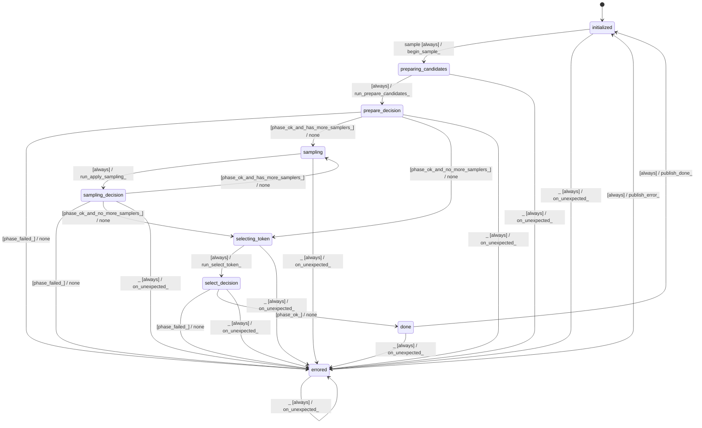

# logits_sampler

Source: [`emel/logits/sampler/sm.hpp`](https://github.com/stateforward/emel.cpp/blob/main/src/emel/logits/sampler/sm.hpp)

## Mermaid

## Transitions

| Source | Event | Guard | Action | Target |
| --- | --- | --- | --- | --- |
| [`initialized`](https://github.com/stateforward/emel.cpp/blob/main/src/emel/logits/sampler/sm.hpp) | [`sample`](https://github.com/stateforward/emel.cpp/blob/main/src/emel/logits/sampler/sm.hpp) | [`always`](https://github.com/stateforward/emel.cpp/blob/main/src/emel/logits/sampler/sm.hpp) | [`begin_sample>`](https://github.com/stateforward/emel.cpp/blob/main/src/emel/logits/sampler/sm.hpp) | [`preparing_candidates`](https://github.com/stateforward/emel.cpp/blob/main/src/emel/logits/sampler/sm.hpp) |
| [`preparing_candidates`](https://github.com/stateforward/emel.cpp/blob/main/src/emel/logits/sampler/sm.hpp) | - | [`always`](https://github.com/stateforward/emel.cpp/blob/main/src/emel/logits/sampler/sm.hpp) | [`run_prepare_candidates>`](https://github.com/stateforward/emel.cpp/blob/main/src/emel/logits/sampler/sm.hpp) | [`prepare_decision`](https://github.com/stateforward/emel.cpp/blob/main/src/emel/logits/sampler/sm.hpp) |
| [`prepare_decision`](https://github.com/stateforward/emel.cpp/blob/main/src/emel/logits/sampler/sm.hpp) | - | [`phase_failed>`](https://github.com/stateforward/emel.cpp/blob/main/src/emel/logits/sampler/sm.hpp) | [`none`](https://github.com/stateforward/emel.cpp/blob/main/src/emel/logits/sampler/sm.hpp) | [`errored`](https://github.com/stateforward/emel.cpp/blob/main/src/emel/logits/sampler/sm.hpp) |
| [`prepare_decision`](https://github.com/stateforward/emel.cpp/blob/main/src/emel/logits/sampler/sm.hpp) | - | [`phase_ok_and_has_more_samplers>`](https://github.com/stateforward/emel.cpp/blob/main/src/emel/logits/sampler/sm.hpp) | [`none`](https://github.com/stateforward/emel.cpp/blob/main/src/emel/logits/sampler/sm.hpp) | [`sampling`](https://github.com/stateforward/emel.cpp/blob/main/src/emel/logits/sampler/sm.hpp) |
| [`prepare_decision`](https://github.com/stateforward/emel.cpp/blob/main/src/emel/logits/sampler/sm.hpp) | - | [`phase_ok_and_no_more_samplers>`](https://github.com/stateforward/emel.cpp/blob/main/src/emel/logits/sampler/sm.hpp) | [`none`](https://github.com/stateforward/emel.cpp/blob/main/src/emel/logits/sampler/sm.hpp) | [`selecting_token`](https://github.com/stateforward/emel.cpp/blob/main/src/emel/logits/sampler/sm.hpp) |
| [`sampling`](https://github.com/stateforward/emel.cpp/blob/main/src/emel/logits/sampler/sm.hpp) | - | [`always`](https://github.com/stateforward/emel.cpp/blob/main/src/emel/logits/sampler/sm.hpp) | [`run_apply_sampling>`](https://github.com/stateforward/emel.cpp/blob/main/src/emel/logits/sampler/sm.hpp) | [`sampling_decision`](https://github.com/stateforward/emel.cpp/blob/main/src/emel/logits/sampler/sm.hpp) |
| [`sampling_decision`](https://github.com/stateforward/emel.cpp/blob/main/src/emel/logits/sampler/sm.hpp) | - | [`phase_failed>`](https://github.com/stateforward/emel.cpp/blob/main/src/emel/logits/sampler/sm.hpp) | [`none`](https://github.com/stateforward/emel.cpp/blob/main/src/emel/logits/sampler/sm.hpp) | [`errored`](https://github.com/stateforward/emel.cpp/blob/main/src/emel/logits/sampler/sm.hpp) |
| [`sampling_decision`](https://github.com/stateforward/emel.cpp/blob/main/src/emel/logits/sampler/sm.hpp) | - | [`phase_ok_and_has_more_samplers>`](https://github.com/stateforward/emel.cpp/blob/main/src/emel/logits/sampler/sm.hpp) | [`none`](https://github.com/stateforward/emel.cpp/blob/main/src/emel/logits/sampler/sm.hpp) | [`sampling`](https://github.com/stateforward/emel.cpp/blob/main/src/emel/logits/sampler/sm.hpp) |
| [`sampling_decision`](https://github.com/stateforward/emel.cpp/blob/main/src/emel/logits/sampler/sm.hpp) | - | [`phase_ok_and_no_more_samplers>`](https://github.com/stateforward/emel.cpp/blob/main/src/emel/logits/sampler/sm.hpp) | [`none`](https://github.com/stateforward/emel.cpp/blob/main/src/emel/logits/sampler/sm.hpp) | [`selecting_token`](https://github.com/stateforward/emel.cpp/blob/main/src/emel/logits/sampler/sm.hpp) |
| [`selecting_token`](https://github.com/stateforward/emel.cpp/blob/main/src/emel/logits/sampler/sm.hpp) | - | [`always`](https://github.com/stateforward/emel.cpp/blob/main/src/emel/logits/sampler/sm.hpp) | [`run_select_token>`](https://github.com/stateforward/emel.cpp/blob/main/src/emel/logits/sampler/sm.hpp) | [`select_decision`](https://github.com/stateforward/emel.cpp/blob/main/src/emel/logits/sampler/sm.hpp) |
| [`select_decision`](https://github.com/stateforward/emel.cpp/blob/main/src/emel/logits/sampler/sm.hpp) | - | [`phase_failed>`](https://github.com/stateforward/emel.cpp/blob/main/src/emel/logits/sampler/sm.hpp) | [`none`](https://github.com/stateforward/emel.cpp/blob/main/src/emel/logits/sampler/sm.hpp) | [`errored`](https://github.com/stateforward/emel.cpp/blob/main/src/emel/logits/sampler/sm.hpp) |
| [`select_decision`](https://github.com/stateforward/emel.cpp/blob/main/src/emel/logits/sampler/sm.hpp) | - | [`phase_ok>`](https://github.com/stateforward/emel.cpp/blob/main/src/emel/logits/sampler/sm.hpp) | [`none`](https://github.com/stateforward/emel.cpp/blob/main/src/emel/logits/sampler/sm.hpp) | [`done`](https://github.com/stateforward/emel.cpp/blob/main/src/emel/logits/sampler/sm.hpp) |
| [`done`](https://github.com/stateforward/emel.cpp/blob/main/src/emel/logits/sampler/sm.hpp) | - | [`always`](https://github.com/stateforward/emel.cpp/blob/main/src/emel/logits/sampler/sm.hpp) | [`publish_done>`](https://github.com/stateforward/emel.cpp/blob/main/src/emel/logits/sampler/sm.hpp) | [`initialized`](https://github.com/stateforward/emel.cpp/blob/main/src/emel/logits/sampler/sm.hpp) |
| [`errored`](https://github.com/stateforward/emel.cpp/blob/main/src/emel/logits/sampler/sm.hpp) | - | [`always`](https://github.com/stateforward/emel.cpp/blob/main/src/emel/logits/sampler/sm.hpp) | [`publish_error>`](https://github.com/stateforward/emel.cpp/blob/main/src/emel/logits/sampler/sm.hpp) | [`initialized`](https://github.com/stateforward/emel.cpp/blob/main/src/emel/logits/sampler/sm.hpp) |
| [`initialized`](https://github.com/stateforward/emel.cpp/blob/main/src/emel/logits/sampler/sm.hpp) | [`_`](https://github.com/stateforward/emel.cpp/blob/main/src/emel/logits/sampler/sm.hpp) | [`always`](https://github.com/stateforward/emel.cpp/blob/main/src/emel/logits/sampler/sm.hpp) | [`on_unexpected>`](https://github.com/stateforward/emel.cpp/blob/main/src/emel/logits/sampler/sm.hpp) | [`errored`](https://github.com/stateforward/emel.cpp/blob/main/src/emel/logits/sampler/sm.hpp) |
| [`preparing_candidates`](https://github.com/stateforward/emel.cpp/blob/main/src/emel/logits/sampler/sm.hpp) | [`_`](https://github.com/stateforward/emel.cpp/blob/main/src/emel/logits/sampler/sm.hpp) | [`always`](https://github.com/stateforward/emel.cpp/blob/main/src/emel/logits/sampler/sm.hpp) | [`on_unexpected>`](https://github.com/stateforward/emel.cpp/blob/main/src/emel/logits/sampler/sm.hpp) | [`errored`](https://github.com/stateforward/emel.cpp/blob/main/src/emel/logits/sampler/sm.hpp) |
| [`prepare_decision`](https://github.com/stateforward/emel.cpp/blob/main/src/emel/logits/sampler/sm.hpp) | [`_`](https://github.com/stateforward/emel.cpp/blob/main/src/emel/logits/sampler/sm.hpp) | [`always`](https://github.com/stateforward/emel.cpp/blob/main/src/emel/logits/sampler/sm.hpp) | [`on_unexpected>`](https://github.com/stateforward/emel.cpp/blob/main/src/emel/logits/sampler/sm.hpp) | [`errored`](https://github.com/stateforward/emel.cpp/blob/main/src/emel/logits/sampler/sm.hpp) |
| [`sampling`](https://github.com/stateforward/emel.cpp/blob/main/src/emel/logits/sampler/sm.hpp) | [`_`](https://github.com/stateforward/emel.cpp/blob/main/src/emel/logits/sampler/sm.hpp) | [`always`](https://github.com/stateforward/emel.cpp/blob/main/src/emel/logits/sampler/sm.hpp) | [`on_unexpected>`](https://github.com/stateforward/emel.cpp/blob/main/src/emel/logits/sampler/sm.hpp) | [`errored`](https://github.com/stateforward/emel.cpp/blob/main/src/emel/logits/sampler/sm.hpp) |
| [`sampling_decision`](https://github.com/stateforward/emel.cpp/blob/main/src/emel/logits/sampler/sm.hpp) | [`_`](https://github.com/stateforward/emel.cpp/blob/main/src/emel/logits/sampler/sm.hpp) | [`always`](https://github.com/stateforward/emel.cpp/blob/main/src/emel/logits/sampler/sm.hpp) | [`on_unexpected>`](https://github.com/stateforward/emel.cpp/blob/main/src/emel/logits/sampler/sm.hpp) | [`errored`](https://github.com/stateforward/emel.cpp/blob/main/src/emel/logits/sampler/sm.hpp) |
| [`selecting_token`](https://github.com/stateforward/emel.cpp/blob/main/src/emel/logits/sampler/sm.hpp) | [`_`](https://github.com/stateforward/emel.cpp/blob/main/src/emel/logits/sampler/sm.hpp) | [`always`](https://github.com/stateforward/emel.cpp/blob/main/src/emel/logits/sampler/sm.hpp) | [`on_unexpected>`](https://github.com/stateforward/emel.cpp/blob/main/src/emel/logits/sampler/sm.hpp) | [`errored`](https://github.com/stateforward/emel.cpp/blob/main/src/emel/logits/sampler/sm.hpp) |
| [`select_decision`](https://github.com/stateforward/emel.cpp/blob/main/src/emel/logits/sampler/sm.hpp) | [`_`](https://github.com/stateforward/emel.cpp/blob/main/src/emel/logits/sampler/sm.hpp) | [`always`](https://github.com/stateforward/emel.cpp/blob/main/src/emel/logits/sampler/sm.hpp) | [`on_unexpected>`](https://github.com/stateforward/emel.cpp/blob/main/src/emel/logits/sampler/sm.hpp) | [`errored`](https://github.com/stateforward/emel.cpp/blob/main/src/emel/logits/sampler/sm.hpp) |
| [`done`](https://github.com/stateforward/emel.cpp/blob/main/src/emel/logits/sampler/sm.hpp) | [`_`](https://github.com/stateforward/emel.cpp/blob/main/src/emel/logits/sampler/sm.hpp) | [`always`](https://github.com/stateforward/emel.cpp/blob/main/src/emel/logits/sampler/sm.hpp) | [`on_unexpected>`](https://github.com/stateforward/emel.cpp/blob/main/src/emel/logits/sampler/sm.hpp) | [`errored`](https://github.com/stateforward/emel.cpp/blob/main/src/emel/logits/sampler/sm.hpp) |
| [`errored`](https://github.com/stateforward/emel.cpp/blob/main/src/emel/logits/sampler/sm.hpp) | [`_`](https://github.com/stateforward/emel.cpp/blob/main/src/emel/logits/sampler/sm.hpp) | [`always`](https://github.com/stateforward/emel.cpp/blob/main/src/emel/logits/sampler/sm.hpp) | [`on_unexpected>`](https://github.com/stateforward/emel.cpp/blob/main/src/emel/logits/sampler/sm.hpp) | [`errored`](https://github.com/stateforward/emel.cpp/blob/main/src/emel/logits/sampler/sm.hpp) |
