# memory_coordinator_recurrent

Source: [`emel/memory/coordinator/recurrent/sm.hpp`](https://github.com/stateforward/emel.cpp/blob/main/src/emel/memory/coordinator/recurrent/sm.hpp)

## Mermaid

```mermaid
stateDiagram-v2
  direction TB
  [*] --> initialized
  initialized --> validating_update : prepare_update [always] / lambda_actions_55_46
  initialized --> validating_batch : prepare_batch [always] / lambda_actions_66_45
  initialized --> validating_full : prepare_full [always] / lambda_actions_77_44
  validating_update --> preparing_update : [valid_update_context_] / none
  validating_update --> errored : [invalid_update_context_] / lambda_actions_88_46
  validating_batch --> preparing_batch : [valid_batch_context_] / none
  validating_batch --> errored : [invalid_batch_context_] / lambda_actions_88_46
  validating_full --> preparing_full : [valid_full_context_] / none
  validating_full --> errored : [invalid_full_context_] / lambda_actions_88_46
  preparing_update --> prepare_update_decision : [always] / lambda_actions_98_50
  prepare_update_decision --> errored : [phase_failed_] / none
  prepare_update_decision --> applying_update : [prepare_update_success_] / none
  prepare_update_decision --> publishing_update : [prepare_update_no_update_] / none
  prepare_update_decision --> errored : [prepare_update_invalid_status_] / lambda_actions_93_43
  preparing_batch --> prepare_batch_decision : [always] / lambda_actions_117_49
  prepare_batch_decision --> errored : [phase_failed_] / none
  prepare_batch_decision --> publishing_batch : [phase_ok_] / none
  preparing_full --> prepare_full_decision : [always] / lambda_actions_133_48
  prepare_full_decision --> errored : [phase_failed_] / none
  prepare_full_decision --> publishing_full : [phase_ok_] / none
  applying_update --> apply_update_decision : [apply_update_ready_] / lambda_actions_149_48
  applying_update --> errored : [apply_update_backend_failed_] / lambda_actions_93_43
  applying_update --> errored : [apply_update_invalid_context_] / lambda_actions_88_46
  apply_update_decision --> errored : [phase_failed_] / none
  apply_update_decision --> publishing_update : [phase_ok_] / none
  publishing_update --> publish_update_decision : [valid_publish_update_context_] / lambda_actions_155_50
  publishing_update --> errored : [invalid_publish_update_context_] / lambda_actions_88_46
  publish_update_decision --> errored : [phase_failed_] / none
  publish_update_decision --> done : [phase_ok_] / none
  publishing_batch --> publish_batch_decision : [valid_publish_batch_context_] / lambda_actions_159_49
  publishing_batch --> errored : [invalid_publish_batch_context_] / lambda_actions_88_46
  publish_batch_decision --> errored : [phase_failed_] / none
  publish_batch_decision --> done : [phase_ok_] / none
  publishing_full --> publish_full_decision : [valid_publish_full_context_] / lambda_actions_163_48
  publishing_full --> errored : [invalid_publish_full_context_] / lambda_actions_88_46
  publish_full_decision --> errored : [phase_failed_] / none
  publish_full_decision --> done : [phase_ok_] / none
  done --> initialized : [always] / lambda_actions_167_35
  errored --> initialized : [always] / ensure_last_error_
  initialized --> errored : _ [always] / on_unexpected_
  validating_update --> errored : _ [always] / on_unexpected_
  validating_batch --> errored : _ [always] / on_unexpected_
  validating_full --> errored : _ [always] / on_unexpected_
  preparing_update --> errored : _ [always] / on_unexpected_
  prepare_update_decision --> errored : _ [always] / on_unexpected_
  preparing_batch --> errored : _ [always] / on_unexpected_
  prepare_batch_decision --> errored : _ [always] / on_unexpected_
  preparing_full --> errored : _ [always] / on_unexpected_
  prepare_full_decision --> errored : _ [always] / on_unexpected_
  applying_update --> errored : _ [always] / on_unexpected_
  apply_update_decision --> errored : _ [always] / on_unexpected_
  publishing_update --> errored : _ [always] / on_unexpected_
  publish_update_decision --> errored : _ [always] / on_unexpected_
  publishing_batch --> errored : _ [always] / on_unexpected_
  publish_batch_decision --> errored : _ [always] / on_unexpected_
  publishing_full --> errored : _ [always] / on_unexpected_
  publish_full_decision --> errored : _ [always] / on_unexpected_
  done --> errored : _ [always] / on_unexpected_
  errored --> errored : _ [always] / on_unexpected_
```

## Transitions

| Source | Event | Guard | Action | Target |
| --- | --- | --- | --- | --- |
| [`initialized`](https://github.com/stateforward/emel.cpp/blob/main/src/emel/memory/coordinator/recurrent/sm.hpp) | [`prepare_update`](https://github.com/stateforward/emel.cpp/blob/main/src/emel/memory/coordinator/recurrent/sm.hpp) | [`always`](https://github.com/stateforward/emel.cpp/blob/main/src/emel/memory/coordinator/recurrent/sm.hpp) | [`lambda_actions_55_46`](https://github.com/stateforward/emel.cpp/blob/main/src/emel/memory/coordinator/recurrent/sm.hpp) | [`validating_update`](https://github.com/stateforward/emel.cpp/blob/main/src/emel/memory/coordinator/recurrent/sm.hpp) |
| [`initialized`](https://github.com/stateforward/emel.cpp/blob/main/src/emel/memory/coordinator/recurrent/sm.hpp) | [`prepare_batch`](https://github.com/stateforward/emel.cpp/blob/main/src/emel/memory/coordinator/recurrent/sm.hpp) | [`always`](https://github.com/stateforward/emel.cpp/blob/main/src/emel/memory/coordinator/recurrent/sm.hpp) | [`lambda_actions_66_45`](https://github.com/stateforward/emel.cpp/blob/main/src/emel/memory/coordinator/recurrent/sm.hpp) | [`validating_batch`](https://github.com/stateforward/emel.cpp/blob/main/src/emel/memory/coordinator/recurrent/sm.hpp) |
| [`initialized`](https://github.com/stateforward/emel.cpp/blob/main/src/emel/memory/coordinator/recurrent/sm.hpp) | [`prepare_full`](https://github.com/stateforward/emel.cpp/blob/main/src/emel/memory/coordinator/recurrent/sm.hpp) | [`always`](https://github.com/stateforward/emel.cpp/blob/main/src/emel/memory/coordinator/recurrent/sm.hpp) | [`lambda_actions_77_44`](https://github.com/stateforward/emel.cpp/blob/main/src/emel/memory/coordinator/recurrent/sm.hpp) | [`validating_full`](https://github.com/stateforward/emel.cpp/blob/main/src/emel/memory/coordinator/recurrent/sm.hpp) |
| [`validating_update`](https://github.com/stateforward/emel.cpp/blob/main/src/emel/memory/coordinator/recurrent/sm.hpp) | - | [`valid_update_context>`](https://github.com/stateforward/emel.cpp/blob/main/src/emel/memory/coordinator/recurrent/sm.hpp) | [`none`](https://github.com/stateforward/emel.cpp/blob/main/src/emel/memory/coordinator/recurrent/sm.hpp) | [`preparing_update`](https://github.com/stateforward/emel.cpp/blob/main/src/emel/memory/coordinator/recurrent/sm.hpp) |
| [`validating_update`](https://github.com/stateforward/emel.cpp/blob/main/src/emel/memory/coordinator/recurrent/sm.hpp) | - | [`invalid_update_context>`](https://github.com/stateforward/emel.cpp/blob/main/src/emel/memory/coordinator/recurrent/sm.hpp) | [`lambda_actions_88_46`](https://github.com/stateforward/emel.cpp/blob/main/src/emel/memory/coordinator/recurrent/sm.hpp) | [`errored`](https://github.com/stateforward/emel.cpp/blob/main/src/emel/memory/coordinator/recurrent/sm.hpp) |
| [`validating_batch`](https://github.com/stateforward/emel.cpp/blob/main/src/emel/memory/coordinator/recurrent/sm.hpp) | - | [`valid_batch_context>`](https://github.com/stateforward/emel.cpp/blob/main/src/emel/memory/coordinator/recurrent/sm.hpp) | [`none`](https://github.com/stateforward/emel.cpp/blob/main/src/emel/memory/coordinator/recurrent/sm.hpp) | [`preparing_batch`](https://github.com/stateforward/emel.cpp/blob/main/src/emel/memory/coordinator/recurrent/sm.hpp) |
| [`validating_batch`](https://github.com/stateforward/emel.cpp/blob/main/src/emel/memory/coordinator/recurrent/sm.hpp) | - | [`invalid_batch_context>`](https://github.com/stateforward/emel.cpp/blob/main/src/emel/memory/coordinator/recurrent/sm.hpp) | [`lambda_actions_88_46`](https://github.com/stateforward/emel.cpp/blob/main/src/emel/memory/coordinator/recurrent/sm.hpp) | [`errored`](https://github.com/stateforward/emel.cpp/blob/main/src/emel/memory/coordinator/recurrent/sm.hpp) |
| [`validating_full`](https://github.com/stateforward/emel.cpp/blob/main/src/emel/memory/coordinator/recurrent/sm.hpp) | - | [`valid_full_context>`](https://github.com/stateforward/emel.cpp/blob/main/src/emel/memory/coordinator/recurrent/sm.hpp) | [`none`](https://github.com/stateforward/emel.cpp/blob/main/src/emel/memory/coordinator/recurrent/sm.hpp) | [`preparing_full`](https://github.com/stateforward/emel.cpp/blob/main/src/emel/memory/coordinator/recurrent/sm.hpp) |
| [`validating_full`](https://github.com/stateforward/emel.cpp/blob/main/src/emel/memory/coordinator/recurrent/sm.hpp) | - | [`invalid_full_context>`](https://github.com/stateforward/emel.cpp/blob/main/src/emel/memory/coordinator/recurrent/sm.hpp) | [`lambda_actions_88_46`](https://github.com/stateforward/emel.cpp/blob/main/src/emel/memory/coordinator/recurrent/sm.hpp) | [`errored`](https://github.com/stateforward/emel.cpp/blob/main/src/emel/memory/coordinator/recurrent/sm.hpp) |
| [`preparing_update`](https://github.com/stateforward/emel.cpp/blob/main/src/emel/memory/coordinator/recurrent/sm.hpp) | - | [`always`](https://github.com/stateforward/emel.cpp/blob/main/src/emel/memory/coordinator/recurrent/sm.hpp) | [`lambda_actions_98_50`](https://github.com/stateforward/emel.cpp/blob/main/src/emel/memory/coordinator/recurrent/sm.hpp) | [`prepare_update_decision`](https://github.com/stateforward/emel.cpp/blob/main/src/emel/memory/coordinator/recurrent/sm.hpp) |
| [`prepare_update_decision`](https://github.com/stateforward/emel.cpp/blob/main/src/emel/memory/coordinator/recurrent/sm.hpp) | - | [`phase_failed>`](https://github.com/stateforward/emel.cpp/blob/main/src/emel/memory/coordinator/recurrent/sm.hpp) | [`none`](https://github.com/stateforward/emel.cpp/blob/main/src/emel/memory/coordinator/recurrent/sm.hpp) | [`errored`](https://github.com/stateforward/emel.cpp/blob/main/src/emel/memory/coordinator/recurrent/sm.hpp) |
| [`prepare_update_decision`](https://github.com/stateforward/emel.cpp/blob/main/src/emel/memory/coordinator/recurrent/sm.hpp) | - | [`prepare_update_success>`](https://github.com/stateforward/emel.cpp/blob/main/src/emel/memory/coordinator/recurrent/sm.hpp) | [`none`](https://github.com/stateforward/emel.cpp/blob/main/src/emel/memory/coordinator/recurrent/sm.hpp) | [`applying_update`](https://github.com/stateforward/emel.cpp/blob/main/src/emel/memory/coordinator/recurrent/sm.hpp) |
| [`prepare_update_decision`](https://github.com/stateforward/emel.cpp/blob/main/src/emel/memory/coordinator/recurrent/sm.hpp) | - | [`prepare_update_no_update>`](https://github.com/stateforward/emel.cpp/blob/main/src/emel/memory/coordinator/recurrent/sm.hpp) | [`none`](https://github.com/stateforward/emel.cpp/blob/main/src/emel/memory/coordinator/recurrent/sm.hpp) | [`publishing_update`](https://github.com/stateforward/emel.cpp/blob/main/src/emel/memory/coordinator/recurrent/sm.hpp) |
| [`prepare_update_decision`](https://github.com/stateforward/emel.cpp/blob/main/src/emel/memory/coordinator/recurrent/sm.hpp) | - | [`prepare_update_invalid_status>`](https://github.com/stateforward/emel.cpp/blob/main/src/emel/memory/coordinator/recurrent/sm.hpp) | [`lambda_actions_93_43`](https://github.com/stateforward/emel.cpp/blob/main/src/emel/memory/coordinator/recurrent/sm.hpp) | [`errored`](https://github.com/stateforward/emel.cpp/blob/main/src/emel/memory/coordinator/recurrent/sm.hpp) |
| [`preparing_batch`](https://github.com/stateforward/emel.cpp/blob/main/src/emel/memory/coordinator/recurrent/sm.hpp) | - | [`always`](https://github.com/stateforward/emel.cpp/blob/main/src/emel/memory/coordinator/recurrent/sm.hpp) | [`lambda_actions_117_49`](https://github.com/stateforward/emel.cpp/blob/main/src/emel/memory/coordinator/recurrent/sm.hpp) | [`prepare_batch_decision`](https://github.com/stateforward/emel.cpp/blob/main/src/emel/memory/coordinator/recurrent/sm.hpp) |
| [`prepare_batch_decision`](https://github.com/stateforward/emel.cpp/blob/main/src/emel/memory/coordinator/recurrent/sm.hpp) | - | [`phase_failed>`](https://github.com/stateforward/emel.cpp/blob/main/src/emel/memory/coordinator/recurrent/sm.hpp) | [`none`](https://github.com/stateforward/emel.cpp/blob/main/src/emel/memory/coordinator/recurrent/sm.hpp) | [`errored`](https://github.com/stateforward/emel.cpp/blob/main/src/emel/memory/coordinator/recurrent/sm.hpp) |
| [`prepare_batch_decision`](https://github.com/stateforward/emel.cpp/blob/main/src/emel/memory/coordinator/recurrent/sm.hpp) | - | [`phase_ok>`](https://github.com/stateforward/emel.cpp/blob/main/src/emel/memory/coordinator/recurrent/sm.hpp) | [`none`](https://github.com/stateforward/emel.cpp/blob/main/src/emel/memory/coordinator/recurrent/sm.hpp) | [`publishing_batch`](https://github.com/stateforward/emel.cpp/blob/main/src/emel/memory/coordinator/recurrent/sm.hpp) |
| [`preparing_full`](https://github.com/stateforward/emel.cpp/blob/main/src/emel/memory/coordinator/recurrent/sm.hpp) | - | [`always`](https://github.com/stateforward/emel.cpp/blob/main/src/emel/memory/coordinator/recurrent/sm.hpp) | [`lambda_actions_133_48`](https://github.com/stateforward/emel.cpp/blob/main/src/emel/memory/coordinator/recurrent/sm.hpp) | [`prepare_full_decision`](https://github.com/stateforward/emel.cpp/blob/main/src/emel/memory/coordinator/recurrent/sm.hpp) |
| [`prepare_full_decision`](https://github.com/stateforward/emel.cpp/blob/main/src/emel/memory/coordinator/recurrent/sm.hpp) | - | [`phase_failed>`](https://github.com/stateforward/emel.cpp/blob/main/src/emel/memory/coordinator/recurrent/sm.hpp) | [`none`](https://github.com/stateforward/emel.cpp/blob/main/src/emel/memory/coordinator/recurrent/sm.hpp) | [`errored`](https://github.com/stateforward/emel.cpp/blob/main/src/emel/memory/coordinator/recurrent/sm.hpp) |
| [`prepare_full_decision`](https://github.com/stateforward/emel.cpp/blob/main/src/emel/memory/coordinator/recurrent/sm.hpp) | - | [`phase_ok>`](https://github.com/stateforward/emel.cpp/blob/main/src/emel/memory/coordinator/recurrent/sm.hpp) | [`none`](https://github.com/stateforward/emel.cpp/blob/main/src/emel/memory/coordinator/recurrent/sm.hpp) | [`publishing_full`](https://github.com/stateforward/emel.cpp/blob/main/src/emel/memory/coordinator/recurrent/sm.hpp) |
| [`applying_update`](https://github.com/stateforward/emel.cpp/blob/main/src/emel/memory/coordinator/recurrent/sm.hpp) | - | [`apply_update_ready>`](https://github.com/stateforward/emel.cpp/blob/main/src/emel/memory/coordinator/recurrent/sm.hpp) | [`lambda_actions_149_48`](https://github.com/stateforward/emel.cpp/blob/main/src/emel/memory/coordinator/recurrent/sm.hpp) | [`apply_update_decision`](https://github.com/stateforward/emel.cpp/blob/main/src/emel/memory/coordinator/recurrent/sm.hpp) |
| [`applying_update`](https://github.com/stateforward/emel.cpp/blob/main/src/emel/memory/coordinator/recurrent/sm.hpp) | - | [`apply_update_backend_failed>`](https://github.com/stateforward/emel.cpp/blob/main/src/emel/memory/coordinator/recurrent/sm.hpp) | [`lambda_actions_93_43`](https://github.com/stateforward/emel.cpp/blob/main/src/emel/memory/coordinator/recurrent/sm.hpp) | [`errored`](https://github.com/stateforward/emel.cpp/blob/main/src/emel/memory/coordinator/recurrent/sm.hpp) |
| [`applying_update`](https://github.com/stateforward/emel.cpp/blob/main/src/emel/memory/coordinator/recurrent/sm.hpp) | - | [`apply_update_invalid_context>`](https://github.com/stateforward/emel.cpp/blob/main/src/emel/memory/coordinator/recurrent/sm.hpp) | [`lambda_actions_88_46`](https://github.com/stateforward/emel.cpp/blob/main/src/emel/memory/coordinator/recurrent/sm.hpp) | [`errored`](https://github.com/stateforward/emel.cpp/blob/main/src/emel/memory/coordinator/recurrent/sm.hpp) |
| [`apply_update_decision`](https://github.com/stateforward/emel.cpp/blob/main/src/emel/memory/coordinator/recurrent/sm.hpp) | - | [`phase_failed>`](https://github.com/stateforward/emel.cpp/blob/main/src/emel/memory/coordinator/recurrent/sm.hpp) | [`none`](https://github.com/stateforward/emel.cpp/blob/main/src/emel/memory/coordinator/recurrent/sm.hpp) | [`errored`](https://github.com/stateforward/emel.cpp/blob/main/src/emel/memory/coordinator/recurrent/sm.hpp) |
| [`apply_update_decision`](https://github.com/stateforward/emel.cpp/blob/main/src/emel/memory/coordinator/recurrent/sm.hpp) | - | [`phase_ok>`](https://github.com/stateforward/emel.cpp/blob/main/src/emel/memory/coordinator/recurrent/sm.hpp) | [`none`](https://github.com/stateforward/emel.cpp/blob/main/src/emel/memory/coordinator/recurrent/sm.hpp) | [`publishing_update`](https://github.com/stateforward/emel.cpp/blob/main/src/emel/memory/coordinator/recurrent/sm.hpp) |
| [`publishing_update`](https://github.com/stateforward/emel.cpp/blob/main/src/emel/memory/coordinator/recurrent/sm.hpp) | - | [`valid_publish_update_context>`](https://github.com/stateforward/emel.cpp/blob/main/src/emel/memory/coordinator/recurrent/sm.hpp) | [`lambda_actions_155_50`](https://github.com/stateforward/emel.cpp/blob/main/src/emel/memory/coordinator/recurrent/sm.hpp) | [`publish_update_decision`](https://github.com/stateforward/emel.cpp/blob/main/src/emel/memory/coordinator/recurrent/sm.hpp) |
| [`publishing_update`](https://github.com/stateforward/emel.cpp/blob/main/src/emel/memory/coordinator/recurrent/sm.hpp) | - | [`invalid_publish_update_context>`](https://github.com/stateforward/emel.cpp/blob/main/src/emel/memory/coordinator/recurrent/sm.hpp) | [`lambda_actions_88_46`](https://github.com/stateforward/emel.cpp/blob/main/src/emel/memory/coordinator/recurrent/sm.hpp) | [`errored`](https://github.com/stateforward/emel.cpp/blob/main/src/emel/memory/coordinator/recurrent/sm.hpp) |
| [`publish_update_decision`](https://github.com/stateforward/emel.cpp/blob/main/src/emel/memory/coordinator/recurrent/sm.hpp) | - | [`phase_failed>`](https://github.com/stateforward/emel.cpp/blob/main/src/emel/memory/coordinator/recurrent/sm.hpp) | [`none`](https://github.com/stateforward/emel.cpp/blob/main/src/emel/memory/coordinator/recurrent/sm.hpp) | [`errored`](https://github.com/stateforward/emel.cpp/blob/main/src/emel/memory/coordinator/recurrent/sm.hpp) |
| [`publish_update_decision`](https://github.com/stateforward/emel.cpp/blob/main/src/emel/memory/coordinator/recurrent/sm.hpp) | - | [`phase_ok>`](https://github.com/stateforward/emel.cpp/blob/main/src/emel/memory/coordinator/recurrent/sm.hpp) | [`none`](https://github.com/stateforward/emel.cpp/blob/main/src/emel/memory/coordinator/recurrent/sm.hpp) | [`done`](https://github.com/stateforward/emel.cpp/blob/main/src/emel/memory/coordinator/recurrent/sm.hpp) |
| [`publishing_batch`](https://github.com/stateforward/emel.cpp/blob/main/src/emel/memory/coordinator/recurrent/sm.hpp) | - | [`valid_publish_batch_context>`](https://github.com/stateforward/emel.cpp/blob/main/src/emel/memory/coordinator/recurrent/sm.hpp) | [`lambda_actions_159_49`](https://github.com/stateforward/emel.cpp/blob/main/src/emel/memory/coordinator/recurrent/sm.hpp) | [`publish_batch_decision`](https://github.com/stateforward/emel.cpp/blob/main/src/emel/memory/coordinator/recurrent/sm.hpp) |
| [`publishing_batch`](https://github.com/stateforward/emel.cpp/blob/main/src/emel/memory/coordinator/recurrent/sm.hpp) | - | [`invalid_publish_batch_context>`](https://github.com/stateforward/emel.cpp/blob/main/src/emel/memory/coordinator/recurrent/sm.hpp) | [`lambda_actions_88_46`](https://github.com/stateforward/emel.cpp/blob/main/src/emel/memory/coordinator/recurrent/sm.hpp) | [`errored`](https://github.com/stateforward/emel.cpp/blob/main/src/emel/memory/coordinator/recurrent/sm.hpp) |
| [`publish_batch_decision`](https://github.com/stateforward/emel.cpp/blob/main/src/emel/memory/coordinator/recurrent/sm.hpp) | - | [`phase_failed>`](https://github.com/stateforward/emel.cpp/blob/main/src/emel/memory/coordinator/recurrent/sm.hpp) | [`none`](https://github.com/stateforward/emel.cpp/blob/main/src/emel/memory/coordinator/recurrent/sm.hpp) | [`errored`](https://github.com/stateforward/emel.cpp/blob/main/src/emel/memory/coordinator/recurrent/sm.hpp) |
| [`publish_batch_decision`](https://github.com/stateforward/emel.cpp/blob/main/src/emel/memory/coordinator/recurrent/sm.hpp) | - | [`phase_ok>`](https://github.com/stateforward/emel.cpp/blob/main/src/emel/memory/coordinator/recurrent/sm.hpp) | [`none`](https://github.com/stateforward/emel.cpp/blob/main/src/emel/memory/coordinator/recurrent/sm.hpp) | [`done`](https://github.com/stateforward/emel.cpp/blob/main/src/emel/memory/coordinator/recurrent/sm.hpp) |
| [`publishing_full`](https://github.com/stateforward/emel.cpp/blob/main/src/emel/memory/coordinator/recurrent/sm.hpp) | - | [`valid_publish_full_context>`](https://github.com/stateforward/emel.cpp/blob/main/src/emel/memory/coordinator/recurrent/sm.hpp) | [`lambda_actions_163_48`](https://github.com/stateforward/emel.cpp/blob/main/src/emel/memory/coordinator/recurrent/sm.hpp) | [`publish_full_decision`](https://github.com/stateforward/emel.cpp/blob/main/src/emel/memory/coordinator/recurrent/sm.hpp) |
| [`publishing_full`](https://github.com/stateforward/emel.cpp/blob/main/src/emel/memory/coordinator/recurrent/sm.hpp) | - | [`invalid_publish_full_context>`](https://github.com/stateforward/emel.cpp/blob/main/src/emel/memory/coordinator/recurrent/sm.hpp) | [`lambda_actions_88_46`](https://github.com/stateforward/emel.cpp/blob/main/src/emel/memory/coordinator/recurrent/sm.hpp) | [`errored`](https://github.com/stateforward/emel.cpp/blob/main/src/emel/memory/coordinator/recurrent/sm.hpp) |
| [`publish_full_decision`](https://github.com/stateforward/emel.cpp/blob/main/src/emel/memory/coordinator/recurrent/sm.hpp) | - | [`phase_failed>`](https://github.com/stateforward/emel.cpp/blob/main/src/emel/memory/coordinator/recurrent/sm.hpp) | [`none`](https://github.com/stateforward/emel.cpp/blob/main/src/emel/memory/coordinator/recurrent/sm.hpp) | [`errored`](https://github.com/stateforward/emel.cpp/blob/main/src/emel/memory/coordinator/recurrent/sm.hpp) |
| [`publish_full_decision`](https://github.com/stateforward/emel.cpp/blob/main/src/emel/memory/coordinator/recurrent/sm.hpp) | - | [`phase_ok>`](https://github.com/stateforward/emel.cpp/blob/main/src/emel/memory/coordinator/recurrent/sm.hpp) | [`none`](https://github.com/stateforward/emel.cpp/blob/main/src/emel/memory/coordinator/recurrent/sm.hpp) | [`done`](https://github.com/stateforward/emel.cpp/blob/main/src/emel/memory/coordinator/recurrent/sm.hpp) |
| [`done`](https://github.com/stateforward/emel.cpp/blob/main/src/emel/memory/coordinator/recurrent/sm.hpp) | - | [`always`](https://github.com/stateforward/emel.cpp/blob/main/src/emel/memory/coordinator/recurrent/sm.hpp) | [`lambda_actions_167_35`](https://github.com/stateforward/emel.cpp/blob/main/src/emel/memory/coordinator/recurrent/sm.hpp) | [`initialized`](https://github.com/stateforward/emel.cpp/blob/main/src/emel/memory/coordinator/recurrent/sm.hpp) |
| [`errored`](https://github.com/stateforward/emel.cpp/blob/main/src/emel/memory/coordinator/recurrent/sm.hpp) | - | [`always`](https://github.com/stateforward/emel.cpp/blob/main/src/emel/memory/coordinator/recurrent/sm.hpp) | [`ensure_last_error>`](https://github.com/stateforward/emel.cpp/blob/main/src/emel/memory/coordinator/recurrent/sm.hpp) | [`initialized`](https://github.com/stateforward/emel.cpp/blob/main/src/emel/memory/coordinator/recurrent/sm.hpp) |
| [`initialized`](https://github.com/stateforward/emel.cpp/blob/main/src/emel/memory/coordinator/recurrent/sm.hpp) | [`_`](https://github.com/stateforward/emel.cpp/blob/main/src/emel/memory/coordinator/recurrent/sm.hpp) | [`always`](https://github.com/stateforward/emel.cpp/blob/main/src/emel/memory/coordinator/recurrent/sm.hpp) | [`on_unexpected>`](https://github.com/stateforward/emel.cpp/blob/main/src/emel/memory/coordinator/recurrent/sm.hpp) | [`errored`](https://github.com/stateforward/emel.cpp/blob/main/src/emel/memory/coordinator/recurrent/sm.hpp) |
| [`validating_update`](https://github.com/stateforward/emel.cpp/blob/main/src/emel/memory/coordinator/recurrent/sm.hpp) | [`_`](https://github.com/stateforward/emel.cpp/blob/main/src/emel/memory/coordinator/recurrent/sm.hpp) | [`always`](https://github.com/stateforward/emel.cpp/blob/main/src/emel/memory/coordinator/recurrent/sm.hpp) | [`on_unexpected>`](https://github.com/stateforward/emel.cpp/blob/main/src/emel/memory/coordinator/recurrent/sm.hpp) | [`errored`](https://github.com/stateforward/emel.cpp/blob/main/src/emel/memory/coordinator/recurrent/sm.hpp) |
| [`validating_batch`](https://github.com/stateforward/emel.cpp/blob/main/src/emel/memory/coordinator/recurrent/sm.hpp) | [`_`](https://github.com/stateforward/emel.cpp/blob/main/src/emel/memory/coordinator/recurrent/sm.hpp) | [`always`](https://github.com/stateforward/emel.cpp/blob/main/src/emel/memory/coordinator/recurrent/sm.hpp) | [`on_unexpected>`](https://github.com/stateforward/emel.cpp/blob/main/src/emel/memory/coordinator/recurrent/sm.hpp) | [`errored`](https://github.com/stateforward/emel.cpp/blob/main/src/emel/memory/coordinator/recurrent/sm.hpp) |
| [`validating_full`](https://github.com/stateforward/emel.cpp/blob/main/src/emel/memory/coordinator/recurrent/sm.hpp) | [`_`](https://github.com/stateforward/emel.cpp/blob/main/src/emel/memory/coordinator/recurrent/sm.hpp) | [`always`](https://github.com/stateforward/emel.cpp/blob/main/src/emel/memory/coordinator/recurrent/sm.hpp) | [`on_unexpected>`](https://github.com/stateforward/emel.cpp/blob/main/src/emel/memory/coordinator/recurrent/sm.hpp) | [`errored`](https://github.com/stateforward/emel.cpp/blob/main/src/emel/memory/coordinator/recurrent/sm.hpp) |
| [`preparing_update`](https://github.com/stateforward/emel.cpp/blob/main/src/emel/memory/coordinator/recurrent/sm.hpp) | [`_`](https://github.com/stateforward/emel.cpp/blob/main/src/emel/memory/coordinator/recurrent/sm.hpp) | [`always`](https://github.com/stateforward/emel.cpp/blob/main/src/emel/memory/coordinator/recurrent/sm.hpp) | [`on_unexpected>`](https://github.com/stateforward/emel.cpp/blob/main/src/emel/memory/coordinator/recurrent/sm.hpp) | [`errored`](https://github.com/stateforward/emel.cpp/blob/main/src/emel/memory/coordinator/recurrent/sm.hpp) |
| [`prepare_update_decision`](https://github.com/stateforward/emel.cpp/blob/main/src/emel/memory/coordinator/recurrent/sm.hpp) | [`_`](https://github.com/stateforward/emel.cpp/blob/main/src/emel/memory/coordinator/recurrent/sm.hpp) | [`always`](https://github.com/stateforward/emel.cpp/blob/main/src/emel/memory/coordinator/recurrent/sm.hpp) | [`on_unexpected>`](https://github.com/stateforward/emel.cpp/blob/main/src/emel/memory/coordinator/recurrent/sm.hpp) | [`errored`](https://github.com/stateforward/emel.cpp/blob/main/src/emel/memory/coordinator/recurrent/sm.hpp) |
| [`preparing_batch`](https://github.com/stateforward/emel.cpp/blob/main/src/emel/memory/coordinator/recurrent/sm.hpp) | [`_`](https://github.com/stateforward/emel.cpp/blob/main/src/emel/memory/coordinator/recurrent/sm.hpp) | [`always`](https://github.com/stateforward/emel.cpp/blob/main/src/emel/memory/coordinator/recurrent/sm.hpp) | [`on_unexpected>`](https://github.com/stateforward/emel.cpp/blob/main/src/emel/memory/coordinator/recurrent/sm.hpp) | [`errored`](https://github.com/stateforward/emel.cpp/blob/main/src/emel/memory/coordinator/recurrent/sm.hpp) |
| [`prepare_batch_decision`](https://github.com/stateforward/emel.cpp/blob/main/src/emel/memory/coordinator/recurrent/sm.hpp) | [`_`](https://github.com/stateforward/emel.cpp/blob/main/src/emel/memory/coordinator/recurrent/sm.hpp) | [`always`](https://github.com/stateforward/emel.cpp/blob/main/src/emel/memory/coordinator/recurrent/sm.hpp) | [`on_unexpected>`](https://github.com/stateforward/emel.cpp/blob/main/src/emel/memory/coordinator/recurrent/sm.hpp) | [`errored`](https://github.com/stateforward/emel.cpp/blob/main/src/emel/memory/coordinator/recurrent/sm.hpp) |
| [`preparing_full`](https://github.com/stateforward/emel.cpp/blob/main/src/emel/memory/coordinator/recurrent/sm.hpp) | [`_`](https://github.com/stateforward/emel.cpp/blob/main/src/emel/memory/coordinator/recurrent/sm.hpp) | [`always`](https://github.com/stateforward/emel.cpp/blob/main/src/emel/memory/coordinator/recurrent/sm.hpp) | [`on_unexpected>`](https://github.com/stateforward/emel.cpp/blob/main/src/emel/memory/coordinator/recurrent/sm.hpp) | [`errored`](https://github.com/stateforward/emel.cpp/blob/main/src/emel/memory/coordinator/recurrent/sm.hpp) |
| [`prepare_full_decision`](https://github.com/stateforward/emel.cpp/blob/main/src/emel/memory/coordinator/recurrent/sm.hpp) | [`_`](https://github.com/stateforward/emel.cpp/blob/main/src/emel/memory/coordinator/recurrent/sm.hpp) | [`always`](https://github.com/stateforward/emel.cpp/blob/main/src/emel/memory/coordinator/recurrent/sm.hpp) | [`on_unexpected>`](https://github.com/stateforward/emel.cpp/blob/main/src/emel/memory/coordinator/recurrent/sm.hpp) | [`errored`](https://github.com/stateforward/emel.cpp/blob/main/src/emel/memory/coordinator/recurrent/sm.hpp) |
| [`applying_update`](https://github.com/stateforward/emel.cpp/blob/main/src/emel/memory/coordinator/recurrent/sm.hpp) | [`_`](https://github.com/stateforward/emel.cpp/blob/main/src/emel/memory/coordinator/recurrent/sm.hpp) | [`always`](https://github.com/stateforward/emel.cpp/blob/main/src/emel/memory/coordinator/recurrent/sm.hpp) | [`on_unexpected>`](https://github.com/stateforward/emel.cpp/blob/main/src/emel/memory/coordinator/recurrent/sm.hpp) | [`errored`](https://github.com/stateforward/emel.cpp/blob/main/src/emel/memory/coordinator/recurrent/sm.hpp) |
| [`apply_update_decision`](https://github.com/stateforward/emel.cpp/blob/main/src/emel/memory/coordinator/recurrent/sm.hpp) | [`_`](https://github.com/stateforward/emel.cpp/blob/main/src/emel/memory/coordinator/recurrent/sm.hpp) | [`always`](https://github.com/stateforward/emel.cpp/blob/main/src/emel/memory/coordinator/recurrent/sm.hpp) | [`on_unexpected>`](https://github.com/stateforward/emel.cpp/blob/main/src/emel/memory/coordinator/recurrent/sm.hpp) | [`errored`](https://github.com/stateforward/emel.cpp/blob/main/src/emel/memory/coordinator/recurrent/sm.hpp) |
| [`publishing_update`](https://github.com/stateforward/emel.cpp/blob/main/src/emel/memory/coordinator/recurrent/sm.hpp) | [`_`](https://github.com/stateforward/emel.cpp/blob/main/src/emel/memory/coordinator/recurrent/sm.hpp) | [`always`](https://github.com/stateforward/emel.cpp/blob/main/src/emel/memory/coordinator/recurrent/sm.hpp) | [`on_unexpected>`](https://github.com/stateforward/emel.cpp/blob/main/src/emel/memory/coordinator/recurrent/sm.hpp) | [`errored`](https://github.com/stateforward/emel.cpp/blob/main/src/emel/memory/coordinator/recurrent/sm.hpp) |
| [`publish_update_decision`](https://github.com/stateforward/emel.cpp/blob/main/src/emel/memory/coordinator/recurrent/sm.hpp) | [`_`](https://github.com/stateforward/emel.cpp/blob/main/src/emel/memory/coordinator/recurrent/sm.hpp) | [`always`](https://github.com/stateforward/emel.cpp/blob/main/src/emel/memory/coordinator/recurrent/sm.hpp) | [`on_unexpected>`](https://github.com/stateforward/emel.cpp/blob/main/src/emel/memory/coordinator/recurrent/sm.hpp) | [`errored`](https://github.com/stateforward/emel.cpp/blob/main/src/emel/memory/coordinator/recurrent/sm.hpp) |
| [`publishing_batch`](https://github.com/stateforward/emel.cpp/blob/main/src/emel/memory/coordinator/recurrent/sm.hpp) | [`_`](https://github.com/stateforward/emel.cpp/blob/main/src/emel/memory/coordinator/recurrent/sm.hpp) | [`always`](https://github.com/stateforward/emel.cpp/blob/main/src/emel/memory/coordinator/recurrent/sm.hpp) | [`on_unexpected>`](https://github.com/stateforward/emel.cpp/blob/main/src/emel/memory/coordinator/recurrent/sm.hpp) | [`errored`](https://github.com/stateforward/emel.cpp/blob/main/src/emel/memory/coordinator/recurrent/sm.hpp) |
| [`publish_batch_decision`](https://github.com/stateforward/emel.cpp/blob/main/src/emel/memory/coordinator/recurrent/sm.hpp) | [`_`](https://github.com/stateforward/emel.cpp/blob/main/src/emel/memory/coordinator/recurrent/sm.hpp) | [`always`](https://github.com/stateforward/emel.cpp/blob/main/src/emel/memory/coordinator/recurrent/sm.hpp) | [`on_unexpected>`](https://github.com/stateforward/emel.cpp/blob/main/src/emel/memory/coordinator/recurrent/sm.hpp) | [`errored`](https://github.com/stateforward/emel.cpp/blob/main/src/emel/memory/coordinator/recurrent/sm.hpp) |
| [`publishing_full`](https://github.com/stateforward/emel.cpp/blob/main/src/emel/memory/coordinator/recurrent/sm.hpp) | [`_`](https://github.com/stateforward/emel.cpp/blob/main/src/emel/memory/coordinator/recurrent/sm.hpp) | [`always`](https://github.com/stateforward/emel.cpp/blob/main/src/emel/memory/coordinator/recurrent/sm.hpp) | [`on_unexpected>`](https://github.com/stateforward/emel.cpp/blob/main/src/emel/memory/coordinator/recurrent/sm.hpp) | [`errored`](https://github.com/stateforward/emel.cpp/blob/main/src/emel/memory/coordinator/recurrent/sm.hpp) |
| [`publish_full_decision`](https://github.com/stateforward/emel.cpp/blob/main/src/emel/memory/coordinator/recurrent/sm.hpp) | [`_`](https://github.com/stateforward/emel.cpp/blob/main/src/emel/memory/coordinator/recurrent/sm.hpp) | [`always`](https://github.com/stateforward/emel.cpp/blob/main/src/emel/memory/coordinator/recurrent/sm.hpp) | [`on_unexpected>`](https://github.com/stateforward/emel.cpp/blob/main/src/emel/memory/coordinator/recurrent/sm.hpp) | [`errored`](https://github.com/stateforward/emel.cpp/blob/main/src/emel/memory/coordinator/recurrent/sm.hpp) |
| [`done`](https://github.com/stateforward/emel.cpp/blob/main/src/emel/memory/coordinator/recurrent/sm.hpp) | [`_`](https://github.com/stateforward/emel.cpp/blob/main/src/emel/memory/coordinator/recurrent/sm.hpp) | [`always`](https://github.com/stateforward/emel.cpp/blob/main/src/emel/memory/coordinator/recurrent/sm.hpp) | [`on_unexpected>`](https://github.com/stateforward/emel.cpp/blob/main/src/emel/memory/coordinator/recurrent/sm.hpp) | [`errored`](https://github.com/stateforward/emel.cpp/blob/main/src/emel/memory/coordinator/recurrent/sm.hpp) |
| [`errored`](https://github.com/stateforward/emel.cpp/blob/main/src/emel/memory/coordinator/recurrent/sm.hpp) | [`_`](https://github.com/stateforward/emel.cpp/blob/main/src/emel/memory/coordinator/recurrent/sm.hpp) | [`always`](https://github.com/stateforward/emel.cpp/blob/main/src/emel/memory/coordinator/recurrent/sm.hpp) | [`on_unexpected>`](https://github.com/stateforward/emel.cpp/blob/main/src/emel/memory/coordinator/recurrent/sm.hpp) | [`errored`](https://github.com/stateforward/emel.cpp/blob/main/src/emel/memory/coordinator/recurrent/sm.hpp) |
