# memory_kv

Source: [`emel/memory/kv/sm.hpp`](https://github.com/stateforward/emel.cpp/blob/main/src/emel/memory/kv/sm.hpp)

## Mermaid

```mermaid
stateDiagram-v2
  direction TB
  [*] --> uninitialized
  uninitialized --> initializing : reserve [always] / begin_reserve_
  ready --> initializing : reserve [always] / begin_reserve_
  unexpected --> initializing : reserve [always] / begin_reserve_
  initializing --> ready : [lambda_guards_7_34] / none
  initializing --> out_of_memory : [lambda_guards_15_45] / none
  initializing --> errored : [lambda_guards_11_38] / none
  ready --> allocating_sequence : allocate_sequence [always] / begin_allocate_sequence_
  allocating_sequence --> ready : [lambda_guards_7_34] / none
  allocating_sequence --> out_of_memory : [lambda_guards_15_45] / none
  allocating_sequence --> errored : [lambda_guards_11_38] / none
  ready --> allocating_slots : allocate_slots [always] / begin_allocate_slots_
  allocating_slots --> ready : [lambda_guards_7_34] / none
  allocating_slots --> out_of_memory : [lambda_guards_15_45] / none
  allocating_slots --> errored : [lambda_guards_11_38] / none
  ready --> branching_sequence : branch_sequence [always] / begin_branch_sequence_
  branching_sequence --> ready : [lambda_guards_7_34] / none
  branching_sequence --> out_of_memory : [lambda_guards_15_45] / none
  branching_sequence --> errored : [lambda_guards_11_38] / none
  ready --> freeing_sequence : free_sequence [always] / begin_free_sequence_
  freeing_sequence --> ready : [lambda_guards_7_34] / none
  freeing_sequence --> errored : [lambda_guards_11_38] / none
  ready --> rolling_back_slots : rollback_slots [always] / begin_rollback_slots_
  rolling_back_slots --> ready : [lambda_guards_7_34] / none
  rolling_back_slots --> errored : [lambda_guards_11_38] / none
  out_of_memory --> ready : [always] / clear_out_of_memory_
  errored --> ready : [always] / ensure_last_error_
  uninitialized --> uninitialized : capture_view [always] / capture_view_
  initializing --> initializing : capture_view [always] / capture_view_
  ready --> ready : capture_view [always] / capture_view_
  allocating_sequence --> allocating_sequence : capture_view [always] / capture_view_
  allocating_slots --> allocating_slots : capture_view [always] / capture_view_
  branching_sequence --> branching_sequence : capture_view [always] / capture_view_
  freeing_sequence --> freeing_sequence : capture_view [always] / capture_view_
  rolling_back_slots --> rolling_back_slots : capture_view [always] / capture_view_
  out_of_memory --> out_of_memory : capture_view [always] / capture_view_
  errored --> errored : capture_view [always] / capture_view_
  unexpected --> unexpected : capture_view [always] / capture_view_
  uninitialized --> unexpected : _ [always] / on_unexpected_
  initializing --> unexpected : _ [always] / on_unexpected_
  ready --> unexpected : _ [always] / on_unexpected_
  allocating_sequence --> unexpected : _ [always] / on_unexpected_
  allocating_slots --> unexpected : _ [always] / on_unexpected_
  branching_sequence --> unexpected : _ [always] / on_unexpected_
  freeing_sequence --> unexpected : _ [always] / on_unexpected_
  rolling_back_slots --> unexpected : _ [always] / on_unexpected_
  out_of_memory --> unexpected : _ [always] / on_unexpected_
  errored --> unexpected : _ [always] / on_unexpected_
  unexpected --> unexpected : _ [always] / on_unexpected_
```

## Transitions

| Source | Event | Guard | Action | Target |
| --- | --- | --- | --- | --- |
| [`uninitialized`](https://github.com/stateforward/emel.cpp/blob/main/src/emel/memory/kv/sm.hpp) | [`reserve`](https://github.com/stateforward/emel.cpp/blob/main/src/emel/memory/kv/sm.hpp) | [`always`](https://github.com/stateforward/emel.cpp/blob/main/src/emel/memory/kv/sm.hpp) | [`begin_reserve>`](https://github.com/stateforward/emel.cpp/blob/main/src/emel/memory/kv/sm.hpp) | [`initializing`](https://github.com/stateforward/emel.cpp/blob/main/src/emel/memory/kv/sm.hpp) |
| [`ready`](https://github.com/stateforward/emel.cpp/blob/main/src/emel/memory/kv/sm.hpp) | [`reserve`](https://github.com/stateforward/emel.cpp/blob/main/src/emel/memory/kv/sm.hpp) | [`always`](https://github.com/stateforward/emel.cpp/blob/main/src/emel/memory/kv/sm.hpp) | [`begin_reserve>`](https://github.com/stateforward/emel.cpp/blob/main/src/emel/memory/kv/sm.hpp) | [`initializing`](https://github.com/stateforward/emel.cpp/blob/main/src/emel/memory/kv/sm.hpp) |
| [`unexpected`](https://github.com/stateforward/emel.cpp/blob/main/src/emel/memory/kv/sm.hpp) | [`reserve`](https://github.com/stateforward/emel.cpp/blob/main/src/emel/memory/kv/sm.hpp) | [`always`](https://github.com/stateforward/emel.cpp/blob/main/src/emel/memory/kv/sm.hpp) | [`begin_reserve>`](https://github.com/stateforward/emel.cpp/blob/main/src/emel/memory/kv/sm.hpp) | [`initializing`](https://github.com/stateforward/emel.cpp/blob/main/src/emel/memory/kv/sm.hpp) |
| [`initializing`](https://github.com/stateforward/emel.cpp/blob/main/src/emel/memory/kv/sm.hpp) | - | [`lambda_guards_7_34`](https://github.com/stateforward/emel.cpp/blob/main/src/emel/memory/kv/sm.hpp) | [`none`](https://github.com/stateforward/emel.cpp/blob/main/src/emel/memory/kv/sm.hpp) | [`ready`](https://github.com/stateforward/emel.cpp/blob/main/src/emel/memory/kv/sm.hpp) |
| [`initializing`](https://github.com/stateforward/emel.cpp/blob/main/src/emel/memory/kv/sm.hpp) | - | [`lambda_guards_15_45`](https://github.com/stateforward/emel.cpp/blob/main/src/emel/memory/kv/sm.hpp) | [`none`](https://github.com/stateforward/emel.cpp/blob/main/src/emel/memory/kv/sm.hpp) | [`out_of_memory`](https://github.com/stateforward/emel.cpp/blob/main/src/emel/memory/kv/sm.hpp) |
| [`initializing`](https://github.com/stateforward/emel.cpp/blob/main/src/emel/memory/kv/sm.hpp) | - | [`lambda_guards_11_38`](https://github.com/stateforward/emel.cpp/blob/main/src/emel/memory/kv/sm.hpp) | [`none`](https://github.com/stateforward/emel.cpp/blob/main/src/emel/memory/kv/sm.hpp) | [`errored`](https://github.com/stateforward/emel.cpp/blob/main/src/emel/memory/kv/sm.hpp) |
| [`ready`](https://github.com/stateforward/emel.cpp/blob/main/src/emel/memory/kv/sm.hpp) | [`allocate_sequence`](https://github.com/stateforward/emel.cpp/blob/main/src/emel/memory/kv/sm.hpp) | [`always`](https://github.com/stateforward/emel.cpp/blob/main/src/emel/memory/kv/sm.hpp) | [`begin_allocate_sequence>`](https://github.com/stateforward/emel.cpp/blob/main/src/emel/memory/kv/sm.hpp) | [`allocating_sequence`](https://github.com/stateforward/emel.cpp/blob/main/src/emel/memory/kv/sm.hpp) |
| [`allocating_sequence`](https://github.com/stateforward/emel.cpp/blob/main/src/emel/memory/kv/sm.hpp) | - | [`lambda_guards_7_34`](https://github.com/stateforward/emel.cpp/blob/main/src/emel/memory/kv/sm.hpp) | [`none`](https://github.com/stateforward/emel.cpp/blob/main/src/emel/memory/kv/sm.hpp) | [`ready`](https://github.com/stateforward/emel.cpp/blob/main/src/emel/memory/kv/sm.hpp) |
| [`allocating_sequence`](https://github.com/stateforward/emel.cpp/blob/main/src/emel/memory/kv/sm.hpp) | - | [`lambda_guards_15_45`](https://github.com/stateforward/emel.cpp/blob/main/src/emel/memory/kv/sm.hpp) | [`none`](https://github.com/stateforward/emel.cpp/blob/main/src/emel/memory/kv/sm.hpp) | [`out_of_memory`](https://github.com/stateforward/emel.cpp/blob/main/src/emel/memory/kv/sm.hpp) |
| [`allocating_sequence`](https://github.com/stateforward/emel.cpp/blob/main/src/emel/memory/kv/sm.hpp) | - | [`lambda_guards_11_38`](https://github.com/stateforward/emel.cpp/blob/main/src/emel/memory/kv/sm.hpp) | [`none`](https://github.com/stateforward/emel.cpp/blob/main/src/emel/memory/kv/sm.hpp) | [`errored`](https://github.com/stateforward/emel.cpp/blob/main/src/emel/memory/kv/sm.hpp) |
| [`ready`](https://github.com/stateforward/emel.cpp/blob/main/src/emel/memory/kv/sm.hpp) | [`allocate_slots`](https://github.com/stateforward/emel.cpp/blob/main/src/emel/memory/kv/sm.hpp) | [`always`](https://github.com/stateforward/emel.cpp/blob/main/src/emel/memory/kv/sm.hpp) | [`begin_allocate_slots>`](https://github.com/stateforward/emel.cpp/blob/main/src/emel/memory/kv/sm.hpp) | [`allocating_slots`](https://github.com/stateforward/emel.cpp/blob/main/src/emel/memory/kv/sm.hpp) |
| [`allocating_slots`](https://github.com/stateforward/emel.cpp/blob/main/src/emel/memory/kv/sm.hpp) | - | [`lambda_guards_7_34`](https://github.com/stateforward/emel.cpp/blob/main/src/emel/memory/kv/sm.hpp) | [`none`](https://github.com/stateforward/emel.cpp/blob/main/src/emel/memory/kv/sm.hpp) | [`ready`](https://github.com/stateforward/emel.cpp/blob/main/src/emel/memory/kv/sm.hpp) |
| [`allocating_slots`](https://github.com/stateforward/emel.cpp/blob/main/src/emel/memory/kv/sm.hpp) | - | [`lambda_guards_15_45`](https://github.com/stateforward/emel.cpp/blob/main/src/emel/memory/kv/sm.hpp) | [`none`](https://github.com/stateforward/emel.cpp/blob/main/src/emel/memory/kv/sm.hpp) | [`out_of_memory`](https://github.com/stateforward/emel.cpp/blob/main/src/emel/memory/kv/sm.hpp) |
| [`allocating_slots`](https://github.com/stateforward/emel.cpp/blob/main/src/emel/memory/kv/sm.hpp) | - | [`lambda_guards_11_38`](https://github.com/stateforward/emel.cpp/blob/main/src/emel/memory/kv/sm.hpp) | [`none`](https://github.com/stateforward/emel.cpp/blob/main/src/emel/memory/kv/sm.hpp) | [`errored`](https://github.com/stateforward/emel.cpp/blob/main/src/emel/memory/kv/sm.hpp) |
| [`ready`](https://github.com/stateforward/emel.cpp/blob/main/src/emel/memory/kv/sm.hpp) | [`branch_sequence`](https://github.com/stateforward/emel.cpp/blob/main/src/emel/memory/kv/sm.hpp) | [`always`](https://github.com/stateforward/emel.cpp/blob/main/src/emel/memory/kv/sm.hpp) | [`begin_branch_sequence>`](https://github.com/stateforward/emel.cpp/blob/main/src/emel/memory/kv/sm.hpp) | [`branching_sequence`](https://github.com/stateforward/emel.cpp/blob/main/src/emel/memory/kv/sm.hpp) |
| [`branching_sequence`](https://github.com/stateforward/emel.cpp/blob/main/src/emel/memory/kv/sm.hpp) | - | [`lambda_guards_7_34`](https://github.com/stateforward/emel.cpp/blob/main/src/emel/memory/kv/sm.hpp) | [`none`](https://github.com/stateforward/emel.cpp/blob/main/src/emel/memory/kv/sm.hpp) | [`ready`](https://github.com/stateforward/emel.cpp/blob/main/src/emel/memory/kv/sm.hpp) |
| [`branching_sequence`](https://github.com/stateforward/emel.cpp/blob/main/src/emel/memory/kv/sm.hpp) | - | [`lambda_guards_15_45`](https://github.com/stateforward/emel.cpp/blob/main/src/emel/memory/kv/sm.hpp) | [`none`](https://github.com/stateforward/emel.cpp/blob/main/src/emel/memory/kv/sm.hpp) | [`out_of_memory`](https://github.com/stateforward/emel.cpp/blob/main/src/emel/memory/kv/sm.hpp) |
| [`branching_sequence`](https://github.com/stateforward/emel.cpp/blob/main/src/emel/memory/kv/sm.hpp) | - | [`lambda_guards_11_38`](https://github.com/stateforward/emel.cpp/blob/main/src/emel/memory/kv/sm.hpp) | [`none`](https://github.com/stateforward/emel.cpp/blob/main/src/emel/memory/kv/sm.hpp) | [`errored`](https://github.com/stateforward/emel.cpp/blob/main/src/emel/memory/kv/sm.hpp) |
| [`ready`](https://github.com/stateforward/emel.cpp/blob/main/src/emel/memory/kv/sm.hpp) | [`free_sequence`](https://github.com/stateforward/emel.cpp/blob/main/src/emel/memory/kv/sm.hpp) | [`always`](https://github.com/stateforward/emel.cpp/blob/main/src/emel/memory/kv/sm.hpp) | [`begin_free_sequence>`](https://github.com/stateforward/emel.cpp/blob/main/src/emel/memory/kv/sm.hpp) | [`freeing_sequence`](https://github.com/stateforward/emel.cpp/blob/main/src/emel/memory/kv/sm.hpp) |
| [`freeing_sequence`](https://github.com/stateforward/emel.cpp/blob/main/src/emel/memory/kv/sm.hpp) | - | [`lambda_guards_7_34`](https://github.com/stateforward/emel.cpp/blob/main/src/emel/memory/kv/sm.hpp) | [`none`](https://github.com/stateforward/emel.cpp/blob/main/src/emel/memory/kv/sm.hpp) | [`ready`](https://github.com/stateforward/emel.cpp/blob/main/src/emel/memory/kv/sm.hpp) |
| [`freeing_sequence`](https://github.com/stateforward/emel.cpp/blob/main/src/emel/memory/kv/sm.hpp) | - | [`lambda_guards_11_38`](https://github.com/stateforward/emel.cpp/blob/main/src/emel/memory/kv/sm.hpp) | [`none`](https://github.com/stateforward/emel.cpp/blob/main/src/emel/memory/kv/sm.hpp) | [`errored`](https://github.com/stateforward/emel.cpp/blob/main/src/emel/memory/kv/sm.hpp) |
| [`ready`](https://github.com/stateforward/emel.cpp/blob/main/src/emel/memory/kv/sm.hpp) | [`rollback_slots`](https://github.com/stateforward/emel.cpp/blob/main/src/emel/memory/kv/sm.hpp) | [`always`](https://github.com/stateforward/emel.cpp/blob/main/src/emel/memory/kv/sm.hpp) | [`begin_rollback_slots>`](https://github.com/stateforward/emel.cpp/blob/main/src/emel/memory/kv/sm.hpp) | [`rolling_back_slots`](https://github.com/stateforward/emel.cpp/blob/main/src/emel/memory/kv/sm.hpp) |
| [`rolling_back_slots`](https://github.com/stateforward/emel.cpp/blob/main/src/emel/memory/kv/sm.hpp) | - | [`lambda_guards_7_34`](https://github.com/stateforward/emel.cpp/blob/main/src/emel/memory/kv/sm.hpp) | [`none`](https://github.com/stateforward/emel.cpp/blob/main/src/emel/memory/kv/sm.hpp) | [`ready`](https://github.com/stateforward/emel.cpp/blob/main/src/emel/memory/kv/sm.hpp) |
| [`rolling_back_slots`](https://github.com/stateforward/emel.cpp/blob/main/src/emel/memory/kv/sm.hpp) | - | [`lambda_guards_11_38`](https://github.com/stateforward/emel.cpp/blob/main/src/emel/memory/kv/sm.hpp) | [`none`](https://github.com/stateforward/emel.cpp/blob/main/src/emel/memory/kv/sm.hpp) | [`errored`](https://github.com/stateforward/emel.cpp/blob/main/src/emel/memory/kv/sm.hpp) |
| [`out_of_memory`](https://github.com/stateforward/emel.cpp/blob/main/src/emel/memory/kv/sm.hpp) | - | [`always`](https://github.com/stateforward/emel.cpp/blob/main/src/emel/memory/kv/sm.hpp) | [`clear_out_of_memory>`](https://github.com/stateforward/emel.cpp/blob/main/src/emel/memory/kv/sm.hpp) | [`ready`](https://github.com/stateforward/emel.cpp/blob/main/src/emel/memory/kv/sm.hpp) |
| [`errored`](https://github.com/stateforward/emel.cpp/blob/main/src/emel/memory/kv/sm.hpp) | - | [`always`](https://github.com/stateforward/emel.cpp/blob/main/src/emel/memory/kv/sm.hpp) | [`ensure_last_error>`](https://github.com/stateforward/emel.cpp/blob/main/src/emel/memory/kv/sm.hpp) | [`ready`](https://github.com/stateforward/emel.cpp/blob/main/src/emel/memory/kv/sm.hpp) |
| [`uninitialized`](https://github.com/stateforward/emel.cpp/blob/main/src/emel/memory/kv/sm.hpp) | [`capture_view`](https://github.com/stateforward/emel.cpp/blob/main/src/emel/memory/kv/sm.hpp) | [`always`](https://github.com/stateforward/emel.cpp/blob/main/src/emel/memory/kv/sm.hpp) | [`capture_view>`](https://github.com/stateforward/emel.cpp/blob/main/src/emel/memory/kv/sm.hpp) | [`uninitialized`](https://github.com/stateforward/emel.cpp/blob/main/src/emel/memory/kv/sm.hpp) |
| [`initializing`](https://github.com/stateforward/emel.cpp/blob/main/src/emel/memory/kv/sm.hpp) | [`capture_view`](https://github.com/stateforward/emel.cpp/blob/main/src/emel/memory/kv/sm.hpp) | [`always`](https://github.com/stateforward/emel.cpp/blob/main/src/emel/memory/kv/sm.hpp) | [`capture_view>`](https://github.com/stateforward/emel.cpp/blob/main/src/emel/memory/kv/sm.hpp) | [`initializing`](https://github.com/stateforward/emel.cpp/blob/main/src/emel/memory/kv/sm.hpp) |
| [`ready`](https://github.com/stateforward/emel.cpp/blob/main/src/emel/memory/kv/sm.hpp) | [`capture_view`](https://github.com/stateforward/emel.cpp/blob/main/src/emel/memory/kv/sm.hpp) | [`always`](https://github.com/stateforward/emel.cpp/blob/main/src/emel/memory/kv/sm.hpp) | [`capture_view>`](https://github.com/stateforward/emel.cpp/blob/main/src/emel/memory/kv/sm.hpp) | [`ready`](https://github.com/stateforward/emel.cpp/blob/main/src/emel/memory/kv/sm.hpp) |
| [`allocating_sequence`](https://github.com/stateforward/emel.cpp/blob/main/src/emel/memory/kv/sm.hpp) | [`capture_view`](https://github.com/stateforward/emel.cpp/blob/main/src/emel/memory/kv/sm.hpp) | [`always`](https://github.com/stateforward/emel.cpp/blob/main/src/emel/memory/kv/sm.hpp) | [`capture_view>`](https://github.com/stateforward/emel.cpp/blob/main/src/emel/memory/kv/sm.hpp) | [`allocating_sequence`](https://github.com/stateforward/emel.cpp/blob/main/src/emel/memory/kv/sm.hpp) |
| [`allocating_slots`](https://github.com/stateforward/emel.cpp/blob/main/src/emel/memory/kv/sm.hpp) | [`capture_view`](https://github.com/stateforward/emel.cpp/blob/main/src/emel/memory/kv/sm.hpp) | [`always`](https://github.com/stateforward/emel.cpp/blob/main/src/emel/memory/kv/sm.hpp) | [`capture_view>`](https://github.com/stateforward/emel.cpp/blob/main/src/emel/memory/kv/sm.hpp) | [`allocating_slots`](https://github.com/stateforward/emel.cpp/blob/main/src/emel/memory/kv/sm.hpp) |
| [`branching_sequence`](https://github.com/stateforward/emel.cpp/blob/main/src/emel/memory/kv/sm.hpp) | [`capture_view`](https://github.com/stateforward/emel.cpp/blob/main/src/emel/memory/kv/sm.hpp) | [`always`](https://github.com/stateforward/emel.cpp/blob/main/src/emel/memory/kv/sm.hpp) | [`capture_view>`](https://github.com/stateforward/emel.cpp/blob/main/src/emel/memory/kv/sm.hpp) | [`branching_sequence`](https://github.com/stateforward/emel.cpp/blob/main/src/emel/memory/kv/sm.hpp) |
| [`freeing_sequence`](https://github.com/stateforward/emel.cpp/blob/main/src/emel/memory/kv/sm.hpp) | [`capture_view`](https://github.com/stateforward/emel.cpp/blob/main/src/emel/memory/kv/sm.hpp) | [`always`](https://github.com/stateforward/emel.cpp/blob/main/src/emel/memory/kv/sm.hpp) | [`capture_view>`](https://github.com/stateforward/emel.cpp/blob/main/src/emel/memory/kv/sm.hpp) | [`freeing_sequence`](https://github.com/stateforward/emel.cpp/blob/main/src/emel/memory/kv/sm.hpp) |
| [`rolling_back_slots`](https://github.com/stateforward/emel.cpp/blob/main/src/emel/memory/kv/sm.hpp) | [`capture_view`](https://github.com/stateforward/emel.cpp/blob/main/src/emel/memory/kv/sm.hpp) | [`always`](https://github.com/stateforward/emel.cpp/blob/main/src/emel/memory/kv/sm.hpp) | [`capture_view>`](https://github.com/stateforward/emel.cpp/blob/main/src/emel/memory/kv/sm.hpp) | [`rolling_back_slots`](https://github.com/stateforward/emel.cpp/blob/main/src/emel/memory/kv/sm.hpp) |
| [`out_of_memory`](https://github.com/stateforward/emel.cpp/blob/main/src/emel/memory/kv/sm.hpp) | [`capture_view`](https://github.com/stateforward/emel.cpp/blob/main/src/emel/memory/kv/sm.hpp) | [`always`](https://github.com/stateforward/emel.cpp/blob/main/src/emel/memory/kv/sm.hpp) | [`capture_view>`](https://github.com/stateforward/emel.cpp/blob/main/src/emel/memory/kv/sm.hpp) | [`out_of_memory`](https://github.com/stateforward/emel.cpp/blob/main/src/emel/memory/kv/sm.hpp) |
| [`errored`](https://github.com/stateforward/emel.cpp/blob/main/src/emel/memory/kv/sm.hpp) | [`capture_view`](https://github.com/stateforward/emel.cpp/blob/main/src/emel/memory/kv/sm.hpp) | [`always`](https://github.com/stateforward/emel.cpp/blob/main/src/emel/memory/kv/sm.hpp) | [`capture_view>`](https://github.com/stateforward/emel.cpp/blob/main/src/emel/memory/kv/sm.hpp) | [`errored`](https://github.com/stateforward/emel.cpp/blob/main/src/emel/memory/kv/sm.hpp) |
| [`unexpected`](https://github.com/stateforward/emel.cpp/blob/main/src/emel/memory/kv/sm.hpp) | [`capture_view`](https://github.com/stateforward/emel.cpp/blob/main/src/emel/memory/kv/sm.hpp) | [`always`](https://github.com/stateforward/emel.cpp/blob/main/src/emel/memory/kv/sm.hpp) | [`capture_view>`](https://github.com/stateforward/emel.cpp/blob/main/src/emel/memory/kv/sm.hpp) | [`unexpected`](https://github.com/stateforward/emel.cpp/blob/main/src/emel/memory/kv/sm.hpp) |
| [`uninitialized`](https://github.com/stateforward/emel.cpp/blob/main/src/emel/memory/kv/sm.hpp) | [`_`](https://github.com/stateforward/emel.cpp/blob/main/src/emel/memory/kv/sm.hpp) | [`always`](https://github.com/stateforward/emel.cpp/blob/main/src/emel/memory/kv/sm.hpp) | [`on_unexpected>`](https://github.com/stateforward/emel.cpp/blob/main/src/emel/memory/kv/sm.hpp) | [`unexpected`](https://github.com/stateforward/emel.cpp/blob/main/src/emel/memory/kv/sm.hpp) |
| [`initializing`](https://github.com/stateforward/emel.cpp/blob/main/src/emel/memory/kv/sm.hpp) | [`_`](https://github.com/stateforward/emel.cpp/blob/main/src/emel/memory/kv/sm.hpp) | [`always`](https://github.com/stateforward/emel.cpp/blob/main/src/emel/memory/kv/sm.hpp) | [`on_unexpected>`](https://github.com/stateforward/emel.cpp/blob/main/src/emel/memory/kv/sm.hpp) | [`unexpected`](https://github.com/stateforward/emel.cpp/blob/main/src/emel/memory/kv/sm.hpp) |
| [`ready`](https://github.com/stateforward/emel.cpp/blob/main/src/emel/memory/kv/sm.hpp) | [`_`](https://github.com/stateforward/emel.cpp/blob/main/src/emel/memory/kv/sm.hpp) | [`always`](https://github.com/stateforward/emel.cpp/blob/main/src/emel/memory/kv/sm.hpp) | [`on_unexpected>`](https://github.com/stateforward/emel.cpp/blob/main/src/emel/memory/kv/sm.hpp) | [`unexpected`](https://github.com/stateforward/emel.cpp/blob/main/src/emel/memory/kv/sm.hpp) |
| [`allocating_sequence`](https://github.com/stateforward/emel.cpp/blob/main/src/emel/memory/kv/sm.hpp) | [`_`](https://github.com/stateforward/emel.cpp/blob/main/src/emel/memory/kv/sm.hpp) | [`always`](https://github.com/stateforward/emel.cpp/blob/main/src/emel/memory/kv/sm.hpp) | [`on_unexpected>`](https://github.com/stateforward/emel.cpp/blob/main/src/emel/memory/kv/sm.hpp) | [`unexpected`](https://github.com/stateforward/emel.cpp/blob/main/src/emel/memory/kv/sm.hpp) |
| [`allocating_slots`](https://github.com/stateforward/emel.cpp/blob/main/src/emel/memory/kv/sm.hpp) | [`_`](https://github.com/stateforward/emel.cpp/blob/main/src/emel/memory/kv/sm.hpp) | [`always`](https://github.com/stateforward/emel.cpp/blob/main/src/emel/memory/kv/sm.hpp) | [`on_unexpected>`](https://github.com/stateforward/emel.cpp/blob/main/src/emel/memory/kv/sm.hpp) | [`unexpected`](https://github.com/stateforward/emel.cpp/blob/main/src/emel/memory/kv/sm.hpp) |
| [`branching_sequence`](https://github.com/stateforward/emel.cpp/blob/main/src/emel/memory/kv/sm.hpp) | [`_`](https://github.com/stateforward/emel.cpp/blob/main/src/emel/memory/kv/sm.hpp) | [`always`](https://github.com/stateforward/emel.cpp/blob/main/src/emel/memory/kv/sm.hpp) | [`on_unexpected>`](https://github.com/stateforward/emel.cpp/blob/main/src/emel/memory/kv/sm.hpp) | [`unexpected`](https://github.com/stateforward/emel.cpp/blob/main/src/emel/memory/kv/sm.hpp) |
| [`freeing_sequence`](https://github.com/stateforward/emel.cpp/blob/main/src/emel/memory/kv/sm.hpp) | [`_`](https://github.com/stateforward/emel.cpp/blob/main/src/emel/memory/kv/sm.hpp) | [`always`](https://github.com/stateforward/emel.cpp/blob/main/src/emel/memory/kv/sm.hpp) | [`on_unexpected>`](https://github.com/stateforward/emel.cpp/blob/main/src/emel/memory/kv/sm.hpp) | [`unexpected`](https://github.com/stateforward/emel.cpp/blob/main/src/emel/memory/kv/sm.hpp) |
| [`rolling_back_slots`](https://github.com/stateforward/emel.cpp/blob/main/src/emel/memory/kv/sm.hpp) | [`_`](https://github.com/stateforward/emel.cpp/blob/main/src/emel/memory/kv/sm.hpp) | [`always`](https://github.com/stateforward/emel.cpp/blob/main/src/emel/memory/kv/sm.hpp) | [`on_unexpected>`](https://github.com/stateforward/emel.cpp/blob/main/src/emel/memory/kv/sm.hpp) | [`unexpected`](https://github.com/stateforward/emel.cpp/blob/main/src/emel/memory/kv/sm.hpp) |
| [`out_of_memory`](https://github.com/stateforward/emel.cpp/blob/main/src/emel/memory/kv/sm.hpp) | [`_`](https://github.com/stateforward/emel.cpp/blob/main/src/emel/memory/kv/sm.hpp) | [`always`](https://github.com/stateforward/emel.cpp/blob/main/src/emel/memory/kv/sm.hpp) | [`on_unexpected>`](https://github.com/stateforward/emel.cpp/blob/main/src/emel/memory/kv/sm.hpp) | [`unexpected`](https://github.com/stateforward/emel.cpp/blob/main/src/emel/memory/kv/sm.hpp) |
| [`errored`](https://github.com/stateforward/emel.cpp/blob/main/src/emel/memory/kv/sm.hpp) | [`_`](https://github.com/stateforward/emel.cpp/blob/main/src/emel/memory/kv/sm.hpp) | [`always`](https://github.com/stateforward/emel.cpp/blob/main/src/emel/memory/kv/sm.hpp) | [`on_unexpected>`](https://github.com/stateforward/emel.cpp/blob/main/src/emel/memory/kv/sm.hpp) | [`unexpected`](https://github.com/stateforward/emel.cpp/blob/main/src/emel/memory/kv/sm.hpp) |
| [`unexpected`](https://github.com/stateforward/emel.cpp/blob/main/src/emel/memory/kv/sm.hpp) | [`_`](https://github.com/stateforward/emel.cpp/blob/main/src/emel/memory/kv/sm.hpp) | [`always`](https://github.com/stateforward/emel.cpp/blob/main/src/emel/memory/kv/sm.hpp) | [`on_unexpected>`](https://github.com/stateforward/emel.cpp/blob/main/src/emel/memory/kv/sm.hpp) | [`unexpected`](https://github.com/stateforward/emel.cpp/blob/main/src/emel/memory/kv/sm.hpp) |
