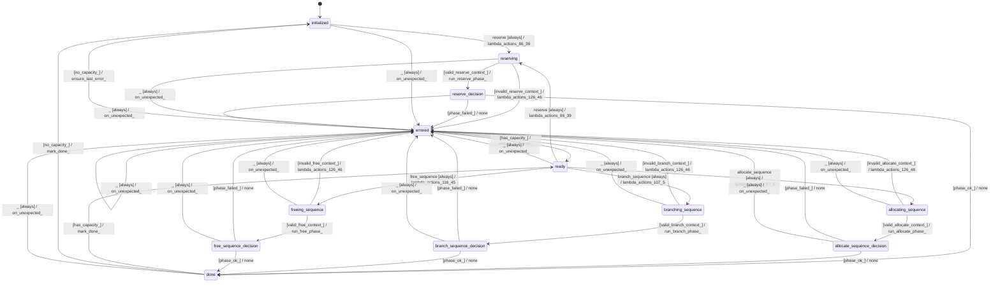

# memory_recurrent

Source: [`emel/memory/recurrent/sm.hpp`](https://github.com/stateforward/emel.cpp/blob/main/src/emel/memory/recurrent/sm.hpp)

## Mermaid

## Transitions

| Source | Event | Guard | Action | Target |
| --- | --- | --- | --- | --- |
| [`initialized`](https://github.com/stateforward/emel.cpp/blob/main/src/emel/memory/recurrent/sm.hpp) | [`reserve`](https://github.com/stateforward/emel.cpp/blob/main/src/emel/memory/recurrent/sm.hpp) | [`always`](https://github.com/stateforward/emel.cpp/blob/main/src/emel/memory/recurrent/sm.hpp) | [`lambda_actions_86_39`](https://github.com/stateforward/emel.cpp/blob/main/src/emel/memory/recurrent/sm.hpp) | [`reserving`](https://github.com/stateforward/emel.cpp/blob/main/src/emel/memory/recurrent/sm.hpp) |
| [`ready`](https://github.com/stateforward/emel.cpp/blob/main/src/emel/memory/recurrent/sm.hpp) | [`reserve`](https://github.com/stateforward/emel.cpp/blob/main/src/emel/memory/recurrent/sm.hpp) | [`always`](https://github.com/stateforward/emel.cpp/blob/main/src/emel/memory/recurrent/sm.hpp) | [`lambda_actions_86_39`](https://github.com/stateforward/emel.cpp/blob/main/src/emel/memory/recurrent/sm.hpp) | [`reserving`](https://github.com/stateforward/emel.cpp/blob/main/src/emel/memory/recurrent/sm.hpp) |
| [`reserving`](https://github.com/stateforward/emel.cpp/blob/main/src/emel/memory/recurrent/sm.hpp) | - | [`valid_reserve_context>`](https://github.com/stateforward/emel.cpp/blob/main/src/emel/memory/recurrent/sm.hpp) | [`run_reserve_phase>`](https://github.com/stateforward/emel.cpp/blob/main/src/emel/memory/recurrent/sm.hpp) | [`reserve_decision`](https://github.com/stateforward/emel.cpp/blob/main/src/emel/memory/recurrent/sm.hpp) |
| [`reserving`](https://github.com/stateforward/emel.cpp/blob/main/src/emel/memory/recurrent/sm.hpp) | - | [`invalid_reserve_context>`](https://github.com/stateforward/emel.cpp/blob/main/src/emel/memory/recurrent/sm.hpp) | [`lambda_actions_126_46`](https://github.com/stateforward/emel.cpp/blob/main/src/emel/memory/recurrent/sm.hpp) | [`errored`](https://github.com/stateforward/emel.cpp/blob/main/src/emel/memory/recurrent/sm.hpp) |
| [`reserve_decision`](https://github.com/stateforward/emel.cpp/blob/main/src/emel/memory/recurrent/sm.hpp) | - | [`phase_failed>`](https://github.com/stateforward/emel.cpp/blob/main/src/emel/memory/recurrent/sm.hpp) | [`none`](https://github.com/stateforward/emel.cpp/blob/main/src/emel/memory/recurrent/sm.hpp) | [`errored`](https://github.com/stateforward/emel.cpp/blob/main/src/emel/memory/recurrent/sm.hpp) |
| [`reserve_decision`](https://github.com/stateforward/emel.cpp/blob/main/src/emel/memory/recurrent/sm.hpp) | - | [`phase_ok>`](https://github.com/stateforward/emel.cpp/blob/main/src/emel/memory/recurrent/sm.hpp) | [`none`](https://github.com/stateforward/emel.cpp/blob/main/src/emel/memory/recurrent/sm.hpp) | [`done`](https://github.com/stateforward/emel.cpp/blob/main/src/emel/memory/recurrent/sm.hpp) |
| [`ready`](https://github.com/stateforward/emel.cpp/blob/main/src/emel/memory/recurrent/sm.hpp) | [`allocate_sequence`](https://github.com/stateforward/emel.cpp/blob/main/src/emel/memory/recurrent/sm.hpp) | [`always`](https://github.com/stateforward/emel.cpp/blob/main/src/emel/memory/recurrent/sm.hpp) | [`lambda_actions_97_5`](https://github.com/stateforward/emel.cpp/blob/main/src/emel/memory/recurrent/sm.hpp) | [`allocating_sequence`](https://github.com/stateforward/emel.cpp/blob/main/src/emel/memory/recurrent/sm.hpp) |
| [`allocating_sequence`](https://github.com/stateforward/emel.cpp/blob/main/src/emel/memory/recurrent/sm.hpp) | - | [`valid_allocate_context>`](https://github.com/stateforward/emel.cpp/blob/main/src/emel/memory/recurrent/sm.hpp) | [`run_allocate_phase>`](https://github.com/stateforward/emel.cpp/blob/main/src/emel/memory/recurrent/sm.hpp) | [`allocate_sequence_decision`](https://github.com/stateforward/emel.cpp/blob/main/src/emel/memory/recurrent/sm.hpp) |
| [`allocating_sequence`](https://github.com/stateforward/emel.cpp/blob/main/src/emel/memory/recurrent/sm.hpp) | - | [`invalid_allocate_context>`](https://github.com/stateforward/emel.cpp/blob/main/src/emel/memory/recurrent/sm.hpp) | [`lambda_actions_126_46`](https://github.com/stateforward/emel.cpp/blob/main/src/emel/memory/recurrent/sm.hpp) | [`errored`](https://github.com/stateforward/emel.cpp/blob/main/src/emel/memory/recurrent/sm.hpp) |
| [`allocate_sequence_decision`](https://github.com/stateforward/emel.cpp/blob/main/src/emel/memory/recurrent/sm.hpp) | - | [`phase_failed>`](https://github.com/stateforward/emel.cpp/blob/main/src/emel/memory/recurrent/sm.hpp) | [`none`](https://github.com/stateforward/emel.cpp/blob/main/src/emel/memory/recurrent/sm.hpp) | [`errored`](https://github.com/stateforward/emel.cpp/blob/main/src/emel/memory/recurrent/sm.hpp) |
| [`allocate_sequence_decision`](https://github.com/stateforward/emel.cpp/blob/main/src/emel/memory/recurrent/sm.hpp) | - | [`phase_ok>`](https://github.com/stateforward/emel.cpp/blob/main/src/emel/memory/recurrent/sm.hpp) | [`none`](https://github.com/stateforward/emel.cpp/blob/main/src/emel/memory/recurrent/sm.hpp) | [`done`](https://github.com/stateforward/emel.cpp/blob/main/src/emel/memory/recurrent/sm.hpp) |
| [`ready`](https://github.com/stateforward/emel.cpp/blob/main/src/emel/memory/recurrent/sm.hpp) | [`branch_sequence`](https://github.com/stateforward/emel.cpp/blob/main/src/emel/memory/recurrent/sm.hpp) | [`always`](https://github.com/stateforward/emel.cpp/blob/main/src/emel/memory/recurrent/sm.hpp) | [`lambda_actions_107_5`](https://github.com/stateforward/emel.cpp/blob/main/src/emel/memory/recurrent/sm.hpp) | [`branching_sequence`](https://github.com/stateforward/emel.cpp/blob/main/src/emel/memory/recurrent/sm.hpp) |
| [`branching_sequence`](https://github.com/stateforward/emel.cpp/blob/main/src/emel/memory/recurrent/sm.hpp) | - | [`valid_branch_context>`](https://github.com/stateforward/emel.cpp/blob/main/src/emel/memory/recurrent/sm.hpp) | [`run_branch_phase>`](https://github.com/stateforward/emel.cpp/blob/main/src/emel/memory/recurrent/sm.hpp) | [`branch_sequence_decision`](https://github.com/stateforward/emel.cpp/blob/main/src/emel/memory/recurrent/sm.hpp) |
| [`branching_sequence`](https://github.com/stateforward/emel.cpp/blob/main/src/emel/memory/recurrent/sm.hpp) | - | [`invalid_branch_context>`](https://github.com/stateforward/emel.cpp/blob/main/src/emel/memory/recurrent/sm.hpp) | [`lambda_actions_126_46`](https://github.com/stateforward/emel.cpp/blob/main/src/emel/memory/recurrent/sm.hpp) | [`errored`](https://github.com/stateforward/emel.cpp/blob/main/src/emel/memory/recurrent/sm.hpp) |
| [`branch_sequence_decision`](https://github.com/stateforward/emel.cpp/blob/main/src/emel/memory/recurrent/sm.hpp) | - | [`phase_failed>`](https://github.com/stateforward/emel.cpp/blob/main/src/emel/memory/recurrent/sm.hpp) | [`none`](https://github.com/stateforward/emel.cpp/blob/main/src/emel/memory/recurrent/sm.hpp) | [`errored`](https://github.com/stateforward/emel.cpp/blob/main/src/emel/memory/recurrent/sm.hpp) |
| [`branch_sequence_decision`](https://github.com/stateforward/emel.cpp/blob/main/src/emel/memory/recurrent/sm.hpp) | - | [`phase_ok>`](https://github.com/stateforward/emel.cpp/blob/main/src/emel/memory/recurrent/sm.hpp) | [`none`](https://github.com/stateforward/emel.cpp/blob/main/src/emel/memory/recurrent/sm.hpp) | [`done`](https://github.com/stateforward/emel.cpp/blob/main/src/emel/memory/recurrent/sm.hpp) |
| [`ready`](https://github.com/stateforward/emel.cpp/blob/main/src/emel/memory/recurrent/sm.hpp) | [`free_sequence`](https://github.com/stateforward/emel.cpp/blob/main/src/emel/memory/recurrent/sm.hpp) | [`always`](https://github.com/stateforward/emel.cpp/blob/main/src/emel/memory/recurrent/sm.hpp) | [`lambda_actions_116_45`](https://github.com/stateforward/emel.cpp/blob/main/src/emel/memory/recurrent/sm.hpp) | [`freeing_sequence`](https://github.com/stateforward/emel.cpp/blob/main/src/emel/memory/recurrent/sm.hpp) |
| [`freeing_sequence`](https://github.com/stateforward/emel.cpp/blob/main/src/emel/memory/recurrent/sm.hpp) | - | [`valid_free_context>`](https://github.com/stateforward/emel.cpp/blob/main/src/emel/memory/recurrent/sm.hpp) | [`run_free_phase>`](https://github.com/stateforward/emel.cpp/blob/main/src/emel/memory/recurrent/sm.hpp) | [`free_sequence_decision`](https://github.com/stateforward/emel.cpp/blob/main/src/emel/memory/recurrent/sm.hpp) |
| [`freeing_sequence`](https://github.com/stateforward/emel.cpp/blob/main/src/emel/memory/recurrent/sm.hpp) | - | [`invalid_free_context>`](https://github.com/stateforward/emel.cpp/blob/main/src/emel/memory/recurrent/sm.hpp) | [`lambda_actions_126_46`](https://github.com/stateforward/emel.cpp/blob/main/src/emel/memory/recurrent/sm.hpp) | [`errored`](https://github.com/stateforward/emel.cpp/blob/main/src/emel/memory/recurrent/sm.hpp) |
| [`free_sequence_decision`](https://github.com/stateforward/emel.cpp/blob/main/src/emel/memory/recurrent/sm.hpp) | - | [`phase_failed>`](https://github.com/stateforward/emel.cpp/blob/main/src/emel/memory/recurrent/sm.hpp) | [`none`](https://github.com/stateforward/emel.cpp/blob/main/src/emel/memory/recurrent/sm.hpp) | [`errored`](https://github.com/stateforward/emel.cpp/blob/main/src/emel/memory/recurrent/sm.hpp) |
| [`free_sequence_decision`](https://github.com/stateforward/emel.cpp/blob/main/src/emel/memory/recurrent/sm.hpp) | - | [`phase_ok>`](https://github.com/stateforward/emel.cpp/blob/main/src/emel/memory/recurrent/sm.hpp) | [`none`](https://github.com/stateforward/emel.cpp/blob/main/src/emel/memory/recurrent/sm.hpp) | [`done`](https://github.com/stateforward/emel.cpp/blob/main/src/emel/memory/recurrent/sm.hpp) |
| [`done`](https://github.com/stateforward/emel.cpp/blob/main/src/emel/memory/recurrent/sm.hpp) | - | [`has_capacity>`](https://github.com/stateforward/emel.cpp/blob/main/src/emel/memory/recurrent/sm.hpp) | [`mark_done>`](https://github.com/stateforward/emel.cpp/blob/main/src/emel/memory/recurrent/sm.hpp) | [`ready`](https://github.com/stateforward/emel.cpp/blob/main/src/emel/memory/recurrent/sm.hpp) |
| [`done`](https://github.com/stateforward/emel.cpp/blob/main/src/emel/memory/recurrent/sm.hpp) | - | [`no_capacity>`](https://github.com/stateforward/emel.cpp/blob/main/src/emel/memory/recurrent/sm.hpp) | [`mark_done>`](https://github.com/stateforward/emel.cpp/blob/main/src/emel/memory/recurrent/sm.hpp) | [`initialized`](https://github.com/stateforward/emel.cpp/blob/main/src/emel/memory/recurrent/sm.hpp) |
| [`errored`](https://github.com/stateforward/emel.cpp/blob/main/src/emel/memory/recurrent/sm.hpp) | - | [`has_capacity>`](https://github.com/stateforward/emel.cpp/blob/main/src/emel/memory/recurrent/sm.hpp) | [`ensure_last_error>`](https://github.com/stateforward/emel.cpp/blob/main/src/emel/memory/recurrent/sm.hpp) | [`ready`](https://github.com/stateforward/emel.cpp/blob/main/src/emel/memory/recurrent/sm.hpp) |
| [`errored`](https://github.com/stateforward/emel.cpp/blob/main/src/emel/memory/recurrent/sm.hpp) | - | [`no_capacity>`](https://github.com/stateforward/emel.cpp/blob/main/src/emel/memory/recurrent/sm.hpp) | [`ensure_last_error>`](https://github.com/stateforward/emel.cpp/blob/main/src/emel/memory/recurrent/sm.hpp) | [`initialized`](https://github.com/stateforward/emel.cpp/blob/main/src/emel/memory/recurrent/sm.hpp) |
| [`initialized`](https://github.com/stateforward/emel.cpp/blob/main/src/emel/memory/recurrent/sm.hpp) | [`_`](https://github.com/stateforward/emel.cpp/blob/main/src/emel/memory/recurrent/sm.hpp) | [`always`](https://github.com/stateforward/emel.cpp/blob/main/src/emel/memory/recurrent/sm.hpp) | [`on_unexpected>`](https://github.com/stateforward/emel.cpp/blob/main/src/emel/memory/recurrent/sm.hpp) | [`errored`](https://github.com/stateforward/emel.cpp/blob/main/src/emel/memory/recurrent/sm.hpp) |
| [`ready`](https://github.com/stateforward/emel.cpp/blob/main/src/emel/memory/recurrent/sm.hpp) | [`_`](https://github.com/stateforward/emel.cpp/blob/main/src/emel/memory/recurrent/sm.hpp) | [`always`](https://github.com/stateforward/emel.cpp/blob/main/src/emel/memory/recurrent/sm.hpp) | [`on_unexpected>`](https://github.com/stateforward/emel.cpp/blob/main/src/emel/memory/recurrent/sm.hpp) | [`errored`](https://github.com/stateforward/emel.cpp/blob/main/src/emel/memory/recurrent/sm.hpp) |
| [`reserving`](https://github.com/stateforward/emel.cpp/blob/main/src/emel/memory/recurrent/sm.hpp) | [`_`](https://github.com/stateforward/emel.cpp/blob/main/src/emel/memory/recurrent/sm.hpp) | [`always`](https://github.com/stateforward/emel.cpp/blob/main/src/emel/memory/recurrent/sm.hpp) | [`on_unexpected>`](https://github.com/stateforward/emel.cpp/blob/main/src/emel/memory/recurrent/sm.hpp) | [`errored`](https://github.com/stateforward/emel.cpp/blob/main/src/emel/memory/recurrent/sm.hpp) |
| [`reserve_decision`](https://github.com/stateforward/emel.cpp/blob/main/src/emel/memory/recurrent/sm.hpp) | [`_`](https://github.com/stateforward/emel.cpp/blob/main/src/emel/memory/recurrent/sm.hpp) | [`always`](https://github.com/stateforward/emel.cpp/blob/main/src/emel/memory/recurrent/sm.hpp) | [`on_unexpected>`](https://github.com/stateforward/emel.cpp/blob/main/src/emel/memory/recurrent/sm.hpp) | [`errored`](https://github.com/stateforward/emel.cpp/blob/main/src/emel/memory/recurrent/sm.hpp) |
| [`allocating_sequence`](https://github.com/stateforward/emel.cpp/blob/main/src/emel/memory/recurrent/sm.hpp) | [`_`](https://github.com/stateforward/emel.cpp/blob/main/src/emel/memory/recurrent/sm.hpp) | [`always`](https://github.com/stateforward/emel.cpp/blob/main/src/emel/memory/recurrent/sm.hpp) | [`on_unexpected>`](https://github.com/stateforward/emel.cpp/blob/main/src/emel/memory/recurrent/sm.hpp) | [`errored`](https://github.com/stateforward/emel.cpp/blob/main/src/emel/memory/recurrent/sm.hpp) |
| [`allocate_sequence_decision`](https://github.com/stateforward/emel.cpp/blob/main/src/emel/memory/recurrent/sm.hpp) | [`_`](https://github.com/stateforward/emel.cpp/blob/main/src/emel/memory/recurrent/sm.hpp) | [`always`](https://github.com/stateforward/emel.cpp/blob/main/src/emel/memory/recurrent/sm.hpp) | [`on_unexpected>`](https://github.com/stateforward/emel.cpp/blob/main/src/emel/memory/recurrent/sm.hpp) | [`errored`](https://github.com/stateforward/emel.cpp/blob/main/src/emel/memory/recurrent/sm.hpp) |
| [`branching_sequence`](https://github.com/stateforward/emel.cpp/blob/main/src/emel/memory/recurrent/sm.hpp) | [`_`](https://github.com/stateforward/emel.cpp/blob/main/src/emel/memory/recurrent/sm.hpp) | [`always`](https://github.com/stateforward/emel.cpp/blob/main/src/emel/memory/recurrent/sm.hpp) | [`on_unexpected>`](https://github.com/stateforward/emel.cpp/blob/main/src/emel/memory/recurrent/sm.hpp) | [`errored`](https://github.com/stateforward/emel.cpp/blob/main/src/emel/memory/recurrent/sm.hpp) |
| [`branch_sequence_decision`](https://github.com/stateforward/emel.cpp/blob/main/src/emel/memory/recurrent/sm.hpp) | [`_`](https://github.com/stateforward/emel.cpp/blob/main/src/emel/memory/recurrent/sm.hpp) | [`always`](https://github.com/stateforward/emel.cpp/blob/main/src/emel/memory/recurrent/sm.hpp) | [`on_unexpected>`](https://github.com/stateforward/emel.cpp/blob/main/src/emel/memory/recurrent/sm.hpp) | [`errored`](https://github.com/stateforward/emel.cpp/blob/main/src/emel/memory/recurrent/sm.hpp) |
| [`freeing_sequence`](https://github.com/stateforward/emel.cpp/blob/main/src/emel/memory/recurrent/sm.hpp) | [`_`](https://github.com/stateforward/emel.cpp/blob/main/src/emel/memory/recurrent/sm.hpp) | [`always`](https://github.com/stateforward/emel.cpp/blob/main/src/emel/memory/recurrent/sm.hpp) | [`on_unexpected>`](https://github.com/stateforward/emel.cpp/blob/main/src/emel/memory/recurrent/sm.hpp) | [`errored`](https://github.com/stateforward/emel.cpp/blob/main/src/emel/memory/recurrent/sm.hpp) |
| [`free_sequence_decision`](https://github.com/stateforward/emel.cpp/blob/main/src/emel/memory/recurrent/sm.hpp) | [`_`](https://github.com/stateforward/emel.cpp/blob/main/src/emel/memory/recurrent/sm.hpp) | [`always`](https://github.com/stateforward/emel.cpp/blob/main/src/emel/memory/recurrent/sm.hpp) | [`on_unexpected>`](https://github.com/stateforward/emel.cpp/blob/main/src/emel/memory/recurrent/sm.hpp) | [`errored`](https://github.com/stateforward/emel.cpp/blob/main/src/emel/memory/recurrent/sm.hpp) |
| [`done`](https://github.com/stateforward/emel.cpp/blob/main/src/emel/memory/recurrent/sm.hpp) | [`_`](https://github.com/stateforward/emel.cpp/blob/main/src/emel/memory/recurrent/sm.hpp) | [`always`](https://github.com/stateforward/emel.cpp/blob/main/src/emel/memory/recurrent/sm.hpp) | [`on_unexpected>`](https://github.com/stateforward/emel.cpp/blob/main/src/emel/memory/recurrent/sm.hpp) | [`errored`](https://github.com/stateforward/emel.cpp/blob/main/src/emel/memory/recurrent/sm.hpp) |
| [`errored`](https://github.com/stateforward/emel.cpp/blob/main/src/emel/memory/recurrent/sm.hpp) | [`_`](https://github.com/stateforward/emel.cpp/blob/main/src/emel/memory/recurrent/sm.hpp) | [`always`](https://github.com/stateforward/emel.cpp/blob/main/src/emel/memory/recurrent/sm.hpp) | [`on_unexpected>`](https://github.com/stateforward/emel.cpp/blob/main/src/emel/memory/recurrent/sm.hpp) | [`errored`](https://github.com/stateforward/emel.cpp/blob/main/src/emel/memory/recurrent/sm.hpp) |
