# model_builder

Source: [`emel/model/builder/sm.hpp`](https://github.com/stateforward/emel.cpp/blob/main/src/emel/model/builder/sm.hpp)

## Mermaid

```mermaid
stateDiagram-v2
  direction TB
  [*] --> ready
  ready --> architecture_decision : build_runtime [always] / begin_build_
  architecture_decision --> building_view : completion_build_runtime_ [resolved_architecture_present_] / run_build_view_
  architecture_decision --> errored : completion_build_runtime_ [resolved_architecture_absent_] / mark_model_invalid_
  architecture_decision --> errored : completion_build_runtime_ [always] / mark_internal_error_
  building_view --> view_decision : completion_build_runtime_ [always] / none
  view_decision --> building_topology : completion_build_runtime_ [error_none_] / run_build_topology_
  view_decision --> errored : completion_build_runtime_ [error_invalid_request_] / none
  view_decision --> errored : completion_build_runtime_ [error_model_invalid_] / none
  view_decision --> errored : completion_build_runtime_ [error_internal_error_] / none
  view_decision --> errored : completion_build_runtime_ [error_untracked_] / none
  view_decision --> errored : completion_build_runtime_ [error_unclassified_code_] / none
  building_topology --> topology_decision : completion_build_runtime_ [always] / none
  topology_decision --> building_step_plans : completion_build_runtime_ [error_none_] / run_build_step_plans_
  topology_decision --> errored : completion_build_runtime_ [error_invalid_request_] / none
  topology_decision --> errored : completion_build_runtime_ [error_model_invalid_] / none
  topology_decision --> errored : completion_build_runtime_ [error_internal_error_] / none
  topology_decision --> errored : completion_build_runtime_ [error_untracked_] / none
  topology_decision --> errored : completion_build_runtime_ [error_unclassified_code_] / none
  building_step_plans --> step_plans_decision : completion_build_runtime_ [always] / none
  step_plans_decision --> building_quantized_audit : completion_build_runtime_ [error_none_] / run_build_quantized_audit_
  step_plans_decision --> errored : completion_build_runtime_ [error_invalid_request_] / none
  step_plans_decision --> errored : completion_build_runtime_ [error_model_invalid_] / none
  step_plans_decision --> errored : completion_build_runtime_ [error_internal_error_] / none
  step_plans_decision --> errored : completion_build_runtime_ [error_untracked_] / none
  step_plans_decision --> errored : completion_build_runtime_ [error_unclassified_code_] / none
  building_quantized_audit --> audit_decision : completion_build_runtime_ [always] / none
  audit_decision --> done : completion_build_runtime_ [error_none_] / none
  audit_decision --> errored : completion_build_runtime_ [error_invalid_request_] / none
  audit_decision --> errored : completion_build_runtime_ [error_model_invalid_] / none
  audit_decision --> errored : completion_build_runtime_ [error_internal_error_] / none
  audit_decision --> errored : completion_build_runtime_ [error_untracked_] / none
  audit_decision --> errored : completion_build_runtime_ [error_unclassified_code_] / none
  done --> done_callback : completion_build_runtime_ [done_callback_present_] / publish_done_
  done --> ready : completion_build_runtime_ [done_callback_absent_] / none
  done_callback --> ready : completion_build_runtime_ [always] / none
  errored --> error_callback : completion_build_runtime_ [error_callback_present_] / publish_error_
  errored --> ready : completion_build_runtime_ [error_callback_absent_] / none
  error_callback --> ready : completion_build_runtime_ [always] / none
  ready --> ready : _ [always] / on_unexpected_
  architecture_decision --> ready : _ [always] / on_unexpected_
  building_view --> ready : _ [always] / on_unexpected_
  view_decision --> ready : _ [always] / on_unexpected_
  building_topology --> ready : _ [always] / on_unexpected_
  topology_decision --> ready : _ [always] / on_unexpected_
  building_step_plans --> ready : _ [always] / on_unexpected_
  step_plans_decision --> ready : _ [always] / on_unexpected_
  building_quantized_audit --> ready : _ [always] / on_unexpected_
  audit_decision --> ready : _ [always] / on_unexpected_
  done --> ready : _ [always] / on_unexpected_
  errored --> ready : _ [always] / on_unexpected_
  done_callback --> ready : _ [always] / on_unexpected_
  error_callback --> ready : _ [always] / on_unexpected_
```

## Transitions

| Source | Event | Guard | Action | Target |
| --- | --- | --- | --- | --- |
| [`ready`](https://github.com/stateforward/emel.cpp/blob/main/src/emel/model/builder/sm.hpp) | [`build_runtime`](https://github.com/stateforward/emel.cpp/blob/main/src/emel/model/builder/sm.hpp) | [`always`](https://github.com/stateforward/emel.cpp/blob/main/src/emel/model/builder/sm.hpp) | [`begin_build>`](https://github.com/stateforward/emel.cpp/blob/main/src/emel/model/builder/sm.hpp) | [`architecture_decision`](https://github.com/stateforward/emel.cpp/blob/main/src/emel/model/builder/sm.hpp) |
| [`architecture_decision`](https://github.com/stateforward/emel.cpp/blob/main/src/emel/model/builder/sm.hpp) | [`completion<build_runtime>`](https://github.com/stateforward/emel.cpp/blob/main/src/emel/model/builder/sm.hpp) | [`resolved_architecture_present>`](https://github.com/stateforward/emel.cpp/blob/main/src/emel/model/builder/sm.hpp) | [`run_build_view>`](https://github.com/stateforward/emel.cpp/blob/main/src/emel/model/builder/sm.hpp) | [`building_view`](https://github.com/stateforward/emel.cpp/blob/main/src/emel/model/builder/sm.hpp) |
| [`architecture_decision`](https://github.com/stateforward/emel.cpp/blob/main/src/emel/model/builder/sm.hpp) | [`completion<build_runtime>`](https://github.com/stateforward/emel.cpp/blob/main/src/emel/model/builder/sm.hpp) | [`resolved_architecture_absent>`](https://github.com/stateforward/emel.cpp/blob/main/src/emel/model/builder/sm.hpp) | [`mark_model_invalid>`](https://github.com/stateforward/emel.cpp/blob/main/src/emel/model/builder/sm.hpp) | [`errored`](https://github.com/stateforward/emel.cpp/blob/main/src/emel/model/builder/sm.hpp) |
| [`architecture_decision`](https://github.com/stateforward/emel.cpp/blob/main/src/emel/model/builder/sm.hpp) | [`completion<build_runtime>`](https://github.com/stateforward/emel.cpp/blob/main/src/emel/model/builder/sm.hpp) | [`always`](https://github.com/stateforward/emel.cpp/blob/main/src/emel/model/builder/sm.hpp) | [`mark_internal_error>`](https://github.com/stateforward/emel.cpp/blob/main/src/emel/model/builder/sm.hpp) | [`errored`](https://github.com/stateforward/emel.cpp/blob/main/src/emel/model/builder/sm.hpp) |
| [`building_view`](https://github.com/stateforward/emel.cpp/blob/main/src/emel/model/builder/sm.hpp) | [`completion<build_runtime>`](https://github.com/stateforward/emel.cpp/blob/main/src/emel/model/builder/sm.hpp) | [`always`](https://github.com/stateforward/emel.cpp/blob/main/src/emel/model/builder/sm.hpp) | [`none`](https://github.com/stateforward/emel.cpp/blob/main/src/emel/model/builder/sm.hpp) | [`view_decision`](https://github.com/stateforward/emel.cpp/blob/main/src/emel/model/builder/sm.hpp) |
| [`view_decision`](https://github.com/stateforward/emel.cpp/blob/main/src/emel/model/builder/sm.hpp) | [`completion<build_runtime>`](https://github.com/stateforward/emel.cpp/blob/main/src/emel/model/builder/sm.hpp) | [`error_none>`](https://github.com/stateforward/emel.cpp/blob/main/src/emel/model/builder/sm.hpp) | [`run_build_topology>`](https://github.com/stateforward/emel.cpp/blob/main/src/emel/model/builder/sm.hpp) | [`building_topology`](https://github.com/stateforward/emel.cpp/blob/main/src/emel/model/builder/sm.hpp) |
| [`view_decision`](https://github.com/stateforward/emel.cpp/blob/main/src/emel/model/builder/sm.hpp) | [`completion<build_runtime>`](https://github.com/stateforward/emel.cpp/blob/main/src/emel/model/builder/sm.hpp) | [`error_invalid_request>`](https://github.com/stateforward/emel.cpp/blob/main/src/emel/model/builder/sm.hpp) | [`none`](https://github.com/stateforward/emel.cpp/blob/main/src/emel/model/builder/sm.hpp) | [`errored`](https://github.com/stateforward/emel.cpp/blob/main/src/emel/model/builder/sm.hpp) |
| [`view_decision`](https://github.com/stateforward/emel.cpp/blob/main/src/emel/model/builder/sm.hpp) | [`completion<build_runtime>`](https://github.com/stateforward/emel.cpp/blob/main/src/emel/model/builder/sm.hpp) | [`error_model_invalid>`](https://github.com/stateforward/emel.cpp/blob/main/src/emel/model/builder/sm.hpp) | [`none`](https://github.com/stateforward/emel.cpp/blob/main/src/emel/model/builder/sm.hpp) | [`errored`](https://github.com/stateforward/emel.cpp/blob/main/src/emel/model/builder/sm.hpp) |
| [`view_decision`](https://github.com/stateforward/emel.cpp/blob/main/src/emel/model/builder/sm.hpp) | [`completion<build_runtime>`](https://github.com/stateforward/emel.cpp/blob/main/src/emel/model/builder/sm.hpp) | [`error_internal_error>`](https://github.com/stateforward/emel.cpp/blob/main/src/emel/model/builder/sm.hpp) | [`none`](https://github.com/stateforward/emel.cpp/blob/main/src/emel/model/builder/sm.hpp) | [`errored`](https://github.com/stateforward/emel.cpp/blob/main/src/emel/model/builder/sm.hpp) |
| [`view_decision`](https://github.com/stateforward/emel.cpp/blob/main/src/emel/model/builder/sm.hpp) | [`completion<build_runtime>`](https://github.com/stateforward/emel.cpp/blob/main/src/emel/model/builder/sm.hpp) | [`error_untracked>`](https://github.com/stateforward/emel.cpp/blob/main/src/emel/model/builder/sm.hpp) | [`none`](https://github.com/stateforward/emel.cpp/blob/main/src/emel/model/builder/sm.hpp) | [`errored`](https://github.com/stateforward/emel.cpp/blob/main/src/emel/model/builder/sm.hpp) |
| [`view_decision`](https://github.com/stateforward/emel.cpp/blob/main/src/emel/model/builder/sm.hpp) | [`completion<build_runtime>`](https://github.com/stateforward/emel.cpp/blob/main/src/emel/model/builder/sm.hpp) | [`error_unclassified_code>`](https://github.com/stateforward/emel.cpp/blob/main/src/emel/model/builder/sm.hpp) | [`none`](https://github.com/stateforward/emel.cpp/blob/main/src/emel/model/builder/sm.hpp) | [`errored`](https://github.com/stateforward/emel.cpp/blob/main/src/emel/model/builder/sm.hpp) |
| [`building_topology`](https://github.com/stateforward/emel.cpp/blob/main/src/emel/model/builder/sm.hpp) | [`completion<build_runtime>`](https://github.com/stateforward/emel.cpp/blob/main/src/emel/model/builder/sm.hpp) | [`always`](https://github.com/stateforward/emel.cpp/blob/main/src/emel/model/builder/sm.hpp) | [`none`](https://github.com/stateforward/emel.cpp/blob/main/src/emel/model/builder/sm.hpp) | [`topology_decision`](https://github.com/stateforward/emel.cpp/blob/main/src/emel/model/builder/sm.hpp) |
| [`topology_decision`](https://github.com/stateforward/emel.cpp/blob/main/src/emel/model/builder/sm.hpp) | [`completion<build_runtime>`](https://github.com/stateforward/emel.cpp/blob/main/src/emel/model/builder/sm.hpp) | [`error_none>`](https://github.com/stateforward/emel.cpp/blob/main/src/emel/model/builder/sm.hpp) | [`run_build_step_plans>`](https://github.com/stateforward/emel.cpp/blob/main/src/emel/model/builder/sm.hpp) | [`building_step_plans`](https://github.com/stateforward/emel.cpp/blob/main/src/emel/model/builder/sm.hpp) |
| [`topology_decision`](https://github.com/stateforward/emel.cpp/blob/main/src/emel/model/builder/sm.hpp) | [`completion<build_runtime>`](https://github.com/stateforward/emel.cpp/blob/main/src/emel/model/builder/sm.hpp) | [`error_invalid_request>`](https://github.com/stateforward/emel.cpp/blob/main/src/emel/model/builder/sm.hpp) | [`none`](https://github.com/stateforward/emel.cpp/blob/main/src/emel/model/builder/sm.hpp) | [`errored`](https://github.com/stateforward/emel.cpp/blob/main/src/emel/model/builder/sm.hpp) |
| [`topology_decision`](https://github.com/stateforward/emel.cpp/blob/main/src/emel/model/builder/sm.hpp) | [`completion<build_runtime>`](https://github.com/stateforward/emel.cpp/blob/main/src/emel/model/builder/sm.hpp) | [`error_model_invalid>`](https://github.com/stateforward/emel.cpp/blob/main/src/emel/model/builder/sm.hpp) | [`none`](https://github.com/stateforward/emel.cpp/blob/main/src/emel/model/builder/sm.hpp) | [`errored`](https://github.com/stateforward/emel.cpp/blob/main/src/emel/model/builder/sm.hpp) |
| [`topology_decision`](https://github.com/stateforward/emel.cpp/blob/main/src/emel/model/builder/sm.hpp) | [`completion<build_runtime>`](https://github.com/stateforward/emel.cpp/blob/main/src/emel/model/builder/sm.hpp) | [`error_internal_error>`](https://github.com/stateforward/emel.cpp/blob/main/src/emel/model/builder/sm.hpp) | [`none`](https://github.com/stateforward/emel.cpp/blob/main/src/emel/model/builder/sm.hpp) | [`errored`](https://github.com/stateforward/emel.cpp/blob/main/src/emel/model/builder/sm.hpp) |
| [`topology_decision`](https://github.com/stateforward/emel.cpp/blob/main/src/emel/model/builder/sm.hpp) | [`completion<build_runtime>`](https://github.com/stateforward/emel.cpp/blob/main/src/emel/model/builder/sm.hpp) | [`error_untracked>`](https://github.com/stateforward/emel.cpp/blob/main/src/emel/model/builder/sm.hpp) | [`none`](https://github.com/stateforward/emel.cpp/blob/main/src/emel/model/builder/sm.hpp) | [`errored`](https://github.com/stateforward/emel.cpp/blob/main/src/emel/model/builder/sm.hpp) |
| [`topology_decision`](https://github.com/stateforward/emel.cpp/blob/main/src/emel/model/builder/sm.hpp) | [`completion<build_runtime>`](https://github.com/stateforward/emel.cpp/blob/main/src/emel/model/builder/sm.hpp) | [`error_unclassified_code>`](https://github.com/stateforward/emel.cpp/blob/main/src/emel/model/builder/sm.hpp) | [`none`](https://github.com/stateforward/emel.cpp/blob/main/src/emel/model/builder/sm.hpp) | [`errored`](https://github.com/stateforward/emel.cpp/blob/main/src/emel/model/builder/sm.hpp) |
| [`building_step_plans`](https://github.com/stateforward/emel.cpp/blob/main/src/emel/model/builder/sm.hpp) | [`completion<build_runtime>`](https://github.com/stateforward/emel.cpp/blob/main/src/emel/model/builder/sm.hpp) | [`always`](https://github.com/stateforward/emel.cpp/blob/main/src/emel/model/builder/sm.hpp) | [`none`](https://github.com/stateforward/emel.cpp/blob/main/src/emel/model/builder/sm.hpp) | [`step_plans_decision`](https://github.com/stateforward/emel.cpp/blob/main/src/emel/model/builder/sm.hpp) |
| [`step_plans_decision`](https://github.com/stateforward/emel.cpp/blob/main/src/emel/model/builder/sm.hpp) | [`completion<build_runtime>`](https://github.com/stateforward/emel.cpp/blob/main/src/emel/model/builder/sm.hpp) | [`error_none>`](https://github.com/stateforward/emel.cpp/blob/main/src/emel/model/builder/sm.hpp) | [`run_build_quantized_audit>`](https://github.com/stateforward/emel.cpp/blob/main/src/emel/model/builder/sm.hpp) | [`building_quantized_audit`](https://github.com/stateforward/emel.cpp/blob/main/src/emel/model/builder/sm.hpp) |
| [`step_plans_decision`](https://github.com/stateforward/emel.cpp/blob/main/src/emel/model/builder/sm.hpp) | [`completion<build_runtime>`](https://github.com/stateforward/emel.cpp/blob/main/src/emel/model/builder/sm.hpp) | [`error_invalid_request>`](https://github.com/stateforward/emel.cpp/blob/main/src/emel/model/builder/sm.hpp) | [`none`](https://github.com/stateforward/emel.cpp/blob/main/src/emel/model/builder/sm.hpp) | [`errored`](https://github.com/stateforward/emel.cpp/blob/main/src/emel/model/builder/sm.hpp) |
| [`step_plans_decision`](https://github.com/stateforward/emel.cpp/blob/main/src/emel/model/builder/sm.hpp) | [`completion<build_runtime>`](https://github.com/stateforward/emel.cpp/blob/main/src/emel/model/builder/sm.hpp) | [`error_model_invalid>`](https://github.com/stateforward/emel.cpp/blob/main/src/emel/model/builder/sm.hpp) | [`none`](https://github.com/stateforward/emel.cpp/blob/main/src/emel/model/builder/sm.hpp) | [`errored`](https://github.com/stateforward/emel.cpp/blob/main/src/emel/model/builder/sm.hpp) |
| [`step_plans_decision`](https://github.com/stateforward/emel.cpp/blob/main/src/emel/model/builder/sm.hpp) | [`completion<build_runtime>`](https://github.com/stateforward/emel.cpp/blob/main/src/emel/model/builder/sm.hpp) | [`error_internal_error>`](https://github.com/stateforward/emel.cpp/blob/main/src/emel/model/builder/sm.hpp) | [`none`](https://github.com/stateforward/emel.cpp/blob/main/src/emel/model/builder/sm.hpp) | [`errored`](https://github.com/stateforward/emel.cpp/blob/main/src/emel/model/builder/sm.hpp) |
| [`step_plans_decision`](https://github.com/stateforward/emel.cpp/blob/main/src/emel/model/builder/sm.hpp) | [`completion<build_runtime>`](https://github.com/stateforward/emel.cpp/blob/main/src/emel/model/builder/sm.hpp) | [`error_untracked>`](https://github.com/stateforward/emel.cpp/blob/main/src/emel/model/builder/sm.hpp) | [`none`](https://github.com/stateforward/emel.cpp/blob/main/src/emel/model/builder/sm.hpp) | [`errored`](https://github.com/stateforward/emel.cpp/blob/main/src/emel/model/builder/sm.hpp) |
| [`step_plans_decision`](https://github.com/stateforward/emel.cpp/blob/main/src/emel/model/builder/sm.hpp) | [`completion<build_runtime>`](https://github.com/stateforward/emel.cpp/blob/main/src/emel/model/builder/sm.hpp) | [`error_unclassified_code>`](https://github.com/stateforward/emel.cpp/blob/main/src/emel/model/builder/sm.hpp) | [`none`](https://github.com/stateforward/emel.cpp/blob/main/src/emel/model/builder/sm.hpp) | [`errored`](https://github.com/stateforward/emel.cpp/blob/main/src/emel/model/builder/sm.hpp) |
| [`building_quantized_audit`](https://github.com/stateforward/emel.cpp/blob/main/src/emel/model/builder/sm.hpp) | [`completion<build_runtime>`](https://github.com/stateforward/emel.cpp/blob/main/src/emel/model/builder/sm.hpp) | [`always`](https://github.com/stateforward/emel.cpp/blob/main/src/emel/model/builder/sm.hpp) | [`none`](https://github.com/stateforward/emel.cpp/blob/main/src/emel/model/builder/sm.hpp) | [`audit_decision`](https://github.com/stateforward/emel.cpp/blob/main/src/emel/model/builder/sm.hpp) |
| [`audit_decision`](https://github.com/stateforward/emel.cpp/blob/main/src/emel/model/builder/sm.hpp) | [`completion<build_runtime>`](https://github.com/stateforward/emel.cpp/blob/main/src/emel/model/builder/sm.hpp) | [`error_none>`](https://github.com/stateforward/emel.cpp/blob/main/src/emel/model/builder/sm.hpp) | [`none`](https://github.com/stateforward/emel.cpp/blob/main/src/emel/model/builder/sm.hpp) | [`done`](https://github.com/stateforward/emel.cpp/blob/main/src/emel/model/builder/sm.hpp) |
| [`audit_decision`](https://github.com/stateforward/emel.cpp/blob/main/src/emel/model/builder/sm.hpp) | [`completion<build_runtime>`](https://github.com/stateforward/emel.cpp/blob/main/src/emel/model/builder/sm.hpp) | [`error_invalid_request>`](https://github.com/stateforward/emel.cpp/blob/main/src/emel/model/builder/sm.hpp) | [`none`](https://github.com/stateforward/emel.cpp/blob/main/src/emel/model/builder/sm.hpp) | [`errored`](https://github.com/stateforward/emel.cpp/blob/main/src/emel/model/builder/sm.hpp) |
| [`audit_decision`](https://github.com/stateforward/emel.cpp/blob/main/src/emel/model/builder/sm.hpp) | [`completion<build_runtime>`](https://github.com/stateforward/emel.cpp/blob/main/src/emel/model/builder/sm.hpp) | [`error_model_invalid>`](https://github.com/stateforward/emel.cpp/blob/main/src/emel/model/builder/sm.hpp) | [`none`](https://github.com/stateforward/emel.cpp/blob/main/src/emel/model/builder/sm.hpp) | [`errored`](https://github.com/stateforward/emel.cpp/blob/main/src/emel/model/builder/sm.hpp) |
| [`audit_decision`](https://github.com/stateforward/emel.cpp/blob/main/src/emel/model/builder/sm.hpp) | [`completion<build_runtime>`](https://github.com/stateforward/emel.cpp/blob/main/src/emel/model/builder/sm.hpp) | [`error_internal_error>`](https://github.com/stateforward/emel.cpp/blob/main/src/emel/model/builder/sm.hpp) | [`none`](https://github.com/stateforward/emel.cpp/blob/main/src/emel/model/builder/sm.hpp) | [`errored`](https://github.com/stateforward/emel.cpp/blob/main/src/emel/model/builder/sm.hpp) |
| [`audit_decision`](https://github.com/stateforward/emel.cpp/blob/main/src/emel/model/builder/sm.hpp) | [`completion<build_runtime>`](https://github.com/stateforward/emel.cpp/blob/main/src/emel/model/builder/sm.hpp) | [`error_untracked>`](https://github.com/stateforward/emel.cpp/blob/main/src/emel/model/builder/sm.hpp) | [`none`](https://github.com/stateforward/emel.cpp/blob/main/src/emel/model/builder/sm.hpp) | [`errored`](https://github.com/stateforward/emel.cpp/blob/main/src/emel/model/builder/sm.hpp) |
| [`audit_decision`](https://github.com/stateforward/emel.cpp/blob/main/src/emel/model/builder/sm.hpp) | [`completion<build_runtime>`](https://github.com/stateforward/emel.cpp/blob/main/src/emel/model/builder/sm.hpp) | [`error_unclassified_code>`](https://github.com/stateforward/emel.cpp/blob/main/src/emel/model/builder/sm.hpp) | [`none`](https://github.com/stateforward/emel.cpp/blob/main/src/emel/model/builder/sm.hpp) | [`errored`](https://github.com/stateforward/emel.cpp/blob/main/src/emel/model/builder/sm.hpp) |
| [`done`](https://github.com/stateforward/emel.cpp/blob/main/src/emel/model/builder/sm.hpp) | [`completion<build_runtime>`](https://github.com/stateforward/emel.cpp/blob/main/src/emel/model/builder/sm.hpp) | [`done_callback_present>`](https://github.com/stateforward/emel.cpp/blob/main/src/emel/model/builder/sm.hpp) | [`publish_done>`](https://github.com/stateforward/emel.cpp/blob/main/src/emel/model/builder/sm.hpp) | [`done_callback`](https://github.com/stateforward/emel.cpp/blob/main/src/emel/model/builder/sm.hpp) |
| [`done`](https://github.com/stateforward/emel.cpp/blob/main/src/emel/model/builder/sm.hpp) | [`completion<build_runtime>`](https://github.com/stateforward/emel.cpp/blob/main/src/emel/model/builder/sm.hpp) | [`done_callback_absent>`](https://github.com/stateforward/emel.cpp/blob/main/src/emel/model/builder/sm.hpp) | [`none`](https://github.com/stateforward/emel.cpp/blob/main/src/emel/model/builder/sm.hpp) | [`ready`](https://github.com/stateforward/emel.cpp/blob/main/src/emel/model/builder/sm.hpp) |
| [`done_callback`](https://github.com/stateforward/emel.cpp/blob/main/src/emel/model/builder/sm.hpp) | [`completion<build_runtime>`](https://github.com/stateforward/emel.cpp/blob/main/src/emel/model/builder/sm.hpp) | [`always`](https://github.com/stateforward/emel.cpp/blob/main/src/emel/model/builder/sm.hpp) | [`none`](https://github.com/stateforward/emel.cpp/blob/main/src/emel/model/builder/sm.hpp) | [`ready`](https://github.com/stateforward/emel.cpp/blob/main/src/emel/model/builder/sm.hpp) |
| [`errored`](https://github.com/stateforward/emel.cpp/blob/main/src/emel/model/builder/sm.hpp) | [`completion<build_runtime>`](https://github.com/stateforward/emel.cpp/blob/main/src/emel/model/builder/sm.hpp) | [`error_callback_present>`](https://github.com/stateforward/emel.cpp/blob/main/src/emel/model/builder/sm.hpp) | [`publish_error>`](https://github.com/stateforward/emel.cpp/blob/main/src/emel/model/builder/sm.hpp) | [`error_callback`](https://github.com/stateforward/emel.cpp/blob/main/src/emel/model/builder/sm.hpp) |
| [`errored`](https://github.com/stateforward/emel.cpp/blob/main/src/emel/model/builder/sm.hpp) | [`completion<build_runtime>`](https://github.com/stateforward/emel.cpp/blob/main/src/emel/model/builder/sm.hpp) | [`error_callback_absent>`](https://github.com/stateforward/emel.cpp/blob/main/src/emel/model/builder/sm.hpp) | [`none`](https://github.com/stateforward/emel.cpp/blob/main/src/emel/model/builder/sm.hpp) | [`ready`](https://github.com/stateforward/emel.cpp/blob/main/src/emel/model/builder/sm.hpp) |
| [`error_callback`](https://github.com/stateforward/emel.cpp/blob/main/src/emel/model/builder/sm.hpp) | [`completion<build_runtime>`](https://github.com/stateforward/emel.cpp/blob/main/src/emel/model/builder/sm.hpp) | [`always`](https://github.com/stateforward/emel.cpp/blob/main/src/emel/model/builder/sm.hpp) | [`none`](https://github.com/stateforward/emel.cpp/blob/main/src/emel/model/builder/sm.hpp) | [`ready`](https://github.com/stateforward/emel.cpp/blob/main/src/emel/model/builder/sm.hpp) |
| [`ready`](https://github.com/stateforward/emel.cpp/blob/main/src/emel/model/builder/sm.hpp) | [`_`](https://github.com/stateforward/emel.cpp/blob/main/src/emel/model/builder/sm.hpp) | [`always`](https://github.com/stateforward/emel.cpp/blob/main/src/emel/model/builder/sm.hpp) | [`on_unexpected>`](https://github.com/stateforward/emel.cpp/blob/main/src/emel/model/builder/sm.hpp) | [`ready`](https://github.com/stateforward/emel.cpp/blob/main/src/emel/model/builder/sm.hpp) |
| [`architecture_decision`](https://github.com/stateforward/emel.cpp/blob/main/src/emel/model/builder/sm.hpp) | [`_`](https://github.com/stateforward/emel.cpp/blob/main/src/emel/model/builder/sm.hpp) | [`always`](https://github.com/stateforward/emel.cpp/blob/main/src/emel/model/builder/sm.hpp) | [`on_unexpected>`](https://github.com/stateforward/emel.cpp/blob/main/src/emel/model/builder/sm.hpp) | [`ready`](https://github.com/stateforward/emel.cpp/blob/main/src/emel/model/builder/sm.hpp) |
| [`building_view`](https://github.com/stateforward/emel.cpp/blob/main/src/emel/model/builder/sm.hpp) | [`_`](https://github.com/stateforward/emel.cpp/blob/main/src/emel/model/builder/sm.hpp) | [`always`](https://github.com/stateforward/emel.cpp/blob/main/src/emel/model/builder/sm.hpp) | [`on_unexpected>`](https://github.com/stateforward/emel.cpp/blob/main/src/emel/model/builder/sm.hpp) | [`ready`](https://github.com/stateforward/emel.cpp/blob/main/src/emel/model/builder/sm.hpp) |
| [`view_decision`](https://github.com/stateforward/emel.cpp/blob/main/src/emel/model/builder/sm.hpp) | [`_`](https://github.com/stateforward/emel.cpp/blob/main/src/emel/model/builder/sm.hpp) | [`always`](https://github.com/stateforward/emel.cpp/blob/main/src/emel/model/builder/sm.hpp) | [`on_unexpected>`](https://github.com/stateforward/emel.cpp/blob/main/src/emel/model/builder/sm.hpp) | [`ready`](https://github.com/stateforward/emel.cpp/blob/main/src/emel/model/builder/sm.hpp) |
| [`building_topology`](https://github.com/stateforward/emel.cpp/blob/main/src/emel/model/builder/sm.hpp) | [`_`](https://github.com/stateforward/emel.cpp/blob/main/src/emel/model/builder/sm.hpp) | [`always`](https://github.com/stateforward/emel.cpp/blob/main/src/emel/model/builder/sm.hpp) | [`on_unexpected>`](https://github.com/stateforward/emel.cpp/blob/main/src/emel/model/builder/sm.hpp) | [`ready`](https://github.com/stateforward/emel.cpp/blob/main/src/emel/model/builder/sm.hpp) |
| [`topology_decision`](https://github.com/stateforward/emel.cpp/blob/main/src/emel/model/builder/sm.hpp) | [`_`](https://github.com/stateforward/emel.cpp/blob/main/src/emel/model/builder/sm.hpp) | [`always`](https://github.com/stateforward/emel.cpp/blob/main/src/emel/model/builder/sm.hpp) | [`on_unexpected>`](https://github.com/stateforward/emel.cpp/blob/main/src/emel/model/builder/sm.hpp) | [`ready`](https://github.com/stateforward/emel.cpp/blob/main/src/emel/model/builder/sm.hpp) |
| [`building_step_plans`](https://github.com/stateforward/emel.cpp/blob/main/src/emel/model/builder/sm.hpp) | [`_`](https://github.com/stateforward/emel.cpp/blob/main/src/emel/model/builder/sm.hpp) | [`always`](https://github.com/stateforward/emel.cpp/blob/main/src/emel/model/builder/sm.hpp) | [`on_unexpected>`](https://github.com/stateforward/emel.cpp/blob/main/src/emel/model/builder/sm.hpp) | [`ready`](https://github.com/stateforward/emel.cpp/blob/main/src/emel/model/builder/sm.hpp) |
| [`step_plans_decision`](https://github.com/stateforward/emel.cpp/blob/main/src/emel/model/builder/sm.hpp) | [`_`](https://github.com/stateforward/emel.cpp/blob/main/src/emel/model/builder/sm.hpp) | [`always`](https://github.com/stateforward/emel.cpp/blob/main/src/emel/model/builder/sm.hpp) | [`on_unexpected>`](https://github.com/stateforward/emel.cpp/blob/main/src/emel/model/builder/sm.hpp) | [`ready`](https://github.com/stateforward/emel.cpp/blob/main/src/emel/model/builder/sm.hpp) |
| [`building_quantized_audit`](https://github.com/stateforward/emel.cpp/blob/main/src/emel/model/builder/sm.hpp) | [`_`](https://github.com/stateforward/emel.cpp/blob/main/src/emel/model/builder/sm.hpp) | [`always`](https://github.com/stateforward/emel.cpp/blob/main/src/emel/model/builder/sm.hpp) | [`on_unexpected>`](https://github.com/stateforward/emel.cpp/blob/main/src/emel/model/builder/sm.hpp) | [`ready`](https://github.com/stateforward/emel.cpp/blob/main/src/emel/model/builder/sm.hpp) |
| [`audit_decision`](https://github.com/stateforward/emel.cpp/blob/main/src/emel/model/builder/sm.hpp) | [`_`](https://github.com/stateforward/emel.cpp/blob/main/src/emel/model/builder/sm.hpp) | [`always`](https://github.com/stateforward/emel.cpp/blob/main/src/emel/model/builder/sm.hpp) | [`on_unexpected>`](https://github.com/stateforward/emel.cpp/blob/main/src/emel/model/builder/sm.hpp) | [`ready`](https://github.com/stateforward/emel.cpp/blob/main/src/emel/model/builder/sm.hpp) |
| [`done`](https://github.com/stateforward/emel.cpp/blob/main/src/emel/model/builder/sm.hpp) | [`_`](https://github.com/stateforward/emel.cpp/blob/main/src/emel/model/builder/sm.hpp) | [`always`](https://github.com/stateforward/emel.cpp/blob/main/src/emel/model/builder/sm.hpp) | [`on_unexpected>`](https://github.com/stateforward/emel.cpp/blob/main/src/emel/model/builder/sm.hpp) | [`ready`](https://github.com/stateforward/emel.cpp/blob/main/src/emel/model/builder/sm.hpp) |
| [`errored`](https://github.com/stateforward/emel.cpp/blob/main/src/emel/model/builder/sm.hpp) | [`_`](https://github.com/stateforward/emel.cpp/blob/main/src/emel/model/builder/sm.hpp) | [`always`](https://github.com/stateforward/emel.cpp/blob/main/src/emel/model/builder/sm.hpp) | [`on_unexpected>`](https://github.com/stateforward/emel.cpp/blob/main/src/emel/model/builder/sm.hpp) | [`ready`](https://github.com/stateforward/emel.cpp/blob/main/src/emel/model/builder/sm.hpp) |
| [`done_callback`](https://github.com/stateforward/emel.cpp/blob/main/src/emel/model/builder/sm.hpp) | [`_`](https://github.com/stateforward/emel.cpp/blob/main/src/emel/model/builder/sm.hpp) | [`always`](https://github.com/stateforward/emel.cpp/blob/main/src/emel/model/builder/sm.hpp) | [`on_unexpected>`](https://github.com/stateforward/emel.cpp/blob/main/src/emel/model/builder/sm.hpp) | [`ready`](https://github.com/stateforward/emel.cpp/blob/main/src/emel/model/builder/sm.hpp) |
| [`error_callback`](https://github.com/stateforward/emel.cpp/blob/main/src/emel/model/builder/sm.hpp) | [`_`](https://github.com/stateforward/emel.cpp/blob/main/src/emel/model/builder/sm.hpp) | [`always`](https://github.com/stateforward/emel.cpp/blob/main/src/emel/model/builder/sm.hpp) | [`on_unexpected>`](https://github.com/stateforward/emel.cpp/blob/main/src/emel/model/builder/sm.hpp) | [`ready`](https://github.com/stateforward/emel.cpp/blob/main/src/emel/model/builder/sm.hpp) |
