# model_loader

Source: [`emel/model/loader/sm.hpp`](https://github.com/stateforward/emel.cpp/blob/main/src/emel/model/loader/sm.hpp)

## Mermaid

```mermaid
stateDiagram-v2
  direction TB
  [*] --> initialized
  initialized --> mapping_parser : load [can_map_parser_] / begin_load_
  initialized --> errored : load [cannot_map_parser_] / set_invalid_argument_
  mapping_parser --> map_parser_decision : [always] / run_map_parser_
  map_parser_decision --> errored : [phase_failed_] / none
  map_parser_decision --> parsing : [phase_ok_and_can_parse_] / none
  map_parser_decision --> errored : [phase_ok_and_cannot_parse_] / set_invalid_argument_
  parsing --> parse_decision : [always] / run_parse_
  parse_decision --> errored : [phase_failed_] / none
  parse_decision --> loading_weights : [phase_ok_and_should_load_weights_and_can_load_] / none
  parse_decision --> errored : [phase_ok_and_should_load_weights_and_cannot_load_] / set_invalid_argument_
  parse_decision --> structure_skipped : [phase_ok_and_skip_weights_and_skip_structure_] / none
  parse_decision --> validating_structure : [phase_ok_and_skip_weights_and_can_validate_structure_] / none
  parse_decision --> errored : [phase_ok_and_skip_weights_and_cannot_validate_structure_] / set_invalid_argument_
  loading_weights --> load_decision : [always] / run_load_weights_
  load_decision --> errored : [phase_failed_] / none
  load_decision --> mapping_layers : [phase_ok_and_can_map_layers_] / none
  load_decision --> errored : [phase_ok_and_cannot_map_layers_] / set_invalid_argument_
  mapping_layers --> map_layers_decision : [always] / run_map_layers_
  map_layers_decision --> errored : [phase_failed_] / none
  map_layers_decision --> structure_skipped : [phase_ok_and_skip_structure_] / none
  map_layers_decision --> validating_structure : [phase_ok_and_can_validate_structure_] / none
  map_layers_decision --> errored : [phase_ok_and_cannot_validate_structure_] / set_invalid_argument_
  validating_structure --> structure_decision : [always] / run_validate_structure_
  structure_skipped --> structure_decision : [always] / skip_validate_structure_
  structure_decision --> errored : [phase_failed_] / none
  structure_decision --> validating_architecture : [phase_ok_and_has_arch_validate_and_can_validate_architecture_] / none
  structure_decision --> errored : [phase_ok_and_has_arch_validate_and_cannot_validate_architecture_] / set_invalid_argument_
  structure_decision --> done : [phase_ok_and_no_arch_validate_] / none
  validating_architecture --> architecture_decision : [always] / run_validate_architecture_
  architecture_decision --> errored : [phase_failed_] / none
  architecture_decision --> done : [phase_ok_] / none
  done --> initialized : [always] / publish_done_
  errored --> initialized : [always] / publish_error_
  initialized --> errored : _ [always] / on_unexpected_
  mapping_parser --> errored : _ [always] / on_unexpected_
  map_parser_decision --> errored : _ [always] / on_unexpected_
  parsing --> errored : _ [always] / on_unexpected_
  parse_decision --> errored : _ [always] / on_unexpected_
  loading_weights --> errored : _ [always] / on_unexpected_
  load_decision --> errored : _ [always] / on_unexpected_
  mapping_layers --> errored : _ [always] / on_unexpected_
  map_layers_decision --> errored : _ [always] / on_unexpected_
  validating_structure --> errored : _ [always] / on_unexpected_
  structure_skipped --> errored : _ [always] / on_unexpected_
  structure_decision --> errored : _ [always] / on_unexpected_
  validating_architecture --> errored : _ [always] / on_unexpected_
  architecture_decision --> errored : _ [always] / on_unexpected_
  done --> errored : _ [always] / on_unexpected_
  errored --> errored : _ [always] / on_unexpected_
```

## Transitions

| Source | Event | Guard | Action | Target |
| --- | --- | --- | --- | --- |
| [`initialized`](https://github.com/stateforward/emel.cpp/blob/main/src/emel/model/loader/sm.hpp) | [`load`](https://github.com/stateforward/emel.cpp/blob/main/src/emel/model/loader/sm.hpp) | [`can_map_parser>`](https://github.com/stateforward/emel.cpp/blob/main/src/emel/model/loader/sm.hpp) | [`begin_load>`](https://github.com/stateforward/emel.cpp/blob/main/src/emel/model/loader/sm.hpp) | [`mapping_parser`](https://github.com/stateforward/emel.cpp/blob/main/src/emel/model/loader/sm.hpp) |
| [`initialized`](https://github.com/stateforward/emel.cpp/blob/main/src/emel/model/loader/sm.hpp) | [`load`](https://github.com/stateforward/emel.cpp/blob/main/src/emel/model/loader/sm.hpp) | [`cannot_map_parser>`](https://github.com/stateforward/emel.cpp/blob/main/src/emel/model/loader/sm.hpp) | [`set_invalid_argument>`](https://github.com/stateforward/emel.cpp/blob/main/src/emel/model/loader/sm.hpp) | [`errored`](https://github.com/stateforward/emel.cpp/blob/main/src/emel/model/loader/sm.hpp) |
| [`mapping_parser`](https://github.com/stateforward/emel.cpp/blob/main/src/emel/model/loader/sm.hpp) | - | [`always`](https://github.com/stateforward/emel.cpp/blob/main/src/emel/model/loader/sm.hpp) | [`run_map_parser>`](https://github.com/stateforward/emel.cpp/blob/main/src/emel/model/loader/sm.hpp) | [`map_parser_decision`](https://github.com/stateforward/emel.cpp/blob/main/src/emel/model/loader/sm.hpp) |
| [`map_parser_decision`](https://github.com/stateforward/emel.cpp/blob/main/src/emel/model/loader/sm.hpp) | - | [`phase_failed>`](https://github.com/stateforward/emel.cpp/blob/main/src/emel/model/loader/sm.hpp) | [`none`](https://github.com/stateforward/emel.cpp/blob/main/src/emel/model/loader/sm.hpp) | [`errored`](https://github.com/stateforward/emel.cpp/blob/main/src/emel/model/loader/sm.hpp) |
| [`map_parser_decision`](https://github.com/stateforward/emel.cpp/blob/main/src/emel/model/loader/sm.hpp) | - | [`phase_ok_and_can_parse>`](https://github.com/stateforward/emel.cpp/blob/main/src/emel/model/loader/sm.hpp) | [`none`](https://github.com/stateforward/emel.cpp/blob/main/src/emel/model/loader/sm.hpp) | [`parsing`](https://github.com/stateforward/emel.cpp/blob/main/src/emel/model/loader/sm.hpp) |
| [`map_parser_decision`](https://github.com/stateforward/emel.cpp/blob/main/src/emel/model/loader/sm.hpp) | - | [`phase_ok_and_cannot_parse>`](https://github.com/stateforward/emel.cpp/blob/main/src/emel/model/loader/sm.hpp) | [`set_invalid_argument>`](https://github.com/stateforward/emel.cpp/blob/main/src/emel/model/loader/sm.hpp) | [`errored`](https://github.com/stateforward/emel.cpp/blob/main/src/emel/model/loader/sm.hpp) |
| [`parsing`](https://github.com/stateforward/emel.cpp/blob/main/src/emel/model/loader/sm.hpp) | - | [`always`](https://github.com/stateforward/emel.cpp/blob/main/src/emel/model/loader/sm.hpp) | [`run_parse>`](https://github.com/stateforward/emel.cpp/blob/main/src/emel/model/loader/sm.hpp) | [`parse_decision`](https://github.com/stateforward/emel.cpp/blob/main/src/emel/model/loader/sm.hpp) |
| [`parse_decision`](https://github.com/stateforward/emel.cpp/blob/main/src/emel/model/loader/sm.hpp) | - | [`phase_failed>`](https://github.com/stateforward/emel.cpp/blob/main/src/emel/model/loader/sm.hpp) | [`none`](https://github.com/stateforward/emel.cpp/blob/main/src/emel/model/loader/sm.hpp) | [`errored`](https://github.com/stateforward/emel.cpp/blob/main/src/emel/model/loader/sm.hpp) |
| [`parse_decision`](https://github.com/stateforward/emel.cpp/blob/main/src/emel/model/loader/sm.hpp) | - | [`phase_ok_and_should_load_weights_and_can_load>`](https://github.com/stateforward/emel.cpp/blob/main/src/emel/model/loader/sm.hpp) | [`none`](https://github.com/stateforward/emel.cpp/blob/main/src/emel/model/loader/sm.hpp) | [`loading_weights`](https://github.com/stateforward/emel.cpp/blob/main/src/emel/model/loader/sm.hpp) |
| [`parse_decision`](https://github.com/stateforward/emel.cpp/blob/main/src/emel/model/loader/sm.hpp) | - | [`phase_ok_and_should_load_weights_and_cannot_load>`](https://github.com/stateforward/emel.cpp/blob/main/src/emel/model/loader/sm.hpp) | [`set_invalid_argument>`](https://github.com/stateforward/emel.cpp/blob/main/src/emel/model/loader/sm.hpp) | [`errored`](https://github.com/stateforward/emel.cpp/blob/main/src/emel/model/loader/sm.hpp) |
| [`parse_decision`](https://github.com/stateforward/emel.cpp/blob/main/src/emel/model/loader/sm.hpp) | - | [`phase_ok_and_skip_weights_and_skip_structure>`](https://github.com/stateforward/emel.cpp/blob/main/src/emel/model/loader/sm.hpp) | [`none`](https://github.com/stateforward/emel.cpp/blob/main/src/emel/model/loader/sm.hpp) | [`structure_skipped`](https://github.com/stateforward/emel.cpp/blob/main/src/emel/model/loader/sm.hpp) |
| [`parse_decision`](https://github.com/stateforward/emel.cpp/blob/main/src/emel/model/loader/sm.hpp) | - | [`phase_ok_and_skip_weights_and_can_validate_structure>`](https://github.com/stateforward/emel.cpp/blob/main/src/emel/model/loader/sm.hpp) | [`none`](https://github.com/stateforward/emel.cpp/blob/main/src/emel/model/loader/sm.hpp) | [`validating_structure`](https://github.com/stateforward/emel.cpp/blob/main/src/emel/model/loader/sm.hpp) |
| [`parse_decision`](https://github.com/stateforward/emel.cpp/blob/main/src/emel/model/loader/sm.hpp) | - | [`phase_ok_and_skip_weights_and_cannot_validate_structure>`](https://github.com/stateforward/emel.cpp/blob/main/src/emel/model/loader/sm.hpp) | [`set_invalid_argument>`](https://github.com/stateforward/emel.cpp/blob/main/src/emel/model/loader/sm.hpp) | [`errored`](https://github.com/stateforward/emel.cpp/blob/main/src/emel/model/loader/sm.hpp) |
| [`loading_weights`](https://github.com/stateforward/emel.cpp/blob/main/src/emel/model/loader/sm.hpp) | - | [`always`](https://github.com/stateforward/emel.cpp/blob/main/src/emel/model/loader/sm.hpp) | [`run_load_weights>`](https://github.com/stateforward/emel.cpp/blob/main/src/emel/model/loader/sm.hpp) | [`load_decision`](https://github.com/stateforward/emel.cpp/blob/main/src/emel/model/loader/sm.hpp) |
| [`load_decision`](https://github.com/stateforward/emel.cpp/blob/main/src/emel/model/loader/sm.hpp) | - | [`phase_failed>`](https://github.com/stateforward/emel.cpp/blob/main/src/emel/model/loader/sm.hpp) | [`none`](https://github.com/stateforward/emel.cpp/blob/main/src/emel/model/loader/sm.hpp) | [`errored`](https://github.com/stateforward/emel.cpp/blob/main/src/emel/model/loader/sm.hpp) |
| [`load_decision`](https://github.com/stateforward/emel.cpp/blob/main/src/emel/model/loader/sm.hpp) | - | [`phase_ok_and_can_map_layers>`](https://github.com/stateforward/emel.cpp/blob/main/src/emel/model/loader/sm.hpp) | [`none`](https://github.com/stateforward/emel.cpp/blob/main/src/emel/model/loader/sm.hpp) | [`mapping_layers`](https://github.com/stateforward/emel.cpp/blob/main/src/emel/model/loader/sm.hpp) |
| [`load_decision`](https://github.com/stateforward/emel.cpp/blob/main/src/emel/model/loader/sm.hpp) | - | [`phase_ok_and_cannot_map_layers>`](https://github.com/stateforward/emel.cpp/blob/main/src/emel/model/loader/sm.hpp) | [`set_invalid_argument>`](https://github.com/stateforward/emel.cpp/blob/main/src/emel/model/loader/sm.hpp) | [`errored`](https://github.com/stateforward/emel.cpp/blob/main/src/emel/model/loader/sm.hpp) |
| [`mapping_layers`](https://github.com/stateforward/emel.cpp/blob/main/src/emel/model/loader/sm.hpp) | - | [`always`](https://github.com/stateforward/emel.cpp/blob/main/src/emel/model/loader/sm.hpp) | [`run_map_layers>`](https://github.com/stateforward/emel.cpp/blob/main/src/emel/model/loader/sm.hpp) | [`map_layers_decision`](https://github.com/stateforward/emel.cpp/blob/main/src/emel/model/loader/sm.hpp) |
| [`map_layers_decision`](https://github.com/stateforward/emel.cpp/blob/main/src/emel/model/loader/sm.hpp) | - | [`phase_failed>`](https://github.com/stateforward/emel.cpp/blob/main/src/emel/model/loader/sm.hpp) | [`none`](https://github.com/stateforward/emel.cpp/blob/main/src/emel/model/loader/sm.hpp) | [`errored`](https://github.com/stateforward/emel.cpp/blob/main/src/emel/model/loader/sm.hpp) |
| [`map_layers_decision`](https://github.com/stateforward/emel.cpp/blob/main/src/emel/model/loader/sm.hpp) | - | [`phase_ok_and_skip_structure>`](https://github.com/stateforward/emel.cpp/blob/main/src/emel/model/loader/sm.hpp) | [`none`](https://github.com/stateforward/emel.cpp/blob/main/src/emel/model/loader/sm.hpp) | [`structure_skipped`](https://github.com/stateforward/emel.cpp/blob/main/src/emel/model/loader/sm.hpp) |
| [`map_layers_decision`](https://github.com/stateforward/emel.cpp/blob/main/src/emel/model/loader/sm.hpp) | - | [`phase_ok_and_can_validate_structure>`](https://github.com/stateforward/emel.cpp/blob/main/src/emel/model/loader/sm.hpp) | [`none`](https://github.com/stateforward/emel.cpp/blob/main/src/emel/model/loader/sm.hpp) | [`validating_structure`](https://github.com/stateforward/emel.cpp/blob/main/src/emel/model/loader/sm.hpp) |
| [`map_layers_decision`](https://github.com/stateforward/emel.cpp/blob/main/src/emel/model/loader/sm.hpp) | - | [`phase_ok_and_cannot_validate_structure>`](https://github.com/stateforward/emel.cpp/blob/main/src/emel/model/loader/sm.hpp) | [`set_invalid_argument>`](https://github.com/stateforward/emel.cpp/blob/main/src/emel/model/loader/sm.hpp) | [`errored`](https://github.com/stateforward/emel.cpp/blob/main/src/emel/model/loader/sm.hpp) |
| [`validating_structure`](https://github.com/stateforward/emel.cpp/blob/main/src/emel/model/loader/sm.hpp) | - | [`always`](https://github.com/stateforward/emel.cpp/blob/main/src/emel/model/loader/sm.hpp) | [`run_validate_structure>`](https://github.com/stateforward/emel.cpp/blob/main/src/emel/model/loader/sm.hpp) | [`structure_decision`](https://github.com/stateforward/emel.cpp/blob/main/src/emel/model/loader/sm.hpp) |
| [`structure_skipped`](https://github.com/stateforward/emel.cpp/blob/main/src/emel/model/loader/sm.hpp) | - | [`always`](https://github.com/stateforward/emel.cpp/blob/main/src/emel/model/loader/sm.hpp) | [`skip_validate_structure>`](https://github.com/stateforward/emel.cpp/blob/main/src/emel/model/loader/sm.hpp) | [`structure_decision`](https://github.com/stateforward/emel.cpp/blob/main/src/emel/model/loader/sm.hpp) |
| [`structure_decision`](https://github.com/stateforward/emel.cpp/blob/main/src/emel/model/loader/sm.hpp) | - | [`phase_failed>`](https://github.com/stateforward/emel.cpp/blob/main/src/emel/model/loader/sm.hpp) | [`none`](https://github.com/stateforward/emel.cpp/blob/main/src/emel/model/loader/sm.hpp) | [`errored`](https://github.com/stateforward/emel.cpp/blob/main/src/emel/model/loader/sm.hpp) |
| [`structure_decision`](https://github.com/stateforward/emel.cpp/blob/main/src/emel/model/loader/sm.hpp) | - | [`phase_ok_and_has_arch_validate_and_can_validate_architecture>`](https://github.com/stateforward/emel.cpp/blob/main/src/emel/model/loader/sm.hpp) | [`none`](https://github.com/stateforward/emel.cpp/blob/main/src/emel/model/loader/sm.hpp) | [`validating_architecture`](https://github.com/stateforward/emel.cpp/blob/main/src/emel/model/loader/sm.hpp) |
| [`structure_decision`](https://github.com/stateforward/emel.cpp/blob/main/src/emel/model/loader/sm.hpp) | - | [`phase_ok_and_has_arch_validate_and_cannot_validate_architecture>`](https://github.com/stateforward/emel.cpp/blob/main/src/emel/model/loader/sm.hpp) | [`set_invalid_argument>`](https://github.com/stateforward/emel.cpp/blob/main/src/emel/model/loader/sm.hpp) | [`errored`](https://github.com/stateforward/emel.cpp/blob/main/src/emel/model/loader/sm.hpp) |
| [`structure_decision`](https://github.com/stateforward/emel.cpp/blob/main/src/emel/model/loader/sm.hpp) | - | [`phase_ok_and_no_arch_validate>`](https://github.com/stateforward/emel.cpp/blob/main/src/emel/model/loader/sm.hpp) | [`none`](https://github.com/stateforward/emel.cpp/blob/main/src/emel/model/loader/sm.hpp) | [`done`](https://github.com/stateforward/emel.cpp/blob/main/src/emel/model/loader/sm.hpp) |
| [`validating_architecture`](https://github.com/stateforward/emel.cpp/blob/main/src/emel/model/loader/sm.hpp) | - | [`always`](https://github.com/stateforward/emel.cpp/blob/main/src/emel/model/loader/sm.hpp) | [`run_validate_architecture>`](https://github.com/stateforward/emel.cpp/blob/main/src/emel/model/loader/sm.hpp) | [`architecture_decision`](https://github.com/stateforward/emel.cpp/blob/main/src/emel/model/loader/sm.hpp) |
| [`architecture_decision`](https://github.com/stateforward/emel.cpp/blob/main/src/emel/model/loader/sm.hpp) | - | [`phase_failed>`](https://github.com/stateforward/emel.cpp/blob/main/src/emel/model/loader/sm.hpp) | [`none`](https://github.com/stateforward/emel.cpp/blob/main/src/emel/model/loader/sm.hpp) | [`errored`](https://github.com/stateforward/emel.cpp/blob/main/src/emel/model/loader/sm.hpp) |
| [`architecture_decision`](https://github.com/stateforward/emel.cpp/blob/main/src/emel/model/loader/sm.hpp) | - | [`phase_ok>`](https://github.com/stateforward/emel.cpp/blob/main/src/emel/model/loader/sm.hpp) | [`none`](https://github.com/stateforward/emel.cpp/blob/main/src/emel/model/loader/sm.hpp) | [`done`](https://github.com/stateforward/emel.cpp/blob/main/src/emel/model/loader/sm.hpp) |
| [`done`](https://github.com/stateforward/emel.cpp/blob/main/src/emel/model/loader/sm.hpp) | - | [`always`](https://github.com/stateforward/emel.cpp/blob/main/src/emel/model/loader/sm.hpp) | [`publish_done>`](https://github.com/stateforward/emel.cpp/blob/main/src/emel/model/loader/sm.hpp) | [`initialized`](https://github.com/stateforward/emel.cpp/blob/main/src/emel/model/loader/sm.hpp) |
| [`errored`](https://github.com/stateforward/emel.cpp/blob/main/src/emel/model/loader/sm.hpp) | - | [`always`](https://github.com/stateforward/emel.cpp/blob/main/src/emel/model/loader/sm.hpp) | [`publish_error>`](https://github.com/stateforward/emel.cpp/blob/main/src/emel/model/loader/sm.hpp) | [`initialized`](https://github.com/stateforward/emel.cpp/blob/main/src/emel/model/loader/sm.hpp) |
| [`initialized`](https://github.com/stateforward/emel.cpp/blob/main/src/emel/model/loader/sm.hpp) | [`_`](https://github.com/stateforward/emel.cpp/blob/main/src/emel/model/loader/sm.hpp) | [`always`](https://github.com/stateforward/emel.cpp/blob/main/src/emel/model/loader/sm.hpp) | [`on_unexpected>`](https://github.com/stateforward/emel.cpp/blob/main/src/emel/model/loader/sm.hpp) | [`errored`](https://github.com/stateforward/emel.cpp/blob/main/src/emel/model/loader/sm.hpp) |
| [`mapping_parser`](https://github.com/stateforward/emel.cpp/blob/main/src/emel/model/loader/sm.hpp) | [`_`](https://github.com/stateforward/emel.cpp/blob/main/src/emel/model/loader/sm.hpp) | [`always`](https://github.com/stateforward/emel.cpp/blob/main/src/emel/model/loader/sm.hpp) | [`on_unexpected>`](https://github.com/stateforward/emel.cpp/blob/main/src/emel/model/loader/sm.hpp) | [`errored`](https://github.com/stateforward/emel.cpp/blob/main/src/emel/model/loader/sm.hpp) |
| [`map_parser_decision`](https://github.com/stateforward/emel.cpp/blob/main/src/emel/model/loader/sm.hpp) | [`_`](https://github.com/stateforward/emel.cpp/blob/main/src/emel/model/loader/sm.hpp) | [`always`](https://github.com/stateforward/emel.cpp/blob/main/src/emel/model/loader/sm.hpp) | [`on_unexpected>`](https://github.com/stateforward/emel.cpp/blob/main/src/emel/model/loader/sm.hpp) | [`errored`](https://github.com/stateforward/emel.cpp/blob/main/src/emel/model/loader/sm.hpp) |
| [`parsing`](https://github.com/stateforward/emel.cpp/blob/main/src/emel/model/loader/sm.hpp) | [`_`](https://github.com/stateforward/emel.cpp/blob/main/src/emel/model/loader/sm.hpp) | [`always`](https://github.com/stateforward/emel.cpp/blob/main/src/emel/model/loader/sm.hpp) | [`on_unexpected>`](https://github.com/stateforward/emel.cpp/blob/main/src/emel/model/loader/sm.hpp) | [`errored`](https://github.com/stateforward/emel.cpp/blob/main/src/emel/model/loader/sm.hpp) |
| [`parse_decision`](https://github.com/stateforward/emel.cpp/blob/main/src/emel/model/loader/sm.hpp) | [`_`](https://github.com/stateforward/emel.cpp/blob/main/src/emel/model/loader/sm.hpp) | [`always`](https://github.com/stateforward/emel.cpp/blob/main/src/emel/model/loader/sm.hpp) | [`on_unexpected>`](https://github.com/stateforward/emel.cpp/blob/main/src/emel/model/loader/sm.hpp) | [`errored`](https://github.com/stateforward/emel.cpp/blob/main/src/emel/model/loader/sm.hpp) |
| [`loading_weights`](https://github.com/stateforward/emel.cpp/blob/main/src/emel/model/loader/sm.hpp) | [`_`](https://github.com/stateforward/emel.cpp/blob/main/src/emel/model/loader/sm.hpp) | [`always`](https://github.com/stateforward/emel.cpp/blob/main/src/emel/model/loader/sm.hpp) | [`on_unexpected>`](https://github.com/stateforward/emel.cpp/blob/main/src/emel/model/loader/sm.hpp) | [`errored`](https://github.com/stateforward/emel.cpp/blob/main/src/emel/model/loader/sm.hpp) |
| [`load_decision`](https://github.com/stateforward/emel.cpp/blob/main/src/emel/model/loader/sm.hpp) | [`_`](https://github.com/stateforward/emel.cpp/blob/main/src/emel/model/loader/sm.hpp) | [`always`](https://github.com/stateforward/emel.cpp/blob/main/src/emel/model/loader/sm.hpp) | [`on_unexpected>`](https://github.com/stateforward/emel.cpp/blob/main/src/emel/model/loader/sm.hpp) | [`errored`](https://github.com/stateforward/emel.cpp/blob/main/src/emel/model/loader/sm.hpp) |
| [`mapping_layers`](https://github.com/stateforward/emel.cpp/blob/main/src/emel/model/loader/sm.hpp) | [`_`](https://github.com/stateforward/emel.cpp/blob/main/src/emel/model/loader/sm.hpp) | [`always`](https://github.com/stateforward/emel.cpp/blob/main/src/emel/model/loader/sm.hpp) | [`on_unexpected>`](https://github.com/stateforward/emel.cpp/blob/main/src/emel/model/loader/sm.hpp) | [`errored`](https://github.com/stateforward/emel.cpp/blob/main/src/emel/model/loader/sm.hpp) |
| [`map_layers_decision`](https://github.com/stateforward/emel.cpp/blob/main/src/emel/model/loader/sm.hpp) | [`_`](https://github.com/stateforward/emel.cpp/blob/main/src/emel/model/loader/sm.hpp) | [`always`](https://github.com/stateforward/emel.cpp/blob/main/src/emel/model/loader/sm.hpp) | [`on_unexpected>`](https://github.com/stateforward/emel.cpp/blob/main/src/emel/model/loader/sm.hpp) | [`errored`](https://github.com/stateforward/emel.cpp/blob/main/src/emel/model/loader/sm.hpp) |
| [`validating_structure`](https://github.com/stateforward/emel.cpp/blob/main/src/emel/model/loader/sm.hpp) | [`_`](https://github.com/stateforward/emel.cpp/blob/main/src/emel/model/loader/sm.hpp) | [`always`](https://github.com/stateforward/emel.cpp/blob/main/src/emel/model/loader/sm.hpp) | [`on_unexpected>`](https://github.com/stateforward/emel.cpp/blob/main/src/emel/model/loader/sm.hpp) | [`errored`](https://github.com/stateforward/emel.cpp/blob/main/src/emel/model/loader/sm.hpp) |
| [`structure_skipped`](https://github.com/stateforward/emel.cpp/blob/main/src/emel/model/loader/sm.hpp) | [`_`](https://github.com/stateforward/emel.cpp/blob/main/src/emel/model/loader/sm.hpp) | [`always`](https://github.com/stateforward/emel.cpp/blob/main/src/emel/model/loader/sm.hpp) | [`on_unexpected>`](https://github.com/stateforward/emel.cpp/blob/main/src/emel/model/loader/sm.hpp) | [`errored`](https://github.com/stateforward/emel.cpp/blob/main/src/emel/model/loader/sm.hpp) |
| [`structure_decision`](https://github.com/stateforward/emel.cpp/blob/main/src/emel/model/loader/sm.hpp) | [`_`](https://github.com/stateforward/emel.cpp/blob/main/src/emel/model/loader/sm.hpp) | [`always`](https://github.com/stateforward/emel.cpp/blob/main/src/emel/model/loader/sm.hpp) | [`on_unexpected>`](https://github.com/stateforward/emel.cpp/blob/main/src/emel/model/loader/sm.hpp) | [`errored`](https://github.com/stateforward/emel.cpp/blob/main/src/emel/model/loader/sm.hpp) |
| [`validating_architecture`](https://github.com/stateforward/emel.cpp/blob/main/src/emel/model/loader/sm.hpp) | [`_`](https://github.com/stateforward/emel.cpp/blob/main/src/emel/model/loader/sm.hpp) | [`always`](https://github.com/stateforward/emel.cpp/blob/main/src/emel/model/loader/sm.hpp) | [`on_unexpected>`](https://github.com/stateforward/emel.cpp/blob/main/src/emel/model/loader/sm.hpp) | [`errored`](https://github.com/stateforward/emel.cpp/blob/main/src/emel/model/loader/sm.hpp) |
| [`architecture_decision`](https://github.com/stateforward/emel.cpp/blob/main/src/emel/model/loader/sm.hpp) | [`_`](https://github.com/stateforward/emel.cpp/blob/main/src/emel/model/loader/sm.hpp) | [`always`](https://github.com/stateforward/emel.cpp/blob/main/src/emel/model/loader/sm.hpp) | [`on_unexpected>`](https://github.com/stateforward/emel.cpp/blob/main/src/emel/model/loader/sm.hpp) | [`errored`](https://github.com/stateforward/emel.cpp/blob/main/src/emel/model/loader/sm.hpp) |
| [`done`](https://github.com/stateforward/emel.cpp/blob/main/src/emel/model/loader/sm.hpp) | [`_`](https://github.com/stateforward/emel.cpp/blob/main/src/emel/model/loader/sm.hpp) | [`always`](https://github.com/stateforward/emel.cpp/blob/main/src/emel/model/loader/sm.hpp) | [`on_unexpected>`](https://github.com/stateforward/emel.cpp/blob/main/src/emel/model/loader/sm.hpp) | [`errored`](https://github.com/stateforward/emel.cpp/blob/main/src/emel/model/loader/sm.hpp) |
| [`errored`](https://github.com/stateforward/emel.cpp/blob/main/src/emel/model/loader/sm.hpp) | [`_`](https://github.com/stateforward/emel.cpp/blob/main/src/emel/model/loader/sm.hpp) | [`always`](https://github.com/stateforward/emel.cpp/blob/main/src/emel/model/loader/sm.hpp) | [`on_unexpected>`](https://github.com/stateforward/emel.cpp/blob/main/src/emel/model/loader/sm.hpp) | [`errored`](https://github.com/stateforward/emel.cpp/blob/main/src/emel/model/loader/sm.hpp) |
