# model_parser

source: [`emel/model/parser/sm.hpp`](https://github.com/stateforward/emel.cpp/blob/main/src/emel/model/parser/sm.hpp)

## mermaid

```mermaid
stateDiagram-v2
  [*] --> emel__model__parser__initialized
  emel__model__parser__initialized --> emel__model__parser__parsing_architecture : emel__model__parser__event__parse_model [boost__sml__front__always] / boost__sml__aux__zero_wrapper_emel__model__parser__action__parse_architecture_
  emel__model__parser__parsing_architecture --> emel__model__parser__mapping_architecture : emel__model__parser__events__parse_architecture_done [boost__sml__front__always] / boost__sml__aux__zero_wrapper_emel__model__parser__action__map_architecture_
  emel__model__parser__parsing_architecture --> emel__model__parser__errored : emel__model__parser__events__parse_architecture_error [boost__sml__front__always] / boost__sml__aux__zero_wrapper_emel__model__parser__action__dispatch_error_
  emel__model__parser__mapping_architecture --> emel__model__parser__parsing_hparams : emel__model__parser__events__map_architecture_done [boost__sml__front__always] / boost__sml__aux__zero_wrapper_emel__model__parser__action__parse_hparams_
  emel__model__parser__mapping_architecture --> emel__model__parser__errored : emel__model__parser__events__map_architecture_error [boost__sml__front__always] / boost__sml__aux__zero_wrapper_emel__model__parser__action__dispatch_error_
  emel__model__parser__parsing_hparams --> emel__model__parser__parsing_vocab : emel__model__parser__events__parse_hparams_done [boost__sml__front__always] / boost__sml__aux__zero_wrapper_emel__model__parser__action__parse_vocab_
  emel__model__parser__parsing_hparams --> emel__model__parser__errored : emel__model__parser__events__parse_hparams_error [boost__sml__front__always] / boost__sml__aux__zero_wrapper_emel__model__parser__action__dispatch_error_
  emel__model__parser__parsing_vocab --> emel__model__parser__mapping_tensors : emel__model__parser__events__parse_vocab_done [boost__sml__front__always] / boost__sml__aux__zero_wrapper_emel__model__parser__action__map_tensors_
  emel__model__parser__parsing_vocab --> emel__model__parser__errored : emel__model__parser__events__parse_vocab_error [boost__sml__front__always] / boost__sml__aux__zero_wrapper_emel__model__parser__action__dispatch_error_
  emel__model__parser__mapping_tensors --> emel__model__parser__done : emel__model__parser__events__map_tensors_done [boost__sml__front__always] / boost__sml__aux__zero_wrapper_emel__model__parser__action__dispatch_done_
  emel__model__parser__mapping_tensors --> emel__model__parser__errored : emel__model__parser__events__map_tensors_error [boost__sml__front__always] / boost__sml__aux__zero_wrapper_emel__model__parser__action__dispatch_error_
  emel__model__parser__initialized --> emel__model__parser__errored : boost__sml__back___ [boost__sml__front__always] / boost__sml__aux__zero_wrapper_emel__model__parser__action__on_unexpected_
  emel__model__parser__parsing_architecture --> emel__model__parser__errored : boost__sml__back___ [boost__sml__front__always] / boost__sml__aux__zero_wrapper_emel__model__parser__action__on_unexpected_
  emel__model__parser__mapping_architecture --> emel__model__parser__errored : boost__sml__back___ [boost__sml__front__always] / boost__sml__aux__zero_wrapper_emel__model__parser__action__on_unexpected_
  emel__model__parser__parsing_hparams --> emel__model__parser__errored : boost__sml__back___ [boost__sml__front__always] / boost__sml__aux__zero_wrapper_emel__model__parser__action__on_unexpected_
  emel__model__parser__parsing_vocab --> emel__model__parser__errored : boost__sml__back___ [boost__sml__front__always] / boost__sml__aux__zero_wrapper_emel__model__parser__action__on_unexpected_
  emel__model__parser__mapping_tensors --> emel__model__parser__errored : boost__sml__back___ [boost__sml__front__always] / boost__sml__aux__zero_wrapper_emel__model__parser__action__on_unexpected_
  emel__model__parser__done --> emel__model__parser__errored : boost__sml__back___ [boost__sml__front__always] / boost__sml__aux__zero_wrapper_emel__model__parser__action__on_unexpected_
  emel__model__parser__errored --> emel__model__parser__errored : boost__sml__back___ [boost__sml__front__always] / boost__sml__aux__zero_wrapper_emel__model__parser__action__on_unexpected_
```

## transitions

| source | event | guard | action | target |
| --- | --- | --- | --- | --- |
| [`initialized`](https://github.com/stateforward/emel.cpp/blob/main/src/emel/model/parser/sm.hpp) | [`parse_model`](https://github.com/stateforward/emel.cpp/blob/main/src/emel/model/parser/sm.hpp) | [`always`](https://github.com/stateforward/emel.cpp/blob/main/src/emel/model/parser/sm.hpp) | [`parse_architecture>`](https://github.com/stateforward/emel.cpp/blob/main/src/emel/model/parser/sm.hpp) | [`parsing_architecture`](https://github.com/stateforward/emel.cpp/blob/main/src/emel/model/parser/sm.hpp) |
| [`parsing_architecture`](https://github.com/stateforward/emel.cpp/blob/main/src/emel/model/parser/sm.hpp) | [`parse_architecture_done`](https://github.com/stateforward/emel.cpp/blob/main/src/emel/model/parser/sm.hpp) | [`always`](https://github.com/stateforward/emel.cpp/blob/main/src/emel/model/parser/sm.hpp) | [`map_architecture>`](https://github.com/stateforward/emel.cpp/blob/main/src/emel/model/parser/sm.hpp) | [`mapping_architecture`](https://github.com/stateforward/emel.cpp/blob/main/src/emel/model/parser/sm.hpp) |
| [`parsing_architecture`](https://github.com/stateforward/emel.cpp/blob/main/src/emel/model/parser/sm.hpp) | [`parse_architecture_error`](https://github.com/stateforward/emel.cpp/blob/main/src/emel/model/parser/sm.hpp) | [`always`](https://github.com/stateforward/emel.cpp/blob/main/src/emel/model/parser/sm.hpp) | [`dispatch_error>`](https://github.com/stateforward/emel.cpp/blob/main/src/emel/model/parser/sm.hpp) | [`errored`](https://github.com/stateforward/emel.cpp/blob/main/src/emel/model/parser/sm.hpp) |
| [`mapping_architecture`](https://github.com/stateforward/emel.cpp/blob/main/src/emel/model/parser/sm.hpp) | [`map_architecture_done`](https://github.com/stateforward/emel.cpp/blob/main/src/emel/model/parser/sm.hpp) | [`always`](https://github.com/stateforward/emel.cpp/blob/main/src/emel/model/parser/sm.hpp) | [`parse_hparams>`](https://github.com/stateforward/emel.cpp/blob/main/src/emel/model/parser/sm.hpp) | [`parsing_hparams`](https://github.com/stateforward/emel.cpp/blob/main/src/emel/model/parser/sm.hpp) |
| [`mapping_architecture`](https://github.com/stateforward/emel.cpp/blob/main/src/emel/model/parser/sm.hpp) | [`map_architecture_error`](https://github.com/stateforward/emel.cpp/blob/main/src/emel/model/parser/sm.hpp) | [`always`](https://github.com/stateforward/emel.cpp/blob/main/src/emel/model/parser/sm.hpp) | [`dispatch_error>`](https://github.com/stateforward/emel.cpp/blob/main/src/emel/model/parser/sm.hpp) | [`errored`](https://github.com/stateforward/emel.cpp/blob/main/src/emel/model/parser/sm.hpp) |
| [`parsing_hparams`](https://github.com/stateforward/emel.cpp/blob/main/src/emel/model/parser/sm.hpp) | [`parse_hparams_done`](https://github.com/stateforward/emel.cpp/blob/main/src/emel/model/parser/sm.hpp) | [`always`](https://github.com/stateforward/emel.cpp/blob/main/src/emel/model/parser/sm.hpp) | [`parse_vocab>`](https://github.com/stateforward/emel.cpp/blob/main/src/emel/model/parser/sm.hpp) | [`parsing_vocab`](https://github.com/stateforward/emel.cpp/blob/main/src/emel/model/parser/sm.hpp) |
| [`parsing_hparams`](https://github.com/stateforward/emel.cpp/blob/main/src/emel/model/parser/sm.hpp) | [`parse_hparams_error`](https://github.com/stateforward/emel.cpp/blob/main/src/emel/model/parser/sm.hpp) | [`always`](https://github.com/stateforward/emel.cpp/blob/main/src/emel/model/parser/sm.hpp) | [`dispatch_error>`](https://github.com/stateforward/emel.cpp/blob/main/src/emel/model/parser/sm.hpp) | [`errored`](https://github.com/stateforward/emel.cpp/blob/main/src/emel/model/parser/sm.hpp) |
| [`parsing_vocab`](https://github.com/stateforward/emel.cpp/blob/main/src/emel/model/parser/sm.hpp) | [`parse_vocab_done`](https://github.com/stateforward/emel.cpp/blob/main/src/emel/model/parser/sm.hpp) | [`always`](https://github.com/stateforward/emel.cpp/blob/main/src/emel/model/parser/sm.hpp) | [`map_tensors>`](https://github.com/stateforward/emel.cpp/blob/main/src/emel/model/parser/sm.hpp) | [`mapping_tensors`](https://github.com/stateforward/emel.cpp/blob/main/src/emel/model/parser/sm.hpp) |
| [`parsing_vocab`](https://github.com/stateforward/emel.cpp/blob/main/src/emel/model/parser/sm.hpp) | [`parse_vocab_error`](https://github.com/stateforward/emel.cpp/blob/main/src/emel/model/parser/sm.hpp) | [`always`](https://github.com/stateforward/emel.cpp/blob/main/src/emel/model/parser/sm.hpp) | [`dispatch_error>`](https://github.com/stateforward/emel.cpp/blob/main/src/emel/model/parser/sm.hpp) | [`errored`](https://github.com/stateforward/emel.cpp/blob/main/src/emel/model/parser/sm.hpp) |
| [`mapping_tensors`](https://github.com/stateforward/emel.cpp/blob/main/src/emel/model/parser/sm.hpp) | [`map_tensors_done`](https://github.com/stateforward/emel.cpp/blob/main/src/emel/model/parser/sm.hpp) | [`always`](https://github.com/stateforward/emel.cpp/blob/main/src/emel/model/parser/sm.hpp) | [`dispatch_done>`](https://github.com/stateforward/emel.cpp/blob/main/src/emel/model/parser/sm.hpp) | [`done`](https://github.com/stateforward/emel.cpp/blob/main/src/emel/model/parser/sm.hpp) |
| [`mapping_tensors`](https://github.com/stateforward/emel.cpp/blob/main/src/emel/model/parser/sm.hpp) | [`map_tensors_error`](https://github.com/stateforward/emel.cpp/blob/main/src/emel/model/parser/sm.hpp) | [`always`](https://github.com/stateforward/emel.cpp/blob/main/src/emel/model/parser/sm.hpp) | [`dispatch_error>`](https://github.com/stateforward/emel.cpp/blob/main/src/emel/model/parser/sm.hpp) | [`errored`](https://github.com/stateforward/emel.cpp/blob/main/src/emel/model/parser/sm.hpp) |
| [`initialized`](https://github.com/stateforward/emel.cpp/blob/main/src/emel/model/parser/sm.hpp) | [`_`](https://github.com/stateforward/emel.cpp/blob/main/src/emel/model/parser/sm.hpp) | [`always`](https://github.com/stateforward/emel.cpp/blob/main/src/emel/model/parser/sm.hpp) | [`on_unexpected>`](https://github.com/stateforward/emel.cpp/blob/main/src/emel/model/parser/sm.hpp) | [`errored`](https://github.com/stateforward/emel.cpp/blob/main/src/emel/model/parser/sm.hpp) |
| [`parsing_architecture`](https://github.com/stateforward/emel.cpp/blob/main/src/emel/model/parser/sm.hpp) | [`_`](https://github.com/stateforward/emel.cpp/blob/main/src/emel/model/parser/sm.hpp) | [`always`](https://github.com/stateforward/emel.cpp/blob/main/src/emel/model/parser/sm.hpp) | [`on_unexpected>`](https://github.com/stateforward/emel.cpp/blob/main/src/emel/model/parser/sm.hpp) | [`errored`](https://github.com/stateforward/emel.cpp/blob/main/src/emel/model/parser/sm.hpp) |
| [`mapping_architecture`](https://github.com/stateforward/emel.cpp/blob/main/src/emel/model/parser/sm.hpp) | [`_`](https://github.com/stateforward/emel.cpp/blob/main/src/emel/model/parser/sm.hpp) | [`always`](https://github.com/stateforward/emel.cpp/blob/main/src/emel/model/parser/sm.hpp) | [`on_unexpected>`](https://github.com/stateforward/emel.cpp/blob/main/src/emel/model/parser/sm.hpp) | [`errored`](https://github.com/stateforward/emel.cpp/blob/main/src/emel/model/parser/sm.hpp) |
| [`parsing_hparams`](https://github.com/stateforward/emel.cpp/blob/main/src/emel/model/parser/sm.hpp) | [`_`](https://github.com/stateforward/emel.cpp/blob/main/src/emel/model/parser/sm.hpp) | [`always`](https://github.com/stateforward/emel.cpp/blob/main/src/emel/model/parser/sm.hpp) | [`on_unexpected>`](https://github.com/stateforward/emel.cpp/blob/main/src/emel/model/parser/sm.hpp) | [`errored`](https://github.com/stateforward/emel.cpp/blob/main/src/emel/model/parser/sm.hpp) |
| [`parsing_vocab`](https://github.com/stateforward/emel.cpp/blob/main/src/emel/model/parser/sm.hpp) | [`_`](https://github.com/stateforward/emel.cpp/blob/main/src/emel/model/parser/sm.hpp) | [`always`](https://github.com/stateforward/emel.cpp/blob/main/src/emel/model/parser/sm.hpp) | [`on_unexpected>`](https://github.com/stateforward/emel.cpp/blob/main/src/emel/model/parser/sm.hpp) | [`errored`](https://github.com/stateforward/emel.cpp/blob/main/src/emel/model/parser/sm.hpp) |
| [`mapping_tensors`](https://github.com/stateforward/emel.cpp/blob/main/src/emel/model/parser/sm.hpp) | [`_`](https://github.com/stateforward/emel.cpp/blob/main/src/emel/model/parser/sm.hpp) | [`always`](https://github.com/stateforward/emel.cpp/blob/main/src/emel/model/parser/sm.hpp) | [`on_unexpected>`](https://github.com/stateforward/emel.cpp/blob/main/src/emel/model/parser/sm.hpp) | [`errored`](https://github.com/stateforward/emel.cpp/blob/main/src/emel/model/parser/sm.hpp) |
| [`done`](https://github.com/stateforward/emel.cpp/blob/main/src/emel/model/parser/sm.hpp) | [`_`](https://github.com/stateforward/emel.cpp/blob/main/src/emel/model/parser/sm.hpp) | [`always`](https://github.com/stateforward/emel.cpp/blob/main/src/emel/model/parser/sm.hpp) | [`on_unexpected>`](https://github.com/stateforward/emel.cpp/blob/main/src/emel/model/parser/sm.hpp) | [`errored`](https://github.com/stateforward/emel.cpp/blob/main/src/emel/model/parser/sm.hpp) |
| [`errored`](https://github.com/stateforward/emel.cpp/blob/main/src/emel/model/parser/sm.hpp) | [`_`](https://github.com/stateforward/emel.cpp/blob/main/src/emel/model/parser/sm.hpp) | [`always`](https://github.com/stateforward/emel.cpp/blob/main/src/emel/model/parser/sm.hpp) | [`on_unexpected>`](https://github.com/stateforward/emel.cpp/blob/main/src/emel/model/parser/sm.hpp) | [`errored`](https://github.com/stateforward/emel.cpp/blob/main/src/emel/model/parser/sm.hpp) |
