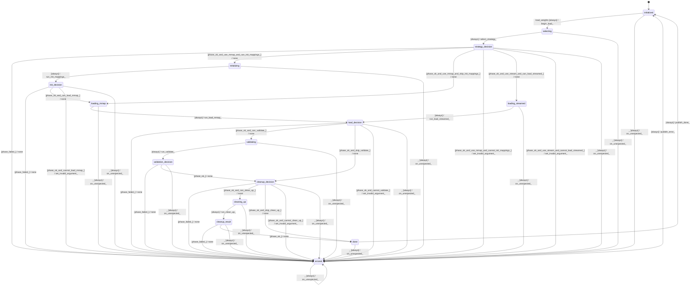

# model_weight_loader

Source: [`emel/model/weight_loader/sm.hpp`](https://github.com/stateforward/emel.cpp/blob/main/src/emel/model/weight_loader/sm.hpp)

## Mermaid

## Transitions

| Source | Event | Guard | Action | Target |
| --- | --- | --- | --- | --- |
| [`initialized`](https://github.com/stateforward/emel.cpp/blob/main/src/emel/model/weight_loader/sm.hpp) | [`load_weights`](https://github.com/stateforward/emel.cpp/blob/main/src/emel/model/weight_loader/sm.hpp) | [`always`](https://github.com/stateforward/emel.cpp/blob/main/src/emel/model/weight_loader/sm.hpp) | [`begin_load>`](https://github.com/stateforward/emel.cpp/blob/main/src/emel/model/weight_loader/sm.hpp) | [`selecting`](https://github.com/stateforward/emel.cpp/blob/main/src/emel/model/weight_loader/sm.hpp) |
| [`selecting`](https://github.com/stateforward/emel.cpp/blob/main/src/emel/model/weight_loader/sm.hpp) | - | [`always`](https://github.com/stateforward/emel.cpp/blob/main/src/emel/model/weight_loader/sm.hpp) | [`select_strategy>`](https://github.com/stateforward/emel.cpp/blob/main/src/emel/model/weight_loader/sm.hpp) | [`strategy_decision`](https://github.com/stateforward/emel.cpp/blob/main/src/emel/model/weight_loader/sm.hpp) |
| [`strategy_decision`](https://github.com/stateforward/emel.cpp/blob/main/src/emel/model/weight_loader/sm.hpp) | - | [`phase_failed>`](https://github.com/stateforward/emel.cpp/blob/main/src/emel/model/weight_loader/sm.hpp) | [`none`](https://github.com/stateforward/emel.cpp/blob/main/src/emel/model/weight_loader/sm.hpp) | [`errored`](https://github.com/stateforward/emel.cpp/blob/main/src/emel/model/weight_loader/sm.hpp) |
| [`strategy_decision`](https://github.com/stateforward/emel.cpp/blob/main/src/emel/model/weight_loader/sm.hpp) | - | [`phase_ok_and_use_mmap_and_can_init_mappings>`](https://github.com/stateforward/emel.cpp/blob/main/src/emel/model/weight_loader/sm.hpp) | [`none`](https://github.com/stateforward/emel.cpp/blob/main/src/emel/model/weight_loader/sm.hpp) | [`initializing`](https://github.com/stateforward/emel.cpp/blob/main/src/emel/model/weight_loader/sm.hpp) |
| [`strategy_decision`](https://github.com/stateforward/emel.cpp/blob/main/src/emel/model/weight_loader/sm.hpp) | - | [`phase_ok_and_use_mmap_and_skip_init_mappings>`](https://github.com/stateforward/emel.cpp/blob/main/src/emel/model/weight_loader/sm.hpp) | [`none`](https://github.com/stateforward/emel.cpp/blob/main/src/emel/model/weight_loader/sm.hpp) | [`loading_mmap`](https://github.com/stateforward/emel.cpp/blob/main/src/emel/model/weight_loader/sm.hpp) |
| [`strategy_decision`](https://github.com/stateforward/emel.cpp/blob/main/src/emel/model/weight_loader/sm.hpp) | - | [`phase_ok_and_use_mmap_and_cannot_init_mappings>`](https://github.com/stateforward/emel.cpp/blob/main/src/emel/model/weight_loader/sm.hpp) | [`set_invalid_argument>`](https://github.com/stateforward/emel.cpp/blob/main/src/emel/model/weight_loader/sm.hpp) | [`errored`](https://github.com/stateforward/emel.cpp/blob/main/src/emel/model/weight_loader/sm.hpp) |
| [`strategy_decision`](https://github.com/stateforward/emel.cpp/blob/main/src/emel/model/weight_loader/sm.hpp) | - | [`phase_ok_and_use_stream_and_can_load_streamed>`](https://github.com/stateforward/emel.cpp/blob/main/src/emel/model/weight_loader/sm.hpp) | [`none`](https://github.com/stateforward/emel.cpp/blob/main/src/emel/model/weight_loader/sm.hpp) | [`loading_streamed`](https://github.com/stateforward/emel.cpp/blob/main/src/emel/model/weight_loader/sm.hpp) |
| [`strategy_decision`](https://github.com/stateforward/emel.cpp/blob/main/src/emel/model/weight_loader/sm.hpp) | - | [`phase_ok_and_use_stream_and_cannot_load_streamed>`](https://github.com/stateforward/emel.cpp/blob/main/src/emel/model/weight_loader/sm.hpp) | [`set_invalid_argument>`](https://github.com/stateforward/emel.cpp/blob/main/src/emel/model/weight_loader/sm.hpp) | [`errored`](https://github.com/stateforward/emel.cpp/blob/main/src/emel/model/weight_loader/sm.hpp) |
| [`initializing`](https://github.com/stateforward/emel.cpp/blob/main/src/emel/model/weight_loader/sm.hpp) | - | [`always`](https://github.com/stateforward/emel.cpp/blob/main/src/emel/model/weight_loader/sm.hpp) | [`run_init_mappings>`](https://github.com/stateforward/emel.cpp/blob/main/src/emel/model/weight_loader/sm.hpp) | [`init_decision`](https://github.com/stateforward/emel.cpp/blob/main/src/emel/model/weight_loader/sm.hpp) |
| [`init_decision`](https://github.com/stateforward/emel.cpp/blob/main/src/emel/model/weight_loader/sm.hpp) | - | [`phase_failed>`](https://github.com/stateforward/emel.cpp/blob/main/src/emel/model/weight_loader/sm.hpp) | [`none`](https://github.com/stateforward/emel.cpp/blob/main/src/emel/model/weight_loader/sm.hpp) | [`errored`](https://github.com/stateforward/emel.cpp/blob/main/src/emel/model/weight_loader/sm.hpp) |
| [`init_decision`](https://github.com/stateforward/emel.cpp/blob/main/src/emel/model/weight_loader/sm.hpp) | - | [`phase_ok_and_can_load_mmap>`](https://github.com/stateforward/emel.cpp/blob/main/src/emel/model/weight_loader/sm.hpp) | [`none`](https://github.com/stateforward/emel.cpp/blob/main/src/emel/model/weight_loader/sm.hpp) | [`loading_mmap`](https://github.com/stateforward/emel.cpp/blob/main/src/emel/model/weight_loader/sm.hpp) |
| [`init_decision`](https://github.com/stateforward/emel.cpp/blob/main/src/emel/model/weight_loader/sm.hpp) | - | [`phase_ok_and_cannot_load_mmap>`](https://github.com/stateforward/emel.cpp/blob/main/src/emel/model/weight_loader/sm.hpp) | [`set_invalid_argument>`](https://github.com/stateforward/emel.cpp/blob/main/src/emel/model/weight_loader/sm.hpp) | [`errored`](https://github.com/stateforward/emel.cpp/blob/main/src/emel/model/weight_loader/sm.hpp) |
| [`loading_mmap`](https://github.com/stateforward/emel.cpp/blob/main/src/emel/model/weight_loader/sm.hpp) | - | [`always`](https://github.com/stateforward/emel.cpp/blob/main/src/emel/model/weight_loader/sm.hpp) | [`run_load_mmap>`](https://github.com/stateforward/emel.cpp/blob/main/src/emel/model/weight_loader/sm.hpp) | [`load_decision`](https://github.com/stateforward/emel.cpp/blob/main/src/emel/model/weight_loader/sm.hpp) |
| [`loading_streamed`](https://github.com/stateforward/emel.cpp/blob/main/src/emel/model/weight_loader/sm.hpp) | - | [`always`](https://github.com/stateforward/emel.cpp/blob/main/src/emel/model/weight_loader/sm.hpp) | [`run_load_streamed>`](https://github.com/stateforward/emel.cpp/blob/main/src/emel/model/weight_loader/sm.hpp) | [`load_decision`](https://github.com/stateforward/emel.cpp/blob/main/src/emel/model/weight_loader/sm.hpp) |
| [`load_decision`](https://github.com/stateforward/emel.cpp/blob/main/src/emel/model/weight_loader/sm.hpp) | - | [`phase_failed>`](https://github.com/stateforward/emel.cpp/blob/main/src/emel/model/weight_loader/sm.hpp) | [`none`](https://github.com/stateforward/emel.cpp/blob/main/src/emel/model/weight_loader/sm.hpp) | [`errored`](https://github.com/stateforward/emel.cpp/blob/main/src/emel/model/weight_loader/sm.hpp) |
| [`load_decision`](https://github.com/stateforward/emel.cpp/blob/main/src/emel/model/weight_loader/sm.hpp) | - | [`phase_ok_and_can_validate>`](https://github.com/stateforward/emel.cpp/blob/main/src/emel/model/weight_loader/sm.hpp) | [`none`](https://github.com/stateforward/emel.cpp/blob/main/src/emel/model/weight_loader/sm.hpp) | [`validating`](https://github.com/stateforward/emel.cpp/blob/main/src/emel/model/weight_loader/sm.hpp) |
| [`load_decision`](https://github.com/stateforward/emel.cpp/blob/main/src/emel/model/weight_loader/sm.hpp) | - | [`phase_ok_and_skip_validate>`](https://github.com/stateforward/emel.cpp/blob/main/src/emel/model/weight_loader/sm.hpp) | [`none`](https://github.com/stateforward/emel.cpp/blob/main/src/emel/model/weight_loader/sm.hpp) | [`cleanup_decision`](https://github.com/stateforward/emel.cpp/blob/main/src/emel/model/weight_loader/sm.hpp) |
| [`load_decision`](https://github.com/stateforward/emel.cpp/blob/main/src/emel/model/weight_loader/sm.hpp) | - | [`phase_ok_and_cannot_validate>`](https://github.com/stateforward/emel.cpp/blob/main/src/emel/model/weight_loader/sm.hpp) | [`set_invalid_argument>`](https://github.com/stateforward/emel.cpp/blob/main/src/emel/model/weight_loader/sm.hpp) | [`errored`](https://github.com/stateforward/emel.cpp/blob/main/src/emel/model/weight_loader/sm.hpp) |
| [`validating`](https://github.com/stateforward/emel.cpp/blob/main/src/emel/model/weight_loader/sm.hpp) | - | [`always`](https://github.com/stateforward/emel.cpp/blob/main/src/emel/model/weight_loader/sm.hpp) | [`run_validate>`](https://github.com/stateforward/emel.cpp/blob/main/src/emel/model/weight_loader/sm.hpp) | [`validation_decision`](https://github.com/stateforward/emel.cpp/blob/main/src/emel/model/weight_loader/sm.hpp) |
| [`validation_decision`](https://github.com/stateforward/emel.cpp/blob/main/src/emel/model/weight_loader/sm.hpp) | - | [`phase_failed>`](https://github.com/stateforward/emel.cpp/blob/main/src/emel/model/weight_loader/sm.hpp) | [`none`](https://github.com/stateforward/emel.cpp/blob/main/src/emel/model/weight_loader/sm.hpp) | [`errored`](https://github.com/stateforward/emel.cpp/blob/main/src/emel/model/weight_loader/sm.hpp) |
| [`validation_decision`](https://github.com/stateforward/emel.cpp/blob/main/src/emel/model/weight_loader/sm.hpp) | - | [`phase_ok>`](https://github.com/stateforward/emel.cpp/blob/main/src/emel/model/weight_loader/sm.hpp) | [`none`](https://github.com/stateforward/emel.cpp/blob/main/src/emel/model/weight_loader/sm.hpp) | [`cleanup_decision`](https://github.com/stateforward/emel.cpp/blob/main/src/emel/model/weight_loader/sm.hpp) |
| [`cleanup_decision`](https://github.com/stateforward/emel.cpp/blob/main/src/emel/model/weight_loader/sm.hpp) | - | [`phase_failed>`](https://github.com/stateforward/emel.cpp/blob/main/src/emel/model/weight_loader/sm.hpp) | [`none`](https://github.com/stateforward/emel.cpp/blob/main/src/emel/model/weight_loader/sm.hpp) | [`errored`](https://github.com/stateforward/emel.cpp/blob/main/src/emel/model/weight_loader/sm.hpp) |
| [`cleanup_decision`](https://github.com/stateforward/emel.cpp/blob/main/src/emel/model/weight_loader/sm.hpp) | - | [`phase_ok_and_can_clean_up>`](https://github.com/stateforward/emel.cpp/blob/main/src/emel/model/weight_loader/sm.hpp) | [`none`](https://github.com/stateforward/emel.cpp/blob/main/src/emel/model/weight_loader/sm.hpp) | [`cleaning_up`](https://github.com/stateforward/emel.cpp/blob/main/src/emel/model/weight_loader/sm.hpp) |
| [`cleanup_decision`](https://github.com/stateforward/emel.cpp/blob/main/src/emel/model/weight_loader/sm.hpp) | - | [`phase_ok_and_skip_clean_up>`](https://github.com/stateforward/emel.cpp/blob/main/src/emel/model/weight_loader/sm.hpp) | [`none`](https://github.com/stateforward/emel.cpp/blob/main/src/emel/model/weight_loader/sm.hpp) | [`done`](https://github.com/stateforward/emel.cpp/blob/main/src/emel/model/weight_loader/sm.hpp) |
| [`cleanup_decision`](https://github.com/stateforward/emel.cpp/blob/main/src/emel/model/weight_loader/sm.hpp) | - | [`phase_ok_and_cannot_clean_up>`](https://github.com/stateforward/emel.cpp/blob/main/src/emel/model/weight_loader/sm.hpp) | [`set_invalid_argument>`](https://github.com/stateforward/emel.cpp/blob/main/src/emel/model/weight_loader/sm.hpp) | [`errored`](https://github.com/stateforward/emel.cpp/blob/main/src/emel/model/weight_loader/sm.hpp) |
| [`cleaning_up`](https://github.com/stateforward/emel.cpp/blob/main/src/emel/model/weight_loader/sm.hpp) | - | [`always`](https://github.com/stateforward/emel.cpp/blob/main/src/emel/model/weight_loader/sm.hpp) | [`run_clean_up>`](https://github.com/stateforward/emel.cpp/blob/main/src/emel/model/weight_loader/sm.hpp) | [`cleanup_result`](https://github.com/stateforward/emel.cpp/blob/main/src/emel/model/weight_loader/sm.hpp) |
| [`cleanup_result`](https://github.com/stateforward/emel.cpp/blob/main/src/emel/model/weight_loader/sm.hpp) | - | [`phase_failed>`](https://github.com/stateforward/emel.cpp/blob/main/src/emel/model/weight_loader/sm.hpp) | [`none`](https://github.com/stateforward/emel.cpp/blob/main/src/emel/model/weight_loader/sm.hpp) | [`errored`](https://github.com/stateforward/emel.cpp/blob/main/src/emel/model/weight_loader/sm.hpp) |
| [`cleanup_result`](https://github.com/stateforward/emel.cpp/blob/main/src/emel/model/weight_loader/sm.hpp) | - | [`phase_ok>`](https://github.com/stateforward/emel.cpp/blob/main/src/emel/model/weight_loader/sm.hpp) | [`none`](https://github.com/stateforward/emel.cpp/blob/main/src/emel/model/weight_loader/sm.hpp) | [`done`](https://github.com/stateforward/emel.cpp/blob/main/src/emel/model/weight_loader/sm.hpp) |
| [`done`](https://github.com/stateforward/emel.cpp/blob/main/src/emel/model/weight_loader/sm.hpp) | - | [`always`](https://github.com/stateforward/emel.cpp/blob/main/src/emel/model/weight_loader/sm.hpp) | [`publish_done>`](https://github.com/stateforward/emel.cpp/blob/main/src/emel/model/weight_loader/sm.hpp) | [`initialized`](https://github.com/stateforward/emel.cpp/blob/main/src/emel/model/weight_loader/sm.hpp) |
| [`errored`](https://github.com/stateforward/emel.cpp/blob/main/src/emel/model/weight_loader/sm.hpp) | - | [`always`](https://github.com/stateforward/emel.cpp/blob/main/src/emel/model/weight_loader/sm.hpp) | [`publish_error>`](https://github.com/stateforward/emel.cpp/blob/main/src/emel/model/weight_loader/sm.hpp) | [`initialized`](https://github.com/stateforward/emel.cpp/blob/main/src/emel/model/weight_loader/sm.hpp) |
| [`initialized`](https://github.com/stateforward/emel.cpp/blob/main/src/emel/model/weight_loader/sm.hpp) | [`_`](https://github.com/stateforward/emel.cpp/blob/main/src/emel/model/weight_loader/sm.hpp) | [`always`](https://github.com/stateforward/emel.cpp/blob/main/src/emel/model/weight_loader/sm.hpp) | [`on_unexpected>`](https://github.com/stateforward/emel.cpp/blob/main/src/emel/model/weight_loader/sm.hpp) | [`errored`](https://github.com/stateforward/emel.cpp/blob/main/src/emel/model/weight_loader/sm.hpp) |
| [`selecting`](https://github.com/stateforward/emel.cpp/blob/main/src/emel/model/weight_loader/sm.hpp) | [`_`](https://github.com/stateforward/emel.cpp/blob/main/src/emel/model/weight_loader/sm.hpp) | [`always`](https://github.com/stateforward/emel.cpp/blob/main/src/emel/model/weight_loader/sm.hpp) | [`on_unexpected>`](https://github.com/stateforward/emel.cpp/blob/main/src/emel/model/weight_loader/sm.hpp) | [`errored`](https://github.com/stateforward/emel.cpp/blob/main/src/emel/model/weight_loader/sm.hpp) |
| [`strategy_decision`](https://github.com/stateforward/emel.cpp/blob/main/src/emel/model/weight_loader/sm.hpp) | [`_`](https://github.com/stateforward/emel.cpp/blob/main/src/emel/model/weight_loader/sm.hpp) | [`always`](https://github.com/stateforward/emel.cpp/blob/main/src/emel/model/weight_loader/sm.hpp) | [`on_unexpected>`](https://github.com/stateforward/emel.cpp/blob/main/src/emel/model/weight_loader/sm.hpp) | [`errored`](https://github.com/stateforward/emel.cpp/blob/main/src/emel/model/weight_loader/sm.hpp) |
| [`initializing`](https://github.com/stateforward/emel.cpp/blob/main/src/emel/model/weight_loader/sm.hpp) | [`_`](https://github.com/stateforward/emel.cpp/blob/main/src/emel/model/weight_loader/sm.hpp) | [`always`](https://github.com/stateforward/emel.cpp/blob/main/src/emel/model/weight_loader/sm.hpp) | [`on_unexpected>`](https://github.com/stateforward/emel.cpp/blob/main/src/emel/model/weight_loader/sm.hpp) | [`errored`](https://github.com/stateforward/emel.cpp/blob/main/src/emel/model/weight_loader/sm.hpp) |
| [`init_decision`](https://github.com/stateforward/emel.cpp/blob/main/src/emel/model/weight_loader/sm.hpp) | [`_`](https://github.com/stateforward/emel.cpp/blob/main/src/emel/model/weight_loader/sm.hpp) | [`always`](https://github.com/stateforward/emel.cpp/blob/main/src/emel/model/weight_loader/sm.hpp) | [`on_unexpected>`](https://github.com/stateforward/emel.cpp/blob/main/src/emel/model/weight_loader/sm.hpp) | [`errored`](https://github.com/stateforward/emel.cpp/blob/main/src/emel/model/weight_loader/sm.hpp) |
| [`loading_mmap`](https://github.com/stateforward/emel.cpp/blob/main/src/emel/model/weight_loader/sm.hpp) | [`_`](https://github.com/stateforward/emel.cpp/blob/main/src/emel/model/weight_loader/sm.hpp) | [`always`](https://github.com/stateforward/emel.cpp/blob/main/src/emel/model/weight_loader/sm.hpp) | [`on_unexpected>`](https://github.com/stateforward/emel.cpp/blob/main/src/emel/model/weight_loader/sm.hpp) | [`errored`](https://github.com/stateforward/emel.cpp/blob/main/src/emel/model/weight_loader/sm.hpp) |
| [`loading_streamed`](https://github.com/stateforward/emel.cpp/blob/main/src/emel/model/weight_loader/sm.hpp) | [`_`](https://github.com/stateforward/emel.cpp/blob/main/src/emel/model/weight_loader/sm.hpp) | [`always`](https://github.com/stateforward/emel.cpp/blob/main/src/emel/model/weight_loader/sm.hpp) | [`on_unexpected>`](https://github.com/stateforward/emel.cpp/blob/main/src/emel/model/weight_loader/sm.hpp) | [`errored`](https://github.com/stateforward/emel.cpp/blob/main/src/emel/model/weight_loader/sm.hpp) |
| [`load_decision`](https://github.com/stateforward/emel.cpp/blob/main/src/emel/model/weight_loader/sm.hpp) | [`_`](https://github.com/stateforward/emel.cpp/blob/main/src/emel/model/weight_loader/sm.hpp) | [`always`](https://github.com/stateforward/emel.cpp/blob/main/src/emel/model/weight_loader/sm.hpp) | [`on_unexpected>`](https://github.com/stateforward/emel.cpp/blob/main/src/emel/model/weight_loader/sm.hpp) | [`errored`](https://github.com/stateforward/emel.cpp/blob/main/src/emel/model/weight_loader/sm.hpp) |
| [`validating`](https://github.com/stateforward/emel.cpp/blob/main/src/emel/model/weight_loader/sm.hpp) | [`_`](https://github.com/stateforward/emel.cpp/blob/main/src/emel/model/weight_loader/sm.hpp) | [`always`](https://github.com/stateforward/emel.cpp/blob/main/src/emel/model/weight_loader/sm.hpp) | [`on_unexpected>`](https://github.com/stateforward/emel.cpp/blob/main/src/emel/model/weight_loader/sm.hpp) | [`errored`](https://github.com/stateforward/emel.cpp/blob/main/src/emel/model/weight_loader/sm.hpp) |
| [`validation_decision`](https://github.com/stateforward/emel.cpp/blob/main/src/emel/model/weight_loader/sm.hpp) | [`_`](https://github.com/stateforward/emel.cpp/blob/main/src/emel/model/weight_loader/sm.hpp) | [`always`](https://github.com/stateforward/emel.cpp/blob/main/src/emel/model/weight_loader/sm.hpp) | [`on_unexpected>`](https://github.com/stateforward/emel.cpp/blob/main/src/emel/model/weight_loader/sm.hpp) | [`errored`](https://github.com/stateforward/emel.cpp/blob/main/src/emel/model/weight_loader/sm.hpp) |
| [`cleanup_decision`](https://github.com/stateforward/emel.cpp/blob/main/src/emel/model/weight_loader/sm.hpp) | [`_`](https://github.com/stateforward/emel.cpp/blob/main/src/emel/model/weight_loader/sm.hpp) | [`always`](https://github.com/stateforward/emel.cpp/blob/main/src/emel/model/weight_loader/sm.hpp) | [`on_unexpected>`](https://github.com/stateforward/emel.cpp/blob/main/src/emel/model/weight_loader/sm.hpp) | [`errored`](https://github.com/stateforward/emel.cpp/blob/main/src/emel/model/weight_loader/sm.hpp) |
| [`cleaning_up`](https://github.com/stateforward/emel.cpp/blob/main/src/emel/model/weight_loader/sm.hpp) | [`_`](https://github.com/stateforward/emel.cpp/blob/main/src/emel/model/weight_loader/sm.hpp) | [`always`](https://github.com/stateforward/emel.cpp/blob/main/src/emel/model/weight_loader/sm.hpp) | [`on_unexpected>`](https://github.com/stateforward/emel.cpp/blob/main/src/emel/model/weight_loader/sm.hpp) | [`errored`](https://github.com/stateforward/emel.cpp/blob/main/src/emel/model/weight_loader/sm.hpp) |
| [`cleanup_result`](https://github.com/stateforward/emel.cpp/blob/main/src/emel/model/weight_loader/sm.hpp) | [`_`](https://github.com/stateforward/emel.cpp/blob/main/src/emel/model/weight_loader/sm.hpp) | [`always`](https://github.com/stateforward/emel.cpp/blob/main/src/emel/model/weight_loader/sm.hpp) | [`on_unexpected>`](https://github.com/stateforward/emel.cpp/blob/main/src/emel/model/weight_loader/sm.hpp) | [`errored`](https://github.com/stateforward/emel.cpp/blob/main/src/emel/model/weight_loader/sm.hpp) |
| [`done`](https://github.com/stateforward/emel.cpp/blob/main/src/emel/model/weight_loader/sm.hpp) | [`_`](https://github.com/stateforward/emel.cpp/blob/main/src/emel/model/weight_loader/sm.hpp) | [`always`](https://github.com/stateforward/emel.cpp/blob/main/src/emel/model/weight_loader/sm.hpp) | [`on_unexpected>`](https://github.com/stateforward/emel.cpp/blob/main/src/emel/model/weight_loader/sm.hpp) | [`errored`](https://github.com/stateforward/emel.cpp/blob/main/src/emel/model/weight_loader/sm.hpp) |
| [`errored`](https://github.com/stateforward/emel.cpp/blob/main/src/emel/model/weight_loader/sm.hpp) | [`_`](https://github.com/stateforward/emel.cpp/blob/main/src/emel/model/weight_loader/sm.hpp) | [`always`](https://github.com/stateforward/emel.cpp/blob/main/src/emel/model/weight_loader/sm.hpp) | [`on_unexpected>`](https://github.com/stateforward/emel.cpp/blob/main/src/emel/model/weight_loader/sm.hpp) | [`errored`](https://github.com/stateforward/emel.cpp/blob/main/src/emel/model/weight_loader/sm.hpp) |
