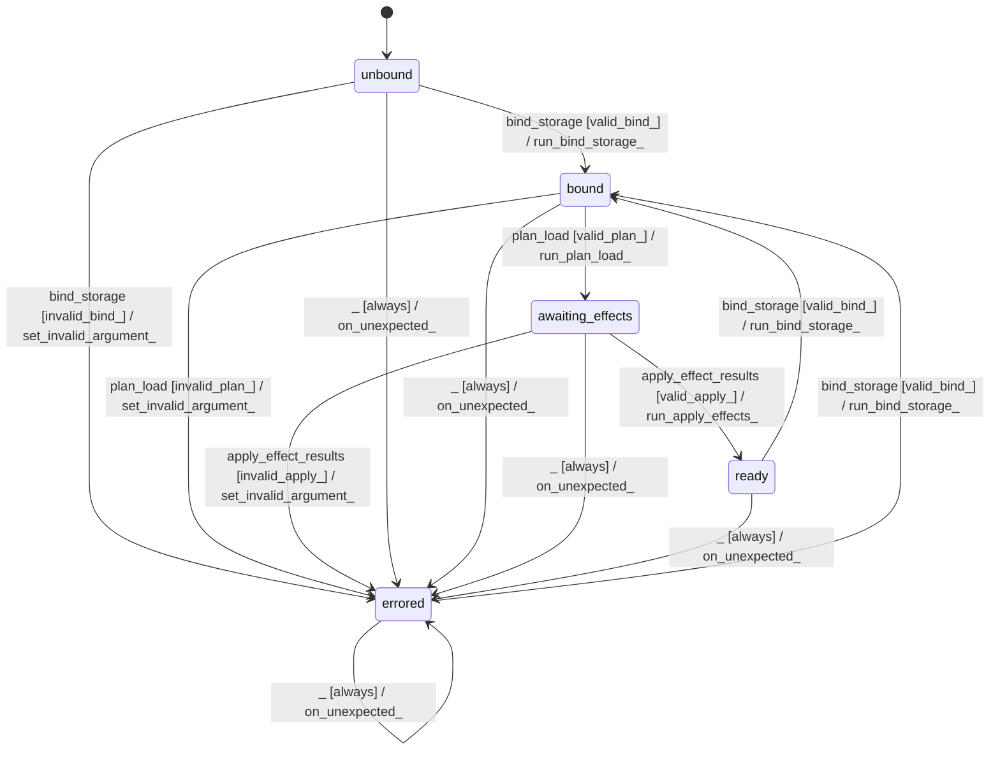

# model_weight_loader

Source: [`emel/model/weight_loader/sm.hpp`](https://github.com/stateforward/emel.cpp/blob/main/src/emel/model/weight_loader/sm.hpp)

## Mermaid

```mermaid
stateDiagram-v2
  direction TB
  [*] --> unbound
  unbound --> bound : bind_storage [valid_bind_] / run_bind_storage_
  unbound --> errored : bind_storage [invalid_bind_] / set_invalid_argument_
  bound --> awaiting_effects : plan_load [valid_plan_] / run_plan_load_
  bound --> errored : plan_load [invalid_plan_] / set_invalid_argument_
  awaiting_effects --> ready : apply_effect_results [valid_apply_] / run_apply_effects_
  awaiting_effects --> errored : apply_effect_results [invalid_apply_] / set_invalid_argument_
  ready --> bound : bind_storage [valid_bind_] / run_bind_storage_
  errored --> bound : bind_storage [valid_bind_] / run_bind_storage_
  unbound --> errored : _ [always] / on_unexpected_
  bound --> errored : _ [always] / on_unexpected_
  awaiting_effects --> errored : _ [always] / on_unexpected_
  ready --> errored : _ [always] / on_unexpected_
  errored --> errored : _ [always] / on_unexpected_
```

## Transitions

| Source | Event | Guard | Action | Target |
| --- | --- | --- | --- | --- |
| [`unbound`](https://github.com/stateforward/emel.cpp/blob/main/src/emel/model/weight_loader/sm.hpp) | [`bind_storage`](https://github.com/stateforward/emel.cpp/blob/main/src/emel/model/weight_loader/sm.hpp) | [`valid_bind>`](https://github.com/stateforward/emel.cpp/blob/main/src/emel/model/weight_loader/sm.hpp) | [`run_bind_storage>`](https://github.com/stateforward/emel.cpp/blob/main/src/emel/model/weight_loader/sm.hpp) | [`bound`](https://github.com/stateforward/emel.cpp/blob/main/src/emel/model/weight_loader/sm.hpp) |
| [`unbound`](https://github.com/stateforward/emel.cpp/blob/main/src/emel/model/weight_loader/sm.hpp) | [`bind_storage`](https://github.com/stateforward/emel.cpp/blob/main/src/emel/model/weight_loader/sm.hpp) | [`invalid_bind>`](https://github.com/stateforward/emel.cpp/blob/main/src/emel/model/weight_loader/sm.hpp) | [`set_invalid_argument>`](https://github.com/stateforward/emel.cpp/blob/main/src/emel/model/weight_loader/sm.hpp) | [`errored`](https://github.com/stateforward/emel.cpp/blob/main/src/emel/model/weight_loader/sm.hpp) |
| [`bound`](https://github.com/stateforward/emel.cpp/blob/main/src/emel/model/weight_loader/sm.hpp) | [`plan_load`](https://github.com/stateforward/emel.cpp/blob/main/src/emel/model/weight_loader/sm.hpp) | [`valid_plan>`](https://github.com/stateforward/emel.cpp/blob/main/src/emel/model/weight_loader/sm.hpp) | [`run_plan_load>`](https://github.com/stateforward/emel.cpp/blob/main/src/emel/model/weight_loader/sm.hpp) | [`awaiting_effects`](https://github.com/stateforward/emel.cpp/blob/main/src/emel/model/weight_loader/sm.hpp) |
| [`bound`](https://github.com/stateforward/emel.cpp/blob/main/src/emel/model/weight_loader/sm.hpp) | [`plan_load`](https://github.com/stateforward/emel.cpp/blob/main/src/emel/model/weight_loader/sm.hpp) | [`invalid_plan>`](https://github.com/stateforward/emel.cpp/blob/main/src/emel/model/weight_loader/sm.hpp) | [`set_invalid_argument>`](https://github.com/stateforward/emel.cpp/blob/main/src/emel/model/weight_loader/sm.hpp) | [`errored`](https://github.com/stateforward/emel.cpp/blob/main/src/emel/model/weight_loader/sm.hpp) |
| [`awaiting_effects`](https://github.com/stateforward/emel.cpp/blob/main/src/emel/model/weight_loader/sm.hpp) | [`apply_effect_results`](https://github.com/stateforward/emel.cpp/blob/main/src/emel/model/weight_loader/sm.hpp) | [`valid_apply>`](https://github.com/stateforward/emel.cpp/blob/main/src/emel/model/weight_loader/sm.hpp) | [`run_apply_effects>`](https://github.com/stateforward/emel.cpp/blob/main/src/emel/model/weight_loader/sm.hpp) | [`ready`](https://github.com/stateforward/emel.cpp/blob/main/src/emel/model/weight_loader/sm.hpp) |
| [`awaiting_effects`](https://github.com/stateforward/emel.cpp/blob/main/src/emel/model/weight_loader/sm.hpp) | [`apply_effect_results`](https://github.com/stateforward/emel.cpp/blob/main/src/emel/model/weight_loader/sm.hpp) | [`invalid_apply>`](https://github.com/stateforward/emel.cpp/blob/main/src/emel/model/weight_loader/sm.hpp) | [`set_invalid_argument>`](https://github.com/stateforward/emel.cpp/blob/main/src/emel/model/weight_loader/sm.hpp) | [`errored`](https://github.com/stateforward/emel.cpp/blob/main/src/emel/model/weight_loader/sm.hpp) |
| [`ready`](https://github.com/stateforward/emel.cpp/blob/main/src/emel/model/weight_loader/sm.hpp) | [`bind_storage`](https://github.com/stateforward/emel.cpp/blob/main/src/emel/model/weight_loader/sm.hpp) | [`valid_bind>`](https://github.com/stateforward/emel.cpp/blob/main/src/emel/model/weight_loader/sm.hpp) | [`run_bind_storage>`](https://github.com/stateforward/emel.cpp/blob/main/src/emel/model/weight_loader/sm.hpp) | [`bound`](https://github.com/stateforward/emel.cpp/blob/main/src/emel/model/weight_loader/sm.hpp) |
| [`errored`](https://github.com/stateforward/emel.cpp/blob/main/src/emel/model/weight_loader/sm.hpp) | [`bind_storage`](https://github.com/stateforward/emel.cpp/blob/main/src/emel/model/weight_loader/sm.hpp) | [`valid_bind>`](https://github.com/stateforward/emel.cpp/blob/main/src/emel/model/weight_loader/sm.hpp) | [`run_bind_storage>`](https://github.com/stateforward/emel.cpp/blob/main/src/emel/model/weight_loader/sm.hpp) | [`bound`](https://github.com/stateforward/emel.cpp/blob/main/src/emel/model/weight_loader/sm.hpp) |
| [`unbound`](https://github.com/stateforward/emel.cpp/blob/main/src/emel/model/weight_loader/sm.hpp) | [`_`](https://github.com/stateforward/emel.cpp/blob/main/src/emel/model/weight_loader/sm.hpp) | [`always`](https://github.com/stateforward/emel.cpp/blob/main/src/emel/model/weight_loader/sm.hpp) | [`on_unexpected>`](https://github.com/stateforward/emel.cpp/blob/main/src/emel/model/weight_loader/sm.hpp) | [`errored`](https://github.com/stateforward/emel.cpp/blob/main/src/emel/model/weight_loader/sm.hpp) |
| [`bound`](https://github.com/stateforward/emel.cpp/blob/main/src/emel/model/weight_loader/sm.hpp) | [`_`](https://github.com/stateforward/emel.cpp/blob/main/src/emel/model/weight_loader/sm.hpp) | [`always`](https://github.com/stateforward/emel.cpp/blob/main/src/emel/model/weight_loader/sm.hpp) | [`on_unexpected>`](https://github.com/stateforward/emel.cpp/blob/main/src/emel/model/weight_loader/sm.hpp) | [`errored`](https://github.com/stateforward/emel.cpp/blob/main/src/emel/model/weight_loader/sm.hpp) |
| [`awaiting_effects`](https://github.com/stateforward/emel.cpp/blob/main/src/emel/model/weight_loader/sm.hpp) | [`_`](https://github.com/stateforward/emel.cpp/blob/main/src/emel/model/weight_loader/sm.hpp) | [`always`](https://github.com/stateforward/emel.cpp/blob/main/src/emel/model/weight_loader/sm.hpp) | [`on_unexpected>`](https://github.com/stateforward/emel.cpp/blob/main/src/emel/model/weight_loader/sm.hpp) | [`errored`](https://github.com/stateforward/emel.cpp/blob/main/src/emel/model/weight_loader/sm.hpp) |
| [`ready`](https://github.com/stateforward/emel.cpp/blob/main/src/emel/model/weight_loader/sm.hpp) | [`_`](https://github.com/stateforward/emel.cpp/blob/main/src/emel/model/weight_loader/sm.hpp) | [`always`](https://github.com/stateforward/emel.cpp/blob/main/src/emel/model/weight_loader/sm.hpp) | [`on_unexpected>`](https://github.com/stateforward/emel.cpp/blob/main/src/emel/model/weight_loader/sm.hpp) | [`errored`](https://github.com/stateforward/emel.cpp/blob/main/src/emel/model/weight_loader/sm.hpp) |
| [`errored`](https://github.com/stateforward/emel.cpp/blob/main/src/emel/model/weight_loader/sm.hpp) | [`_`](https://github.com/stateforward/emel.cpp/blob/main/src/emel/model/weight_loader/sm.hpp) | [`always`](https://github.com/stateforward/emel.cpp/blob/main/src/emel/model/weight_loader/sm.hpp) | [`on_unexpected>`](https://github.com/stateforward/emel.cpp/blob/main/src/emel/model/weight_loader/sm.hpp) | [`errored`](https://github.com/stateforward/emel.cpp/blob/main/src/emel/model/weight_loader/sm.hpp) |
