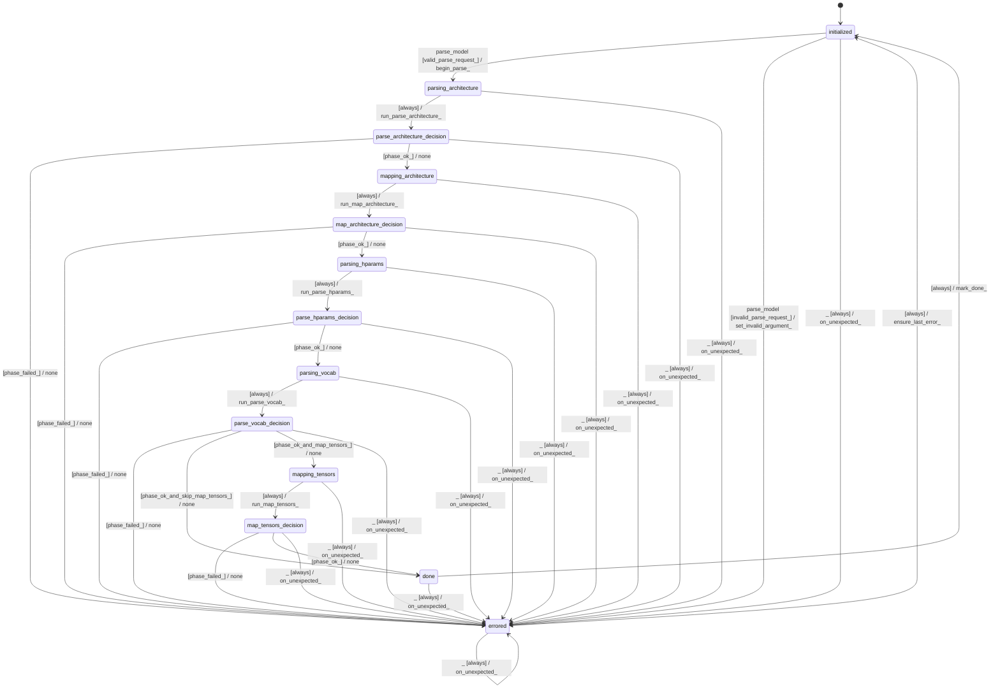

# parser_gguf

Source: [`emel/parser/gguf/sm.hpp`](https://github.com/stateforward/emel.cpp/blob/main/src/emel/parser/gguf/sm.hpp)

## Mermaid

## Transitions

| Source | Event | Guard | Action | Target |
| --- | --- | --- | --- | --- |
| [`initialized`](https://github.com/stateforward/emel.cpp/blob/main/src/emel/parser/gguf/sm.hpp) | [`parse_model`](https://github.com/stateforward/emel.cpp/blob/main/src/emel/parser/gguf/sm.hpp) | [`valid_parse_request>`](https://github.com/stateforward/emel.cpp/blob/main/src/emel/parser/gguf/sm.hpp) | [`begin_parse>`](https://github.com/stateforward/emel.cpp/blob/main/src/emel/parser/gguf/sm.hpp) | [`parsing_architecture`](https://github.com/stateforward/emel.cpp/blob/main/src/emel/parser/gguf/sm.hpp) |
| [`initialized`](https://github.com/stateforward/emel.cpp/blob/main/src/emel/parser/gguf/sm.hpp) | [`parse_model`](https://github.com/stateforward/emel.cpp/blob/main/src/emel/parser/gguf/sm.hpp) | [`invalid_parse_request>`](https://github.com/stateforward/emel.cpp/blob/main/src/emel/parser/gguf/sm.hpp) | [`set_invalid_argument>`](https://github.com/stateforward/emel.cpp/blob/main/src/emel/parser/gguf/sm.hpp) | [`errored`](https://github.com/stateforward/emel.cpp/blob/main/src/emel/parser/gguf/sm.hpp) |
| [`parsing_architecture`](https://github.com/stateforward/emel.cpp/blob/main/src/emel/parser/gguf/sm.hpp) | - | [`always`](https://github.com/stateforward/emel.cpp/blob/main/src/emel/parser/gguf/sm.hpp) | [`run_parse_architecture>`](https://github.com/stateforward/emel.cpp/blob/main/src/emel/parser/gguf/sm.hpp) | [`parse_architecture_decision`](https://github.com/stateforward/emel.cpp/blob/main/src/emel/parser/gguf/sm.hpp) |
| [`parse_architecture_decision`](https://github.com/stateforward/emel.cpp/blob/main/src/emel/parser/gguf/sm.hpp) | - | [`phase_failed>`](https://github.com/stateforward/emel.cpp/blob/main/src/emel/parser/gguf/sm.hpp) | [`none`](https://github.com/stateforward/emel.cpp/blob/main/src/emel/parser/gguf/sm.hpp) | [`errored`](https://github.com/stateforward/emel.cpp/blob/main/src/emel/parser/gguf/sm.hpp) |
| [`parse_architecture_decision`](https://github.com/stateforward/emel.cpp/blob/main/src/emel/parser/gguf/sm.hpp) | - | [`phase_ok>`](https://github.com/stateforward/emel.cpp/blob/main/src/emel/parser/gguf/sm.hpp) | [`none`](https://github.com/stateforward/emel.cpp/blob/main/src/emel/parser/gguf/sm.hpp) | [`mapping_architecture`](https://github.com/stateforward/emel.cpp/blob/main/src/emel/parser/gguf/sm.hpp) |
| [`mapping_architecture`](https://github.com/stateforward/emel.cpp/blob/main/src/emel/parser/gguf/sm.hpp) | - | [`always`](https://github.com/stateforward/emel.cpp/blob/main/src/emel/parser/gguf/sm.hpp) | [`run_map_architecture>`](https://github.com/stateforward/emel.cpp/blob/main/src/emel/parser/gguf/sm.hpp) | [`map_architecture_decision`](https://github.com/stateforward/emel.cpp/blob/main/src/emel/parser/gguf/sm.hpp) |
| [`map_architecture_decision`](https://github.com/stateforward/emel.cpp/blob/main/src/emel/parser/gguf/sm.hpp) | - | [`phase_failed>`](https://github.com/stateforward/emel.cpp/blob/main/src/emel/parser/gguf/sm.hpp) | [`none`](https://github.com/stateforward/emel.cpp/blob/main/src/emel/parser/gguf/sm.hpp) | [`errored`](https://github.com/stateforward/emel.cpp/blob/main/src/emel/parser/gguf/sm.hpp) |
| [`map_architecture_decision`](https://github.com/stateforward/emel.cpp/blob/main/src/emel/parser/gguf/sm.hpp) | - | [`phase_ok>`](https://github.com/stateforward/emel.cpp/blob/main/src/emel/parser/gguf/sm.hpp) | [`none`](https://github.com/stateforward/emel.cpp/blob/main/src/emel/parser/gguf/sm.hpp) | [`parsing_hparams`](https://github.com/stateforward/emel.cpp/blob/main/src/emel/parser/gguf/sm.hpp) |
| [`parsing_hparams`](https://github.com/stateforward/emel.cpp/blob/main/src/emel/parser/gguf/sm.hpp) | - | [`always`](https://github.com/stateforward/emel.cpp/blob/main/src/emel/parser/gguf/sm.hpp) | [`run_parse_hparams>`](https://github.com/stateforward/emel.cpp/blob/main/src/emel/parser/gguf/sm.hpp) | [`parse_hparams_decision`](https://github.com/stateforward/emel.cpp/blob/main/src/emel/parser/gguf/sm.hpp) |
| [`parse_hparams_decision`](https://github.com/stateforward/emel.cpp/blob/main/src/emel/parser/gguf/sm.hpp) | - | [`phase_failed>`](https://github.com/stateforward/emel.cpp/blob/main/src/emel/parser/gguf/sm.hpp) | [`none`](https://github.com/stateforward/emel.cpp/blob/main/src/emel/parser/gguf/sm.hpp) | [`errored`](https://github.com/stateforward/emel.cpp/blob/main/src/emel/parser/gguf/sm.hpp) |
| [`parse_hparams_decision`](https://github.com/stateforward/emel.cpp/blob/main/src/emel/parser/gguf/sm.hpp) | - | [`phase_ok>`](https://github.com/stateforward/emel.cpp/blob/main/src/emel/parser/gguf/sm.hpp) | [`none`](https://github.com/stateforward/emel.cpp/blob/main/src/emel/parser/gguf/sm.hpp) | [`parsing_vocab`](https://github.com/stateforward/emel.cpp/blob/main/src/emel/parser/gguf/sm.hpp) |
| [`parsing_vocab`](https://github.com/stateforward/emel.cpp/blob/main/src/emel/parser/gguf/sm.hpp) | - | [`always`](https://github.com/stateforward/emel.cpp/blob/main/src/emel/parser/gguf/sm.hpp) | [`run_parse_vocab>`](https://github.com/stateforward/emel.cpp/blob/main/src/emel/parser/gguf/sm.hpp) | [`parse_vocab_decision`](https://github.com/stateforward/emel.cpp/blob/main/src/emel/parser/gguf/sm.hpp) |
| [`parse_vocab_decision`](https://github.com/stateforward/emel.cpp/blob/main/src/emel/parser/gguf/sm.hpp) | - | [`phase_failed>`](https://github.com/stateforward/emel.cpp/blob/main/src/emel/parser/gguf/sm.hpp) | [`none`](https://github.com/stateforward/emel.cpp/blob/main/src/emel/parser/gguf/sm.hpp) | [`errored`](https://github.com/stateforward/emel.cpp/blob/main/src/emel/parser/gguf/sm.hpp) |
| [`parse_vocab_decision`](https://github.com/stateforward/emel.cpp/blob/main/src/emel/parser/gguf/sm.hpp) | - | [`phase_ok_and_skip_map_tensors>`](https://github.com/stateforward/emel.cpp/blob/main/src/emel/parser/gguf/sm.hpp) | [`none`](https://github.com/stateforward/emel.cpp/blob/main/src/emel/parser/gguf/sm.hpp) | [`done`](https://github.com/stateforward/emel.cpp/blob/main/src/emel/parser/gguf/sm.hpp) |
| [`parse_vocab_decision`](https://github.com/stateforward/emel.cpp/blob/main/src/emel/parser/gguf/sm.hpp) | - | [`phase_ok_and_map_tensors>`](https://github.com/stateforward/emel.cpp/blob/main/src/emel/parser/gguf/sm.hpp) | [`none`](https://github.com/stateforward/emel.cpp/blob/main/src/emel/parser/gguf/sm.hpp) | [`mapping_tensors`](https://github.com/stateforward/emel.cpp/blob/main/src/emel/parser/gguf/sm.hpp) |
| [`mapping_tensors`](https://github.com/stateforward/emel.cpp/blob/main/src/emel/parser/gguf/sm.hpp) | - | [`always`](https://github.com/stateforward/emel.cpp/blob/main/src/emel/parser/gguf/sm.hpp) | [`run_map_tensors>`](https://github.com/stateforward/emel.cpp/blob/main/src/emel/parser/gguf/sm.hpp) | [`map_tensors_decision`](https://github.com/stateforward/emel.cpp/blob/main/src/emel/parser/gguf/sm.hpp) |
| [`map_tensors_decision`](https://github.com/stateforward/emel.cpp/blob/main/src/emel/parser/gguf/sm.hpp) | - | [`phase_failed>`](https://github.com/stateforward/emel.cpp/blob/main/src/emel/parser/gguf/sm.hpp) | [`none`](https://github.com/stateforward/emel.cpp/blob/main/src/emel/parser/gguf/sm.hpp) | [`errored`](https://github.com/stateforward/emel.cpp/blob/main/src/emel/parser/gguf/sm.hpp) |
| [`map_tensors_decision`](https://github.com/stateforward/emel.cpp/blob/main/src/emel/parser/gguf/sm.hpp) | - | [`phase_ok>`](https://github.com/stateforward/emel.cpp/blob/main/src/emel/parser/gguf/sm.hpp) | [`none`](https://github.com/stateforward/emel.cpp/blob/main/src/emel/parser/gguf/sm.hpp) | [`done`](https://github.com/stateforward/emel.cpp/blob/main/src/emel/parser/gguf/sm.hpp) |
| [`done`](https://github.com/stateforward/emel.cpp/blob/main/src/emel/parser/gguf/sm.hpp) | - | [`always`](https://github.com/stateforward/emel.cpp/blob/main/src/emel/parser/gguf/sm.hpp) | [`mark_done>`](https://github.com/stateforward/emel.cpp/blob/main/src/emel/parser/gguf/sm.hpp) | [`initialized`](https://github.com/stateforward/emel.cpp/blob/main/src/emel/parser/gguf/sm.hpp) |
| [`errored`](https://github.com/stateforward/emel.cpp/blob/main/src/emel/parser/gguf/sm.hpp) | - | [`always`](https://github.com/stateforward/emel.cpp/blob/main/src/emel/parser/gguf/sm.hpp) | [`ensure_last_error>`](https://github.com/stateforward/emel.cpp/blob/main/src/emel/parser/gguf/sm.hpp) | [`initialized`](https://github.com/stateforward/emel.cpp/blob/main/src/emel/parser/gguf/sm.hpp) |
| [`initialized`](https://github.com/stateforward/emel.cpp/blob/main/src/emel/parser/gguf/sm.hpp) | [`_`](https://github.com/stateforward/emel.cpp/blob/main/src/emel/parser/gguf/sm.hpp) | [`always`](https://github.com/stateforward/emel.cpp/blob/main/src/emel/parser/gguf/sm.hpp) | [`on_unexpected>`](https://github.com/stateforward/emel.cpp/blob/main/src/emel/parser/gguf/sm.hpp) | [`errored`](https://github.com/stateforward/emel.cpp/blob/main/src/emel/parser/gguf/sm.hpp) |
| [`parsing_architecture`](https://github.com/stateforward/emel.cpp/blob/main/src/emel/parser/gguf/sm.hpp) | [`_`](https://github.com/stateforward/emel.cpp/blob/main/src/emel/parser/gguf/sm.hpp) | [`always`](https://github.com/stateforward/emel.cpp/blob/main/src/emel/parser/gguf/sm.hpp) | [`on_unexpected>`](https://github.com/stateforward/emel.cpp/blob/main/src/emel/parser/gguf/sm.hpp) | [`errored`](https://github.com/stateforward/emel.cpp/blob/main/src/emel/parser/gguf/sm.hpp) |
| [`parse_architecture_decision`](https://github.com/stateforward/emel.cpp/blob/main/src/emel/parser/gguf/sm.hpp) | [`_`](https://github.com/stateforward/emel.cpp/blob/main/src/emel/parser/gguf/sm.hpp) | [`always`](https://github.com/stateforward/emel.cpp/blob/main/src/emel/parser/gguf/sm.hpp) | [`on_unexpected>`](https://github.com/stateforward/emel.cpp/blob/main/src/emel/parser/gguf/sm.hpp) | [`errored`](https://github.com/stateforward/emel.cpp/blob/main/src/emel/parser/gguf/sm.hpp) |
| [`mapping_architecture`](https://github.com/stateforward/emel.cpp/blob/main/src/emel/parser/gguf/sm.hpp) | [`_`](https://github.com/stateforward/emel.cpp/blob/main/src/emel/parser/gguf/sm.hpp) | [`always`](https://github.com/stateforward/emel.cpp/blob/main/src/emel/parser/gguf/sm.hpp) | [`on_unexpected>`](https://github.com/stateforward/emel.cpp/blob/main/src/emel/parser/gguf/sm.hpp) | [`errored`](https://github.com/stateforward/emel.cpp/blob/main/src/emel/parser/gguf/sm.hpp) |
| [`map_architecture_decision`](https://github.com/stateforward/emel.cpp/blob/main/src/emel/parser/gguf/sm.hpp) | [`_`](https://github.com/stateforward/emel.cpp/blob/main/src/emel/parser/gguf/sm.hpp) | [`always`](https://github.com/stateforward/emel.cpp/blob/main/src/emel/parser/gguf/sm.hpp) | [`on_unexpected>`](https://github.com/stateforward/emel.cpp/blob/main/src/emel/parser/gguf/sm.hpp) | [`errored`](https://github.com/stateforward/emel.cpp/blob/main/src/emel/parser/gguf/sm.hpp) |
| [`parsing_hparams`](https://github.com/stateforward/emel.cpp/blob/main/src/emel/parser/gguf/sm.hpp) | [`_`](https://github.com/stateforward/emel.cpp/blob/main/src/emel/parser/gguf/sm.hpp) | [`always`](https://github.com/stateforward/emel.cpp/blob/main/src/emel/parser/gguf/sm.hpp) | [`on_unexpected>`](https://github.com/stateforward/emel.cpp/blob/main/src/emel/parser/gguf/sm.hpp) | [`errored`](https://github.com/stateforward/emel.cpp/blob/main/src/emel/parser/gguf/sm.hpp) |
| [`parse_hparams_decision`](https://github.com/stateforward/emel.cpp/blob/main/src/emel/parser/gguf/sm.hpp) | [`_`](https://github.com/stateforward/emel.cpp/blob/main/src/emel/parser/gguf/sm.hpp) | [`always`](https://github.com/stateforward/emel.cpp/blob/main/src/emel/parser/gguf/sm.hpp) | [`on_unexpected>`](https://github.com/stateforward/emel.cpp/blob/main/src/emel/parser/gguf/sm.hpp) | [`errored`](https://github.com/stateforward/emel.cpp/blob/main/src/emel/parser/gguf/sm.hpp) |
| [`parsing_vocab`](https://github.com/stateforward/emel.cpp/blob/main/src/emel/parser/gguf/sm.hpp) | [`_`](https://github.com/stateforward/emel.cpp/blob/main/src/emel/parser/gguf/sm.hpp) | [`always`](https://github.com/stateforward/emel.cpp/blob/main/src/emel/parser/gguf/sm.hpp) | [`on_unexpected>`](https://github.com/stateforward/emel.cpp/blob/main/src/emel/parser/gguf/sm.hpp) | [`errored`](https://github.com/stateforward/emel.cpp/blob/main/src/emel/parser/gguf/sm.hpp) |
| [`parse_vocab_decision`](https://github.com/stateforward/emel.cpp/blob/main/src/emel/parser/gguf/sm.hpp) | [`_`](https://github.com/stateforward/emel.cpp/blob/main/src/emel/parser/gguf/sm.hpp) | [`always`](https://github.com/stateforward/emel.cpp/blob/main/src/emel/parser/gguf/sm.hpp) | [`on_unexpected>`](https://github.com/stateforward/emel.cpp/blob/main/src/emel/parser/gguf/sm.hpp) | [`errored`](https://github.com/stateforward/emel.cpp/blob/main/src/emel/parser/gguf/sm.hpp) |
| [`mapping_tensors`](https://github.com/stateforward/emel.cpp/blob/main/src/emel/parser/gguf/sm.hpp) | [`_`](https://github.com/stateforward/emel.cpp/blob/main/src/emel/parser/gguf/sm.hpp) | [`always`](https://github.com/stateforward/emel.cpp/blob/main/src/emel/parser/gguf/sm.hpp) | [`on_unexpected>`](https://github.com/stateforward/emel.cpp/blob/main/src/emel/parser/gguf/sm.hpp) | [`errored`](https://github.com/stateforward/emel.cpp/blob/main/src/emel/parser/gguf/sm.hpp) |
| [`map_tensors_decision`](https://github.com/stateforward/emel.cpp/blob/main/src/emel/parser/gguf/sm.hpp) | [`_`](https://github.com/stateforward/emel.cpp/blob/main/src/emel/parser/gguf/sm.hpp) | [`always`](https://github.com/stateforward/emel.cpp/blob/main/src/emel/parser/gguf/sm.hpp) | [`on_unexpected>`](https://github.com/stateforward/emel.cpp/blob/main/src/emel/parser/gguf/sm.hpp) | [`errored`](https://github.com/stateforward/emel.cpp/blob/main/src/emel/parser/gguf/sm.hpp) |
| [`done`](https://github.com/stateforward/emel.cpp/blob/main/src/emel/parser/gguf/sm.hpp) | [`_`](https://github.com/stateforward/emel.cpp/blob/main/src/emel/parser/gguf/sm.hpp) | [`always`](https://github.com/stateforward/emel.cpp/blob/main/src/emel/parser/gguf/sm.hpp) | [`on_unexpected>`](https://github.com/stateforward/emel.cpp/blob/main/src/emel/parser/gguf/sm.hpp) | [`errored`](https://github.com/stateforward/emel.cpp/blob/main/src/emel/parser/gguf/sm.hpp) |
| [`errored`](https://github.com/stateforward/emel.cpp/blob/main/src/emel/parser/gguf/sm.hpp) | [`_`](https://github.com/stateforward/emel.cpp/blob/main/src/emel/parser/gguf/sm.hpp) | [`always`](https://github.com/stateforward/emel.cpp/blob/main/src/emel/parser/gguf/sm.hpp) | [`on_unexpected>`](https://github.com/stateforward/emel.cpp/blob/main/src/emel/parser/gguf/sm.hpp) | [`errored`](https://github.com/stateforward/emel.cpp/blob/main/src/emel/parser/gguf/sm.hpp) |
