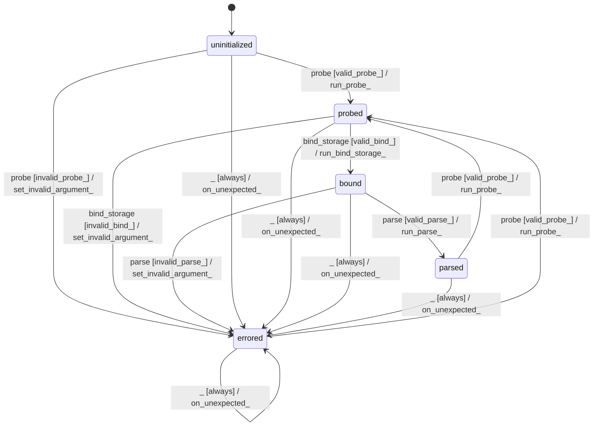

# parser_gguf

Source: [`emel/parser/gguf/sm.hpp`](https://github.com/stateforward/emel.cpp/blob/main/src/emel/parser/gguf/sm.hpp)

## Mermaid

```mermaid
stateDiagram-v2
  direction TB
  [*] --> uninitialized
  uninitialized --> probed : probe [valid_probe_] / run_probe_
  uninitialized --> errored : probe [invalid_probe_] / set_invalid_argument_
  probed --> bound : bind_storage [valid_bind_] / run_bind_storage_
  probed --> errored : bind_storage [invalid_bind_] / set_invalid_argument_
  bound --> parsed : parse [valid_parse_] / run_parse_
  bound --> errored : parse [invalid_parse_] / set_invalid_argument_
  parsed --> probed : probe [valid_probe_] / run_probe_
  errored --> probed : probe [valid_probe_] / run_probe_
  uninitialized --> errored : _ [always] / on_unexpected_
  probed --> errored : _ [always] / on_unexpected_
  bound --> errored : _ [always] / on_unexpected_
  parsed --> errored : _ [always] / on_unexpected_
  errored --> errored : _ [always] / on_unexpected_
```

## Transitions

| Source | Event | Guard | Action | Target |
| --- | --- | --- | --- | --- |
| [`uninitialized`](https://github.com/stateforward/emel.cpp/blob/main/src/emel/parser/gguf/sm.hpp) | [`probe`](https://github.com/stateforward/emel.cpp/blob/main/src/emel/parser/gguf/sm.hpp) | [`valid_probe>`](https://github.com/stateforward/emel.cpp/blob/main/src/emel/parser/gguf/sm.hpp) | [`run_probe>`](https://github.com/stateforward/emel.cpp/blob/main/src/emel/parser/gguf/sm.hpp) | [`probed`](https://github.com/stateforward/emel.cpp/blob/main/src/emel/parser/gguf/sm.hpp) |
| [`uninitialized`](https://github.com/stateforward/emel.cpp/blob/main/src/emel/parser/gguf/sm.hpp) | [`probe`](https://github.com/stateforward/emel.cpp/blob/main/src/emel/parser/gguf/sm.hpp) | [`invalid_probe>`](https://github.com/stateforward/emel.cpp/blob/main/src/emel/parser/gguf/sm.hpp) | [`set_invalid_argument>`](https://github.com/stateforward/emel.cpp/blob/main/src/emel/parser/gguf/sm.hpp) | [`errored`](https://github.com/stateforward/emel.cpp/blob/main/src/emel/parser/gguf/sm.hpp) |
| [`probed`](https://github.com/stateforward/emel.cpp/blob/main/src/emel/parser/gguf/sm.hpp) | [`bind_storage`](https://github.com/stateforward/emel.cpp/blob/main/src/emel/parser/gguf/sm.hpp) | [`valid_bind>`](https://github.com/stateforward/emel.cpp/blob/main/src/emel/parser/gguf/sm.hpp) | [`run_bind_storage>`](https://github.com/stateforward/emel.cpp/blob/main/src/emel/parser/gguf/sm.hpp) | [`bound`](https://github.com/stateforward/emel.cpp/blob/main/src/emel/parser/gguf/sm.hpp) |
| [`probed`](https://github.com/stateforward/emel.cpp/blob/main/src/emel/parser/gguf/sm.hpp) | [`bind_storage`](https://github.com/stateforward/emel.cpp/blob/main/src/emel/parser/gguf/sm.hpp) | [`invalid_bind>`](https://github.com/stateforward/emel.cpp/blob/main/src/emel/parser/gguf/sm.hpp) | [`set_invalid_argument>`](https://github.com/stateforward/emel.cpp/blob/main/src/emel/parser/gguf/sm.hpp) | [`errored`](https://github.com/stateforward/emel.cpp/blob/main/src/emel/parser/gguf/sm.hpp) |
| [`bound`](https://github.com/stateforward/emel.cpp/blob/main/src/emel/parser/gguf/sm.hpp) | [`parse`](https://github.com/stateforward/emel.cpp/blob/main/src/emel/parser/gguf/sm.hpp) | [`valid_parse>`](https://github.com/stateforward/emel.cpp/blob/main/src/emel/parser/gguf/sm.hpp) | [`run_parse>`](https://github.com/stateforward/emel.cpp/blob/main/src/emel/parser/gguf/sm.hpp) | [`parsed`](https://github.com/stateforward/emel.cpp/blob/main/src/emel/parser/gguf/sm.hpp) |
| [`bound`](https://github.com/stateforward/emel.cpp/blob/main/src/emel/parser/gguf/sm.hpp) | [`parse`](https://github.com/stateforward/emel.cpp/blob/main/src/emel/parser/gguf/sm.hpp) | [`invalid_parse>`](https://github.com/stateforward/emel.cpp/blob/main/src/emel/parser/gguf/sm.hpp) | [`set_invalid_argument>`](https://github.com/stateforward/emel.cpp/blob/main/src/emel/parser/gguf/sm.hpp) | [`errored`](https://github.com/stateforward/emel.cpp/blob/main/src/emel/parser/gguf/sm.hpp) |
| [`parsed`](https://github.com/stateforward/emel.cpp/blob/main/src/emel/parser/gguf/sm.hpp) | [`probe`](https://github.com/stateforward/emel.cpp/blob/main/src/emel/parser/gguf/sm.hpp) | [`valid_probe>`](https://github.com/stateforward/emel.cpp/blob/main/src/emel/parser/gguf/sm.hpp) | [`run_probe>`](https://github.com/stateforward/emel.cpp/blob/main/src/emel/parser/gguf/sm.hpp) | [`probed`](https://github.com/stateforward/emel.cpp/blob/main/src/emel/parser/gguf/sm.hpp) |
| [`errored`](https://github.com/stateforward/emel.cpp/blob/main/src/emel/parser/gguf/sm.hpp) | [`probe`](https://github.com/stateforward/emel.cpp/blob/main/src/emel/parser/gguf/sm.hpp) | [`valid_probe>`](https://github.com/stateforward/emel.cpp/blob/main/src/emel/parser/gguf/sm.hpp) | [`run_probe>`](https://github.com/stateforward/emel.cpp/blob/main/src/emel/parser/gguf/sm.hpp) | [`probed`](https://github.com/stateforward/emel.cpp/blob/main/src/emel/parser/gguf/sm.hpp) |
| [`uninitialized`](https://github.com/stateforward/emel.cpp/blob/main/src/emel/parser/gguf/sm.hpp) | [`_`](https://github.com/stateforward/emel.cpp/blob/main/src/emel/parser/gguf/sm.hpp) | [`always`](https://github.com/stateforward/emel.cpp/blob/main/src/emel/parser/gguf/sm.hpp) | [`on_unexpected>`](https://github.com/stateforward/emel.cpp/blob/main/src/emel/parser/gguf/sm.hpp) | [`errored`](https://github.com/stateforward/emel.cpp/blob/main/src/emel/parser/gguf/sm.hpp) |
| [`probed`](https://github.com/stateforward/emel.cpp/blob/main/src/emel/parser/gguf/sm.hpp) | [`_`](https://github.com/stateforward/emel.cpp/blob/main/src/emel/parser/gguf/sm.hpp) | [`always`](https://github.com/stateforward/emel.cpp/blob/main/src/emel/parser/gguf/sm.hpp) | [`on_unexpected>`](https://github.com/stateforward/emel.cpp/blob/main/src/emel/parser/gguf/sm.hpp) | [`errored`](https://github.com/stateforward/emel.cpp/blob/main/src/emel/parser/gguf/sm.hpp) |
| [`bound`](https://github.com/stateforward/emel.cpp/blob/main/src/emel/parser/gguf/sm.hpp) | [`_`](https://github.com/stateforward/emel.cpp/blob/main/src/emel/parser/gguf/sm.hpp) | [`always`](https://github.com/stateforward/emel.cpp/blob/main/src/emel/parser/gguf/sm.hpp) | [`on_unexpected>`](https://github.com/stateforward/emel.cpp/blob/main/src/emel/parser/gguf/sm.hpp) | [`errored`](https://github.com/stateforward/emel.cpp/blob/main/src/emel/parser/gguf/sm.hpp) |
| [`parsed`](https://github.com/stateforward/emel.cpp/blob/main/src/emel/parser/gguf/sm.hpp) | [`_`](https://github.com/stateforward/emel.cpp/blob/main/src/emel/parser/gguf/sm.hpp) | [`always`](https://github.com/stateforward/emel.cpp/blob/main/src/emel/parser/gguf/sm.hpp) | [`on_unexpected>`](https://github.com/stateforward/emel.cpp/blob/main/src/emel/parser/gguf/sm.hpp) | [`errored`](https://github.com/stateforward/emel.cpp/blob/main/src/emel/parser/gguf/sm.hpp) |
| [`errored`](https://github.com/stateforward/emel.cpp/blob/main/src/emel/parser/gguf/sm.hpp) | [`_`](https://github.com/stateforward/emel.cpp/blob/main/src/emel/parser/gguf/sm.hpp) | [`always`](https://github.com/stateforward/emel.cpp/blob/main/src/emel/parser/gguf/sm.hpp) | [`on_unexpected>`](https://github.com/stateforward/emel.cpp/blob/main/src/emel/parser/gguf/sm.hpp) | [`errored`](https://github.com/stateforward/emel.cpp/blob/main/src/emel/parser/gguf/sm.hpp) |
