# sampler_pipeline

Source: [`emel/sampler/pipeline/sm.hpp`](https://github.com/stateforward/emel.cpp/blob/main/src/emel/sampler/pipeline/sm.hpp)

## Mermaid

```mermaid
stateDiagram-v2
  [*] --> emel__sampler__pipeline__initialized
  emel__sampler__pipeline__initialized --> emel__sampler__pipeline__preparing_candidates : emel__sampler__pipeline__event__sample [boost__sml__front__always] / boost__sml__aux__zero_wrapper_emel__sampler__pipeline__action___lambda_at__Users_gabrielwillen_VSCode_stateforward_emel_emel_cpp_src_emel_sampler_pipeline_actions_hpp_19_38__
  emel__sampler__pipeline__preparing_candidates --> boost__sml__front__internal : on_entry [boost__sml__front__always] / boost__sml__aux__zero_wrapper__lambda_at__Users_gabrielwillen_VSCode_stateforward_emel_emel_cpp_src_emel_sampler_pipeline_sm_hpp_48_11__
  emel__sampler__pipeline__preparing_candidates --> emel__sampler__pipeline__preparing_candidates : emel__sampler__pipeline__event__prepare_candidates [boost__sml__front__always] / boost__sml__aux__zero_wrapper_emel__sampler__pipeline__action___lambda_at__Users_gabrielwillen_VSCode_stateforward_emel_emel_cpp_src_emel_sampler_pipeline_actions_hpp_28_48__
  emel__sampler__pipeline__preparing_candidates --> emel__sampler__pipeline__sampling : emel__sampler__pipeline__events__prepare_candidates_done [boost__sml__front__always] / boost__sml__front__none
  emel__sampler__pipeline__preparing_candidates --> emel__sampler__pipeline__errored : emel__sampler__pipeline__events__prepare_candidates_error [boost__sml__front__always] / boost__sml__front__none
  emel__sampler__pipeline__sampling --> boost__sml__front__internal : on_entry [boost__sml__front__always] / boost__sml__aux__zero_wrapper__lambda_at__Users_gabrielwillen_VSCode_stateforward_emel_emel_cpp_src_emel_sampler_pipeline_sm_hpp_82_11__
  emel__sampler__pipeline__sampling --> boost__sml__front__internal : on_entry [boost__sml__front__always] / boost__sml__aux__zero_wrapper__lambda_at__Users_gabrielwillen_VSCode_stateforward_emel_emel_cpp_src_emel_sampler_pipeline_sm_hpp_115_11__
  emel__sampler__pipeline__sampling --> emel__sampler__pipeline__sampling : emel__sampler__pipeline__event__apply_sampling [boost__sml__front__always] / boost__sml__aux__zero_wrapper_emel__sampler__pipeline__action___lambda_at__Users_gabrielwillen_VSCode_stateforward_emel_emel_cpp_src_emel_sampler_pipeline_actions_hpp_50_44__
  emel__sampler__pipeline__sampling --> emel__sampler__pipeline__sampling : emel__sampler__pipeline__events__apply_sampling_done [boost__sml__aux__zero_wrapper_emel__sampler__pipeline__guard__has_more_samplers_] / boost__sml__front__none
  emel__sampler__pipeline__sampling --> emel__sampler__pipeline__selecting_token : emel__sampler__pipeline__events__apply_sampling_done [boost__sml__aux__zero_wrapper_emel__sampler__pipeline__guard__no_more_samplers_] / boost__sml__front__none
  emel__sampler__pipeline__sampling --> emel__sampler__pipeline__errored : emel__sampler__pipeline__events__apply_sampling_error [boost__sml__front__always] / boost__sml__front__none
  emel__sampler__pipeline__selecting_token --> boost__sml__front__internal : on_entry [boost__sml__front__always] / boost__sml__aux__zero_wrapper__lambda_at__Users_gabrielwillen_VSCode_stateforward_emel_emel_cpp_src_emel_sampler_pipeline_sm_hpp_155_11__
  emel__sampler__pipeline__selecting_token --> emel__sampler__pipeline__selecting_token : emel__sampler__pipeline__event__select_token [boost__sml__front__always] / boost__sml__aux__zero_wrapper_emel__sampler__pipeline__action___lambda_at__Users_gabrielwillen_VSCode_stateforward_emel_emel_cpp_src_emel_sampler_pipeline_actions_hpp_84_42__
  emel__sampler__pipeline__selecting_token --> emel__sampler__pipeline__done : emel__sampler__pipeline__events__select_token_done [boost__sml__front__always] / boost__sml__front__none
  emel__sampler__pipeline__selecting_token --> emel__sampler__pipeline__errored : emel__sampler__pipeline__events__select_token_error [boost__sml__front__always] / boost__sml__front__none
  emel__sampler__pipeline__done --> boost__sml__front__internal : on_entry [boost__sml__front__always] / boost__sml__aux__zero_wrapper__lambda_at__Users_gabrielwillen_VSCode_stateforward_emel_emel_cpp_src_emel_sampler_pipeline_sm_hpp_187_11__
  emel__sampler__pipeline__done --> emel__sampler__pipeline__initialized : emel__sampler__pipeline__events__sampling_done [boost__sml__front__always] / boost__sml__aux__zero_wrapper_emel__sampler__pipeline__action___lambda_at__Users_gabrielwillen_VSCode_stateforward_emel_emel_cpp_src_emel_sampler_pipeline_actions_hpp_108_42__
  emel__sampler__pipeline__done --> emel__sampler__pipeline__initialized : emel__sampler__pipeline__events__sampling_error [boost__sml__front__always] / boost__sml__aux__zero_wrapper_emel__sampler__pipeline__action___lambda_at__Users_gabrielwillen_VSCode_stateforward_emel_emel_cpp_src_emel_sampler_pipeline_actions_hpp_112_43__
  emel__sampler__pipeline__errored --> boost__sml__front__internal : on_entry [boost__sml__front__always] / boost__sml__aux__zero_wrapper__lambda_at__Users_gabrielwillen_VSCode_stateforward_emel_emel_cpp_src_emel_sampler_pipeline_sm_hpp_204_11__
  emel__sampler__pipeline__errored --> emel__sampler__pipeline__initialized : emel__sampler__pipeline__events__sampling_error [boost__sml__front__always] / boost__sml__aux__zero_wrapper_emel__sampler__pipeline__action___lambda_at__Users_gabrielwillen_VSCode_stateforward_emel_emel_cpp_src_emel_sampler_pipeline_actions_hpp_112_43__
```

## Transitions

| Source | Event | Guard | Action | Target |
| --- | --- | --- | --- | --- |
| [`initialized`](https://github.com/stateforward/emel.cpp/blob/main/src/emel/sampler/pipeline/sm.hpp) | [`sample`](https://github.com/stateforward/emel.cpp/blob/main/src/emel/sampler/pipeline/sm.hpp) | [`always`](https://github.com/stateforward/emel.cpp/blob/main/src/emel/sampler/pipeline/sm.hpp) | [`(lambda at /Users/gabrielwillen/VSCode/stateforward/emel/emel.cpp/src/emel/sampler/pipeline/actions.hpp:19:38)>`](https://github.com/stateforward/emel.cpp/blob/main/src/emel/sampler/pipeline/sm.hpp) | [`preparing_candidates`](https://github.com/stateforward/emel.cpp/blob/main/src/emel/sampler/pipeline/sm.hpp) |
| [`preparing_candidates`](https://github.com/stateforward/emel.cpp/blob/main/src/emel/sampler/pipeline/sm.hpp) | [`on_entry`](https://github.com/stateforward/emel.cpp/blob/main/src/emel/sampler/pipeline/sm.hpp) | [`always`](https://github.com/stateforward/emel.cpp/blob/main/src/emel/sampler/pipeline/sm.hpp) | [`zero_wrapper<(lambda at /Users/gabrielwillen/VSCode/stateforward/emel/emel.cpp/src/emel/sampler/pipeline/sm.hpp:48:11)>`](https://github.com/stateforward/emel.cpp/blob/main/src/emel/sampler/pipeline/sm.hpp) | [`internal`](https://github.com/stateforward/emel.cpp/blob/main/src/emel/sampler/pipeline/sm.hpp) |
| [`preparing_candidates`](https://github.com/stateforward/emel.cpp/blob/main/src/emel/sampler/pipeline/sm.hpp) | [`prepare_candidates`](https://github.com/stateforward/emel.cpp/blob/main/src/emel/sampler/pipeline/sm.hpp) | [`always`](https://github.com/stateforward/emel.cpp/blob/main/src/emel/sampler/pipeline/sm.hpp) | [`(lambda at /Users/gabrielwillen/VSCode/stateforward/emel/emel.cpp/src/emel/sampler/pipeline/actions.hpp:28:48)>`](https://github.com/stateforward/emel.cpp/blob/main/src/emel/sampler/pipeline/sm.hpp) | [`preparing_candidates`](https://github.com/stateforward/emel.cpp/blob/main/src/emel/sampler/pipeline/sm.hpp) |
| [`preparing_candidates`](https://github.com/stateforward/emel.cpp/blob/main/src/emel/sampler/pipeline/sm.hpp) | [`prepare_candidates_done`](https://github.com/stateforward/emel.cpp/blob/main/src/emel/sampler/pipeline/sm.hpp) | [`always`](https://github.com/stateforward/emel.cpp/blob/main/src/emel/sampler/pipeline/sm.hpp) | [`none`](https://github.com/stateforward/emel.cpp/blob/main/src/emel/sampler/pipeline/sm.hpp) | [`sampling`](https://github.com/stateforward/emel.cpp/blob/main/src/emel/sampler/pipeline/sm.hpp) |
| [`preparing_candidates`](https://github.com/stateforward/emel.cpp/blob/main/src/emel/sampler/pipeline/sm.hpp) | [`prepare_candidates_error`](https://github.com/stateforward/emel.cpp/blob/main/src/emel/sampler/pipeline/sm.hpp) | [`always`](https://github.com/stateforward/emel.cpp/blob/main/src/emel/sampler/pipeline/sm.hpp) | [`none`](https://github.com/stateforward/emel.cpp/blob/main/src/emel/sampler/pipeline/sm.hpp) | [`errored`](https://github.com/stateforward/emel.cpp/blob/main/src/emel/sampler/pipeline/sm.hpp) |
| [`sampling`](https://github.com/stateforward/emel.cpp/blob/main/src/emel/sampler/pipeline/sm.hpp) | [`on_entry`](https://github.com/stateforward/emel.cpp/blob/main/src/emel/sampler/pipeline/sm.hpp) | [`always`](https://github.com/stateforward/emel.cpp/blob/main/src/emel/sampler/pipeline/sm.hpp) | [`zero_wrapper<(lambda at /Users/gabrielwillen/VSCode/stateforward/emel/emel.cpp/src/emel/sampler/pipeline/sm.hpp:82:11)>`](https://github.com/stateforward/emel.cpp/blob/main/src/emel/sampler/pipeline/sm.hpp) | [`internal`](https://github.com/stateforward/emel.cpp/blob/main/src/emel/sampler/pipeline/sm.hpp) |
| [`sampling`](https://github.com/stateforward/emel.cpp/blob/main/src/emel/sampler/pipeline/sm.hpp) | [`on_entry`](https://github.com/stateforward/emel.cpp/blob/main/src/emel/sampler/pipeline/sm.hpp) | [`always`](https://github.com/stateforward/emel.cpp/blob/main/src/emel/sampler/pipeline/sm.hpp) | [`zero_wrapper<(lambda at /Users/gabrielwillen/VSCode/stateforward/emel/emel.cpp/src/emel/sampler/pipeline/sm.hpp:115:11)>`](https://github.com/stateforward/emel.cpp/blob/main/src/emel/sampler/pipeline/sm.hpp) | [`internal`](https://github.com/stateforward/emel.cpp/blob/main/src/emel/sampler/pipeline/sm.hpp) |
| [`sampling`](https://github.com/stateforward/emel.cpp/blob/main/src/emel/sampler/pipeline/sm.hpp) | [`apply_sampling`](https://github.com/stateforward/emel.cpp/blob/main/src/emel/sampler/pipeline/sm.hpp) | [`always`](https://github.com/stateforward/emel.cpp/blob/main/src/emel/sampler/pipeline/sm.hpp) | [`(lambda at /Users/gabrielwillen/VSCode/stateforward/emel/emel.cpp/src/emel/sampler/pipeline/actions.hpp:50:44)>`](https://github.com/stateforward/emel.cpp/blob/main/src/emel/sampler/pipeline/sm.hpp) | [`sampling`](https://github.com/stateforward/emel.cpp/blob/main/src/emel/sampler/pipeline/sm.hpp) |
| [`sampling`](https://github.com/stateforward/emel.cpp/blob/main/src/emel/sampler/pipeline/sm.hpp) | [`apply_sampling_done`](https://github.com/stateforward/emel.cpp/blob/main/src/emel/sampler/pipeline/sm.hpp) | [`has_more_samplers>`](https://github.com/stateforward/emel.cpp/blob/main/src/emel/sampler/pipeline/sm.hpp) | [`none`](https://github.com/stateforward/emel.cpp/blob/main/src/emel/sampler/pipeline/sm.hpp) | [`sampling`](https://github.com/stateforward/emel.cpp/blob/main/src/emel/sampler/pipeline/sm.hpp) |
| [`sampling`](https://github.com/stateforward/emel.cpp/blob/main/src/emel/sampler/pipeline/sm.hpp) | [`apply_sampling_done`](https://github.com/stateforward/emel.cpp/blob/main/src/emel/sampler/pipeline/sm.hpp) | [`no_more_samplers>`](https://github.com/stateforward/emel.cpp/blob/main/src/emel/sampler/pipeline/sm.hpp) | [`none`](https://github.com/stateforward/emel.cpp/blob/main/src/emel/sampler/pipeline/sm.hpp) | [`selecting_token`](https://github.com/stateforward/emel.cpp/blob/main/src/emel/sampler/pipeline/sm.hpp) |
| [`sampling`](https://github.com/stateforward/emel.cpp/blob/main/src/emel/sampler/pipeline/sm.hpp) | [`apply_sampling_error`](https://github.com/stateforward/emel.cpp/blob/main/src/emel/sampler/pipeline/sm.hpp) | [`always`](https://github.com/stateforward/emel.cpp/blob/main/src/emel/sampler/pipeline/sm.hpp) | [`none`](https://github.com/stateforward/emel.cpp/blob/main/src/emel/sampler/pipeline/sm.hpp) | [`errored`](https://github.com/stateforward/emel.cpp/blob/main/src/emel/sampler/pipeline/sm.hpp) |
| [`selecting_token`](https://github.com/stateforward/emel.cpp/blob/main/src/emel/sampler/pipeline/sm.hpp) | [`on_entry`](https://github.com/stateforward/emel.cpp/blob/main/src/emel/sampler/pipeline/sm.hpp) | [`always`](https://github.com/stateforward/emel.cpp/blob/main/src/emel/sampler/pipeline/sm.hpp) | [`zero_wrapper<(lambda at /Users/gabrielwillen/VSCode/stateforward/emel/emel.cpp/src/emel/sampler/pipeline/sm.hpp:155:11)>`](https://github.com/stateforward/emel.cpp/blob/main/src/emel/sampler/pipeline/sm.hpp) | [`internal`](https://github.com/stateforward/emel.cpp/blob/main/src/emel/sampler/pipeline/sm.hpp) |
| [`selecting_token`](https://github.com/stateforward/emel.cpp/blob/main/src/emel/sampler/pipeline/sm.hpp) | [`select_token`](https://github.com/stateforward/emel.cpp/blob/main/src/emel/sampler/pipeline/sm.hpp) | [`always`](https://github.com/stateforward/emel.cpp/blob/main/src/emel/sampler/pipeline/sm.hpp) | [`(lambda at /Users/gabrielwillen/VSCode/stateforward/emel/emel.cpp/src/emel/sampler/pipeline/actions.hpp:84:42)>`](https://github.com/stateforward/emel.cpp/blob/main/src/emel/sampler/pipeline/sm.hpp) | [`selecting_token`](https://github.com/stateforward/emel.cpp/blob/main/src/emel/sampler/pipeline/sm.hpp) |
| [`selecting_token`](https://github.com/stateforward/emel.cpp/blob/main/src/emel/sampler/pipeline/sm.hpp) | [`select_token_done`](https://github.com/stateforward/emel.cpp/blob/main/src/emel/sampler/pipeline/sm.hpp) | [`always`](https://github.com/stateforward/emel.cpp/blob/main/src/emel/sampler/pipeline/sm.hpp) | [`none`](https://github.com/stateforward/emel.cpp/blob/main/src/emel/sampler/pipeline/sm.hpp) | [`done`](https://github.com/stateforward/emel.cpp/blob/main/src/emel/sampler/pipeline/sm.hpp) |
| [`selecting_token`](https://github.com/stateforward/emel.cpp/blob/main/src/emel/sampler/pipeline/sm.hpp) | [`select_token_error`](https://github.com/stateforward/emel.cpp/blob/main/src/emel/sampler/pipeline/sm.hpp) | [`always`](https://github.com/stateforward/emel.cpp/blob/main/src/emel/sampler/pipeline/sm.hpp) | [`none`](https://github.com/stateforward/emel.cpp/blob/main/src/emel/sampler/pipeline/sm.hpp) | [`errored`](https://github.com/stateforward/emel.cpp/blob/main/src/emel/sampler/pipeline/sm.hpp) |
| [`done`](https://github.com/stateforward/emel.cpp/blob/main/src/emel/sampler/pipeline/sm.hpp) | [`on_entry`](https://github.com/stateforward/emel.cpp/blob/main/src/emel/sampler/pipeline/sm.hpp) | [`always`](https://github.com/stateforward/emel.cpp/blob/main/src/emel/sampler/pipeline/sm.hpp) | [`zero_wrapper<(lambda at /Users/gabrielwillen/VSCode/stateforward/emel/emel.cpp/src/emel/sampler/pipeline/sm.hpp:187:11)>`](https://github.com/stateforward/emel.cpp/blob/main/src/emel/sampler/pipeline/sm.hpp) | [`internal`](https://github.com/stateforward/emel.cpp/blob/main/src/emel/sampler/pipeline/sm.hpp) |
| [`done`](https://github.com/stateforward/emel.cpp/blob/main/src/emel/sampler/pipeline/sm.hpp) | [`sampling_done`](https://github.com/stateforward/emel.cpp/blob/main/src/emel/sampler/pipeline/sm.hpp) | [`always`](https://github.com/stateforward/emel.cpp/blob/main/src/emel/sampler/pipeline/sm.hpp) | [`(lambda at /Users/gabrielwillen/VSCode/stateforward/emel/emel.cpp/src/emel/sampler/pipeline/actions.hpp:108:42)>`](https://github.com/stateforward/emel.cpp/blob/main/src/emel/sampler/pipeline/sm.hpp) | [`initialized`](https://github.com/stateforward/emel.cpp/blob/main/src/emel/sampler/pipeline/sm.hpp) |
| [`done`](https://github.com/stateforward/emel.cpp/blob/main/src/emel/sampler/pipeline/sm.hpp) | [`sampling_error`](https://github.com/stateforward/emel.cpp/blob/main/src/emel/sampler/pipeline/sm.hpp) | [`always`](https://github.com/stateforward/emel.cpp/blob/main/src/emel/sampler/pipeline/sm.hpp) | [`(lambda at /Users/gabrielwillen/VSCode/stateforward/emel/emel.cpp/src/emel/sampler/pipeline/actions.hpp:112:43)>`](https://github.com/stateforward/emel.cpp/blob/main/src/emel/sampler/pipeline/sm.hpp) | [`initialized`](https://github.com/stateforward/emel.cpp/blob/main/src/emel/sampler/pipeline/sm.hpp) |
| [`errored`](https://github.com/stateforward/emel.cpp/blob/main/src/emel/sampler/pipeline/sm.hpp) | [`on_entry`](https://github.com/stateforward/emel.cpp/blob/main/src/emel/sampler/pipeline/sm.hpp) | [`always`](https://github.com/stateforward/emel.cpp/blob/main/src/emel/sampler/pipeline/sm.hpp) | [`zero_wrapper<(lambda at /Users/gabrielwillen/VSCode/stateforward/emel/emel.cpp/src/emel/sampler/pipeline/sm.hpp:204:11)>`](https://github.com/stateforward/emel.cpp/blob/main/src/emel/sampler/pipeline/sm.hpp) | [`internal`](https://github.com/stateforward/emel.cpp/blob/main/src/emel/sampler/pipeline/sm.hpp) |
| [`errored`](https://github.com/stateforward/emel.cpp/blob/main/src/emel/sampler/pipeline/sm.hpp) | [`sampling_error`](https://github.com/stateforward/emel.cpp/blob/main/src/emel/sampler/pipeline/sm.hpp) | [`always`](https://github.com/stateforward/emel.cpp/blob/main/src/emel/sampler/pipeline/sm.hpp) | [`(lambda at /Users/gabrielwillen/VSCode/stateforward/emel/emel.cpp/src/emel/sampler/pipeline/actions.hpp:112:43)>`](https://github.com/stateforward/emel.cpp/blob/main/src/emel/sampler/pipeline/sm.hpp) | [`initialized`](https://github.com/stateforward/emel.cpp/blob/main/src/emel/sampler/pipeline/sm.hpp) |
