# sampler_pipeline

Source: [`emel/sampler/pipeline/sm.hpp`](https://github.com/stateforward/emel.cpp/blob/main/src/emel/sampler/pipeline/sm.hpp)

## Mermaid

```mermaid
stateDiagram-v2
  direction TB
  [*] --> emel__sampler__pipeline__initialized
  emel__sampler__pipeline__initialized --> emel__sampler__pipeline__preparing_candidates : emel__sampler__pipeline__event__sample [boost__sml__front__always] / boost__sml__aux__zero_wrapper_emel__sampler__pipeline__action__begin_sample_
  emel__sampler__pipeline__preparing_candidates --> emel__sampler__pipeline__prepare_decision : [boost__sml__front__always] / boost__sml__aux__zero_wrapper_emel__sampler__pipeline__action__run_prepare_candidates_
  emel__sampler__pipeline__prepare_decision --> emel__sampler__pipeline__errored : [boost__sml__aux__zero_wrapper_emel__sampler__pipeline__guard__phase_failed_] / boost__sml__front__none
  emel__sampler__pipeline__prepare_decision --> emel__sampler__pipeline__sampling : [boost__sml__aux__zero_wrapper_emel__sampler__pipeline__guard__phase_ok_and_has_more_samplers_] / boost__sml__front__none
  emel__sampler__pipeline__prepare_decision --> emel__sampler__pipeline__selecting_token : [boost__sml__aux__zero_wrapper_emel__sampler__pipeline__guard__phase_ok_and_no_more_samplers_] / boost__sml__front__none
  emel__sampler__pipeline__sampling --> emel__sampler__pipeline__sampling_decision : [boost__sml__front__always] / boost__sml__aux__zero_wrapper_emel__sampler__pipeline__action__run_apply_sampling_
  emel__sampler__pipeline__sampling_decision --> emel__sampler__pipeline__errored : [boost__sml__aux__zero_wrapper_emel__sampler__pipeline__guard__phase_failed_] / boost__sml__front__none
  emel__sampler__pipeline__sampling_decision --> emel__sampler__pipeline__sampling : [boost__sml__aux__zero_wrapper_emel__sampler__pipeline__guard__phase_ok_and_has_more_samplers_] / boost__sml__front__none
  emel__sampler__pipeline__sampling_decision --> emel__sampler__pipeline__selecting_token : [boost__sml__aux__zero_wrapper_emel__sampler__pipeline__guard__phase_ok_and_no_more_samplers_] / boost__sml__front__none
  emel__sampler__pipeline__selecting_token --> emel__sampler__pipeline__select_decision : [boost__sml__front__always] / boost__sml__aux__zero_wrapper_emel__sampler__pipeline__action__run_select_token_
  emel__sampler__pipeline__select_decision --> emel__sampler__pipeline__errored : [boost__sml__aux__zero_wrapper_emel__sampler__pipeline__guard__phase_failed_] / boost__sml__front__none
  emel__sampler__pipeline__select_decision --> emel__sampler__pipeline__done : [boost__sml__aux__zero_wrapper_emel__sampler__pipeline__guard__phase_ok_] / boost__sml__front__none
  emel__sampler__pipeline__done --> emel__sampler__pipeline__initialized : [boost__sml__front__always] / boost__sml__aux__zero_wrapper_emel__sampler__pipeline__action__publish_done_
  emel__sampler__pipeline__errored --> emel__sampler__pipeline__initialized : [boost__sml__front__always] / boost__sml__aux__zero_wrapper_emel__sampler__pipeline__action__publish_error_
  emel__sampler__pipeline__initialized --> emel__sampler__pipeline__errored : boost__sml__back___ [boost__sml__front__always] / boost__sml__aux__zero_wrapper_emel__sampler__pipeline__action__on_unexpected_
  emel__sampler__pipeline__preparing_candidates --> emel__sampler__pipeline__errored : boost__sml__back___ [boost__sml__front__always] / boost__sml__aux__zero_wrapper_emel__sampler__pipeline__action__on_unexpected_
  emel__sampler__pipeline__prepare_decision --> emel__sampler__pipeline__errored : boost__sml__back___ [boost__sml__front__always] / boost__sml__aux__zero_wrapper_emel__sampler__pipeline__action__on_unexpected_
  emel__sampler__pipeline__sampling --> emel__sampler__pipeline__errored : boost__sml__back___ [boost__sml__front__always] / boost__sml__aux__zero_wrapper_emel__sampler__pipeline__action__on_unexpected_
  emel__sampler__pipeline__sampling_decision --> emel__sampler__pipeline__errored : boost__sml__back___ [boost__sml__front__always] / boost__sml__aux__zero_wrapper_emel__sampler__pipeline__action__on_unexpected_
  emel__sampler__pipeline__selecting_token --> emel__sampler__pipeline__errored : boost__sml__back___ [boost__sml__front__always] / boost__sml__aux__zero_wrapper_emel__sampler__pipeline__action__on_unexpected_
  emel__sampler__pipeline__select_decision --> emel__sampler__pipeline__errored : boost__sml__back___ [boost__sml__front__always] / boost__sml__aux__zero_wrapper_emel__sampler__pipeline__action__on_unexpected_
  emel__sampler__pipeline__done --> emel__sampler__pipeline__errored : boost__sml__back___ [boost__sml__front__always] / boost__sml__aux__zero_wrapper_emel__sampler__pipeline__action__on_unexpected_
  emel__sampler__pipeline__errored --> emel__sampler__pipeline__errored : boost__sml__back___ [boost__sml__front__always] / boost__sml__aux__zero_wrapper_emel__sampler__pipeline__action__on_unexpected_
```

## Transitions

| Source | Event | Guard | Action | Target |
| --- | --- | --- | --- | --- |
| [`initialized`](https://github.com/stateforward/emel.cpp/blob/main/src/emel/sampler/pipeline/sm.hpp) | [`sample`](https://github.com/stateforward/emel.cpp/blob/main/src/emel/sampler/pipeline/sm.hpp) | [`always`](https://github.com/stateforward/emel.cpp/blob/main/src/emel/sampler/pipeline/sm.hpp) | [`begin_sample>`](https://github.com/stateforward/emel.cpp/blob/main/src/emel/sampler/pipeline/sm.hpp) | [`preparing_candidates`](https://github.com/stateforward/emel.cpp/blob/main/src/emel/sampler/pipeline/sm.hpp) |
| [`preparing_candidates`](https://github.com/stateforward/emel.cpp/blob/main/src/emel/sampler/pipeline/sm.hpp) | - | [`always`](https://github.com/stateforward/emel.cpp/blob/main/src/emel/sampler/pipeline/sm.hpp) | [`run_prepare_candidates>`](https://github.com/stateforward/emel.cpp/blob/main/src/emel/sampler/pipeline/sm.hpp) | [`prepare_decision`](https://github.com/stateforward/emel.cpp/blob/main/src/emel/sampler/pipeline/sm.hpp) |
| [`prepare_decision`](https://github.com/stateforward/emel.cpp/blob/main/src/emel/sampler/pipeline/sm.hpp) | - | [`phase_failed>`](https://github.com/stateforward/emel.cpp/blob/main/src/emel/sampler/pipeline/sm.hpp) | [`none`](https://github.com/stateforward/emel.cpp/blob/main/src/emel/sampler/pipeline/sm.hpp) | [`errored`](https://github.com/stateforward/emel.cpp/blob/main/src/emel/sampler/pipeline/sm.hpp) |
| [`prepare_decision`](https://github.com/stateforward/emel.cpp/blob/main/src/emel/sampler/pipeline/sm.hpp) | - | [`phase_ok_and_has_more_samplers>`](https://github.com/stateforward/emel.cpp/blob/main/src/emel/sampler/pipeline/sm.hpp) | [`none`](https://github.com/stateforward/emel.cpp/blob/main/src/emel/sampler/pipeline/sm.hpp) | [`sampling`](https://github.com/stateforward/emel.cpp/blob/main/src/emel/sampler/pipeline/sm.hpp) |
| [`prepare_decision`](https://github.com/stateforward/emel.cpp/blob/main/src/emel/sampler/pipeline/sm.hpp) | - | [`phase_ok_and_no_more_samplers>`](https://github.com/stateforward/emel.cpp/blob/main/src/emel/sampler/pipeline/sm.hpp) | [`none`](https://github.com/stateforward/emel.cpp/blob/main/src/emel/sampler/pipeline/sm.hpp) | [`selecting_token`](https://github.com/stateforward/emel.cpp/blob/main/src/emel/sampler/pipeline/sm.hpp) |
| [`sampling`](https://github.com/stateforward/emel.cpp/blob/main/src/emel/sampler/pipeline/sm.hpp) | - | [`always`](https://github.com/stateforward/emel.cpp/blob/main/src/emel/sampler/pipeline/sm.hpp) | [`run_apply_sampling>`](https://github.com/stateforward/emel.cpp/blob/main/src/emel/sampler/pipeline/sm.hpp) | [`sampling_decision`](https://github.com/stateforward/emel.cpp/blob/main/src/emel/sampler/pipeline/sm.hpp) |
| [`sampling_decision`](https://github.com/stateforward/emel.cpp/blob/main/src/emel/sampler/pipeline/sm.hpp) | - | [`phase_failed>`](https://github.com/stateforward/emel.cpp/blob/main/src/emel/sampler/pipeline/sm.hpp) | [`none`](https://github.com/stateforward/emel.cpp/blob/main/src/emel/sampler/pipeline/sm.hpp) | [`errored`](https://github.com/stateforward/emel.cpp/blob/main/src/emel/sampler/pipeline/sm.hpp) |
| [`sampling_decision`](https://github.com/stateforward/emel.cpp/blob/main/src/emel/sampler/pipeline/sm.hpp) | - | [`phase_ok_and_has_more_samplers>`](https://github.com/stateforward/emel.cpp/blob/main/src/emel/sampler/pipeline/sm.hpp) | [`none`](https://github.com/stateforward/emel.cpp/blob/main/src/emel/sampler/pipeline/sm.hpp) | [`sampling`](https://github.com/stateforward/emel.cpp/blob/main/src/emel/sampler/pipeline/sm.hpp) |
| [`sampling_decision`](https://github.com/stateforward/emel.cpp/blob/main/src/emel/sampler/pipeline/sm.hpp) | - | [`phase_ok_and_no_more_samplers>`](https://github.com/stateforward/emel.cpp/blob/main/src/emel/sampler/pipeline/sm.hpp) | [`none`](https://github.com/stateforward/emel.cpp/blob/main/src/emel/sampler/pipeline/sm.hpp) | [`selecting_token`](https://github.com/stateforward/emel.cpp/blob/main/src/emel/sampler/pipeline/sm.hpp) |
| [`selecting_token`](https://github.com/stateforward/emel.cpp/blob/main/src/emel/sampler/pipeline/sm.hpp) | - | [`always`](https://github.com/stateforward/emel.cpp/blob/main/src/emel/sampler/pipeline/sm.hpp) | [`run_select_token>`](https://github.com/stateforward/emel.cpp/blob/main/src/emel/sampler/pipeline/sm.hpp) | [`select_decision`](https://github.com/stateforward/emel.cpp/blob/main/src/emel/sampler/pipeline/sm.hpp) |
| [`select_decision`](https://github.com/stateforward/emel.cpp/blob/main/src/emel/sampler/pipeline/sm.hpp) | - | [`phase_failed>`](https://github.com/stateforward/emel.cpp/blob/main/src/emel/sampler/pipeline/sm.hpp) | [`none`](https://github.com/stateforward/emel.cpp/blob/main/src/emel/sampler/pipeline/sm.hpp) | [`errored`](https://github.com/stateforward/emel.cpp/blob/main/src/emel/sampler/pipeline/sm.hpp) |
| [`select_decision`](https://github.com/stateforward/emel.cpp/blob/main/src/emel/sampler/pipeline/sm.hpp) | - | [`phase_ok>`](https://github.com/stateforward/emel.cpp/blob/main/src/emel/sampler/pipeline/sm.hpp) | [`none`](https://github.com/stateforward/emel.cpp/blob/main/src/emel/sampler/pipeline/sm.hpp) | [`done`](https://github.com/stateforward/emel.cpp/blob/main/src/emel/sampler/pipeline/sm.hpp) |
| [`done`](https://github.com/stateforward/emel.cpp/blob/main/src/emel/sampler/pipeline/sm.hpp) | - | [`always`](https://github.com/stateforward/emel.cpp/blob/main/src/emel/sampler/pipeline/sm.hpp) | [`publish_done>`](https://github.com/stateforward/emel.cpp/blob/main/src/emel/sampler/pipeline/sm.hpp) | [`initialized`](https://github.com/stateforward/emel.cpp/blob/main/src/emel/sampler/pipeline/sm.hpp) |
| [`errored`](https://github.com/stateforward/emel.cpp/blob/main/src/emel/sampler/pipeline/sm.hpp) | - | [`always`](https://github.com/stateforward/emel.cpp/blob/main/src/emel/sampler/pipeline/sm.hpp) | [`publish_error>`](https://github.com/stateforward/emel.cpp/blob/main/src/emel/sampler/pipeline/sm.hpp) | [`initialized`](https://github.com/stateforward/emel.cpp/blob/main/src/emel/sampler/pipeline/sm.hpp) |
| [`initialized`](https://github.com/stateforward/emel.cpp/blob/main/src/emel/sampler/pipeline/sm.hpp) | [`_`](https://github.com/stateforward/emel.cpp/blob/main/src/emel/sampler/pipeline/sm.hpp) | [`always`](https://github.com/stateforward/emel.cpp/blob/main/src/emel/sampler/pipeline/sm.hpp) | [`on_unexpected>`](https://github.com/stateforward/emel.cpp/blob/main/src/emel/sampler/pipeline/sm.hpp) | [`errored`](https://github.com/stateforward/emel.cpp/blob/main/src/emel/sampler/pipeline/sm.hpp) |
| [`preparing_candidates`](https://github.com/stateforward/emel.cpp/blob/main/src/emel/sampler/pipeline/sm.hpp) | [`_`](https://github.com/stateforward/emel.cpp/blob/main/src/emel/sampler/pipeline/sm.hpp) | [`always`](https://github.com/stateforward/emel.cpp/blob/main/src/emel/sampler/pipeline/sm.hpp) | [`on_unexpected>`](https://github.com/stateforward/emel.cpp/blob/main/src/emel/sampler/pipeline/sm.hpp) | [`errored`](https://github.com/stateforward/emel.cpp/blob/main/src/emel/sampler/pipeline/sm.hpp) |
| [`prepare_decision`](https://github.com/stateforward/emel.cpp/blob/main/src/emel/sampler/pipeline/sm.hpp) | [`_`](https://github.com/stateforward/emel.cpp/blob/main/src/emel/sampler/pipeline/sm.hpp) | [`always`](https://github.com/stateforward/emel.cpp/blob/main/src/emel/sampler/pipeline/sm.hpp) | [`on_unexpected>`](https://github.com/stateforward/emel.cpp/blob/main/src/emel/sampler/pipeline/sm.hpp) | [`errored`](https://github.com/stateforward/emel.cpp/blob/main/src/emel/sampler/pipeline/sm.hpp) |
| [`sampling`](https://github.com/stateforward/emel.cpp/blob/main/src/emel/sampler/pipeline/sm.hpp) | [`_`](https://github.com/stateforward/emel.cpp/blob/main/src/emel/sampler/pipeline/sm.hpp) | [`always`](https://github.com/stateforward/emel.cpp/blob/main/src/emel/sampler/pipeline/sm.hpp) | [`on_unexpected>`](https://github.com/stateforward/emel.cpp/blob/main/src/emel/sampler/pipeline/sm.hpp) | [`errored`](https://github.com/stateforward/emel.cpp/blob/main/src/emel/sampler/pipeline/sm.hpp) |
| [`sampling_decision`](https://github.com/stateforward/emel.cpp/blob/main/src/emel/sampler/pipeline/sm.hpp) | [`_`](https://github.com/stateforward/emel.cpp/blob/main/src/emel/sampler/pipeline/sm.hpp) | [`always`](https://github.com/stateforward/emel.cpp/blob/main/src/emel/sampler/pipeline/sm.hpp) | [`on_unexpected>`](https://github.com/stateforward/emel.cpp/blob/main/src/emel/sampler/pipeline/sm.hpp) | [`errored`](https://github.com/stateforward/emel.cpp/blob/main/src/emel/sampler/pipeline/sm.hpp) |
| [`selecting_token`](https://github.com/stateforward/emel.cpp/blob/main/src/emel/sampler/pipeline/sm.hpp) | [`_`](https://github.com/stateforward/emel.cpp/blob/main/src/emel/sampler/pipeline/sm.hpp) | [`always`](https://github.com/stateforward/emel.cpp/blob/main/src/emel/sampler/pipeline/sm.hpp) | [`on_unexpected>`](https://github.com/stateforward/emel.cpp/blob/main/src/emel/sampler/pipeline/sm.hpp) | [`errored`](https://github.com/stateforward/emel.cpp/blob/main/src/emel/sampler/pipeline/sm.hpp) |
| [`select_decision`](https://github.com/stateforward/emel.cpp/blob/main/src/emel/sampler/pipeline/sm.hpp) | [`_`](https://github.com/stateforward/emel.cpp/blob/main/src/emel/sampler/pipeline/sm.hpp) | [`always`](https://github.com/stateforward/emel.cpp/blob/main/src/emel/sampler/pipeline/sm.hpp) | [`on_unexpected>`](https://github.com/stateforward/emel.cpp/blob/main/src/emel/sampler/pipeline/sm.hpp) | [`errored`](https://github.com/stateforward/emel.cpp/blob/main/src/emel/sampler/pipeline/sm.hpp) |
| [`done`](https://github.com/stateforward/emel.cpp/blob/main/src/emel/sampler/pipeline/sm.hpp) | [`_`](https://github.com/stateforward/emel.cpp/blob/main/src/emel/sampler/pipeline/sm.hpp) | [`always`](https://github.com/stateforward/emel.cpp/blob/main/src/emel/sampler/pipeline/sm.hpp) | [`on_unexpected>`](https://github.com/stateforward/emel.cpp/blob/main/src/emel/sampler/pipeline/sm.hpp) | [`errored`](https://github.com/stateforward/emel.cpp/blob/main/src/emel/sampler/pipeline/sm.hpp) |
| [`errored`](https://github.com/stateforward/emel.cpp/blob/main/src/emel/sampler/pipeline/sm.hpp) | [`_`](https://github.com/stateforward/emel.cpp/blob/main/src/emel/sampler/pipeline/sm.hpp) | [`always`](https://github.com/stateforward/emel.cpp/blob/main/src/emel/sampler/pipeline/sm.hpp) | [`on_unexpected>`](https://github.com/stateforward/emel.cpp/blob/main/src/emel/sampler/pipeline/sm.hpp) | [`errored`](https://github.com/stateforward/emel.cpp/blob/main/src/emel/sampler/pipeline/sm.hpp) |
