# telemetry_exporter

Source: [`emel/telemetry/exporter/sm.hpp`](https://github.com/stateforward/emel.cpp/blob/main/src/emel/telemetry/exporter/sm.hpp)

## Mermaid

```mermaid
stateDiagram-v2
  [*] --> emel__telemetry__exporter__initialized
  emel__telemetry__exporter__initialized --> emel__telemetry__exporter__configuring : emel__telemetry__exporter__event__configure [boost__sml__front__always] / boost__sml__aux__zero_wrapper_emel__telemetry__exporter__action__begin_configure_
  emel__telemetry__exporter__configuring --> emel__telemetry__exporter__configure_decision : [boost__sml__front__always] / boost__sml__aux__zero_wrapper_emel__telemetry__exporter__action__run_validate_config_
  emel__telemetry__exporter__configure_decision --> emel__telemetry__exporter__errored : [boost__sml__aux__zero_wrapper_emel__telemetry__exporter__guard__phase_failed_] / boost__sml__aux__zero_wrapper_emel__telemetry__exporter__action__publish_error_
  emel__telemetry__exporter__configure_decision --> emel__telemetry__exporter__initialized : [boost__sml__aux__zero_wrapper_emel__telemetry__exporter__guard__phase_ok_] / boost__sml__aux__zero_wrapper_emel__telemetry__exporter__action__publish_done_
  emel__telemetry__exporter__initialized --> emel__telemetry__exporter__starting : emel__telemetry__exporter__event__start [boost__sml__front__always] / boost__sml__aux__zero_wrapper_emel__telemetry__exporter__action__begin_start_
  emel__telemetry__exporter__starting --> emel__telemetry__exporter__start_decision : [boost__sml__front__always] / boost__sml__aux__zero_wrapper_emel__telemetry__exporter__action__run_start_
  emel__telemetry__exporter__start_decision --> emel__telemetry__exporter__errored : [boost__sml__aux__zero_wrapper_emel__telemetry__exporter__guard__phase_failed_] / boost__sml__aux__zero_wrapper_emel__telemetry__exporter__action__publish_error_
  emel__telemetry__exporter__start_decision --> emel__telemetry__exporter__running : [boost__sml__aux__zero_wrapper_emel__telemetry__exporter__guard__phase_ok_] / boost__sml__aux__zero_wrapper_emel__telemetry__exporter__action__publish_done_
  emel__telemetry__exporter__running --> emel__telemetry__exporter__collecting : emel__telemetry__exporter__event__tick [boost__sml__front__always] / boost__sml__aux__zero_wrapper_emel__telemetry__exporter__action__begin_tick_
  emel__telemetry__exporter__collecting --> emel__telemetry__exporter__collect_decision : [boost__sml__front__always] / boost__sml__aux__zero_wrapper_emel__telemetry__exporter__action__run_collect_batch_
  emel__telemetry__exporter__collect_decision --> emel__telemetry__exporter__errored : [boost__sml__aux__zero_wrapper_emel__telemetry__exporter__guard__phase_failed_] / boost__sml__aux__zero_wrapper_emel__telemetry__exporter__action__publish_error_
  emel__telemetry__exporter__collect_decision --> emel__telemetry__exporter__flushing : [boost__sml__aux__zero_wrapper_emel__telemetry__exporter__guard__phase_ok_and_has_batch_] / boost__sml__front__none
  emel__telemetry__exporter__collect_decision --> emel__telemetry__exporter__running : [boost__sml__aux__zero_wrapper_emel__telemetry__exporter__guard__phase_ok_and_no_batch_] / boost__sml__aux__zero_wrapper_emel__telemetry__exporter__action__publish_done_
  emel__telemetry__exporter__flushing --> emel__telemetry__exporter__flush_decision : [boost__sml__front__always] / boost__sml__aux__zero_wrapper_emel__telemetry__exporter__action__run_flush_batch_
  emel__telemetry__exporter__flush_decision --> emel__telemetry__exporter__backing_off : [boost__sml__aux__zero_wrapper_emel__telemetry__exporter__guard__phase_failed_] / boost__sml__front__none
  emel__telemetry__exporter__flush_decision --> emel__telemetry__exporter__running : [boost__sml__aux__zero_wrapper_emel__telemetry__exporter__guard__phase_ok_] / boost__sml__aux__zero_wrapper_emel__telemetry__exporter__action__publish_done_
  emel__telemetry__exporter__backing_off --> emel__telemetry__exporter__backoff_decision : [boost__sml__front__always] / boost__sml__aux__zero_wrapper_emel__telemetry__exporter__action__run_backoff_
  emel__telemetry__exporter__backoff_decision --> emel__telemetry__exporter__errored : [boost__sml__aux__zero_wrapper_emel__telemetry__exporter__guard__phase_failed_] / boost__sml__aux__zero_wrapper_emel__telemetry__exporter__action__publish_error_
  emel__telemetry__exporter__backoff_decision --> emel__telemetry__exporter__running : [boost__sml__aux__zero_wrapper_emel__telemetry__exporter__guard__phase_ok_] / boost__sml__aux__zero_wrapper_emel__telemetry__exporter__action__publish_error_
  emel__telemetry__exporter__running --> emel__telemetry__exporter__stopping : emel__telemetry__exporter__event__stop [boost__sml__front__always] / boost__sml__aux__zero_wrapper_emel__telemetry__exporter__action__begin_stop_
  emel__telemetry__exporter__initialized --> emel__telemetry__exporter__stopping : emel__telemetry__exporter__event__stop [boost__sml__front__always] / boost__sml__aux__zero_wrapper_emel__telemetry__exporter__action__begin_stop_
  emel__telemetry__exporter__errored --> emel__telemetry__exporter__stopping : emel__telemetry__exporter__event__stop [boost__sml__front__always] / boost__sml__aux__zero_wrapper_emel__telemetry__exporter__action__begin_stop_
  emel__telemetry__exporter__stopping --> emel__telemetry__exporter__stop_decision : [boost__sml__front__always] / boost__sml__aux__zero_wrapper_emel__telemetry__exporter__action__run_stop_
  emel__telemetry__exporter__stop_decision --> emel__telemetry__exporter__errored : [boost__sml__aux__zero_wrapper_emel__telemetry__exporter__guard__phase_failed_] / boost__sml__aux__zero_wrapper_emel__telemetry__exporter__action__publish_error_
  emel__telemetry__exporter__stop_decision --> emel__telemetry__exporter__initialized : [boost__sml__aux__zero_wrapper_emel__telemetry__exporter__guard__phase_ok_] / boost__sml__aux__zero_wrapper_emel__telemetry__exporter__action__publish_done_
  emel__telemetry__exporter__initialized --> emel__telemetry__exporter__initialized : emel__telemetry__exporter__event__reset [boost__sml__front__always] / boost__sml__aux__zero_wrapper_emel__telemetry__exporter__action__run_reset_
  emel__telemetry__exporter__errored --> emel__telemetry__exporter__initialized : emel__telemetry__exporter__event__reset [boost__sml__front__always] / boost__sml__aux__zero_wrapper_emel__telemetry__exporter__action__run_reset_
  emel__telemetry__exporter__initialized --> emel__telemetry__exporter__errored : boost__sml__back___ [boost__sml__front__always] / boost__sml__aux__zero_wrapper_emel__telemetry__exporter__action__on_unexpected_
  emel__telemetry__exporter__configuring --> emel__telemetry__exporter__errored : boost__sml__back___ [boost__sml__front__always] / boost__sml__aux__zero_wrapper_emel__telemetry__exporter__action__on_unexpected_
  emel__telemetry__exporter__configure_decision --> emel__telemetry__exporter__errored : boost__sml__back___ [boost__sml__front__always] / boost__sml__aux__zero_wrapper_emel__telemetry__exporter__action__on_unexpected_
  emel__telemetry__exporter__starting --> emel__telemetry__exporter__errored : boost__sml__back___ [boost__sml__front__always] / boost__sml__aux__zero_wrapper_emel__telemetry__exporter__action__on_unexpected_
  emel__telemetry__exporter__start_decision --> emel__telemetry__exporter__errored : boost__sml__back___ [boost__sml__front__always] / boost__sml__aux__zero_wrapper_emel__telemetry__exporter__action__on_unexpected_
  emel__telemetry__exporter__running --> emel__telemetry__exporter__errored : boost__sml__back___ [boost__sml__front__always] / boost__sml__aux__zero_wrapper_emel__telemetry__exporter__action__on_unexpected_
  emel__telemetry__exporter__collecting --> emel__telemetry__exporter__errored : boost__sml__back___ [boost__sml__front__always] / boost__sml__aux__zero_wrapper_emel__telemetry__exporter__action__on_unexpected_
  emel__telemetry__exporter__collect_decision --> emel__telemetry__exporter__errored : boost__sml__back___ [boost__sml__front__always] / boost__sml__aux__zero_wrapper_emel__telemetry__exporter__action__on_unexpected_
  emel__telemetry__exporter__flushing --> emel__telemetry__exporter__errored : boost__sml__back___ [boost__sml__front__always] / boost__sml__aux__zero_wrapper_emel__telemetry__exporter__action__on_unexpected_
  emel__telemetry__exporter__flush_decision --> emel__telemetry__exporter__errored : boost__sml__back___ [boost__sml__front__always] / boost__sml__aux__zero_wrapper_emel__telemetry__exporter__action__on_unexpected_
  emel__telemetry__exporter__backing_off --> emel__telemetry__exporter__errored : boost__sml__back___ [boost__sml__front__always] / boost__sml__aux__zero_wrapper_emel__telemetry__exporter__action__on_unexpected_
  emel__telemetry__exporter__backoff_decision --> emel__telemetry__exporter__errored : boost__sml__back___ [boost__sml__front__always] / boost__sml__aux__zero_wrapper_emel__telemetry__exporter__action__on_unexpected_
  emel__telemetry__exporter__stopping --> emel__telemetry__exporter__errored : boost__sml__back___ [boost__sml__front__always] / boost__sml__aux__zero_wrapper_emel__telemetry__exporter__action__on_unexpected_
  emel__telemetry__exporter__stop_decision --> emel__telemetry__exporter__errored : boost__sml__back___ [boost__sml__front__always] / boost__sml__aux__zero_wrapper_emel__telemetry__exporter__action__on_unexpected_
  emel__telemetry__exporter__errored --> emel__telemetry__exporter__errored : boost__sml__back___ [boost__sml__front__always] / boost__sml__aux__zero_wrapper_emel__telemetry__exporter__action__on_unexpected_
```

## Transitions

| Source | Event | Guard | Action | Target |
| --- | --- | --- | --- | --- |
| [`initialized`](https://github.com/stateforward/emel.cpp/blob/main/src/emel/telemetry/exporter/sm.hpp) | [`configure`](https://github.com/stateforward/emel.cpp/blob/main/src/emel/telemetry/exporter/sm.hpp) | [`always`](https://github.com/stateforward/emel.cpp/blob/main/src/emel/telemetry/exporter/sm.hpp) | [`begin_configure>`](https://github.com/stateforward/emel.cpp/blob/main/src/emel/telemetry/exporter/sm.hpp) | [`configuring`](https://github.com/stateforward/emel.cpp/blob/main/src/emel/telemetry/exporter/sm.hpp) |
| [`configuring`](https://github.com/stateforward/emel.cpp/blob/main/src/emel/telemetry/exporter/sm.hpp) | - | [`always`](https://github.com/stateforward/emel.cpp/blob/main/src/emel/telemetry/exporter/sm.hpp) | [`run_validate_config>`](https://github.com/stateforward/emel.cpp/blob/main/src/emel/telemetry/exporter/sm.hpp) | [`configure_decision`](https://github.com/stateforward/emel.cpp/blob/main/src/emel/telemetry/exporter/sm.hpp) |
| [`configure_decision`](https://github.com/stateforward/emel.cpp/blob/main/src/emel/telemetry/exporter/sm.hpp) | - | [`phase_failed>`](https://github.com/stateforward/emel.cpp/blob/main/src/emel/telemetry/exporter/sm.hpp) | [`publish_error>`](https://github.com/stateforward/emel.cpp/blob/main/src/emel/telemetry/exporter/sm.hpp) | [`errored`](https://github.com/stateforward/emel.cpp/blob/main/src/emel/telemetry/exporter/sm.hpp) |
| [`configure_decision`](https://github.com/stateforward/emel.cpp/blob/main/src/emel/telemetry/exporter/sm.hpp) | - | [`phase_ok>`](https://github.com/stateforward/emel.cpp/blob/main/src/emel/telemetry/exporter/sm.hpp) | [`publish_done>`](https://github.com/stateforward/emel.cpp/blob/main/src/emel/telemetry/exporter/sm.hpp) | [`initialized`](https://github.com/stateforward/emel.cpp/blob/main/src/emel/telemetry/exporter/sm.hpp) |
| [`initialized`](https://github.com/stateforward/emel.cpp/blob/main/src/emel/telemetry/exporter/sm.hpp) | [`start`](https://github.com/stateforward/emel.cpp/blob/main/src/emel/telemetry/exporter/sm.hpp) | [`always`](https://github.com/stateforward/emel.cpp/blob/main/src/emel/telemetry/exporter/sm.hpp) | [`begin_start>`](https://github.com/stateforward/emel.cpp/blob/main/src/emel/telemetry/exporter/sm.hpp) | [`starting`](https://github.com/stateforward/emel.cpp/blob/main/src/emel/telemetry/exporter/sm.hpp) |
| [`starting`](https://github.com/stateforward/emel.cpp/blob/main/src/emel/telemetry/exporter/sm.hpp) | - | [`always`](https://github.com/stateforward/emel.cpp/blob/main/src/emel/telemetry/exporter/sm.hpp) | [`run_start>`](https://github.com/stateforward/emel.cpp/blob/main/src/emel/telemetry/exporter/sm.hpp) | [`start_decision`](https://github.com/stateforward/emel.cpp/blob/main/src/emel/telemetry/exporter/sm.hpp) |
| [`start_decision`](https://github.com/stateforward/emel.cpp/blob/main/src/emel/telemetry/exporter/sm.hpp) | - | [`phase_failed>`](https://github.com/stateforward/emel.cpp/blob/main/src/emel/telemetry/exporter/sm.hpp) | [`publish_error>`](https://github.com/stateforward/emel.cpp/blob/main/src/emel/telemetry/exporter/sm.hpp) | [`errored`](https://github.com/stateforward/emel.cpp/blob/main/src/emel/telemetry/exporter/sm.hpp) |
| [`start_decision`](https://github.com/stateforward/emel.cpp/blob/main/src/emel/telemetry/exporter/sm.hpp) | - | [`phase_ok>`](https://github.com/stateforward/emel.cpp/blob/main/src/emel/telemetry/exporter/sm.hpp) | [`publish_done>`](https://github.com/stateforward/emel.cpp/blob/main/src/emel/telemetry/exporter/sm.hpp) | [`running`](https://github.com/stateforward/emel.cpp/blob/main/src/emel/telemetry/exporter/sm.hpp) |
| [`running`](https://github.com/stateforward/emel.cpp/blob/main/src/emel/telemetry/exporter/sm.hpp) | [`tick`](https://github.com/stateforward/emel.cpp/blob/main/src/emel/telemetry/exporter/sm.hpp) | [`always`](https://github.com/stateforward/emel.cpp/blob/main/src/emel/telemetry/exporter/sm.hpp) | [`begin_tick>`](https://github.com/stateforward/emel.cpp/blob/main/src/emel/telemetry/exporter/sm.hpp) | [`collecting`](https://github.com/stateforward/emel.cpp/blob/main/src/emel/telemetry/exporter/sm.hpp) |
| [`collecting`](https://github.com/stateforward/emel.cpp/blob/main/src/emel/telemetry/exporter/sm.hpp) | - | [`always`](https://github.com/stateforward/emel.cpp/blob/main/src/emel/telemetry/exporter/sm.hpp) | [`run_collect_batch>`](https://github.com/stateforward/emel.cpp/blob/main/src/emel/telemetry/exporter/sm.hpp) | [`collect_decision`](https://github.com/stateforward/emel.cpp/blob/main/src/emel/telemetry/exporter/sm.hpp) |
| [`collect_decision`](https://github.com/stateforward/emel.cpp/blob/main/src/emel/telemetry/exporter/sm.hpp) | - | [`phase_failed>`](https://github.com/stateforward/emel.cpp/blob/main/src/emel/telemetry/exporter/sm.hpp) | [`publish_error>`](https://github.com/stateforward/emel.cpp/blob/main/src/emel/telemetry/exporter/sm.hpp) | [`errored`](https://github.com/stateforward/emel.cpp/blob/main/src/emel/telemetry/exporter/sm.hpp) |
| [`collect_decision`](https://github.com/stateforward/emel.cpp/blob/main/src/emel/telemetry/exporter/sm.hpp) | - | [`phase_ok_and_has_batch>`](https://github.com/stateforward/emel.cpp/blob/main/src/emel/telemetry/exporter/sm.hpp) | [`none`](https://github.com/stateforward/emel.cpp/blob/main/src/emel/telemetry/exporter/sm.hpp) | [`flushing`](https://github.com/stateforward/emel.cpp/blob/main/src/emel/telemetry/exporter/sm.hpp) |
| [`collect_decision`](https://github.com/stateforward/emel.cpp/blob/main/src/emel/telemetry/exporter/sm.hpp) | - | [`phase_ok_and_no_batch>`](https://github.com/stateforward/emel.cpp/blob/main/src/emel/telemetry/exporter/sm.hpp) | [`publish_done>`](https://github.com/stateforward/emel.cpp/blob/main/src/emel/telemetry/exporter/sm.hpp) | [`running`](https://github.com/stateforward/emel.cpp/blob/main/src/emel/telemetry/exporter/sm.hpp) |
| [`flushing`](https://github.com/stateforward/emel.cpp/blob/main/src/emel/telemetry/exporter/sm.hpp) | - | [`always`](https://github.com/stateforward/emel.cpp/blob/main/src/emel/telemetry/exporter/sm.hpp) | [`run_flush_batch>`](https://github.com/stateforward/emel.cpp/blob/main/src/emel/telemetry/exporter/sm.hpp) | [`flush_decision`](https://github.com/stateforward/emel.cpp/blob/main/src/emel/telemetry/exporter/sm.hpp) |
| [`flush_decision`](https://github.com/stateforward/emel.cpp/blob/main/src/emel/telemetry/exporter/sm.hpp) | - | [`phase_failed>`](https://github.com/stateforward/emel.cpp/blob/main/src/emel/telemetry/exporter/sm.hpp) | [`none`](https://github.com/stateforward/emel.cpp/blob/main/src/emel/telemetry/exporter/sm.hpp) | [`backing_off`](https://github.com/stateforward/emel.cpp/blob/main/src/emel/telemetry/exporter/sm.hpp) |
| [`flush_decision`](https://github.com/stateforward/emel.cpp/blob/main/src/emel/telemetry/exporter/sm.hpp) | - | [`phase_ok>`](https://github.com/stateforward/emel.cpp/blob/main/src/emel/telemetry/exporter/sm.hpp) | [`publish_done>`](https://github.com/stateforward/emel.cpp/blob/main/src/emel/telemetry/exporter/sm.hpp) | [`running`](https://github.com/stateforward/emel.cpp/blob/main/src/emel/telemetry/exporter/sm.hpp) |
| [`backing_off`](https://github.com/stateforward/emel.cpp/blob/main/src/emel/telemetry/exporter/sm.hpp) | - | [`always`](https://github.com/stateforward/emel.cpp/blob/main/src/emel/telemetry/exporter/sm.hpp) | [`run_backoff>`](https://github.com/stateforward/emel.cpp/blob/main/src/emel/telemetry/exporter/sm.hpp) | [`backoff_decision`](https://github.com/stateforward/emel.cpp/blob/main/src/emel/telemetry/exporter/sm.hpp) |
| [`backoff_decision`](https://github.com/stateforward/emel.cpp/blob/main/src/emel/telemetry/exporter/sm.hpp) | - | [`phase_failed>`](https://github.com/stateforward/emel.cpp/blob/main/src/emel/telemetry/exporter/sm.hpp) | [`publish_error>`](https://github.com/stateforward/emel.cpp/blob/main/src/emel/telemetry/exporter/sm.hpp) | [`errored`](https://github.com/stateforward/emel.cpp/blob/main/src/emel/telemetry/exporter/sm.hpp) |
| [`backoff_decision`](https://github.com/stateforward/emel.cpp/blob/main/src/emel/telemetry/exporter/sm.hpp) | - | [`phase_ok>`](https://github.com/stateforward/emel.cpp/blob/main/src/emel/telemetry/exporter/sm.hpp) | [`publish_error>`](https://github.com/stateforward/emel.cpp/blob/main/src/emel/telemetry/exporter/sm.hpp) | [`running`](https://github.com/stateforward/emel.cpp/blob/main/src/emel/telemetry/exporter/sm.hpp) |
| [`running`](https://github.com/stateforward/emel.cpp/blob/main/src/emel/telemetry/exporter/sm.hpp) | [`stop`](https://github.com/stateforward/emel.cpp/blob/main/src/emel/telemetry/exporter/sm.hpp) | [`always`](https://github.com/stateforward/emel.cpp/blob/main/src/emel/telemetry/exporter/sm.hpp) | [`begin_stop>`](https://github.com/stateforward/emel.cpp/blob/main/src/emel/telemetry/exporter/sm.hpp) | [`stopping`](https://github.com/stateforward/emel.cpp/blob/main/src/emel/telemetry/exporter/sm.hpp) |
| [`initialized`](https://github.com/stateforward/emel.cpp/blob/main/src/emel/telemetry/exporter/sm.hpp) | [`stop`](https://github.com/stateforward/emel.cpp/blob/main/src/emel/telemetry/exporter/sm.hpp) | [`always`](https://github.com/stateforward/emel.cpp/blob/main/src/emel/telemetry/exporter/sm.hpp) | [`begin_stop>`](https://github.com/stateforward/emel.cpp/blob/main/src/emel/telemetry/exporter/sm.hpp) | [`stopping`](https://github.com/stateforward/emel.cpp/blob/main/src/emel/telemetry/exporter/sm.hpp) |
| [`errored`](https://github.com/stateforward/emel.cpp/blob/main/src/emel/telemetry/exporter/sm.hpp) | [`stop`](https://github.com/stateforward/emel.cpp/blob/main/src/emel/telemetry/exporter/sm.hpp) | [`always`](https://github.com/stateforward/emel.cpp/blob/main/src/emel/telemetry/exporter/sm.hpp) | [`begin_stop>`](https://github.com/stateforward/emel.cpp/blob/main/src/emel/telemetry/exporter/sm.hpp) | [`stopping`](https://github.com/stateforward/emel.cpp/blob/main/src/emel/telemetry/exporter/sm.hpp) |
| [`stopping`](https://github.com/stateforward/emel.cpp/blob/main/src/emel/telemetry/exporter/sm.hpp) | - | [`always`](https://github.com/stateforward/emel.cpp/blob/main/src/emel/telemetry/exporter/sm.hpp) | [`run_stop>`](https://github.com/stateforward/emel.cpp/blob/main/src/emel/telemetry/exporter/sm.hpp) | [`stop_decision`](https://github.com/stateforward/emel.cpp/blob/main/src/emel/telemetry/exporter/sm.hpp) |
| [`stop_decision`](https://github.com/stateforward/emel.cpp/blob/main/src/emel/telemetry/exporter/sm.hpp) | - | [`phase_failed>`](https://github.com/stateforward/emel.cpp/blob/main/src/emel/telemetry/exporter/sm.hpp) | [`publish_error>`](https://github.com/stateforward/emel.cpp/blob/main/src/emel/telemetry/exporter/sm.hpp) | [`errored`](https://github.com/stateforward/emel.cpp/blob/main/src/emel/telemetry/exporter/sm.hpp) |
| [`stop_decision`](https://github.com/stateforward/emel.cpp/blob/main/src/emel/telemetry/exporter/sm.hpp) | - | [`phase_ok>`](https://github.com/stateforward/emel.cpp/blob/main/src/emel/telemetry/exporter/sm.hpp) | [`publish_done>`](https://github.com/stateforward/emel.cpp/blob/main/src/emel/telemetry/exporter/sm.hpp) | [`initialized`](https://github.com/stateforward/emel.cpp/blob/main/src/emel/telemetry/exporter/sm.hpp) |
| [`initialized`](https://github.com/stateforward/emel.cpp/blob/main/src/emel/telemetry/exporter/sm.hpp) | [`reset`](https://github.com/stateforward/emel.cpp/blob/main/src/emel/telemetry/exporter/sm.hpp) | [`always`](https://github.com/stateforward/emel.cpp/blob/main/src/emel/telemetry/exporter/sm.hpp) | [`run_reset>`](https://github.com/stateforward/emel.cpp/blob/main/src/emel/telemetry/exporter/sm.hpp) | [`initialized`](https://github.com/stateforward/emel.cpp/blob/main/src/emel/telemetry/exporter/sm.hpp) |
| [`errored`](https://github.com/stateforward/emel.cpp/blob/main/src/emel/telemetry/exporter/sm.hpp) | [`reset`](https://github.com/stateforward/emel.cpp/blob/main/src/emel/telemetry/exporter/sm.hpp) | [`always`](https://github.com/stateforward/emel.cpp/blob/main/src/emel/telemetry/exporter/sm.hpp) | [`run_reset>`](https://github.com/stateforward/emel.cpp/blob/main/src/emel/telemetry/exporter/sm.hpp) | [`initialized`](https://github.com/stateforward/emel.cpp/blob/main/src/emel/telemetry/exporter/sm.hpp) |
| [`initialized`](https://github.com/stateforward/emel.cpp/blob/main/src/emel/telemetry/exporter/sm.hpp) | [`_`](https://github.com/stateforward/emel.cpp/blob/main/src/emel/telemetry/exporter/sm.hpp) | [`always`](https://github.com/stateforward/emel.cpp/blob/main/src/emel/telemetry/exporter/sm.hpp) | [`on_unexpected>`](https://github.com/stateforward/emel.cpp/blob/main/src/emel/telemetry/exporter/sm.hpp) | [`errored`](https://github.com/stateforward/emel.cpp/blob/main/src/emel/telemetry/exporter/sm.hpp) |
| [`configuring`](https://github.com/stateforward/emel.cpp/blob/main/src/emel/telemetry/exporter/sm.hpp) | [`_`](https://github.com/stateforward/emel.cpp/blob/main/src/emel/telemetry/exporter/sm.hpp) | [`always`](https://github.com/stateforward/emel.cpp/blob/main/src/emel/telemetry/exporter/sm.hpp) | [`on_unexpected>`](https://github.com/stateforward/emel.cpp/blob/main/src/emel/telemetry/exporter/sm.hpp) | [`errored`](https://github.com/stateforward/emel.cpp/blob/main/src/emel/telemetry/exporter/sm.hpp) |
| [`configure_decision`](https://github.com/stateforward/emel.cpp/blob/main/src/emel/telemetry/exporter/sm.hpp) | [`_`](https://github.com/stateforward/emel.cpp/blob/main/src/emel/telemetry/exporter/sm.hpp) | [`always`](https://github.com/stateforward/emel.cpp/blob/main/src/emel/telemetry/exporter/sm.hpp) | [`on_unexpected>`](https://github.com/stateforward/emel.cpp/blob/main/src/emel/telemetry/exporter/sm.hpp) | [`errored`](https://github.com/stateforward/emel.cpp/blob/main/src/emel/telemetry/exporter/sm.hpp) |
| [`starting`](https://github.com/stateforward/emel.cpp/blob/main/src/emel/telemetry/exporter/sm.hpp) | [`_`](https://github.com/stateforward/emel.cpp/blob/main/src/emel/telemetry/exporter/sm.hpp) | [`always`](https://github.com/stateforward/emel.cpp/blob/main/src/emel/telemetry/exporter/sm.hpp) | [`on_unexpected>`](https://github.com/stateforward/emel.cpp/blob/main/src/emel/telemetry/exporter/sm.hpp) | [`errored`](https://github.com/stateforward/emel.cpp/blob/main/src/emel/telemetry/exporter/sm.hpp) |
| [`start_decision`](https://github.com/stateforward/emel.cpp/blob/main/src/emel/telemetry/exporter/sm.hpp) | [`_`](https://github.com/stateforward/emel.cpp/blob/main/src/emel/telemetry/exporter/sm.hpp) | [`always`](https://github.com/stateforward/emel.cpp/blob/main/src/emel/telemetry/exporter/sm.hpp) | [`on_unexpected>`](https://github.com/stateforward/emel.cpp/blob/main/src/emel/telemetry/exporter/sm.hpp) | [`errored`](https://github.com/stateforward/emel.cpp/blob/main/src/emel/telemetry/exporter/sm.hpp) |
| [`running`](https://github.com/stateforward/emel.cpp/blob/main/src/emel/telemetry/exporter/sm.hpp) | [`_`](https://github.com/stateforward/emel.cpp/blob/main/src/emel/telemetry/exporter/sm.hpp) | [`always`](https://github.com/stateforward/emel.cpp/blob/main/src/emel/telemetry/exporter/sm.hpp) | [`on_unexpected>`](https://github.com/stateforward/emel.cpp/blob/main/src/emel/telemetry/exporter/sm.hpp) | [`errored`](https://github.com/stateforward/emel.cpp/blob/main/src/emel/telemetry/exporter/sm.hpp) |
| [`collecting`](https://github.com/stateforward/emel.cpp/blob/main/src/emel/telemetry/exporter/sm.hpp) | [`_`](https://github.com/stateforward/emel.cpp/blob/main/src/emel/telemetry/exporter/sm.hpp) | [`always`](https://github.com/stateforward/emel.cpp/blob/main/src/emel/telemetry/exporter/sm.hpp) | [`on_unexpected>`](https://github.com/stateforward/emel.cpp/blob/main/src/emel/telemetry/exporter/sm.hpp) | [`errored`](https://github.com/stateforward/emel.cpp/blob/main/src/emel/telemetry/exporter/sm.hpp) |
| [`collect_decision`](https://github.com/stateforward/emel.cpp/blob/main/src/emel/telemetry/exporter/sm.hpp) | [`_`](https://github.com/stateforward/emel.cpp/blob/main/src/emel/telemetry/exporter/sm.hpp) | [`always`](https://github.com/stateforward/emel.cpp/blob/main/src/emel/telemetry/exporter/sm.hpp) | [`on_unexpected>`](https://github.com/stateforward/emel.cpp/blob/main/src/emel/telemetry/exporter/sm.hpp) | [`errored`](https://github.com/stateforward/emel.cpp/blob/main/src/emel/telemetry/exporter/sm.hpp) |
| [`flushing`](https://github.com/stateforward/emel.cpp/blob/main/src/emel/telemetry/exporter/sm.hpp) | [`_`](https://github.com/stateforward/emel.cpp/blob/main/src/emel/telemetry/exporter/sm.hpp) | [`always`](https://github.com/stateforward/emel.cpp/blob/main/src/emel/telemetry/exporter/sm.hpp) | [`on_unexpected>`](https://github.com/stateforward/emel.cpp/blob/main/src/emel/telemetry/exporter/sm.hpp) | [`errored`](https://github.com/stateforward/emel.cpp/blob/main/src/emel/telemetry/exporter/sm.hpp) |
| [`flush_decision`](https://github.com/stateforward/emel.cpp/blob/main/src/emel/telemetry/exporter/sm.hpp) | [`_`](https://github.com/stateforward/emel.cpp/blob/main/src/emel/telemetry/exporter/sm.hpp) | [`always`](https://github.com/stateforward/emel.cpp/blob/main/src/emel/telemetry/exporter/sm.hpp) | [`on_unexpected>`](https://github.com/stateforward/emel.cpp/blob/main/src/emel/telemetry/exporter/sm.hpp) | [`errored`](https://github.com/stateforward/emel.cpp/blob/main/src/emel/telemetry/exporter/sm.hpp) |
| [`backing_off`](https://github.com/stateforward/emel.cpp/blob/main/src/emel/telemetry/exporter/sm.hpp) | [`_`](https://github.com/stateforward/emel.cpp/blob/main/src/emel/telemetry/exporter/sm.hpp) | [`always`](https://github.com/stateforward/emel.cpp/blob/main/src/emel/telemetry/exporter/sm.hpp) | [`on_unexpected>`](https://github.com/stateforward/emel.cpp/blob/main/src/emel/telemetry/exporter/sm.hpp) | [`errored`](https://github.com/stateforward/emel.cpp/blob/main/src/emel/telemetry/exporter/sm.hpp) |
| [`backoff_decision`](https://github.com/stateforward/emel.cpp/blob/main/src/emel/telemetry/exporter/sm.hpp) | [`_`](https://github.com/stateforward/emel.cpp/blob/main/src/emel/telemetry/exporter/sm.hpp) | [`always`](https://github.com/stateforward/emel.cpp/blob/main/src/emel/telemetry/exporter/sm.hpp) | [`on_unexpected>`](https://github.com/stateforward/emel.cpp/blob/main/src/emel/telemetry/exporter/sm.hpp) | [`errored`](https://github.com/stateforward/emel.cpp/blob/main/src/emel/telemetry/exporter/sm.hpp) |
| [`stopping`](https://github.com/stateforward/emel.cpp/blob/main/src/emel/telemetry/exporter/sm.hpp) | [`_`](https://github.com/stateforward/emel.cpp/blob/main/src/emel/telemetry/exporter/sm.hpp) | [`always`](https://github.com/stateforward/emel.cpp/blob/main/src/emel/telemetry/exporter/sm.hpp) | [`on_unexpected>`](https://github.com/stateforward/emel.cpp/blob/main/src/emel/telemetry/exporter/sm.hpp) | [`errored`](https://github.com/stateforward/emel.cpp/blob/main/src/emel/telemetry/exporter/sm.hpp) |
| [`stop_decision`](https://github.com/stateforward/emel.cpp/blob/main/src/emel/telemetry/exporter/sm.hpp) | [`_`](https://github.com/stateforward/emel.cpp/blob/main/src/emel/telemetry/exporter/sm.hpp) | [`always`](https://github.com/stateforward/emel.cpp/blob/main/src/emel/telemetry/exporter/sm.hpp) | [`on_unexpected>`](https://github.com/stateforward/emel.cpp/blob/main/src/emel/telemetry/exporter/sm.hpp) | [`errored`](https://github.com/stateforward/emel.cpp/blob/main/src/emel/telemetry/exporter/sm.hpp) |
| [`errored`](https://github.com/stateforward/emel.cpp/blob/main/src/emel/telemetry/exporter/sm.hpp) | [`_`](https://github.com/stateforward/emel.cpp/blob/main/src/emel/telemetry/exporter/sm.hpp) | [`always`](https://github.com/stateforward/emel.cpp/blob/main/src/emel/telemetry/exporter/sm.hpp) | [`on_unexpected>`](https://github.com/stateforward/emel.cpp/blob/main/src/emel/telemetry/exporter/sm.hpp) | [`errored`](https://github.com/stateforward/emel.cpp/blob/main/src/emel/telemetry/exporter/sm.hpp) |
