# telemetry_provider

Source: [`emel/telemetry/provider/sm.hpp`](https://github.com/stateforward/emel.cpp/blob/main/src/emel/telemetry/provider/sm.hpp)

## Mermaid

```mermaid
stateDiagram-v2
  [*] --> emel__telemetry__provider__initialized
  emel__telemetry__provider__initialized --> emel__telemetry__provider__configure_decision : emel__telemetry__provider__event__configure [boost__sml__front__always] / boost__sml__aux__zero_wrapper_emel__telemetry__provider__action__run_configure_
  emel__telemetry__provider__configure_decision --> emel__telemetry__provider__errored : [boost__sml__aux__zero_wrapper_emel__telemetry__provider__guard__phase_failed_] / boost__sml__front__none
  emel__telemetry__provider__configure_decision --> emel__telemetry__provider__initialized : [boost__sml__aux__zero_wrapper_emel__telemetry__provider__guard__phase_ok_] / boost__sml__front__none
  emel__telemetry__provider__initialized --> emel__telemetry__provider__start_decision : emel__telemetry__provider__event__start [boost__sml__front__always] / boost__sml__aux__zero_wrapper_emel__telemetry__provider__action__run_start_
  emel__telemetry__provider__start_decision --> emel__telemetry__provider__errored : [boost__sml__aux__zero_wrapper_emel__telemetry__provider__guard__phase_failed_] / boost__sml__front__none
  emel__telemetry__provider__start_decision --> emel__telemetry__provider__running : [boost__sml__aux__zero_wrapper_emel__telemetry__provider__guard__phase_ok_] / boost__sml__front__none
  emel__telemetry__provider__running --> emel__telemetry__provider__publish_decision : emel__telemetry__provider__event__publish [boost__sml__front__always] / boost__sml__aux__zero_wrapper_emel__telemetry__provider__action__run_publish_
  emel__telemetry__provider__publish_decision --> emel__telemetry__provider__errored : [boost__sml__aux__zero_wrapper_emel__telemetry__provider__guard__phase_failed_] / boost__sml__front__none
  emel__telemetry__provider__publish_decision --> emel__telemetry__provider__running : [boost__sml__aux__zero_wrapper_emel__telemetry__provider__guard__phase_ok_] / boost__sml__front__none
  emel__telemetry__provider__running --> emel__telemetry__provider__stop_decision : emel__telemetry__provider__event__stop [boost__sml__front__always] / boost__sml__aux__zero_wrapper_emel__telemetry__provider__action__run_stop_
  emel__telemetry__provider__initialized --> emel__telemetry__provider__stop_decision : emel__telemetry__provider__event__stop [boost__sml__front__always] / boost__sml__aux__zero_wrapper_emel__telemetry__provider__action__run_stop_
  emel__telemetry__provider__errored --> emel__telemetry__provider__stop_decision : emel__telemetry__provider__event__stop [boost__sml__front__always] / boost__sml__aux__zero_wrapper_emel__telemetry__provider__action__run_stop_
  emel__telemetry__provider__stop_decision --> emel__telemetry__provider__errored : [boost__sml__aux__zero_wrapper_emel__telemetry__provider__guard__phase_failed_] / boost__sml__front__none
  emel__telemetry__provider__stop_decision --> emel__telemetry__provider__initialized : [boost__sml__aux__zero_wrapper_emel__telemetry__provider__guard__phase_ok_] / boost__sml__front__none
  emel__telemetry__provider__initialized --> emel__telemetry__provider__initialized : emel__telemetry__provider__event__reset [boost__sml__front__always] / boost__sml__aux__zero_wrapper_emel__telemetry__provider__action__run_reset_
  emel__telemetry__provider__errored --> emel__telemetry__provider__initialized : emel__telemetry__provider__event__reset [boost__sml__front__always] / boost__sml__aux__zero_wrapper_emel__telemetry__provider__action__run_reset_
  emel__telemetry__provider__initialized --> emel__telemetry__provider__errored : internal_event [boost__sml__front__always] / boost__sml__aux__zero_wrapper_emel__telemetry__provider__action__on_unexpected_
  emel__telemetry__provider__configure_decision --> emel__telemetry__provider__errored : internal_event [boost__sml__front__always] / boost__sml__aux__zero_wrapper_emel__telemetry__provider__action__on_unexpected_
  emel__telemetry__provider__start_decision --> emel__telemetry__provider__errored : internal_event [boost__sml__front__always] / boost__sml__aux__zero_wrapper_emel__telemetry__provider__action__on_unexpected_
  emel__telemetry__provider__running --> emel__telemetry__provider__errored : internal_event [boost__sml__front__always] / boost__sml__aux__zero_wrapper_emel__telemetry__provider__action__on_unexpected_
  emel__telemetry__provider__publish_decision --> emel__telemetry__provider__errored : internal_event [boost__sml__front__always] / boost__sml__aux__zero_wrapper_emel__telemetry__provider__action__on_unexpected_
  emel__telemetry__provider__stop_decision --> emel__telemetry__provider__errored : internal_event [boost__sml__front__always] / boost__sml__aux__zero_wrapper_emel__telemetry__provider__action__on_unexpected_
  emel__telemetry__provider__errored --> emel__telemetry__provider__errored : internal_event [boost__sml__front__always] / boost__sml__aux__zero_wrapper_emel__telemetry__provider__action__on_unexpected_
```

## Transitions

| Source | Event | Guard | Action | Target |
| --- | --- | --- | --- | --- |
| [`initialized`](https://github.com/stateforward/emel.cpp/blob/main/src/emel/telemetry/provider/sm.hpp) | [`configure`](https://github.com/stateforward/emel.cpp/blob/main/src/emel/telemetry/provider/sm.hpp) | [`always`](https://github.com/stateforward/emel.cpp/blob/main/src/emel/telemetry/provider/sm.hpp) | [`run_configure>`](https://github.com/stateforward/emel.cpp/blob/main/src/emel/telemetry/provider/sm.hpp) | [`configure_decision`](https://github.com/stateforward/emel.cpp/blob/main/src/emel/telemetry/provider/sm.hpp) |
| [`configure_decision`](https://github.com/stateforward/emel.cpp/blob/main/src/emel/telemetry/provider/sm.hpp) | - | [`phase_failed>`](https://github.com/stateforward/emel.cpp/blob/main/src/emel/telemetry/provider/sm.hpp) | [`none`](https://github.com/stateforward/emel.cpp/blob/main/src/emel/telemetry/provider/sm.hpp) | [`errored`](https://github.com/stateforward/emel.cpp/blob/main/src/emel/telemetry/provider/sm.hpp) |
| [`configure_decision`](https://github.com/stateforward/emel.cpp/blob/main/src/emel/telemetry/provider/sm.hpp) | - | [`phase_ok>`](https://github.com/stateforward/emel.cpp/blob/main/src/emel/telemetry/provider/sm.hpp) | [`none`](https://github.com/stateforward/emel.cpp/blob/main/src/emel/telemetry/provider/sm.hpp) | [`initialized`](https://github.com/stateforward/emel.cpp/blob/main/src/emel/telemetry/provider/sm.hpp) |
| [`initialized`](https://github.com/stateforward/emel.cpp/blob/main/src/emel/telemetry/provider/sm.hpp) | [`start`](https://github.com/stateforward/emel.cpp/blob/main/src/emel/telemetry/provider/sm.hpp) | [`always`](https://github.com/stateforward/emel.cpp/blob/main/src/emel/telemetry/provider/sm.hpp) | [`run_start>`](https://github.com/stateforward/emel.cpp/blob/main/src/emel/telemetry/provider/sm.hpp) | [`start_decision`](https://github.com/stateforward/emel.cpp/blob/main/src/emel/telemetry/provider/sm.hpp) |
| [`start_decision`](https://github.com/stateforward/emel.cpp/blob/main/src/emel/telemetry/provider/sm.hpp) | - | [`phase_failed>`](https://github.com/stateforward/emel.cpp/blob/main/src/emel/telemetry/provider/sm.hpp) | [`none`](https://github.com/stateforward/emel.cpp/blob/main/src/emel/telemetry/provider/sm.hpp) | [`errored`](https://github.com/stateforward/emel.cpp/blob/main/src/emel/telemetry/provider/sm.hpp) |
| [`start_decision`](https://github.com/stateforward/emel.cpp/blob/main/src/emel/telemetry/provider/sm.hpp) | - | [`phase_ok>`](https://github.com/stateforward/emel.cpp/blob/main/src/emel/telemetry/provider/sm.hpp) | [`none`](https://github.com/stateforward/emel.cpp/blob/main/src/emel/telemetry/provider/sm.hpp) | [`running`](https://github.com/stateforward/emel.cpp/blob/main/src/emel/telemetry/provider/sm.hpp) |
| [`running`](https://github.com/stateforward/emel.cpp/blob/main/src/emel/telemetry/provider/sm.hpp) | [`publish`](https://github.com/stateforward/emel.cpp/blob/main/src/emel/telemetry/provider/sm.hpp) | [`always`](https://github.com/stateforward/emel.cpp/blob/main/src/emel/telemetry/provider/sm.hpp) | [`run_publish>`](https://github.com/stateforward/emel.cpp/blob/main/src/emel/telemetry/provider/sm.hpp) | [`publish_decision`](https://github.com/stateforward/emel.cpp/blob/main/src/emel/telemetry/provider/sm.hpp) |
| [`publish_decision`](https://github.com/stateforward/emel.cpp/blob/main/src/emel/telemetry/provider/sm.hpp) | - | [`phase_failed>`](https://github.com/stateforward/emel.cpp/blob/main/src/emel/telemetry/provider/sm.hpp) | [`none`](https://github.com/stateforward/emel.cpp/blob/main/src/emel/telemetry/provider/sm.hpp) | [`errored`](https://github.com/stateforward/emel.cpp/blob/main/src/emel/telemetry/provider/sm.hpp) |
| [`publish_decision`](https://github.com/stateforward/emel.cpp/blob/main/src/emel/telemetry/provider/sm.hpp) | - | [`phase_ok>`](https://github.com/stateforward/emel.cpp/blob/main/src/emel/telemetry/provider/sm.hpp) | [`none`](https://github.com/stateforward/emel.cpp/blob/main/src/emel/telemetry/provider/sm.hpp) | [`running`](https://github.com/stateforward/emel.cpp/blob/main/src/emel/telemetry/provider/sm.hpp) |
| [`running`](https://github.com/stateforward/emel.cpp/blob/main/src/emel/telemetry/provider/sm.hpp) | [`stop`](https://github.com/stateforward/emel.cpp/blob/main/src/emel/telemetry/provider/sm.hpp) | [`always`](https://github.com/stateforward/emel.cpp/blob/main/src/emel/telemetry/provider/sm.hpp) | [`run_stop>`](https://github.com/stateforward/emel.cpp/blob/main/src/emel/telemetry/provider/sm.hpp) | [`stop_decision`](https://github.com/stateforward/emel.cpp/blob/main/src/emel/telemetry/provider/sm.hpp) |
| [`initialized`](https://github.com/stateforward/emel.cpp/blob/main/src/emel/telemetry/provider/sm.hpp) | [`stop`](https://github.com/stateforward/emel.cpp/blob/main/src/emel/telemetry/provider/sm.hpp) | [`always`](https://github.com/stateforward/emel.cpp/blob/main/src/emel/telemetry/provider/sm.hpp) | [`run_stop>`](https://github.com/stateforward/emel.cpp/blob/main/src/emel/telemetry/provider/sm.hpp) | [`stop_decision`](https://github.com/stateforward/emel.cpp/blob/main/src/emel/telemetry/provider/sm.hpp) |
| [`errored`](https://github.com/stateforward/emel.cpp/blob/main/src/emel/telemetry/provider/sm.hpp) | [`stop`](https://github.com/stateforward/emel.cpp/blob/main/src/emel/telemetry/provider/sm.hpp) | [`always`](https://github.com/stateforward/emel.cpp/blob/main/src/emel/telemetry/provider/sm.hpp) | [`run_stop>`](https://github.com/stateforward/emel.cpp/blob/main/src/emel/telemetry/provider/sm.hpp) | [`stop_decision`](https://github.com/stateforward/emel.cpp/blob/main/src/emel/telemetry/provider/sm.hpp) |
| [`stop_decision`](https://github.com/stateforward/emel.cpp/blob/main/src/emel/telemetry/provider/sm.hpp) | - | [`phase_failed>`](https://github.com/stateforward/emel.cpp/blob/main/src/emel/telemetry/provider/sm.hpp) | [`none`](https://github.com/stateforward/emel.cpp/blob/main/src/emel/telemetry/provider/sm.hpp) | [`errored`](https://github.com/stateforward/emel.cpp/blob/main/src/emel/telemetry/provider/sm.hpp) |
| [`stop_decision`](https://github.com/stateforward/emel.cpp/blob/main/src/emel/telemetry/provider/sm.hpp) | - | [`phase_ok>`](https://github.com/stateforward/emel.cpp/blob/main/src/emel/telemetry/provider/sm.hpp) | [`none`](https://github.com/stateforward/emel.cpp/blob/main/src/emel/telemetry/provider/sm.hpp) | [`initialized`](https://github.com/stateforward/emel.cpp/blob/main/src/emel/telemetry/provider/sm.hpp) |
| [`initialized`](https://github.com/stateforward/emel.cpp/blob/main/src/emel/telemetry/provider/sm.hpp) | [`reset`](https://github.com/stateforward/emel.cpp/blob/main/src/emel/telemetry/provider/sm.hpp) | [`always`](https://github.com/stateforward/emel.cpp/blob/main/src/emel/telemetry/provider/sm.hpp) | [`run_reset>`](https://github.com/stateforward/emel.cpp/blob/main/src/emel/telemetry/provider/sm.hpp) | [`initialized`](https://github.com/stateforward/emel.cpp/blob/main/src/emel/telemetry/provider/sm.hpp) |
| [`errored`](https://github.com/stateforward/emel.cpp/blob/main/src/emel/telemetry/provider/sm.hpp) | [`reset`](https://github.com/stateforward/emel.cpp/blob/main/src/emel/telemetry/provider/sm.hpp) | [`always`](https://github.com/stateforward/emel.cpp/blob/main/src/emel/telemetry/provider/sm.hpp) | [`run_reset>`](https://github.com/stateforward/emel.cpp/blob/main/src/emel/telemetry/provider/sm.hpp) | [`initialized`](https://github.com/stateforward/emel.cpp/blob/main/src/emel/telemetry/provider/sm.hpp) |
| [`initialized`](https://github.com/stateforward/emel.cpp/blob/main/src/emel/telemetry/provider/sm.hpp) | [`internal_event`](https://github.com/stateforward/emel.cpp/blob/main/src/emel/telemetry/provider/sm.hpp) | [`always`](https://github.com/stateforward/emel.cpp/blob/main/src/emel/telemetry/provider/sm.hpp) | [`on_unexpected>`](https://github.com/stateforward/emel.cpp/blob/main/src/emel/telemetry/provider/sm.hpp) | [`errored`](https://github.com/stateforward/emel.cpp/blob/main/src/emel/telemetry/provider/sm.hpp) |
| [`configure_decision`](https://github.com/stateforward/emel.cpp/blob/main/src/emel/telemetry/provider/sm.hpp) | [`internal_event`](https://github.com/stateforward/emel.cpp/blob/main/src/emel/telemetry/provider/sm.hpp) | [`always`](https://github.com/stateforward/emel.cpp/blob/main/src/emel/telemetry/provider/sm.hpp) | [`on_unexpected>`](https://github.com/stateforward/emel.cpp/blob/main/src/emel/telemetry/provider/sm.hpp) | [`errored`](https://github.com/stateforward/emel.cpp/blob/main/src/emel/telemetry/provider/sm.hpp) |
| [`start_decision`](https://github.com/stateforward/emel.cpp/blob/main/src/emel/telemetry/provider/sm.hpp) | [`internal_event`](https://github.com/stateforward/emel.cpp/blob/main/src/emel/telemetry/provider/sm.hpp) | [`always`](https://github.com/stateforward/emel.cpp/blob/main/src/emel/telemetry/provider/sm.hpp) | [`on_unexpected>`](https://github.com/stateforward/emel.cpp/blob/main/src/emel/telemetry/provider/sm.hpp) | [`errored`](https://github.com/stateforward/emel.cpp/blob/main/src/emel/telemetry/provider/sm.hpp) |
| [`running`](https://github.com/stateforward/emel.cpp/blob/main/src/emel/telemetry/provider/sm.hpp) | [`internal_event`](https://github.com/stateforward/emel.cpp/blob/main/src/emel/telemetry/provider/sm.hpp) | [`always`](https://github.com/stateforward/emel.cpp/blob/main/src/emel/telemetry/provider/sm.hpp) | [`on_unexpected>`](https://github.com/stateforward/emel.cpp/blob/main/src/emel/telemetry/provider/sm.hpp) | [`errored`](https://github.com/stateforward/emel.cpp/blob/main/src/emel/telemetry/provider/sm.hpp) |
| [`publish_decision`](https://github.com/stateforward/emel.cpp/blob/main/src/emel/telemetry/provider/sm.hpp) | [`internal_event`](https://github.com/stateforward/emel.cpp/blob/main/src/emel/telemetry/provider/sm.hpp) | [`always`](https://github.com/stateforward/emel.cpp/blob/main/src/emel/telemetry/provider/sm.hpp) | [`on_unexpected>`](https://github.com/stateforward/emel.cpp/blob/main/src/emel/telemetry/provider/sm.hpp) | [`errored`](https://github.com/stateforward/emel.cpp/blob/main/src/emel/telemetry/provider/sm.hpp) |
| [`stop_decision`](https://github.com/stateforward/emel.cpp/blob/main/src/emel/telemetry/provider/sm.hpp) | [`internal_event`](https://github.com/stateforward/emel.cpp/blob/main/src/emel/telemetry/provider/sm.hpp) | [`always`](https://github.com/stateforward/emel.cpp/blob/main/src/emel/telemetry/provider/sm.hpp) | [`on_unexpected>`](https://github.com/stateforward/emel.cpp/blob/main/src/emel/telemetry/provider/sm.hpp) | [`errored`](https://github.com/stateforward/emel.cpp/blob/main/src/emel/telemetry/provider/sm.hpp) |
| [`errored`](https://github.com/stateforward/emel.cpp/blob/main/src/emel/telemetry/provider/sm.hpp) | [`internal_event`](https://github.com/stateforward/emel.cpp/blob/main/src/emel/telemetry/provider/sm.hpp) | [`always`](https://github.com/stateforward/emel.cpp/blob/main/src/emel/telemetry/provider/sm.hpp) | [`on_unexpected>`](https://github.com/stateforward/emel.cpp/blob/main/src/emel/telemetry/provider/sm.hpp) | [`errored`](https://github.com/stateforward/emel.cpp/blob/main/src/emel/telemetry/provider/sm.hpp) |
