# tensor

Source: [`emel/tensor/sm.hpp`](https://github.com/stateforward/emel.cpp/blob/main/src/emel/tensor/sm.hpp)

## Mermaid

```mermaid
stateDiagram-v2
  direction TB
  [*] --> ready
  ready --> reserve_tensor_request_decision : reserve_tensor_runtime [always] / begin_reserve_tensor_
  reserve_tensor_request_decision --> reserve_tensor_exec : completion_reserve_tensor_runtime_ [reserve_tensor_request_valid_] / none
  reserve_tensor_request_decision --> errored : completion_reserve_tensor_runtime_ [reserve_tensor_request_invalid_] / mark_invalid_request_
  reserve_tensor_exec --> reserve_tensor_result_decision : completion_reserve_tensor_runtime_ [always] / exec_reserve_tensor_
  reserve_tensor_result_decision --> done : completion_reserve_tensor_runtime_ [operation_succeeded_] / none
  reserve_tensor_result_decision --> errored : completion_reserve_tensor_runtime_ [operation_failed_internal_] / mark_internal_error_
  reserve_tensor_result_decision --> errored : completion_reserve_tensor_runtime_ [operation_not_dispatched_] / mark_internal_error_
  ready --> publish_filled_tensor_request_decision : publish_filled_tensor_runtime [always] / begin_publish_filled_tensor_
  publish_filled_tensor_request_decision --> publish_filled_tensor_exec : completion_publish_filled_tensor_runtime_ [publish_filled_tensor_request_valid_] / none
  publish_filled_tensor_request_decision --> errored : completion_publish_filled_tensor_runtime_ [publish_filled_tensor_request_invalid_] / mark_invalid_request_
  publish_filled_tensor_exec --> publish_filled_tensor_result_decision : completion_publish_filled_tensor_runtime_ [always] / exec_publish_filled_tensor_
  publish_filled_tensor_result_decision --> done : completion_publish_filled_tensor_runtime_ [operation_succeeded_] / none
  publish_filled_tensor_result_decision --> errored : completion_publish_filled_tensor_runtime_ [operation_failed_internal_] / mark_internal_error_
  publish_filled_tensor_result_decision --> errored : completion_publish_filled_tensor_runtime_ [operation_not_dispatched_] / mark_internal_error_
  ready --> release_tensor_ref_request_decision : release_tensor_ref_runtime [always] / begin_release_tensor_ref_
  release_tensor_ref_request_decision --> release_tensor_ref_exec : completion_release_tensor_ref_runtime_ [release_tensor_ref_request_valid_] / none
  release_tensor_ref_request_decision --> errored : completion_release_tensor_ref_runtime_ [release_tensor_ref_request_invalid_] / mark_invalid_request_
  release_tensor_ref_exec --> release_tensor_ref_result_decision : completion_release_tensor_ref_runtime_ [always] / exec_release_tensor_ref_
  release_tensor_ref_result_decision --> done : completion_release_tensor_ref_runtime_ [operation_succeeded_] / none
  release_tensor_ref_result_decision --> errored : completion_release_tensor_ref_runtime_ [operation_failed_internal_] / mark_internal_error_
  release_tensor_ref_result_decision --> errored : completion_release_tensor_ref_runtime_ [operation_not_dispatched_] / mark_internal_error_
  ready --> reset_tensor_epoch_request_decision : reset_tensor_epoch_runtime [always] / begin_reset_tensor_epoch_
  reset_tensor_epoch_request_decision --> reset_tensor_epoch_exec : completion_reset_tensor_epoch_runtime_ [reset_tensor_epoch_request_valid_] / none
  reset_tensor_epoch_request_decision --> errored : completion_reset_tensor_epoch_runtime_ [reset_tensor_epoch_request_invalid_] / mark_invalid_request_
  reset_tensor_epoch_exec --> reset_tensor_epoch_result_decision : completion_reset_tensor_epoch_runtime_ [always] / exec_reset_tensor_epoch_
  reset_tensor_epoch_result_decision --> done : completion_reset_tensor_epoch_runtime_ [operation_succeeded_] / none
  reset_tensor_epoch_result_decision --> errored : completion_reset_tensor_epoch_runtime_ [operation_failed_internal_] / mark_internal_error_
  reset_tensor_epoch_result_decision --> errored : completion_reset_tensor_epoch_runtime_ [operation_not_dispatched_] / mark_internal_error_
  ready --> capture_tensor_state_request_decision : capture_tensor_state_runtime [always] / begin_capture_tensor_state_
  capture_tensor_state_request_decision --> capture_tensor_state_exec : completion_capture_tensor_state_runtime_ [capture_tensor_state_request_valid_] / none
  capture_tensor_state_request_decision --> errored : completion_capture_tensor_state_runtime_ [capture_tensor_state_request_invalid_] / mark_invalid_request_
  capture_tensor_state_exec --> capture_tensor_state_result_decision : completion_capture_tensor_state_runtime_ [always] / exec_capture_tensor_state_
  capture_tensor_state_result_decision --> done : completion_capture_tensor_state_runtime_ [capture_operation_succeeded_] / none
  capture_tensor_state_result_decision --> errored : completion_capture_tensor_state_runtime_ [capture_operation_not_dispatched_] / mark_internal_error_
  done --> ready : completion_reserve_tensor_runtime_ [always] / publish_done_
  errored --> ready : completion_reserve_tensor_runtime_ [always] / publish_error_
  done --> ready : completion_publish_filled_tensor_runtime_ [always] / publish_done_
  errored --> ready : completion_publish_filled_tensor_runtime_ [always] / publish_error_
  done --> ready : completion_release_tensor_ref_runtime_ [always] / publish_done_
  errored --> ready : completion_release_tensor_ref_runtime_ [always] / publish_error_
  done --> ready : completion_reset_tensor_epoch_runtime_ [always] / publish_done_
  errored --> ready : completion_reset_tensor_epoch_runtime_ [always] / publish_error_
  done --> ready : completion_capture_tensor_state_runtime_ [always] / publish_done_
  errored --> ready : completion_capture_tensor_state_runtime_ [always] / publish_error_
  ready --> ready : _ [always] / on_unexpected_
  reserve_tensor_request_decision --> ready : _ [always] / on_unexpected_
  reserve_tensor_exec --> ready : _ [always] / on_unexpected_
  reserve_tensor_result_decision --> ready : _ [always] / on_unexpected_
  publish_filled_tensor_request_decision --> ready : _ [always] / on_unexpected_
  publish_filled_tensor_exec --> ready : _ [always] / on_unexpected_
  publish_filled_tensor_result_decision --> ready : _ [always] / on_unexpected_
  release_tensor_ref_request_decision --> ready : _ [always] / on_unexpected_
  release_tensor_ref_exec --> ready : _ [always] / on_unexpected_
  release_tensor_ref_result_decision --> ready : _ [always] / on_unexpected_
  reset_tensor_epoch_request_decision --> ready : _ [always] / on_unexpected_
  reset_tensor_epoch_exec --> ready : _ [always] / on_unexpected_
  reset_tensor_epoch_result_decision --> ready : _ [always] / on_unexpected_
  capture_tensor_state_request_decision --> ready : _ [always] / on_unexpected_
  capture_tensor_state_exec --> ready : _ [always] / on_unexpected_
  capture_tensor_state_result_decision --> ready : _ [always] / on_unexpected_
  done --> ready : _ [always] / on_unexpected_
  errored --> ready : _ [always] / on_unexpected_
```

## Transitions

| Source | Event | Guard | Action | Target |
| --- | --- | --- | --- | --- |
| [`ready`](https://github.com/stateforward/emel.cpp/blob/main/src/emel/tensor/sm.hpp) | [`reserve_tensor_runtime`](https://github.com/stateforward/emel.cpp/blob/main/src/emel/tensor/sm.hpp) | [`always`](https://github.com/stateforward/emel.cpp/blob/main/src/emel/tensor/sm.hpp) | [`begin_reserve_tensor>`](https://github.com/stateforward/emel.cpp/blob/main/src/emel/tensor/sm.hpp) | [`reserve_tensor_request_decision`](https://github.com/stateforward/emel.cpp/blob/main/src/emel/tensor/sm.hpp) |
| [`reserve_tensor_request_decision`](https://github.com/stateforward/emel.cpp/blob/main/src/emel/tensor/sm.hpp) | [`completion<reserve_tensor_runtime>`](https://github.com/stateforward/emel.cpp/blob/main/src/emel/tensor/sm.hpp) | [`reserve_tensor_request_valid>`](https://github.com/stateforward/emel.cpp/blob/main/src/emel/tensor/sm.hpp) | [`none`](https://github.com/stateforward/emel.cpp/blob/main/src/emel/tensor/sm.hpp) | [`reserve_tensor_exec`](https://github.com/stateforward/emel.cpp/blob/main/src/emel/tensor/sm.hpp) |
| [`reserve_tensor_request_decision`](https://github.com/stateforward/emel.cpp/blob/main/src/emel/tensor/sm.hpp) | [`completion<reserve_tensor_runtime>`](https://github.com/stateforward/emel.cpp/blob/main/src/emel/tensor/sm.hpp) | [`reserve_tensor_request_invalid>`](https://github.com/stateforward/emel.cpp/blob/main/src/emel/tensor/sm.hpp) | [`mark_invalid_request>`](https://github.com/stateforward/emel.cpp/blob/main/src/emel/tensor/sm.hpp) | [`errored`](https://github.com/stateforward/emel.cpp/blob/main/src/emel/tensor/sm.hpp) |
| [`reserve_tensor_exec`](https://github.com/stateforward/emel.cpp/blob/main/src/emel/tensor/sm.hpp) | [`completion<reserve_tensor_runtime>`](https://github.com/stateforward/emel.cpp/blob/main/src/emel/tensor/sm.hpp) | [`always`](https://github.com/stateforward/emel.cpp/blob/main/src/emel/tensor/sm.hpp) | [`exec_reserve_tensor>`](https://github.com/stateforward/emel.cpp/blob/main/src/emel/tensor/sm.hpp) | [`reserve_tensor_result_decision`](https://github.com/stateforward/emel.cpp/blob/main/src/emel/tensor/sm.hpp) |
| [`reserve_tensor_result_decision`](https://github.com/stateforward/emel.cpp/blob/main/src/emel/tensor/sm.hpp) | [`completion<reserve_tensor_runtime>`](https://github.com/stateforward/emel.cpp/blob/main/src/emel/tensor/sm.hpp) | [`operation_succeeded>`](https://github.com/stateforward/emel.cpp/blob/main/src/emel/tensor/sm.hpp) | [`none`](https://github.com/stateforward/emel.cpp/blob/main/src/emel/tensor/sm.hpp) | [`done`](https://github.com/stateforward/emel.cpp/blob/main/src/emel/tensor/sm.hpp) |
| [`reserve_tensor_result_decision`](https://github.com/stateforward/emel.cpp/blob/main/src/emel/tensor/sm.hpp) | [`completion<reserve_tensor_runtime>`](https://github.com/stateforward/emel.cpp/blob/main/src/emel/tensor/sm.hpp) | [`operation_failed_internal>`](https://github.com/stateforward/emel.cpp/blob/main/src/emel/tensor/sm.hpp) | [`mark_internal_error>`](https://github.com/stateforward/emel.cpp/blob/main/src/emel/tensor/sm.hpp) | [`errored`](https://github.com/stateforward/emel.cpp/blob/main/src/emel/tensor/sm.hpp) |
| [`reserve_tensor_result_decision`](https://github.com/stateforward/emel.cpp/blob/main/src/emel/tensor/sm.hpp) | [`completion<reserve_tensor_runtime>`](https://github.com/stateforward/emel.cpp/blob/main/src/emel/tensor/sm.hpp) | [`operation_not_dispatched>`](https://github.com/stateforward/emel.cpp/blob/main/src/emel/tensor/sm.hpp) | [`mark_internal_error>`](https://github.com/stateforward/emel.cpp/blob/main/src/emel/tensor/sm.hpp) | [`errored`](https://github.com/stateforward/emel.cpp/blob/main/src/emel/tensor/sm.hpp) |
| [`ready`](https://github.com/stateforward/emel.cpp/blob/main/src/emel/tensor/sm.hpp) | [`publish_filled_tensor_runtime`](https://github.com/stateforward/emel.cpp/blob/main/src/emel/tensor/sm.hpp) | [`always`](https://github.com/stateforward/emel.cpp/blob/main/src/emel/tensor/sm.hpp) | [`begin_publish_filled_tensor>`](https://github.com/stateforward/emel.cpp/blob/main/src/emel/tensor/sm.hpp) | [`publish_filled_tensor_request_decision`](https://github.com/stateforward/emel.cpp/blob/main/src/emel/tensor/sm.hpp) |
| [`publish_filled_tensor_request_decision`](https://github.com/stateforward/emel.cpp/blob/main/src/emel/tensor/sm.hpp) | [`completion<publish_filled_tensor_runtime>`](https://github.com/stateforward/emel.cpp/blob/main/src/emel/tensor/sm.hpp) | [`publish_filled_tensor_request_valid>`](https://github.com/stateforward/emel.cpp/blob/main/src/emel/tensor/sm.hpp) | [`none`](https://github.com/stateforward/emel.cpp/blob/main/src/emel/tensor/sm.hpp) | [`publish_filled_tensor_exec`](https://github.com/stateforward/emel.cpp/blob/main/src/emel/tensor/sm.hpp) |
| [`publish_filled_tensor_request_decision`](https://github.com/stateforward/emel.cpp/blob/main/src/emel/tensor/sm.hpp) | [`completion<publish_filled_tensor_runtime>`](https://github.com/stateforward/emel.cpp/blob/main/src/emel/tensor/sm.hpp) | [`publish_filled_tensor_request_invalid>`](https://github.com/stateforward/emel.cpp/blob/main/src/emel/tensor/sm.hpp) | [`mark_invalid_request>`](https://github.com/stateforward/emel.cpp/blob/main/src/emel/tensor/sm.hpp) | [`errored`](https://github.com/stateforward/emel.cpp/blob/main/src/emel/tensor/sm.hpp) |
| [`publish_filled_tensor_exec`](https://github.com/stateforward/emel.cpp/blob/main/src/emel/tensor/sm.hpp) | [`completion<publish_filled_tensor_runtime>`](https://github.com/stateforward/emel.cpp/blob/main/src/emel/tensor/sm.hpp) | [`always`](https://github.com/stateforward/emel.cpp/blob/main/src/emel/tensor/sm.hpp) | [`exec_publish_filled_tensor>`](https://github.com/stateforward/emel.cpp/blob/main/src/emel/tensor/sm.hpp) | [`publish_filled_tensor_result_decision`](https://github.com/stateforward/emel.cpp/blob/main/src/emel/tensor/sm.hpp) |
| [`publish_filled_tensor_result_decision`](https://github.com/stateforward/emel.cpp/blob/main/src/emel/tensor/sm.hpp) | [`completion<publish_filled_tensor_runtime>`](https://github.com/stateforward/emel.cpp/blob/main/src/emel/tensor/sm.hpp) | [`operation_succeeded>`](https://github.com/stateforward/emel.cpp/blob/main/src/emel/tensor/sm.hpp) | [`none`](https://github.com/stateforward/emel.cpp/blob/main/src/emel/tensor/sm.hpp) | [`done`](https://github.com/stateforward/emel.cpp/blob/main/src/emel/tensor/sm.hpp) |
| [`publish_filled_tensor_result_decision`](https://github.com/stateforward/emel.cpp/blob/main/src/emel/tensor/sm.hpp) | [`completion<publish_filled_tensor_runtime>`](https://github.com/stateforward/emel.cpp/blob/main/src/emel/tensor/sm.hpp) | [`operation_failed_internal>`](https://github.com/stateforward/emel.cpp/blob/main/src/emel/tensor/sm.hpp) | [`mark_internal_error>`](https://github.com/stateforward/emel.cpp/blob/main/src/emel/tensor/sm.hpp) | [`errored`](https://github.com/stateforward/emel.cpp/blob/main/src/emel/tensor/sm.hpp) |
| [`publish_filled_tensor_result_decision`](https://github.com/stateforward/emel.cpp/blob/main/src/emel/tensor/sm.hpp) | [`completion<publish_filled_tensor_runtime>`](https://github.com/stateforward/emel.cpp/blob/main/src/emel/tensor/sm.hpp) | [`operation_not_dispatched>`](https://github.com/stateforward/emel.cpp/blob/main/src/emel/tensor/sm.hpp) | [`mark_internal_error>`](https://github.com/stateforward/emel.cpp/blob/main/src/emel/tensor/sm.hpp) | [`errored`](https://github.com/stateforward/emel.cpp/blob/main/src/emel/tensor/sm.hpp) |
| [`ready`](https://github.com/stateforward/emel.cpp/blob/main/src/emel/tensor/sm.hpp) | [`release_tensor_ref_runtime`](https://github.com/stateforward/emel.cpp/blob/main/src/emel/tensor/sm.hpp) | [`always`](https://github.com/stateforward/emel.cpp/blob/main/src/emel/tensor/sm.hpp) | [`begin_release_tensor_ref>`](https://github.com/stateforward/emel.cpp/blob/main/src/emel/tensor/sm.hpp) | [`release_tensor_ref_request_decision`](https://github.com/stateforward/emel.cpp/blob/main/src/emel/tensor/sm.hpp) |
| [`release_tensor_ref_request_decision`](https://github.com/stateforward/emel.cpp/blob/main/src/emel/tensor/sm.hpp) | [`completion<release_tensor_ref_runtime>`](https://github.com/stateforward/emel.cpp/blob/main/src/emel/tensor/sm.hpp) | [`release_tensor_ref_request_valid>`](https://github.com/stateforward/emel.cpp/blob/main/src/emel/tensor/sm.hpp) | [`none`](https://github.com/stateforward/emel.cpp/blob/main/src/emel/tensor/sm.hpp) | [`release_tensor_ref_exec`](https://github.com/stateforward/emel.cpp/blob/main/src/emel/tensor/sm.hpp) |
| [`release_tensor_ref_request_decision`](https://github.com/stateforward/emel.cpp/blob/main/src/emel/tensor/sm.hpp) | [`completion<release_tensor_ref_runtime>`](https://github.com/stateforward/emel.cpp/blob/main/src/emel/tensor/sm.hpp) | [`release_tensor_ref_request_invalid>`](https://github.com/stateforward/emel.cpp/blob/main/src/emel/tensor/sm.hpp) | [`mark_invalid_request>`](https://github.com/stateforward/emel.cpp/blob/main/src/emel/tensor/sm.hpp) | [`errored`](https://github.com/stateforward/emel.cpp/blob/main/src/emel/tensor/sm.hpp) |
| [`release_tensor_ref_exec`](https://github.com/stateforward/emel.cpp/blob/main/src/emel/tensor/sm.hpp) | [`completion<release_tensor_ref_runtime>`](https://github.com/stateforward/emel.cpp/blob/main/src/emel/tensor/sm.hpp) | [`always`](https://github.com/stateforward/emel.cpp/blob/main/src/emel/tensor/sm.hpp) | [`exec_release_tensor_ref>`](https://github.com/stateforward/emel.cpp/blob/main/src/emel/tensor/sm.hpp) | [`release_tensor_ref_result_decision`](https://github.com/stateforward/emel.cpp/blob/main/src/emel/tensor/sm.hpp) |
| [`release_tensor_ref_result_decision`](https://github.com/stateforward/emel.cpp/blob/main/src/emel/tensor/sm.hpp) | [`completion<release_tensor_ref_runtime>`](https://github.com/stateforward/emel.cpp/blob/main/src/emel/tensor/sm.hpp) | [`operation_succeeded>`](https://github.com/stateforward/emel.cpp/blob/main/src/emel/tensor/sm.hpp) | [`none`](https://github.com/stateforward/emel.cpp/blob/main/src/emel/tensor/sm.hpp) | [`done`](https://github.com/stateforward/emel.cpp/blob/main/src/emel/tensor/sm.hpp) |
| [`release_tensor_ref_result_decision`](https://github.com/stateforward/emel.cpp/blob/main/src/emel/tensor/sm.hpp) | [`completion<release_tensor_ref_runtime>`](https://github.com/stateforward/emel.cpp/blob/main/src/emel/tensor/sm.hpp) | [`operation_failed_internal>`](https://github.com/stateforward/emel.cpp/blob/main/src/emel/tensor/sm.hpp) | [`mark_internal_error>`](https://github.com/stateforward/emel.cpp/blob/main/src/emel/tensor/sm.hpp) | [`errored`](https://github.com/stateforward/emel.cpp/blob/main/src/emel/tensor/sm.hpp) |
| [`release_tensor_ref_result_decision`](https://github.com/stateforward/emel.cpp/blob/main/src/emel/tensor/sm.hpp) | [`completion<release_tensor_ref_runtime>`](https://github.com/stateforward/emel.cpp/blob/main/src/emel/tensor/sm.hpp) | [`operation_not_dispatched>`](https://github.com/stateforward/emel.cpp/blob/main/src/emel/tensor/sm.hpp) | [`mark_internal_error>`](https://github.com/stateforward/emel.cpp/blob/main/src/emel/tensor/sm.hpp) | [`errored`](https://github.com/stateforward/emel.cpp/blob/main/src/emel/tensor/sm.hpp) |
| [`ready`](https://github.com/stateforward/emel.cpp/blob/main/src/emel/tensor/sm.hpp) | [`reset_tensor_epoch_runtime`](https://github.com/stateforward/emel.cpp/blob/main/src/emel/tensor/sm.hpp) | [`always`](https://github.com/stateforward/emel.cpp/blob/main/src/emel/tensor/sm.hpp) | [`begin_reset_tensor_epoch>`](https://github.com/stateforward/emel.cpp/blob/main/src/emel/tensor/sm.hpp) | [`reset_tensor_epoch_request_decision`](https://github.com/stateforward/emel.cpp/blob/main/src/emel/tensor/sm.hpp) |
| [`reset_tensor_epoch_request_decision`](https://github.com/stateforward/emel.cpp/blob/main/src/emel/tensor/sm.hpp) | [`completion<reset_tensor_epoch_runtime>`](https://github.com/stateforward/emel.cpp/blob/main/src/emel/tensor/sm.hpp) | [`reset_tensor_epoch_request_valid>`](https://github.com/stateforward/emel.cpp/blob/main/src/emel/tensor/sm.hpp) | [`none`](https://github.com/stateforward/emel.cpp/blob/main/src/emel/tensor/sm.hpp) | [`reset_tensor_epoch_exec`](https://github.com/stateforward/emel.cpp/blob/main/src/emel/tensor/sm.hpp) |
| [`reset_tensor_epoch_request_decision`](https://github.com/stateforward/emel.cpp/blob/main/src/emel/tensor/sm.hpp) | [`completion<reset_tensor_epoch_runtime>`](https://github.com/stateforward/emel.cpp/blob/main/src/emel/tensor/sm.hpp) | [`reset_tensor_epoch_request_invalid>`](https://github.com/stateforward/emel.cpp/blob/main/src/emel/tensor/sm.hpp) | [`mark_invalid_request>`](https://github.com/stateforward/emel.cpp/blob/main/src/emel/tensor/sm.hpp) | [`errored`](https://github.com/stateforward/emel.cpp/blob/main/src/emel/tensor/sm.hpp) |
| [`reset_tensor_epoch_exec`](https://github.com/stateforward/emel.cpp/blob/main/src/emel/tensor/sm.hpp) | [`completion<reset_tensor_epoch_runtime>`](https://github.com/stateforward/emel.cpp/blob/main/src/emel/tensor/sm.hpp) | [`always`](https://github.com/stateforward/emel.cpp/blob/main/src/emel/tensor/sm.hpp) | [`exec_reset_tensor_epoch>`](https://github.com/stateforward/emel.cpp/blob/main/src/emel/tensor/sm.hpp) | [`reset_tensor_epoch_result_decision`](https://github.com/stateforward/emel.cpp/blob/main/src/emel/tensor/sm.hpp) |
| [`reset_tensor_epoch_result_decision`](https://github.com/stateforward/emel.cpp/blob/main/src/emel/tensor/sm.hpp) | [`completion<reset_tensor_epoch_runtime>`](https://github.com/stateforward/emel.cpp/blob/main/src/emel/tensor/sm.hpp) | [`operation_succeeded>`](https://github.com/stateforward/emel.cpp/blob/main/src/emel/tensor/sm.hpp) | [`none`](https://github.com/stateforward/emel.cpp/blob/main/src/emel/tensor/sm.hpp) | [`done`](https://github.com/stateforward/emel.cpp/blob/main/src/emel/tensor/sm.hpp) |
| [`reset_tensor_epoch_result_decision`](https://github.com/stateforward/emel.cpp/blob/main/src/emel/tensor/sm.hpp) | [`completion<reset_tensor_epoch_runtime>`](https://github.com/stateforward/emel.cpp/blob/main/src/emel/tensor/sm.hpp) | [`operation_failed_internal>`](https://github.com/stateforward/emel.cpp/blob/main/src/emel/tensor/sm.hpp) | [`mark_internal_error>`](https://github.com/stateforward/emel.cpp/blob/main/src/emel/tensor/sm.hpp) | [`errored`](https://github.com/stateforward/emel.cpp/blob/main/src/emel/tensor/sm.hpp) |
| [`reset_tensor_epoch_result_decision`](https://github.com/stateforward/emel.cpp/blob/main/src/emel/tensor/sm.hpp) | [`completion<reset_tensor_epoch_runtime>`](https://github.com/stateforward/emel.cpp/blob/main/src/emel/tensor/sm.hpp) | [`operation_not_dispatched>`](https://github.com/stateforward/emel.cpp/blob/main/src/emel/tensor/sm.hpp) | [`mark_internal_error>`](https://github.com/stateforward/emel.cpp/blob/main/src/emel/tensor/sm.hpp) | [`errored`](https://github.com/stateforward/emel.cpp/blob/main/src/emel/tensor/sm.hpp) |
| [`ready`](https://github.com/stateforward/emel.cpp/blob/main/src/emel/tensor/sm.hpp) | [`capture_tensor_state_runtime`](https://github.com/stateforward/emel.cpp/blob/main/src/emel/tensor/sm.hpp) | [`always`](https://github.com/stateforward/emel.cpp/blob/main/src/emel/tensor/sm.hpp) | [`begin_capture_tensor_state>`](https://github.com/stateforward/emel.cpp/blob/main/src/emel/tensor/sm.hpp) | [`capture_tensor_state_request_decision`](https://github.com/stateforward/emel.cpp/blob/main/src/emel/tensor/sm.hpp) |
| [`capture_tensor_state_request_decision`](https://github.com/stateforward/emel.cpp/blob/main/src/emel/tensor/sm.hpp) | [`completion<capture_tensor_state_runtime>`](https://github.com/stateforward/emel.cpp/blob/main/src/emel/tensor/sm.hpp) | [`capture_tensor_state_request_valid>`](https://github.com/stateforward/emel.cpp/blob/main/src/emel/tensor/sm.hpp) | [`none`](https://github.com/stateforward/emel.cpp/blob/main/src/emel/tensor/sm.hpp) | [`capture_tensor_state_exec`](https://github.com/stateforward/emel.cpp/blob/main/src/emel/tensor/sm.hpp) |
| [`capture_tensor_state_request_decision`](https://github.com/stateforward/emel.cpp/blob/main/src/emel/tensor/sm.hpp) | [`completion<capture_tensor_state_runtime>`](https://github.com/stateforward/emel.cpp/blob/main/src/emel/tensor/sm.hpp) | [`capture_tensor_state_request_invalid>`](https://github.com/stateforward/emel.cpp/blob/main/src/emel/tensor/sm.hpp) | [`mark_invalid_request>`](https://github.com/stateforward/emel.cpp/blob/main/src/emel/tensor/sm.hpp) | [`errored`](https://github.com/stateforward/emel.cpp/blob/main/src/emel/tensor/sm.hpp) |
| [`capture_tensor_state_exec`](https://github.com/stateforward/emel.cpp/blob/main/src/emel/tensor/sm.hpp) | [`completion<capture_tensor_state_runtime>`](https://github.com/stateforward/emel.cpp/blob/main/src/emel/tensor/sm.hpp) | [`always`](https://github.com/stateforward/emel.cpp/blob/main/src/emel/tensor/sm.hpp) | [`exec_capture_tensor_state>`](https://github.com/stateforward/emel.cpp/blob/main/src/emel/tensor/sm.hpp) | [`capture_tensor_state_result_decision`](https://github.com/stateforward/emel.cpp/blob/main/src/emel/tensor/sm.hpp) |
| [`capture_tensor_state_result_decision`](https://github.com/stateforward/emel.cpp/blob/main/src/emel/tensor/sm.hpp) | [`completion<capture_tensor_state_runtime>`](https://github.com/stateforward/emel.cpp/blob/main/src/emel/tensor/sm.hpp) | [`capture_operation_succeeded>`](https://github.com/stateforward/emel.cpp/blob/main/src/emel/tensor/sm.hpp) | [`none`](https://github.com/stateforward/emel.cpp/blob/main/src/emel/tensor/sm.hpp) | [`done`](https://github.com/stateforward/emel.cpp/blob/main/src/emel/tensor/sm.hpp) |
| [`capture_tensor_state_result_decision`](https://github.com/stateforward/emel.cpp/blob/main/src/emel/tensor/sm.hpp) | [`completion<capture_tensor_state_runtime>`](https://github.com/stateforward/emel.cpp/blob/main/src/emel/tensor/sm.hpp) | [`capture_operation_not_dispatched>`](https://github.com/stateforward/emel.cpp/blob/main/src/emel/tensor/sm.hpp) | [`mark_internal_error>`](https://github.com/stateforward/emel.cpp/blob/main/src/emel/tensor/sm.hpp) | [`errored`](https://github.com/stateforward/emel.cpp/blob/main/src/emel/tensor/sm.hpp) |
| [`done`](https://github.com/stateforward/emel.cpp/blob/main/src/emel/tensor/sm.hpp) | [`completion<reserve_tensor_runtime>`](https://github.com/stateforward/emel.cpp/blob/main/src/emel/tensor/sm.hpp) | [`always`](https://github.com/stateforward/emel.cpp/blob/main/src/emel/tensor/sm.hpp) | [`publish_done>`](https://github.com/stateforward/emel.cpp/blob/main/src/emel/tensor/sm.hpp) | [`ready`](https://github.com/stateforward/emel.cpp/blob/main/src/emel/tensor/sm.hpp) |
| [`errored`](https://github.com/stateforward/emel.cpp/blob/main/src/emel/tensor/sm.hpp) | [`completion<reserve_tensor_runtime>`](https://github.com/stateforward/emel.cpp/blob/main/src/emel/tensor/sm.hpp) | [`always`](https://github.com/stateforward/emel.cpp/blob/main/src/emel/tensor/sm.hpp) | [`publish_error>`](https://github.com/stateforward/emel.cpp/blob/main/src/emel/tensor/sm.hpp) | [`ready`](https://github.com/stateforward/emel.cpp/blob/main/src/emel/tensor/sm.hpp) |
| [`done`](https://github.com/stateforward/emel.cpp/blob/main/src/emel/tensor/sm.hpp) | [`completion<publish_filled_tensor_runtime>`](https://github.com/stateforward/emel.cpp/blob/main/src/emel/tensor/sm.hpp) | [`always`](https://github.com/stateforward/emel.cpp/blob/main/src/emel/tensor/sm.hpp) | [`publish_done>`](https://github.com/stateforward/emel.cpp/blob/main/src/emel/tensor/sm.hpp) | [`ready`](https://github.com/stateforward/emel.cpp/blob/main/src/emel/tensor/sm.hpp) |
| [`errored`](https://github.com/stateforward/emel.cpp/blob/main/src/emel/tensor/sm.hpp) | [`completion<publish_filled_tensor_runtime>`](https://github.com/stateforward/emel.cpp/blob/main/src/emel/tensor/sm.hpp) | [`always`](https://github.com/stateforward/emel.cpp/blob/main/src/emel/tensor/sm.hpp) | [`publish_error>`](https://github.com/stateforward/emel.cpp/blob/main/src/emel/tensor/sm.hpp) | [`ready`](https://github.com/stateforward/emel.cpp/blob/main/src/emel/tensor/sm.hpp) |
| [`done`](https://github.com/stateforward/emel.cpp/blob/main/src/emel/tensor/sm.hpp) | [`completion<release_tensor_ref_runtime>`](https://github.com/stateforward/emel.cpp/blob/main/src/emel/tensor/sm.hpp) | [`always`](https://github.com/stateforward/emel.cpp/blob/main/src/emel/tensor/sm.hpp) | [`publish_done>`](https://github.com/stateforward/emel.cpp/blob/main/src/emel/tensor/sm.hpp) | [`ready`](https://github.com/stateforward/emel.cpp/blob/main/src/emel/tensor/sm.hpp) |
| [`errored`](https://github.com/stateforward/emel.cpp/blob/main/src/emel/tensor/sm.hpp) | [`completion<release_tensor_ref_runtime>`](https://github.com/stateforward/emel.cpp/blob/main/src/emel/tensor/sm.hpp) | [`always`](https://github.com/stateforward/emel.cpp/blob/main/src/emel/tensor/sm.hpp) | [`publish_error>`](https://github.com/stateforward/emel.cpp/blob/main/src/emel/tensor/sm.hpp) | [`ready`](https://github.com/stateforward/emel.cpp/blob/main/src/emel/tensor/sm.hpp) |
| [`done`](https://github.com/stateforward/emel.cpp/blob/main/src/emel/tensor/sm.hpp) | [`completion<reset_tensor_epoch_runtime>`](https://github.com/stateforward/emel.cpp/blob/main/src/emel/tensor/sm.hpp) | [`always`](https://github.com/stateforward/emel.cpp/blob/main/src/emel/tensor/sm.hpp) | [`publish_done>`](https://github.com/stateforward/emel.cpp/blob/main/src/emel/tensor/sm.hpp) | [`ready`](https://github.com/stateforward/emel.cpp/blob/main/src/emel/tensor/sm.hpp) |
| [`errored`](https://github.com/stateforward/emel.cpp/blob/main/src/emel/tensor/sm.hpp) | [`completion<reset_tensor_epoch_runtime>`](https://github.com/stateforward/emel.cpp/blob/main/src/emel/tensor/sm.hpp) | [`always`](https://github.com/stateforward/emel.cpp/blob/main/src/emel/tensor/sm.hpp) | [`publish_error>`](https://github.com/stateforward/emel.cpp/blob/main/src/emel/tensor/sm.hpp) | [`ready`](https://github.com/stateforward/emel.cpp/blob/main/src/emel/tensor/sm.hpp) |
| [`done`](https://github.com/stateforward/emel.cpp/blob/main/src/emel/tensor/sm.hpp) | [`completion<capture_tensor_state_runtime>`](https://github.com/stateforward/emel.cpp/blob/main/src/emel/tensor/sm.hpp) | [`always`](https://github.com/stateforward/emel.cpp/blob/main/src/emel/tensor/sm.hpp) | [`publish_done>`](https://github.com/stateforward/emel.cpp/blob/main/src/emel/tensor/sm.hpp) | [`ready`](https://github.com/stateforward/emel.cpp/blob/main/src/emel/tensor/sm.hpp) |
| [`errored`](https://github.com/stateforward/emel.cpp/blob/main/src/emel/tensor/sm.hpp) | [`completion<capture_tensor_state_runtime>`](https://github.com/stateforward/emel.cpp/blob/main/src/emel/tensor/sm.hpp) | [`always`](https://github.com/stateforward/emel.cpp/blob/main/src/emel/tensor/sm.hpp) | [`publish_error>`](https://github.com/stateforward/emel.cpp/blob/main/src/emel/tensor/sm.hpp) | [`ready`](https://github.com/stateforward/emel.cpp/blob/main/src/emel/tensor/sm.hpp) |
| [`ready`](https://github.com/stateforward/emel.cpp/blob/main/src/emel/tensor/sm.hpp) | [`_`](https://github.com/stateforward/emel.cpp/blob/main/src/emel/tensor/sm.hpp) | [`always`](https://github.com/stateforward/emel.cpp/blob/main/src/emel/tensor/sm.hpp) | [`on_unexpected>`](https://github.com/stateforward/emel.cpp/blob/main/src/emel/tensor/sm.hpp) | [`ready`](https://github.com/stateforward/emel.cpp/blob/main/src/emel/tensor/sm.hpp) |
| [`reserve_tensor_request_decision`](https://github.com/stateforward/emel.cpp/blob/main/src/emel/tensor/sm.hpp) | [`_`](https://github.com/stateforward/emel.cpp/blob/main/src/emel/tensor/sm.hpp) | [`always`](https://github.com/stateforward/emel.cpp/blob/main/src/emel/tensor/sm.hpp) | [`on_unexpected>`](https://github.com/stateforward/emel.cpp/blob/main/src/emel/tensor/sm.hpp) | [`ready`](https://github.com/stateforward/emel.cpp/blob/main/src/emel/tensor/sm.hpp) |
| [`reserve_tensor_exec`](https://github.com/stateforward/emel.cpp/blob/main/src/emel/tensor/sm.hpp) | [`_`](https://github.com/stateforward/emel.cpp/blob/main/src/emel/tensor/sm.hpp) | [`always`](https://github.com/stateforward/emel.cpp/blob/main/src/emel/tensor/sm.hpp) | [`on_unexpected>`](https://github.com/stateforward/emel.cpp/blob/main/src/emel/tensor/sm.hpp) | [`ready`](https://github.com/stateforward/emel.cpp/blob/main/src/emel/tensor/sm.hpp) |
| [`reserve_tensor_result_decision`](https://github.com/stateforward/emel.cpp/blob/main/src/emel/tensor/sm.hpp) | [`_`](https://github.com/stateforward/emel.cpp/blob/main/src/emel/tensor/sm.hpp) | [`always`](https://github.com/stateforward/emel.cpp/blob/main/src/emel/tensor/sm.hpp) | [`on_unexpected>`](https://github.com/stateforward/emel.cpp/blob/main/src/emel/tensor/sm.hpp) | [`ready`](https://github.com/stateforward/emel.cpp/blob/main/src/emel/tensor/sm.hpp) |
| [`publish_filled_tensor_request_decision`](https://github.com/stateforward/emel.cpp/blob/main/src/emel/tensor/sm.hpp) | [`_`](https://github.com/stateforward/emel.cpp/blob/main/src/emel/tensor/sm.hpp) | [`always`](https://github.com/stateforward/emel.cpp/blob/main/src/emel/tensor/sm.hpp) | [`on_unexpected>`](https://github.com/stateforward/emel.cpp/blob/main/src/emel/tensor/sm.hpp) | [`ready`](https://github.com/stateforward/emel.cpp/blob/main/src/emel/tensor/sm.hpp) |
| [`publish_filled_tensor_exec`](https://github.com/stateforward/emel.cpp/blob/main/src/emel/tensor/sm.hpp) | [`_`](https://github.com/stateforward/emel.cpp/blob/main/src/emel/tensor/sm.hpp) | [`always`](https://github.com/stateforward/emel.cpp/blob/main/src/emel/tensor/sm.hpp) | [`on_unexpected>`](https://github.com/stateforward/emel.cpp/blob/main/src/emel/tensor/sm.hpp) | [`ready`](https://github.com/stateforward/emel.cpp/blob/main/src/emel/tensor/sm.hpp) |
| [`publish_filled_tensor_result_decision`](https://github.com/stateforward/emel.cpp/blob/main/src/emel/tensor/sm.hpp) | [`_`](https://github.com/stateforward/emel.cpp/blob/main/src/emel/tensor/sm.hpp) | [`always`](https://github.com/stateforward/emel.cpp/blob/main/src/emel/tensor/sm.hpp) | [`on_unexpected>`](https://github.com/stateforward/emel.cpp/blob/main/src/emel/tensor/sm.hpp) | [`ready`](https://github.com/stateforward/emel.cpp/blob/main/src/emel/tensor/sm.hpp) |
| [`release_tensor_ref_request_decision`](https://github.com/stateforward/emel.cpp/blob/main/src/emel/tensor/sm.hpp) | [`_`](https://github.com/stateforward/emel.cpp/blob/main/src/emel/tensor/sm.hpp) | [`always`](https://github.com/stateforward/emel.cpp/blob/main/src/emel/tensor/sm.hpp) | [`on_unexpected>`](https://github.com/stateforward/emel.cpp/blob/main/src/emel/tensor/sm.hpp) | [`ready`](https://github.com/stateforward/emel.cpp/blob/main/src/emel/tensor/sm.hpp) |
| [`release_tensor_ref_exec`](https://github.com/stateforward/emel.cpp/blob/main/src/emel/tensor/sm.hpp) | [`_`](https://github.com/stateforward/emel.cpp/blob/main/src/emel/tensor/sm.hpp) | [`always`](https://github.com/stateforward/emel.cpp/blob/main/src/emel/tensor/sm.hpp) | [`on_unexpected>`](https://github.com/stateforward/emel.cpp/blob/main/src/emel/tensor/sm.hpp) | [`ready`](https://github.com/stateforward/emel.cpp/blob/main/src/emel/tensor/sm.hpp) |
| [`release_tensor_ref_result_decision`](https://github.com/stateforward/emel.cpp/blob/main/src/emel/tensor/sm.hpp) | [`_`](https://github.com/stateforward/emel.cpp/blob/main/src/emel/tensor/sm.hpp) | [`always`](https://github.com/stateforward/emel.cpp/blob/main/src/emel/tensor/sm.hpp) | [`on_unexpected>`](https://github.com/stateforward/emel.cpp/blob/main/src/emel/tensor/sm.hpp) | [`ready`](https://github.com/stateforward/emel.cpp/blob/main/src/emel/tensor/sm.hpp) |
| [`reset_tensor_epoch_request_decision`](https://github.com/stateforward/emel.cpp/blob/main/src/emel/tensor/sm.hpp) | [`_`](https://github.com/stateforward/emel.cpp/blob/main/src/emel/tensor/sm.hpp) | [`always`](https://github.com/stateforward/emel.cpp/blob/main/src/emel/tensor/sm.hpp) | [`on_unexpected>`](https://github.com/stateforward/emel.cpp/blob/main/src/emel/tensor/sm.hpp) | [`ready`](https://github.com/stateforward/emel.cpp/blob/main/src/emel/tensor/sm.hpp) |
| [`reset_tensor_epoch_exec`](https://github.com/stateforward/emel.cpp/blob/main/src/emel/tensor/sm.hpp) | [`_`](https://github.com/stateforward/emel.cpp/blob/main/src/emel/tensor/sm.hpp) | [`always`](https://github.com/stateforward/emel.cpp/blob/main/src/emel/tensor/sm.hpp) | [`on_unexpected>`](https://github.com/stateforward/emel.cpp/blob/main/src/emel/tensor/sm.hpp) | [`ready`](https://github.com/stateforward/emel.cpp/blob/main/src/emel/tensor/sm.hpp) |
| [`reset_tensor_epoch_result_decision`](https://github.com/stateforward/emel.cpp/blob/main/src/emel/tensor/sm.hpp) | [`_`](https://github.com/stateforward/emel.cpp/blob/main/src/emel/tensor/sm.hpp) | [`always`](https://github.com/stateforward/emel.cpp/blob/main/src/emel/tensor/sm.hpp) | [`on_unexpected>`](https://github.com/stateforward/emel.cpp/blob/main/src/emel/tensor/sm.hpp) | [`ready`](https://github.com/stateforward/emel.cpp/blob/main/src/emel/tensor/sm.hpp) |
| [`capture_tensor_state_request_decision`](https://github.com/stateforward/emel.cpp/blob/main/src/emel/tensor/sm.hpp) | [`_`](https://github.com/stateforward/emel.cpp/blob/main/src/emel/tensor/sm.hpp) | [`always`](https://github.com/stateforward/emel.cpp/blob/main/src/emel/tensor/sm.hpp) | [`on_unexpected>`](https://github.com/stateforward/emel.cpp/blob/main/src/emel/tensor/sm.hpp) | [`ready`](https://github.com/stateforward/emel.cpp/blob/main/src/emel/tensor/sm.hpp) |
| [`capture_tensor_state_exec`](https://github.com/stateforward/emel.cpp/blob/main/src/emel/tensor/sm.hpp) | [`_`](https://github.com/stateforward/emel.cpp/blob/main/src/emel/tensor/sm.hpp) | [`always`](https://github.com/stateforward/emel.cpp/blob/main/src/emel/tensor/sm.hpp) | [`on_unexpected>`](https://github.com/stateforward/emel.cpp/blob/main/src/emel/tensor/sm.hpp) | [`ready`](https://github.com/stateforward/emel.cpp/blob/main/src/emel/tensor/sm.hpp) |
| [`capture_tensor_state_result_decision`](https://github.com/stateforward/emel.cpp/blob/main/src/emel/tensor/sm.hpp) | [`_`](https://github.com/stateforward/emel.cpp/blob/main/src/emel/tensor/sm.hpp) | [`always`](https://github.com/stateforward/emel.cpp/blob/main/src/emel/tensor/sm.hpp) | [`on_unexpected>`](https://github.com/stateforward/emel.cpp/blob/main/src/emel/tensor/sm.hpp) | [`ready`](https://github.com/stateforward/emel.cpp/blob/main/src/emel/tensor/sm.hpp) |
| [`done`](https://github.com/stateforward/emel.cpp/blob/main/src/emel/tensor/sm.hpp) | [`_`](https://github.com/stateforward/emel.cpp/blob/main/src/emel/tensor/sm.hpp) | [`always`](https://github.com/stateforward/emel.cpp/blob/main/src/emel/tensor/sm.hpp) | [`on_unexpected>`](https://github.com/stateforward/emel.cpp/blob/main/src/emel/tensor/sm.hpp) | [`ready`](https://github.com/stateforward/emel.cpp/blob/main/src/emel/tensor/sm.hpp) |
| [`errored`](https://github.com/stateforward/emel.cpp/blob/main/src/emel/tensor/sm.hpp) | [`_`](https://github.com/stateforward/emel.cpp/blob/main/src/emel/tensor/sm.hpp) | [`always`](https://github.com/stateforward/emel.cpp/blob/main/src/emel/tensor/sm.hpp) | [`on_unexpected>`](https://github.com/stateforward/emel.cpp/blob/main/src/emel/tensor/sm.hpp) | [`ready`](https://github.com/stateforward/emel.cpp/blob/main/src/emel/tensor/sm.hpp) |
