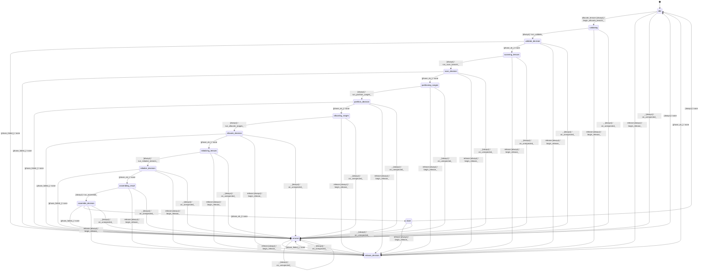

# tensor_allocator

Source: [`emel/tensor/allocator/sm.hpp`](https://github.com/stateforward/emel.cpp/blob/main/src/emel/tensor/allocator/sm.hpp)

## Mermaid

## Transitions

| Source | Event | Guard | Action | Target |
| --- | --- | --- | --- | --- |
| [`idle`](https://github.com/stateforward/emel.cpp/blob/main/src/emel/tensor/allocator/sm.hpp) | [`allocate_tensors`](https://github.com/stateforward/emel.cpp/blob/main/src/emel/tensor/allocator/sm.hpp) | [`always`](https://github.com/stateforward/emel.cpp/blob/main/src/emel/tensor/allocator/sm.hpp) | [`begin_allocate_tensors>`](https://github.com/stateforward/emel.cpp/blob/main/src/emel/tensor/allocator/sm.hpp) | [`validating`](https://github.com/stateforward/emel.cpp/blob/main/src/emel/tensor/allocator/sm.hpp) |
| [`validating`](https://github.com/stateforward/emel.cpp/blob/main/src/emel/tensor/allocator/sm.hpp) | - | [`always`](https://github.com/stateforward/emel.cpp/blob/main/src/emel/tensor/allocator/sm.hpp) | [`run_validate>`](https://github.com/stateforward/emel.cpp/blob/main/src/emel/tensor/allocator/sm.hpp) | [`validate_decision`](https://github.com/stateforward/emel.cpp/blob/main/src/emel/tensor/allocator/sm.hpp) |
| [`validate_decision`](https://github.com/stateforward/emel.cpp/blob/main/src/emel/tensor/allocator/sm.hpp) | - | [`phase_failed>`](https://github.com/stateforward/emel.cpp/blob/main/src/emel/tensor/allocator/sm.hpp) | [`none`](https://github.com/stateforward/emel.cpp/blob/main/src/emel/tensor/allocator/sm.hpp) | [`errored`](https://github.com/stateforward/emel.cpp/blob/main/src/emel/tensor/allocator/sm.hpp) |
| [`validate_decision`](https://github.com/stateforward/emel.cpp/blob/main/src/emel/tensor/allocator/sm.hpp) | - | [`phase_ok>`](https://github.com/stateforward/emel.cpp/blob/main/src/emel/tensor/allocator/sm.hpp) | [`none`](https://github.com/stateforward/emel.cpp/blob/main/src/emel/tensor/allocator/sm.hpp) | [`scanning_tensors`](https://github.com/stateforward/emel.cpp/blob/main/src/emel/tensor/allocator/sm.hpp) |
| [`scanning_tensors`](https://github.com/stateforward/emel.cpp/blob/main/src/emel/tensor/allocator/sm.hpp) | - | [`always`](https://github.com/stateforward/emel.cpp/blob/main/src/emel/tensor/allocator/sm.hpp) | [`run_scan_tensors>`](https://github.com/stateforward/emel.cpp/blob/main/src/emel/tensor/allocator/sm.hpp) | [`scan_decision`](https://github.com/stateforward/emel.cpp/blob/main/src/emel/tensor/allocator/sm.hpp) |
| [`scan_decision`](https://github.com/stateforward/emel.cpp/blob/main/src/emel/tensor/allocator/sm.hpp) | - | [`phase_failed>`](https://github.com/stateforward/emel.cpp/blob/main/src/emel/tensor/allocator/sm.hpp) | [`none`](https://github.com/stateforward/emel.cpp/blob/main/src/emel/tensor/allocator/sm.hpp) | [`errored`](https://github.com/stateforward/emel.cpp/blob/main/src/emel/tensor/allocator/sm.hpp) |
| [`scan_decision`](https://github.com/stateforward/emel.cpp/blob/main/src/emel/tensor/allocator/sm.hpp) | - | [`phase_ok>`](https://github.com/stateforward/emel.cpp/blob/main/src/emel/tensor/allocator/sm.hpp) | [`none`](https://github.com/stateforward/emel.cpp/blob/main/src/emel/tensor/allocator/sm.hpp) | [`partitioning_ranges`](https://github.com/stateforward/emel.cpp/blob/main/src/emel/tensor/allocator/sm.hpp) |
| [`partitioning_ranges`](https://github.com/stateforward/emel.cpp/blob/main/src/emel/tensor/allocator/sm.hpp) | - | [`always`](https://github.com/stateforward/emel.cpp/blob/main/src/emel/tensor/allocator/sm.hpp) | [`run_partition_ranges>`](https://github.com/stateforward/emel.cpp/blob/main/src/emel/tensor/allocator/sm.hpp) | [`partition_decision`](https://github.com/stateforward/emel.cpp/blob/main/src/emel/tensor/allocator/sm.hpp) |
| [`partition_decision`](https://github.com/stateforward/emel.cpp/blob/main/src/emel/tensor/allocator/sm.hpp) | - | [`phase_failed>`](https://github.com/stateforward/emel.cpp/blob/main/src/emel/tensor/allocator/sm.hpp) | [`none`](https://github.com/stateforward/emel.cpp/blob/main/src/emel/tensor/allocator/sm.hpp) | [`errored`](https://github.com/stateforward/emel.cpp/blob/main/src/emel/tensor/allocator/sm.hpp) |
| [`partition_decision`](https://github.com/stateforward/emel.cpp/blob/main/src/emel/tensor/allocator/sm.hpp) | - | [`phase_ok>`](https://github.com/stateforward/emel.cpp/blob/main/src/emel/tensor/allocator/sm.hpp) | [`none`](https://github.com/stateforward/emel.cpp/blob/main/src/emel/tensor/allocator/sm.hpp) | [`allocating_ranges`](https://github.com/stateforward/emel.cpp/blob/main/src/emel/tensor/allocator/sm.hpp) |
| [`allocating_ranges`](https://github.com/stateforward/emel.cpp/blob/main/src/emel/tensor/allocator/sm.hpp) | - | [`always`](https://github.com/stateforward/emel.cpp/blob/main/src/emel/tensor/allocator/sm.hpp) | [`run_allocate_ranges>`](https://github.com/stateforward/emel.cpp/blob/main/src/emel/tensor/allocator/sm.hpp) | [`allocate_decision`](https://github.com/stateforward/emel.cpp/blob/main/src/emel/tensor/allocator/sm.hpp) |
| [`allocate_decision`](https://github.com/stateforward/emel.cpp/blob/main/src/emel/tensor/allocator/sm.hpp) | - | [`phase_failed>`](https://github.com/stateforward/emel.cpp/blob/main/src/emel/tensor/allocator/sm.hpp) | [`none`](https://github.com/stateforward/emel.cpp/blob/main/src/emel/tensor/allocator/sm.hpp) | [`errored`](https://github.com/stateforward/emel.cpp/blob/main/src/emel/tensor/allocator/sm.hpp) |
| [`allocate_decision`](https://github.com/stateforward/emel.cpp/blob/main/src/emel/tensor/allocator/sm.hpp) | - | [`phase_ok>`](https://github.com/stateforward/emel.cpp/blob/main/src/emel/tensor/allocator/sm.hpp) | [`none`](https://github.com/stateforward/emel.cpp/blob/main/src/emel/tensor/allocator/sm.hpp) | [`initializing_tensors`](https://github.com/stateforward/emel.cpp/blob/main/src/emel/tensor/allocator/sm.hpp) |
| [`initializing_tensors`](https://github.com/stateforward/emel.cpp/blob/main/src/emel/tensor/allocator/sm.hpp) | - | [`always`](https://github.com/stateforward/emel.cpp/blob/main/src/emel/tensor/allocator/sm.hpp) | [`run_initialize_tensors>`](https://github.com/stateforward/emel.cpp/blob/main/src/emel/tensor/allocator/sm.hpp) | [`initialize_decision`](https://github.com/stateforward/emel.cpp/blob/main/src/emel/tensor/allocator/sm.hpp) |
| [`initialize_decision`](https://github.com/stateforward/emel.cpp/blob/main/src/emel/tensor/allocator/sm.hpp) | - | [`phase_failed>`](https://github.com/stateforward/emel.cpp/blob/main/src/emel/tensor/allocator/sm.hpp) | [`none`](https://github.com/stateforward/emel.cpp/blob/main/src/emel/tensor/allocator/sm.hpp) | [`errored`](https://github.com/stateforward/emel.cpp/blob/main/src/emel/tensor/allocator/sm.hpp) |
| [`initialize_decision`](https://github.com/stateforward/emel.cpp/blob/main/src/emel/tensor/allocator/sm.hpp) | - | [`phase_ok>`](https://github.com/stateforward/emel.cpp/blob/main/src/emel/tensor/allocator/sm.hpp) | [`none`](https://github.com/stateforward/emel.cpp/blob/main/src/emel/tensor/allocator/sm.hpp) | [`assembling_result`](https://github.com/stateforward/emel.cpp/blob/main/src/emel/tensor/allocator/sm.hpp) |
| [`assembling_result`](https://github.com/stateforward/emel.cpp/blob/main/src/emel/tensor/allocator/sm.hpp) | - | [`always`](https://github.com/stateforward/emel.cpp/blob/main/src/emel/tensor/allocator/sm.hpp) | [`run_assemble>`](https://github.com/stateforward/emel.cpp/blob/main/src/emel/tensor/allocator/sm.hpp) | [`assemble_decision`](https://github.com/stateforward/emel.cpp/blob/main/src/emel/tensor/allocator/sm.hpp) |
| [`assemble_decision`](https://github.com/stateforward/emel.cpp/blob/main/src/emel/tensor/allocator/sm.hpp) | - | [`phase_failed>`](https://github.com/stateforward/emel.cpp/blob/main/src/emel/tensor/allocator/sm.hpp) | [`none`](https://github.com/stateforward/emel.cpp/blob/main/src/emel/tensor/allocator/sm.hpp) | [`errored`](https://github.com/stateforward/emel.cpp/blob/main/src/emel/tensor/allocator/sm.hpp) |
| [`assemble_decision`](https://github.com/stateforward/emel.cpp/blob/main/src/emel/tensor/allocator/sm.hpp) | - | [`phase_ok>`](https://github.com/stateforward/emel.cpp/blob/main/src/emel/tensor/allocator/sm.hpp) | [`none`](https://github.com/stateforward/emel.cpp/blob/main/src/emel/tensor/allocator/sm.hpp) | [`done`](https://github.com/stateforward/emel.cpp/blob/main/src/emel/tensor/allocator/sm.hpp) |
| [`done`](https://github.com/stateforward/emel.cpp/blob/main/src/emel/tensor/allocator/sm.hpp) | - | [`always`](https://github.com/stateforward/emel.cpp/blob/main/src/emel/tensor/allocator/sm.hpp) | [`none`](https://github.com/stateforward/emel.cpp/blob/main/src/emel/tensor/allocator/sm.hpp) | [`idle`](https://github.com/stateforward/emel.cpp/blob/main/src/emel/tensor/allocator/sm.hpp) |
| [`errored`](https://github.com/stateforward/emel.cpp/blob/main/src/emel/tensor/allocator/sm.hpp) | - | [`always`](https://github.com/stateforward/emel.cpp/blob/main/src/emel/tensor/allocator/sm.hpp) | [`none`](https://github.com/stateforward/emel.cpp/blob/main/src/emel/tensor/allocator/sm.hpp) | [`idle`](https://github.com/stateforward/emel.cpp/blob/main/src/emel/tensor/allocator/sm.hpp) |
| [`idle`](https://github.com/stateforward/emel.cpp/blob/main/src/emel/tensor/allocator/sm.hpp) | [`release`](https://github.com/stateforward/emel.cpp/blob/main/src/emel/tensor/allocator/sm.hpp) | [`always`](https://github.com/stateforward/emel.cpp/blob/main/src/emel/tensor/allocator/sm.hpp) | [`begin_release>`](https://github.com/stateforward/emel.cpp/blob/main/src/emel/tensor/allocator/sm.hpp) | [`release_decision`](https://github.com/stateforward/emel.cpp/blob/main/src/emel/tensor/allocator/sm.hpp) |
| [`validating`](https://github.com/stateforward/emel.cpp/blob/main/src/emel/tensor/allocator/sm.hpp) | [`release`](https://github.com/stateforward/emel.cpp/blob/main/src/emel/tensor/allocator/sm.hpp) | [`always`](https://github.com/stateforward/emel.cpp/blob/main/src/emel/tensor/allocator/sm.hpp) | [`begin_release>`](https://github.com/stateforward/emel.cpp/blob/main/src/emel/tensor/allocator/sm.hpp) | [`release_decision`](https://github.com/stateforward/emel.cpp/blob/main/src/emel/tensor/allocator/sm.hpp) |
| [`validate_decision`](https://github.com/stateforward/emel.cpp/blob/main/src/emel/tensor/allocator/sm.hpp) | [`release`](https://github.com/stateforward/emel.cpp/blob/main/src/emel/tensor/allocator/sm.hpp) | [`always`](https://github.com/stateforward/emel.cpp/blob/main/src/emel/tensor/allocator/sm.hpp) | [`begin_release>`](https://github.com/stateforward/emel.cpp/blob/main/src/emel/tensor/allocator/sm.hpp) | [`release_decision`](https://github.com/stateforward/emel.cpp/blob/main/src/emel/tensor/allocator/sm.hpp) |
| [`scanning_tensors`](https://github.com/stateforward/emel.cpp/blob/main/src/emel/tensor/allocator/sm.hpp) | [`release`](https://github.com/stateforward/emel.cpp/blob/main/src/emel/tensor/allocator/sm.hpp) | [`always`](https://github.com/stateforward/emel.cpp/blob/main/src/emel/tensor/allocator/sm.hpp) | [`begin_release>`](https://github.com/stateforward/emel.cpp/blob/main/src/emel/tensor/allocator/sm.hpp) | [`release_decision`](https://github.com/stateforward/emel.cpp/blob/main/src/emel/tensor/allocator/sm.hpp) |
| [`scan_decision`](https://github.com/stateforward/emel.cpp/blob/main/src/emel/tensor/allocator/sm.hpp) | [`release`](https://github.com/stateforward/emel.cpp/blob/main/src/emel/tensor/allocator/sm.hpp) | [`always`](https://github.com/stateforward/emel.cpp/blob/main/src/emel/tensor/allocator/sm.hpp) | [`begin_release>`](https://github.com/stateforward/emel.cpp/blob/main/src/emel/tensor/allocator/sm.hpp) | [`release_decision`](https://github.com/stateforward/emel.cpp/blob/main/src/emel/tensor/allocator/sm.hpp) |
| [`partitioning_ranges`](https://github.com/stateforward/emel.cpp/blob/main/src/emel/tensor/allocator/sm.hpp) | [`release`](https://github.com/stateforward/emel.cpp/blob/main/src/emel/tensor/allocator/sm.hpp) | [`always`](https://github.com/stateforward/emel.cpp/blob/main/src/emel/tensor/allocator/sm.hpp) | [`begin_release>`](https://github.com/stateforward/emel.cpp/blob/main/src/emel/tensor/allocator/sm.hpp) | [`release_decision`](https://github.com/stateforward/emel.cpp/blob/main/src/emel/tensor/allocator/sm.hpp) |
| [`partition_decision`](https://github.com/stateforward/emel.cpp/blob/main/src/emel/tensor/allocator/sm.hpp) | [`release`](https://github.com/stateforward/emel.cpp/blob/main/src/emel/tensor/allocator/sm.hpp) | [`always`](https://github.com/stateforward/emel.cpp/blob/main/src/emel/tensor/allocator/sm.hpp) | [`begin_release>`](https://github.com/stateforward/emel.cpp/blob/main/src/emel/tensor/allocator/sm.hpp) | [`release_decision`](https://github.com/stateforward/emel.cpp/blob/main/src/emel/tensor/allocator/sm.hpp) |
| [`allocating_ranges`](https://github.com/stateforward/emel.cpp/blob/main/src/emel/tensor/allocator/sm.hpp) | [`release`](https://github.com/stateforward/emel.cpp/blob/main/src/emel/tensor/allocator/sm.hpp) | [`always`](https://github.com/stateforward/emel.cpp/blob/main/src/emel/tensor/allocator/sm.hpp) | [`begin_release>`](https://github.com/stateforward/emel.cpp/blob/main/src/emel/tensor/allocator/sm.hpp) | [`release_decision`](https://github.com/stateforward/emel.cpp/blob/main/src/emel/tensor/allocator/sm.hpp) |
| [`allocate_decision`](https://github.com/stateforward/emel.cpp/blob/main/src/emel/tensor/allocator/sm.hpp) | [`release`](https://github.com/stateforward/emel.cpp/blob/main/src/emel/tensor/allocator/sm.hpp) | [`always`](https://github.com/stateforward/emel.cpp/blob/main/src/emel/tensor/allocator/sm.hpp) | [`begin_release>`](https://github.com/stateforward/emel.cpp/blob/main/src/emel/tensor/allocator/sm.hpp) | [`release_decision`](https://github.com/stateforward/emel.cpp/blob/main/src/emel/tensor/allocator/sm.hpp) |
| [`initializing_tensors`](https://github.com/stateforward/emel.cpp/blob/main/src/emel/tensor/allocator/sm.hpp) | [`release`](https://github.com/stateforward/emel.cpp/blob/main/src/emel/tensor/allocator/sm.hpp) | [`always`](https://github.com/stateforward/emel.cpp/blob/main/src/emel/tensor/allocator/sm.hpp) | [`begin_release>`](https://github.com/stateforward/emel.cpp/blob/main/src/emel/tensor/allocator/sm.hpp) | [`release_decision`](https://github.com/stateforward/emel.cpp/blob/main/src/emel/tensor/allocator/sm.hpp) |
| [`initialize_decision`](https://github.com/stateforward/emel.cpp/blob/main/src/emel/tensor/allocator/sm.hpp) | [`release`](https://github.com/stateforward/emel.cpp/blob/main/src/emel/tensor/allocator/sm.hpp) | [`always`](https://github.com/stateforward/emel.cpp/blob/main/src/emel/tensor/allocator/sm.hpp) | [`begin_release>`](https://github.com/stateforward/emel.cpp/blob/main/src/emel/tensor/allocator/sm.hpp) | [`release_decision`](https://github.com/stateforward/emel.cpp/blob/main/src/emel/tensor/allocator/sm.hpp) |
| [`assembling_result`](https://github.com/stateforward/emel.cpp/blob/main/src/emel/tensor/allocator/sm.hpp) | [`release`](https://github.com/stateforward/emel.cpp/blob/main/src/emel/tensor/allocator/sm.hpp) | [`always`](https://github.com/stateforward/emel.cpp/blob/main/src/emel/tensor/allocator/sm.hpp) | [`begin_release>`](https://github.com/stateforward/emel.cpp/blob/main/src/emel/tensor/allocator/sm.hpp) | [`release_decision`](https://github.com/stateforward/emel.cpp/blob/main/src/emel/tensor/allocator/sm.hpp) |
| [`assemble_decision`](https://github.com/stateforward/emel.cpp/blob/main/src/emel/tensor/allocator/sm.hpp) | [`release`](https://github.com/stateforward/emel.cpp/blob/main/src/emel/tensor/allocator/sm.hpp) | [`always`](https://github.com/stateforward/emel.cpp/blob/main/src/emel/tensor/allocator/sm.hpp) | [`begin_release>`](https://github.com/stateforward/emel.cpp/blob/main/src/emel/tensor/allocator/sm.hpp) | [`release_decision`](https://github.com/stateforward/emel.cpp/blob/main/src/emel/tensor/allocator/sm.hpp) |
| [`done`](https://github.com/stateforward/emel.cpp/blob/main/src/emel/tensor/allocator/sm.hpp) | [`release`](https://github.com/stateforward/emel.cpp/blob/main/src/emel/tensor/allocator/sm.hpp) | [`always`](https://github.com/stateforward/emel.cpp/blob/main/src/emel/tensor/allocator/sm.hpp) | [`begin_release>`](https://github.com/stateforward/emel.cpp/blob/main/src/emel/tensor/allocator/sm.hpp) | [`release_decision`](https://github.com/stateforward/emel.cpp/blob/main/src/emel/tensor/allocator/sm.hpp) |
| [`errored`](https://github.com/stateforward/emel.cpp/blob/main/src/emel/tensor/allocator/sm.hpp) | [`release`](https://github.com/stateforward/emel.cpp/blob/main/src/emel/tensor/allocator/sm.hpp) | [`always`](https://github.com/stateforward/emel.cpp/blob/main/src/emel/tensor/allocator/sm.hpp) | [`begin_release>`](https://github.com/stateforward/emel.cpp/blob/main/src/emel/tensor/allocator/sm.hpp) | [`release_decision`](https://github.com/stateforward/emel.cpp/blob/main/src/emel/tensor/allocator/sm.hpp) |
| [`release_decision`](https://github.com/stateforward/emel.cpp/blob/main/src/emel/tensor/allocator/sm.hpp) | - | [`phase_failed>`](https://github.com/stateforward/emel.cpp/blob/main/src/emel/tensor/allocator/sm.hpp) | [`none`](https://github.com/stateforward/emel.cpp/blob/main/src/emel/tensor/allocator/sm.hpp) | [`errored`](https://github.com/stateforward/emel.cpp/blob/main/src/emel/tensor/allocator/sm.hpp) |
| [`release_decision`](https://github.com/stateforward/emel.cpp/blob/main/src/emel/tensor/allocator/sm.hpp) | - | [`phase_ok>`](https://github.com/stateforward/emel.cpp/blob/main/src/emel/tensor/allocator/sm.hpp) | [`none`](https://github.com/stateforward/emel.cpp/blob/main/src/emel/tensor/allocator/sm.hpp) | [`idle`](https://github.com/stateforward/emel.cpp/blob/main/src/emel/tensor/allocator/sm.hpp) |
| [`idle`](https://github.com/stateforward/emel.cpp/blob/main/src/emel/tensor/allocator/sm.hpp) | [`_`](https://github.com/stateforward/emel.cpp/blob/main/src/emel/tensor/allocator/sm.hpp) | [`always`](https://github.com/stateforward/emel.cpp/blob/main/src/emel/tensor/allocator/sm.hpp) | [`on_unexpected>`](https://github.com/stateforward/emel.cpp/blob/main/src/emel/tensor/allocator/sm.hpp) | [`errored`](https://github.com/stateforward/emel.cpp/blob/main/src/emel/tensor/allocator/sm.hpp) |
| [`validating`](https://github.com/stateforward/emel.cpp/blob/main/src/emel/tensor/allocator/sm.hpp) | [`_`](https://github.com/stateforward/emel.cpp/blob/main/src/emel/tensor/allocator/sm.hpp) | [`always`](https://github.com/stateforward/emel.cpp/blob/main/src/emel/tensor/allocator/sm.hpp) | [`on_unexpected>`](https://github.com/stateforward/emel.cpp/blob/main/src/emel/tensor/allocator/sm.hpp) | [`errored`](https://github.com/stateforward/emel.cpp/blob/main/src/emel/tensor/allocator/sm.hpp) |
| [`validate_decision`](https://github.com/stateforward/emel.cpp/blob/main/src/emel/tensor/allocator/sm.hpp) | [`_`](https://github.com/stateforward/emel.cpp/blob/main/src/emel/tensor/allocator/sm.hpp) | [`always`](https://github.com/stateforward/emel.cpp/blob/main/src/emel/tensor/allocator/sm.hpp) | [`on_unexpected>`](https://github.com/stateforward/emel.cpp/blob/main/src/emel/tensor/allocator/sm.hpp) | [`errored`](https://github.com/stateforward/emel.cpp/blob/main/src/emel/tensor/allocator/sm.hpp) |
| [`scanning_tensors`](https://github.com/stateforward/emel.cpp/blob/main/src/emel/tensor/allocator/sm.hpp) | [`_`](https://github.com/stateforward/emel.cpp/blob/main/src/emel/tensor/allocator/sm.hpp) | [`always`](https://github.com/stateforward/emel.cpp/blob/main/src/emel/tensor/allocator/sm.hpp) | [`on_unexpected>`](https://github.com/stateforward/emel.cpp/blob/main/src/emel/tensor/allocator/sm.hpp) | [`errored`](https://github.com/stateforward/emel.cpp/blob/main/src/emel/tensor/allocator/sm.hpp) |
| [`scan_decision`](https://github.com/stateforward/emel.cpp/blob/main/src/emel/tensor/allocator/sm.hpp) | [`_`](https://github.com/stateforward/emel.cpp/blob/main/src/emel/tensor/allocator/sm.hpp) | [`always`](https://github.com/stateforward/emel.cpp/blob/main/src/emel/tensor/allocator/sm.hpp) | [`on_unexpected>`](https://github.com/stateforward/emel.cpp/blob/main/src/emel/tensor/allocator/sm.hpp) | [`errored`](https://github.com/stateforward/emel.cpp/blob/main/src/emel/tensor/allocator/sm.hpp) |
| [`partitioning_ranges`](https://github.com/stateforward/emel.cpp/blob/main/src/emel/tensor/allocator/sm.hpp) | [`_`](https://github.com/stateforward/emel.cpp/blob/main/src/emel/tensor/allocator/sm.hpp) | [`always`](https://github.com/stateforward/emel.cpp/blob/main/src/emel/tensor/allocator/sm.hpp) | [`on_unexpected>`](https://github.com/stateforward/emel.cpp/blob/main/src/emel/tensor/allocator/sm.hpp) | [`errored`](https://github.com/stateforward/emel.cpp/blob/main/src/emel/tensor/allocator/sm.hpp) |
| [`partition_decision`](https://github.com/stateforward/emel.cpp/blob/main/src/emel/tensor/allocator/sm.hpp) | [`_`](https://github.com/stateforward/emel.cpp/blob/main/src/emel/tensor/allocator/sm.hpp) | [`always`](https://github.com/stateforward/emel.cpp/blob/main/src/emel/tensor/allocator/sm.hpp) | [`on_unexpected>`](https://github.com/stateforward/emel.cpp/blob/main/src/emel/tensor/allocator/sm.hpp) | [`errored`](https://github.com/stateforward/emel.cpp/blob/main/src/emel/tensor/allocator/sm.hpp) |
| [`allocating_ranges`](https://github.com/stateforward/emel.cpp/blob/main/src/emel/tensor/allocator/sm.hpp) | [`_`](https://github.com/stateforward/emel.cpp/blob/main/src/emel/tensor/allocator/sm.hpp) | [`always`](https://github.com/stateforward/emel.cpp/blob/main/src/emel/tensor/allocator/sm.hpp) | [`on_unexpected>`](https://github.com/stateforward/emel.cpp/blob/main/src/emel/tensor/allocator/sm.hpp) | [`errored`](https://github.com/stateforward/emel.cpp/blob/main/src/emel/tensor/allocator/sm.hpp) |
| [`allocate_decision`](https://github.com/stateforward/emel.cpp/blob/main/src/emel/tensor/allocator/sm.hpp) | [`_`](https://github.com/stateforward/emel.cpp/blob/main/src/emel/tensor/allocator/sm.hpp) | [`always`](https://github.com/stateforward/emel.cpp/blob/main/src/emel/tensor/allocator/sm.hpp) | [`on_unexpected>`](https://github.com/stateforward/emel.cpp/blob/main/src/emel/tensor/allocator/sm.hpp) | [`errored`](https://github.com/stateforward/emel.cpp/blob/main/src/emel/tensor/allocator/sm.hpp) |
| [`initializing_tensors`](https://github.com/stateforward/emel.cpp/blob/main/src/emel/tensor/allocator/sm.hpp) | [`_`](https://github.com/stateforward/emel.cpp/blob/main/src/emel/tensor/allocator/sm.hpp) | [`always`](https://github.com/stateforward/emel.cpp/blob/main/src/emel/tensor/allocator/sm.hpp) | [`on_unexpected>`](https://github.com/stateforward/emel.cpp/blob/main/src/emel/tensor/allocator/sm.hpp) | [`errored`](https://github.com/stateforward/emel.cpp/blob/main/src/emel/tensor/allocator/sm.hpp) |
| [`initialize_decision`](https://github.com/stateforward/emel.cpp/blob/main/src/emel/tensor/allocator/sm.hpp) | [`_`](https://github.com/stateforward/emel.cpp/blob/main/src/emel/tensor/allocator/sm.hpp) | [`always`](https://github.com/stateforward/emel.cpp/blob/main/src/emel/tensor/allocator/sm.hpp) | [`on_unexpected>`](https://github.com/stateforward/emel.cpp/blob/main/src/emel/tensor/allocator/sm.hpp) | [`errored`](https://github.com/stateforward/emel.cpp/blob/main/src/emel/tensor/allocator/sm.hpp) |
| [`assembling_result`](https://github.com/stateforward/emel.cpp/blob/main/src/emel/tensor/allocator/sm.hpp) | [`_`](https://github.com/stateforward/emel.cpp/blob/main/src/emel/tensor/allocator/sm.hpp) | [`always`](https://github.com/stateforward/emel.cpp/blob/main/src/emel/tensor/allocator/sm.hpp) | [`on_unexpected>`](https://github.com/stateforward/emel.cpp/blob/main/src/emel/tensor/allocator/sm.hpp) | [`errored`](https://github.com/stateforward/emel.cpp/blob/main/src/emel/tensor/allocator/sm.hpp) |
| [`assemble_decision`](https://github.com/stateforward/emel.cpp/blob/main/src/emel/tensor/allocator/sm.hpp) | [`_`](https://github.com/stateforward/emel.cpp/blob/main/src/emel/tensor/allocator/sm.hpp) | [`always`](https://github.com/stateforward/emel.cpp/blob/main/src/emel/tensor/allocator/sm.hpp) | [`on_unexpected>`](https://github.com/stateforward/emel.cpp/blob/main/src/emel/tensor/allocator/sm.hpp) | [`errored`](https://github.com/stateforward/emel.cpp/blob/main/src/emel/tensor/allocator/sm.hpp) |
| [`done`](https://github.com/stateforward/emel.cpp/blob/main/src/emel/tensor/allocator/sm.hpp) | [`_`](https://github.com/stateforward/emel.cpp/blob/main/src/emel/tensor/allocator/sm.hpp) | [`always`](https://github.com/stateforward/emel.cpp/blob/main/src/emel/tensor/allocator/sm.hpp) | [`on_unexpected>`](https://github.com/stateforward/emel.cpp/blob/main/src/emel/tensor/allocator/sm.hpp) | [`errored`](https://github.com/stateforward/emel.cpp/blob/main/src/emel/tensor/allocator/sm.hpp) |
| [`errored`](https://github.com/stateforward/emel.cpp/blob/main/src/emel/tensor/allocator/sm.hpp) | [`_`](https://github.com/stateforward/emel.cpp/blob/main/src/emel/tensor/allocator/sm.hpp) | [`always`](https://github.com/stateforward/emel.cpp/blob/main/src/emel/tensor/allocator/sm.hpp) | [`on_unexpected>`](https://github.com/stateforward/emel.cpp/blob/main/src/emel/tensor/allocator/sm.hpp) | [`errored`](https://github.com/stateforward/emel.cpp/blob/main/src/emel/tensor/allocator/sm.hpp) |
| [`release_decision`](https://github.com/stateforward/emel.cpp/blob/main/src/emel/tensor/allocator/sm.hpp) | [`_`](https://github.com/stateforward/emel.cpp/blob/main/src/emel/tensor/allocator/sm.hpp) | [`always`](https://github.com/stateforward/emel.cpp/blob/main/src/emel/tensor/allocator/sm.hpp) | [`on_unexpected>`](https://github.com/stateforward/emel.cpp/blob/main/src/emel/tensor/allocator/sm.hpp) | [`errored`](https://github.com/stateforward/emel.cpp/blob/main/src/emel/tensor/allocator/sm.hpp) |
