# tensor_allocator

Source: [`emel/tensor/allocator/sm.hpp`](https://github.com/stateforward/emel.cpp/blob/main/src/emel/tensor/allocator/sm.hpp)

## Mermaid

```mermaid
stateDiagram-v2
  [*] --> emel__tensor__allocator__Idle
  emel__tensor__allocator__Idle --> emel__tensor__allocator__Validating : emel__tensor__allocator__event__allocate_tensors [boost__sml__front__always] / boost__sml__aux__zero_wrapper_emel__tensor__allocator__action__begin_allocate_tensors_
  emel__tensor__allocator__Validating --> emel__tensor__allocator__ValidateDecision : [boost__sml__front__always] / boost__sml__aux__zero_wrapper_emel__tensor__allocator__action__run_validate_
  emel__tensor__allocator__ValidateDecision --> emel__tensor__allocator__Errored : [boost__sml__aux__zero_wrapper_emel__tensor__allocator__guard__phase_failed_] / boost__sml__front__none
  emel__tensor__allocator__ValidateDecision --> emel__tensor__allocator__ScanningTensors : [boost__sml__aux__zero_wrapper_emel__tensor__allocator__guard__phase_ok_] / boost__sml__front__none
  emel__tensor__allocator__ScanningTensors --> emel__tensor__allocator__ScanDecision : [boost__sml__front__always] / boost__sml__aux__zero_wrapper_emel__tensor__allocator__action__run_scan_tensors_
  emel__tensor__allocator__ScanDecision --> emel__tensor__allocator__Errored : [boost__sml__aux__zero_wrapper_emel__tensor__allocator__guard__phase_failed_] / boost__sml__front__none
  emel__tensor__allocator__ScanDecision --> emel__tensor__allocator__PartitioningRanges : [boost__sml__aux__zero_wrapper_emel__tensor__allocator__guard__phase_ok_] / boost__sml__front__none
  emel__tensor__allocator__PartitioningRanges --> emel__tensor__allocator__PartitionDecision : [boost__sml__front__always] / boost__sml__aux__zero_wrapper_emel__tensor__allocator__action__run_partition_ranges_
  emel__tensor__allocator__PartitionDecision --> emel__tensor__allocator__Errored : [boost__sml__aux__zero_wrapper_emel__tensor__allocator__guard__phase_failed_] / boost__sml__front__none
  emel__tensor__allocator__PartitionDecision --> emel__tensor__allocator__AllocatingRanges : [boost__sml__aux__zero_wrapper_emel__tensor__allocator__guard__phase_ok_] / boost__sml__front__none
  emel__tensor__allocator__AllocatingRanges --> emel__tensor__allocator__AllocateDecision : [boost__sml__front__always] / boost__sml__aux__zero_wrapper_emel__tensor__allocator__action__run_allocate_ranges_
  emel__tensor__allocator__AllocateDecision --> emel__tensor__allocator__Errored : [boost__sml__aux__zero_wrapper_emel__tensor__allocator__guard__phase_failed_] / boost__sml__front__none
  emel__tensor__allocator__AllocateDecision --> emel__tensor__allocator__InitializingTensors : [boost__sml__aux__zero_wrapper_emel__tensor__allocator__guard__phase_ok_] / boost__sml__front__none
  emel__tensor__allocator__InitializingTensors --> emel__tensor__allocator__InitializeDecision : [boost__sml__front__always] / boost__sml__aux__zero_wrapper_emel__tensor__allocator__action__run_initialize_tensors_
  emel__tensor__allocator__InitializeDecision --> emel__tensor__allocator__Errored : [boost__sml__aux__zero_wrapper_emel__tensor__allocator__guard__phase_failed_] / boost__sml__front__none
  emel__tensor__allocator__InitializeDecision --> emel__tensor__allocator__AssemblingResult : [boost__sml__aux__zero_wrapper_emel__tensor__allocator__guard__phase_ok_] / boost__sml__front__none
  emel__tensor__allocator__AssemblingResult --> emel__tensor__allocator__AssembleDecision : [boost__sml__front__always] / boost__sml__aux__zero_wrapper_emel__tensor__allocator__action__run_assemble_
  emel__tensor__allocator__AssembleDecision --> emel__tensor__allocator__Errored : [boost__sml__aux__zero_wrapper_emel__tensor__allocator__guard__phase_failed_] / boost__sml__front__none
  emel__tensor__allocator__AssembleDecision --> emel__tensor__allocator__Done : [boost__sml__aux__zero_wrapper_emel__tensor__allocator__guard__phase_ok_] / boost__sml__front__none
  emel__tensor__allocator__Done --> emel__tensor__allocator__Idle : [boost__sml__front__always] / boost__sml__front__none
  emel__tensor__allocator__Errored --> emel__tensor__allocator__Idle : [boost__sml__front__always] / boost__sml__front__none
  emel__tensor__allocator__Idle --> emel__tensor__allocator__ReleaseDecision : emel__tensor__allocator__event__release [boost__sml__front__always] / boost__sml__aux__zero_wrapper_emel__tensor__allocator__action__begin_release_
  emel__tensor__allocator__Validating --> emel__tensor__allocator__ReleaseDecision : emel__tensor__allocator__event__release [boost__sml__front__always] / boost__sml__aux__zero_wrapper_emel__tensor__allocator__action__begin_release_
  emel__tensor__allocator__ValidateDecision --> emel__tensor__allocator__ReleaseDecision : emel__tensor__allocator__event__release [boost__sml__front__always] / boost__sml__aux__zero_wrapper_emel__tensor__allocator__action__begin_release_
  emel__tensor__allocator__ScanningTensors --> emel__tensor__allocator__ReleaseDecision : emel__tensor__allocator__event__release [boost__sml__front__always] / boost__sml__aux__zero_wrapper_emel__tensor__allocator__action__begin_release_
  emel__tensor__allocator__ScanDecision --> emel__tensor__allocator__ReleaseDecision : emel__tensor__allocator__event__release [boost__sml__front__always] / boost__sml__aux__zero_wrapper_emel__tensor__allocator__action__begin_release_
  emel__tensor__allocator__PartitioningRanges --> emel__tensor__allocator__ReleaseDecision : emel__tensor__allocator__event__release [boost__sml__front__always] / boost__sml__aux__zero_wrapper_emel__tensor__allocator__action__begin_release_
  emel__tensor__allocator__PartitionDecision --> emel__tensor__allocator__ReleaseDecision : emel__tensor__allocator__event__release [boost__sml__front__always] / boost__sml__aux__zero_wrapper_emel__tensor__allocator__action__begin_release_
  emel__tensor__allocator__AllocatingRanges --> emel__tensor__allocator__ReleaseDecision : emel__tensor__allocator__event__release [boost__sml__front__always] / boost__sml__aux__zero_wrapper_emel__tensor__allocator__action__begin_release_
  emel__tensor__allocator__AllocateDecision --> emel__tensor__allocator__ReleaseDecision : emel__tensor__allocator__event__release [boost__sml__front__always] / boost__sml__aux__zero_wrapper_emel__tensor__allocator__action__begin_release_
  emel__tensor__allocator__InitializingTensors --> emel__tensor__allocator__ReleaseDecision : emel__tensor__allocator__event__release [boost__sml__front__always] / boost__sml__aux__zero_wrapper_emel__tensor__allocator__action__begin_release_
  emel__tensor__allocator__InitializeDecision --> emel__tensor__allocator__ReleaseDecision : emel__tensor__allocator__event__release [boost__sml__front__always] / boost__sml__aux__zero_wrapper_emel__tensor__allocator__action__begin_release_
  emel__tensor__allocator__AssemblingResult --> emel__tensor__allocator__ReleaseDecision : emel__tensor__allocator__event__release [boost__sml__front__always] / boost__sml__aux__zero_wrapper_emel__tensor__allocator__action__begin_release_
  emel__tensor__allocator__AssembleDecision --> emel__tensor__allocator__ReleaseDecision : emel__tensor__allocator__event__release [boost__sml__front__always] / boost__sml__aux__zero_wrapper_emel__tensor__allocator__action__begin_release_
  emel__tensor__allocator__Done --> emel__tensor__allocator__ReleaseDecision : emel__tensor__allocator__event__release [boost__sml__front__always] / boost__sml__aux__zero_wrapper_emel__tensor__allocator__action__begin_release_
  emel__tensor__allocator__Errored --> emel__tensor__allocator__ReleaseDecision : emel__tensor__allocator__event__release [boost__sml__front__always] / boost__sml__aux__zero_wrapper_emel__tensor__allocator__action__begin_release_
  emel__tensor__allocator__ReleaseDecision --> emel__tensor__allocator__Errored : [boost__sml__aux__zero_wrapper_emel__tensor__allocator__guard__phase_failed_] / boost__sml__front__none
  emel__tensor__allocator__ReleaseDecision --> emel__tensor__allocator__Idle : [boost__sml__aux__zero_wrapper_emel__tensor__allocator__guard__phase_ok_] / boost__sml__front__none
  emel__tensor__allocator__Idle --> emel__tensor__allocator__Errored : internal_event [boost__sml__front__always] / boost__sml__aux__zero_wrapper_emel__tensor__allocator__action__on_unexpected_
  emel__tensor__allocator__Validating --> emel__tensor__allocator__Errored : internal_event [boost__sml__front__always] / boost__sml__aux__zero_wrapper_emel__tensor__allocator__action__on_unexpected_
  emel__tensor__allocator__ValidateDecision --> emel__tensor__allocator__Errored : internal_event [boost__sml__front__always] / boost__sml__aux__zero_wrapper_emel__tensor__allocator__action__on_unexpected_
  emel__tensor__allocator__ScanningTensors --> emel__tensor__allocator__Errored : internal_event [boost__sml__front__always] / boost__sml__aux__zero_wrapper_emel__tensor__allocator__action__on_unexpected_
  emel__tensor__allocator__ScanDecision --> emel__tensor__allocator__Errored : internal_event [boost__sml__front__always] / boost__sml__aux__zero_wrapper_emel__tensor__allocator__action__on_unexpected_
  emel__tensor__allocator__PartitioningRanges --> emel__tensor__allocator__Errored : internal_event [boost__sml__front__always] / boost__sml__aux__zero_wrapper_emel__tensor__allocator__action__on_unexpected_
  emel__tensor__allocator__PartitionDecision --> emel__tensor__allocator__Errored : internal_event [boost__sml__front__always] / boost__sml__aux__zero_wrapper_emel__tensor__allocator__action__on_unexpected_
  emel__tensor__allocator__AllocatingRanges --> emel__tensor__allocator__Errored : internal_event [boost__sml__front__always] / boost__sml__aux__zero_wrapper_emel__tensor__allocator__action__on_unexpected_
  emel__tensor__allocator__AllocateDecision --> emel__tensor__allocator__Errored : internal_event [boost__sml__front__always] / boost__sml__aux__zero_wrapper_emel__tensor__allocator__action__on_unexpected_
  emel__tensor__allocator__InitializingTensors --> emel__tensor__allocator__Errored : internal_event [boost__sml__front__always] / boost__sml__aux__zero_wrapper_emel__tensor__allocator__action__on_unexpected_
  emel__tensor__allocator__InitializeDecision --> emel__tensor__allocator__Errored : internal_event [boost__sml__front__always] / boost__sml__aux__zero_wrapper_emel__tensor__allocator__action__on_unexpected_
  emel__tensor__allocator__AssemblingResult --> emel__tensor__allocator__Errored : internal_event [boost__sml__front__always] / boost__sml__aux__zero_wrapper_emel__tensor__allocator__action__on_unexpected_
  emel__tensor__allocator__AssembleDecision --> emel__tensor__allocator__Errored : internal_event [boost__sml__front__always] / boost__sml__aux__zero_wrapper_emel__tensor__allocator__action__on_unexpected_
  emel__tensor__allocator__Done --> emel__tensor__allocator__Errored : internal_event [boost__sml__front__always] / boost__sml__aux__zero_wrapper_emel__tensor__allocator__action__on_unexpected_
  emel__tensor__allocator__Errored --> emel__tensor__allocator__Errored : internal_event [boost__sml__front__always] / boost__sml__aux__zero_wrapper_emel__tensor__allocator__action__on_unexpected_
  emel__tensor__allocator__ReleaseDecision --> emel__tensor__allocator__Errored : internal_event [boost__sml__front__always] / boost__sml__aux__zero_wrapper_emel__tensor__allocator__action__on_unexpected_
```

## Transitions

| Source | Event | Guard | Action | Target |
| --- | --- | --- | --- | --- |
| [`Idle`](https://github.com/stateforward/emel.cpp/blob/main/src/emel/tensor/allocator/sm.hpp) | [`allocate_tensors`](https://github.com/stateforward/emel.cpp/blob/main/src/emel/tensor/allocator/sm.hpp) | [`always`](https://github.com/stateforward/emel.cpp/blob/main/src/emel/tensor/allocator/sm.hpp) | [`begin_allocate_tensors>`](https://github.com/stateforward/emel.cpp/blob/main/src/emel/tensor/allocator/sm.hpp) | [`Validating`](https://github.com/stateforward/emel.cpp/blob/main/src/emel/tensor/allocator/sm.hpp) |
| [`Validating`](https://github.com/stateforward/emel.cpp/blob/main/src/emel/tensor/allocator/sm.hpp) | - | [`always`](https://github.com/stateforward/emel.cpp/blob/main/src/emel/tensor/allocator/sm.hpp) | [`run_validate>`](https://github.com/stateforward/emel.cpp/blob/main/src/emel/tensor/allocator/sm.hpp) | [`ValidateDecision`](https://github.com/stateforward/emel.cpp/blob/main/src/emel/tensor/allocator/sm.hpp) |
| [`ValidateDecision`](https://github.com/stateforward/emel.cpp/blob/main/src/emel/tensor/allocator/sm.hpp) | - | [`phase_failed>`](https://github.com/stateforward/emel.cpp/blob/main/src/emel/tensor/allocator/sm.hpp) | [`none`](https://github.com/stateforward/emel.cpp/blob/main/src/emel/tensor/allocator/sm.hpp) | [`Errored`](https://github.com/stateforward/emel.cpp/blob/main/src/emel/tensor/allocator/sm.hpp) |
| [`ValidateDecision`](https://github.com/stateforward/emel.cpp/blob/main/src/emel/tensor/allocator/sm.hpp) | - | [`phase_ok>`](https://github.com/stateforward/emel.cpp/blob/main/src/emel/tensor/allocator/sm.hpp) | [`none`](https://github.com/stateforward/emel.cpp/blob/main/src/emel/tensor/allocator/sm.hpp) | [`ScanningTensors`](https://github.com/stateforward/emel.cpp/blob/main/src/emel/tensor/allocator/sm.hpp) |
| [`ScanningTensors`](https://github.com/stateforward/emel.cpp/blob/main/src/emel/tensor/allocator/sm.hpp) | - | [`always`](https://github.com/stateforward/emel.cpp/blob/main/src/emel/tensor/allocator/sm.hpp) | [`run_scan_tensors>`](https://github.com/stateforward/emel.cpp/blob/main/src/emel/tensor/allocator/sm.hpp) | [`ScanDecision`](https://github.com/stateforward/emel.cpp/blob/main/src/emel/tensor/allocator/sm.hpp) |
| [`ScanDecision`](https://github.com/stateforward/emel.cpp/blob/main/src/emel/tensor/allocator/sm.hpp) | - | [`phase_failed>`](https://github.com/stateforward/emel.cpp/blob/main/src/emel/tensor/allocator/sm.hpp) | [`none`](https://github.com/stateforward/emel.cpp/blob/main/src/emel/tensor/allocator/sm.hpp) | [`Errored`](https://github.com/stateforward/emel.cpp/blob/main/src/emel/tensor/allocator/sm.hpp) |
| [`ScanDecision`](https://github.com/stateforward/emel.cpp/blob/main/src/emel/tensor/allocator/sm.hpp) | - | [`phase_ok>`](https://github.com/stateforward/emel.cpp/blob/main/src/emel/tensor/allocator/sm.hpp) | [`none`](https://github.com/stateforward/emel.cpp/blob/main/src/emel/tensor/allocator/sm.hpp) | [`PartitioningRanges`](https://github.com/stateforward/emel.cpp/blob/main/src/emel/tensor/allocator/sm.hpp) |
| [`PartitioningRanges`](https://github.com/stateforward/emel.cpp/blob/main/src/emel/tensor/allocator/sm.hpp) | - | [`always`](https://github.com/stateforward/emel.cpp/blob/main/src/emel/tensor/allocator/sm.hpp) | [`run_partition_ranges>`](https://github.com/stateforward/emel.cpp/blob/main/src/emel/tensor/allocator/sm.hpp) | [`PartitionDecision`](https://github.com/stateforward/emel.cpp/blob/main/src/emel/tensor/allocator/sm.hpp) |
| [`PartitionDecision`](https://github.com/stateforward/emel.cpp/blob/main/src/emel/tensor/allocator/sm.hpp) | - | [`phase_failed>`](https://github.com/stateforward/emel.cpp/blob/main/src/emel/tensor/allocator/sm.hpp) | [`none`](https://github.com/stateforward/emel.cpp/blob/main/src/emel/tensor/allocator/sm.hpp) | [`Errored`](https://github.com/stateforward/emel.cpp/blob/main/src/emel/tensor/allocator/sm.hpp) |
| [`PartitionDecision`](https://github.com/stateforward/emel.cpp/blob/main/src/emel/tensor/allocator/sm.hpp) | - | [`phase_ok>`](https://github.com/stateforward/emel.cpp/blob/main/src/emel/tensor/allocator/sm.hpp) | [`none`](https://github.com/stateforward/emel.cpp/blob/main/src/emel/tensor/allocator/sm.hpp) | [`AllocatingRanges`](https://github.com/stateforward/emel.cpp/blob/main/src/emel/tensor/allocator/sm.hpp) |
| [`AllocatingRanges`](https://github.com/stateforward/emel.cpp/blob/main/src/emel/tensor/allocator/sm.hpp) | - | [`always`](https://github.com/stateforward/emel.cpp/blob/main/src/emel/tensor/allocator/sm.hpp) | [`run_allocate_ranges>`](https://github.com/stateforward/emel.cpp/blob/main/src/emel/tensor/allocator/sm.hpp) | [`AllocateDecision`](https://github.com/stateforward/emel.cpp/blob/main/src/emel/tensor/allocator/sm.hpp) |
| [`AllocateDecision`](https://github.com/stateforward/emel.cpp/blob/main/src/emel/tensor/allocator/sm.hpp) | - | [`phase_failed>`](https://github.com/stateforward/emel.cpp/blob/main/src/emel/tensor/allocator/sm.hpp) | [`none`](https://github.com/stateforward/emel.cpp/blob/main/src/emel/tensor/allocator/sm.hpp) | [`Errored`](https://github.com/stateforward/emel.cpp/blob/main/src/emel/tensor/allocator/sm.hpp) |
| [`AllocateDecision`](https://github.com/stateforward/emel.cpp/blob/main/src/emel/tensor/allocator/sm.hpp) | - | [`phase_ok>`](https://github.com/stateforward/emel.cpp/blob/main/src/emel/tensor/allocator/sm.hpp) | [`none`](https://github.com/stateforward/emel.cpp/blob/main/src/emel/tensor/allocator/sm.hpp) | [`InitializingTensors`](https://github.com/stateforward/emel.cpp/blob/main/src/emel/tensor/allocator/sm.hpp) |
| [`InitializingTensors`](https://github.com/stateforward/emel.cpp/blob/main/src/emel/tensor/allocator/sm.hpp) | - | [`always`](https://github.com/stateforward/emel.cpp/blob/main/src/emel/tensor/allocator/sm.hpp) | [`run_initialize_tensors>`](https://github.com/stateforward/emel.cpp/blob/main/src/emel/tensor/allocator/sm.hpp) | [`InitializeDecision`](https://github.com/stateforward/emel.cpp/blob/main/src/emel/tensor/allocator/sm.hpp) |
| [`InitializeDecision`](https://github.com/stateforward/emel.cpp/blob/main/src/emel/tensor/allocator/sm.hpp) | - | [`phase_failed>`](https://github.com/stateforward/emel.cpp/blob/main/src/emel/tensor/allocator/sm.hpp) | [`none`](https://github.com/stateforward/emel.cpp/blob/main/src/emel/tensor/allocator/sm.hpp) | [`Errored`](https://github.com/stateforward/emel.cpp/blob/main/src/emel/tensor/allocator/sm.hpp) |
| [`InitializeDecision`](https://github.com/stateforward/emel.cpp/blob/main/src/emel/tensor/allocator/sm.hpp) | - | [`phase_ok>`](https://github.com/stateforward/emel.cpp/blob/main/src/emel/tensor/allocator/sm.hpp) | [`none`](https://github.com/stateforward/emel.cpp/blob/main/src/emel/tensor/allocator/sm.hpp) | [`AssemblingResult`](https://github.com/stateforward/emel.cpp/blob/main/src/emel/tensor/allocator/sm.hpp) |
| [`AssemblingResult`](https://github.com/stateforward/emel.cpp/blob/main/src/emel/tensor/allocator/sm.hpp) | - | [`always`](https://github.com/stateforward/emel.cpp/blob/main/src/emel/tensor/allocator/sm.hpp) | [`run_assemble>`](https://github.com/stateforward/emel.cpp/blob/main/src/emel/tensor/allocator/sm.hpp) | [`AssembleDecision`](https://github.com/stateforward/emel.cpp/blob/main/src/emel/tensor/allocator/sm.hpp) |
| [`AssembleDecision`](https://github.com/stateforward/emel.cpp/blob/main/src/emel/tensor/allocator/sm.hpp) | - | [`phase_failed>`](https://github.com/stateforward/emel.cpp/blob/main/src/emel/tensor/allocator/sm.hpp) | [`none`](https://github.com/stateforward/emel.cpp/blob/main/src/emel/tensor/allocator/sm.hpp) | [`Errored`](https://github.com/stateforward/emel.cpp/blob/main/src/emel/tensor/allocator/sm.hpp) |
| [`AssembleDecision`](https://github.com/stateforward/emel.cpp/blob/main/src/emel/tensor/allocator/sm.hpp) | - | [`phase_ok>`](https://github.com/stateforward/emel.cpp/blob/main/src/emel/tensor/allocator/sm.hpp) | [`none`](https://github.com/stateforward/emel.cpp/blob/main/src/emel/tensor/allocator/sm.hpp) | [`Done`](https://github.com/stateforward/emel.cpp/blob/main/src/emel/tensor/allocator/sm.hpp) |
| [`Done`](https://github.com/stateforward/emel.cpp/blob/main/src/emel/tensor/allocator/sm.hpp) | - | [`always`](https://github.com/stateforward/emel.cpp/blob/main/src/emel/tensor/allocator/sm.hpp) | [`none`](https://github.com/stateforward/emel.cpp/blob/main/src/emel/tensor/allocator/sm.hpp) | [`Idle`](https://github.com/stateforward/emel.cpp/blob/main/src/emel/tensor/allocator/sm.hpp) |
| [`Errored`](https://github.com/stateforward/emel.cpp/blob/main/src/emel/tensor/allocator/sm.hpp) | - | [`always`](https://github.com/stateforward/emel.cpp/blob/main/src/emel/tensor/allocator/sm.hpp) | [`none`](https://github.com/stateforward/emel.cpp/blob/main/src/emel/tensor/allocator/sm.hpp) | [`Idle`](https://github.com/stateforward/emel.cpp/blob/main/src/emel/tensor/allocator/sm.hpp) |
| [`Idle`](https://github.com/stateforward/emel.cpp/blob/main/src/emel/tensor/allocator/sm.hpp) | [`release`](https://github.com/stateforward/emel.cpp/blob/main/src/emel/tensor/allocator/sm.hpp) | [`always`](https://github.com/stateforward/emel.cpp/blob/main/src/emel/tensor/allocator/sm.hpp) | [`begin_release>`](https://github.com/stateforward/emel.cpp/blob/main/src/emel/tensor/allocator/sm.hpp) | [`ReleaseDecision`](https://github.com/stateforward/emel.cpp/blob/main/src/emel/tensor/allocator/sm.hpp) |
| [`Validating`](https://github.com/stateforward/emel.cpp/blob/main/src/emel/tensor/allocator/sm.hpp) | [`release`](https://github.com/stateforward/emel.cpp/blob/main/src/emel/tensor/allocator/sm.hpp) | [`always`](https://github.com/stateforward/emel.cpp/blob/main/src/emel/tensor/allocator/sm.hpp) | [`begin_release>`](https://github.com/stateforward/emel.cpp/blob/main/src/emel/tensor/allocator/sm.hpp) | [`ReleaseDecision`](https://github.com/stateforward/emel.cpp/blob/main/src/emel/tensor/allocator/sm.hpp) |
| [`ValidateDecision`](https://github.com/stateforward/emel.cpp/blob/main/src/emel/tensor/allocator/sm.hpp) | [`release`](https://github.com/stateforward/emel.cpp/blob/main/src/emel/tensor/allocator/sm.hpp) | [`always`](https://github.com/stateforward/emel.cpp/blob/main/src/emel/tensor/allocator/sm.hpp) | [`begin_release>`](https://github.com/stateforward/emel.cpp/blob/main/src/emel/tensor/allocator/sm.hpp) | [`ReleaseDecision`](https://github.com/stateforward/emel.cpp/blob/main/src/emel/tensor/allocator/sm.hpp) |
| [`ScanningTensors`](https://github.com/stateforward/emel.cpp/blob/main/src/emel/tensor/allocator/sm.hpp) | [`release`](https://github.com/stateforward/emel.cpp/blob/main/src/emel/tensor/allocator/sm.hpp) | [`always`](https://github.com/stateforward/emel.cpp/blob/main/src/emel/tensor/allocator/sm.hpp) | [`begin_release>`](https://github.com/stateforward/emel.cpp/blob/main/src/emel/tensor/allocator/sm.hpp) | [`ReleaseDecision`](https://github.com/stateforward/emel.cpp/blob/main/src/emel/tensor/allocator/sm.hpp) |
| [`ScanDecision`](https://github.com/stateforward/emel.cpp/blob/main/src/emel/tensor/allocator/sm.hpp) | [`release`](https://github.com/stateforward/emel.cpp/blob/main/src/emel/tensor/allocator/sm.hpp) | [`always`](https://github.com/stateforward/emel.cpp/blob/main/src/emel/tensor/allocator/sm.hpp) | [`begin_release>`](https://github.com/stateforward/emel.cpp/blob/main/src/emel/tensor/allocator/sm.hpp) | [`ReleaseDecision`](https://github.com/stateforward/emel.cpp/blob/main/src/emel/tensor/allocator/sm.hpp) |
| [`PartitioningRanges`](https://github.com/stateforward/emel.cpp/blob/main/src/emel/tensor/allocator/sm.hpp) | [`release`](https://github.com/stateforward/emel.cpp/blob/main/src/emel/tensor/allocator/sm.hpp) | [`always`](https://github.com/stateforward/emel.cpp/blob/main/src/emel/tensor/allocator/sm.hpp) | [`begin_release>`](https://github.com/stateforward/emel.cpp/blob/main/src/emel/tensor/allocator/sm.hpp) | [`ReleaseDecision`](https://github.com/stateforward/emel.cpp/blob/main/src/emel/tensor/allocator/sm.hpp) |
| [`PartitionDecision`](https://github.com/stateforward/emel.cpp/blob/main/src/emel/tensor/allocator/sm.hpp) | [`release`](https://github.com/stateforward/emel.cpp/blob/main/src/emel/tensor/allocator/sm.hpp) | [`always`](https://github.com/stateforward/emel.cpp/blob/main/src/emel/tensor/allocator/sm.hpp) | [`begin_release>`](https://github.com/stateforward/emel.cpp/blob/main/src/emel/tensor/allocator/sm.hpp) | [`ReleaseDecision`](https://github.com/stateforward/emel.cpp/blob/main/src/emel/tensor/allocator/sm.hpp) |
| [`AllocatingRanges`](https://github.com/stateforward/emel.cpp/blob/main/src/emel/tensor/allocator/sm.hpp) | [`release`](https://github.com/stateforward/emel.cpp/blob/main/src/emel/tensor/allocator/sm.hpp) | [`always`](https://github.com/stateforward/emel.cpp/blob/main/src/emel/tensor/allocator/sm.hpp) | [`begin_release>`](https://github.com/stateforward/emel.cpp/blob/main/src/emel/tensor/allocator/sm.hpp) | [`ReleaseDecision`](https://github.com/stateforward/emel.cpp/blob/main/src/emel/tensor/allocator/sm.hpp) |
| [`AllocateDecision`](https://github.com/stateforward/emel.cpp/blob/main/src/emel/tensor/allocator/sm.hpp) | [`release`](https://github.com/stateforward/emel.cpp/blob/main/src/emel/tensor/allocator/sm.hpp) | [`always`](https://github.com/stateforward/emel.cpp/blob/main/src/emel/tensor/allocator/sm.hpp) | [`begin_release>`](https://github.com/stateforward/emel.cpp/blob/main/src/emel/tensor/allocator/sm.hpp) | [`ReleaseDecision`](https://github.com/stateforward/emel.cpp/blob/main/src/emel/tensor/allocator/sm.hpp) |
| [`InitializingTensors`](https://github.com/stateforward/emel.cpp/blob/main/src/emel/tensor/allocator/sm.hpp) | [`release`](https://github.com/stateforward/emel.cpp/blob/main/src/emel/tensor/allocator/sm.hpp) | [`always`](https://github.com/stateforward/emel.cpp/blob/main/src/emel/tensor/allocator/sm.hpp) | [`begin_release>`](https://github.com/stateforward/emel.cpp/blob/main/src/emel/tensor/allocator/sm.hpp) | [`ReleaseDecision`](https://github.com/stateforward/emel.cpp/blob/main/src/emel/tensor/allocator/sm.hpp) |
| [`InitializeDecision`](https://github.com/stateforward/emel.cpp/blob/main/src/emel/tensor/allocator/sm.hpp) | [`release`](https://github.com/stateforward/emel.cpp/blob/main/src/emel/tensor/allocator/sm.hpp) | [`always`](https://github.com/stateforward/emel.cpp/blob/main/src/emel/tensor/allocator/sm.hpp) | [`begin_release>`](https://github.com/stateforward/emel.cpp/blob/main/src/emel/tensor/allocator/sm.hpp) | [`ReleaseDecision`](https://github.com/stateforward/emel.cpp/blob/main/src/emel/tensor/allocator/sm.hpp) |
| [`AssemblingResult`](https://github.com/stateforward/emel.cpp/blob/main/src/emel/tensor/allocator/sm.hpp) | [`release`](https://github.com/stateforward/emel.cpp/blob/main/src/emel/tensor/allocator/sm.hpp) | [`always`](https://github.com/stateforward/emel.cpp/blob/main/src/emel/tensor/allocator/sm.hpp) | [`begin_release>`](https://github.com/stateforward/emel.cpp/blob/main/src/emel/tensor/allocator/sm.hpp) | [`ReleaseDecision`](https://github.com/stateforward/emel.cpp/blob/main/src/emel/tensor/allocator/sm.hpp) |
| [`AssembleDecision`](https://github.com/stateforward/emel.cpp/blob/main/src/emel/tensor/allocator/sm.hpp) | [`release`](https://github.com/stateforward/emel.cpp/blob/main/src/emel/tensor/allocator/sm.hpp) | [`always`](https://github.com/stateforward/emel.cpp/blob/main/src/emel/tensor/allocator/sm.hpp) | [`begin_release>`](https://github.com/stateforward/emel.cpp/blob/main/src/emel/tensor/allocator/sm.hpp) | [`ReleaseDecision`](https://github.com/stateforward/emel.cpp/blob/main/src/emel/tensor/allocator/sm.hpp) |
| [`Done`](https://github.com/stateforward/emel.cpp/blob/main/src/emel/tensor/allocator/sm.hpp) | [`release`](https://github.com/stateforward/emel.cpp/blob/main/src/emel/tensor/allocator/sm.hpp) | [`always`](https://github.com/stateforward/emel.cpp/blob/main/src/emel/tensor/allocator/sm.hpp) | [`begin_release>`](https://github.com/stateforward/emel.cpp/blob/main/src/emel/tensor/allocator/sm.hpp) | [`ReleaseDecision`](https://github.com/stateforward/emel.cpp/blob/main/src/emel/tensor/allocator/sm.hpp) |
| [`Errored`](https://github.com/stateforward/emel.cpp/blob/main/src/emel/tensor/allocator/sm.hpp) | [`release`](https://github.com/stateforward/emel.cpp/blob/main/src/emel/tensor/allocator/sm.hpp) | [`always`](https://github.com/stateforward/emel.cpp/blob/main/src/emel/tensor/allocator/sm.hpp) | [`begin_release>`](https://github.com/stateforward/emel.cpp/blob/main/src/emel/tensor/allocator/sm.hpp) | [`ReleaseDecision`](https://github.com/stateforward/emel.cpp/blob/main/src/emel/tensor/allocator/sm.hpp) |
| [`ReleaseDecision`](https://github.com/stateforward/emel.cpp/blob/main/src/emel/tensor/allocator/sm.hpp) | - | [`phase_failed>`](https://github.com/stateforward/emel.cpp/blob/main/src/emel/tensor/allocator/sm.hpp) | [`none`](https://github.com/stateforward/emel.cpp/blob/main/src/emel/tensor/allocator/sm.hpp) | [`Errored`](https://github.com/stateforward/emel.cpp/blob/main/src/emel/tensor/allocator/sm.hpp) |
| [`ReleaseDecision`](https://github.com/stateforward/emel.cpp/blob/main/src/emel/tensor/allocator/sm.hpp) | - | [`phase_ok>`](https://github.com/stateforward/emel.cpp/blob/main/src/emel/tensor/allocator/sm.hpp) | [`none`](https://github.com/stateforward/emel.cpp/blob/main/src/emel/tensor/allocator/sm.hpp) | [`Idle`](https://github.com/stateforward/emel.cpp/blob/main/src/emel/tensor/allocator/sm.hpp) |
| [`Idle`](https://github.com/stateforward/emel.cpp/blob/main/src/emel/tensor/allocator/sm.hpp) | [`internal_event`](https://github.com/stateforward/emel.cpp/blob/main/src/emel/tensor/allocator/sm.hpp) | [`always`](https://github.com/stateforward/emel.cpp/blob/main/src/emel/tensor/allocator/sm.hpp) | [`on_unexpected>`](https://github.com/stateforward/emel.cpp/blob/main/src/emel/tensor/allocator/sm.hpp) | [`Errored`](https://github.com/stateforward/emel.cpp/blob/main/src/emel/tensor/allocator/sm.hpp) |
| [`Validating`](https://github.com/stateforward/emel.cpp/blob/main/src/emel/tensor/allocator/sm.hpp) | [`internal_event`](https://github.com/stateforward/emel.cpp/blob/main/src/emel/tensor/allocator/sm.hpp) | [`always`](https://github.com/stateforward/emel.cpp/blob/main/src/emel/tensor/allocator/sm.hpp) | [`on_unexpected>`](https://github.com/stateforward/emel.cpp/blob/main/src/emel/tensor/allocator/sm.hpp) | [`Errored`](https://github.com/stateforward/emel.cpp/blob/main/src/emel/tensor/allocator/sm.hpp) |
| [`ValidateDecision`](https://github.com/stateforward/emel.cpp/blob/main/src/emel/tensor/allocator/sm.hpp) | [`internal_event`](https://github.com/stateforward/emel.cpp/blob/main/src/emel/tensor/allocator/sm.hpp) | [`always`](https://github.com/stateforward/emel.cpp/blob/main/src/emel/tensor/allocator/sm.hpp) | [`on_unexpected>`](https://github.com/stateforward/emel.cpp/blob/main/src/emel/tensor/allocator/sm.hpp) | [`Errored`](https://github.com/stateforward/emel.cpp/blob/main/src/emel/tensor/allocator/sm.hpp) |
| [`ScanningTensors`](https://github.com/stateforward/emel.cpp/blob/main/src/emel/tensor/allocator/sm.hpp) | [`internal_event`](https://github.com/stateforward/emel.cpp/blob/main/src/emel/tensor/allocator/sm.hpp) | [`always`](https://github.com/stateforward/emel.cpp/blob/main/src/emel/tensor/allocator/sm.hpp) | [`on_unexpected>`](https://github.com/stateforward/emel.cpp/blob/main/src/emel/tensor/allocator/sm.hpp) | [`Errored`](https://github.com/stateforward/emel.cpp/blob/main/src/emel/tensor/allocator/sm.hpp) |
| [`ScanDecision`](https://github.com/stateforward/emel.cpp/blob/main/src/emel/tensor/allocator/sm.hpp) | [`internal_event`](https://github.com/stateforward/emel.cpp/blob/main/src/emel/tensor/allocator/sm.hpp) | [`always`](https://github.com/stateforward/emel.cpp/blob/main/src/emel/tensor/allocator/sm.hpp) | [`on_unexpected>`](https://github.com/stateforward/emel.cpp/blob/main/src/emel/tensor/allocator/sm.hpp) | [`Errored`](https://github.com/stateforward/emel.cpp/blob/main/src/emel/tensor/allocator/sm.hpp) |
| [`PartitioningRanges`](https://github.com/stateforward/emel.cpp/blob/main/src/emel/tensor/allocator/sm.hpp) | [`internal_event`](https://github.com/stateforward/emel.cpp/blob/main/src/emel/tensor/allocator/sm.hpp) | [`always`](https://github.com/stateforward/emel.cpp/blob/main/src/emel/tensor/allocator/sm.hpp) | [`on_unexpected>`](https://github.com/stateforward/emel.cpp/blob/main/src/emel/tensor/allocator/sm.hpp) | [`Errored`](https://github.com/stateforward/emel.cpp/blob/main/src/emel/tensor/allocator/sm.hpp) |
| [`PartitionDecision`](https://github.com/stateforward/emel.cpp/blob/main/src/emel/tensor/allocator/sm.hpp) | [`internal_event`](https://github.com/stateforward/emel.cpp/blob/main/src/emel/tensor/allocator/sm.hpp) | [`always`](https://github.com/stateforward/emel.cpp/blob/main/src/emel/tensor/allocator/sm.hpp) | [`on_unexpected>`](https://github.com/stateforward/emel.cpp/blob/main/src/emel/tensor/allocator/sm.hpp) | [`Errored`](https://github.com/stateforward/emel.cpp/blob/main/src/emel/tensor/allocator/sm.hpp) |
| [`AllocatingRanges`](https://github.com/stateforward/emel.cpp/blob/main/src/emel/tensor/allocator/sm.hpp) | [`internal_event`](https://github.com/stateforward/emel.cpp/blob/main/src/emel/tensor/allocator/sm.hpp) | [`always`](https://github.com/stateforward/emel.cpp/blob/main/src/emel/tensor/allocator/sm.hpp) | [`on_unexpected>`](https://github.com/stateforward/emel.cpp/blob/main/src/emel/tensor/allocator/sm.hpp) | [`Errored`](https://github.com/stateforward/emel.cpp/blob/main/src/emel/tensor/allocator/sm.hpp) |
| [`AllocateDecision`](https://github.com/stateforward/emel.cpp/blob/main/src/emel/tensor/allocator/sm.hpp) | [`internal_event`](https://github.com/stateforward/emel.cpp/blob/main/src/emel/tensor/allocator/sm.hpp) | [`always`](https://github.com/stateforward/emel.cpp/blob/main/src/emel/tensor/allocator/sm.hpp) | [`on_unexpected>`](https://github.com/stateforward/emel.cpp/blob/main/src/emel/tensor/allocator/sm.hpp) | [`Errored`](https://github.com/stateforward/emel.cpp/blob/main/src/emel/tensor/allocator/sm.hpp) |
| [`InitializingTensors`](https://github.com/stateforward/emel.cpp/blob/main/src/emel/tensor/allocator/sm.hpp) | [`internal_event`](https://github.com/stateforward/emel.cpp/blob/main/src/emel/tensor/allocator/sm.hpp) | [`always`](https://github.com/stateforward/emel.cpp/blob/main/src/emel/tensor/allocator/sm.hpp) | [`on_unexpected>`](https://github.com/stateforward/emel.cpp/blob/main/src/emel/tensor/allocator/sm.hpp) | [`Errored`](https://github.com/stateforward/emel.cpp/blob/main/src/emel/tensor/allocator/sm.hpp) |
| [`InitializeDecision`](https://github.com/stateforward/emel.cpp/blob/main/src/emel/tensor/allocator/sm.hpp) | [`internal_event`](https://github.com/stateforward/emel.cpp/blob/main/src/emel/tensor/allocator/sm.hpp) | [`always`](https://github.com/stateforward/emel.cpp/blob/main/src/emel/tensor/allocator/sm.hpp) | [`on_unexpected>`](https://github.com/stateforward/emel.cpp/blob/main/src/emel/tensor/allocator/sm.hpp) | [`Errored`](https://github.com/stateforward/emel.cpp/blob/main/src/emel/tensor/allocator/sm.hpp) |
| [`AssemblingResult`](https://github.com/stateforward/emel.cpp/blob/main/src/emel/tensor/allocator/sm.hpp) | [`internal_event`](https://github.com/stateforward/emel.cpp/blob/main/src/emel/tensor/allocator/sm.hpp) | [`always`](https://github.com/stateforward/emel.cpp/blob/main/src/emel/tensor/allocator/sm.hpp) | [`on_unexpected>`](https://github.com/stateforward/emel.cpp/blob/main/src/emel/tensor/allocator/sm.hpp) | [`Errored`](https://github.com/stateforward/emel.cpp/blob/main/src/emel/tensor/allocator/sm.hpp) |
| [`AssembleDecision`](https://github.com/stateforward/emel.cpp/blob/main/src/emel/tensor/allocator/sm.hpp) | [`internal_event`](https://github.com/stateforward/emel.cpp/blob/main/src/emel/tensor/allocator/sm.hpp) | [`always`](https://github.com/stateforward/emel.cpp/blob/main/src/emel/tensor/allocator/sm.hpp) | [`on_unexpected>`](https://github.com/stateforward/emel.cpp/blob/main/src/emel/tensor/allocator/sm.hpp) | [`Errored`](https://github.com/stateforward/emel.cpp/blob/main/src/emel/tensor/allocator/sm.hpp) |
| [`Done`](https://github.com/stateforward/emel.cpp/blob/main/src/emel/tensor/allocator/sm.hpp) | [`internal_event`](https://github.com/stateforward/emel.cpp/blob/main/src/emel/tensor/allocator/sm.hpp) | [`always`](https://github.com/stateforward/emel.cpp/blob/main/src/emel/tensor/allocator/sm.hpp) | [`on_unexpected>`](https://github.com/stateforward/emel.cpp/blob/main/src/emel/tensor/allocator/sm.hpp) | [`Errored`](https://github.com/stateforward/emel.cpp/blob/main/src/emel/tensor/allocator/sm.hpp) |
| [`Errored`](https://github.com/stateforward/emel.cpp/blob/main/src/emel/tensor/allocator/sm.hpp) | [`internal_event`](https://github.com/stateforward/emel.cpp/blob/main/src/emel/tensor/allocator/sm.hpp) | [`always`](https://github.com/stateforward/emel.cpp/blob/main/src/emel/tensor/allocator/sm.hpp) | [`on_unexpected>`](https://github.com/stateforward/emel.cpp/blob/main/src/emel/tensor/allocator/sm.hpp) | [`Errored`](https://github.com/stateforward/emel.cpp/blob/main/src/emel/tensor/allocator/sm.hpp) |
| [`ReleaseDecision`](https://github.com/stateforward/emel.cpp/blob/main/src/emel/tensor/allocator/sm.hpp) | [`internal_event`](https://github.com/stateforward/emel.cpp/blob/main/src/emel/tensor/allocator/sm.hpp) | [`always`](https://github.com/stateforward/emel.cpp/blob/main/src/emel/tensor/allocator/sm.hpp) | [`on_unexpected>`](https://github.com/stateforward/emel.cpp/blob/main/src/emel/tensor/allocator/sm.hpp) | [`Errored`](https://github.com/stateforward/emel.cpp/blob/main/src/emel/tensor/allocator/sm.hpp) |
