# tensor_allocator

Source: [`emel/tensor/allocator/sm.hpp`](https://github.com/stateforward/emel.cpp/blob/main/src/emel/tensor/allocator/sm.hpp)

## Mermaid

```mermaid
stateDiagram-v2
  [*] --> idle
  idle --> validating : emel__tensor__allocator__event__allocate_tensors [boost__sml__front__always] / boost__sml__aux__zero_wrapper_emel__tensor__allocator__action__begin_allocate_tensors_
  validating --> boost__sml__front__internal : on_entry [boost__sml__front__always] / boost__sml__aux__zero_wrapper__lambda_at__Users_gabrielwillen_VSCode_stateforward_emel_emel_cpp_src_emel_tensor_allocator_sm_hpp_76_11__
  validating --> validating : emel__tensor__allocator__event__validate [boost__sml__front__always] / boost__sml__aux__zero_wrapper_emel__tensor__allocator__action__run_validate_
  validating --> scanning_tensors : emel__tensor__allocator__events__validate_done [boost__sml__front__always] / boost__sml__front__none
  validating --> failed : emel__tensor__allocator__events__validate_error [boost__sml__front__always] / boost__sml__front__none
  scanning_tensors --> boost__sml__front__internal : on_entry [boost__sml__front__always] / boost__sml__aux__zero_wrapper__lambda_at__Users_gabrielwillen_VSCode_stateforward_emel_emel_cpp_src_emel_tensor_allocator_sm_hpp_108_11__
  scanning_tensors --> scanning_tensors : emel__tensor__allocator__event__scan_tensors [boost__sml__front__always] / boost__sml__aux__zero_wrapper_emel__tensor__allocator__action__run_scan_tensors_
  scanning_tensors --> partitioning_ranges : emel__tensor__allocator__events__scan_done [boost__sml__front__always] / boost__sml__front__none
  scanning_tensors --> failed : emel__tensor__allocator__events__scan_error [boost__sml__front__always] / boost__sml__front__none
  partitioning_ranges --> boost__sml__front__internal : on_entry [boost__sml__front__always] / boost__sml__aux__zero_wrapper__lambda_at__Users_gabrielwillen_VSCode_stateforward_emel_emel_cpp_src_emel_tensor_allocator_sm_hpp_138_11__
  partitioning_ranges --> partitioning_ranges : emel__tensor__allocator__event__partition_ranges [boost__sml__front__always] / boost__sml__aux__zero_wrapper_emel__tensor__allocator__action__run_partition_ranges_
  partitioning_ranges --> allocating_ranges : emel__tensor__allocator__events__partition_done [boost__sml__front__always] / boost__sml__front__none
  partitioning_ranges --> failed : emel__tensor__allocator__events__partition_error [boost__sml__front__always] / boost__sml__front__none
  allocating_ranges --> boost__sml__front__internal : on_entry [boost__sml__front__always] / boost__sml__aux__zero_wrapper__lambda_at__Users_gabrielwillen_VSCode_stateforward_emel_emel_cpp_src_emel_tensor_allocator_sm_hpp_168_11__
  allocating_ranges --> allocating_ranges : emel__tensor__allocator__event__allocate_ranges [boost__sml__front__always] / boost__sml__aux__zero_wrapper_emel__tensor__allocator__action__run_allocate_ranges_
  allocating_ranges --> initializing_tensors : emel__tensor__allocator__events__allocate_ranges_done [boost__sml__front__always] / boost__sml__front__none
  allocating_ranges --> failed : emel__tensor__allocator__events__allocate_ranges_error [boost__sml__front__always] / boost__sml__front__none
  initializing_tensors --> boost__sml__front__internal : on_entry [boost__sml__front__always] / boost__sml__aux__zero_wrapper__lambda_at__Users_gabrielwillen_VSCode_stateforward_emel_emel_cpp_src_emel_tensor_allocator_sm_hpp_198_11__
  initializing_tensors --> initializing_tensors : emel__tensor__allocator__event__initialize_tensors [boost__sml__front__always] / boost__sml__aux__zero_wrapper_emel__tensor__allocator__action__run_initialize_tensors_
  initializing_tensors --> assembling_result : emel__tensor__allocator__events__initialize_tensors_done [boost__sml__front__always] / boost__sml__front__none
  initializing_tensors --> failed : emel__tensor__allocator__events__initialize_tensors_error [boost__sml__front__always] / boost__sml__front__none
  assembling_result --> boost__sml__front__internal : on_entry [boost__sml__front__always] / boost__sml__aux__zero_wrapper__lambda_at__Users_gabrielwillen_VSCode_stateforward_emel_emel_cpp_src_emel_tensor_allocator_sm_hpp_228_11__
  assembling_result --> assembling_result : emel__tensor__allocator__event__assemble [boost__sml__front__always] / boost__sml__aux__zero_wrapper_emel__tensor__allocator__action__run_assemble_
  assembling_result --> done : emel__tensor__allocator__events__assemble_done [boost__sml__front__always] / boost__sml__front__none
  assembling_result --> failed : emel__tensor__allocator__events__assemble_error [boost__sml__front__always] / boost__sml__front__none
  done --> boost__sml__front__internal : on_entry [boost__sml__front__always] / boost__sml__aux__zero_wrapper__lambda_at__Users_gabrielwillen_VSCode_stateforward_emel_emel_cpp_src_emel_tensor_allocator_sm_hpp_263_11__
  done --> idle : emel__tensor__allocator__events__allocate_done [boost__sml__front__always] / boost__sml__aux__zero_wrapper_emel__tensor__allocator__action__on_allocate_done_
  done --> idle : emel__tensor__allocator__events__allocate_error [boost__sml__front__always] / boost__sml__aux__zero_wrapper_emel__tensor__allocator__action__on_allocate_error_
  idle --> releasing : emel__tensor__allocator__event__release [boost__sml__front__always] / boost__sml__aux__zero_wrapper_emel__tensor__allocator__action__begin_release_
  validating --> releasing : emel__tensor__allocator__event__release [boost__sml__front__always] / boost__sml__aux__zero_wrapper_emel__tensor__allocator__action__begin_release_
  scanning_tensors --> releasing : emel__tensor__allocator__event__release [boost__sml__front__always] / boost__sml__aux__zero_wrapper_emel__tensor__allocator__action__begin_release_
  partitioning_ranges --> releasing : emel__tensor__allocator__event__release [boost__sml__front__always] / boost__sml__aux__zero_wrapper_emel__tensor__allocator__action__begin_release_
  allocating_ranges --> releasing : emel__tensor__allocator__event__release [boost__sml__front__always] / boost__sml__aux__zero_wrapper_emel__tensor__allocator__action__begin_release_
  initializing_tensors --> releasing : emel__tensor__allocator__event__release [boost__sml__front__always] / boost__sml__aux__zero_wrapper_emel__tensor__allocator__action__begin_release_
  assembling_result --> releasing : emel__tensor__allocator__event__release [boost__sml__front__always] / boost__sml__aux__zero_wrapper_emel__tensor__allocator__action__begin_release_
  done --> releasing : emel__tensor__allocator__event__release [boost__sml__front__always] / boost__sml__aux__zero_wrapper_emel__tensor__allocator__action__begin_release_
  failed --> releasing : emel__tensor__allocator__event__release [boost__sml__front__always] / boost__sml__aux__zero_wrapper_emel__tensor__allocator__action__begin_release_
  releasing --> boost__sml__front__internal : on_entry [boost__sml__front__always] / boost__sml__aux__zero_wrapper__lambda_at__Users_gabrielwillen_VSCode_stateforward_emel_emel_cpp_src_emel_tensor_allocator_sm_hpp_298_11__
  releasing --> idle : emel__tensor__allocator__events__release_done [boost__sml__front__always] / boost__sml__aux__zero_wrapper_emel__tensor__allocator__action__on_release_done_
  releasing --> failed : emel__tensor__allocator__events__release_error [boost__sml__front__always] / boost__sml__aux__zero_wrapper_emel__tensor__allocator__action__on_release_error_
  failed --> boost__sml__front__internal : on_entry [boost__sml__front__always] / boost__sml__aux__zero_wrapper__lambda_at__Users_gabrielwillen_VSCode_stateforward_emel_emel_cpp_src_emel_tensor_allocator_sm_hpp_312_11__
  failed --> idle : emel__tensor__allocator__events__allocate_error [boost__sml__front__always] / boost__sml__aux__zero_wrapper_emel__tensor__allocator__action__on_allocate_error_
  failed --> idle : emel__tensor__allocator__events__release_error [boost__sml__front__always] / boost__sml__aux__zero_wrapper_emel__tensor__allocator__action__on_release_error_
```

## Transitions

| Source | Event | Guard | Action | Target |
| --- | --- | --- | --- | --- |
| [`idle`](https://github.com/stateforward/emel.cpp/blob/main/src/emel/tensor/allocator/sm.hpp) | [`allocate_tensors`](https://github.com/stateforward/emel.cpp/blob/main/src/emel/tensor/allocator/sm.hpp) | [`always`](https://github.com/stateforward/emel.cpp/blob/main/src/emel/tensor/allocator/sm.hpp) | [`begin_allocate_tensors>`](https://github.com/stateforward/emel.cpp/blob/main/src/emel/tensor/allocator/sm.hpp) | [`validating`](https://github.com/stateforward/emel.cpp/blob/main/src/emel/tensor/allocator/sm.hpp) |
| [`validating`](https://github.com/stateforward/emel.cpp/blob/main/src/emel/tensor/allocator/sm.hpp) | [`on_entry`](https://github.com/stateforward/emel.cpp/blob/main/src/emel/tensor/allocator/sm.hpp) | [`always`](https://github.com/stateforward/emel.cpp/blob/main/src/emel/tensor/allocator/sm.hpp) | [`zero_wrapper<(lambda at /Users/gabrielwillen/VSCode/stateforward/emel/emel.cpp/src/emel/tensor/allocator/sm.hpp:76:11)>`](https://github.com/stateforward/emel.cpp/blob/main/src/emel/tensor/allocator/sm.hpp) | [`internal`](https://github.com/stateforward/emel.cpp/blob/main/src/emel/tensor/allocator/sm.hpp) |
| [`validating`](https://github.com/stateforward/emel.cpp/blob/main/src/emel/tensor/allocator/sm.hpp) | [`validate`](https://github.com/stateforward/emel.cpp/blob/main/src/emel/tensor/allocator/sm.hpp) | [`always`](https://github.com/stateforward/emel.cpp/blob/main/src/emel/tensor/allocator/sm.hpp) | [`run_validate>`](https://github.com/stateforward/emel.cpp/blob/main/src/emel/tensor/allocator/sm.hpp) | [`validating`](https://github.com/stateforward/emel.cpp/blob/main/src/emel/tensor/allocator/sm.hpp) |
| [`validating`](https://github.com/stateforward/emel.cpp/blob/main/src/emel/tensor/allocator/sm.hpp) | [`validate_done`](https://github.com/stateforward/emel.cpp/blob/main/src/emel/tensor/allocator/sm.hpp) | [`always`](https://github.com/stateforward/emel.cpp/blob/main/src/emel/tensor/allocator/sm.hpp) | [`none`](https://github.com/stateforward/emel.cpp/blob/main/src/emel/tensor/allocator/sm.hpp) | [`scanning_tensors`](https://github.com/stateforward/emel.cpp/blob/main/src/emel/tensor/allocator/sm.hpp) |
| [`validating`](https://github.com/stateforward/emel.cpp/blob/main/src/emel/tensor/allocator/sm.hpp) | [`validate_error`](https://github.com/stateforward/emel.cpp/blob/main/src/emel/tensor/allocator/sm.hpp) | [`always`](https://github.com/stateforward/emel.cpp/blob/main/src/emel/tensor/allocator/sm.hpp) | [`none`](https://github.com/stateforward/emel.cpp/blob/main/src/emel/tensor/allocator/sm.hpp) | [`failed`](https://github.com/stateforward/emel.cpp/blob/main/src/emel/tensor/allocator/sm.hpp) |
| [`scanning_tensors`](https://github.com/stateforward/emel.cpp/blob/main/src/emel/tensor/allocator/sm.hpp) | [`on_entry`](https://github.com/stateforward/emel.cpp/blob/main/src/emel/tensor/allocator/sm.hpp) | [`always`](https://github.com/stateforward/emel.cpp/blob/main/src/emel/tensor/allocator/sm.hpp) | [`zero_wrapper<(lambda at /Users/gabrielwillen/VSCode/stateforward/emel/emel.cpp/src/emel/tensor/allocator/sm.hpp:108:11)>`](https://github.com/stateforward/emel.cpp/blob/main/src/emel/tensor/allocator/sm.hpp) | [`internal`](https://github.com/stateforward/emel.cpp/blob/main/src/emel/tensor/allocator/sm.hpp) |
| [`scanning_tensors`](https://github.com/stateforward/emel.cpp/blob/main/src/emel/tensor/allocator/sm.hpp) | [`scan_tensors`](https://github.com/stateforward/emel.cpp/blob/main/src/emel/tensor/allocator/sm.hpp) | [`always`](https://github.com/stateforward/emel.cpp/blob/main/src/emel/tensor/allocator/sm.hpp) | [`run_scan_tensors>`](https://github.com/stateforward/emel.cpp/blob/main/src/emel/tensor/allocator/sm.hpp) | [`scanning_tensors`](https://github.com/stateforward/emel.cpp/blob/main/src/emel/tensor/allocator/sm.hpp) |
| [`scanning_tensors`](https://github.com/stateforward/emel.cpp/blob/main/src/emel/tensor/allocator/sm.hpp) | [`scan_done`](https://github.com/stateforward/emel.cpp/blob/main/src/emel/tensor/allocator/sm.hpp) | [`always`](https://github.com/stateforward/emel.cpp/blob/main/src/emel/tensor/allocator/sm.hpp) | [`none`](https://github.com/stateforward/emel.cpp/blob/main/src/emel/tensor/allocator/sm.hpp) | [`partitioning_ranges`](https://github.com/stateforward/emel.cpp/blob/main/src/emel/tensor/allocator/sm.hpp) |
| [`scanning_tensors`](https://github.com/stateforward/emel.cpp/blob/main/src/emel/tensor/allocator/sm.hpp) | [`scan_error`](https://github.com/stateforward/emel.cpp/blob/main/src/emel/tensor/allocator/sm.hpp) | [`always`](https://github.com/stateforward/emel.cpp/blob/main/src/emel/tensor/allocator/sm.hpp) | [`none`](https://github.com/stateforward/emel.cpp/blob/main/src/emel/tensor/allocator/sm.hpp) | [`failed`](https://github.com/stateforward/emel.cpp/blob/main/src/emel/tensor/allocator/sm.hpp) |
| [`partitioning_ranges`](https://github.com/stateforward/emel.cpp/blob/main/src/emel/tensor/allocator/sm.hpp) | [`on_entry`](https://github.com/stateforward/emel.cpp/blob/main/src/emel/tensor/allocator/sm.hpp) | [`always`](https://github.com/stateforward/emel.cpp/blob/main/src/emel/tensor/allocator/sm.hpp) | [`zero_wrapper<(lambda at /Users/gabrielwillen/VSCode/stateforward/emel/emel.cpp/src/emel/tensor/allocator/sm.hpp:138:11)>`](https://github.com/stateforward/emel.cpp/blob/main/src/emel/tensor/allocator/sm.hpp) | [`internal`](https://github.com/stateforward/emel.cpp/blob/main/src/emel/tensor/allocator/sm.hpp) |
| [`partitioning_ranges`](https://github.com/stateforward/emel.cpp/blob/main/src/emel/tensor/allocator/sm.hpp) | [`partition_ranges`](https://github.com/stateforward/emel.cpp/blob/main/src/emel/tensor/allocator/sm.hpp) | [`always`](https://github.com/stateforward/emel.cpp/blob/main/src/emel/tensor/allocator/sm.hpp) | [`run_partition_ranges>`](https://github.com/stateforward/emel.cpp/blob/main/src/emel/tensor/allocator/sm.hpp) | [`partitioning_ranges`](https://github.com/stateforward/emel.cpp/blob/main/src/emel/tensor/allocator/sm.hpp) |
| [`partitioning_ranges`](https://github.com/stateforward/emel.cpp/blob/main/src/emel/tensor/allocator/sm.hpp) | [`partition_done`](https://github.com/stateforward/emel.cpp/blob/main/src/emel/tensor/allocator/sm.hpp) | [`always`](https://github.com/stateforward/emel.cpp/blob/main/src/emel/tensor/allocator/sm.hpp) | [`none`](https://github.com/stateforward/emel.cpp/blob/main/src/emel/tensor/allocator/sm.hpp) | [`allocating_ranges`](https://github.com/stateforward/emel.cpp/blob/main/src/emel/tensor/allocator/sm.hpp) |
| [`partitioning_ranges`](https://github.com/stateforward/emel.cpp/blob/main/src/emel/tensor/allocator/sm.hpp) | [`partition_error`](https://github.com/stateforward/emel.cpp/blob/main/src/emel/tensor/allocator/sm.hpp) | [`always`](https://github.com/stateforward/emel.cpp/blob/main/src/emel/tensor/allocator/sm.hpp) | [`none`](https://github.com/stateforward/emel.cpp/blob/main/src/emel/tensor/allocator/sm.hpp) | [`failed`](https://github.com/stateforward/emel.cpp/blob/main/src/emel/tensor/allocator/sm.hpp) |
| [`allocating_ranges`](https://github.com/stateforward/emel.cpp/blob/main/src/emel/tensor/allocator/sm.hpp) | [`on_entry`](https://github.com/stateforward/emel.cpp/blob/main/src/emel/tensor/allocator/sm.hpp) | [`always`](https://github.com/stateforward/emel.cpp/blob/main/src/emel/tensor/allocator/sm.hpp) | [`zero_wrapper<(lambda at /Users/gabrielwillen/VSCode/stateforward/emel/emel.cpp/src/emel/tensor/allocator/sm.hpp:168:11)>`](https://github.com/stateforward/emel.cpp/blob/main/src/emel/tensor/allocator/sm.hpp) | [`internal`](https://github.com/stateforward/emel.cpp/blob/main/src/emel/tensor/allocator/sm.hpp) |
| [`allocating_ranges`](https://github.com/stateforward/emel.cpp/blob/main/src/emel/tensor/allocator/sm.hpp) | [`allocate_ranges`](https://github.com/stateforward/emel.cpp/blob/main/src/emel/tensor/allocator/sm.hpp) | [`always`](https://github.com/stateforward/emel.cpp/blob/main/src/emel/tensor/allocator/sm.hpp) | [`run_allocate_ranges>`](https://github.com/stateforward/emel.cpp/blob/main/src/emel/tensor/allocator/sm.hpp) | [`allocating_ranges`](https://github.com/stateforward/emel.cpp/blob/main/src/emel/tensor/allocator/sm.hpp) |
| [`allocating_ranges`](https://github.com/stateforward/emel.cpp/blob/main/src/emel/tensor/allocator/sm.hpp) | [`allocate_ranges_done`](https://github.com/stateforward/emel.cpp/blob/main/src/emel/tensor/allocator/sm.hpp) | [`always`](https://github.com/stateforward/emel.cpp/blob/main/src/emel/tensor/allocator/sm.hpp) | [`none`](https://github.com/stateforward/emel.cpp/blob/main/src/emel/tensor/allocator/sm.hpp) | [`initializing_tensors`](https://github.com/stateforward/emel.cpp/blob/main/src/emel/tensor/allocator/sm.hpp) |
| [`allocating_ranges`](https://github.com/stateforward/emel.cpp/blob/main/src/emel/tensor/allocator/sm.hpp) | [`allocate_ranges_error`](https://github.com/stateforward/emel.cpp/blob/main/src/emel/tensor/allocator/sm.hpp) | [`always`](https://github.com/stateforward/emel.cpp/blob/main/src/emel/tensor/allocator/sm.hpp) | [`none`](https://github.com/stateforward/emel.cpp/blob/main/src/emel/tensor/allocator/sm.hpp) | [`failed`](https://github.com/stateforward/emel.cpp/blob/main/src/emel/tensor/allocator/sm.hpp) |
| [`initializing_tensors`](https://github.com/stateforward/emel.cpp/blob/main/src/emel/tensor/allocator/sm.hpp) | [`on_entry`](https://github.com/stateforward/emel.cpp/blob/main/src/emel/tensor/allocator/sm.hpp) | [`always`](https://github.com/stateforward/emel.cpp/blob/main/src/emel/tensor/allocator/sm.hpp) | [`zero_wrapper<(lambda at /Users/gabrielwillen/VSCode/stateforward/emel/emel.cpp/src/emel/tensor/allocator/sm.hpp:198:11)>`](https://github.com/stateforward/emel.cpp/blob/main/src/emel/tensor/allocator/sm.hpp) | [`internal`](https://github.com/stateforward/emel.cpp/blob/main/src/emel/tensor/allocator/sm.hpp) |
| [`initializing_tensors`](https://github.com/stateforward/emel.cpp/blob/main/src/emel/tensor/allocator/sm.hpp) | [`initialize_tensors`](https://github.com/stateforward/emel.cpp/blob/main/src/emel/tensor/allocator/sm.hpp) | [`always`](https://github.com/stateforward/emel.cpp/blob/main/src/emel/tensor/allocator/sm.hpp) | [`run_initialize_tensors>`](https://github.com/stateforward/emel.cpp/blob/main/src/emel/tensor/allocator/sm.hpp) | [`initializing_tensors`](https://github.com/stateforward/emel.cpp/blob/main/src/emel/tensor/allocator/sm.hpp) |
| [`initializing_tensors`](https://github.com/stateforward/emel.cpp/blob/main/src/emel/tensor/allocator/sm.hpp) | [`initialize_tensors_done`](https://github.com/stateforward/emel.cpp/blob/main/src/emel/tensor/allocator/sm.hpp) | [`always`](https://github.com/stateforward/emel.cpp/blob/main/src/emel/tensor/allocator/sm.hpp) | [`none`](https://github.com/stateforward/emel.cpp/blob/main/src/emel/tensor/allocator/sm.hpp) | [`assembling_result`](https://github.com/stateforward/emel.cpp/blob/main/src/emel/tensor/allocator/sm.hpp) |
| [`initializing_tensors`](https://github.com/stateforward/emel.cpp/blob/main/src/emel/tensor/allocator/sm.hpp) | [`initialize_tensors_error`](https://github.com/stateforward/emel.cpp/blob/main/src/emel/tensor/allocator/sm.hpp) | [`always`](https://github.com/stateforward/emel.cpp/blob/main/src/emel/tensor/allocator/sm.hpp) | [`none`](https://github.com/stateforward/emel.cpp/blob/main/src/emel/tensor/allocator/sm.hpp) | [`failed`](https://github.com/stateforward/emel.cpp/blob/main/src/emel/tensor/allocator/sm.hpp) |
| [`assembling_result`](https://github.com/stateforward/emel.cpp/blob/main/src/emel/tensor/allocator/sm.hpp) | [`on_entry`](https://github.com/stateforward/emel.cpp/blob/main/src/emel/tensor/allocator/sm.hpp) | [`always`](https://github.com/stateforward/emel.cpp/blob/main/src/emel/tensor/allocator/sm.hpp) | [`zero_wrapper<(lambda at /Users/gabrielwillen/VSCode/stateforward/emel/emel.cpp/src/emel/tensor/allocator/sm.hpp:228:11)>`](https://github.com/stateforward/emel.cpp/blob/main/src/emel/tensor/allocator/sm.hpp) | [`internal`](https://github.com/stateforward/emel.cpp/blob/main/src/emel/tensor/allocator/sm.hpp) |
| [`assembling_result`](https://github.com/stateforward/emel.cpp/blob/main/src/emel/tensor/allocator/sm.hpp) | [`assemble`](https://github.com/stateforward/emel.cpp/blob/main/src/emel/tensor/allocator/sm.hpp) | [`always`](https://github.com/stateforward/emel.cpp/blob/main/src/emel/tensor/allocator/sm.hpp) | [`run_assemble>`](https://github.com/stateforward/emel.cpp/blob/main/src/emel/tensor/allocator/sm.hpp) | [`assembling_result`](https://github.com/stateforward/emel.cpp/blob/main/src/emel/tensor/allocator/sm.hpp) |
| [`assembling_result`](https://github.com/stateforward/emel.cpp/blob/main/src/emel/tensor/allocator/sm.hpp) | [`assemble_done`](https://github.com/stateforward/emel.cpp/blob/main/src/emel/tensor/allocator/sm.hpp) | [`always`](https://github.com/stateforward/emel.cpp/blob/main/src/emel/tensor/allocator/sm.hpp) | [`none`](https://github.com/stateforward/emel.cpp/blob/main/src/emel/tensor/allocator/sm.hpp) | [`done`](https://github.com/stateforward/emel.cpp/blob/main/src/emel/tensor/allocator/sm.hpp) |
| [`assembling_result`](https://github.com/stateforward/emel.cpp/blob/main/src/emel/tensor/allocator/sm.hpp) | [`assemble_error`](https://github.com/stateforward/emel.cpp/blob/main/src/emel/tensor/allocator/sm.hpp) | [`always`](https://github.com/stateforward/emel.cpp/blob/main/src/emel/tensor/allocator/sm.hpp) | [`none`](https://github.com/stateforward/emel.cpp/blob/main/src/emel/tensor/allocator/sm.hpp) | [`failed`](https://github.com/stateforward/emel.cpp/blob/main/src/emel/tensor/allocator/sm.hpp) |
| [`done`](https://github.com/stateforward/emel.cpp/blob/main/src/emel/tensor/allocator/sm.hpp) | [`on_entry`](https://github.com/stateforward/emel.cpp/blob/main/src/emel/tensor/allocator/sm.hpp) | [`always`](https://github.com/stateforward/emel.cpp/blob/main/src/emel/tensor/allocator/sm.hpp) | [`zero_wrapper<(lambda at /Users/gabrielwillen/VSCode/stateforward/emel/emel.cpp/src/emel/tensor/allocator/sm.hpp:263:11)>`](https://github.com/stateforward/emel.cpp/blob/main/src/emel/tensor/allocator/sm.hpp) | [`internal`](https://github.com/stateforward/emel.cpp/blob/main/src/emel/tensor/allocator/sm.hpp) |
| [`done`](https://github.com/stateforward/emel.cpp/blob/main/src/emel/tensor/allocator/sm.hpp) | [`allocate_done`](https://github.com/stateforward/emel.cpp/blob/main/src/emel/tensor/allocator/sm.hpp) | [`always`](https://github.com/stateforward/emel.cpp/blob/main/src/emel/tensor/allocator/sm.hpp) | [`on_allocate_done>`](https://github.com/stateforward/emel.cpp/blob/main/src/emel/tensor/allocator/sm.hpp) | [`idle`](https://github.com/stateforward/emel.cpp/blob/main/src/emel/tensor/allocator/sm.hpp) |
| [`done`](https://github.com/stateforward/emel.cpp/blob/main/src/emel/tensor/allocator/sm.hpp) | [`allocate_error`](https://github.com/stateforward/emel.cpp/blob/main/src/emel/tensor/allocator/sm.hpp) | [`always`](https://github.com/stateforward/emel.cpp/blob/main/src/emel/tensor/allocator/sm.hpp) | [`on_allocate_error>`](https://github.com/stateforward/emel.cpp/blob/main/src/emel/tensor/allocator/sm.hpp) | [`idle`](https://github.com/stateforward/emel.cpp/blob/main/src/emel/tensor/allocator/sm.hpp) |
| [`idle`](https://github.com/stateforward/emel.cpp/blob/main/src/emel/tensor/allocator/sm.hpp) | [`release`](https://github.com/stateforward/emel.cpp/blob/main/src/emel/tensor/allocator/sm.hpp) | [`always`](https://github.com/stateforward/emel.cpp/blob/main/src/emel/tensor/allocator/sm.hpp) | [`begin_release>`](https://github.com/stateforward/emel.cpp/blob/main/src/emel/tensor/allocator/sm.hpp) | [`releasing`](https://github.com/stateforward/emel.cpp/blob/main/src/emel/tensor/allocator/sm.hpp) |
| [`validating`](https://github.com/stateforward/emel.cpp/blob/main/src/emel/tensor/allocator/sm.hpp) | [`release`](https://github.com/stateforward/emel.cpp/blob/main/src/emel/tensor/allocator/sm.hpp) | [`always`](https://github.com/stateforward/emel.cpp/blob/main/src/emel/tensor/allocator/sm.hpp) | [`begin_release>`](https://github.com/stateforward/emel.cpp/blob/main/src/emel/tensor/allocator/sm.hpp) | [`releasing`](https://github.com/stateforward/emel.cpp/blob/main/src/emel/tensor/allocator/sm.hpp) |
| [`scanning_tensors`](https://github.com/stateforward/emel.cpp/blob/main/src/emel/tensor/allocator/sm.hpp) | [`release`](https://github.com/stateforward/emel.cpp/blob/main/src/emel/tensor/allocator/sm.hpp) | [`always`](https://github.com/stateforward/emel.cpp/blob/main/src/emel/tensor/allocator/sm.hpp) | [`begin_release>`](https://github.com/stateforward/emel.cpp/blob/main/src/emel/tensor/allocator/sm.hpp) | [`releasing`](https://github.com/stateforward/emel.cpp/blob/main/src/emel/tensor/allocator/sm.hpp) |
| [`partitioning_ranges`](https://github.com/stateforward/emel.cpp/blob/main/src/emel/tensor/allocator/sm.hpp) | [`release`](https://github.com/stateforward/emel.cpp/blob/main/src/emel/tensor/allocator/sm.hpp) | [`always`](https://github.com/stateforward/emel.cpp/blob/main/src/emel/tensor/allocator/sm.hpp) | [`begin_release>`](https://github.com/stateforward/emel.cpp/blob/main/src/emel/tensor/allocator/sm.hpp) | [`releasing`](https://github.com/stateforward/emel.cpp/blob/main/src/emel/tensor/allocator/sm.hpp) |
| [`allocating_ranges`](https://github.com/stateforward/emel.cpp/blob/main/src/emel/tensor/allocator/sm.hpp) | [`release`](https://github.com/stateforward/emel.cpp/blob/main/src/emel/tensor/allocator/sm.hpp) | [`always`](https://github.com/stateforward/emel.cpp/blob/main/src/emel/tensor/allocator/sm.hpp) | [`begin_release>`](https://github.com/stateforward/emel.cpp/blob/main/src/emel/tensor/allocator/sm.hpp) | [`releasing`](https://github.com/stateforward/emel.cpp/blob/main/src/emel/tensor/allocator/sm.hpp) |
| [`initializing_tensors`](https://github.com/stateforward/emel.cpp/blob/main/src/emel/tensor/allocator/sm.hpp) | [`release`](https://github.com/stateforward/emel.cpp/blob/main/src/emel/tensor/allocator/sm.hpp) | [`always`](https://github.com/stateforward/emel.cpp/blob/main/src/emel/tensor/allocator/sm.hpp) | [`begin_release>`](https://github.com/stateforward/emel.cpp/blob/main/src/emel/tensor/allocator/sm.hpp) | [`releasing`](https://github.com/stateforward/emel.cpp/blob/main/src/emel/tensor/allocator/sm.hpp) |
| [`assembling_result`](https://github.com/stateforward/emel.cpp/blob/main/src/emel/tensor/allocator/sm.hpp) | [`release`](https://github.com/stateforward/emel.cpp/blob/main/src/emel/tensor/allocator/sm.hpp) | [`always`](https://github.com/stateforward/emel.cpp/blob/main/src/emel/tensor/allocator/sm.hpp) | [`begin_release>`](https://github.com/stateforward/emel.cpp/blob/main/src/emel/tensor/allocator/sm.hpp) | [`releasing`](https://github.com/stateforward/emel.cpp/blob/main/src/emel/tensor/allocator/sm.hpp) |
| [`done`](https://github.com/stateforward/emel.cpp/blob/main/src/emel/tensor/allocator/sm.hpp) | [`release`](https://github.com/stateforward/emel.cpp/blob/main/src/emel/tensor/allocator/sm.hpp) | [`always`](https://github.com/stateforward/emel.cpp/blob/main/src/emel/tensor/allocator/sm.hpp) | [`begin_release>`](https://github.com/stateforward/emel.cpp/blob/main/src/emel/tensor/allocator/sm.hpp) | [`releasing`](https://github.com/stateforward/emel.cpp/blob/main/src/emel/tensor/allocator/sm.hpp) |
| [`failed`](https://github.com/stateforward/emel.cpp/blob/main/src/emel/tensor/allocator/sm.hpp) | [`release`](https://github.com/stateforward/emel.cpp/blob/main/src/emel/tensor/allocator/sm.hpp) | [`always`](https://github.com/stateforward/emel.cpp/blob/main/src/emel/tensor/allocator/sm.hpp) | [`begin_release>`](https://github.com/stateforward/emel.cpp/blob/main/src/emel/tensor/allocator/sm.hpp) | [`releasing`](https://github.com/stateforward/emel.cpp/blob/main/src/emel/tensor/allocator/sm.hpp) |
| [`releasing`](https://github.com/stateforward/emel.cpp/blob/main/src/emel/tensor/allocator/sm.hpp) | [`on_entry`](https://github.com/stateforward/emel.cpp/blob/main/src/emel/tensor/allocator/sm.hpp) | [`always`](https://github.com/stateforward/emel.cpp/blob/main/src/emel/tensor/allocator/sm.hpp) | [`zero_wrapper<(lambda at /Users/gabrielwillen/VSCode/stateforward/emel/emel.cpp/src/emel/tensor/allocator/sm.hpp:298:11)>`](https://github.com/stateforward/emel.cpp/blob/main/src/emel/tensor/allocator/sm.hpp) | [`internal`](https://github.com/stateforward/emel.cpp/blob/main/src/emel/tensor/allocator/sm.hpp) |
| [`releasing`](https://github.com/stateforward/emel.cpp/blob/main/src/emel/tensor/allocator/sm.hpp) | [`release_done`](https://github.com/stateforward/emel.cpp/blob/main/src/emel/tensor/allocator/sm.hpp) | [`always`](https://github.com/stateforward/emel.cpp/blob/main/src/emel/tensor/allocator/sm.hpp) | [`on_release_done>`](https://github.com/stateforward/emel.cpp/blob/main/src/emel/tensor/allocator/sm.hpp) | [`idle`](https://github.com/stateforward/emel.cpp/blob/main/src/emel/tensor/allocator/sm.hpp) |
| [`releasing`](https://github.com/stateforward/emel.cpp/blob/main/src/emel/tensor/allocator/sm.hpp) | [`release_error`](https://github.com/stateforward/emel.cpp/blob/main/src/emel/tensor/allocator/sm.hpp) | [`always`](https://github.com/stateforward/emel.cpp/blob/main/src/emel/tensor/allocator/sm.hpp) | [`on_release_error>`](https://github.com/stateforward/emel.cpp/blob/main/src/emel/tensor/allocator/sm.hpp) | [`failed`](https://github.com/stateforward/emel.cpp/blob/main/src/emel/tensor/allocator/sm.hpp) |
| [`failed`](https://github.com/stateforward/emel.cpp/blob/main/src/emel/tensor/allocator/sm.hpp) | [`on_entry`](https://github.com/stateforward/emel.cpp/blob/main/src/emel/tensor/allocator/sm.hpp) | [`always`](https://github.com/stateforward/emel.cpp/blob/main/src/emel/tensor/allocator/sm.hpp) | [`zero_wrapper<(lambda at /Users/gabrielwillen/VSCode/stateforward/emel/emel.cpp/src/emel/tensor/allocator/sm.hpp:312:11)>`](https://github.com/stateforward/emel.cpp/blob/main/src/emel/tensor/allocator/sm.hpp) | [`internal`](https://github.com/stateforward/emel.cpp/blob/main/src/emel/tensor/allocator/sm.hpp) |
| [`failed`](https://github.com/stateforward/emel.cpp/blob/main/src/emel/tensor/allocator/sm.hpp) | [`allocate_error`](https://github.com/stateforward/emel.cpp/blob/main/src/emel/tensor/allocator/sm.hpp) | [`always`](https://github.com/stateforward/emel.cpp/blob/main/src/emel/tensor/allocator/sm.hpp) | [`on_allocate_error>`](https://github.com/stateforward/emel.cpp/blob/main/src/emel/tensor/allocator/sm.hpp) | [`idle`](https://github.com/stateforward/emel.cpp/blob/main/src/emel/tensor/allocator/sm.hpp) |
| [`failed`](https://github.com/stateforward/emel.cpp/blob/main/src/emel/tensor/allocator/sm.hpp) | [`release_error`](https://github.com/stateforward/emel.cpp/blob/main/src/emel/tensor/allocator/sm.hpp) | [`always`](https://github.com/stateforward/emel.cpp/blob/main/src/emel/tensor/allocator/sm.hpp) | [`on_release_error>`](https://github.com/stateforward/emel.cpp/blob/main/src/emel/tensor/allocator/sm.hpp) | [`idle`](https://github.com/stateforward/emel.cpp/blob/main/src/emel/tensor/allocator/sm.hpp) |
