# tensor_lifetime_analyzer

Source: [`emel/tensor/lifetime_analyzer/sm.hpp`](https://github.com/stateforward/emel.cpp/blob/main/src/emel/tensor/lifetime_analyzer/sm.hpp)

## Mermaid

```mermaid
stateDiagram-v2
  [*] --> emel__tensor__lifetime_analyzer__Idle
  emel__tensor__lifetime_analyzer__Idle --> emel__tensor__lifetime_analyzer__Validating : emel__tensor__lifetime_analyzer__event__analyze [boost__sml__front__always] / boost__sml__aux__zero_wrapper_emel__tensor__lifetime_analyzer__action__begin_analyze_
  emel__tensor__lifetime_analyzer__Validating --> emel__tensor__lifetime_analyzer__ValidateDecision : [boost__sml__front__always] / boost__sml__aux__zero_wrapper_emel__tensor__lifetime_analyzer__action__run_validate_
  emel__tensor__lifetime_analyzer__ValidateDecision --> emel__tensor__lifetime_analyzer__Errored : [boost__sml__aux__zero_wrapper_emel__tensor__lifetime_analyzer__guard__phase_failed_] / boost__sml__front__none
  emel__tensor__lifetime_analyzer__ValidateDecision --> emel__tensor__lifetime_analyzer__CollectingRanges : [boost__sml__aux__zero_wrapper_emel__tensor__lifetime_analyzer__guard__phase_ok_] / boost__sml__front__none
  emel__tensor__lifetime_analyzer__CollectingRanges --> emel__tensor__lifetime_analyzer__CollectDecision : [boost__sml__front__always] / boost__sml__aux__zero_wrapper_emel__tensor__lifetime_analyzer__action__run_collect_ranges_
  emel__tensor__lifetime_analyzer__CollectDecision --> emel__tensor__lifetime_analyzer__Errored : [boost__sml__aux__zero_wrapper_emel__tensor__lifetime_analyzer__guard__phase_failed_] / boost__sml__front__none
  emel__tensor__lifetime_analyzer__CollectDecision --> emel__tensor__lifetime_analyzer__Publishing : [boost__sml__aux__zero_wrapper_emel__tensor__lifetime_analyzer__guard__phase_ok_] / boost__sml__front__none
  emel__tensor__lifetime_analyzer__Publishing --> emel__tensor__lifetime_analyzer__PublishDecision : [boost__sml__front__always] / boost__sml__aux__zero_wrapper_emel__tensor__lifetime_analyzer__action__run_publish_
  emel__tensor__lifetime_analyzer__PublishDecision --> emel__tensor__lifetime_analyzer__Errored : [boost__sml__aux__zero_wrapper_emel__tensor__lifetime_analyzer__guard__phase_failed_] / boost__sml__front__none
  emel__tensor__lifetime_analyzer__PublishDecision --> emel__tensor__lifetime_analyzer__Done : [boost__sml__aux__zero_wrapper_emel__tensor__lifetime_analyzer__guard__phase_ok_] / boost__sml__front__none
  emel__tensor__lifetime_analyzer__Done --> emel__tensor__lifetime_analyzer__Idle : [boost__sml__front__always] / boost__sml__front__none
  emel__tensor__lifetime_analyzer__Errored --> emel__tensor__lifetime_analyzer__Idle : [boost__sml__front__always] / boost__sml__front__none
  emel__tensor__lifetime_analyzer__Idle --> emel__tensor__lifetime_analyzer__ResetDecision : emel__tensor__lifetime_analyzer__event__reset [boost__sml__front__always] / boost__sml__aux__zero_wrapper_emel__tensor__lifetime_analyzer__action__begin_reset_
  emel__tensor__lifetime_analyzer__Validating --> emel__tensor__lifetime_analyzer__ResetDecision : emel__tensor__lifetime_analyzer__event__reset [boost__sml__front__always] / boost__sml__aux__zero_wrapper_emel__tensor__lifetime_analyzer__action__begin_reset_
  emel__tensor__lifetime_analyzer__ValidateDecision --> emel__tensor__lifetime_analyzer__ResetDecision : emel__tensor__lifetime_analyzer__event__reset [boost__sml__front__always] / boost__sml__aux__zero_wrapper_emel__tensor__lifetime_analyzer__action__begin_reset_
  emel__tensor__lifetime_analyzer__CollectingRanges --> emel__tensor__lifetime_analyzer__ResetDecision : emel__tensor__lifetime_analyzer__event__reset [boost__sml__front__always] / boost__sml__aux__zero_wrapper_emel__tensor__lifetime_analyzer__action__begin_reset_
  emel__tensor__lifetime_analyzer__CollectDecision --> emel__tensor__lifetime_analyzer__ResetDecision : emel__tensor__lifetime_analyzer__event__reset [boost__sml__front__always] / boost__sml__aux__zero_wrapper_emel__tensor__lifetime_analyzer__action__begin_reset_
  emel__tensor__lifetime_analyzer__Publishing --> emel__tensor__lifetime_analyzer__ResetDecision : emel__tensor__lifetime_analyzer__event__reset [boost__sml__front__always] / boost__sml__aux__zero_wrapper_emel__tensor__lifetime_analyzer__action__begin_reset_
  emel__tensor__lifetime_analyzer__PublishDecision --> emel__tensor__lifetime_analyzer__ResetDecision : emel__tensor__lifetime_analyzer__event__reset [boost__sml__front__always] / boost__sml__aux__zero_wrapper_emel__tensor__lifetime_analyzer__action__begin_reset_
  emel__tensor__lifetime_analyzer__Done --> emel__tensor__lifetime_analyzer__ResetDecision : emel__tensor__lifetime_analyzer__event__reset [boost__sml__front__always] / boost__sml__aux__zero_wrapper_emel__tensor__lifetime_analyzer__action__begin_reset_
  emel__tensor__lifetime_analyzer__Errored --> emel__tensor__lifetime_analyzer__ResetDecision : emel__tensor__lifetime_analyzer__event__reset [boost__sml__front__always] / boost__sml__aux__zero_wrapper_emel__tensor__lifetime_analyzer__action__begin_reset_
  emel__tensor__lifetime_analyzer__ResetDecision --> emel__tensor__lifetime_analyzer__Errored : [boost__sml__aux__zero_wrapper_emel__tensor__lifetime_analyzer__guard__phase_failed_] / boost__sml__front__none
  emel__tensor__lifetime_analyzer__ResetDecision --> emel__tensor__lifetime_analyzer__Idle : [boost__sml__aux__zero_wrapper_emel__tensor__lifetime_analyzer__guard__phase_ok_] / boost__sml__front__none
  emel__tensor__lifetime_analyzer__Idle --> emel__tensor__lifetime_analyzer__Errored : boost__sml__back___ [boost__sml__aux__zero_wrapper__lambda_at__Users_gabrielwillen_VSCode_stateforward_emel_emel_cpp_src_emel_tensor_lifetime_analyzer_sm_hpp_44_32__] / boost__sml__aux__zero_wrapper_emel__tensor__lifetime_analyzer__action__on_unexpected_
  emel__tensor__lifetime_analyzer__Validating --> emel__tensor__lifetime_analyzer__Errored : boost__sml__back___ [boost__sml__aux__zero_wrapper__lambda_at__Users_gabrielwillen_VSCode_stateforward_emel_emel_cpp_src_emel_tensor_lifetime_analyzer_sm_hpp_44_32__] / boost__sml__aux__zero_wrapper_emel__tensor__lifetime_analyzer__action__on_unexpected_
  emel__tensor__lifetime_analyzer__ValidateDecision --> emel__tensor__lifetime_analyzer__Errored : boost__sml__back___ [boost__sml__aux__zero_wrapper__lambda_at__Users_gabrielwillen_VSCode_stateforward_emel_emel_cpp_src_emel_tensor_lifetime_analyzer_sm_hpp_44_32__] / boost__sml__aux__zero_wrapper_emel__tensor__lifetime_analyzer__action__on_unexpected_
  emel__tensor__lifetime_analyzer__CollectingRanges --> emel__tensor__lifetime_analyzer__Errored : boost__sml__back___ [boost__sml__aux__zero_wrapper__lambda_at__Users_gabrielwillen_VSCode_stateforward_emel_emel_cpp_src_emel_tensor_lifetime_analyzer_sm_hpp_44_32__] / boost__sml__aux__zero_wrapper_emel__tensor__lifetime_analyzer__action__on_unexpected_
  emel__tensor__lifetime_analyzer__CollectDecision --> emel__tensor__lifetime_analyzer__Errored : boost__sml__back___ [boost__sml__aux__zero_wrapper__lambda_at__Users_gabrielwillen_VSCode_stateforward_emel_emel_cpp_src_emel_tensor_lifetime_analyzer_sm_hpp_44_32__] / boost__sml__aux__zero_wrapper_emel__tensor__lifetime_analyzer__action__on_unexpected_
  emel__tensor__lifetime_analyzer__Publishing --> emel__tensor__lifetime_analyzer__Errored : boost__sml__back___ [boost__sml__aux__zero_wrapper__lambda_at__Users_gabrielwillen_VSCode_stateforward_emel_emel_cpp_src_emel_tensor_lifetime_analyzer_sm_hpp_44_32__] / boost__sml__aux__zero_wrapper_emel__tensor__lifetime_analyzer__action__on_unexpected_
  emel__tensor__lifetime_analyzer__PublishDecision --> emel__tensor__lifetime_analyzer__Errored : boost__sml__back___ [boost__sml__aux__zero_wrapper__lambda_at__Users_gabrielwillen_VSCode_stateforward_emel_emel_cpp_src_emel_tensor_lifetime_analyzer_sm_hpp_44_32__] / boost__sml__aux__zero_wrapper_emel__tensor__lifetime_analyzer__action__on_unexpected_
  emel__tensor__lifetime_analyzer__Done --> emel__tensor__lifetime_analyzer__Errored : boost__sml__back___ [boost__sml__aux__zero_wrapper__lambda_at__Users_gabrielwillen_VSCode_stateforward_emel_emel_cpp_src_emel_tensor_lifetime_analyzer_sm_hpp_44_32__] / boost__sml__aux__zero_wrapper_emel__tensor__lifetime_analyzer__action__on_unexpected_
  emel__tensor__lifetime_analyzer__Errored --> emel__tensor__lifetime_analyzer__Errored : boost__sml__back___ [boost__sml__aux__zero_wrapper__lambda_at__Users_gabrielwillen_VSCode_stateforward_emel_emel_cpp_src_emel_tensor_lifetime_analyzer_sm_hpp_44_32__] / boost__sml__aux__zero_wrapper_emel__tensor__lifetime_analyzer__action__on_unexpected_
  emel__tensor__lifetime_analyzer__ResetDecision --> emel__tensor__lifetime_analyzer__Errored : boost__sml__back___ [boost__sml__aux__zero_wrapper__lambda_at__Users_gabrielwillen_VSCode_stateforward_emel_emel_cpp_src_emel_tensor_lifetime_analyzer_sm_hpp_44_32__] / boost__sml__aux__zero_wrapper_emel__tensor__lifetime_analyzer__action__on_unexpected_
```

## Transitions

| Source | Event | Guard | Action | Target |
| --- | --- | --- | --- | --- |
| [`Idle`](https://github.com/stateforward/emel.cpp/blob/main/src/emel/tensor/lifetime_analyzer/sm.hpp) | [`analyze`](https://github.com/stateforward/emel.cpp/blob/main/src/emel/tensor/lifetime_analyzer/sm.hpp) | [`always`](https://github.com/stateforward/emel.cpp/blob/main/src/emel/tensor/lifetime_analyzer/sm.hpp) | [`begin_analyze>`](https://github.com/stateforward/emel.cpp/blob/main/src/emel/tensor/lifetime_analyzer/sm.hpp) | [`Validating`](https://github.com/stateforward/emel.cpp/blob/main/src/emel/tensor/lifetime_analyzer/sm.hpp) |
| [`Validating`](https://github.com/stateforward/emel.cpp/blob/main/src/emel/tensor/lifetime_analyzer/sm.hpp) | - | [`always`](https://github.com/stateforward/emel.cpp/blob/main/src/emel/tensor/lifetime_analyzer/sm.hpp) | [`run_validate>`](https://github.com/stateforward/emel.cpp/blob/main/src/emel/tensor/lifetime_analyzer/sm.hpp) | [`ValidateDecision`](https://github.com/stateforward/emel.cpp/blob/main/src/emel/tensor/lifetime_analyzer/sm.hpp) |
| [`ValidateDecision`](https://github.com/stateforward/emel.cpp/blob/main/src/emel/tensor/lifetime_analyzer/sm.hpp) | - | [`phase_failed>`](https://github.com/stateforward/emel.cpp/blob/main/src/emel/tensor/lifetime_analyzer/sm.hpp) | [`none`](https://github.com/stateforward/emel.cpp/blob/main/src/emel/tensor/lifetime_analyzer/sm.hpp) | [`Errored`](https://github.com/stateforward/emel.cpp/blob/main/src/emel/tensor/lifetime_analyzer/sm.hpp) |
| [`ValidateDecision`](https://github.com/stateforward/emel.cpp/blob/main/src/emel/tensor/lifetime_analyzer/sm.hpp) | - | [`phase_ok>`](https://github.com/stateforward/emel.cpp/blob/main/src/emel/tensor/lifetime_analyzer/sm.hpp) | [`none`](https://github.com/stateforward/emel.cpp/blob/main/src/emel/tensor/lifetime_analyzer/sm.hpp) | [`CollectingRanges`](https://github.com/stateforward/emel.cpp/blob/main/src/emel/tensor/lifetime_analyzer/sm.hpp) |
| [`CollectingRanges`](https://github.com/stateforward/emel.cpp/blob/main/src/emel/tensor/lifetime_analyzer/sm.hpp) | - | [`always`](https://github.com/stateforward/emel.cpp/blob/main/src/emel/tensor/lifetime_analyzer/sm.hpp) | [`run_collect_ranges>`](https://github.com/stateforward/emel.cpp/blob/main/src/emel/tensor/lifetime_analyzer/sm.hpp) | [`CollectDecision`](https://github.com/stateforward/emel.cpp/blob/main/src/emel/tensor/lifetime_analyzer/sm.hpp) |
| [`CollectDecision`](https://github.com/stateforward/emel.cpp/blob/main/src/emel/tensor/lifetime_analyzer/sm.hpp) | - | [`phase_failed>`](https://github.com/stateforward/emel.cpp/blob/main/src/emel/tensor/lifetime_analyzer/sm.hpp) | [`none`](https://github.com/stateforward/emel.cpp/blob/main/src/emel/tensor/lifetime_analyzer/sm.hpp) | [`Errored`](https://github.com/stateforward/emel.cpp/blob/main/src/emel/tensor/lifetime_analyzer/sm.hpp) |
| [`CollectDecision`](https://github.com/stateforward/emel.cpp/blob/main/src/emel/tensor/lifetime_analyzer/sm.hpp) | - | [`phase_ok>`](https://github.com/stateforward/emel.cpp/blob/main/src/emel/tensor/lifetime_analyzer/sm.hpp) | [`none`](https://github.com/stateforward/emel.cpp/blob/main/src/emel/tensor/lifetime_analyzer/sm.hpp) | [`Publishing`](https://github.com/stateforward/emel.cpp/blob/main/src/emel/tensor/lifetime_analyzer/sm.hpp) |
| [`Publishing`](https://github.com/stateforward/emel.cpp/blob/main/src/emel/tensor/lifetime_analyzer/sm.hpp) | - | [`always`](https://github.com/stateforward/emel.cpp/blob/main/src/emel/tensor/lifetime_analyzer/sm.hpp) | [`run_publish>`](https://github.com/stateforward/emel.cpp/blob/main/src/emel/tensor/lifetime_analyzer/sm.hpp) | [`PublishDecision`](https://github.com/stateforward/emel.cpp/blob/main/src/emel/tensor/lifetime_analyzer/sm.hpp) |
| [`PublishDecision`](https://github.com/stateforward/emel.cpp/blob/main/src/emel/tensor/lifetime_analyzer/sm.hpp) | - | [`phase_failed>`](https://github.com/stateforward/emel.cpp/blob/main/src/emel/tensor/lifetime_analyzer/sm.hpp) | [`none`](https://github.com/stateforward/emel.cpp/blob/main/src/emel/tensor/lifetime_analyzer/sm.hpp) | [`Errored`](https://github.com/stateforward/emel.cpp/blob/main/src/emel/tensor/lifetime_analyzer/sm.hpp) |
| [`PublishDecision`](https://github.com/stateforward/emel.cpp/blob/main/src/emel/tensor/lifetime_analyzer/sm.hpp) | - | [`phase_ok>`](https://github.com/stateforward/emel.cpp/blob/main/src/emel/tensor/lifetime_analyzer/sm.hpp) | [`none`](https://github.com/stateforward/emel.cpp/blob/main/src/emel/tensor/lifetime_analyzer/sm.hpp) | [`Done`](https://github.com/stateforward/emel.cpp/blob/main/src/emel/tensor/lifetime_analyzer/sm.hpp) |
| [`Done`](https://github.com/stateforward/emel.cpp/blob/main/src/emel/tensor/lifetime_analyzer/sm.hpp) | - | [`always`](https://github.com/stateforward/emel.cpp/blob/main/src/emel/tensor/lifetime_analyzer/sm.hpp) | [`none`](https://github.com/stateforward/emel.cpp/blob/main/src/emel/tensor/lifetime_analyzer/sm.hpp) | [`Idle`](https://github.com/stateforward/emel.cpp/blob/main/src/emel/tensor/lifetime_analyzer/sm.hpp) |
| [`Errored`](https://github.com/stateforward/emel.cpp/blob/main/src/emel/tensor/lifetime_analyzer/sm.hpp) | - | [`always`](https://github.com/stateforward/emel.cpp/blob/main/src/emel/tensor/lifetime_analyzer/sm.hpp) | [`none`](https://github.com/stateforward/emel.cpp/blob/main/src/emel/tensor/lifetime_analyzer/sm.hpp) | [`Idle`](https://github.com/stateforward/emel.cpp/blob/main/src/emel/tensor/lifetime_analyzer/sm.hpp) |
| [`Idle`](https://github.com/stateforward/emel.cpp/blob/main/src/emel/tensor/lifetime_analyzer/sm.hpp) | [`reset`](https://github.com/stateforward/emel.cpp/blob/main/src/emel/tensor/lifetime_analyzer/sm.hpp) | [`always`](https://github.com/stateforward/emel.cpp/blob/main/src/emel/tensor/lifetime_analyzer/sm.hpp) | [`begin_reset>`](https://github.com/stateforward/emel.cpp/blob/main/src/emel/tensor/lifetime_analyzer/sm.hpp) | [`ResetDecision`](https://github.com/stateforward/emel.cpp/blob/main/src/emel/tensor/lifetime_analyzer/sm.hpp) |
| [`Validating`](https://github.com/stateforward/emel.cpp/blob/main/src/emel/tensor/lifetime_analyzer/sm.hpp) | [`reset`](https://github.com/stateforward/emel.cpp/blob/main/src/emel/tensor/lifetime_analyzer/sm.hpp) | [`always`](https://github.com/stateforward/emel.cpp/blob/main/src/emel/tensor/lifetime_analyzer/sm.hpp) | [`begin_reset>`](https://github.com/stateforward/emel.cpp/blob/main/src/emel/tensor/lifetime_analyzer/sm.hpp) | [`ResetDecision`](https://github.com/stateforward/emel.cpp/blob/main/src/emel/tensor/lifetime_analyzer/sm.hpp) |
| [`ValidateDecision`](https://github.com/stateforward/emel.cpp/blob/main/src/emel/tensor/lifetime_analyzer/sm.hpp) | [`reset`](https://github.com/stateforward/emel.cpp/blob/main/src/emel/tensor/lifetime_analyzer/sm.hpp) | [`always`](https://github.com/stateforward/emel.cpp/blob/main/src/emel/tensor/lifetime_analyzer/sm.hpp) | [`begin_reset>`](https://github.com/stateforward/emel.cpp/blob/main/src/emel/tensor/lifetime_analyzer/sm.hpp) | [`ResetDecision`](https://github.com/stateforward/emel.cpp/blob/main/src/emel/tensor/lifetime_analyzer/sm.hpp) |
| [`CollectingRanges`](https://github.com/stateforward/emel.cpp/blob/main/src/emel/tensor/lifetime_analyzer/sm.hpp) | [`reset`](https://github.com/stateforward/emel.cpp/blob/main/src/emel/tensor/lifetime_analyzer/sm.hpp) | [`always`](https://github.com/stateforward/emel.cpp/blob/main/src/emel/tensor/lifetime_analyzer/sm.hpp) | [`begin_reset>`](https://github.com/stateforward/emel.cpp/blob/main/src/emel/tensor/lifetime_analyzer/sm.hpp) | [`ResetDecision`](https://github.com/stateforward/emel.cpp/blob/main/src/emel/tensor/lifetime_analyzer/sm.hpp) |
| [`CollectDecision`](https://github.com/stateforward/emel.cpp/blob/main/src/emel/tensor/lifetime_analyzer/sm.hpp) | [`reset`](https://github.com/stateforward/emel.cpp/blob/main/src/emel/tensor/lifetime_analyzer/sm.hpp) | [`always`](https://github.com/stateforward/emel.cpp/blob/main/src/emel/tensor/lifetime_analyzer/sm.hpp) | [`begin_reset>`](https://github.com/stateforward/emel.cpp/blob/main/src/emel/tensor/lifetime_analyzer/sm.hpp) | [`ResetDecision`](https://github.com/stateforward/emel.cpp/blob/main/src/emel/tensor/lifetime_analyzer/sm.hpp) |
| [`Publishing`](https://github.com/stateforward/emel.cpp/blob/main/src/emel/tensor/lifetime_analyzer/sm.hpp) | [`reset`](https://github.com/stateforward/emel.cpp/blob/main/src/emel/tensor/lifetime_analyzer/sm.hpp) | [`always`](https://github.com/stateforward/emel.cpp/blob/main/src/emel/tensor/lifetime_analyzer/sm.hpp) | [`begin_reset>`](https://github.com/stateforward/emel.cpp/blob/main/src/emel/tensor/lifetime_analyzer/sm.hpp) | [`ResetDecision`](https://github.com/stateforward/emel.cpp/blob/main/src/emel/tensor/lifetime_analyzer/sm.hpp) |
| [`PublishDecision`](https://github.com/stateforward/emel.cpp/blob/main/src/emel/tensor/lifetime_analyzer/sm.hpp) | [`reset`](https://github.com/stateforward/emel.cpp/blob/main/src/emel/tensor/lifetime_analyzer/sm.hpp) | [`always`](https://github.com/stateforward/emel.cpp/blob/main/src/emel/tensor/lifetime_analyzer/sm.hpp) | [`begin_reset>`](https://github.com/stateforward/emel.cpp/blob/main/src/emel/tensor/lifetime_analyzer/sm.hpp) | [`ResetDecision`](https://github.com/stateforward/emel.cpp/blob/main/src/emel/tensor/lifetime_analyzer/sm.hpp) |
| [`Done`](https://github.com/stateforward/emel.cpp/blob/main/src/emel/tensor/lifetime_analyzer/sm.hpp) | [`reset`](https://github.com/stateforward/emel.cpp/blob/main/src/emel/tensor/lifetime_analyzer/sm.hpp) | [`always`](https://github.com/stateforward/emel.cpp/blob/main/src/emel/tensor/lifetime_analyzer/sm.hpp) | [`begin_reset>`](https://github.com/stateforward/emel.cpp/blob/main/src/emel/tensor/lifetime_analyzer/sm.hpp) | [`ResetDecision`](https://github.com/stateforward/emel.cpp/blob/main/src/emel/tensor/lifetime_analyzer/sm.hpp) |
| [`Errored`](https://github.com/stateforward/emel.cpp/blob/main/src/emel/tensor/lifetime_analyzer/sm.hpp) | [`reset`](https://github.com/stateforward/emel.cpp/blob/main/src/emel/tensor/lifetime_analyzer/sm.hpp) | [`always`](https://github.com/stateforward/emel.cpp/blob/main/src/emel/tensor/lifetime_analyzer/sm.hpp) | [`begin_reset>`](https://github.com/stateforward/emel.cpp/blob/main/src/emel/tensor/lifetime_analyzer/sm.hpp) | [`ResetDecision`](https://github.com/stateforward/emel.cpp/blob/main/src/emel/tensor/lifetime_analyzer/sm.hpp) |
| [`ResetDecision`](https://github.com/stateforward/emel.cpp/blob/main/src/emel/tensor/lifetime_analyzer/sm.hpp) | - | [`phase_failed>`](https://github.com/stateforward/emel.cpp/blob/main/src/emel/tensor/lifetime_analyzer/sm.hpp) | [`none`](https://github.com/stateforward/emel.cpp/blob/main/src/emel/tensor/lifetime_analyzer/sm.hpp) | [`Errored`](https://github.com/stateforward/emel.cpp/blob/main/src/emel/tensor/lifetime_analyzer/sm.hpp) |
| [`ResetDecision`](https://github.com/stateforward/emel.cpp/blob/main/src/emel/tensor/lifetime_analyzer/sm.hpp) | - | [`phase_ok>`](https://github.com/stateforward/emel.cpp/blob/main/src/emel/tensor/lifetime_analyzer/sm.hpp) | [`none`](https://github.com/stateforward/emel.cpp/blob/main/src/emel/tensor/lifetime_analyzer/sm.hpp) | [`Idle`](https://github.com/stateforward/emel.cpp/blob/main/src/emel/tensor/lifetime_analyzer/sm.hpp) |
| [`Idle`](https://github.com/stateforward/emel.cpp/blob/main/src/emel/tensor/lifetime_analyzer/sm.hpp) | [`_`](https://github.com/stateforward/emel.cpp/blob/main/src/emel/tensor/lifetime_analyzer/sm.hpp) | [`zero_wrapper<(lambda at /Users/gabrielwillen/VSCode/stateforward/emel/emel.cpp/src/emel/tensor/lifetime_analyzer/sm.hpp:44:32)>`](https://github.com/stateforward/emel.cpp/blob/main/src/emel/tensor/lifetime_analyzer/sm.hpp) | [`on_unexpected>`](https://github.com/stateforward/emel.cpp/blob/main/src/emel/tensor/lifetime_analyzer/sm.hpp) | [`Errored`](https://github.com/stateforward/emel.cpp/blob/main/src/emel/tensor/lifetime_analyzer/sm.hpp) |
| [`Validating`](https://github.com/stateforward/emel.cpp/blob/main/src/emel/tensor/lifetime_analyzer/sm.hpp) | [`_`](https://github.com/stateforward/emel.cpp/blob/main/src/emel/tensor/lifetime_analyzer/sm.hpp) | [`zero_wrapper<(lambda at /Users/gabrielwillen/VSCode/stateforward/emel/emel.cpp/src/emel/tensor/lifetime_analyzer/sm.hpp:44:32)>`](https://github.com/stateforward/emel.cpp/blob/main/src/emel/tensor/lifetime_analyzer/sm.hpp) | [`on_unexpected>`](https://github.com/stateforward/emel.cpp/blob/main/src/emel/tensor/lifetime_analyzer/sm.hpp) | [`Errored`](https://github.com/stateforward/emel.cpp/blob/main/src/emel/tensor/lifetime_analyzer/sm.hpp) |
| [`ValidateDecision`](https://github.com/stateforward/emel.cpp/blob/main/src/emel/tensor/lifetime_analyzer/sm.hpp) | [`_`](https://github.com/stateforward/emel.cpp/blob/main/src/emel/tensor/lifetime_analyzer/sm.hpp) | [`zero_wrapper<(lambda at /Users/gabrielwillen/VSCode/stateforward/emel/emel.cpp/src/emel/tensor/lifetime_analyzer/sm.hpp:44:32)>`](https://github.com/stateforward/emel.cpp/blob/main/src/emel/tensor/lifetime_analyzer/sm.hpp) | [`on_unexpected>`](https://github.com/stateforward/emel.cpp/blob/main/src/emel/tensor/lifetime_analyzer/sm.hpp) | [`Errored`](https://github.com/stateforward/emel.cpp/blob/main/src/emel/tensor/lifetime_analyzer/sm.hpp) |
| [`CollectingRanges`](https://github.com/stateforward/emel.cpp/blob/main/src/emel/tensor/lifetime_analyzer/sm.hpp) | [`_`](https://github.com/stateforward/emel.cpp/blob/main/src/emel/tensor/lifetime_analyzer/sm.hpp) | [`zero_wrapper<(lambda at /Users/gabrielwillen/VSCode/stateforward/emel/emel.cpp/src/emel/tensor/lifetime_analyzer/sm.hpp:44:32)>`](https://github.com/stateforward/emel.cpp/blob/main/src/emel/tensor/lifetime_analyzer/sm.hpp) | [`on_unexpected>`](https://github.com/stateforward/emel.cpp/blob/main/src/emel/tensor/lifetime_analyzer/sm.hpp) | [`Errored`](https://github.com/stateforward/emel.cpp/blob/main/src/emel/tensor/lifetime_analyzer/sm.hpp) |
| [`CollectDecision`](https://github.com/stateforward/emel.cpp/blob/main/src/emel/tensor/lifetime_analyzer/sm.hpp) | [`_`](https://github.com/stateforward/emel.cpp/blob/main/src/emel/tensor/lifetime_analyzer/sm.hpp) | [`zero_wrapper<(lambda at /Users/gabrielwillen/VSCode/stateforward/emel/emel.cpp/src/emel/tensor/lifetime_analyzer/sm.hpp:44:32)>`](https://github.com/stateforward/emel.cpp/blob/main/src/emel/tensor/lifetime_analyzer/sm.hpp) | [`on_unexpected>`](https://github.com/stateforward/emel.cpp/blob/main/src/emel/tensor/lifetime_analyzer/sm.hpp) | [`Errored`](https://github.com/stateforward/emel.cpp/blob/main/src/emel/tensor/lifetime_analyzer/sm.hpp) |
| [`Publishing`](https://github.com/stateforward/emel.cpp/blob/main/src/emel/tensor/lifetime_analyzer/sm.hpp) | [`_`](https://github.com/stateforward/emel.cpp/blob/main/src/emel/tensor/lifetime_analyzer/sm.hpp) | [`zero_wrapper<(lambda at /Users/gabrielwillen/VSCode/stateforward/emel/emel.cpp/src/emel/tensor/lifetime_analyzer/sm.hpp:44:32)>`](https://github.com/stateforward/emel.cpp/blob/main/src/emel/tensor/lifetime_analyzer/sm.hpp) | [`on_unexpected>`](https://github.com/stateforward/emel.cpp/blob/main/src/emel/tensor/lifetime_analyzer/sm.hpp) | [`Errored`](https://github.com/stateforward/emel.cpp/blob/main/src/emel/tensor/lifetime_analyzer/sm.hpp) |
| [`PublishDecision`](https://github.com/stateforward/emel.cpp/blob/main/src/emel/tensor/lifetime_analyzer/sm.hpp) | [`_`](https://github.com/stateforward/emel.cpp/blob/main/src/emel/tensor/lifetime_analyzer/sm.hpp) | [`zero_wrapper<(lambda at /Users/gabrielwillen/VSCode/stateforward/emel/emel.cpp/src/emel/tensor/lifetime_analyzer/sm.hpp:44:32)>`](https://github.com/stateforward/emel.cpp/blob/main/src/emel/tensor/lifetime_analyzer/sm.hpp) | [`on_unexpected>`](https://github.com/stateforward/emel.cpp/blob/main/src/emel/tensor/lifetime_analyzer/sm.hpp) | [`Errored`](https://github.com/stateforward/emel.cpp/blob/main/src/emel/tensor/lifetime_analyzer/sm.hpp) |
| [`Done`](https://github.com/stateforward/emel.cpp/blob/main/src/emel/tensor/lifetime_analyzer/sm.hpp) | [`_`](https://github.com/stateforward/emel.cpp/blob/main/src/emel/tensor/lifetime_analyzer/sm.hpp) | [`zero_wrapper<(lambda at /Users/gabrielwillen/VSCode/stateforward/emel/emel.cpp/src/emel/tensor/lifetime_analyzer/sm.hpp:44:32)>`](https://github.com/stateforward/emel.cpp/blob/main/src/emel/tensor/lifetime_analyzer/sm.hpp) | [`on_unexpected>`](https://github.com/stateforward/emel.cpp/blob/main/src/emel/tensor/lifetime_analyzer/sm.hpp) | [`Errored`](https://github.com/stateforward/emel.cpp/blob/main/src/emel/tensor/lifetime_analyzer/sm.hpp) |
| [`Errored`](https://github.com/stateforward/emel.cpp/blob/main/src/emel/tensor/lifetime_analyzer/sm.hpp) | [`_`](https://github.com/stateforward/emel.cpp/blob/main/src/emel/tensor/lifetime_analyzer/sm.hpp) | [`zero_wrapper<(lambda at /Users/gabrielwillen/VSCode/stateforward/emel/emel.cpp/src/emel/tensor/lifetime_analyzer/sm.hpp:44:32)>`](https://github.com/stateforward/emel.cpp/blob/main/src/emel/tensor/lifetime_analyzer/sm.hpp) | [`on_unexpected>`](https://github.com/stateforward/emel.cpp/blob/main/src/emel/tensor/lifetime_analyzer/sm.hpp) | [`Errored`](https://github.com/stateforward/emel.cpp/blob/main/src/emel/tensor/lifetime_analyzer/sm.hpp) |
| [`ResetDecision`](https://github.com/stateforward/emel.cpp/blob/main/src/emel/tensor/lifetime_analyzer/sm.hpp) | [`_`](https://github.com/stateforward/emel.cpp/blob/main/src/emel/tensor/lifetime_analyzer/sm.hpp) | [`zero_wrapper<(lambda at /Users/gabrielwillen/VSCode/stateforward/emel/emel.cpp/src/emel/tensor/lifetime_analyzer/sm.hpp:44:32)>`](https://github.com/stateforward/emel.cpp/blob/main/src/emel/tensor/lifetime_analyzer/sm.hpp) | [`on_unexpected>`](https://github.com/stateforward/emel.cpp/blob/main/src/emel/tensor/lifetime_analyzer/sm.hpp) | [`Errored`](https://github.com/stateforward/emel.cpp/blob/main/src/emel/tensor/lifetime_analyzer/sm.hpp) |
