# tensor_lifetime_analyzer

Source: [`emel/tensor/lifetime_analyzer/sm.hpp`](https://github.com/stateforward/emel.cpp/blob/main/src/emel/tensor/lifetime_analyzer/sm.hpp)

## Mermaid

```mermaid
stateDiagram-v2
  direction TB
  [*] --> emel__tensor__lifetime_analyzer__idle
  emel__tensor__lifetime_analyzer__idle --> emel__tensor__lifetime_analyzer__validating : emel__tensor__lifetime_analyzer__event__analyze [boost__sml__front__always] / boost__sml__aux__zero_wrapper_emel__tensor__lifetime_analyzer__action__begin_analyze_
  emel__tensor__lifetime_analyzer__validating --> emel__tensor__lifetime_analyzer__validate_decision : [boost__sml__front__always] / boost__sml__aux__zero_wrapper_emel__tensor__lifetime_analyzer__action__run_validate_
  emel__tensor__lifetime_analyzer__validate_decision --> emel__tensor__lifetime_analyzer__errored : [boost__sml__aux__zero_wrapper_emel__tensor__lifetime_analyzer__guard__phase_failed_] / boost__sml__front__none
  emel__tensor__lifetime_analyzer__validate_decision --> emel__tensor__lifetime_analyzer__collecting_ranges : [boost__sml__aux__zero_wrapper_emel__tensor__lifetime_analyzer__guard__phase_ok_] / boost__sml__front__none
  emel__tensor__lifetime_analyzer__collecting_ranges --> emel__tensor__lifetime_analyzer__collect_decision : [boost__sml__front__always] / boost__sml__aux__zero_wrapper_emel__tensor__lifetime_analyzer__action__run_collect_ranges_
  emel__tensor__lifetime_analyzer__collect_decision --> emel__tensor__lifetime_analyzer__errored : [boost__sml__aux__zero_wrapper_emel__tensor__lifetime_analyzer__guard__phase_failed_] / boost__sml__front__none
  emel__tensor__lifetime_analyzer__collect_decision --> emel__tensor__lifetime_analyzer__publishing : [boost__sml__aux__zero_wrapper_emel__tensor__lifetime_analyzer__guard__phase_ok_] / boost__sml__front__none
  emel__tensor__lifetime_analyzer__publishing --> emel__tensor__lifetime_analyzer__publish_decision : [boost__sml__front__always] / boost__sml__aux__zero_wrapper_emel__tensor__lifetime_analyzer__action__run_publish_
  emel__tensor__lifetime_analyzer__publish_decision --> emel__tensor__lifetime_analyzer__errored : [boost__sml__aux__zero_wrapper_emel__tensor__lifetime_analyzer__guard__phase_failed_] / boost__sml__front__none
  emel__tensor__lifetime_analyzer__publish_decision --> emel__tensor__lifetime_analyzer__done : [boost__sml__aux__zero_wrapper_emel__tensor__lifetime_analyzer__guard__phase_ok_] / boost__sml__front__none
  emel__tensor__lifetime_analyzer__done --> emel__tensor__lifetime_analyzer__idle : [boost__sml__front__always] / boost__sml__front__none
  emel__tensor__lifetime_analyzer__errored --> emel__tensor__lifetime_analyzer__idle : [boost__sml__front__always] / boost__sml__front__none
  emel__tensor__lifetime_analyzer__idle --> emel__tensor__lifetime_analyzer__reset_decision : emel__tensor__lifetime_analyzer__event__reset [boost__sml__front__always] / boost__sml__aux__zero_wrapper_emel__tensor__lifetime_analyzer__action__begin_reset_
  emel__tensor__lifetime_analyzer__validating --> emel__tensor__lifetime_analyzer__reset_decision : emel__tensor__lifetime_analyzer__event__reset [boost__sml__front__always] / boost__sml__aux__zero_wrapper_emel__tensor__lifetime_analyzer__action__begin_reset_
  emel__tensor__lifetime_analyzer__validate_decision --> emel__tensor__lifetime_analyzer__reset_decision : emel__tensor__lifetime_analyzer__event__reset [boost__sml__front__always] / boost__sml__aux__zero_wrapper_emel__tensor__lifetime_analyzer__action__begin_reset_
  emel__tensor__lifetime_analyzer__collecting_ranges --> emel__tensor__lifetime_analyzer__reset_decision : emel__tensor__lifetime_analyzer__event__reset [boost__sml__front__always] / boost__sml__aux__zero_wrapper_emel__tensor__lifetime_analyzer__action__begin_reset_
  emel__tensor__lifetime_analyzer__collect_decision --> emel__tensor__lifetime_analyzer__reset_decision : emel__tensor__lifetime_analyzer__event__reset [boost__sml__front__always] / boost__sml__aux__zero_wrapper_emel__tensor__lifetime_analyzer__action__begin_reset_
  emel__tensor__lifetime_analyzer__publishing --> emel__tensor__lifetime_analyzer__reset_decision : emel__tensor__lifetime_analyzer__event__reset [boost__sml__front__always] / boost__sml__aux__zero_wrapper_emel__tensor__lifetime_analyzer__action__begin_reset_
  emel__tensor__lifetime_analyzer__publish_decision --> emel__tensor__lifetime_analyzer__reset_decision : emel__tensor__lifetime_analyzer__event__reset [boost__sml__front__always] / boost__sml__aux__zero_wrapper_emel__tensor__lifetime_analyzer__action__begin_reset_
  emel__tensor__lifetime_analyzer__done --> emel__tensor__lifetime_analyzer__reset_decision : emel__tensor__lifetime_analyzer__event__reset [boost__sml__front__always] / boost__sml__aux__zero_wrapper_emel__tensor__lifetime_analyzer__action__begin_reset_
  emel__tensor__lifetime_analyzer__errored --> emel__tensor__lifetime_analyzer__reset_decision : emel__tensor__lifetime_analyzer__event__reset [boost__sml__front__always] / boost__sml__aux__zero_wrapper_emel__tensor__lifetime_analyzer__action__begin_reset_
  emel__tensor__lifetime_analyzer__reset_decision --> emel__tensor__lifetime_analyzer__errored : [boost__sml__aux__zero_wrapper_emel__tensor__lifetime_analyzer__guard__phase_failed_] / boost__sml__front__none
  emel__tensor__lifetime_analyzer__reset_decision --> emel__tensor__lifetime_analyzer__idle : [boost__sml__aux__zero_wrapper_emel__tensor__lifetime_analyzer__guard__phase_ok_] / boost__sml__front__none
  emel__tensor__lifetime_analyzer__idle --> emel__tensor__lifetime_analyzer__errored : boost__sml__back___ [boost__sml__front__always] / boost__sml__aux__zero_wrapper_emel__tensor__lifetime_analyzer__action__on_unexpected_
  emel__tensor__lifetime_analyzer__validating --> emel__tensor__lifetime_analyzer__errored : boost__sml__back___ [boost__sml__front__always] / boost__sml__aux__zero_wrapper_emel__tensor__lifetime_analyzer__action__on_unexpected_
  emel__tensor__lifetime_analyzer__validate_decision --> emel__tensor__lifetime_analyzer__errored : boost__sml__back___ [boost__sml__front__always] / boost__sml__aux__zero_wrapper_emel__tensor__lifetime_analyzer__action__on_unexpected_
  emel__tensor__lifetime_analyzer__collecting_ranges --> emel__tensor__lifetime_analyzer__errored : boost__sml__back___ [boost__sml__front__always] / boost__sml__aux__zero_wrapper_emel__tensor__lifetime_analyzer__action__on_unexpected_
  emel__tensor__lifetime_analyzer__collect_decision --> emel__tensor__lifetime_analyzer__errored : boost__sml__back___ [boost__sml__front__always] / boost__sml__aux__zero_wrapper_emel__tensor__lifetime_analyzer__action__on_unexpected_
  emel__tensor__lifetime_analyzer__publishing --> emel__tensor__lifetime_analyzer__errored : boost__sml__back___ [boost__sml__front__always] / boost__sml__aux__zero_wrapper_emel__tensor__lifetime_analyzer__action__on_unexpected_
  emel__tensor__lifetime_analyzer__publish_decision --> emel__tensor__lifetime_analyzer__errored : boost__sml__back___ [boost__sml__front__always] / boost__sml__aux__zero_wrapper_emel__tensor__lifetime_analyzer__action__on_unexpected_
  emel__tensor__lifetime_analyzer__done --> emel__tensor__lifetime_analyzer__errored : boost__sml__back___ [boost__sml__front__always] / boost__sml__aux__zero_wrapper_emel__tensor__lifetime_analyzer__action__on_unexpected_
  emel__tensor__lifetime_analyzer__errored --> emel__tensor__lifetime_analyzer__errored : boost__sml__back___ [boost__sml__front__always] / boost__sml__aux__zero_wrapper_emel__tensor__lifetime_analyzer__action__on_unexpected_
  emel__tensor__lifetime_analyzer__reset_decision --> emel__tensor__lifetime_analyzer__errored : boost__sml__back___ [boost__sml__front__always] / boost__sml__aux__zero_wrapper_emel__tensor__lifetime_analyzer__action__on_unexpected_
```

## Transitions

| Source | Event | Guard | Action | Target |
| --- | --- | --- | --- | --- |
| [`idle`](https://github.com/stateforward/emel.cpp/blob/main/src/emel/tensor/lifetime_analyzer/sm.hpp) | [`analyze`](https://github.com/stateforward/emel.cpp/blob/main/src/emel/tensor/lifetime_analyzer/sm.hpp) | [`always`](https://github.com/stateforward/emel.cpp/blob/main/src/emel/tensor/lifetime_analyzer/sm.hpp) | [`begin_analyze>`](https://github.com/stateforward/emel.cpp/blob/main/src/emel/tensor/lifetime_analyzer/sm.hpp) | [`validating`](https://github.com/stateforward/emel.cpp/blob/main/src/emel/tensor/lifetime_analyzer/sm.hpp) |
| [`validating`](https://github.com/stateforward/emel.cpp/blob/main/src/emel/tensor/lifetime_analyzer/sm.hpp) | - | [`always`](https://github.com/stateforward/emel.cpp/blob/main/src/emel/tensor/lifetime_analyzer/sm.hpp) | [`run_validate>`](https://github.com/stateforward/emel.cpp/blob/main/src/emel/tensor/lifetime_analyzer/sm.hpp) | [`validate_decision`](https://github.com/stateforward/emel.cpp/blob/main/src/emel/tensor/lifetime_analyzer/sm.hpp) |
| [`validate_decision`](https://github.com/stateforward/emel.cpp/blob/main/src/emel/tensor/lifetime_analyzer/sm.hpp) | - | [`phase_failed>`](https://github.com/stateforward/emel.cpp/blob/main/src/emel/tensor/lifetime_analyzer/sm.hpp) | [`none`](https://github.com/stateforward/emel.cpp/blob/main/src/emel/tensor/lifetime_analyzer/sm.hpp) | [`errored`](https://github.com/stateforward/emel.cpp/blob/main/src/emel/tensor/lifetime_analyzer/sm.hpp) |
| [`validate_decision`](https://github.com/stateforward/emel.cpp/blob/main/src/emel/tensor/lifetime_analyzer/sm.hpp) | - | [`phase_ok>`](https://github.com/stateforward/emel.cpp/blob/main/src/emel/tensor/lifetime_analyzer/sm.hpp) | [`none`](https://github.com/stateforward/emel.cpp/blob/main/src/emel/tensor/lifetime_analyzer/sm.hpp) | [`collecting_ranges`](https://github.com/stateforward/emel.cpp/blob/main/src/emel/tensor/lifetime_analyzer/sm.hpp) |
| [`collecting_ranges`](https://github.com/stateforward/emel.cpp/blob/main/src/emel/tensor/lifetime_analyzer/sm.hpp) | - | [`always`](https://github.com/stateforward/emel.cpp/blob/main/src/emel/tensor/lifetime_analyzer/sm.hpp) | [`run_collect_ranges>`](https://github.com/stateforward/emel.cpp/blob/main/src/emel/tensor/lifetime_analyzer/sm.hpp) | [`collect_decision`](https://github.com/stateforward/emel.cpp/blob/main/src/emel/tensor/lifetime_analyzer/sm.hpp) |
| [`collect_decision`](https://github.com/stateforward/emel.cpp/blob/main/src/emel/tensor/lifetime_analyzer/sm.hpp) | - | [`phase_failed>`](https://github.com/stateforward/emel.cpp/blob/main/src/emel/tensor/lifetime_analyzer/sm.hpp) | [`none`](https://github.com/stateforward/emel.cpp/blob/main/src/emel/tensor/lifetime_analyzer/sm.hpp) | [`errored`](https://github.com/stateforward/emel.cpp/blob/main/src/emel/tensor/lifetime_analyzer/sm.hpp) |
| [`collect_decision`](https://github.com/stateforward/emel.cpp/blob/main/src/emel/tensor/lifetime_analyzer/sm.hpp) | - | [`phase_ok>`](https://github.com/stateforward/emel.cpp/blob/main/src/emel/tensor/lifetime_analyzer/sm.hpp) | [`none`](https://github.com/stateforward/emel.cpp/blob/main/src/emel/tensor/lifetime_analyzer/sm.hpp) | [`publishing`](https://github.com/stateforward/emel.cpp/blob/main/src/emel/tensor/lifetime_analyzer/sm.hpp) |
| [`publishing`](https://github.com/stateforward/emel.cpp/blob/main/src/emel/tensor/lifetime_analyzer/sm.hpp) | - | [`always`](https://github.com/stateforward/emel.cpp/blob/main/src/emel/tensor/lifetime_analyzer/sm.hpp) | [`run_publish>`](https://github.com/stateforward/emel.cpp/blob/main/src/emel/tensor/lifetime_analyzer/sm.hpp) | [`publish_decision`](https://github.com/stateforward/emel.cpp/blob/main/src/emel/tensor/lifetime_analyzer/sm.hpp) |
| [`publish_decision`](https://github.com/stateforward/emel.cpp/blob/main/src/emel/tensor/lifetime_analyzer/sm.hpp) | - | [`phase_failed>`](https://github.com/stateforward/emel.cpp/blob/main/src/emel/tensor/lifetime_analyzer/sm.hpp) | [`none`](https://github.com/stateforward/emel.cpp/blob/main/src/emel/tensor/lifetime_analyzer/sm.hpp) | [`errored`](https://github.com/stateforward/emel.cpp/blob/main/src/emel/tensor/lifetime_analyzer/sm.hpp) |
| [`publish_decision`](https://github.com/stateforward/emel.cpp/blob/main/src/emel/tensor/lifetime_analyzer/sm.hpp) | - | [`phase_ok>`](https://github.com/stateforward/emel.cpp/blob/main/src/emel/tensor/lifetime_analyzer/sm.hpp) | [`none`](https://github.com/stateforward/emel.cpp/blob/main/src/emel/tensor/lifetime_analyzer/sm.hpp) | [`done`](https://github.com/stateforward/emel.cpp/blob/main/src/emel/tensor/lifetime_analyzer/sm.hpp) |
| [`done`](https://github.com/stateforward/emel.cpp/blob/main/src/emel/tensor/lifetime_analyzer/sm.hpp) | - | [`always`](https://github.com/stateforward/emel.cpp/blob/main/src/emel/tensor/lifetime_analyzer/sm.hpp) | [`none`](https://github.com/stateforward/emel.cpp/blob/main/src/emel/tensor/lifetime_analyzer/sm.hpp) | [`idle`](https://github.com/stateforward/emel.cpp/blob/main/src/emel/tensor/lifetime_analyzer/sm.hpp) |
| [`errored`](https://github.com/stateforward/emel.cpp/blob/main/src/emel/tensor/lifetime_analyzer/sm.hpp) | - | [`always`](https://github.com/stateforward/emel.cpp/blob/main/src/emel/tensor/lifetime_analyzer/sm.hpp) | [`none`](https://github.com/stateforward/emel.cpp/blob/main/src/emel/tensor/lifetime_analyzer/sm.hpp) | [`idle`](https://github.com/stateforward/emel.cpp/blob/main/src/emel/tensor/lifetime_analyzer/sm.hpp) |
| [`idle`](https://github.com/stateforward/emel.cpp/blob/main/src/emel/tensor/lifetime_analyzer/sm.hpp) | [`reset`](https://github.com/stateforward/emel.cpp/blob/main/src/emel/tensor/lifetime_analyzer/sm.hpp) | [`always`](https://github.com/stateforward/emel.cpp/blob/main/src/emel/tensor/lifetime_analyzer/sm.hpp) | [`begin_reset>`](https://github.com/stateforward/emel.cpp/blob/main/src/emel/tensor/lifetime_analyzer/sm.hpp) | [`reset_decision`](https://github.com/stateforward/emel.cpp/blob/main/src/emel/tensor/lifetime_analyzer/sm.hpp) |
| [`validating`](https://github.com/stateforward/emel.cpp/blob/main/src/emel/tensor/lifetime_analyzer/sm.hpp) | [`reset`](https://github.com/stateforward/emel.cpp/blob/main/src/emel/tensor/lifetime_analyzer/sm.hpp) | [`always`](https://github.com/stateforward/emel.cpp/blob/main/src/emel/tensor/lifetime_analyzer/sm.hpp) | [`begin_reset>`](https://github.com/stateforward/emel.cpp/blob/main/src/emel/tensor/lifetime_analyzer/sm.hpp) | [`reset_decision`](https://github.com/stateforward/emel.cpp/blob/main/src/emel/tensor/lifetime_analyzer/sm.hpp) |
| [`validate_decision`](https://github.com/stateforward/emel.cpp/blob/main/src/emel/tensor/lifetime_analyzer/sm.hpp) | [`reset`](https://github.com/stateforward/emel.cpp/blob/main/src/emel/tensor/lifetime_analyzer/sm.hpp) | [`always`](https://github.com/stateforward/emel.cpp/blob/main/src/emel/tensor/lifetime_analyzer/sm.hpp) | [`begin_reset>`](https://github.com/stateforward/emel.cpp/blob/main/src/emel/tensor/lifetime_analyzer/sm.hpp) | [`reset_decision`](https://github.com/stateforward/emel.cpp/blob/main/src/emel/tensor/lifetime_analyzer/sm.hpp) |
| [`collecting_ranges`](https://github.com/stateforward/emel.cpp/blob/main/src/emel/tensor/lifetime_analyzer/sm.hpp) | [`reset`](https://github.com/stateforward/emel.cpp/blob/main/src/emel/tensor/lifetime_analyzer/sm.hpp) | [`always`](https://github.com/stateforward/emel.cpp/blob/main/src/emel/tensor/lifetime_analyzer/sm.hpp) | [`begin_reset>`](https://github.com/stateforward/emel.cpp/blob/main/src/emel/tensor/lifetime_analyzer/sm.hpp) | [`reset_decision`](https://github.com/stateforward/emel.cpp/blob/main/src/emel/tensor/lifetime_analyzer/sm.hpp) |
| [`collect_decision`](https://github.com/stateforward/emel.cpp/blob/main/src/emel/tensor/lifetime_analyzer/sm.hpp) | [`reset`](https://github.com/stateforward/emel.cpp/blob/main/src/emel/tensor/lifetime_analyzer/sm.hpp) | [`always`](https://github.com/stateforward/emel.cpp/blob/main/src/emel/tensor/lifetime_analyzer/sm.hpp) | [`begin_reset>`](https://github.com/stateforward/emel.cpp/blob/main/src/emel/tensor/lifetime_analyzer/sm.hpp) | [`reset_decision`](https://github.com/stateforward/emel.cpp/blob/main/src/emel/tensor/lifetime_analyzer/sm.hpp) |
| [`publishing`](https://github.com/stateforward/emel.cpp/blob/main/src/emel/tensor/lifetime_analyzer/sm.hpp) | [`reset`](https://github.com/stateforward/emel.cpp/blob/main/src/emel/tensor/lifetime_analyzer/sm.hpp) | [`always`](https://github.com/stateforward/emel.cpp/blob/main/src/emel/tensor/lifetime_analyzer/sm.hpp) | [`begin_reset>`](https://github.com/stateforward/emel.cpp/blob/main/src/emel/tensor/lifetime_analyzer/sm.hpp) | [`reset_decision`](https://github.com/stateforward/emel.cpp/blob/main/src/emel/tensor/lifetime_analyzer/sm.hpp) |
| [`publish_decision`](https://github.com/stateforward/emel.cpp/blob/main/src/emel/tensor/lifetime_analyzer/sm.hpp) | [`reset`](https://github.com/stateforward/emel.cpp/blob/main/src/emel/tensor/lifetime_analyzer/sm.hpp) | [`always`](https://github.com/stateforward/emel.cpp/blob/main/src/emel/tensor/lifetime_analyzer/sm.hpp) | [`begin_reset>`](https://github.com/stateforward/emel.cpp/blob/main/src/emel/tensor/lifetime_analyzer/sm.hpp) | [`reset_decision`](https://github.com/stateforward/emel.cpp/blob/main/src/emel/tensor/lifetime_analyzer/sm.hpp) |
| [`done`](https://github.com/stateforward/emel.cpp/blob/main/src/emel/tensor/lifetime_analyzer/sm.hpp) | [`reset`](https://github.com/stateforward/emel.cpp/blob/main/src/emel/tensor/lifetime_analyzer/sm.hpp) | [`always`](https://github.com/stateforward/emel.cpp/blob/main/src/emel/tensor/lifetime_analyzer/sm.hpp) | [`begin_reset>`](https://github.com/stateforward/emel.cpp/blob/main/src/emel/tensor/lifetime_analyzer/sm.hpp) | [`reset_decision`](https://github.com/stateforward/emel.cpp/blob/main/src/emel/tensor/lifetime_analyzer/sm.hpp) |
| [`errored`](https://github.com/stateforward/emel.cpp/blob/main/src/emel/tensor/lifetime_analyzer/sm.hpp) | [`reset`](https://github.com/stateforward/emel.cpp/blob/main/src/emel/tensor/lifetime_analyzer/sm.hpp) | [`always`](https://github.com/stateforward/emel.cpp/blob/main/src/emel/tensor/lifetime_analyzer/sm.hpp) | [`begin_reset>`](https://github.com/stateforward/emel.cpp/blob/main/src/emel/tensor/lifetime_analyzer/sm.hpp) | [`reset_decision`](https://github.com/stateforward/emel.cpp/blob/main/src/emel/tensor/lifetime_analyzer/sm.hpp) |
| [`reset_decision`](https://github.com/stateforward/emel.cpp/blob/main/src/emel/tensor/lifetime_analyzer/sm.hpp) | - | [`phase_failed>`](https://github.com/stateforward/emel.cpp/blob/main/src/emel/tensor/lifetime_analyzer/sm.hpp) | [`none`](https://github.com/stateforward/emel.cpp/blob/main/src/emel/tensor/lifetime_analyzer/sm.hpp) | [`errored`](https://github.com/stateforward/emel.cpp/blob/main/src/emel/tensor/lifetime_analyzer/sm.hpp) |
| [`reset_decision`](https://github.com/stateforward/emel.cpp/blob/main/src/emel/tensor/lifetime_analyzer/sm.hpp) | - | [`phase_ok>`](https://github.com/stateforward/emel.cpp/blob/main/src/emel/tensor/lifetime_analyzer/sm.hpp) | [`none`](https://github.com/stateforward/emel.cpp/blob/main/src/emel/tensor/lifetime_analyzer/sm.hpp) | [`idle`](https://github.com/stateforward/emel.cpp/blob/main/src/emel/tensor/lifetime_analyzer/sm.hpp) |
| [`idle`](https://github.com/stateforward/emel.cpp/blob/main/src/emel/tensor/lifetime_analyzer/sm.hpp) | [`_`](https://github.com/stateforward/emel.cpp/blob/main/src/emel/tensor/lifetime_analyzer/sm.hpp) | [`always`](https://github.com/stateforward/emel.cpp/blob/main/src/emel/tensor/lifetime_analyzer/sm.hpp) | [`on_unexpected>`](https://github.com/stateforward/emel.cpp/blob/main/src/emel/tensor/lifetime_analyzer/sm.hpp) | [`errored`](https://github.com/stateforward/emel.cpp/blob/main/src/emel/tensor/lifetime_analyzer/sm.hpp) |
| [`validating`](https://github.com/stateforward/emel.cpp/blob/main/src/emel/tensor/lifetime_analyzer/sm.hpp) | [`_`](https://github.com/stateforward/emel.cpp/blob/main/src/emel/tensor/lifetime_analyzer/sm.hpp) | [`always`](https://github.com/stateforward/emel.cpp/blob/main/src/emel/tensor/lifetime_analyzer/sm.hpp) | [`on_unexpected>`](https://github.com/stateforward/emel.cpp/blob/main/src/emel/tensor/lifetime_analyzer/sm.hpp) | [`errored`](https://github.com/stateforward/emel.cpp/blob/main/src/emel/tensor/lifetime_analyzer/sm.hpp) |
| [`validate_decision`](https://github.com/stateforward/emel.cpp/blob/main/src/emel/tensor/lifetime_analyzer/sm.hpp) | [`_`](https://github.com/stateforward/emel.cpp/blob/main/src/emel/tensor/lifetime_analyzer/sm.hpp) | [`always`](https://github.com/stateforward/emel.cpp/blob/main/src/emel/tensor/lifetime_analyzer/sm.hpp) | [`on_unexpected>`](https://github.com/stateforward/emel.cpp/blob/main/src/emel/tensor/lifetime_analyzer/sm.hpp) | [`errored`](https://github.com/stateforward/emel.cpp/blob/main/src/emel/tensor/lifetime_analyzer/sm.hpp) |
| [`collecting_ranges`](https://github.com/stateforward/emel.cpp/blob/main/src/emel/tensor/lifetime_analyzer/sm.hpp) | [`_`](https://github.com/stateforward/emel.cpp/blob/main/src/emel/tensor/lifetime_analyzer/sm.hpp) | [`always`](https://github.com/stateforward/emel.cpp/blob/main/src/emel/tensor/lifetime_analyzer/sm.hpp) | [`on_unexpected>`](https://github.com/stateforward/emel.cpp/blob/main/src/emel/tensor/lifetime_analyzer/sm.hpp) | [`errored`](https://github.com/stateforward/emel.cpp/blob/main/src/emel/tensor/lifetime_analyzer/sm.hpp) |
| [`collect_decision`](https://github.com/stateforward/emel.cpp/blob/main/src/emel/tensor/lifetime_analyzer/sm.hpp) | [`_`](https://github.com/stateforward/emel.cpp/blob/main/src/emel/tensor/lifetime_analyzer/sm.hpp) | [`always`](https://github.com/stateforward/emel.cpp/blob/main/src/emel/tensor/lifetime_analyzer/sm.hpp) | [`on_unexpected>`](https://github.com/stateforward/emel.cpp/blob/main/src/emel/tensor/lifetime_analyzer/sm.hpp) | [`errored`](https://github.com/stateforward/emel.cpp/blob/main/src/emel/tensor/lifetime_analyzer/sm.hpp) |
| [`publishing`](https://github.com/stateforward/emel.cpp/blob/main/src/emel/tensor/lifetime_analyzer/sm.hpp) | [`_`](https://github.com/stateforward/emel.cpp/blob/main/src/emel/tensor/lifetime_analyzer/sm.hpp) | [`always`](https://github.com/stateforward/emel.cpp/blob/main/src/emel/tensor/lifetime_analyzer/sm.hpp) | [`on_unexpected>`](https://github.com/stateforward/emel.cpp/blob/main/src/emel/tensor/lifetime_analyzer/sm.hpp) | [`errored`](https://github.com/stateforward/emel.cpp/blob/main/src/emel/tensor/lifetime_analyzer/sm.hpp) |
| [`publish_decision`](https://github.com/stateforward/emel.cpp/blob/main/src/emel/tensor/lifetime_analyzer/sm.hpp) | [`_`](https://github.com/stateforward/emel.cpp/blob/main/src/emel/tensor/lifetime_analyzer/sm.hpp) | [`always`](https://github.com/stateforward/emel.cpp/blob/main/src/emel/tensor/lifetime_analyzer/sm.hpp) | [`on_unexpected>`](https://github.com/stateforward/emel.cpp/blob/main/src/emel/tensor/lifetime_analyzer/sm.hpp) | [`errored`](https://github.com/stateforward/emel.cpp/blob/main/src/emel/tensor/lifetime_analyzer/sm.hpp) |
| [`done`](https://github.com/stateforward/emel.cpp/blob/main/src/emel/tensor/lifetime_analyzer/sm.hpp) | [`_`](https://github.com/stateforward/emel.cpp/blob/main/src/emel/tensor/lifetime_analyzer/sm.hpp) | [`always`](https://github.com/stateforward/emel.cpp/blob/main/src/emel/tensor/lifetime_analyzer/sm.hpp) | [`on_unexpected>`](https://github.com/stateforward/emel.cpp/blob/main/src/emel/tensor/lifetime_analyzer/sm.hpp) | [`errored`](https://github.com/stateforward/emel.cpp/blob/main/src/emel/tensor/lifetime_analyzer/sm.hpp) |
| [`errored`](https://github.com/stateforward/emel.cpp/blob/main/src/emel/tensor/lifetime_analyzer/sm.hpp) | [`_`](https://github.com/stateforward/emel.cpp/blob/main/src/emel/tensor/lifetime_analyzer/sm.hpp) | [`always`](https://github.com/stateforward/emel.cpp/blob/main/src/emel/tensor/lifetime_analyzer/sm.hpp) | [`on_unexpected>`](https://github.com/stateforward/emel.cpp/blob/main/src/emel/tensor/lifetime_analyzer/sm.hpp) | [`errored`](https://github.com/stateforward/emel.cpp/blob/main/src/emel/tensor/lifetime_analyzer/sm.hpp) |
| [`reset_decision`](https://github.com/stateforward/emel.cpp/blob/main/src/emel/tensor/lifetime_analyzer/sm.hpp) | [`_`](https://github.com/stateforward/emel.cpp/blob/main/src/emel/tensor/lifetime_analyzer/sm.hpp) | [`always`](https://github.com/stateforward/emel.cpp/blob/main/src/emel/tensor/lifetime_analyzer/sm.hpp) | [`on_unexpected>`](https://github.com/stateforward/emel.cpp/blob/main/src/emel/tensor/lifetime_analyzer/sm.hpp) | [`errored`](https://github.com/stateforward/emel.cpp/blob/main/src/emel/tensor/lifetime_analyzer/sm.hpp) |
