# tensor_lifetime_analyzer

Source: [`emel/tensor/lifetime_analyzer/sm.hpp`](https://github.com/stateforward/emel.cpp/blob/main/emel/tensor/lifetime_analyzer/sm.hpp)

## Mermaid

```mermaid
stateDiagram-v2
  [*] --> idle
  idle --> validating : emel__tensor__lifetime_analyzer__event__analyze [boost__sml__front__always] / boost__sml__aux__zero_wrapper_emel__tensor__lifetime_analyzer__action__begin_analyze_
  validating --> boost__sml__front__internal : on_entry [boost__sml__front__always] / boost__sml__aux__zero_wrapper__lambda_at__Users_gabrielwillen_VSCode_stateforward_emel_emel_cpp_src_emel_tensor_lifetime_analyzer_sm_hpp_62_11__
  validating --> validating : emel__tensor__lifetime_analyzer__event__validate [boost__sml__front__always] / boost__sml__aux__zero_wrapper_emel__tensor__lifetime_analyzer__action__run_validate_
  validating --> collecting_ranges : emel__tensor__lifetime_analyzer__events__validate_done [boost__sml__front__always] / boost__sml__front__none
  validating --> failed : emel__tensor__lifetime_analyzer__events__validate_error [boost__sml__front__always] / boost__sml__front__none
  collecting_ranges --> boost__sml__front__internal : on_entry [boost__sml__front__always] / boost__sml__aux__zero_wrapper__lambda_at__Users_gabrielwillen_VSCode_stateforward_emel_emel_cpp_src_emel_tensor_lifetime_analyzer_sm_hpp_96_11__
  collecting_ranges --> collecting_ranges : emel__tensor__lifetime_analyzer__event__collect_ranges [boost__sml__front__always] / boost__sml__aux__zero_wrapper_emel__tensor__lifetime_analyzer__action__run_collect_ranges_
  collecting_ranges --> publishing : emel__tensor__lifetime_analyzer__events__collect_ranges_done [boost__sml__front__always] / boost__sml__front__none
  collecting_ranges --> failed : emel__tensor__lifetime_analyzer__events__collect_ranges_error [boost__sml__front__always] / boost__sml__front__none
  publishing --> boost__sml__front__internal : on_entry [boost__sml__front__always] / boost__sml__aux__zero_wrapper__lambda_at__Users_gabrielwillen_VSCode_stateforward_emel_emel_cpp_src_emel_tensor_lifetime_analyzer_sm_hpp_127_11__
  publishing --> publishing : emel__tensor__lifetime_analyzer__event__publish [boost__sml__front__always] / boost__sml__aux__zero_wrapper_emel__tensor__lifetime_analyzer__action__run_publish_
  publishing --> done : emel__tensor__lifetime_analyzer__events__publish_done [boost__sml__front__always] / boost__sml__front__none
  publishing --> failed : emel__tensor__lifetime_analyzer__events__publish_error [boost__sml__front__always] / boost__sml__front__none
  done --> boost__sml__front__internal : on_entry [boost__sml__front__always] / boost__sml__aux__zero_wrapper__lambda_at__Users_gabrielwillen_VSCode_stateforward_emel_emel_cpp_src_emel_tensor_lifetime_analyzer_sm_hpp_159_11__
  done --> idle : emel__tensor__lifetime_analyzer__events__analyze_done [boost__sml__front__always] / boost__sml__aux__zero_wrapper_emel__tensor__lifetime_analyzer__action__on_analyze_done_
  done --> idle : emel__tensor__lifetime_analyzer__events__analyze_error [boost__sml__front__always] / boost__sml__aux__zero_wrapper_emel__tensor__lifetime_analyzer__action__on_analyze_error_
  idle --> resetting : emel__tensor__lifetime_analyzer__event__reset [boost__sml__front__always] / boost__sml__aux__zero_wrapper_emel__tensor__lifetime_analyzer__action__begin_reset_
  validating --> resetting : emel__tensor__lifetime_analyzer__event__reset [boost__sml__front__always] / boost__sml__aux__zero_wrapper_emel__tensor__lifetime_analyzer__action__begin_reset_
  collecting_ranges --> resetting : emel__tensor__lifetime_analyzer__event__reset [boost__sml__front__always] / boost__sml__aux__zero_wrapper_emel__tensor__lifetime_analyzer__action__begin_reset_
  publishing --> resetting : emel__tensor__lifetime_analyzer__event__reset [boost__sml__front__always] / boost__sml__aux__zero_wrapper_emel__tensor__lifetime_analyzer__action__begin_reset_
  done --> resetting : emel__tensor__lifetime_analyzer__event__reset [boost__sml__front__always] / boost__sml__aux__zero_wrapper_emel__tensor__lifetime_analyzer__action__begin_reset_
  failed --> resetting : emel__tensor__lifetime_analyzer__event__reset [boost__sml__front__always] / boost__sml__aux__zero_wrapper_emel__tensor__lifetime_analyzer__action__begin_reset_
  resetting --> boost__sml__front__internal : on_entry [boost__sml__front__always] / boost__sml__aux__zero_wrapper__lambda_at__Users_gabrielwillen_VSCode_stateforward_emel_emel_cpp_src_emel_tensor_lifetime_analyzer_sm_hpp_179_11__
  resetting --> idle : emel__tensor__lifetime_analyzer__events__reset_done [boost__sml__front__always] / boost__sml__aux__zero_wrapper_emel__tensor__lifetime_analyzer__action__on_reset_done_
  resetting --> failed : emel__tensor__lifetime_analyzer__events__reset_error [boost__sml__front__always] / boost__sml__aux__zero_wrapper_emel__tensor__lifetime_analyzer__action__on_reset_error_
  failed --> boost__sml__front__internal : on_entry [boost__sml__front__always] / boost__sml__aux__zero_wrapper__lambda_at__Users_gabrielwillen_VSCode_stateforward_emel_emel_cpp_src_emel_tensor_lifetime_analyzer_sm_hpp_190_11__
  failed --> idle : emel__tensor__lifetime_analyzer__events__analyze_error [boost__sml__front__always] / boost__sml__aux__zero_wrapper_emel__tensor__lifetime_analyzer__action__on_analyze_error_
```

## Transitions

| Source | Event | Guard | Action | Target |
| --- | --- | --- | --- | --- |
| [`idle`](https://github.com/stateforward/emel.cpp/blob/main/emel/tensor/lifetime_analyzer/sm.hpp) | [`analyze`](https://github.com/stateforward/emel.cpp/blob/main/emel/tensor/lifetime_analyzer/sm.hpp) | [`always`](https://github.com/stateforward/emel.cpp/blob/main/emel/tensor/lifetime_analyzer/sm.hpp) | [`begin_analyze>`](https://github.com/stateforward/emel.cpp/blob/main/emel/tensor/lifetime_analyzer/sm.hpp) | [`validating`](https://github.com/stateforward/emel.cpp/blob/main/emel/tensor/lifetime_analyzer/sm.hpp) |
| [`validating`](https://github.com/stateforward/emel.cpp/blob/main/emel/tensor/lifetime_analyzer/sm.hpp) | [`on_entry`](https://github.com/stateforward/emel.cpp/blob/main/emel/tensor/lifetime_analyzer/sm.hpp) | [`always`](https://github.com/stateforward/emel.cpp/blob/main/emel/tensor/lifetime_analyzer/sm.hpp) | [`zero_wrapper<(lambda at /Users/gabrielwillen/VSCode/stateforward/emel/emel.cpp/src/emel/tensor/lifetime_analyzer/sm.hpp:62:11)>`](https://github.com/stateforward/emel.cpp/blob/main/emel/tensor/lifetime_analyzer/sm.hpp) | [`internal`](https://github.com/stateforward/emel.cpp/blob/main/emel/tensor/lifetime_analyzer/sm.hpp) |
| [`validating`](https://github.com/stateforward/emel.cpp/blob/main/emel/tensor/lifetime_analyzer/sm.hpp) | [`validate`](https://github.com/stateforward/emel.cpp/blob/main/emel/tensor/lifetime_analyzer/sm.hpp) | [`always`](https://github.com/stateforward/emel.cpp/blob/main/emel/tensor/lifetime_analyzer/sm.hpp) | [`run_validate>`](https://github.com/stateforward/emel.cpp/blob/main/emel/tensor/lifetime_analyzer/sm.hpp) | [`validating`](https://github.com/stateforward/emel.cpp/blob/main/emel/tensor/lifetime_analyzer/sm.hpp) |
| [`validating`](https://github.com/stateforward/emel.cpp/blob/main/emel/tensor/lifetime_analyzer/sm.hpp) | [`validate_done`](https://github.com/stateforward/emel.cpp/blob/main/emel/tensor/lifetime_analyzer/sm.hpp) | [`always`](https://github.com/stateforward/emel.cpp/blob/main/emel/tensor/lifetime_analyzer/sm.hpp) | [`none`](https://github.com/stateforward/emel.cpp/blob/main/emel/tensor/lifetime_analyzer/sm.hpp) | [`collecting_ranges`](https://github.com/stateforward/emel.cpp/blob/main/emel/tensor/lifetime_analyzer/sm.hpp) |
| [`validating`](https://github.com/stateforward/emel.cpp/blob/main/emel/tensor/lifetime_analyzer/sm.hpp) | [`validate_error`](https://github.com/stateforward/emel.cpp/blob/main/emel/tensor/lifetime_analyzer/sm.hpp) | [`always`](https://github.com/stateforward/emel.cpp/blob/main/emel/tensor/lifetime_analyzer/sm.hpp) | [`none`](https://github.com/stateforward/emel.cpp/blob/main/emel/tensor/lifetime_analyzer/sm.hpp) | [`failed`](https://github.com/stateforward/emel.cpp/blob/main/emel/tensor/lifetime_analyzer/sm.hpp) |
| [`collecting_ranges`](https://github.com/stateforward/emel.cpp/blob/main/emel/tensor/lifetime_analyzer/sm.hpp) | [`on_entry`](https://github.com/stateforward/emel.cpp/blob/main/emel/tensor/lifetime_analyzer/sm.hpp) | [`always`](https://github.com/stateforward/emel.cpp/blob/main/emel/tensor/lifetime_analyzer/sm.hpp) | [`zero_wrapper<(lambda at /Users/gabrielwillen/VSCode/stateforward/emel/emel.cpp/src/emel/tensor/lifetime_analyzer/sm.hpp:96:11)>`](https://github.com/stateforward/emel.cpp/blob/main/emel/tensor/lifetime_analyzer/sm.hpp) | [`internal`](https://github.com/stateforward/emel.cpp/blob/main/emel/tensor/lifetime_analyzer/sm.hpp) |
| [`collecting_ranges`](https://github.com/stateforward/emel.cpp/blob/main/emel/tensor/lifetime_analyzer/sm.hpp) | [`collect_ranges`](https://github.com/stateforward/emel.cpp/blob/main/emel/tensor/lifetime_analyzer/sm.hpp) | [`always`](https://github.com/stateforward/emel.cpp/blob/main/emel/tensor/lifetime_analyzer/sm.hpp) | [`run_collect_ranges>`](https://github.com/stateforward/emel.cpp/blob/main/emel/tensor/lifetime_analyzer/sm.hpp) | [`collecting_ranges`](https://github.com/stateforward/emel.cpp/blob/main/emel/tensor/lifetime_analyzer/sm.hpp) |
| [`collecting_ranges`](https://github.com/stateforward/emel.cpp/blob/main/emel/tensor/lifetime_analyzer/sm.hpp) | [`collect_ranges_done`](https://github.com/stateforward/emel.cpp/blob/main/emel/tensor/lifetime_analyzer/sm.hpp) | [`always`](https://github.com/stateforward/emel.cpp/blob/main/emel/tensor/lifetime_analyzer/sm.hpp) | [`none`](https://github.com/stateforward/emel.cpp/blob/main/emel/tensor/lifetime_analyzer/sm.hpp) | [`publishing`](https://github.com/stateforward/emel.cpp/blob/main/emel/tensor/lifetime_analyzer/sm.hpp) |
| [`collecting_ranges`](https://github.com/stateforward/emel.cpp/blob/main/emel/tensor/lifetime_analyzer/sm.hpp) | [`collect_ranges_error`](https://github.com/stateforward/emel.cpp/blob/main/emel/tensor/lifetime_analyzer/sm.hpp) | [`always`](https://github.com/stateforward/emel.cpp/blob/main/emel/tensor/lifetime_analyzer/sm.hpp) | [`none`](https://github.com/stateforward/emel.cpp/blob/main/emel/tensor/lifetime_analyzer/sm.hpp) | [`failed`](https://github.com/stateforward/emel.cpp/blob/main/emel/tensor/lifetime_analyzer/sm.hpp) |
| [`publishing`](https://github.com/stateforward/emel.cpp/blob/main/emel/tensor/lifetime_analyzer/sm.hpp) | [`on_entry`](https://github.com/stateforward/emel.cpp/blob/main/emel/tensor/lifetime_analyzer/sm.hpp) | [`always`](https://github.com/stateforward/emel.cpp/blob/main/emel/tensor/lifetime_analyzer/sm.hpp) | [`zero_wrapper<(lambda at /Users/gabrielwillen/VSCode/stateforward/emel/emel.cpp/src/emel/tensor/lifetime_analyzer/sm.hpp:127:11)>`](https://github.com/stateforward/emel.cpp/blob/main/emel/tensor/lifetime_analyzer/sm.hpp) | [`internal`](https://github.com/stateforward/emel.cpp/blob/main/emel/tensor/lifetime_analyzer/sm.hpp) |
| [`publishing`](https://github.com/stateforward/emel.cpp/blob/main/emel/tensor/lifetime_analyzer/sm.hpp) | [`publish`](https://github.com/stateforward/emel.cpp/blob/main/emel/tensor/lifetime_analyzer/sm.hpp) | [`always`](https://github.com/stateforward/emel.cpp/blob/main/emel/tensor/lifetime_analyzer/sm.hpp) | [`run_publish>`](https://github.com/stateforward/emel.cpp/blob/main/emel/tensor/lifetime_analyzer/sm.hpp) | [`publishing`](https://github.com/stateforward/emel.cpp/blob/main/emel/tensor/lifetime_analyzer/sm.hpp) |
| [`publishing`](https://github.com/stateforward/emel.cpp/blob/main/emel/tensor/lifetime_analyzer/sm.hpp) | [`publish_done`](https://github.com/stateforward/emel.cpp/blob/main/emel/tensor/lifetime_analyzer/sm.hpp) | [`always`](https://github.com/stateforward/emel.cpp/blob/main/emel/tensor/lifetime_analyzer/sm.hpp) | [`none`](https://github.com/stateforward/emel.cpp/blob/main/emel/tensor/lifetime_analyzer/sm.hpp) | [`done`](https://github.com/stateforward/emel.cpp/blob/main/emel/tensor/lifetime_analyzer/sm.hpp) |
| [`publishing`](https://github.com/stateforward/emel.cpp/blob/main/emel/tensor/lifetime_analyzer/sm.hpp) | [`publish_error`](https://github.com/stateforward/emel.cpp/blob/main/emel/tensor/lifetime_analyzer/sm.hpp) | [`always`](https://github.com/stateforward/emel.cpp/blob/main/emel/tensor/lifetime_analyzer/sm.hpp) | [`none`](https://github.com/stateforward/emel.cpp/blob/main/emel/tensor/lifetime_analyzer/sm.hpp) | [`failed`](https://github.com/stateforward/emel.cpp/blob/main/emel/tensor/lifetime_analyzer/sm.hpp) |
| [`done`](https://github.com/stateforward/emel.cpp/blob/main/emel/tensor/lifetime_analyzer/sm.hpp) | [`on_entry`](https://github.com/stateforward/emel.cpp/blob/main/emel/tensor/lifetime_analyzer/sm.hpp) | [`always`](https://github.com/stateforward/emel.cpp/blob/main/emel/tensor/lifetime_analyzer/sm.hpp) | [`zero_wrapper<(lambda at /Users/gabrielwillen/VSCode/stateforward/emel/emel.cpp/src/emel/tensor/lifetime_analyzer/sm.hpp:159:11)>`](https://github.com/stateforward/emel.cpp/blob/main/emel/tensor/lifetime_analyzer/sm.hpp) | [`internal`](https://github.com/stateforward/emel.cpp/blob/main/emel/tensor/lifetime_analyzer/sm.hpp) |
| [`done`](https://github.com/stateforward/emel.cpp/blob/main/emel/tensor/lifetime_analyzer/sm.hpp) | [`analyze_done`](https://github.com/stateforward/emel.cpp/blob/main/emel/tensor/lifetime_analyzer/sm.hpp) | [`always`](https://github.com/stateforward/emel.cpp/blob/main/emel/tensor/lifetime_analyzer/sm.hpp) | [`on_analyze_done>`](https://github.com/stateforward/emel.cpp/blob/main/emel/tensor/lifetime_analyzer/sm.hpp) | [`idle`](https://github.com/stateforward/emel.cpp/blob/main/emel/tensor/lifetime_analyzer/sm.hpp) |
| [`done`](https://github.com/stateforward/emel.cpp/blob/main/emel/tensor/lifetime_analyzer/sm.hpp) | [`analyze_error`](https://github.com/stateforward/emel.cpp/blob/main/emel/tensor/lifetime_analyzer/sm.hpp) | [`always`](https://github.com/stateforward/emel.cpp/blob/main/emel/tensor/lifetime_analyzer/sm.hpp) | [`on_analyze_error>`](https://github.com/stateforward/emel.cpp/blob/main/emel/tensor/lifetime_analyzer/sm.hpp) | [`idle`](https://github.com/stateforward/emel.cpp/blob/main/emel/tensor/lifetime_analyzer/sm.hpp) |
| [`idle`](https://github.com/stateforward/emel.cpp/blob/main/emel/tensor/lifetime_analyzer/sm.hpp) | [`reset`](https://github.com/stateforward/emel.cpp/blob/main/emel/tensor/lifetime_analyzer/sm.hpp) | [`always`](https://github.com/stateforward/emel.cpp/blob/main/emel/tensor/lifetime_analyzer/sm.hpp) | [`begin_reset>`](https://github.com/stateforward/emel.cpp/blob/main/emel/tensor/lifetime_analyzer/sm.hpp) | [`resetting`](https://github.com/stateforward/emel.cpp/blob/main/emel/tensor/lifetime_analyzer/sm.hpp) |
| [`validating`](https://github.com/stateforward/emel.cpp/blob/main/emel/tensor/lifetime_analyzer/sm.hpp) | [`reset`](https://github.com/stateforward/emel.cpp/blob/main/emel/tensor/lifetime_analyzer/sm.hpp) | [`always`](https://github.com/stateforward/emel.cpp/blob/main/emel/tensor/lifetime_analyzer/sm.hpp) | [`begin_reset>`](https://github.com/stateforward/emel.cpp/blob/main/emel/tensor/lifetime_analyzer/sm.hpp) | [`resetting`](https://github.com/stateforward/emel.cpp/blob/main/emel/tensor/lifetime_analyzer/sm.hpp) |
| [`collecting_ranges`](https://github.com/stateforward/emel.cpp/blob/main/emel/tensor/lifetime_analyzer/sm.hpp) | [`reset`](https://github.com/stateforward/emel.cpp/blob/main/emel/tensor/lifetime_analyzer/sm.hpp) | [`always`](https://github.com/stateforward/emel.cpp/blob/main/emel/tensor/lifetime_analyzer/sm.hpp) | [`begin_reset>`](https://github.com/stateforward/emel.cpp/blob/main/emel/tensor/lifetime_analyzer/sm.hpp) | [`resetting`](https://github.com/stateforward/emel.cpp/blob/main/emel/tensor/lifetime_analyzer/sm.hpp) |
| [`publishing`](https://github.com/stateforward/emel.cpp/blob/main/emel/tensor/lifetime_analyzer/sm.hpp) | [`reset`](https://github.com/stateforward/emel.cpp/blob/main/emel/tensor/lifetime_analyzer/sm.hpp) | [`always`](https://github.com/stateforward/emel.cpp/blob/main/emel/tensor/lifetime_analyzer/sm.hpp) | [`begin_reset>`](https://github.com/stateforward/emel.cpp/blob/main/emel/tensor/lifetime_analyzer/sm.hpp) | [`resetting`](https://github.com/stateforward/emel.cpp/blob/main/emel/tensor/lifetime_analyzer/sm.hpp) |
| [`done`](https://github.com/stateforward/emel.cpp/blob/main/emel/tensor/lifetime_analyzer/sm.hpp) | [`reset`](https://github.com/stateforward/emel.cpp/blob/main/emel/tensor/lifetime_analyzer/sm.hpp) | [`always`](https://github.com/stateforward/emel.cpp/blob/main/emel/tensor/lifetime_analyzer/sm.hpp) | [`begin_reset>`](https://github.com/stateforward/emel.cpp/blob/main/emel/tensor/lifetime_analyzer/sm.hpp) | [`resetting`](https://github.com/stateforward/emel.cpp/blob/main/emel/tensor/lifetime_analyzer/sm.hpp) |
| [`failed`](https://github.com/stateforward/emel.cpp/blob/main/emel/tensor/lifetime_analyzer/sm.hpp) | [`reset`](https://github.com/stateforward/emel.cpp/blob/main/emel/tensor/lifetime_analyzer/sm.hpp) | [`always`](https://github.com/stateforward/emel.cpp/blob/main/emel/tensor/lifetime_analyzer/sm.hpp) | [`begin_reset>`](https://github.com/stateforward/emel.cpp/blob/main/emel/tensor/lifetime_analyzer/sm.hpp) | [`resetting`](https://github.com/stateforward/emel.cpp/blob/main/emel/tensor/lifetime_analyzer/sm.hpp) |
| [`resetting`](https://github.com/stateforward/emel.cpp/blob/main/emel/tensor/lifetime_analyzer/sm.hpp) | [`on_entry`](https://github.com/stateforward/emel.cpp/blob/main/emel/tensor/lifetime_analyzer/sm.hpp) | [`always`](https://github.com/stateforward/emel.cpp/blob/main/emel/tensor/lifetime_analyzer/sm.hpp) | [`zero_wrapper<(lambda at /Users/gabrielwillen/VSCode/stateforward/emel/emel.cpp/src/emel/tensor/lifetime_analyzer/sm.hpp:179:11)>`](https://github.com/stateforward/emel.cpp/blob/main/emel/tensor/lifetime_analyzer/sm.hpp) | [`internal`](https://github.com/stateforward/emel.cpp/blob/main/emel/tensor/lifetime_analyzer/sm.hpp) |
| [`resetting`](https://github.com/stateforward/emel.cpp/blob/main/emel/tensor/lifetime_analyzer/sm.hpp) | [`reset_done`](https://github.com/stateforward/emel.cpp/blob/main/emel/tensor/lifetime_analyzer/sm.hpp) | [`always`](https://github.com/stateforward/emel.cpp/blob/main/emel/tensor/lifetime_analyzer/sm.hpp) | [`on_reset_done>`](https://github.com/stateforward/emel.cpp/blob/main/emel/tensor/lifetime_analyzer/sm.hpp) | [`idle`](https://github.com/stateforward/emel.cpp/blob/main/emel/tensor/lifetime_analyzer/sm.hpp) |
| [`resetting`](https://github.com/stateforward/emel.cpp/blob/main/emel/tensor/lifetime_analyzer/sm.hpp) | [`reset_error`](https://github.com/stateforward/emel.cpp/blob/main/emel/tensor/lifetime_analyzer/sm.hpp) | [`always`](https://github.com/stateforward/emel.cpp/blob/main/emel/tensor/lifetime_analyzer/sm.hpp) | [`on_reset_error>`](https://github.com/stateforward/emel.cpp/blob/main/emel/tensor/lifetime_analyzer/sm.hpp) | [`failed`](https://github.com/stateforward/emel.cpp/blob/main/emel/tensor/lifetime_analyzer/sm.hpp) |
| [`failed`](https://github.com/stateforward/emel.cpp/blob/main/emel/tensor/lifetime_analyzer/sm.hpp) | [`on_entry`](https://github.com/stateforward/emel.cpp/blob/main/emel/tensor/lifetime_analyzer/sm.hpp) | [`always`](https://github.com/stateforward/emel.cpp/blob/main/emel/tensor/lifetime_analyzer/sm.hpp) | [`zero_wrapper<(lambda at /Users/gabrielwillen/VSCode/stateforward/emel/emel.cpp/src/emel/tensor/lifetime_analyzer/sm.hpp:190:11)>`](https://github.com/stateforward/emel.cpp/blob/main/emel/tensor/lifetime_analyzer/sm.hpp) | [`internal`](https://github.com/stateforward/emel.cpp/blob/main/emel/tensor/lifetime_analyzer/sm.hpp) |
| [`failed`](https://github.com/stateforward/emel.cpp/blob/main/emel/tensor/lifetime_analyzer/sm.hpp) | [`analyze_error`](https://github.com/stateforward/emel.cpp/blob/main/emel/tensor/lifetime_analyzer/sm.hpp) | [`always`](https://github.com/stateforward/emel.cpp/blob/main/emel/tensor/lifetime_analyzer/sm.hpp) | [`on_analyze_error>`](https://github.com/stateforward/emel.cpp/blob/main/emel/tensor/lifetime_analyzer/sm.hpp) | [`idle`](https://github.com/stateforward/emel.cpp/blob/main/emel/tensor/lifetime_analyzer/sm.hpp) |
