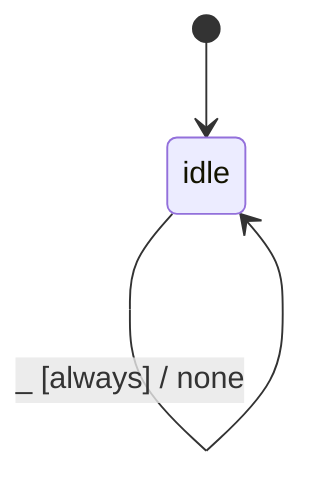

# tensor_view

Source: [`emel/tensor/view/sm.hpp`](https://github.com/stateforward/emel.cpp/blob/main/src/emel/tensor/view/sm.hpp)

## Mermaid

## Transitions

| Source | Event | Guard | Action | Target |
| --- | --- | --- | --- | --- |
| [`idle`](https://github.com/stateforward/emel.cpp/blob/main/src/emel/tensor/view/sm.hpp) | [`scaffold`](https://github.com/stateforward/emel.cpp/blob/main/src/emel/tensor/view/sm.hpp) | [`always`](https://github.com/stateforward/emel.cpp/blob/main/src/emel/tensor/view/sm.hpp) | [`none`](https://github.com/stateforward/emel.cpp/blob/main/src/emel/tensor/view/sm.hpp) | [`idle`](https://github.com/stateforward/emel.cpp/blob/main/src/emel/tensor/view/sm.hpp) |
| [`idle`](https://github.com/stateforward/emel.cpp/blob/main/src/emel/tensor/view/sm.hpp) | [`_`](https://github.com/stateforward/emel.cpp/blob/main/src/emel/tensor/view/sm.hpp) | [`always`](https://github.com/stateforward/emel.cpp/blob/main/src/emel/tensor/view/sm.hpp) | [`none`](https://github.com/stateforward/emel.cpp/blob/main/src/emel/tensor/view/sm.hpp) | [`idle`](https://github.com/stateforward/emel.cpp/blob/main/src/emel/tensor/view/sm.hpp) |
