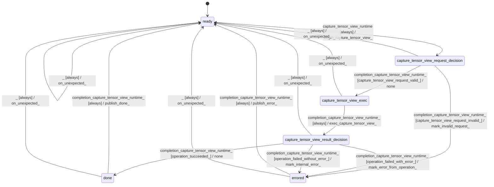

# tensor_view

Source: [`emel/tensor/view/sm.hpp`](https://github.com/stateforward/emel.cpp/blob/main/src/emel/tensor/view/sm.hpp)

## Mermaid

## Transitions

| Source | Event | Guard | Action | Target |
| --- | --- | --- | --- | --- |
| [`ready`](https://github.com/stateforward/emel.cpp/blob/main/src/emel/tensor/view/sm.hpp) | [`capture_tensor_view_runtime`](https://github.com/stateforward/emel.cpp/blob/main/src/emel/tensor/view/sm.hpp) | [`always`](https://github.com/stateforward/emel.cpp/blob/main/src/emel/tensor/view/sm.hpp) | [`begin_capture_tensor_view>`](https://github.com/stateforward/emel.cpp/blob/main/src/emel/tensor/view/sm.hpp) | [`capture_tensor_view_request_decision`](https://github.com/stateforward/emel.cpp/blob/main/src/emel/tensor/view/sm.hpp) |
| [`capture_tensor_view_request_decision`](https://github.com/stateforward/emel.cpp/blob/main/src/emel/tensor/view/sm.hpp) | [`completion<capture_tensor_view_runtime>`](https://github.com/stateforward/emel.cpp/blob/main/src/emel/tensor/view/sm.hpp) | [`capture_tensor_view_request_valid>`](https://github.com/stateforward/emel.cpp/blob/main/src/emel/tensor/view/sm.hpp) | [`none`](https://github.com/stateforward/emel.cpp/blob/main/src/emel/tensor/view/sm.hpp) | [`capture_tensor_view_exec`](https://github.com/stateforward/emel.cpp/blob/main/src/emel/tensor/view/sm.hpp) |
| [`capture_tensor_view_request_decision`](https://github.com/stateforward/emel.cpp/blob/main/src/emel/tensor/view/sm.hpp) | [`completion<capture_tensor_view_runtime>`](https://github.com/stateforward/emel.cpp/blob/main/src/emel/tensor/view/sm.hpp) | [`capture_tensor_view_request_invalid>`](https://github.com/stateforward/emel.cpp/blob/main/src/emel/tensor/view/sm.hpp) | [`mark_invalid_request>`](https://github.com/stateforward/emel.cpp/blob/main/src/emel/tensor/view/sm.hpp) | [`errored`](https://github.com/stateforward/emel.cpp/blob/main/src/emel/tensor/view/sm.hpp) |
| [`capture_tensor_view_exec`](https://github.com/stateforward/emel.cpp/blob/main/src/emel/tensor/view/sm.hpp) | [`completion<capture_tensor_view_runtime>`](https://github.com/stateforward/emel.cpp/blob/main/src/emel/tensor/view/sm.hpp) | [`always`](https://github.com/stateforward/emel.cpp/blob/main/src/emel/tensor/view/sm.hpp) | [`exec_capture_tensor_view>`](https://github.com/stateforward/emel.cpp/blob/main/src/emel/tensor/view/sm.hpp) | [`capture_tensor_view_result_decision`](https://github.com/stateforward/emel.cpp/blob/main/src/emel/tensor/view/sm.hpp) |
| [`capture_tensor_view_result_decision`](https://github.com/stateforward/emel.cpp/blob/main/src/emel/tensor/view/sm.hpp) | [`completion<capture_tensor_view_runtime>`](https://github.com/stateforward/emel.cpp/blob/main/src/emel/tensor/view/sm.hpp) | [`operation_succeeded>`](https://github.com/stateforward/emel.cpp/blob/main/src/emel/tensor/view/sm.hpp) | [`none`](https://github.com/stateforward/emel.cpp/blob/main/src/emel/tensor/view/sm.hpp) | [`done`](https://github.com/stateforward/emel.cpp/blob/main/src/emel/tensor/view/sm.hpp) |
| [`capture_tensor_view_result_decision`](https://github.com/stateforward/emel.cpp/blob/main/src/emel/tensor/view/sm.hpp) | [`completion<capture_tensor_view_runtime>`](https://github.com/stateforward/emel.cpp/blob/main/src/emel/tensor/view/sm.hpp) | [`operation_failed_with_error>`](https://github.com/stateforward/emel.cpp/blob/main/src/emel/tensor/view/sm.hpp) | [`mark_error_from_operation>`](https://github.com/stateforward/emel.cpp/blob/main/src/emel/tensor/view/sm.hpp) | [`errored`](https://github.com/stateforward/emel.cpp/blob/main/src/emel/tensor/view/sm.hpp) |
| [`capture_tensor_view_result_decision`](https://github.com/stateforward/emel.cpp/blob/main/src/emel/tensor/view/sm.hpp) | [`completion<capture_tensor_view_runtime>`](https://github.com/stateforward/emel.cpp/blob/main/src/emel/tensor/view/sm.hpp) | [`operation_failed_without_error>`](https://github.com/stateforward/emel.cpp/blob/main/src/emel/tensor/view/sm.hpp) | [`mark_internal_error>`](https://github.com/stateforward/emel.cpp/blob/main/src/emel/tensor/view/sm.hpp) | [`errored`](https://github.com/stateforward/emel.cpp/blob/main/src/emel/tensor/view/sm.hpp) |
| [`done`](https://github.com/stateforward/emel.cpp/blob/main/src/emel/tensor/view/sm.hpp) | [`completion<capture_tensor_view_runtime>`](https://github.com/stateforward/emel.cpp/blob/main/src/emel/tensor/view/sm.hpp) | [`always`](https://github.com/stateforward/emel.cpp/blob/main/src/emel/tensor/view/sm.hpp) | [`publish_done>`](https://github.com/stateforward/emel.cpp/blob/main/src/emel/tensor/view/sm.hpp) | [`ready`](https://github.com/stateforward/emel.cpp/blob/main/src/emel/tensor/view/sm.hpp) |
| [`errored`](https://github.com/stateforward/emel.cpp/blob/main/src/emel/tensor/view/sm.hpp) | [`completion<capture_tensor_view_runtime>`](https://github.com/stateforward/emel.cpp/blob/main/src/emel/tensor/view/sm.hpp) | [`always`](https://github.com/stateforward/emel.cpp/blob/main/src/emel/tensor/view/sm.hpp) | [`publish_error>`](https://github.com/stateforward/emel.cpp/blob/main/src/emel/tensor/view/sm.hpp) | [`ready`](https://github.com/stateforward/emel.cpp/blob/main/src/emel/tensor/view/sm.hpp) |
| [`ready`](https://github.com/stateforward/emel.cpp/blob/main/src/emel/tensor/view/sm.hpp) | [`_`](https://github.com/stateforward/emel.cpp/blob/main/src/emel/tensor/view/sm.hpp) | [`always`](https://github.com/stateforward/emel.cpp/blob/main/src/emel/tensor/view/sm.hpp) | [`on_unexpected>`](https://github.com/stateforward/emel.cpp/blob/main/src/emel/tensor/view/sm.hpp) | [`ready`](https://github.com/stateforward/emel.cpp/blob/main/src/emel/tensor/view/sm.hpp) |
| [`capture_tensor_view_request_decision`](https://github.com/stateforward/emel.cpp/blob/main/src/emel/tensor/view/sm.hpp) | [`_`](https://github.com/stateforward/emel.cpp/blob/main/src/emel/tensor/view/sm.hpp) | [`always`](https://github.com/stateforward/emel.cpp/blob/main/src/emel/tensor/view/sm.hpp) | [`on_unexpected>`](https://github.com/stateforward/emel.cpp/blob/main/src/emel/tensor/view/sm.hpp) | [`ready`](https://github.com/stateforward/emel.cpp/blob/main/src/emel/tensor/view/sm.hpp) |
| [`capture_tensor_view_exec`](https://github.com/stateforward/emel.cpp/blob/main/src/emel/tensor/view/sm.hpp) | [`_`](https://github.com/stateforward/emel.cpp/blob/main/src/emel/tensor/view/sm.hpp) | [`always`](https://github.com/stateforward/emel.cpp/blob/main/src/emel/tensor/view/sm.hpp) | [`on_unexpected>`](https://github.com/stateforward/emel.cpp/blob/main/src/emel/tensor/view/sm.hpp) | [`ready`](https://github.com/stateforward/emel.cpp/blob/main/src/emel/tensor/view/sm.hpp) |
| [`capture_tensor_view_result_decision`](https://github.com/stateforward/emel.cpp/blob/main/src/emel/tensor/view/sm.hpp) | [`_`](https://github.com/stateforward/emel.cpp/blob/main/src/emel/tensor/view/sm.hpp) | [`always`](https://github.com/stateforward/emel.cpp/blob/main/src/emel/tensor/view/sm.hpp) | [`on_unexpected>`](https://github.com/stateforward/emel.cpp/blob/main/src/emel/tensor/view/sm.hpp) | [`ready`](https://github.com/stateforward/emel.cpp/blob/main/src/emel/tensor/view/sm.hpp) |
| [`done`](https://github.com/stateforward/emel.cpp/blob/main/src/emel/tensor/view/sm.hpp) | [`_`](https://github.com/stateforward/emel.cpp/blob/main/src/emel/tensor/view/sm.hpp) | [`always`](https://github.com/stateforward/emel.cpp/blob/main/src/emel/tensor/view/sm.hpp) | [`on_unexpected>`](https://github.com/stateforward/emel.cpp/blob/main/src/emel/tensor/view/sm.hpp) | [`ready`](https://github.com/stateforward/emel.cpp/blob/main/src/emel/tensor/view/sm.hpp) |
| [`errored`](https://github.com/stateforward/emel.cpp/blob/main/src/emel/tensor/view/sm.hpp) | [`_`](https://github.com/stateforward/emel.cpp/blob/main/src/emel/tensor/view/sm.hpp) | [`always`](https://github.com/stateforward/emel.cpp/blob/main/src/emel/tensor/view/sm.hpp) | [`on_unexpected>`](https://github.com/stateforward/emel.cpp/blob/main/src/emel/tensor/view/sm.hpp) | [`ready`](https://github.com/stateforward/emel.cpp/blob/main/src/emel/tensor/view/sm.hpp) |
