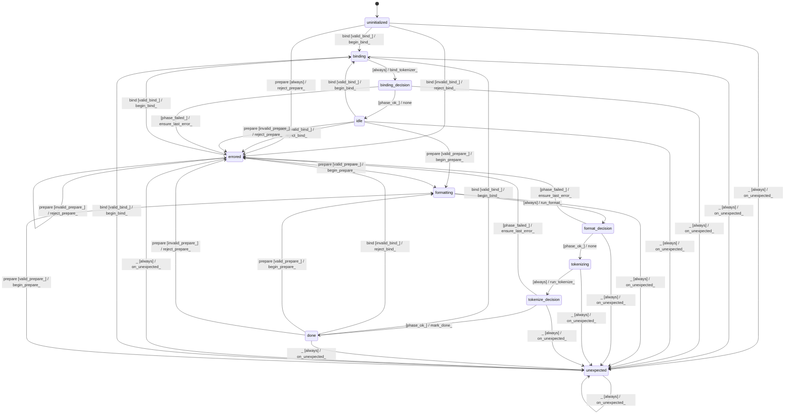

# text_conditioner

Source: [`emel/text/conditioner/sm.hpp`](https://github.com/stateforward/emel.cpp/blob/main/src/emel/text/conditioner/sm.hpp)

## Mermaid

## Transitions

| Source | Event | Guard | Action | Target |
| --- | --- | --- | --- | --- |
| [`uninitialized`](https://github.com/stateforward/emel.cpp/blob/main/src/emel/text/conditioner/sm.hpp) | [`bind`](https://github.com/stateforward/emel.cpp/blob/main/src/emel/text/conditioner/sm.hpp) | [`valid_bind>`](https://github.com/stateforward/emel.cpp/blob/main/src/emel/text/conditioner/sm.hpp) | [`begin_bind>`](https://github.com/stateforward/emel.cpp/blob/main/src/emel/text/conditioner/sm.hpp) | [`binding`](https://github.com/stateforward/emel.cpp/blob/main/src/emel/text/conditioner/sm.hpp) |
| [`uninitialized`](https://github.com/stateforward/emel.cpp/blob/main/src/emel/text/conditioner/sm.hpp) | [`bind`](https://github.com/stateforward/emel.cpp/blob/main/src/emel/text/conditioner/sm.hpp) | [`invalid_bind>`](https://github.com/stateforward/emel.cpp/blob/main/src/emel/text/conditioner/sm.hpp) | [`reject_bind>`](https://github.com/stateforward/emel.cpp/blob/main/src/emel/text/conditioner/sm.hpp) | [`errored`](https://github.com/stateforward/emel.cpp/blob/main/src/emel/text/conditioner/sm.hpp) |
| [`uninitialized`](https://github.com/stateforward/emel.cpp/blob/main/src/emel/text/conditioner/sm.hpp) | [`prepare`](https://github.com/stateforward/emel.cpp/blob/main/src/emel/text/conditioner/sm.hpp) | [`always`](https://github.com/stateforward/emel.cpp/blob/main/src/emel/text/conditioner/sm.hpp) | [`reject_prepare>`](https://github.com/stateforward/emel.cpp/blob/main/src/emel/text/conditioner/sm.hpp) | [`errored`](https://github.com/stateforward/emel.cpp/blob/main/src/emel/text/conditioner/sm.hpp) |
| [`idle`](https://github.com/stateforward/emel.cpp/blob/main/src/emel/text/conditioner/sm.hpp) | [`bind`](https://github.com/stateforward/emel.cpp/blob/main/src/emel/text/conditioner/sm.hpp) | [`valid_bind>`](https://github.com/stateforward/emel.cpp/blob/main/src/emel/text/conditioner/sm.hpp) | [`begin_bind>`](https://github.com/stateforward/emel.cpp/blob/main/src/emel/text/conditioner/sm.hpp) | [`binding`](https://github.com/stateforward/emel.cpp/blob/main/src/emel/text/conditioner/sm.hpp) |
| [`idle`](https://github.com/stateforward/emel.cpp/blob/main/src/emel/text/conditioner/sm.hpp) | [`bind`](https://github.com/stateforward/emel.cpp/blob/main/src/emel/text/conditioner/sm.hpp) | [`invalid_bind>`](https://github.com/stateforward/emel.cpp/blob/main/src/emel/text/conditioner/sm.hpp) | [`reject_bind>`](https://github.com/stateforward/emel.cpp/blob/main/src/emel/text/conditioner/sm.hpp) | [`errored`](https://github.com/stateforward/emel.cpp/blob/main/src/emel/text/conditioner/sm.hpp) |
| [`idle`](https://github.com/stateforward/emel.cpp/blob/main/src/emel/text/conditioner/sm.hpp) | [`prepare`](https://github.com/stateforward/emel.cpp/blob/main/src/emel/text/conditioner/sm.hpp) | [`valid_prepare>`](https://github.com/stateforward/emel.cpp/blob/main/src/emel/text/conditioner/sm.hpp) | [`begin_prepare>`](https://github.com/stateforward/emel.cpp/blob/main/src/emel/text/conditioner/sm.hpp) | [`formatting`](https://github.com/stateforward/emel.cpp/blob/main/src/emel/text/conditioner/sm.hpp) |
| [`idle`](https://github.com/stateforward/emel.cpp/blob/main/src/emel/text/conditioner/sm.hpp) | [`prepare`](https://github.com/stateforward/emel.cpp/blob/main/src/emel/text/conditioner/sm.hpp) | [`invalid_prepare>`](https://github.com/stateforward/emel.cpp/blob/main/src/emel/text/conditioner/sm.hpp) | [`reject_prepare>`](https://github.com/stateforward/emel.cpp/blob/main/src/emel/text/conditioner/sm.hpp) | [`errored`](https://github.com/stateforward/emel.cpp/blob/main/src/emel/text/conditioner/sm.hpp) |
| [`done`](https://github.com/stateforward/emel.cpp/blob/main/src/emel/text/conditioner/sm.hpp) | [`bind`](https://github.com/stateforward/emel.cpp/blob/main/src/emel/text/conditioner/sm.hpp) | [`valid_bind>`](https://github.com/stateforward/emel.cpp/blob/main/src/emel/text/conditioner/sm.hpp) | [`begin_bind>`](https://github.com/stateforward/emel.cpp/blob/main/src/emel/text/conditioner/sm.hpp) | [`binding`](https://github.com/stateforward/emel.cpp/blob/main/src/emel/text/conditioner/sm.hpp) |
| [`done`](https://github.com/stateforward/emel.cpp/blob/main/src/emel/text/conditioner/sm.hpp) | [`bind`](https://github.com/stateforward/emel.cpp/blob/main/src/emel/text/conditioner/sm.hpp) | [`invalid_bind>`](https://github.com/stateforward/emel.cpp/blob/main/src/emel/text/conditioner/sm.hpp) | [`reject_bind>`](https://github.com/stateforward/emel.cpp/blob/main/src/emel/text/conditioner/sm.hpp) | [`errored`](https://github.com/stateforward/emel.cpp/blob/main/src/emel/text/conditioner/sm.hpp) |
| [`done`](https://github.com/stateforward/emel.cpp/blob/main/src/emel/text/conditioner/sm.hpp) | [`prepare`](https://github.com/stateforward/emel.cpp/blob/main/src/emel/text/conditioner/sm.hpp) | [`valid_prepare>`](https://github.com/stateforward/emel.cpp/blob/main/src/emel/text/conditioner/sm.hpp) | [`begin_prepare>`](https://github.com/stateforward/emel.cpp/blob/main/src/emel/text/conditioner/sm.hpp) | [`formatting`](https://github.com/stateforward/emel.cpp/blob/main/src/emel/text/conditioner/sm.hpp) |
| [`done`](https://github.com/stateforward/emel.cpp/blob/main/src/emel/text/conditioner/sm.hpp) | [`prepare`](https://github.com/stateforward/emel.cpp/blob/main/src/emel/text/conditioner/sm.hpp) | [`invalid_prepare>`](https://github.com/stateforward/emel.cpp/blob/main/src/emel/text/conditioner/sm.hpp) | [`reject_prepare>`](https://github.com/stateforward/emel.cpp/blob/main/src/emel/text/conditioner/sm.hpp) | [`errored`](https://github.com/stateforward/emel.cpp/blob/main/src/emel/text/conditioner/sm.hpp) |
| [`errored`](https://github.com/stateforward/emel.cpp/blob/main/src/emel/text/conditioner/sm.hpp) | [`bind`](https://github.com/stateforward/emel.cpp/blob/main/src/emel/text/conditioner/sm.hpp) | [`valid_bind>`](https://github.com/stateforward/emel.cpp/blob/main/src/emel/text/conditioner/sm.hpp) | [`begin_bind>`](https://github.com/stateforward/emel.cpp/blob/main/src/emel/text/conditioner/sm.hpp) | [`binding`](https://github.com/stateforward/emel.cpp/blob/main/src/emel/text/conditioner/sm.hpp) |
| [`errored`](https://github.com/stateforward/emel.cpp/blob/main/src/emel/text/conditioner/sm.hpp) | [`bind`](https://github.com/stateforward/emel.cpp/blob/main/src/emel/text/conditioner/sm.hpp) | [`invalid_bind>`](https://github.com/stateforward/emel.cpp/blob/main/src/emel/text/conditioner/sm.hpp) | [`reject_bind>`](https://github.com/stateforward/emel.cpp/blob/main/src/emel/text/conditioner/sm.hpp) | [`errored`](https://github.com/stateforward/emel.cpp/blob/main/src/emel/text/conditioner/sm.hpp) |
| [`errored`](https://github.com/stateforward/emel.cpp/blob/main/src/emel/text/conditioner/sm.hpp) | [`prepare`](https://github.com/stateforward/emel.cpp/blob/main/src/emel/text/conditioner/sm.hpp) | [`valid_prepare>`](https://github.com/stateforward/emel.cpp/blob/main/src/emel/text/conditioner/sm.hpp) | [`begin_prepare>`](https://github.com/stateforward/emel.cpp/blob/main/src/emel/text/conditioner/sm.hpp) | [`formatting`](https://github.com/stateforward/emel.cpp/blob/main/src/emel/text/conditioner/sm.hpp) |
| [`errored`](https://github.com/stateforward/emel.cpp/blob/main/src/emel/text/conditioner/sm.hpp) | [`prepare`](https://github.com/stateforward/emel.cpp/blob/main/src/emel/text/conditioner/sm.hpp) | [`invalid_prepare>`](https://github.com/stateforward/emel.cpp/blob/main/src/emel/text/conditioner/sm.hpp) | [`reject_prepare>`](https://github.com/stateforward/emel.cpp/blob/main/src/emel/text/conditioner/sm.hpp) | [`errored`](https://github.com/stateforward/emel.cpp/blob/main/src/emel/text/conditioner/sm.hpp) |
| [`unexpected`](https://github.com/stateforward/emel.cpp/blob/main/src/emel/text/conditioner/sm.hpp) | [`bind`](https://github.com/stateforward/emel.cpp/blob/main/src/emel/text/conditioner/sm.hpp) | [`valid_bind>`](https://github.com/stateforward/emel.cpp/blob/main/src/emel/text/conditioner/sm.hpp) | [`begin_bind>`](https://github.com/stateforward/emel.cpp/blob/main/src/emel/text/conditioner/sm.hpp) | [`binding`](https://github.com/stateforward/emel.cpp/blob/main/src/emel/text/conditioner/sm.hpp) |
| [`unexpected`](https://github.com/stateforward/emel.cpp/blob/main/src/emel/text/conditioner/sm.hpp) | [`bind`](https://github.com/stateforward/emel.cpp/blob/main/src/emel/text/conditioner/sm.hpp) | [`invalid_bind>`](https://github.com/stateforward/emel.cpp/blob/main/src/emel/text/conditioner/sm.hpp) | [`reject_bind>`](https://github.com/stateforward/emel.cpp/blob/main/src/emel/text/conditioner/sm.hpp) | [`unexpected`](https://github.com/stateforward/emel.cpp/blob/main/src/emel/text/conditioner/sm.hpp) |
| [`unexpected`](https://github.com/stateforward/emel.cpp/blob/main/src/emel/text/conditioner/sm.hpp) | [`prepare`](https://github.com/stateforward/emel.cpp/blob/main/src/emel/text/conditioner/sm.hpp) | [`valid_prepare>`](https://github.com/stateforward/emel.cpp/blob/main/src/emel/text/conditioner/sm.hpp) | [`begin_prepare>`](https://github.com/stateforward/emel.cpp/blob/main/src/emel/text/conditioner/sm.hpp) | [`formatting`](https://github.com/stateforward/emel.cpp/blob/main/src/emel/text/conditioner/sm.hpp) |
| [`unexpected`](https://github.com/stateforward/emel.cpp/blob/main/src/emel/text/conditioner/sm.hpp) | [`prepare`](https://github.com/stateforward/emel.cpp/blob/main/src/emel/text/conditioner/sm.hpp) | [`invalid_prepare>`](https://github.com/stateforward/emel.cpp/blob/main/src/emel/text/conditioner/sm.hpp) | [`reject_prepare>`](https://github.com/stateforward/emel.cpp/blob/main/src/emel/text/conditioner/sm.hpp) | [`unexpected`](https://github.com/stateforward/emel.cpp/blob/main/src/emel/text/conditioner/sm.hpp) |
| [`binding`](https://github.com/stateforward/emel.cpp/blob/main/src/emel/text/conditioner/sm.hpp) | - | [`always`](https://github.com/stateforward/emel.cpp/blob/main/src/emel/text/conditioner/sm.hpp) | [`bind_tokenizer>`](https://github.com/stateforward/emel.cpp/blob/main/src/emel/text/conditioner/sm.hpp) | [`binding_decision`](https://github.com/stateforward/emel.cpp/blob/main/src/emel/text/conditioner/sm.hpp) |
| [`binding_decision`](https://github.com/stateforward/emel.cpp/blob/main/src/emel/text/conditioner/sm.hpp) | - | [`phase_ok>`](https://github.com/stateforward/emel.cpp/blob/main/src/emel/text/conditioner/sm.hpp) | [`none`](https://github.com/stateforward/emel.cpp/blob/main/src/emel/text/conditioner/sm.hpp) | [`idle`](https://github.com/stateforward/emel.cpp/blob/main/src/emel/text/conditioner/sm.hpp) |
| [`binding_decision`](https://github.com/stateforward/emel.cpp/blob/main/src/emel/text/conditioner/sm.hpp) | - | [`phase_failed>`](https://github.com/stateforward/emel.cpp/blob/main/src/emel/text/conditioner/sm.hpp) | [`ensure_last_error>`](https://github.com/stateforward/emel.cpp/blob/main/src/emel/text/conditioner/sm.hpp) | [`errored`](https://github.com/stateforward/emel.cpp/blob/main/src/emel/text/conditioner/sm.hpp) |
| [`formatting`](https://github.com/stateforward/emel.cpp/blob/main/src/emel/text/conditioner/sm.hpp) | - | [`always`](https://github.com/stateforward/emel.cpp/blob/main/src/emel/text/conditioner/sm.hpp) | [`run_format>`](https://github.com/stateforward/emel.cpp/blob/main/src/emel/text/conditioner/sm.hpp) | [`format_decision`](https://github.com/stateforward/emel.cpp/blob/main/src/emel/text/conditioner/sm.hpp) |
| [`format_decision`](https://github.com/stateforward/emel.cpp/blob/main/src/emel/text/conditioner/sm.hpp) | - | [`phase_ok>`](https://github.com/stateforward/emel.cpp/blob/main/src/emel/text/conditioner/sm.hpp) | [`none`](https://github.com/stateforward/emel.cpp/blob/main/src/emel/text/conditioner/sm.hpp) | [`tokenizing`](https://github.com/stateforward/emel.cpp/blob/main/src/emel/text/conditioner/sm.hpp) |
| [`format_decision`](https://github.com/stateforward/emel.cpp/blob/main/src/emel/text/conditioner/sm.hpp) | - | [`phase_failed>`](https://github.com/stateforward/emel.cpp/blob/main/src/emel/text/conditioner/sm.hpp) | [`ensure_last_error>`](https://github.com/stateforward/emel.cpp/blob/main/src/emel/text/conditioner/sm.hpp) | [`errored`](https://github.com/stateforward/emel.cpp/blob/main/src/emel/text/conditioner/sm.hpp) |
| [`tokenizing`](https://github.com/stateforward/emel.cpp/blob/main/src/emel/text/conditioner/sm.hpp) | - | [`always`](https://github.com/stateforward/emel.cpp/blob/main/src/emel/text/conditioner/sm.hpp) | [`run_tokenize>`](https://github.com/stateforward/emel.cpp/blob/main/src/emel/text/conditioner/sm.hpp) | [`tokenize_decision`](https://github.com/stateforward/emel.cpp/blob/main/src/emel/text/conditioner/sm.hpp) |
| [`tokenize_decision`](https://github.com/stateforward/emel.cpp/blob/main/src/emel/text/conditioner/sm.hpp) | - | [`phase_ok>`](https://github.com/stateforward/emel.cpp/blob/main/src/emel/text/conditioner/sm.hpp) | [`mark_done>`](https://github.com/stateforward/emel.cpp/blob/main/src/emel/text/conditioner/sm.hpp) | [`done`](https://github.com/stateforward/emel.cpp/blob/main/src/emel/text/conditioner/sm.hpp) |
| [`tokenize_decision`](https://github.com/stateforward/emel.cpp/blob/main/src/emel/text/conditioner/sm.hpp) | - | [`phase_failed>`](https://github.com/stateforward/emel.cpp/blob/main/src/emel/text/conditioner/sm.hpp) | [`ensure_last_error>`](https://github.com/stateforward/emel.cpp/blob/main/src/emel/text/conditioner/sm.hpp) | [`errored`](https://github.com/stateforward/emel.cpp/blob/main/src/emel/text/conditioner/sm.hpp) |
| [`uninitialized`](https://github.com/stateforward/emel.cpp/blob/main/src/emel/text/conditioner/sm.hpp) | [`_`](https://github.com/stateforward/emel.cpp/blob/main/src/emel/text/conditioner/sm.hpp) | [`always`](https://github.com/stateforward/emel.cpp/blob/main/src/emel/text/conditioner/sm.hpp) | [`on_unexpected>`](https://github.com/stateforward/emel.cpp/blob/main/src/emel/text/conditioner/sm.hpp) | [`unexpected`](https://github.com/stateforward/emel.cpp/blob/main/src/emel/text/conditioner/sm.hpp) |
| [`binding`](https://github.com/stateforward/emel.cpp/blob/main/src/emel/text/conditioner/sm.hpp) | [`_`](https://github.com/stateforward/emel.cpp/blob/main/src/emel/text/conditioner/sm.hpp) | [`always`](https://github.com/stateforward/emel.cpp/blob/main/src/emel/text/conditioner/sm.hpp) | [`on_unexpected>`](https://github.com/stateforward/emel.cpp/blob/main/src/emel/text/conditioner/sm.hpp) | [`unexpected`](https://github.com/stateforward/emel.cpp/blob/main/src/emel/text/conditioner/sm.hpp) |
| [`binding_decision`](https://github.com/stateforward/emel.cpp/blob/main/src/emel/text/conditioner/sm.hpp) | [`_`](https://github.com/stateforward/emel.cpp/blob/main/src/emel/text/conditioner/sm.hpp) | [`always`](https://github.com/stateforward/emel.cpp/blob/main/src/emel/text/conditioner/sm.hpp) | [`on_unexpected>`](https://github.com/stateforward/emel.cpp/blob/main/src/emel/text/conditioner/sm.hpp) | [`unexpected`](https://github.com/stateforward/emel.cpp/blob/main/src/emel/text/conditioner/sm.hpp) |
| [`idle`](https://github.com/stateforward/emel.cpp/blob/main/src/emel/text/conditioner/sm.hpp) | [`_`](https://github.com/stateforward/emel.cpp/blob/main/src/emel/text/conditioner/sm.hpp) | [`always`](https://github.com/stateforward/emel.cpp/blob/main/src/emel/text/conditioner/sm.hpp) | [`on_unexpected>`](https://github.com/stateforward/emel.cpp/blob/main/src/emel/text/conditioner/sm.hpp) | [`unexpected`](https://github.com/stateforward/emel.cpp/blob/main/src/emel/text/conditioner/sm.hpp) |
| [`formatting`](https://github.com/stateforward/emel.cpp/blob/main/src/emel/text/conditioner/sm.hpp) | [`_`](https://github.com/stateforward/emel.cpp/blob/main/src/emel/text/conditioner/sm.hpp) | [`always`](https://github.com/stateforward/emel.cpp/blob/main/src/emel/text/conditioner/sm.hpp) | [`on_unexpected>`](https://github.com/stateforward/emel.cpp/blob/main/src/emel/text/conditioner/sm.hpp) | [`unexpected`](https://github.com/stateforward/emel.cpp/blob/main/src/emel/text/conditioner/sm.hpp) |
| [`format_decision`](https://github.com/stateforward/emel.cpp/blob/main/src/emel/text/conditioner/sm.hpp) | [`_`](https://github.com/stateforward/emel.cpp/blob/main/src/emel/text/conditioner/sm.hpp) | [`always`](https://github.com/stateforward/emel.cpp/blob/main/src/emel/text/conditioner/sm.hpp) | [`on_unexpected>`](https://github.com/stateforward/emel.cpp/blob/main/src/emel/text/conditioner/sm.hpp) | [`unexpected`](https://github.com/stateforward/emel.cpp/blob/main/src/emel/text/conditioner/sm.hpp) |
| [`tokenizing`](https://github.com/stateforward/emel.cpp/blob/main/src/emel/text/conditioner/sm.hpp) | [`_`](https://github.com/stateforward/emel.cpp/blob/main/src/emel/text/conditioner/sm.hpp) | [`always`](https://github.com/stateforward/emel.cpp/blob/main/src/emel/text/conditioner/sm.hpp) | [`on_unexpected>`](https://github.com/stateforward/emel.cpp/blob/main/src/emel/text/conditioner/sm.hpp) | [`unexpected`](https://github.com/stateforward/emel.cpp/blob/main/src/emel/text/conditioner/sm.hpp) |
| [`tokenize_decision`](https://github.com/stateforward/emel.cpp/blob/main/src/emel/text/conditioner/sm.hpp) | [`_`](https://github.com/stateforward/emel.cpp/blob/main/src/emel/text/conditioner/sm.hpp) | [`always`](https://github.com/stateforward/emel.cpp/blob/main/src/emel/text/conditioner/sm.hpp) | [`on_unexpected>`](https://github.com/stateforward/emel.cpp/blob/main/src/emel/text/conditioner/sm.hpp) | [`unexpected`](https://github.com/stateforward/emel.cpp/blob/main/src/emel/text/conditioner/sm.hpp) |
| [`done`](https://github.com/stateforward/emel.cpp/blob/main/src/emel/text/conditioner/sm.hpp) | [`_`](https://github.com/stateforward/emel.cpp/blob/main/src/emel/text/conditioner/sm.hpp) | [`always`](https://github.com/stateforward/emel.cpp/blob/main/src/emel/text/conditioner/sm.hpp) | [`on_unexpected>`](https://github.com/stateforward/emel.cpp/blob/main/src/emel/text/conditioner/sm.hpp) | [`unexpected`](https://github.com/stateforward/emel.cpp/blob/main/src/emel/text/conditioner/sm.hpp) |
| [`errored`](https://github.com/stateforward/emel.cpp/blob/main/src/emel/text/conditioner/sm.hpp) | [`_`](https://github.com/stateforward/emel.cpp/blob/main/src/emel/text/conditioner/sm.hpp) | [`always`](https://github.com/stateforward/emel.cpp/blob/main/src/emel/text/conditioner/sm.hpp) | [`on_unexpected>`](https://github.com/stateforward/emel.cpp/blob/main/src/emel/text/conditioner/sm.hpp) | [`unexpected`](https://github.com/stateforward/emel.cpp/blob/main/src/emel/text/conditioner/sm.hpp) |
| [`unexpected`](https://github.com/stateforward/emel.cpp/blob/main/src/emel/text/conditioner/sm.hpp) | [`_`](https://github.com/stateforward/emel.cpp/blob/main/src/emel/text/conditioner/sm.hpp) | [`always`](https://github.com/stateforward/emel.cpp/blob/main/src/emel/text/conditioner/sm.hpp) | [`on_unexpected>`](https://github.com/stateforward/emel.cpp/blob/main/src/emel/text/conditioner/sm.hpp) | [`unexpected`](https://github.com/stateforward/emel.cpp/blob/main/src/emel/text/conditioner/sm.hpp) |
