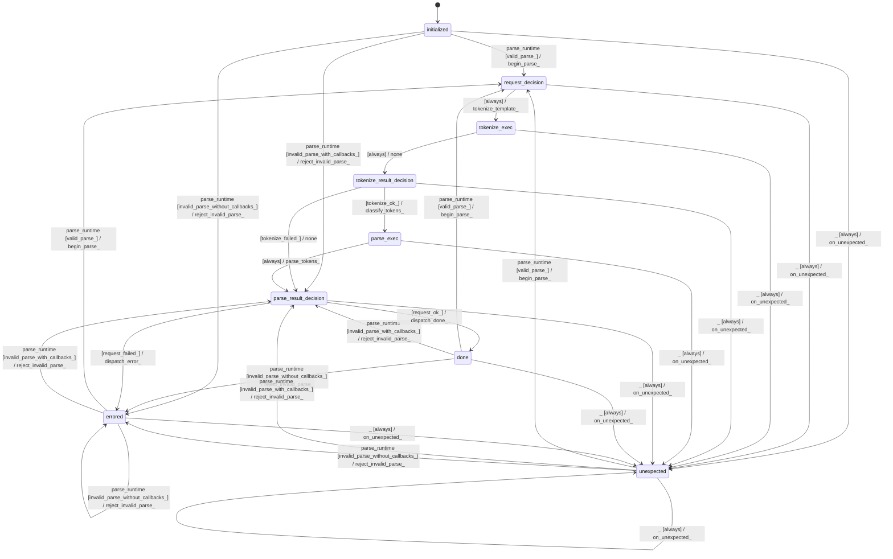

# text_jinja_parser

Source: [`emel/text/jinja/parser/sm.hpp`](https://github.com/stateforward/emel.cpp/blob/main/src/emel/text/jinja/parser/sm.hpp)

## Mermaid

## Transitions

| Source | Event | Guard | Action | Target |
| --- | --- | --- | --- | --- |
| initialized | parse_runtime | valid_parse_ | begin_parse_ | request_decision |
| initialized | parse_runtime | invalid_parse_with_callbacks_ | reject_invalid_parse_ | parse_result_decision |
| initialized | parse_runtime | invalid_parse_without_callbacks_ | reject_invalid_parse_ | errored |
| done | parse_runtime | valid_parse_ | begin_parse_ | request_decision |
| done | parse_runtime | invalid_parse_with_callbacks_ | reject_invalid_parse_ | parse_result_decision |
| done | parse_runtime | invalid_parse_without_callbacks_ | reject_invalid_parse_ | errored |
| errored | parse_runtime | valid_parse_ | begin_parse_ | request_decision |
| errored | parse_runtime | invalid_parse_with_callbacks_ | reject_invalid_parse_ | parse_result_decision |
| errored | parse_runtime | invalid_parse_without_callbacks_ | reject_invalid_parse_ | errored |
| unexpected | parse_runtime | valid_parse_ | begin_parse_ | request_decision |
| unexpected | parse_runtime | invalid_parse_with_callbacks_ | reject_invalid_parse_ | parse_result_decision |
| unexpected | parse_runtime | invalid_parse_without_callbacks_ | reject_invalid_parse_ | errored |
| request_decision | completion | always | tokenize_template_ | tokenize_exec |
| tokenize_exec | completion | always | none | tokenize_result_decision |
| tokenize_result_decision | completion | tokenize_ok_ | classify_tokens_ | parse_exec |
| tokenize_result_decision | completion | tokenize_failed_ | none | parse_result_decision |
| parse_exec | completion | always | parse_tokens_ | parse_result_decision |
| parse_result_decision | completion | request_ok_ | dispatch_done_ | done |
| parse_result_decision | completion | request_failed_ | dispatch_error_ | errored |
| initialized | _ | always | on_unexpected_ | unexpected |
| request_decision | _ | always | on_unexpected_ | unexpected |
| tokenize_exec | _ | always | on_unexpected_ | unexpected |
| tokenize_result_decision | _ | always | on_unexpected_ | unexpected |
| parse_exec | _ | always | on_unexpected_ | unexpected |
| parse_result_decision | _ | always | on_unexpected_ | unexpected |
| done | _ | always | on_unexpected_ | unexpected |
| errored | _ | always | on_unexpected_ | unexpected |
| unexpected | _ | always | on_unexpected_ | unexpected |
