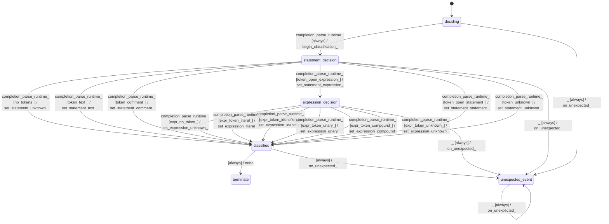

# text_jinja_parser_classifier_parser

Source: [`emel/text/jinja/parser/classifier_parser/sm.hpp`](https://github.com/stateforward/emel.cpp/blob/main/src/emel/text/jinja/parser/classifier_parser/sm.hpp)

## Mermaid

## Transitions

| Source | Event | Guard | Action | Target |
| --- | --- | --- | --- | --- |
| [`deciding`](https://github.com/stateforward/emel.cpp/blob/main/src/emel/text/jinja/parser/classifier_parser/sm.hpp) | [`completion<parse_runtime>`](https://github.com/stateforward/emel.cpp/blob/main/src/emel/text/jinja/parser/classifier_parser/sm.hpp) | [`always`](https://github.com/stateforward/emel.cpp/blob/main/src/emel/text/jinja/parser/classifier_parser/sm.hpp) | [`begin_classification>`](https://github.com/stateforward/emel.cpp/blob/main/src/emel/text/jinja/parser/classifier_parser/sm.hpp) | [`statement_decision`](https://github.com/stateforward/emel.cpp/blob/main/src/emel/text/jinja/parser/classifier_parser/sm.hpp) |
| [`statement_decision`](https://github.com/stateforward/emel.cpp/blob/main/src/emel/text/jinja/parser/classifier_parser/sm.hpp) | [`completion<parse_runtime>`](https://github.com/stateforward/emel.cpp/blob/main/src/emel/text/jinja/parser/classifier_parser/sm.hpp) | [`no_tokens>`](https://github.com/stateforward/emel.cpp/blob/main/src/emel/text/jinja/parser/classifier_parser/sm.hpp) | [`set_statement_unknown>`](https://github.com/stateforward/emel.cpp/blob/main/src/emel/text/jinja/parser/classifier_parser/sm.hpp) | [`classified`](https://github.com/stateforward/emel.cpp/blob/main/src/emel/text/jinja/parser/classifier_parser/sm.hpp) |
| [`statement_decision`](https://github.com/stateforward/emel.cpp/blob/main/src/emel/text/jinja/parser/classifier_parser/sm.hpp) | [`completion<parse_runtime>`](https://github.com/stateforward/emel.cpp/blob/main/src/emel/text/jinja/parser/classifier_parser/sm.hpp) | [`token_text>`](https://github.com/stateforward/emel.cpp/blob/main/src/emel/text/jinja/parser/classifier_parser/sm.hpp) | [`set_statement_text>`](https://github.com/stateforward/emel.cpp/blob/main/src/emel/text/jinja/parser/classifier_parser/sm.hpp) | [`classified`](https://github.com/stateforward/emel.cpp/blob/main/src/emel/text/jinja/parser/classifier_parser/sm.hpp) |
| [`statement_decision`](https://github.com/stateforward/emel.cpp/blob/main/src/emel/text/jinja/parser/classifier_parser/sm.hpp) | [`completion<parse_runtime>`](https://github.com/stateforward/emel.cpp/blob/main/src/emel/text/jinja/parser/classifier_parser/sm.hpp) | [`token_comment>`](https://github.com/stateforward/emel.cpp/blob/main/src/emel/text/jinja/parser/classifier_parser/sm.hpp) | [`set_statement_comment>`](https://github.com/stateforward/emel.cpp/blob/main/src/emel/text/jinja/parser/classifier_parser/sm.hpp) | [`classified`](https://github.com/stateforward/emel.cpp/blob/main/src/emel/text/jinja/parser/classifier_parser/sm.hpp) |
| [`statement_decision`](https://github.com/stateforward/emel.cpp/blob/main/src/emel/text/jinja/parser/classifier_parser/sm.hpp) | [`completion<parse_runtime>`](https://github.com/stateforward/emel.cpp/blob/main/src/emel/text/jinja/parser/classifier_parser/sm.hpp) | [`token_open_expression>`](https://github.com/stateforward/emel.cpp/blob/main/src/emel/text/jinja/parser/classifier_parser/sm.hpp) | [`set_statement_expression>`](https://github.com/stateforward/emel.cpp/blob/main/src/emel/text/jinja/parser/classifier_parser/sm.hpp) | [`expression_decision`](https://github.com/stateforward/emel.cpp/blob/main/src/emel/text/jinja/parser/classifier_parser/sm.hpp) |
| [`statement_decision`](https://github.com/stateforward/emel.cpp/blob/main/src/emel/text/jinja/parser/classifier_parser/sm.hpp) | [`completion<parse_runtime>`](https://github.com/stateforward/emel.cpp/blob/main/src/emel/text/jinja/parser/classifier_parser/sm.hpp) | [`token_open_statement>`](https://github.com/stateforward/emel.cpp/blob/main/src/emel/text/jinja/parser/classifier_parser/sm.hpp) | [`set_statement_statement>`](https://github.com/stateforward/emel.cpp/blob/main/src/emel/text/jinja/parser/classifier_parser/sm.hpp) | [`classified`](https://github.com/stateforward/emel.cpp/blob/main/src/emel/text/jinja/parser/classifier_parser/sm.hpp) |
| [`statement_decision`](https://github.com/stateforward/emel.cpp/blob/main/src/emel/text/jinja/parser/classifier_parser/sm.hpp) | [`completion<parse_runtime>`](https://github.com/stateforward/emel.cpp/blob/main/src/emel/text/jinja/parser/classifier_parser/sm.hpp) | [`token_unknown>`](https://github.com/stateforward/emel.cpp/blob/main/src/emel/text/jinja/parser/classifier_parser/sm.hpp) | [`set_statement_unknown>`](https://github.com/stateforward/emel.cpp/blob/main/src/emel/text/jinja/parser/classifier_parser/sm.hpp) | [`classified`](https://github.com/stateforward/emel.cpp/blob/main/src/emel/text/jinja/parser/classifier_parser/sm.hpp) |
| [`expression_decision`](https://github.com/stateforward/emel.cpp/blob/main/src/emel/text/jinja/parser/classifier_parser/sm.hpp) | [`completion<parse_runtime>`](https://github.com/stateforward/emel.cpp/blob/main/src/emel/text/jinja/parser/classifier_parser/sm.hpp) | [`expr_no_token>`](https://github.com/stateforward/emel.cpp/blob/main/src/emel/text/jinja/parser/classifier_parser/sm.hpp) | [`set_expression_unknown>`](https://github.com/stateforward/emel.cpp/blob/main/src/emel/text/jinja/parser/classifier_parser/sm.hpp) | [`classified`](https://github.com/stateforward/emel.cpp/blob/main/src/emel/text/jinja/parser/classifier_parser/sm.hpp) |
| [`expression_decision`](https://github.com/stateforward/emel.cpp/blob/main/src/emel/text/jinja/parser/classifier_parser/sm.hpp) | [`completion<parse_runtime>`](https://github.com/stateforward/emel.cpp/blob/main/src/emel/text/jinja/parser/classifier_parser/sm.hpp) | [`expr_token_literal>`](https://github.com/stateforward/emel.cpp/blob/main/src/emel/text/jinja/parser/classifier_parser/sm.hpp) | [`set_expression_literal>`](https://github.com/stateforward/emel.cpp/blob/main/src/emel/text/jinja/parser/classifier_parser/sm.hpp) | [`classified`](https://github.com/stateforward/emel.cpp/blob/main/src/emel/text/jinja/parser/classifier_parser/sm.hpp) |
| [`expression_decision`](https://github.com/stateforward/emel.cpp/blob/main/src/emel/text/jinja/parser/classifier_parser/sm.hpp) | [`completion<parse_runtime>`](https://github.com/stateforward/emel.cpp/blob/main/src/emel/text/jinja/parser/classifier_parser/sm.hpp) | [`expr_token_identifier>`](https://github.com/stateforward/emel.cpp/blob/main/src/emel/text/jinja/parser/classifier_parser/sm.hpp) | [`set_expression_identifier>`](https://github.com/stateforward/emel.cpp/blob/main/src/emel/text/jinja/parser/classifier_parser/sm.hpp) | [`classified`](https://github.com/stateforward/emel.cpp/blob/main/src/emel/text/jinja/parser/classifier_parser/sm.hpp) |
| [`expression_decision`](https://github.com/stateforward/emel.cpp/blob/main/src/emel/text/jinja/parser/classifier_parser/sm.hpp) | [`completion<parse_runtime>`](https://github.com/stateforward/emel.cpp/blob/main/src/emel/text/jinja/parser/classifier_parser/sm.hpp) | [`expr_token_unary>`](https://github.com/stateforward/emel.cpp/blob/main/src/emel/text/jinja/parser/classifier_parser/sm.hpp) | [`set_expression_unary>`](https://github.com/stateforward/emel.cpp/blob/main/src/emel/text/jinja/parser/classifier_parser/sm.hpp) | [`classified`](https://github.com/stateforward/emel.cpp/blob/main/src/emel/text/jinja/parser/classifier_parser/sm.hpp) |
| [`expression_decision`](https://github.com/stateforward/emel.cpp/blob/main/src/emel/text/jinja/parser/classifier_parser/sm.hpp) | [`completion<parse_runtime>`](https://github.com/stateforward/emel.cpp/blob/main/src/emel/text/jinja/parser/classifier_parser/sm.hpp) | [`expr_token_compound>`](https://github.com/stateforward/emel.cpp/blob/main/src/emel/text/jinja/parser/classifier_parser/sm.hpp) | [`set_expression_compound>`](https://github.com/stateforward/emel.cpp/blob/main/src/emel/text/jinja/parser/classifier_parser/sm.hpp) | [`classified`](https://github.com/stateforward/emel.cpp/blob/main/src/emel/text/jinja/parser/classifier_parser/sm.hpp) |
| [`expression_decision`](https://github.com/stateforward/emel.cpp/blob/main/src/emel/text/jinja/parser/classifier_parser/sm.hpp) | [`completion<parse_runtime>`](https://github.com/stateforward/emel.cpp/blob/main/src/emel/text/jinja/parser/classifier_parser/sm.hpp) | [`expr_token_unknown>`](https://github.com/stateforward/emel.cpp/blob/main/src/emel/text/jinja/parser/classifier_parser/sm.hpp) | [`set_expression_unknown>`](https://github.com/stateforward/emel.cpp/blob/main/src/emel/text/jinja/parser/classifier_parser/sm.hpp) | [`classified`](https://github.com/stateforward/emel.cpp/blob/main/src/emel/text/jinja/parser/classifier_parser/sm.hpp) |
| [`classified`](https://github.com/stateforward/emel.cpp/blob/main/src/emel/text/jinja/parser/classifier_parser/sm.hpp) | - | [`always`](https://github.com/stateforward/emel.cpp/blob/main/src/emel/text/jinja/parser/classifier_parser/sm.hpp) | [`none`](https://github.com/stateforward/emel.cpp/blob/main/src/emel/text/jinja/parser/classifier_parser/sm.hpp) | [`terminate`](https://github.com/stateforward/emel.cpp/blob/main/src/emel/text/jinja/parser/classifier_parser/sm.hpp) |
| [`deciding`](https://github.com/stateforward/emel.cpp/blob/main/src/emel/text/jinja/parser/classifier_parser/sm.hpp) | [`_`](https://github.com/stateforward/emel.cpp/blob/main/src/emel/text/jinja/parser/classifier_parser/sm.hpp) | [`always`](https://github.com/stateforward/emel.cpp/blob/main/src/emel/text/jinja/parser/classifier_parser/sm.hpp) | [`on_unexpected>`](https://github.com/stateforward/emel.cpp/blob/main/src/emel/text/jinja/parser/classifier_parser/sm.hpp) | [`unexpected_event`](https://github.com/stateforward/emel.cpp/blob/main/src/emel/text/jinja/parser/classifier_parser/sm.hpp) |
| [`statement_decision`](https://github.com/stateforward/emel.cpp/blob/main/src/emel/text/jinja/parser/classifier_parser/sm.hpp) | [`_`](https://github.com/stateforward/emel.cpp/blob/main/src/emel/text/jinja/parser/classifier_parser/sm.hpp) | [`always`](https://github.com/stateforward/emel.cpp/blob/main/src/emel/text/jinja/parser/classifier_parser/sm.hpp) | [`on_unexpected>`](https://github.com/stateforward/emel.cpp/blob/main/src/emel/text/jinja/parser/classifier_parser/sm.hpp) | [`unexpected_event`](https://github.com/stateforward/emel.cpp/blob/main/src/emel/text/jinja/parser/classifier_parser/sm.hpp) |
| [`expression_decision`](https://github.com/stateforward/emel.cpp/blob/main/src/emel/text/jinja/parser/classifier_parser/sm.hpp) | [`_`](https://github.com/stateforward/emel.cpp/blob/main/src/emel/text/jinja/parser/classifier_parser/sm.hpp) | [`always`](https://github.com/stateforward/emel.cpp/blob/main/src/emel/text/jinja/parser/classifier_parser/sm.hpp) | [`on_unexpected>`](https://github.com/stateforward/emel.cpp/blob/main/src/emel/text/jinja/parser/classifier_parser/sm.hpp) | [`unexpected_event`](https://github.com/stateforward/emel.cpp/blob/main/src/emel/text/jinja/parser/classifier_parser/sm.hpp) |
| [`classified`](https://github.com/stateforward/emel.cpp/blob/main/src/emel/text/jinja/parser/classifier_parser/sm.hpp) | [`_`](https://github.com/stateforward/emel.cpp/blob/main/src/emel/text/jinja/parser/classifier_parser/sm.hpp) | [`always`](https://github.com/stateforward/emel.cpp/blob/main/src/emel/text/jinja/parser/classifier_parser/sm.hpp) | [`on_unexpected>`](https://github.com/stateforward/emel.cpp/blob/main/src/emel/text/jinja/parser/classifier_parser/sm.hpp) | [`unexpected_event`](https://github.com/stateforward/emel.cpp/blob/main/src/emel/text/jinja/parser/classifier_parser/sm.hpp) |
| [`unexpected_event`](https://github.com/stateforward/emel.cpp/blob/main/src/emel/text/jinja/parser/classifier_parser/sm.hpp) | [`_`](https://github.com/stateforward/emel.cpp/blob/main/src/emel/text/jinja/parser/classifier_parser/sm.hpp) | [`always`](https://github.com/stateforward/emel.cpp/blob/main/src/emel/text/jinja/parser/classifier_parser/sm.hpp) | [`on_unexpected>`](https://github.com/stateforward/emel.cpp/blob/main/src/emel/text/jinja/parser/classifier_parser/sm.hpp) | [`unexpected_event`](https://github.com/stateforward/emel.cpp/blob/main/src/emel/text/jinja/parser/classifier_parser/sm.hpp) |
