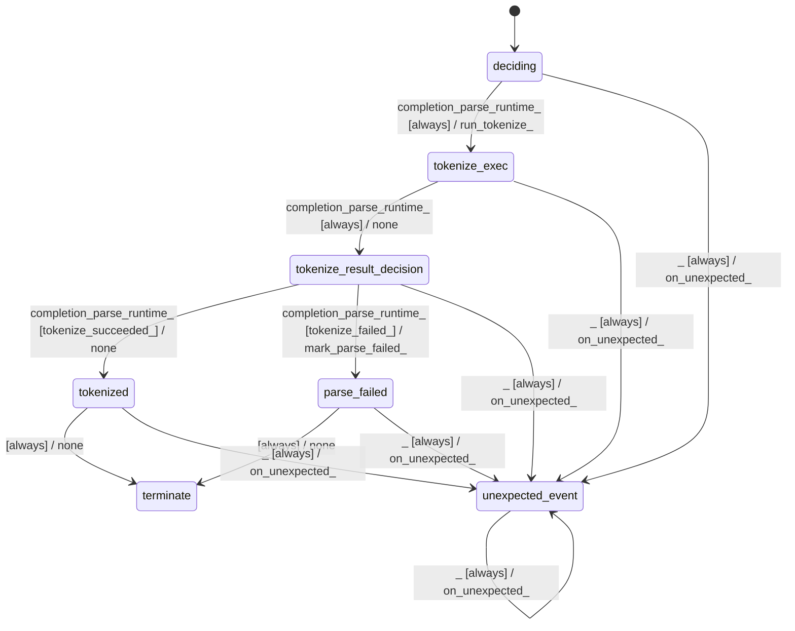

# text_jinja_parser_lexer

Source: [`emel/text/jinja/parser/lexer/sm.hpp`](https://github.com/stateforward/emel.cpp/blob/main/src/emel/text/jinja/parser/lexer/sm.hpp)

## Mermaid

## Transitions

| Source | Event | Guard | Action | Target |
| --- | --- | --- | --- | --- |
| [`deciding`](https://github.com/stateforward/emel.cpp/blob/main/src/emel/text/jinja/parser/lexer/sm.hpp) | [`completion<parse_runtime>`](https://github.com/stateforward/emel.cpp/blob/main/src/emel/text/jinja/parser/lexer/sm.hpp) | [`always`](https://github.com/stateforward/emel.cpp/blob/main/src/emel/text/jinja/parser/lexer/sm.hpp) | [`run_tokenize>`](https://github.com/stateforward/emel.cpp/blob/main/src/emel/text/jinja/parser/lexer/sm.hpp) | [`tokenize_exec`](https://github.com/stateforward/emel.cpp/blob/main/src/emel/text/jinja/parser/lexer/sm.hpp) |
| [`tokenize_exec`](https://github.com/stateforward/emel.cpp/blob/main/src/emel/text/jinja/parser/lexer/sm.hpp) | [`completion<parse_runtime>`](https://github.com/stateforward/emel.cpp/blob/main/src/emel/text/jinja/parser/lexer/sm.hpp) | [`always`](https://github.com/stateforward/emel.cpp/blob/main/src/emel/text/jinja/parser/lexer/sm.hpp) | [`none`](https://github.com/stateforward/emel.cpp/blob/main/src/emel/text/jinja/parser/lexer/sm.hpp) | [`tokenize_result_decision`](https://github.com/stateforward/emel.cpp/blob/main/src/emel/text/jinja/parser/lexer/sm.hpp) |
| [`tokenize_result_decision`](https://github.com/stateforward/emel.cpp/blob/main/src/emel/text/jinja/parser/lexer/sm.hpp) | [`completion<parse_runtime>`](https://github.com/stateforward/emel.cpp/blob/main/src/emel/text/jinja/parser/lexer/sm.hpp) | [`tokenize_succeeded>`](https://github.com/stateforward/emel.cpp/blob/main/src/emel/text/jinja/parser/lexer/sm.hpp) | [`none`](https://github.com/stateforward/emel.cpp/blob/main/src/emel/text/jinja/parser/lexer/sm.hpp) | [`tokenized`](https://github.com/stateforward/emel.cpp/blob/main/src/emel/text/jinja/parser/lexer/sm.hpp) |
| [`tokenize_result_decision`](https://github.com/stateforward/emel.cpp/blob/main/src/emel/text/jinja/parser/lexer/sm.hpp) | [`completion<parse_runtime>`](https://github.com/stateforward/emel.cpp/blob/main/src/emel/text/jinja/parser/lexer/sm.hpp) | [`tokenize_failed>`](https://github.com/stateforward/emel.cpp/blob/main/src/emel/text/jinja/parser/lexer/sm.hpp) | [`mark_parse_failed>`](https://github.com/stateforward/emel.cpp/blob/main/src/emel/text/jinja/parser/lexer/sm.hpp) | [`parse_failed`](https://github.com/stateforward/emel.cpp/blob/main/src/emel/text/jinja/parser/lexer/sm.hpp) |
| [`tokenized`](https://github.com/stateforward/emel.cpp/blob/main/src/emel/text/jinja/parser/lexer/sm.hpp) | - | [`always`](https://github.com/stateforward/emel.cpp/blob/main/src/emel/text/jinja/parser/lexer/sm.hpp) | [`none`](https://github.com/stateforward/emel.cpp/blob/main/src/emel/text/jinja/parser/lexer/sm.hpp) | [`terminate`](https://github.com/stateforward/emel.cpp/blob/main/src/emel/text/jinja/parser/lexer/sm.hpp) |
| [`parse_failed`](https://github.com/stateforward/emel.cpp/blob/main/src/emel/text/jinja/parser/lexer/sm.hpp) | - | [`always`](https://github.com/stateforward/emel.cpp/blob/main/src/emel/text/jinja/parser/lexer/sm.hpp) | [`none`](https://github.com/stateforward/emel.cpp/blob/main/src/emel/text/jinja/parser/lexer/sm.hpp) | [`terminate`](https://github.com/stateforward/emel.cpp/blob/main/src/emel/text/jinja/parser/lexer/sm.hpp) |
| [`deciding`](https://github.com/stateforward/emel.cpp/blob/main/src/emel/text/jinja/parser/lexer/sm.hpp) | [`_`](https://github.com/stateforward/emel.cpp/blob/main/src/emel/text/jinja/parser/lexer/sm.hpp) | [`always`](https://github.com/stateforward/emel.cpp/blob/main/src/emel/text/jinja/parser/lexer/sm.hpp) | [`on_unexpected>`](https://github.com/stateforward/emel.cpp/blob/main/src/emel/text/jinja/parser/lexer/sm.hpp) | [`unexpected_event`](https://github.com/stateforward/emel.cpp/blob/main/src/emel/text/jinja/parser/lexer/sm.hpp) |
| [`tokenize_exec`](https://github.com/stateforward/emel.cpp/blob/main/src/emel/text/jinja/parser/lexer/sm.hpp) | [`_`](https://github.com/stateforward/emel.cpp/blob/main/src/emel/text/jinja/parser/lexer/sm.hpp) | [`always`](https://github.com/stateforward/emel.cpp/blob/main/src/emel/text/jinja/parser/lexer/sm.hpp) | [`on_unexpected>`](https://github.com/stateforward/emel.cpp/blob/main/src/emel/text/jinja/parser/lexer/sm.hpp) | [`unexpected_event`](https://github.com/stateforward/emel.cpp/blob/main/src/emel/text/jinja/parser/lexer/sm.hpp) |
| [`tokenize_result_decision`](https://github.com/stateforward/emel.cpp/blob/main/src/emel/text/jinja/parser/lexer/sm.hpp) | [`_`](https://github.com/stateforward/emel.cpp/blob/main/src/emel/text/jinja/parser/lexer/sm.hpp) | [`always`](https://github.com/stateforward/emel.cpp/blob/main/src/emel/text/jinja/parser/lexer/sm.hpp) | [`on_unexpected>`](https://github.com/stateforward/emel.cpp/blob/main/src/emel/text/jinja/parser/lexer/sm.hpp) | [`unexpected_event`](https://github.com/stateforward/emel.cpp/blob/main/src/emel/text/jinja/parser/lexer/sm.hpp) |
| [`tokenized`](https://github.com/stateforward/emel.cpp/blob/main/src/emel/text/jinja/parser/lexer/sm.hpp) | [`_`](https://github.com/stateforward/emel.cpp/blob/main/src/emel/text/jinja/parser/lexer/sm.hpp) | [`always`](https://github.com/stateforward/emel.cpp/blob/main/src/emel/text/jinja/parser/lexer/sm.hpp) | [`on_unexpected>`](https://github.com/stateforward/emel.cpp/blob/main/src/emel/text/jinja/parser/lexer/sm.hpp) | [`unexpected_event`](https://github.com/stateforward/emel.cpp/blob/main/src/emel/text/jinja/parser/lexer/sm.hpp) |
| [`parse_failed`](https://github.com/stateforward/emel.cpp/blob/main/src/emel/text/jinja/parser/lexer/sm.hpp) | [`_`](https://github.com/stateforward/emel.cpp/blob/main/src/emel/text/jinja/parser/lexer/sm.hpp) | [`always`](https://github.com/stateforward/emel.cpp/blob/main/src/emel/text/jinja/parser/lexer/sm.hpp) | [`on_unexpected>`](https://github.com/stateforward/emel.cpp/blob/main/src/emel/text/jinja/parser/lexer/sm.hpp) | [`unexpected_event`](https://github.com/stateforward/emel.cpp/blob/main/src/emel/text/jinja/parser/lexer/sm.hpp) |
| [`unexpected_event`](https://github.com/stateforward/emel.cpp/blob/main/src/emel/text/jinja/parser/lexer/sm.hpp) | [`_`](https://github.com/stateforward/emel.cpp/blob/main/src/emel/text/jinja/parser/lexer/sm.hpp) | [`always`](https://github.com/stateforward/emel.cpp/blob/main/src/emel/text/jinja/parser/lexer/sm.hpp) | [`on_unexpected>`](https://github.com/stateforward/emel.cpp/blob/main/src/emel/text/jinja/parser/lexer/sm.hpp) | [`unexpected_event`](https://github.com/stateforward/emel.cpp/blob/main/src/emel/text/jinja/parser/lexer/sm.hpp) |
