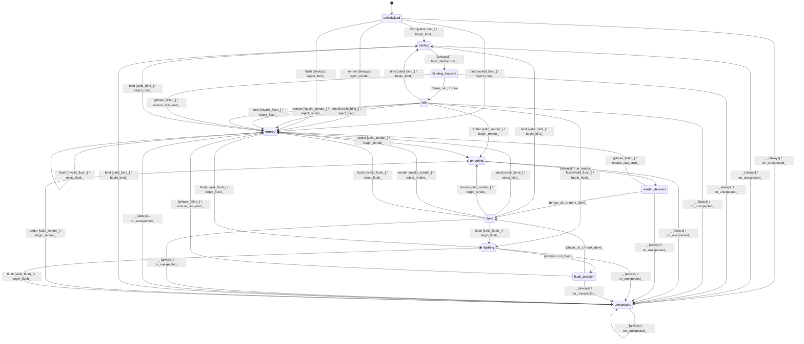

# text_renderer

Source: [`emel/text/renderer/sm.hpp`](https://github.com/stateforward/emel.cpp/blob/main/src/emel/text/renderer/sm.hpp)

## Mermaid

## Transitions

| Source | Event | Guard | Action | Target |
| --- | --- | --- | --- | --- |
| [`uninitialized`](https://github.com/stateforward/emel.cpp/blob/main/src/emel/text/renderer/sm.hpp) | [`bind`](https://github.com/stateforward/emel.cpp/blob/main/src/emel/text/renderer/sm.hpp) | [`valid_bind>`](https://github.com/stateforward/emel.cpp/blob/main/src/emel/text/renderer/sm.hpp) | [`begin_bind>`](https://github.com/stateforward/emel.cpp/blob/main/src/emel/text/renderer/sm.hpp) | [`binding`](https://github.com/stateforward/emel.cpp/blob/main/src/emel/text/renderer/sm.hpp) |
| [`uninitialized`](https://github.com/stateforward/emel.cpp/blob/main/src/emel/text/renderer/sm.hpp) | [`bind`](https://github.com/stateforward/emel.cpp/blob/main/src/emel/text/renderer/sm.hpp) | [`invalid_bind>`](https://github.com/stateforward/emel.cpp/blob/main/src/emel/text/renderer/sm.hpp) | [`reject_bind>`](https://github.com/stateforward/emel.cpp/blob/main/src/emel/text/renderer/sm.hpp) | [`errored`](https://github.com/stateforward/emel.cpp/blob/main/src/emel/text/renderer/sm.hpp) |
| [`uninitialized`](https://github.com/stateforward/emel.cpp/blob/main/src/emel/text/renderer/sm.hpp) | [`render`](https://github.com/stateforward/emel.cpp/blob/main/src/emel/text/renderer/sm.hpp) | [`always`](https://github.com/stateforward/emel.cpp/blob/main/src/emel/text/renderer/sm.hpp) | [`reject_render>`](https://github.com/stateforward/emel.cpp/blob/main/src/emel/text/renderer/sm.hpp) | [`errored`](https://github.com/stateforward/emel.cpp/blob/main/src/emel/text/renderer/sm.hpp) |
| [`uninitialized`](https://github.com/stateforward/emel.cpp/blob/main/src/emel/text/renderer/sm.hpp) | [`flush`](https://github.com/stateforward/emel.cpp/blob/main/src/emel/text/renderer/sm.hpp) | [`always`](https://github.com/stateforward/emel.cpp/blob/main/src/emel/text/renderer/sm.hpp) | [`reject_flush>`](https://github.com/stateforward/emel.cpp/blob/main/src/emel/text/renderer/sm.hpp) | [`errored`](https://github.com/stateforward/emel.cpp/blob/main/src/emel/text/renderer/sm.hpp) |
| [`idle`](https://github.com/stateforward/emel.cpp/blob/main/src/emel/text/renderer/sm.hpp) | [`bind`](https://github.com/stateforward/emel.cpp/blob/main/src/emel/text/renderer/sm.hpp) | [`valid_bind>`](https://github.com/stateforward/emel.cpp/blob/main/src/emel/text/renderer/sm.hpp) | [`begin_bind>`](https://github.com/stateforward/emel.cpp/blob/main/src/emel/text/renderer/sm.hpp) | [`binding`](https://github.com/stateforward/emel.cpp/blob/main/src/emel/text/renderer/sm.hpp) |
| [`idle`](https://github.com/stateforward/emel.cpp/blob/main/src/emel/text/renderer/sm.hpp) | [`bind`](https://github.com/stateforward/emel.cpp/blob/main/src/emel/text/renderer/sm.hpp) | [`invalid_bind>`](https://github.com/stateforward/emel.cpp/blob/main/src/emel/text/renderer/sm.hpp) | [`reject_bind>`](https://github.com/stateforward/emel.cpp/blob/main/src/emel/text/renderer/sm.hpp) | [`errored`](https://github.com/stateforward/emel.cpp/blob/main/src/emel/text/renderer/sm.hpp) |
| [`idle`](https://github.com/stateforward/emel.cpp/blob/main/src/emel/text/renderer/sm.hpp) | [`render`](https://github.com/stateforward/emel.cpp/blob/main/src/emel/text/renderer/sm.hpp) | [`valid_render>`](https://github.com/stateforward/emel.cpp/blob/main/src/emel/text/renderer/sm.hpp) | [`begin_render>`](https://github.com/stateforward/emel.cpp/blob/main/src/emel/text/renderer/sm.hpp) | [`rendering`](https://github.com/stateforward/emel.cpp/blob/main/src/emel/text/renderer/sm.hpp) |
| [`idle`](https://github.com/stateforward/emel.cpp/blob/main/src/emel/text/renderer/sm.hpp) | [`render`](https://github.com/stateforward/emel.cpp/blob/main/src/emel/text/renderer/sm.hpp) | [`invalid_render>`](https://github.com/stateforward/emel.cpp/blob/main/src/emel/text/renderer/sm.hpp) | [`reject_render>`](https://github.com/stateforward/emel.cpp/blob/main/src/emel/text/renderer/sm.hpp) | [`errored`](https://github.com/stateforward/emel.cpp/blob/main/src/emel/text/renderer/sm.hpp) |
| [`idle`](https://github.com/stateforward/emel.cpp/blob/main/src/emel/text/renderer/sm.hpp) | [`flush`](https://github.com/stateforward/emel.cpp/blob/main/src/emel/text/renderer/sm.hpp) | [`valid_flush>`](https://github.com/stateforward/emel.cpp/blob/main/src/emel/text/renderer/sm.hpp) | [`begin_flush>`](https://github.com/stateforward/emel.cpp/blob/main/src/emel/text/renderer/sm.hpp) | [`flushing`](https://github.com/stateforward/emel.cpp/blob/main/src/emel/text/renderer/sm.hpp) |
| [`idle`](https://github.com/stateforward/emel.cpp/blob/main/src/emel/text/renderer/sm.hpp) | [`flush`](https://github.com/stateforward/emel.cpp/blob/main/src/emel/text/renderer/sm.hpp) | [`invalid_flush>`](https://github.com/stateforward/emel.cpp/blob/main/src/emel/text/renderer/sm.hpp) | [`reject_flush>`](https://github.com/stateforward/emel.cpp/blob/main/src/emel/text/renderer/sm.hpp) | [`errored`](https://github.com/stateforward/emel.cpp/blob/main/src/emel/text/renderer/sm.hpp) |
| [`done`](https://github.com/stateforward/emel.cpp/blob/main/src/emel/text/renderer/sm.hpp) | [`bind`](https://github.com/stateforward/emel.cpp/blob/main/src/emel/text/renderer/sm.hpp) | [`valid_bind>`](https://github.com/stateforward/emel.cpp/blob/main/src/emel/text/renderer/sm.hpp) | [`begin_bind>`](https://github.com/stateforward/emel.cpp/blob/main/src/emel/text/renderer/sm.hpp) | [`binding`](https://github.com/stateforward/emel.cpp/blob/main/src/emel/text/renderer/sm.hpp) |
| [`done`](https://github.com/stateforward/emel.cpp/blob/main/src/emel/text/renderer/sm.hpp) | [`bind`](https://github.com/stateforward/emel.cpp/blob/main/src/emel/text/renderer/sm.hpp) | [`invalid_bind>`](https://github.com/stateforward/emel.cpp/blob/main/src/emel/text/renderer/sm.hpp) | [`reject_bind>`](https://github.com/stateforward/emel.cpp/blob/main/src/emel/text/renderer/sm.hpp) | [`errored`](https://github.com/stateforward/emel.cpp/blob/main/src/emel/text/renderer/sm.hpp) |
| [`done`](https://github.com/stateforward/emel.cpp/blob/main/src/emel/text/renderer/sm.hpp) | [`render`](https://github.com/stateforward/emel.cpp/blob/main/src/emel/text/renderer/sm.hpp) | [`valid_render>`](https://github.com/stateforward/emel.cpp/blob/main/src/emel/text/renderer/sm.hpp) | [`begin_render>`](https://github.com/stateforward/emel.cpp/blob/main/src/emel/text/renderer/sm.hpp) | [`rendering`](https://github.com/stateforward/emel.cpp/blob/main/src/emel/text/renderer/sm.hpp) |
| [`done`](https://github.com/stateforward/emel.cpp/blob/main/src/emel/text/renderer/sm.hpp) | [`render`](https://github.com/stateforward/emel.cpp/blob/main/src/emel/text/renderer/sm.hpp) | [`invalid_render>`](https://github.com/stateforward/emel.cpp/blob/main/src/emel/text/renderer/sm.hpp) | [`reject_render>`](https://github.com/stateforward/emel.cpp/blob/main/src/emel/text/renderer/sm.hpp) | [`errored`](https://github.com/stateforward/emel.cpp/blob/main/src/emel/text/renderer/sm.hpp) |
| [`done`](https://github.com/stateforward/emel.cpp/blob/main/src/emel/text/renderer/sm.hpp) | [`flush`](https://github.com/stateforward/emel.cpp/blob/main/src/emel/text/renderer/sm.hpp) | [`valid_flush>`](https://github.com/stateforward/emel.cpp/blob/main/src/emel/text/renderer/sm.hpp) | [`begin_flush>`](https://github.com/stateforward/emel.cpp/blob/main/src/emel/text/renderer/sm.hpp) | [`flushing`](https://github.com/stateforward/emel.cpp/blob/main/src/emel/text/renderer/sm.hpp) |
| [`done`](https://github.com/stateforward/emel.cpp/blob/main/src/emel/text/renderer/sm.hpp) | [`flush`](https://github.com/stateforward/emel.cpp/blob/main/src/emel/text/renderer/sm.hpp) | [`invalid_flush>`](https://github.com/stateforward/emel.cpp/blob/main/src/emel/text/renderer/sm.hpp) | [`reject_flush>`](https://github.com/stateforward/emel.cpp/blob/main/src/emel/text/renderer/sm.hpp) | [`errored`](https://github.com/stateforward/emel.cpp/blob/main/src/emel/text/renderer/sm.hpp) |
| [`errored`](https://github.com/stateforward/emel.cpp/blob/main/src/emel/text/renderer/sm.hpp) | [`bind`](https://github.com/stateforward/emel.cpp/blob/main/src/emel/text/renderer/sm.hpp) | [`valid_bind>`](https://github.com/stateforward/emel.cpp/blob/main/src/emel/text/renderer/sm.hpp) | [`begin_bind>`](https://github.com/stateforward/emel.cpp/blob/main/src/emel/text/renderer/sm.hpp) | [`binding`](https://github.com/stateforward/emel.cpp/blob/main/src/emel/text/renderer/sm.hpp) |
| [`errored`](https://github.com/stateforward/emel.cpp/blob/main/src/emel/text/renderer/sm.hpp) | [`bind`](https://github.com/stateforward/emel.cpp/blob/main/src/emel/text/renderer/sm.hpp) | [`invalid_bind>`](https://github.com/stateforward/emel.cpp/blob/main/src/emel/text/renderer/sm.hpp) | [`reject_bind>`](https://github.com/stateforward/emel.cpp/blob/main/src/emel/text/renderer/sm.hpp) | [`errored`](https://github.com/stateforward/emel.cpp/blob/main/src/emel/text/renderer/sm.hpp) |
| [`errored`](https://github.com/stateforward/emel.cpp/blob/main/src/emel/text/renderer/sm.hpp) | [`render`](https://github.com/stateforward/emel.cpp/blob/main/src/emel/text/renderer/sm.hpp) | [`valid_render>`](https://github.com/stateforward/emel.cpp/blob/main/src/emel/text/renderer/sm.hpp) | [`begin_render>`](https://github.com/stateforward/emel.cpp/blob/main/src/emel/text/renderer/sm.hpp) | [`rendering`](https://github.com/stateforward/emel.cpp/blob/main/src/emel/text/renderer/sm.hpp) |
| [`errored`](https://github.com/stateforward/emel.cpp/blob/main/src/emel/text/renderer/sm.hpp) | [`render`](https://github.com/stateforward/emel.cpp/blob/main/src/emel/text/renderer/sm.hpp) | [`invalid_render>`](https://github.com/stateforward/emel.cpp/blob/main/src/emel/text/renderer/sm.hpp) | [`reject_render>`](https://github.com/stateforward/emel.cpp/blob/main/src/emel/text/renderer/sm.hpp) | [`errored`](https://github.com/stateforward/emel.cpp/blob/main/src/emel/text/renderer/sm.hpp) |
| [`errored`](https://github.com/stateforward/emel.cpp/blob/main/src/emel/text/renderer/sm.hpp) | [`flush`](https://github.com/stateforward/emel.cpp/blob/main/src/emel/text/renderer/sm.hpp) | [`valid_flush>`](https://github.com/stateforward/emel.cpp/blob/main/src/emel/text/renderer/sm.hpp) | [`begin_flush>`](https://github.com/stateforward/emel.cpp/blob/main/src/emel/text/renderer/sm.hpp) | [`flushing`](https://github.com/stateforward/emel.cpp/blob/main/src/emel/text/renderer/sm.hpp) |
| [`errored`](https://github.com/stateforward/emel.cpp/blob/main/src/emel/text/renderer/sm.hpp) | [`flush`](https://github.com/stateforward/emel.cpp/blob/main/src/emel/text/renderer/sm.hpp) | [`invalid_flush>`](https://github.com/stateforward/emel.cpp/blob/main/src/emel/text/renderer/sm.hpp) | [`reject_flush>`](https://github.com/stateforward/emel.cpp/blob/main/src/emel/text/renderer/sm.hpp) | [`errored`](https://github.com/stateforward/emel.cpp/blob/main/src/emel/text/renderer/sm.hpp) |
| [`unexpected`](https://github.com/stateforward/emel.cpp/blob/main/src/emel/text/renderer/sm.hpp) | [`bind`](https://github.com/stateforward/emel.cpp/blob/main/src/emel/text/renderer/sm.hpp) | [`valid_bind>`](https://github.com/stateforward/emel.cpp/blob/main/src/emel/text/renderer/sm.hpp) | [`begin_bind>`](https://github.com/stateforward/emel.cpp/blob/main/src/emel/text/renderer/sm.hpp) | [`binding`](https://github.com/stateforward/emel.cpp/blob/main/src/emel/text/renderer/sm.hpp) |
| [`unexpected`](https://github.com/stateforward/emel.cpp/blob/main/src/emel/text/renderer/sm.hpp) | [`bind`](https://github.com/stateforward/emel.cpp/blob/main/src/emel/text/renderer/sm.hpp) | [`invalid_bind>`](https://github.com/stateforward/emel.cpp/blob/main/src/emel/text/renderer/sm.hpp) | [`reject_bind>`](https://github.com/stateforward/emel.cpp/blob/main/src/emel/text/renderer/sm.hpp) | [`unexpected`](https://github.com/stateforward/emel.cpp/blob/main/src/emel/text/renderer/sm.hpp) |
| [`unexpected`](https://github.com/stateforward/emel.cpp/blob/main/src/emel/text/renderer/sm.hpp) | [`render`](https://github.com/stateforward/emel.cpp/blob/main/src/emel/text/renderer/sm.hpp) | [`valid_render>`](https://github.com/stateforward/emel.cpp/blob/main/src/emel/text/renderer/sm.hpp) | [`begin_render>`](https://github.com/stateforward/emel.cpp/blob/main/src/emel/text/renderer/sm.hpp) | [`rendering`](https://github.com/stateforward/emel.cpp/blob/main/src/emel/text/renderer/sm.hpp) |
| [`unexpected`](https://github.com/stateforward/emel.cpp/blob/main/src/emel/text/renderer/sm.hpp) | [`render`](https://github.com/stateforward/emel.cpp/blob/main/src/emel/text/renderer/sm.hpp) | [`invalid_render>`](https://github.com/stateforward/emel.cpp/blob/main/src/emel/text/renderer/sm.hpp) | [`reject_render>`](https://github.com/stateforward/emel.cpp/blob/main/src/emel/text/renderer/sm.hpp) | [`unexpected`](https://github.com/stateforward/emel.cpp/blob/main/src/emel/text/renderer/sm.hpp) |
| [`unexpected`](https://github.com/stateforward/emel.cpp/blob/main/src/emel/text/renderer/sm.hpp) | [`flush`](https://github.com/stateforward/emel.cpp/blob/main/src/emel/text/renderer/sm.hpp) | [`valid_flush>`](https://github.com/stateforward/emel.cpp/blob/main/src/emel/text/renderer/sm.hpp) | [`begin_flush>`](https://github.com/stateforward/emel.cpp/blob/main/src/emel/text/renderer/sm.hpp) | [`flushing`](https://github.com/stateforward/emel.cpp/blob/main/src/emel/text/renderer/sm.hpp) |
| [`unexpected`](https://github.com/stateforward/emel.cpp/blob/main/src/emel/text/renderer/sm.hpp) | [`flush`](https://github.com/stateforward/emel.cpp/blob/main/src/emel/text/renderer/sm.hpp) | [`invalid_flush>`](https://github.com/stateforward/emel.cpp/blob/main/src/emel/text/renderer/sm.hpp) | [`reject_flush>`](https://github.com/stateforward/emel.cpp/blob/main/src/emel/text/renderer/sm.hpp) | [`unexpected`](https://github.com/stateforward/emel.cpp/blob/main/src/emel/text/renderer/sm.hpp) |
| [`binding`](https://github.com/stateforward/emel.cpp/blob/main/src/emel/text/renderer/sm.hpp) | - | [`always`](https://github.com/stateforward/emel.cpp/blob/main/src/emel/text/renderer/sm.hpp) | [`bind_detokenizer>`](https://github.com/stateforward/emel.cpp/blob/main/src/emel/text/renderer/sm.hpp) | [`binding_decision`](https://github.com/stateforward/emel.cpp/blob/main/src/emel/text/renderer/sm.hpp) |
| [`binding_decision`](https://github.com/stateforward/emel.cpp/blob/main/src/emel/text/renderer/sm.hpp) | - | [`phase_ok>`](https://github.com/stateforward/emel.cpp/blob/main/src/emel/text/renderer/sm.hpp) | [`none`](https://github.com/stateforward/emel.cpp/blob/main/src/emel/text/renderer/sm.hpp) | [`idle`](https://github.com/stateforward/emel.cpp/blob/main/src/emel/text/renderer/sm.hpp) |
| [`binding_decision`](https://github.com/stateforward/emel.cpp/blob/main/src/emel/text/renderer/sm.hpp) | - | [`phase_failed>`](https://github.com/stateforward/emel.cpp/blob/main/src/emel/text/renderer/sm.hpp) | [`ensure_last_error>`](https://github.com/stateforward/emel.cpp/blob/main/src/emel/text/renderer/sm.hpp) | [`errored`](https://github.com/stateforward/emel.cpp/blob/main/src/emel/text/renderer/sm.hpp) |
| [`rendering`](https://github.com/stateforward/emel.cpp/blob/main/src/emel/text/renderer/sm.hpp) | - | [`always`](https://github.com/stateforward/emel.cpp/blob/main/src/emel/text/renderer/sm.hpp) | [`run_render>`](https://github.com/stateforward/emel.cpp/blob/main/src/emel/text/renderer/sm.hpp) | [`render_decision`](https://github.com/stateforward/emel.cpp/blob/main/src/emel/text/renderer/sm.hpp) |
| [`render_decision`](https://github.com/stateforward/emel.cpp/blob/main/src/emel/text/renderer/sm.hpp) | - | [`phase_ok>`](https://github.com/stateforward/emel.cpp/blob/main/src/emel/text/renderer/sm.hpp) | [`mark_done>`](https://github.com/stateforward/emel.cpp/blob/main/src/emel/text/renderer/sm.hpp) | [`done`](https://github.com/stateforward/emel.cpp/blob/main/src/emel/text/renderer/sm.hpp) |
| [`render_decision`](https://github.com/stateforward/emel.cpp/blob/main/src/emel/text/renderer/sm.hpp) | - | [`phase_failed>`](https://github.com/stateforward/emel.cpp/blob/main/src/emel/text/renderer/sm.hpp) | [`ensure_last_error>`](https://github.com/stateforward/emel.cpp/blob/main/src/emel/text/renderer/sm.hpp) | [`errored`](https://github.com/stateforward/emel.cpp/blob/main/src/emel/text/renderer/sm.hpp) |
| [`flushing`](https://github.com/stateforward/emel.cpp/blob/main/src/emel/text/renderer/sm.hpp) | - | [`always`](https://github.com/stateforward/emel.cpp/blob/main/src/emel/text/renderer/sm.hpp) | [`run_flush>`](https://github.com/stateforward/emel.cpp/blob/main/src/emel/text/renderer/sm.hpp) | [`flush_decision`](https://github.com/stateforward/emel.cpp/blob/main/src/emel/text/renderer/sm.hpp) |
| [`flush_decision`](https://github.com/stateforward/emel.cpp/blob/main/src/emel/text/renderer/sm.hpp) | - | [`phase_ok>`](https://github.com/stateforward/emel.cpp/blob/main/src/emel/text/renderer/sm.hpp) | [`mark_done>`](https://github.com/stateforward/emel.cpp/blob/main/src/emel/text/renderer/sm.hpp) | [`done`](https://github.com/stateforward/emel.cpp/blob/main/src/emel/text/renderer/sm.hpp) |
| [`flush_decision`](https://github.com/stateforward/emel.cpp/blob/main/src/emel/text/renderer/sm.hpp) | - | [`phase_failed>`](https://github.com/stateforward/emel.cpp/blob/main/src/emel/text/renderer/sm.hpp) | [`ensure_last_error>`](https://github.com/stateforward/emel.cpp/blob/main/src/emel/text/renderer/sm.hpp) | [`errored`](https://github.com/stateforward/emel.cpp/blob/main/src/emel/text/renderer/sm.hpp) |
| [`uninitialized`](https://github.com/stateforward/emel.cpp/blob/main/src/emel/text/renderer/sm.hpp) | [`_`](https://github.com/stateforward/emel.cpp/blob/main/src/emel/text/renderer/sm.hpp) | [`always`](https://github.com/stateforward/emel.cpp/blob/main/src/emel/text/renderer/sm.hpp) | [`on_unexpected>`](https://github.com/stateforward/emel.cpp/blob/main/src/emel/text/renderer/sm.hpp) | [`unexpected`](https://github.com/stateforward/emel.cpp/blob/main/src/emel/text/renderer/sm.hpp) |
| [`binding`](https://github.com/stateforward/emel.cpp/blob/main/src/emel/text/renderer/sm.hpp) | [`_`](https://github.com/stateforward/emel.cpp/blob/main/src/emel/text/renderer/sm.hpp) | [`always`](https://github.com/stateforward/emel.cpp/blob/main/src/emel/text/renderer/sm.hpp) | [`on_unexpected>`](https://github.com/stateforward/emel.cpp/blob/main/src/emel/text/renderer/sm.hpp) | [`unexpected`](https://github.com/stateforward/emel.cpp/blob/main/src/emel/text/renderer/sm.hpp) |
| [`binding_decision`](https://github.com/stateforward/emel.cpp/blob/main/src/emel/text/renderer/sm.hpp) | [`_`](https://github.com/stateforward/emel.cpp/blob/main/src/emel/text/renderer/sm.hpp) | [`always`](https://github.com/stateforward/emel.cpp/blob/main/src/emel/text/renderer/sm.hpp) | [`on_unexpected>`](https://github.com/stateforward/emel.cpp/blob/main/src/emel/text/renderer/sm.hpp) | [`unexpected`](https://github.com/stateforward/emel.cpp/blob/main/src/emel/text/renderer/sm.hpp) |
| [`idle`](https://github.com/stateforward/emel.cpp/blob/main/src/emel/text/renderer/sm.hpp) | [`_`](https://github.com/stateforward/emel.cpp/blob/main/src/emel/text/renderer/sm.hpp) | [`always`](https://github.com/stateforward/emel.cpp/blob/main/src/emel/text/renderer/sm.hpp) | [`on_unexpected>`](https://github.com/stateforward/emel.cpp/blob/main/src/emel/text/renderer/sm.hpp) | [`unexpected`](https://github.com/stateforward/emel.cpp/blob/main/src/emel/text/renderer/sm.hpp) |
| [`rendering`](https://github.com/stateforward/emel.cpp/blob/main/src/emel/text/renderer/sm.hpp) | [`_`](https://github.com/stateforward/emel.cpp/blob/main/src/emel/text/renderer/sm.hpp) | [`always`](https://github.com/stateforward/emel.cpp/blob/main/src/emel/text/renderer/sm.hpp) | [`on_unexpected>`](https://github.com/stateforward/emel.cpp/blob/main/src/emel/text/renderer/sm.hpp) | [`unexpected`](https://github.com/stateforward/emel.cpp/blob/main/src/emel/text/renderer/sm.hpp) |
| [`render_decision`](https://github.com/stateforward/emel.cpp/blob/main/src/emel/text/renderer/sm.hpp) | [`_`](https://github.com/stateforward/emel.cpp/blob/main/src/emel/text/renderer/sm.hpp) | [`always`](https://github.com/stateforward/emel.cpp/blob/main/src/emel/text/renderer/sm.hpp) | [`on_unexpected>`](https://github.com/stateforward/emel.cpp/blob/main/src/emel/text/renderer/sm.hpp) | [`unexpected`](https://github.com/stateforward/emel.cpp/blob/main/src/emel/text/renderer/sm.hpp) |
| [`flushing`](https://github.com/stateforward/emel.cpp/blob/main/src/emel/text/renderer/sm.hpp) | [`_`](https://github.com/stateforward/emel.cpp/blob/main/src/emel/text/renderer/sm.hpp) | [`always`](https://github.com/stateforward/emel.cpp/blob/main/src/emel/text/renderer/sm.hpp) | [`on_unexpected>`](https://github.com/stateforward/emel.cpp/blob/main/src/emel/text/renderer/sm.hpp) | [`unexpected`](https://github.com/stateforward/emel.cpp/blob/main/src/emel/text/renderer/sm.hpp) |
| [`flush_decision`](https://github.com/stateforward/emel.cpp/blob/main/src/emel/text/renderer/sm.hpp) | [`_`](https://github.com/stateforward/emel.cpp/blob/main/src/emel/text/renderer/sm.hpp) | [`always`](https://github.com/stateforward/emel.cpp/blob/main/src/emel/text/renderer/sm.hpp) | [`on_unexpected>`](https://github.com/stateforward/emel.cpp/blob/main/src/emel/text/renderer/sm.hpp) | [`unexpected`](https://github.com/stateforward/emel.cpp/blob/main/src/emel/text/renderer/sm.hpp) |
| [`done`](https://github.com/stateforward/emel.cpp/blob/main/src/emel/text/renderer/sm.hpp) | [`_`](https://github.com/stateforward/emel.cpp/blob/main/src/emel/text/renderer/sm.hpp) | [`always`](https://github.com/stateforward/emel.cpp/blob/main/src/emel/text/renderer/sm.hpp) | [`on_unexpected>`](https://github.com/stateforward/emel.cpp/blob/main/src/emel/text/renderer/sm.hpp) | [`unexpected`](https://github.com/stateforward/emel.cpp/blob/main/src/emel/text/renderer/sm.hpp) |
| [`errored`](https://github.com/stateforward/emel.cpp/blob/main/src/emel/text/renderer/sm.hpp) | [`_`](https://github.com/stateforward/emel.cpp/blob/main/src/emel/text/renderer/sm.hpp) | [`always`](https://github.com/stateforward/emel.cpp/blob/main/src/emel/text/renderer/sm.hpp) | [`on_unexpected>`](https://github.com/stateforward/emel.cpp/blob/main/src/emel/text/renderer/sm.hpp) | [`unexpected`](https://github.com/stateforward/emel.cpp/blob/main/src/emel/text/renderer/sm.hpp) |
| [`unexpected`](https://github.com/stateforward/emel.cpp/blob/main/src/emel/text/renderer/sm.hpp) | [`_`](https://github.com/stateforward/emel.cpp/blob/main/src/emel/text/renderer/sm.hpp) | [`always`](https://github.com/stateforward/emel.cpp/blob/main/src/emel/text/renderer/sm.hpp) | [`on_unexpected>`](https://github.com/stateforward/emel.cpp/blob/main/src/emel/text/renderer/sm.hpp) | [`unexpected`](https://github.com/stateforward/emel.cpp/blob/main/src/emel/text/renderer/sm.hpp) |
