# tokenizer

Source: [`emel/tokenizer/sm.hpp`](https://github.com/stateforward/emel.cpp/blob/main/src/emel/tokenizer/sm.hpp)

## Mermaid

```mermaid
stateDiagram-v2
  [*] --> initialized
  initialized --> partitioning_special : emel__tokenizer__event__tokenize [boost__sml__aux__zero_wrapper_emel__tokenizer__guard___lambda_at__Users_gabrielwillen_VSCode_stateforward_emel_emel_cpp_src_emel_tokenizer_guards_hpp_5_31__] / boost__sml__aux__zero_wrapper_emel__tokenizer__action___lambda_at__Users_gabrielwillen_VSCode_stateforward_emel_emel_cpp_src_emel_tokenizer_actions_hpp_5_40__
  partitioning_special --> selecting_backend : emel__tokenizer__event__partitioning_special_done [boost__sml__front__always] / boost__sml__aux__zero_wrapper_emel__tokenizer__action___lambda_at__Users_gabrielwillen_VSCode_stateforward_emel_emel_cpp_src_emel_tokenizer_actions_hpp_6_47__
  partitioning_special --> errored : emel__tokenizer__event__partitioning_special_error [boost__sml__front__always] / boost__sml__aux__zero_wrapper_emel__tokenizer__action___lambda_at__Users_gabrielwillen_VSCode_stateforward_emel_emel_cpp_src_emel_tokenizer_actions_hpp_7_48__
  selecting_backend --> applying_special_prefix : emel__tokenizer__event__selecting_backend_done [boost__sml__front__always] / boost__sml__aux__zero_wrapper_emel__tokenizer__action___lambda_at__Users_gabrielwillen_VSCode_stateforward_emel_emel_cpp_src_emel_tokenizer_actions_hpp_8_44__
  selecting_backend --> errored : emel__tokenizer__event__selecting_backend_error [boost__sml__front__always] / boost__sml__aux__zero_wrapper_emel__tokenizer__action___lambda_at__Users_gabrielwillen_VSCode_stateforward_emel_emel_cpp_src_emel_tokenizer_actions_hpp_9_45__
  applying_special_prefix --> encoding_fragments : emel__tokenizer__event__applying_special_prefix_done [boost__sml__front__always] / boost__sml__aux__zero_wrapper_emel__tokenizer__action___lambda_at__Users_gabrielwillen_VSCode_stateforward_emel_emel_cpp_src_emel_tokenizer_actions_hpp_10_50__
  applying_special_prefix --> errored : emel__tokenizer__event__applying_special_prefix_error [boost__sml__front__always] / boost__sml__aux__zero_wrapper_emel__tokenizer__action___lambda_at__Users_gabrielwillen_VSCode_stateforward_emel_emel_cpp_src_emel_tokenizer_actions_hpp_11_51__
  encoding_fragments --> encoding_fragments : emel__encoder__event__tokenized_done [boost__sml__front__always] / boost__sml__aux__zero_wrapper_emel__tokenizer__action___lambda_at__Users_gabrielwillen_VSCode_stateforward_emel_emel_cpp_src_emel_tokenizer_actions_hpp_12_44__
  encoding_fragments --> errored : emel__encoder__event__tokenized_error [boost__sml__front__always] / boost__sml__aux__zero_wrapper_emel__tokenizer__action___lambda_at__Users_gabrielwillen_VSCode_stateforward_emel_emel_cpp_src_emel_tokenizer_actions_hpp_13_45__
  encoding_fragments --> encoding_fragments : emel__tokenizer__event__encoding_fragment_done [boost__sml__aux__zero_wrapper_emel__tokenizer__guard___lambda_at__Users_gabrielwillen_VSCode_stateforward_emel_emel_cpp_src_emel_tokenizer_guards_hpp_6_37__] / boost__sml__aux__zero_wrapper_emel__tokenizer__action___lambda_at__Users_gabrielwillen_VSCode_stateforward_emel_emel_cpp_src_emel_tokenizer_actions_hpp_12_44__
  encoding_fragments --> applying_special_suffix : emel__tokenizer__event__encoding_fragment_done [boost__sml__aux__zero_wrapper_emel__tokenizer__guard___lambda_at__Users_gabrielwillen_VSCode_stateforward_emel_emel_cpp_src_emel_tokenizer_guards_hpp_7_36__] / boost__sml__aux__zero_wrapper_emel__tokenizer__action___lambda_at__Users_gabrielwillen_VSCode_stateforward_emel_emel_cpp_src_emel_tokenizer_actions_hpp_12_44__
  encoding_fragments --> errored : emel__tokenizer__event__encoding_fragment_error [boost__sml__front__always] / boost__sml__aux__zero_wrapper_emel__tokenizer__action___lambda_at__Users_gabrielwillen_VSCode_stateforward_emel_emel_cpp_src_emel_tokenizer_actions_hpp_13_45__
  applying_special_suffix --> finalizing : emel__tokenizer__event__applying_special_suffix_done [boost__sml__front__always] / boost__sml__aux__zero_wrapper_emel__tokenizer__action___lambda_at__Users_gabrielwillen_VSCode_stateforward_emel_emel_cpp_src_emel_tokenizer_actions_hpp_14_50__
  applying_special_suffix --> errored : emel__tokenizer__event__applying_special_suffix_error [boost__sml__front__always] / boost__sml__aux__zero_wrapper_emel__tokenizer__action___lambda_at__Users_gabrielwillen_VSCode_stateforward_emel_emel_cpp_src_emel_tokenizer_actions_hpp_15_51__
  finalizing --> done : emel__tokenizer__event__finalizing_done [boost__sml__front__always] / boost__sml__aux__zero_wrapper_emel__tokenizer__action___lambda_at__Users_gabrielwillen_VSCode_stateforward_emel_emel_cpp_src_emel_tokenizer_actions_hpp_16_37__
  finalizing --> errored : emel__tokenizer__event__finalizing_error [boost__sml__front__always] / boost__sml__aux__zero_wrapper_emel__tokenizer__action___lambda_at__Users_gabrielwillen_VSCode_stateforward_emel_emel_cpp_src_emel_tokenizer_actions_hpp_17_38__
```

## Transitions

| Source | Event | Guard | Action | Target |
| --- | --- | --- | --- | --- |
| [`initialized`](https://github.com/stateforward/emel.cpp/blob/main/src/emel/tokenizer/sm.hpp) | [`tokenize`](https://github.com/stateforward/emel.cpp/blob/main/src/emel/tokenizer/sm.hpp) | [`(lambda at /Users/gabrielwillen/VSCode/stateforward/emel/emel.cpp/src/emel/tokenizer/guards.hpp:5:31)>`](https://github.com/stateforward/emel.cpp/blob/main/src/emel/tokenizer/sm.hpp) | [`(lambda at /Users/gabrielwillen/VSCode/stateforward/emel/emel.cpp/src/emel/tokenizer/actions.hpp:5:40)>`](https://github.com/stateforward/emel.cpp/blob/main/src/emel/tokenizer/sm.hpp) | [`partitioning_special`](https://github.com/stateforward/emel.cpp/blob/main/src/emel/tokenizer/sm.hpp) |
| [`partitioning_special`](https://github.com/stateforward/emel.cpp/blob/main/src/emel/tokenizer/sm.hpp) | [`partitioning_special_done`](https://github.com/stateforward/emel.cpp/blob/main/src/emel/tokenizer/sm.hpp) | [`always`](https://github.com/stateforward/emel.cpp/blob/main/src/emel/tokenizer/sm.hpp) | [`(lambda at /Users/gabrielwillen/VSCode/stateforward/emel/emel.cpp/src/emel/tokenizer/actions.hpp:6:47)>`](https://github.com/stateforward/emel.cpp/blob/main/src/emel/tokenizer/sm.hpp) | [`selecting_backend`](https://github.com/stateforward/emel.cpp/blob/main/src/emel/tokenizer/sm.hpp) |
| [`partitioning_special`](https://github.com/stateforward/emel.cpp/blob/main/src/emel/tokenizer/sm.hpp) | [`partitioning_special_error`](https://github.com/stateforward/emel.cpp/blob/main/src/emel/tokenizer/sm.hpp) | [`always`](https://github.com/stateforward/emel.cpp/blob/main/src/emel/tokenizer/sm.hpp) | [`(lambda at /Users/gabrielwillen/VSCode/stateforward/emel/emel.cpp/src/emel/tokenizer/actions.hpp:7:48)>`](https://github.com/stateforward/emel.cpp/blob/main/src/emel/tokenizer/sm.hpp) | [`errored`](https://github.com/stateforward/emel.cpp/blob/main/src/emel/tokenizer/sm.hpp) |
| [`selecting_backend`](https://github.com/stateforward/emel.cpp/blob/main/src/emel/tokenizer/sm.hpp) | [`selecting_backend_done`](https://github.com/stateforward/emel.cpp/blob/main/src/emel/tokenizer/sm.hpp) | [`always`](https://github.com/stateforward/emel.cpp/blob/main/src/emel/tokenizer/sm.hpp) | [`(lambda at /Users/gabrielwillen/VSCode/stateforward/emel/emel.cpp/src/emel/tokenizer/actions.hpp:8:44)>`](https://github.com/stateforward/emel.cpp/blob/main/src/emel/tokenizer/sm.hpp) | [`applying_special_prefix`](https://github.com/stateforward/emel.cpp/blob/main/src/emel/tokenizer/sm.hpp) |
| [`selecting_backend`](https://github.com/stateforward/emel.cpp/blob/main/src/emel/tokenizer/sm.hpp) | [`selecting_backend_error`](https://github.com/stateforward/emel.cpp/blob/main/src/emel/tokenizer/sm.hpp) | [`always`](https://github.com/stateforward/emel.cpp/blob/main/src/emel/tokenizer/sm.hpp) | [`(lambda at /Users/gabrielwillen/VSCode/stateforward/emel/emel.cpp/src/emel/tokenizer/actions.hpp:9:45)>`](https://github.com/stateforward/emel.cpp/blob/main/src/emel/tokenizer/sm.hpp) | [`errored`](https://github.com/stateforward/emel.cpp/blob/main/src/emel/tokenizer/sm.hpp) |
| [`applying_special_prefix`](https://github.com/stateforward/emel.cpp/blob/main/src/emel/tokenizer/sm.hpp) | [`applying_special_prefix_done`](https://github.com/stateforward/emel.cpp/blob/main/src/emel/tokenizer/sm.hpp) | [`always`](https://github.com/stateforward/emel.cpp/blob/main/src/emel/tokenizer/sm.hpp) | [`(lambda at /Users/gabrielwillen/VSCode/stateforward/emel/emel.cpp/src/emel/tokenizer/actions.hpp:10:50)>`](https://github.com/stateforward/emel.cpp/blob/main/src/emel/tokenizer/sm.hpp) | [`encoding_fragments`](https://github.com/stateforward/emel.cpp/blob/main/src/emel/tokenizer/sm.hpp) |
| [`applying_special_prefix`](https://github.com/stateforward/emel.cpp/blob/main/src/emel/tokenizer/sm.hpp) | [`applying_special_prefix_error`](https://github.com/stateforward/emel.cpp/blob/main/src/emel/tokenizer/sm.hpp) | [`always`](https://github.com/stateforward/emel.cpp/blob/main/src/emel/tokenizer/sm.hpp) | [`(lambda at /Users/gabrielwillen/VSCode/stateforward/emel/emel.cpp/src/emel/tokenizer/actions.hpp:11:51)>`](https://github.com/stateforward/emel.cpp/blob/main/src/emel/tokenizer/sm.hpp) | [`errored`](https://github.com/stateforward/emel.cpp/blob/main/src/emel/tokenizer/sm.hpp) |
| [`encoding_fragments`](https://github.com/stateforward/emel.cpp/blob/main/src/emel/tokenizer/sm.hpp) | [`tokenized_done`](https://github.com/stateforward/emel.cpp/blob/main/src/emel/tokenizer/sm.hpp) | [`always`](https://github.com/stateforward/emel.cpp/blob/main/src/emel/tokenizer/sm.hpp) | [`(lambda at /Users/gabrielwillen/VSCode/stateforward/emel/emel.cpp/src/emel/tokenizer/actions.hpp:12:44)>`](https://github.com/stateforward/emel.cpp/blob/main/src/emel/tokenizer/sm.hpp) | [`encoding_fragments`](https://github.com/stateforward/emel.cpp/blob/main/src/emel/tokenizer/sm.hpp) |
| [`encoding_fragments`](https://github.com/stateforward/emel.cpp/blob/main/src/emel/tokenizer/sm.hpp) | [`tokenized_error`](https://github.com/stateforward/emel.cpp/blob/main/src/emel/tokenizer/sm.hpp) | [`always`](https://github.com/stateforward/emel.cpp/blob/main/src/emel/tokenizer/sm.hpp) | [`(lambda at /Users/gabrielwillen/VSCode/stateforward/emel/emel.cpp/src/emel/tokenizer/actions.hpp:13:45)>`](https://github.com/stateforward/emel.cpp/blob/main/src/emel/tokenizer/sm.hpp) | [`errored`](https://github.com/stateforward/emel.cpp/blob/main/src/emel/tokenizer/sm.hpp) |
| [`encoding_fragments`](https://github.com/stateforward/emel.cpp/blob/main/src/emel/tokenizer/sm.hpp) | [`encoding_fragment_done`](https://github.com/stateforward/emel.cpp/blob/main/src/emel/tokenizer/sm.hpp) | [`(lambda at /Users/gabrielwillen/VSCode/stateforward/emel/emel.cpp/src/emel/tokenizer/guards.hpp:6:37)>`](https://github.com/stateforward/emel.cpp/blob/main/src/emel/tokenizer/sm.hpp) | [`(lambda at /Users/gabrielwillen/VSCode/stateforward/emel/emel.cpp/src/emel/tokenizer/actions.hpp:12:44)>`](https://github.com/stateforward/emel.cpp/blob/main/src/emel/tokenizer/sm.hpp) | [`encoding_fragments`](https://github.com/stateforward/emel.cpp/blob/main/src/emel/tokenizer/sm.hpp) |
| [`encoding_fragments`](https://github.com/stateforward/emel.cpp/blob/main/src/emel/tokenizer/sm.hpp) | [`encoding_fragment_done`](https://github.com/stateforward/emel.cpp/blob/main/src/emel/tokenizer/sm.hpp) | [`(lambda at /Users/gabrielwillen/VSCode/stateforward/emel/emel.cpp/src/emel/tokenizer/guards.hpp:7:36)>`](https://github.com/stateforward/emel.cpp/blob/main/src/emel/tokenizer/sm.hpp) | [`(lambda at /Users/gabrielwillen/VSCode/stateforward/emel/emel.cpp/src/emel/tokenizer/actions.hpp:12:44)>`](https://github.com/stateforward/emel.cpp/blob/main/src/emel/tokenizer/sm.hpp) | [`applying_special_suffix`](https://github.com/stateforward/emel.cpp/blob/main/src/emel/tokenizer/sm.hpp) |
| [`encoding_fragments`](https://github.com/stateforward/emel.cpp/blob/main/src/emel/tokenizer/sm.hpp) | [`encoding_fragment_error`](https://github.com/stateforward/emel.cpp/blob/main/src/emel/tokenizer/sm.hpp) | [`always`](https://github.com/stateforward/emel.cpp/blob/main/src/emel/tokenizer/sm.hpp) | [`(lambda at /Users/gabrielwillen/VSCode/stateforward/emel/emel.cpp/src/emel/tokenizer/actions.hpp:13:45)>`](https://github.com/stateforward/emel.cpp/blob/main/src/emel/tokenizer/sm.hpp) | [`errored`](https://github.com/stateforward/emel.cpp/blob/main/src/emel/tokenizer/sm.hpp) |
| [`applying_special_suffix`](https://github.com/stateforward/emel.cpp/blob/main/src/emel/tokenizer/sm.hpp) | [`applying_special_suffix_done`](https://github.com/stateforward/emel.cpp/blob/main/src/emel/tokenizer/sm.hpp) | [`always`](https://github.com/stateforward/emel.cpp/blob/main/src/emel/tokenizer/sm.hpp) | [`(lambda at /Users/gabrielwillen/VSCode/stateforward/emel/emel.cpp/src/emel/tokenizer/actions.hpp:14:50)>`](https://github.com/stateforward/emel.cpp/blob/main/src/emel/tokenizer/sm.hpp) | [`finalizing`](https://github.com/stateforward/emel.cpp/blob/main/src/emel/tokenizer/sm.hpp) |
| [`applying_special_suffix`](https://github.com/stateforward/emel.cpp/blob/main/src/emel/tokenizer/sm.hpp) | [`applying_special_suffix_error`](https://github.com/stateforward/emel.cpp/blob/main/src/emel/tokenizer/sm.hpp) | [`always`](https://github.com/stateforward/emel.cpp/blob/main/src/emel/tokenizer/sm.hpp) | [`(lambda at /Users/gabrielwillen/VSCode/stateforward/emel/emel.cpp/src/emel/tokenizer/actions.hpp:15:51)>`](https://github.com/stateforward/emel.cpp/blob/main/src/emel/tokenizer/sm.hpp) | [`errored`](https://github.com/stateforward/emel.cpp/blob/main/src/emel/tokenizer/sm.hpp) |
| [`finalizing`](https://github.com/stateforward/emel.cpp/blob/main/src/emel/tokenizer/sm.hpp) | [`finalizing_done`](https://github.com/stateforward/emel.cpp/blob/main/src/emel/tokenizer/sm.hpp) | [`always`](https://github.com/stateforward/emel.cpp/blob/main/src/emel/tokenizer/sm.hpp) | [`(lambda at /Users/gabrielwillen/VSCode/stateforward/emel/emel.cpp/src/emel/tokenizer/actions.hpp:16:37)>`](https://github.com/stateforward/emel.cpp/blob/main/src/emel/tokenizer/sm.hpp) | [`done`](https://github.com/stateforward/emel.cpp/blob/main/src/emel/tokenizer/sm.hpp) |
| [`finalizing`](https://github.com/stateforward/emel.cpp/blob/main/src/emel/tokenizer/sm.hpp) | [`finalizing_error`](https://github.com/stateforward/emel.cpp/blob/main/src/emel/tokenizer/sm.hpp) | [`always`](https://github.com/stateforward/emel.cpp/blob/main/src/emel/tokenizer/sm.hpp) | [`(lambda at /Users/gabrielwillen/VSCode/stateforward/emel/emel.cpp/src/emel/tokenizer/actions.hpp:17:38)>`](https://github.com/stateforward/emel.cpp/blob/main/src/emel/tokenizer/sm.hpp) | [`errored`](https://github.com/stateforward/emel.cpp/blob/main/src/emel/tokenizer/sm.hpp) |
