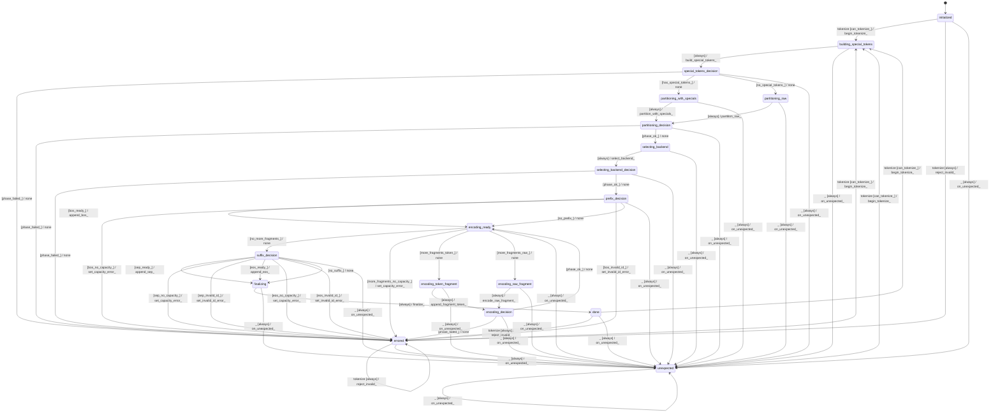

# tokenizer

Source: [`emel/tokenizer/sm.hpp`](https://github.com/stateforward/emel.cpp/blob/main/src/emel/tokenizer/sm.hpp)

## Mermaid

## Transitions

| Source | Event | Guard | Action | Target |
| --- | --- | --- | --- | --- |
| [`initialized`](https://github.com/stateforward/emel.cpp/blob/main/src/emel/tokenizer/sm.hpp) | [`tokenize`](https://github.com/stateforward/emel.cpp/blob/main/src/emel/tokenizer/sm.hpp) | [`can_tokenize>`](https://github.com/stateforward/emel.cpp/blob/main/src/emel/tokenizer/sm.hpp) | [`begin_tokenize>`](https://github.com/stateforward/emel.cpp/blob/main/src/emel/tokenizer/sm.hpp) | [`building_special_tokens`](https://github.com/stateforward/emel.cpp/blob/main/src/emel/tokenizer/sm.hpp) |
| [`initialized`](https://github.com/stateforward/emel.cpp/blob/main/src/emel/tokenizer/sm.hpp) | [`tokenize`](https://github.com/stateforward/emel.cpp/blob/main/src/emel/tokenizer/sm.hpp) | [`always`](https://github.com/stateforward/emel.cpp/blob/main/src/emel/tokenizer/sm.hpp) | [`reject_invalid>`](https://github.com/stateforward/emel.cpp/blob/main/src/emel/tokenizer/sm.hpp) | [`errored`](https://github.com/stateforward/emel.cpp/blob/main/src/emel/tokenizer/sm.hpp) |
| [`done`](https://github.com/stateforward/emel.cpp/blob/main/src/emel/tokenizer/sm.hpp) | [`tokenize`](https://github.com/stateforward/emel.cpp/blob/main/src/emel/tokenizer/sm.hpp) | [`can_tokenize>`](https://github.com/stateforward/emel.cpp/blob/main/src/emel/tokenizer/sm.hpp) | [`begin_tokenize>`](https://github.com/stateforward/emel.cpp/blob/main/src/emel/tokenizer/sm.hpp) | [`building_special_tokens`](https://github.com/stateforward/emel.cpp/blob/main/src/emel/tokenizer/sm.hpp) |
| [`done`](https://github.com/stateforward/emel.cpp/blob/main/src/emel/tokenizer/sm.hpp) | [`tokenize`](https://github.com/stateforward/emel.cpp/blob/main/src/emel/tokenizer/sm.hpp) | [`always`](https://github.com/stateforward/emel.cpp/blob/main/src/emel/tokenizer/sm.hpp) | [`reject_invalid>`](https://github.com/stateforward/emel.cpp/blob/main/src/emel/tokenizer/sm.hpp) | [`errored`](https://github.com/stateforward/emel.cpp/blob/main/src/emel/tokenizer/sm.hpp) |
| [`errored`](https://github.com/stateforward/emel.cpp/blob/main/src/emel/tokenizer/sm.hpp) | [`tokenize`](https://github.com/stateforward/emel.cpp/blob/main/src/emel/tokenizer/sm.hpp) | [`can_tokenize>`](https://github.com/stateforward/emel.cpp/blob/main/src/emel/tokenizer/sm.hpp) | [`begin_tokenize>`](https://github.com/stateforward/emel.cpp/blob/main/src/emel/tokenizer/sm.hpp) | [`building_special_tokens`](https://github.com/stateforward/emel.cpp/blob/main/src/emel/tokenizer/sm.hpp) |
| [`errored`](https://github.com/stateforward/emel.cpp/blob/main/src/emel/tokenizer/sm.hpp) | [`tokenize`](https://github.com/stateforward/emel.cpp/blob/main/src/emel/tokenizer/sm.hpp) | [`always`](https://github.com/stateforward/emel.cpp/blob/main/src/emel/tokenizer/sm.hpp) | [`reject_invalid>`](https://github.com/stateforward/emel.cpp/blob/main/src/emel/tokenizer/sm.hpp) | [`errored`](https://github.com/stateforward/emel.cpp/blob/main/src/emel/tokenizer/sm.hpp) |
| [`unexpected`](https://github.com/stateforward/emel.cpp/blob/main/src/emel/tokenizer/sm.hpp) | [`tokenize`](https://github.com/stateforward/emel.cpp/blob/main/src/emel/tokenizer/sm.hpp) | [`can_tokenize>`](https://github.com/stateforward/emel.cpp/blob/main/src/emel/tokenizer/sm.hpp) | [`begin_tokenize>`](https://github.com/stateforward/emel.cpp/blob/main/src/emel/tokenizer/sm.hpp) | [`building_special_tokens`](https://github.com/stateforward/emel.cpp/blob/main/src/emel/tokenizer/sm.hpp) |
| [`unexpected`](https://github.com/stateforward/emel.cpp/blob/main/src/emel/tokenizer/sm.hpp) | [`tokenize`](https://github.com/stateforward/emel.cpp/blob/main/src/emel/tokenizer/sm.hpp) | [`always`](https://github.com/stateforward/emel.cpp/blob/main/src/emel/tokenizer/sm.hpp) | [`reject_invalid>`](https://github.com/stateforward/emel.cpp/blob/main/src/emel/tokenizer/sm.hpp) | [`unexpected`](https://github.com/stateforward/emel.cpp/blob/main/src/emel/tokenizer/sm.hpp) |
| [`building_special_tokens`](https://github.com/stateforward/emel.cpp/blob/main/src/emel/tokenizer/sm.hpp) | - | [`always`](https://github.com/stateforward/emel.cpp/blob/main/src/emel/tokenizer/sm.hpp) | [`build_special_tokens>`](https://github.com/stateforward/emel.cpp/blob/main/src/emel/tokenizer/sm.hpp) | [`special_tokens_decision`](https://github.com/stateforward/emel.cpp/blob/main/src/emel/tokenizer/sm.hpp) |
| [`special_tokens_decision`](https://github.com/stateforward/emel.cpp/blob/main/src/emel/tokenizer/sm.hpp) | - | [`phase_failed>`](https://github.com/stateforward/emel.cpp/blob/main/src/emel/tokenizer/sm.hpp) | [`none`](https://github.com/stateforward/emel.cpp/blob/main/src/emel/tokenizer/sm.hpp) | [`errored`](https://github.com/stateforward/emel.cpp/blob/main/src/emel/tokenizer/sm.hpp) |
| [`special_tokens_decision`](https://github.com/stateforward/emel.cpp/blob/main/src/emel/tokenizer/sm.hpp) | - | [`has_special_tokens>`](https://github.com/stateforward/emel.cpp/blob/main/src/emel/tokenizer/sm.hpp) | [`none`](https://github.com/stateforward/emel.cpp/blob/main/src/emel/tokenizer/sm.hpp) | [`partitioning_with_specials`](https://github.com/stateforward/emel.cpp/blob/main/src/emel/tokenizer/sm.hpp) |
| [`special_tokens_decision`](https://github.com/stateforward/emel.cpp/blob/main/src/emel/tokenizer/sm.hpp) | - | [`no_special_tokens>`](https://github.com/stateforward/emel.cpp/blob/main/src/emel/tokenizer/sm.hpp) | [`none`](https://github.com/stateforward/emel.cpp/blob/main/src/emel/tokenizer/sm.hpp) | [`partitioning_raw`](https://github.com/stateforward/emel.cpp/blob/main/src/emel/tokenizer/sm.hpp) |
| [`partitioning_raw`](https://github.com/stateforward/emel.cpp/blob/main/src/emel/tokenizer/sm.hpp) | - | [`always`](https://github.com/stateforward/emel.cpp/blob/main/src/emel/tokenizer/sm.hpp) | [`partition_raw>`](https://github.com/stateforward/emel.cpp/blob/main/src/emel/tokenizer/sm.hpp) | [`partitioning_decision`](https://github.com/stateforward/emel.cpp/blob/main/src/emel/tokenizer/sm.hpp) |
| [`partitioning_with_specials`](https://github.com/stateforward/emel.cpp/blob/main/src/emel/tokenizer/sm.hpp) | - | [`always`](https://github.com/stateforward/emel.cpp/blob/main/src/emel/tokenizer/sm.hpp) | [`partition_with_specials>`](https://github.com/stateforward/emel.cpp/blob/main/src/emel/tokenizer/sm.hpp) | [`partitioning_decision`](https://github.com/stateforward/emel.cpp/blob/main/src/emel/tokenizer/sm.hpp) |
| [`partitioning_decision`](https://github.com/stateforward/emel.cpp/blob/main/src/emel/tokenizer/sm.hpp) | - | [`phase_failed>`](https://github.com/stateforward/emel.cpp/blob/main/src/emel/tokenizer/sm.hpp) | [`none`](https://github.com/stateforward/emel.cpp/blob/main/src/emel/tokenizer/sm.hpp) | [`errored`](https://github.com/stateforward/emel.cpp/blob/main/src/emel/tokenizer/sm.hpp) |
| [`partitioning_decision`](https://github.com/stateforward/emel.cpp/blob/main/src/emel/tokenizer/sm.hpp) | - | [`phase_ok>`](https://github.com/stateforward/emel.cpp/blob/main/src/emel/tokenizer/sm.hpp) | [`none`](https://github.com/stateforward/emel.cpp/blob/main/src/emel/tokenizer/sm.hpp) | [`selecting_backend`](https://github.com/stateforward/emel.cpp/blob/main/src/emel/tokenizer/sm.hpp) |
| [`selecting_backend`](https://github.com/stateforward/emel.cpp/blob/main/src/emel/tokenizer/sm.hpp) | - | [`always`](https://github.com/stateforward/emel.cpp/blob/main/src/emel/tokenizer/sm.hpp) | [`select_backend>`](https://github.com/stateforward/emel.cpp/blob/main/src/emel/tokenizer/sm.hpp) | [`selecting_backend_decision`](https://github.com/stateforward/emel.cpp/blob/main/src/emel/tokenizer/sm.hpp) |
| [`selecting_backend_decision`](https://github.com/stateforward/emel.cpp/blob/main/src/emel/tokenizer/sm.hpp) | - | [`phase_failed>`](https://github.com/stateforward/emel.cpp/blob/main/src/emel/tokenizer/sm.hpp) | [`none`](https://github.com/stateforward/emel.cpp/blob/main/src/emel/tokenizer/sm.hpp) | [`errored`](https://github.com/stateforward/emel.cpp/blob/main/src/emel/tokenizer/sm.hpp) |
| [`selecting_backend_decision`](https://github.com/stateforward/emel.cpp/blob/main/src/emel/tokenizer/sm.hpp) | - | [`phase_ok>`](https://github.com/stateforward/emel.cpp/blob/main/src/emel/tokenizer/sm.hpp) | [`none`](https://github.com/stateforward/emel.cpp/blob/main/src/emel/tokenizer/sm.hpp) | [`prefix_decision`](https://github.com/stateforward/emel.cpp/blob/main/src/emel/tokenizer/sm.hpp) |
| [`prefix_decision`](https://github.com/stateforward/emel.cpp/blob/main/src/emel/tokenizer/sm.hpp) | - | [`bos_ready>`](https://github.com/stateforward/emel.cpp/blob/main/src/emel/tokenizer/sm.hpp) | [`append_bos>`](https://github.com/stateforward/emel.cpp/blob/main/src/emel/tokenizer/sm.hpp) | [`encoding_ready`](https://github.com/stateforward/emel.cpp/blob/main/src/emel/tokenizer/sm.hpp) |
| [`prefix_decision`](https://github.com/stateforward/emel.cpp/blob/main/src/emel/tokenizer/sm.hpp) | - | [`bos_no_capacity>`](https://github.com/stateforward/emel.cpp/blob/main/src/emel/tokenizer/sm.hpp) | [`set_capacity_error>`](https://github.com/stateforward/emel.cpp/blob/main/src/emel/tokenizer/sm.hpp) | [`errored`](https://github.com/stateforward/emel.cpp/blob/main/src/emel/tokenizer/sm.hpp) |
| [`prefix_decision`](https://github.com/stateforward/emel.cpp/blob/main/src/emel/tokenizer/sm.hpp) | - | [`bos_invalid_id>`](https://github.com/stateforward/emel.cpp/blob/main/src/emel/tokenizer/sm.hpp) | [`set_invalid_id_error>`](https://github.com/stateforward/emel.cpp/blob/main/src/emel/tokenizer/sm.hpp) | [`errored`](https://github.com/stateforward/emel.cpp/blob/main/src/emel/tokenizer/sm.hpp) |
| [`prefix_decision`](https://github.com/stateforward/emel.cpp/blob/main/src/emel/tokenizer/sm.hpp) | - | [`no_prefix>`](https://github.com/stateforward/emel.cpp/blob/main/src/emel/tokenizer/sm.hpp) | [`none`](https://github.com/stateforward/emel.cpp/blob/main/src/emel/tokenizer/sm.hpp) | [`encoding_ready`](https://github.com/stateforward/emel.cpp/blob/main/src/emel/tokenizer/sm.hpp) |
| [`encoding_ready`](https://github.com/stateforward/emel.cpp/blob/main/src/emel/tokenizer/sm.hpp) | - | [`no_more_fragments>`](https://github.com/stateforward/emel.cpp/blob/main/src/emel/tokenizer/sm.hpp) | [`none`](https://github.com/stateforward/emel.cpp/blob/main/src/emel/tokenizer/sm.hpp) | [`suffix_decision`](https://github.com/stateforward/emel.cpp/blob/main/src/emel/tokenizer/sm.hpp) |
| [`encoding_ready`](https://github.com/stateforward/emel.cpp/blob/main/src/emel/tokenizer/sm.hpp) | - | [`more_fragments_no_capacity>`](https://github.com/stateforward/emel.cpp/blob/main/src/emel/tokenizer/sm.hpp) | [`set_capacity_error>`](https://github.com/stateforward/emel.cpp/blob/main/src/emel/tokenizer/sm.hpp) | [`errored`](https://github.com/stateforward/emel.cpp/blob/main/src/emel/tokenizer/sm.hpp) |
| [`encoding_ready`](https://github.com/stateforward/emel.cpp/blob/main/src/emel/tokenizer/sm.hpp) | - | [`more_fragments_token>`](https://github.com/stateforward/emel.cpp/blob/main/src/emel/tokenizer/sm.hpp) | [`none`](https://github.com/stateforward/emel.cpp/blob/main/src/emel/tokenizer/sm.hpp) | [`encoding_token_fragment`](https://github.com/stateforward/emel.cpp/blob/main/src/emel/tokenizer/sm.hpp) |
| [`encoding_ready`](https://github.com/stateforward/emel.cpp/blob/main/src/emel/tokenizer/sm.hpp) | - | [`more_fragments_raw>`](https://github.com/stateforward/emel.cpp/blob/main/src/emel/tokenizer/sm.hpp) | [`none`](https://github.com/stateforward/emel.cpp/blob/main/src/emel/tokenizer/sm.hpp) | [`encoding_raw_fragment`](https://github.com/stateforward/emel.cpp/blob/main/src/emel/tokenizer/sm.hpp) |
| [`encoding_token_fragment`](https://github.com/stateforward/emel.cpp/blob/main/src/emel/tokenizer/sm.hpp) | - | [`always`](https://github.com/stateforward/emel.cpp/blob/main/src/emel/tokenizer/sm.hpp) | [`append_fragment_token>`](https://github.com/stateforward/emel.cpp/blob/main/src/emel/tokenizer/sm.hpp) | [`encoding_decision`](https://github.com/stateforward/emel.cpp/blob/main/src/emel/tokenizer/sm.hpp) |
| [`encoding_raw_fragment`](https://github.com/stateforward/emel.cpp/blob/main/src/emel/tokenizer/sm.hpp) | - | [`always`](https://github.com/stateforward/emel.cpp/blob/main/src/emel/tokenizer/sm.hpp) | [`encode_raw_fragment>`](https://github.com/stateforward/emel.cpp/blob/main/src/emel/tokenizer/sm.hpp) | [`encoding_decision`](https://github.com/stateforward/emel.cpp/blob/main/src/emel/tokenizer/sm.hpp) |
| [`encoding_decision`](https://github.com/stateforward/emel.cpp/blob/main/src/emel/tokenizer/sm.hpp) | - | [`phase_failed>`](https://github.com/stateforward/emel.cpp/blob/main/src/emel/tokenizer/sm.hpp) | [`none`](https://github.com/stateforward/emel.cpp/blob/main/src/emel/tokenizer/sm.hpp) | [`errored`](https://github.com/stateforward/emel.cpp/blob/main/src/emel/tokenizer/sm.hpp) |
| [`encoding_decision`](https://github.com/stateforward/emel.cpp/blob/main/src/emel/tokenizer/sm.hpp) | - | [`phase_ok>`](https://github.com/stateforward/emel.cpp/blob/main/src/emel/tokenizer/sm.hpp) | [`none`](https://github.com/stateforward/emel.cpp/blob/main/src/emel/tokenizer/sm.hpp) | [`encoding_ready`](https://github.com/stateforward/emel.cpp/blob/main/src/emel/tokenizer/sm.hpp) |
| [`suffix_decision`](https://github.com/stateforward/emel.cpp/blob/main/src/emel/tokenizer/sm.hpp) | - | [`sep_ready>`](https://github.com/stateforward/emel.cpp/blob/main/src/emel/tokenizer/sm.hpp) | [`append_sep>`](https://github.com/stateforward/emel.cpp/blob/main/src/emel/tokenizer/sm.hpp) | [`finalizing`](https://github.com/stateforward/emel.cpp/blob/main/src/emel/tokenizer/sm.hpp) |
| [`suffix_decision`](https://github.com/stateforward/emel.cpp/blob/main/src/emel/tokenizer/sm.hpp) | - | [`sep_no_capacity>`](https://github.com/stateforward/emel.cpp/blob/main/src/emel/tokenizer/sm.hpp) | [`set_capacity_error>`](https://github.com/stateforward/emel.cpp/blob/main/src/emel/tokenizer/sm.hpp) | [`errored`](https://github.com/stateforward/emel.cpp/blob/main/src/emel/tokenizer/sm.hpp) |
| [`suffix_decision`](https://github.com/stateforward/emel.cpp/blob/main/src/emel/tokenizer/sm.hpp) | - | [`sep_invalid_id>`](https://github.com/stateforward/emel.cpp/blob/main/src/emel/tokenizer/sm.hpp) | [`set_invalid_id_error>`](https://github.com/stateforward/emel.cpp/blob/main/src/emel/tokenizer/sm.hpp) | [`errored`](https://github.com/stateforward/emel.cpp/blob/main/src/emel/tokenizer/sm.hpp) |
| [`suffix_decision`](https://github.com/stateforward/emel.cpp/blob/main/src/emel/tokenizer/sm.hpp) | - | [`eos_ready>`](https://github.com/stateforward/emel.cpp/blob/main/src/emel/tokenizer/sm.hpp) | [`append_eos>`](https://github.com/stateforward/emel.cpp/blob/main/src/emel/tokenizer/sm.hpp) | [`finalizing`](https://github.com/stateforward/emel.cpp/blob/main/src/emel/tokenizer/sm.hpp) |
| [`suffix_decision`](https://github.com/stateforward/emel.cpp/blob/main/src/emel/tokenizer/sm.hpp) | - | [`eos_no_capacity>`](https://github.com/stateforward/emel.cpp/blob/main/src/emel/tokenizer/sm.hpp) | [`set_capacity_error>`](https://github.com/stateforward/emel.cpp/blob/main/src/emel/tokenizer/sm.hpp) | [`errored`](https://github.com/stateforward/emel.cpp/blob/main/src/emel/tokenizer/sm.hpp) |
| [`suffix_decision`](https://github.com/stateforward/emel.cpp/blob/main/src/emel/tokenizer/sm.hpp) | - | [`eos_invalid_id>`](https://github.com/stateforward/emel.cpp/blob/main/src/emel/tokenizer/sm.hpp) | [`set_invalid_id_error>`](https://github.com/stateforward/emel.cpp/blob/main/src/emel/tokenizer/sm.hpp) | [`errored`](https://github.com/stateforward/emel.cpp/blob/main/src/emel/tokenizer/sm.hpp) |
| [`suffix_decision`](https://github.com/stateforward/emel.cpp/blob/main/src/emel/tokenizer/sm.hpp) | - | [`no_suffix>`](https://github.com/stateforward/emel.cpp/blob/main/src/emel/tokenizer/sm.hpp) | [`none`](https://github.com/stateforward/emel.cpp/blob/main/src/emel/tokenizer/sm.hpp) | [`finalizing`](https://github.com/stateforward/emel.cpp/blob/main/src/emel/tokenizer/sm.hpp) |
| [`finalizing`](https://github.com/stateforward/emel.cpp/blob/main/src/emel/tokenizer/sm.hpp) | - | [`always`](https://github.com/stateforward/emel.cpp/blob/main/src/emel/tokenizer/sm.hpp) | [`finalize>`](https://github.com/stateforward/emel.cpp/blob/main/src/emel/tokenizer/sm.hpp) | [`done`](https://github.com/stateforward/emel.cpp/blob/main/src/emel/tokenizer/sm.hpp) |
| [`initialized`](https://github.com/stateforward/emel.cpp/blob/main/src/emel/tokenizer/sm.hpp) | [`_`](https://github.com/stateforward/emel.cpp/blob/main/src/emel/tokenizer/sm.hpp) | [`always`](https://github.com/stateforward/emel.cpp/blob/main/src/emel/tokenizer/sm.hpp) | [`on_unexpected>`](https://github.com/stateforward/emel.cpp/blob/main/src/emel/tokenizer/sm.hpp) | [`unexpected`](https://github.com/stateforward/emel.cpp/blob/main/src/emel/tokenizer/sm.hpp) |
| [`building_special_tokens`](https://github.com/stateforward/emel.cpp/blob/main/src/emel/tokenizer/sm.hpp) | [`_`](https://github.com/stateforward/emel.cpp/blob/main/src/emel/tokenizer/sm.hpp) | [`always`](https://github.com/stateforward/emel.cpp/blob/main/src/emel/tokenizer/sm.hpp) | [`on_unexpected>`](https://github.com/stateforward/emel.cpp/blob/main/src/emel/tokenizer/sm.hpp) | [`unexpected`](https://github.com/stateforward/emel.cpp/blob/main/src/emel/tokenizer/sm.hpp) |
| [`special_tokens_decision`](https://github.com/stateforward/emel.cpp/blob/main/src/emel/tokenizer/sm.hpp) | [`_`](https://github.com/stateforward/emel.cpp/blob/main/src/emel/tokenizer/sm.hpp) | [`always`](https://github.com/stateforward/emel.cpp/blob/main/src/emel/tokenizer/sm.hpp) | [`on_unexpected>`](https://github.com/stateforward/emel.cpp/blob/main/src/emel/tokenizer/sm.hpp) | [`unexpected`](https://github.com/stateforward/emel.cpp/blob/main/src/emel/tokenizer/sm.hpp) |
| [`partitioning_raw`](https://github.com/stateforward/emel.cpp/blob/main/src/emel/tokenizer/sm.hpp) | [`_`](https://github.com/stateforward/emel.cpp/blob/main/src/emel/tokenizer/sm.hpp) | [`always`](https://github.com/stateforward/emel.cpp/blob/main/src/emel/tokenizer/sm.hpp) | [`on_unexpected>`](https://github.com/stateforward/emel.cpp/blob/main/src/emel/tokenizer/sm.hpp) | [`unexpected`](https://github.com/stateforward/emel.cpp/blob/main/src/emel/tokenizer/sm.hpp) |
| [`partitioning_with_specials`](https://github.com/stateforward/emel.cpp/blob/main/src/emel/tokenizer/sm.hpp) | [`_`](https://github.com/stateforward/emel.cpp/blob/main/src/emel/tokenizer/sm.hpp) | [`always`](https://github.com/stateforward/emel.cpp/blob/main/src/emel/tokenizer/sm.hpp) | [`on_unexpected>`](https://github.com/stateforward/emel.cpp/blob/main/src/emel/tokenizer/sm.hpp) | [`unexpected`](https://github.com/stateforward/emel.cpp/blob/main/src/emel/tokenizer/sm.hpp) |
| [`partitioning_decision`](https://github.com/stateforward/emel.cpp/blob/main/src/emel/tokenizer/sm.hpp) | [`_`](https://github.com/stateforward/emel.cpp/blob/main/src/emel/tokenizer/sm.hpp) | [`always`](https://github.com/stateforward/emel.cpp/blob/main/src/emel/tokenizer/sm.hpp) | [`on_unexpected>`](https://github.com/stateforward/emel.cpp/blob/main/src/emel/tokenizer/sm.hpp) | [`unexpected`](https://github.com/stateforward/emel.cpp/blob/main/src/emel/tokenizer/sm.hpp) |
| [`selecting_backend`](https://github.com/stateforward/emel.cpp/blob/main/src/emel/tokenizer/sm.hpp) | [`_`](https://github.com/stateforward/emel.cpp/blob/main/src/emel/tokenizer/sm.hpp) | [`always`](https://github.com/stateforward/emel.cpp/blob/main/src/emel/tokenizer/sm.hpp) | [`on_unexpected>`](https://github.com/stateforward/emel.cpp/blob/main/src/emel/tokenizer/sm.hpp) | [`unexpected`](https://github.com/stateforward/emel.cpp/blob/main/src/emel/tokenizer/sm.hpp) |
| [`selecting_backend_decision`](https://github.com/stateforward/emel.cpp/blob/main/src/emel/tokenizer/sm.hpp) | [`_`](https://github.com/stateforward/emel.cpp/blob/main/src/emel/tokenizer/sm.hpp) | [`always`](https://github.com/stateforward/emel.cpp/blob/main/src/emel/tokenizer/sm.hpp) | [`on_unexpected>`](https://github.com/stateforward/emel.cpp/blob/main/src/emel/tokenizer/sm.hpp) | [`unexpected`](https://github.com/stateforward/emel.cpp/blob/main/src/emel/tokenizer/sm.hpp) |
| [`prefix_decision`](https://github.com/stateforward/emel.cpp/blob/main/src/emel/tokenizer/sm.hpp) | [`_`](https://github.com/stateforward/emel.cpp/blob/main/src/emel/tokenizer/sm.hpp) | [`always`](https://github.com/stateforward/emel.cpp/blob/main/src/emel/tokenizer/sm.hpp) | [`on_unexpected>`](https://github.com/stateforward/emel.cpp/blob/main/src/emel/tokenizer/sm.hpp) | [`unexpected`](https://github.com/stateforward/emel.cpp/blob/main/src/emel/tokenizer/sm.hpp) |
| [`encoding_ready`](https://github.com/stateforward/emel.cpp/blob/main/src/emel/tokenizer/sm.hpp) | [`_`](https://github.com/stateforward/emel.cpp/blob/main/src/emel/tokenizer/sm.hpp) | [`always`](https://github.com/stateforward/emel.cpp/blob/main/src/emel/tokenizer/sm.hpp) | [`on_unexpected>`](https://github.com/stateforward/emel.cpp/blob/main/src/emel/tokenizer/sm.hpp) | [`unexpected`](https://github.com/stateforward/emel.cpp/blob/main/src/emel/tokenizer/sm.hpp) |
| [`encoding_token_fragment`](https://github.com/stateforward/emel.cpp/blob/main/src/emel/tokenizer/sm.hpp) | [`_`](https://github.com/stateforward/emel.cpp/blob/main/src/emel/tokenizer/sm.hpp) | [`always`](https://github.com/stateforward/emel.cpp/blob/main/src/emel/tokenizer/sm.hpp) | [`on_unexpected>`](https://github.com/stateforward/emel.cpp/blob/main/src/emel/tokenizer/sm.hpp) | [`unexpected`](https://github.com/stateforward/emel.cpp/blob/main/src/emel/tokenizer/sm.hpp) |
| [`encoding_raw_fragment`](https://github.com/stateforward/emel.cpp/blob/main/src/emel/tokenizer/sm.hpp) | [`_`](https://github.com/stateforward/emel.cpp/blob/main/src/emel/tokenizer/sm.hpp) | [`always`](https://github.com/stateforward/emel.cpp/blob/main/src/emel/tokenizer/sm.hpp) | [`on_unexpected>`](https://github.com/stateforward/emel.cpp/blob/main/src/emel/tokenizer/sm.hpp) | [`unexpected`](https://github.com/stateforward/emel.cpp/blob/main/src/emel/tokenizer/sm.hpp) |
| [`encoding_decision`](https://github.com/stateforward/emel.cpp/blob/main/src/emel/tokenizer/sm.hpp) | [`_`](https://github.com/stateforward/emel.cpp/blob/main/src/emel/tokenizer/sm.hpp) | [`always`](https://github.com/stateforward/emel.cpp/blob/main/src/emel/tokenizer/sm.hpp) | [`on_unexpected>`](https://github.com/stateforward/emel.cpp/blob/main/src/emel/tokenizer/sm.hpp) | [`unexpected`](https://github.com/stateforward/emel.cpp/blob/main/src/emel/tokenizer/sm.hpp) |
| [`suffix_decision`](https://github.com/stateforward/emel.cpp/blob/main/src/emel/tokenizer/sm.hpp) | [`_`](https://github.com/stateforward/emel.cpp/blob/main/src/emel/tokenizer/sm.hpp) | [`always`](https://github.com/stateforward/emel.cpp/blob/main/src/emel/tokenizer/sm.hpp) | [`on_unexpected>`](https://github.com/stateforward/emel.cpp/blob/main/src/emel/tokenizer/sm.hpp) | [`unexpected`](https://github.com/stateforward/emel.cpp/blob/main/src/emel/tokenizer/sm.hpp) |
| [`finalizing`](https://github.com/stateforward/emel.cpp/blob/main/src/emel/tokenizer/sm.hpp) | [`_`](https://github.com/stateforward/emel.cpp/blob/main/src/emel/tokenizer/sm.hpp) | [`always`](https://github.com/stateforward/emel.cpp/blob/main/src/emel/tokenizer/sm.hpp) | [`on_unexpected>`](https://github.com/stateforward/emel.cpp/blob/main/src/emel/tokenizer/sm.hpp) | [`unexpected`](https://github.com/stateforward/emel.cpp/blob/main/src/emel/tokenizer/sm.hpp) |
| [`done`](https://github.com/stateforward/emel.cpp/blob/main/src/emel/tokenizer/sm.hpp) | [`_`](https://github.com/stateforward/emel.cpp/blob/main/src/emel/tokenizer/sm.hpp) | [`always`](https://github.com/stateforward/emel.cpp/blob/main/src/emel/tokenizer/sm.hpp) | [`on_unexpected>`](https://github.com/stateforward/emel.cpp/blob/main/src/emel/tokenizer/sm.hpp) | [`unexpected`](https://github.com/stateforward/emel.cpp/blob/main/src/emel/tokenizer/sm.hpp) |
| [`errored`](https://github.com/stateforward/emel.cpp/blob/main/src/emel/tokenizer/sm.hpp) | [`_`](https://github.com/stateforward/emel.cpp/blob/main/src/emel/tokenizer/sm.hpp) | [`always`](https://github.com/stateforward/emel.cpp/blob/main/src/emel/tokenizer/sm.hpp) | [`on_unexpected>`](https://github.com/stateforward/emel.cpp/blob/main/src/emel/tokenizer/sm.hpp) | [`unexpected`](https://github.com/stateforward/emel.cpp/blob/main/src/emel/tokenizer/sm.hpp) |
| [`unexpected`](https://github.com/stateforward/emel.cpp/blob/main/src/emel/tokenizer/sm.hpp) | [`_`](https://github.com/stateforward/emel.cpp/blob/main/src/emel/tokenizer/sm.hpp) | [`always`](https://github.com/stateforward/emel.cpp/blob/main/src/emel/tokenizer/sm.hpp) | [`on_unexpected>`](https://github.com/stateforward/emel.cpp/blob/main/src/emel/tokenizer/sm.hpp) | [`unexpected`](https://github.com/stateforward/emel.cpp/blob/main/src/emel/tokenizer/sm.hpp) |
