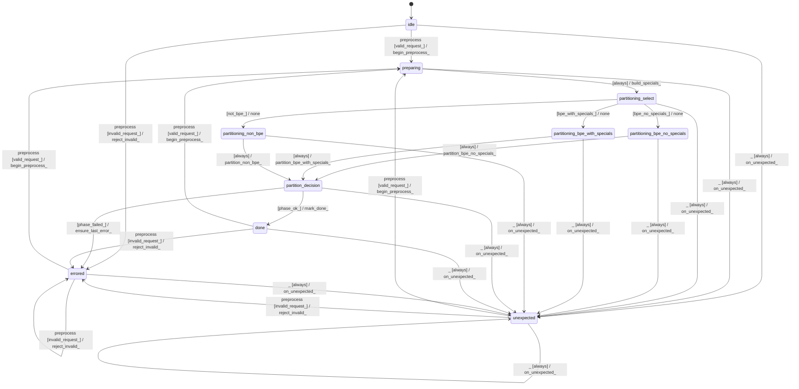

# tokenizer_preprocessor_ugm

Source: [`emel/tokenizer/preprocessor/ugm/sm.hpp`](https://github.com/stateforward/emel.cpp/blob/main/src/emel/tokenizer/preprocessor/ugm/sm.hpp)

## Mermaid

## Transitions

| Source | Event | Guard | Action | Target |
| --- | --- | --- | --- | --- |
| [`idle`](https://github.com/stateforward/emel.cpp/blob/main/src/emel/tokenizer/preprocessor/ugm/sm.hpp) | [`preprocess`](https://github.com/stateforward/emel.cpp/blob/main/src/emel/tokenizer/preprocessor/ugm/sm.hpp) | [`valid_request>`](https://github.com/stateforward/emel.cpp/blob/main/src/emel/tokenizer/preprocessor/ugm/sm.hpp) | [`begin_preprocess>`](https://github.com/stateforward/emel.cpp/blob/main/src/emel/tokenizer/preprocessor/ugm/sm.hpp) | [`preparing`](https://github.com/stateforward/emel.cpp/blob/main/src/emel/tokenizer/preprocessor/ugm/sm.hpp) |
| [`idle`](https://github.com/stateforward/emel.cpp/blob/main/src/emel/tokenizer/preprocessor/ugm/sm.hpp) | [`preprocess`](https://github.com/stateforward/emel.cpp/blob/main/src/emel/tokenizer/preprocessor/ugm/sm.hpp) | [`invalid_request>`](https://github.com/stateforward/emel.cpp/blob/main/src/emel/tokenizer/preprocessor/ugm/sm.hpp) | [`reject_invalid>`](https://github.com/stateforward/emel.cpp/blob/main/src/emel/tokenizer/preprocessor/ugm/sm.hpp) | [`errored`](https://github.com/stateforward/emel.cpp/blob/main/src/emel/tokenizer/preprocessor/ugm/sm.hpp) |
| [`preparing`](https://github.com/stateforward/emel.cpp/blob/main/src/emel/tokenizer/preprocessor/ugm/sm.hpp) | - | [`always`](https://github.com/stateforward/emel.cpp/blob/main/src/emel/tokenizer/preprocessor/ugm/sm.hpp) | [`build_specials>`](https://github.com/stateforward/emel.cpp/blob/main/src/emel/tokenizer/preprocessor/ugm/sm.hpp) | [`partitioning_select`](https://github.com/stateforward/emel.cpp/blob/main/src/emel/tokenizer/preprocessor/ugm/sm.hpp) |
| [`partitioning_select`](https://github.com/stateforward/emel.cpp/blob/main/src/emel/tokenizer/preprocessor/ugm/sm.hpp) | - | [`bpe_no_specials>`](https://github.com/stateforward/emel.cpp/blob/main/src/emel/tokenizer/preprocessor/ugm/sm.hpp) | [`none`](https://github.com/stateforward/emel.cpp/blob/main/src/emel/tokenizer/preprocessor/ugm/sm.hpp) | [`partitioning_bpe_no_specials`](https://github.com/stateforward/emel.cpp/blob/main/src/emel/tokenizer/preprocessor/ugm/sm.hpp) |
| [`partitioning_select`](https://github.com/stateforward/emel.cpp/blob/main/src/emel/tokenizer/preprocessor/ugm/sm.hpp) | - | [`bpe_with_specials>`](https://github.com/stateforward/emel.cpp/blob/main/src/emel/tokenizer/preprocessor/ugm/sm.hpp) | [`none`](https://github.com/stateforward/emel.cpp/blob/main/src/emel/tokenizer/preprocessor/ugm/sm.hpp) | [`partitioning_bpe_with_specials`](https://github.com/stateforward/emel.cpp/blob/main/src/emel/tokenizer/preprocessor/ugm/sm.hpp) |
| [`partitioning_select`](https://github.com/stateforward/emel.cpp/blob/main/src/emel/tokenizer/preprocessor/ugm/sm.hpp) | - | [`not_bpe>`](https://github.com/stateforward/emel.cpp/blob/main/src/emel/tokenizer/preprocessor/ugm/sm.hpp) | [`none`](https://github.com/stateforward/emel.cpp/blob/main/src/emel/tokenizer/preprocessor/ugm/sm.hpp) | [`partitioning_non_bpe`](https://github.com/stateforward/emel.cpp/blob/main/src/emel/tokenizer/preprocessor/ugm/sm.hpp) |
| [`partitioning_bpe_no_specials`](https://github.com/stateforward/emel.cpp/blob/main/src/emel/tokenizer/preprocessor/ugm/sm.hpp) | - | [`always`](https://github.com/stateforward/emel.cpp/blob/main/src/emel/tokenizer/preprocessor/ugm/sm.hpp) | [`partition_bpe_no_specials>`](https://github.com/stateforward/emel.cpp/blob/main/src/emel/tokenizer/preprocessor/ugm/sm.hpp) | [`partition_decision`](https://github.com/stateforward/emel.cpp/blob/main/src/emel/tokenizer/preprocessor/ugm/sm.hpp) |
| [`partitioning_bpe_with_specials`](https://github.com/stateforward/emel.cpp/blob/main/src/emel/tokenizer/preprocessor/ugm/sm.hpp) | - | [`always`](https://github.com/stateforward/emel.cpp/blob/main/src/emel/tokenizer/preprocessor/ugm/sm.hpp) | [`partition_bpe_with_specials>`](https://github.com/stateforward/emel.cpp/blob/main/src/emel/tokenizer/preprocessor/ugm/sm.hpp) | [`partition_decision`](https://github.com/stateforward/emel.cpp/blob/main/src/emel/tokenizer/preprocessor/ugm/sm.hpp) |
| [`partitioning_non_bpe`](https://github.com/stateforward/emel.cpp/blob/main/src/emel/tokenizer/preprocessor/ugm/sm.hpp) | - | [`always`](https://github.com/stateforward/emel.cpp/blob/main/src/emel/tokenizer/preprocessor/ugm/sm.hpp) | [`partition_non_bpe>`](https://github.com/stateforward/emel.cpp/blob/main/src/emel/tokenizer/preprocessor/ugm/sm.hpp) | [`partition_decision`](https://github.com/stateforward/emel.cpp/blob/main/src/emel/tokenizer/preprocessor/ugm/sm.hpp) |
| [`partition_decision`](https://github.com/stateforward/emel.cpp/blob/main/src/emel/tokenizer/preprocessor/ugm/sm.hpp) | - | [`phase_failed>`](https://github.com/stateforward/emel.cpp/blob/main/src/emel/tokenizer/preprocessor/ugm/sm.hpp) | [`ensure_last_error>`](https://github.com/stateforward/emel.cpp/blob/main/src/emel/tokenizer/preprocessor/ugm/sm.hpp) | [`errored`](https://github.com/stateforward/emel.cpp/blob/main/src/emel/tokenizer/preprocessor/ugm/sm.hpp) |
| [`partition_decision`](https://github.com/stateforward/emel.cpp/blob/main/src/emel/tokenizer/preprocessor/ugm/sm.hpp) | - | [`phase_ok>`](https://github.com/stateforward/emel.cpp/blob/main/src/emel/tokenizer/preprocessor/ugm/sm.hpp) | [`mark_done>`](https://github.com/stateforward/emel.cpp/blob/main/src/emel/tokenizer/preprocessor/ugm/sm.hpp) | [`done`](https://github.com/stateforward/emel.cpp/blob/main/src/emel/tokenizer/preprocessor/ugm/sm.hpp) |
| [`done`](https://github.com/stateforward/emel.cpp/blob/main/src/emel/tokenizer/preprocessor/ugm/sm.hpp) | [`preprocess`](https://github.com/stateforward/emel.cpp/blob/main/src/emel/tokenizer/preprocessor/ugm/sm.hpp) | [`valid_request>`](https://github.com/stateforward/emel.cpp/blob/main/src/emel/tokenizer/preprocessor/ugm/sm.hpp) | [`begin_preprocess>`](https://github.com/stateforward/emel.cpp/blob/main/src/emel/tokenizer/preprocessor/ugm/sm.hpp) | [`preparing`](https://github.com/stateforward/emel.cpp/blob/main/src/emel/tokenizer/preprocessor/ugm/sm.hpp) |
| [`done`](https://github.com/stateforward/emel.cpp/blob/main/src/emel/tokenizer/preprocessor/ugm/sm.hpp) | [`preprocess`](https://github.com/stateforward/emel.cpp/blob/main/src/emel/tokenizer/preprocessor/ugm/sm.hpp) | [`invalid_request>`](https://github.com/stateforward/emel.cpp/blob/main/src/emel/tokenizer/preprocessor/ugm/sm.hpp) | [`reject_invalid>`](https://github.com/stateforward/emel.cpp/blob/main/src/emel/tokenizer/preprocessor/ugm/sm.hpp) | [`errored`](https://github.com/stateforward/emel.cpp/blob/main/src/emel/tokenizer/preprocessor/ugm/sm.hpp) |
| [`errored`](https://github.com/stateforward/emel.cpp/blob/main/src/emel/tokenizer/preprocessor/ugm/sm.hpp) | [`preprocess`](https://github.com/stateforward/emel.cpp/blob/main/src/emel/tokenizer/preprocessor/ugm/sm.hpp) | [`valid_request>`](https://github.com/stateforward/emel.cpp/blob/main/src/emel/tokenizer/preprocessor/ugm/sm.hpp) | [`begin_preprocess>`](https://github.com/stateforward/emel.cpp/blob/main/src/emel/tokenizer/preprocessor/ugm/sm.hpp) | [`preparing`](https://github.com/stateforward/emel.cpp/blob/main/src/emel/tokenizer/preprocessor/ugm/sm.hpp) |
| [`errored`](https://github.com/stateforward/emel.cpp/blob/main/src/emel/tokenizer/preprocessor/ugm/sm.hpp) | [`preprocess`](https://github.com/stateforward/emel.cpp/blob/main/src/emel/tokenizer/preprocessor/ugm/sm.hpp) | [`invalid_request>`](https://github.com/stateforward/emel.cpp/blob/main/src/emel/tokenizer/preprocessor/ugm/sm.hpp) | [`reject_invalid>`](https://github.com/stateforward/emel.cpp/blob/main/src/emel/tokenizer/preprocessor/ugm/sm.hpp) | [`errored`](https://github.com/stateforward/emel.cpp/blob/main/src/emel/tokenizer/preprocessor/ugm/sm.hpp) |
| [`unexpected`](https://github.com/stateforward/emel.cpp/blob/main/src/emel/tokenizer/preprocessor/ugm/sm.hpp) | [`preprocess`](https://github.com/stateforward/emel.cpp/blob/main/src/emel/tokenizer/preprocessor/ugm/sm.hpp) | [`valid_request>`](https://github.com/stateforward/emel.cpp/blob/main/src/emel/tokenizer/preprocessor/ugm/sm.hpp) | [`begin_preprocess>`](https://github.com/stateforward/emel.cpp/blob/main/src/emel/tokenizer/preprocessor/ugm/sm.hpp) | [`preparing`](https://github.com/stateforward/emel.cpp/blob/main/src/emel/tokenizer/preprocessor/ugm/sm.hpp) |
| [`unexpected`](https://github.com/stateforward/emel.cpp/blob/main/src/emel/tokenizer/preprocessor/ugm/sm.hpp) | [`preprocess`](https://github.com/stateforward/emel.cpp/blob/main/src/emel/tokenizer/preprocessor/ugm/sm.hpp) | [`invalid_request>`](https://github.com/stateforward/emel.cpp/blob/main/src/emel/tokenizer/preprocessor/ugm/sm.hpp) | [`reject_invalid>`](https://github.com/stateforward/emel.cpp/blob/main/src/emel/tokenizer/preprocessor/ugm/sm.hpp) | [`errored`](https://github.com/stateforward/emel.cpp/blob/main/src/emel/tokenizer/preprocessor/ugm/sm.hpp) |
| [`idle`](https://github.com/stateforward/emel.cpp/blob/main/src/emel/tokenizer/preprocessor/ugm/sm.hpp) | [`_`](https://github.com/stateforward/emel.cpp/blob/main/src/emel/tokenizer/preprocessor/ugm/sm.hpp) | [`always`](https://github.com/stateforward/emel.cpp/blob/main/src/emel/tokenizer/preprocessor/ugm/sm.hpp) | [`on_unexpected>`](https://github.com/stateforward/emel.cpp/blob/main/src/emel/tokenizer/preprocessor/ugm/sm.hpp) | [`unexpected`](https://github.com/stateforward/emel.cpp/blob/main/src/emel/tokenizer/preprocessor/ugm/sm.hpp) |
| [`preparing`](https://github.com/stateforward/emel.cpp/blob/main/src/emel/tokenizer/preprocessor/ugm/sm.hpp) | [`_`](https://github.com/stateforward/emel.cpp/blob/main/src/emel/tokenizer/preprocessor/ugm/sm.hpp) | [`always`](https://github.com/stateforward/emel.cpp/blob/main/src/emel/tokenizer/preprocessor/ugm/sm.hpp) | [`on_unexpected>`](https://github.com/stateforward/emel.cpp/blob/main/src/emel/tokenizer/preprocessor/ugm/sm.hpp) | [`unexpected`](https://github.com/stateforward/emel.cpp/blob/main/src/emel/tokenizer/preprocessor/ugm/sm.hpp) |
| [`partitioning_select`](https://github.com/stateforward/emel.cpp/blob/main/src/emel/tokenizer/preprocessor/ugm/sm.hpp) | [`_`](https://github.com/stateforward/emel.cpp/blob/main/src/emel/tokenizer/preprocessor/ugm/sm.hpp) | [`always`](https://github.com/stateforward/emel.cpp/blob/main/src/emel/tokenizer/preprocessor/ugm/sm.hpp) | [`on_unexpected>`](https://github.com/stateforward/emel.cpp/blob/main/src/emel/tokenizer/preprocessor/ugm/sm.hpp) | [`unexpected`](https://github.com/stateforward/emel.cpp/blob/main/src/emel/tokenizer/preprocessor/ugm/sm.hpp) |
| [`partitioning_bpe_no_specials`](https://github.com/stateforward/emel.cpp/blob/main/src/emel/tokenizer/preprocessor/ugm/sm.hpp) | [`_`](https://github.com/stateforward/emel.cpp/blob/main/src/emel/tokenizer/preprocessor/ugm/sm.hpp) | [`always`](https://github.com/stateforward/emel.cpp/blob/main/src/emel/tokenizer/preprocessor/ugm/sm.hpp) | [`on_unexpected>`](https://github.com/stateforward/emel.cpp/blob/main/src/emel/tokenizer/preprocessor/ugm/sm.hpp) | [`unexpected`](https://github.com/stateforward/emel.cpp/blob/main/src/emel/tokenizer/preprocessor/ugm/sm.hpp) |
| [`partitioning_bpe_with_specials`](https://github.com/stateforward/emel.cpp/blob/main/src/emel/tokenizer/preprocessor/ugm/sm.hpp) | [`_`](https://github.com/stateforward/emel.cpp/blob/main/src/emel/tokenizer/preprocessor/ugm/sm.hpp) | [`always`](https://github.com/stateforward/emel.cpp/blob/main/src/emel/tokenizer/preprocessor/ugm/sm.hpp) | [`on_unexpected>`](https://github.com/stateforward/emel.cpp/blob/main/src/emel/tokenizer/preprocessor/ugm/sm.hpp) | [`unexpected`](https://github.com/stateforward/emel.cpp/blob/main/src/emel/tokenizer/preprocessor/ugm/sm.hpp) |
| [`partitioning_non_bpe`](https://github.com/stateforward/emel.cpp/blob/main/src/emel/tokenizer/preprocessor/ugm/sm.hpp) | [`_`](https://github.com/stateforward/emel.cpp/blob/main/src/emel/tokenizer/preprocessor/ugm/sm.hpp) | [`always`](https://github.com/stateforward/emel.cpp/blob/main/src/emel/tokenizer/preprocessor/ugm/sm.hpp) | [`on_unexpected>`](https://github.com/stateforward/emel.cpp/blob/main/src/emel/tokenizer/preprocessor/ugm/sm.hpp) | [`unexpected`](https://github.com/stateforward/emel.cpp/blob/main/src/emel/tokenizer/preprocessor/ugm/sm.hpp) |
| [`partition_decision`](https://github.com/stateforward/emel.cpp/blob/main/src/emel/tokenizer/preprocessor/ugm/sm.hpp) | [`_`](https://github.com/stateforward/emel.cpp/blob/main/src/emel/tokenizer/preprocessor/ugm/sm.hpp) | [`always`](https://github.com/stateforward/emel.cpp/blob/main/src/emel/tokenizer/preprocessor/ugm/sm.hpp) | [`on_unexpected>`](https://github.com/stateforward/emel.cpp/blob/main/src/emel/tokenizer/preprocessor/ugm/sm.hpp) | [`unexpected`](https://github.com/stateforward/emel.cpp/blob/main/src/emel/tokenizer/preprocessor/ugm/sm.hpp) |
| [`done`](https://github.com/stateforward/emel.cpp/blob/main/src/emel/tokenizer/preprocessor/ugm/sm.hpp) | [`_`](https://github.com/stateforward/emel.cpp/blob/main/src/emel/tokenizer/preprocessor/ugm/sm.hpp) | [`always`](https://github.com/stateforward/emel.cpp/blob/main/src/emel/tokenizer/preprocessor/ugm/sm.hpp) | [`on_unexpected>`](https://github.com/stateforward/emel.cpp/blob/main/src/emel/tokenizer/preprocessor/ugm/sm.hpp) | [`unexpected`](https://github.com/stateforward/emel.cpp/blob/main/src/emel/tokenizer/preprocessor/ugm/sm.hpp) |
| [`errored`](https://github.com/stateforward/emel.cpp/blob/main/src/emel/tokenizer/preprocessor/ugm/sm.hpp) | [`_`](https://github.com/stateforward/emel.cpp/blob/main/src/emel/tokenizer/preprocessor/ugm/sm.hpp) | [`always`](https://github.com/stateforward/emel.cpp/blob/main/src/emel/tokenizer/preprocessor/ugm/sm.hpp) | [`on_unexpected>`](https://github.com/stateforward/emel.cpp/blob/main/src/emel/tokenizer/preprocessor/ugm/sm.hpp) | [`unexpected`](https://github.com/stateforward/emel.cpp/blob/main/src/emel/tokenizer/preprocessor/ugm/sm.hpp) |
| [`unexpected`](https://github.com/stateforward/emel.cpp/blob/main/src/emel/tokenizer/preprocessor/ugm/sm.hpp) | [`_`](https://github.com/stateforward/emel.cpp/blob/main/src/emel/tokenizer/preprocessor/ugm/sm.hpp) | [`always`](https://github.com/stateforward/emel.cpp/blob/main/src/emel/tokenizer/preprocessor/ugm/sm.hpp) | [`on_unexpected>`](https://github.com/stateforward/emel.cpp/blob/main/src/emel/tokenizer/preprocessor/ugm/sm.hpp) | [`unexpected`](https://github.com/stateforward/emel.cpp/blob/main/src/emel/tokenizer/preprocessor/ugm/sm.hpp) |
